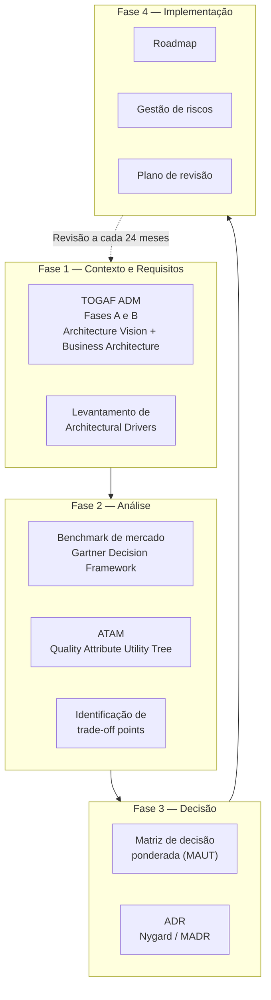
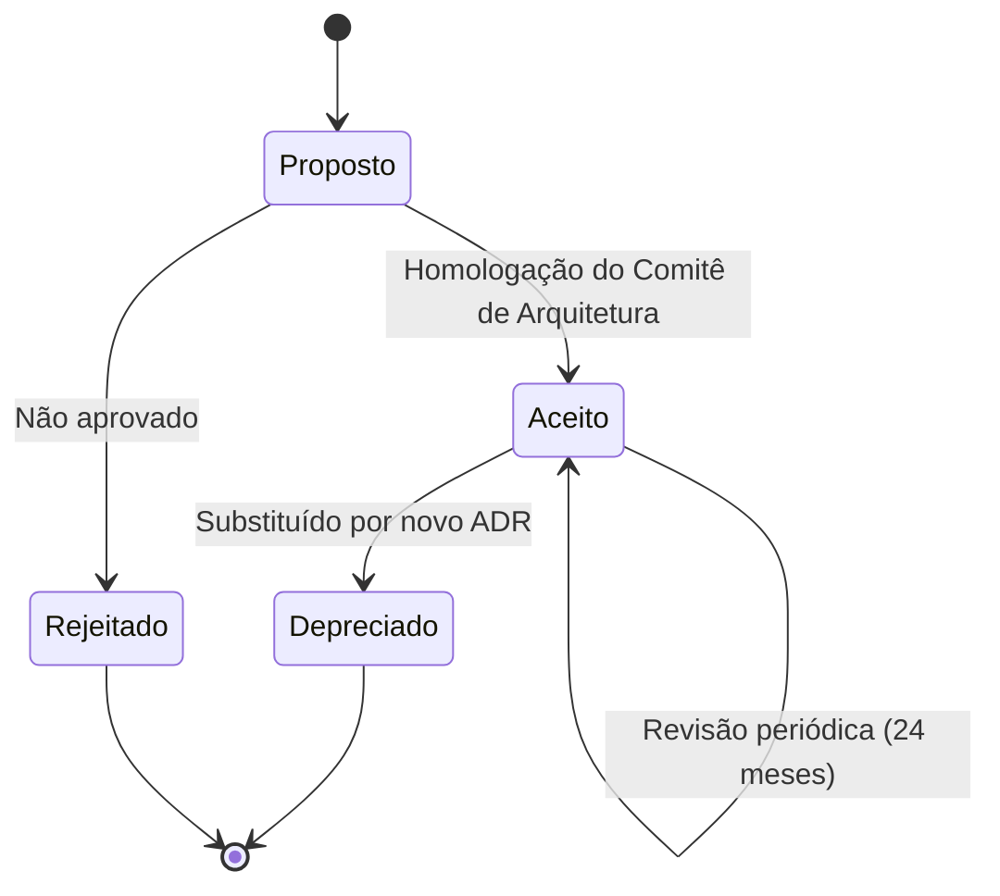

# Estudo Técnico de Arquitetura — Plataforma de Web Analytics para o Governo do Estado de Mato Grosso do Sul

> **Documento de Arquitetura de Soluções**
> **Órgão:** Secretaria-Executiva de Transformação Digital — SETDIG (SEGOV/MS)
> **Versão:** 1.0
> **Data-base das informações:** julho/2026
> **Classificação:** Público / Interno — documento técnico de apoio à decisão
> **Status:** Proposto (aguardando homologação do Comitê de Arquitetura)

---

## Sumário

- [1. Propósito](#1-propósito)
- [2. Escopo](#2-escopo)
- [3. Resumo executivo](#3-resumo-executivo)
- [4. Metodologia](#4-metodologia)
- [5. Índice da documentação](#5-índice-da-documentação)
- [6. Estrutura do repositório](#6-estrutura-do-repositório)
- [7. Convenções editoriais](#7-convenções-editoriais)
- [8. Como publicar (MkDocs / Docusaurus / Wiki)](#8-como-publicar-mkdocs--docusaurus--wiki)
- [9. Ciclo de vida e revisão do documento](#9-ciclo-de-vida-e-revisão-do-documento)
- [10. Nota metodológica sobre preços e dados de fornecedores](#10-nota-metodológica-sobre-preços-e-dados-de-fornecedores)

---

## 1. Propósito

O Governo do Estado de Mato Grosso do Sul opera atualmente o **Matomo** como plataforma de Web Analytics para os portais institucionais, serviços digitais e aplicações web do Estado. Essa adoção, contudo, **não foi precedida de um processo formal de Arquitetura de Soluções** — não há benchmark documentado, análise comparativa estruturada, ADR (Architecture Decision Record) registrado nem estudo de trade-offs entre alternativas de mercado.

Este repositório supre essa lacuna. Ele produz o **artefato arquitetural formal** que:

1. Documenta o contexto, os requisitos e os direcionadores arquiteturais (`architectural drivers`);
2. Realiza benchmark técnico de 10 plataformas obrigatórias + 6 plataformas adjacentes;
3. Aplica uma matriz de decisão ponderada, auditável e reproduzível;
4. Registra a decisão em formato ADR (Michael Nygard / MADR);
5. Estabelece roadmap de implementação e plano de gestão de riscos.

> **📌 Observação**
> Este documento **não valida retroativamente** a escolha existente. A avaliação foi conduzida com o Matomo tratado como **mais uma alternativa entre as demais**, sem peso de status quo na matriz. O resultado da avaliação está em [`docs/09-recomendacao.md`](docs/09-recomendacao.md).

---

## 2. Escopo

### Está no escopo

| Item | Detalhe |
|------|---------|
| Portais institucionais | Portais das Secretarias, autarquias e fundações estaduais |
| Serviços digitais | Serviços transacionais do cidadão (protocolos, agendamentos, consultas) |
| Aplicações web internas | Sistemas administrativos com interface web |
| Analytics de produto | Funis de conversão, jornada do usuário, análise comportamental |
| Integração com BI | Consumo dos dados de analytics por plataformas de BI do Estado |
| Conformidade | LGPD, Lei de Governo Digital, soberania de dados |

### Está fora do escopo

| Item | Motivo |
|------|--------|
| Analytics de aplicativos móveis nativos | Requer estudo específico de SDKs móveis e telemetria offline |
| APM / Observabilidade de infraestrutura | Domínio distinto (Prometheus, Grafana, OpenTelemetry, Zabbix) |
| Monitoramento de redes sociais | Domínio de *social listening*, fora do escopo de Web Analytics |
| CDP / Customer Data Platform | Camada arquitetural superior; pode ser objeto de estudo futuro |
| SEO / Search Console | Ferramentas de motores de busca, não de analytics de propriedade |

---

## 3. Resumo executivo

### 3.1 Resultado da matriz de decisão

| # | Plataforma | Modalidade | Pontuação ponderada | % do máximo |
|---|-----------|-----------|--------------------:|------------:|
| 🥇 1 | **Matomo** | On-Premise (auto-hospedado) | **520 / 600** | **86,7%** |
| 🥈 2 | Plausible | Community Edition (auto-hospedado) | 485 / 600 | 80,8% |
| 🥉 3 | Matomo | Cloud (SaaS, hospedagem UE) | 465 / 600 | 77,5% |
| 3 | Piwik PRO | Private Cloud / On-Premise | 465 / 600 | 77,5% |
| 5 | PostHog | Auto-hospedado (Open Source Edition) | 455 / 600 | 75,8% |
| 6 | Umami | Auto-hospedado | 445 / 600 | 74,2% |
| 7 | PostHog | Cloud EU | 425 / 600 | 70,8% |
| 8 | Google Analytics 4 | SaaS (tier gratuito) | 410 / 600 | 68,3% |
| 9 | Adobe Analytics | SaaS enterprise | 405 / 600 | 67,5% |
| 10 | Microsoft Clarity | SaaS gratuito | 355 / 600 | 59,2% |
| 10 | Simple Analytics | SaaS (hospedagem UE) | 355 / 600 | 59,2% |
| 12 | Cloudflare Web Analytics | SaaS gratuito | 345 / 600 | 57,5% |
| 13 | Open Web Analytics | Auto-hospedado | 330 / 600 | 55,0% |

Memória de cálculo completa e justificativa nota a nota: [`docs/07-matriz-decisao.md`](docs/07-matriz-decisao.md).

### 3.2 Decisão recomendada

> **✅ Bloco de Decisão — ADR-001**
>
> **Manter o Matomo On-Premise como plataforma padrão de Web Analytics do Governo do Estado de MS**, condicionado à execução de um plano de adequação arquitetural (arquitetura de referência, ingestão assíncrona, política de retenção, alta disponibilidade e camada de integração com BI).
>
> **Complemento aprovado:** adoção de **Plausible Community Edition** como camada leve e opcional para portais de conteúdo de alto volume e baixa criticidade analítica, quando o requisito for exclusivamente métrica agregada com custo operacional mínimo.
>
> **Complemento condicionado:** **Microsoft Clarity** pode ser usado apenas de forma temporária e circunscrita, em portais sem tratamento de dado pessoal sensível, e preferencialmente substituído pelo plugin *Heatmaps & Session Recording* do próprio Matomo, eliminando transferência internacional de dados.
>
> Detalhamento: [`docs/08-adr.md`](docs/08-adr.md) e [`docs/09-recomendacao.md`](docs/09-recomendacao.md).

### 3.3 Fundamentos técnicos objetivos da decisão

| Direcionador | Evidência que sustenta o Matomo On-Premise |
|--------------|--------------------------------------------|
| Soberania de dados | Dado bruto persiste em banco MySQL/MariaDB sob custódia do Estado; nenhuma transferência internacional ocorre |
| LGPD (base legal) | Configuração cookieless + anonimização de IP permite operar sob **legítimo interesse** ou dispensa de consentimento, precedente formalizado pela CNIL (França) para o Matomo |
| Vendor lock-in | Licença **GPL v3**; código-fonte auditável; schema de banco documentado; exportação total via API e SQL direto |
| Precedente institucional | **Europa Analytics**, o serviço de analytics da Comissão Europeia, opera sobre Matomo |
| Cobertura funcional | Único candidato auto-hospedado que cobre simultaneamente: funis, heatmaps, session recording, form analytics, A/B testing, dimensões customizadas e Tag Manager nativo |
| Integração com BI | API de relatórios em HTTP/JSON/CSV/XML + acesso direto ao banco para conectores nativos de Power BI, Superset, Metabase e Grafana |
| TCO em 5 anos | Menor TCO entre plataformas com cobertura funcional equivalente — ver [`comparativos/custo.md`](comparativos/custo.md) |

### 3.4 Fragilidades reconhecidas do Matomo

Nenhuma decisão arquitetural é isenta de custo. As fragilidades assumidas estão documentadas em [`docs/06-tradeoffs.md`](docs/06-tradeoffs.md) e [`docs/11-riscos.md`](docs/11-riscos.md):

1. **Arquivamento (`archiving`) é o gargalo estrutural** do Matomo em alto volume — exige tuning de cron, segmentação e, acima de determinado patamar, infraestrutura dedicada.
2. **MySQL/MariaDB não é um banco colunar** — a plataforma perde para arquiteturas baseadas em ClickHouse (Plausible, PostHog, Umami Cloud) em consultas analíticas ad-hoc sobre grandes volumes.
3. **Funcionalidades avançadas são plugins pagos** mesmo na versão On-Premise (Heatmaps, Funnels, A/B Testing, Form Analytics, Media Analytics, Custom Reports).
4. **Sem suporte contratual incluído** na versão On-Premise gratuita — a operação recai sobre a STI da SETDIG, absorvida pelo contrato de gerenciamento de infraestrutura em vigor (P1/P2/R4). O custo marginal é modesto (~R$ 75 k em 5 anos, ~0,1 FTE incremental), mas o **conhecimento** operacional passa a ser ativo do Estado.

---

## 4. Metodologia

O estudo combina quatro arcabouços consolidados:



| Arcabouço | Aplicação neste estudo | Artefato correspondente |
|-----------|------------------------|-------------------------|
| **TOGAF 10 — ADM** | Fases A (Architecture Vision) e B (Business Architecture) para contexto e requisitos | [`docs/01-contexto.md`](docs/01-contexto.md), [`docs/02-requisitos.md`](docs/02-requisitos.md) |
| **ATAM** (SEI/CMU) | Árvore de atributos de qualidade, pontos de sensibilidade e trade-off points | [`docs/03-criterios-de-avaliacao.md`](docs/03-criterios-de-avaliacao.md), [`docs/06-tradeoffs.md`](docs/06-tradeoffs.md) |
| **Gartner Decision Framework** | Critérios ponderados, *must-have* vs. *nice-to-have*, análise de fornecedor | [`docs/03-criterios-de-avaliacao.md`](docs/03-criterios-de-avaliacao.md), [`docs/04-mercado.md`](docs/04-mercado.md) |
| **MAUT** (Multi-Attribute Utility Theory) | Normalização e agregação das notas na matriz de decisão | [`docs/07-matriz-decisao.md`](docs/07-matriz-decisao.md), [`anexos/matriz.md`](anexos/matriz.md) |
| **ADR** (Nygard / MADR 4.0) | Registro formal e versionado da decisão | [`docs/08-adr.md`](docs/08-adr.md) |

### 4.1 Regra de evidência

> **📌 Observação**
> Toda afirmação técnica neste repositório deve ser rastreável a uma fonte primária: documentação oficial do fornecedor, repositório de código-fonte, arquivo de licença, especificação de API, norma técnica ou instrumento normativo. **Blogs, artigos de opinião e conteúdo de marketing não são aceitos como fonte primária** — quando citados, aparecem explicitamente rotulados como fonte secundária.
>
> Fontes consolidadas em [`docs/12-referencias.md`](docs/12-referencias.md).

---

## 5. Índice da documentação

### 📁 `docs/` — Núcleo do estudo

| Documento | Conteúdo |
|-----------|----------|
| [01 — Contexto](docs/01-contexto.md) | Situação atual, motivação, stakeholders, restrições, premissas, arquitetura vigente |
| [02 — Requisitos](docs/02-requisitos.md) | Requisitos funcionais, não funcionais, legais e de negócio (RF/RNF/RL) |
| [03 — Critérios de avaliação](docs/03-criterios-de-avaliacao.md) | Definição, peso e escala de cada critério; árvore de atributos de qualidade |
| [04 — Panorama de mercado](docs/04-mercado.md) | Segmentação do mercado, ciclo de vida, players, tendências, plataformas descartadas |
| [05 — Comparativo detalhado](docs/05-comparativo-detalhado.md) | Tabela mestra comparando as 10+6 plataformas em ~90 dimensões |
| [06 — Trade-offs](docs/06-tradeoffs.md) | Ganhos, perdas, custos ocultos, riscos, dependências, curva de aprendizado |
| [07 — Matriz de decisão](docs/07-matriz-decisao.md) | Matriz ponderada com justificativa nota a nota e análise de sensibilidade |
| [08 — ADR](docs/08-adr.md) | Architecture Decision Record formal (ADR-001) |
| [09 — Recomendação](docs/09-recomendacao.md) | Recomendação fundamentada com arquitetura-alvo |
| [10 — Roadmap](docs/10-roadmap.md) | Plano de implementação em ondas, marcos e critérios de aceite |
| [11 — Riscos](docs/11-riscos.md) | Registro de riscos com probabilidade, impacto, resposta e responsável |
| [12 — Referências](docs/12-referencias.md) | Bibliografia completa, normativos, documentação oficial |

### 📁 `plataformas/` — Fichas técnicas individuais

| Plataforma | Licença | Modelo | Ficha |
|-----------|---------|--------|-------|
| Matomo | GPL v3 | Open Source / SaaS | [matomo.md](plataformas/matomo.md) |
| Google Analytics 4 | Proprietária | SaaS | [google-analytics.md](plataformas/google-analytics.md) |
| Plausible | AGPL v3 | Open Source / SaaS | [plausible.md](plataformas/plausible.md) |
| Umami | MIT | Open Source / SaaS | [umami.md](plataformas/umami.md) |
| Open Web Analytics | GPL v2 | Open Source | [open-web-analytics.md](plataformas/open-web-analytics.md) |
| Adobe Analytics | Proprietária | SaaS enterprise | [adobe-analytics.md](plataformas/adobe-analytics.md) |
| Simple Analytics | Proprietária | SaaS | [simple-analytics.md](plataformas/simple-analytics.md) |
| Microsoft Clarity | Proprietária (`clarity-js` MIT) | SaaS gratuito | [microsoft-clarity.md](plataformas/microsoft-clarity.md) |
| Cloudflare Web Analytics | Proprietária | SaaS gratuito | [cloudflare-web-analytics.md](plataformas/cloudflare-web-analytics.md) |
| PostHog | MIT + EE proprietária | Open Source / SaaS | [posthog.md](plataformas/posthog.md) |

### 📁 `comparativos/` — Cortes transversais

| Corte | Conteúdo |
|-------|----------|
| [Custo](comparativos/custo.md) | Modelagem de TCO 5 anos, CAPEX/OPEX, custos ocultos |
| [LGPD](comparativos/lgpd.md) | Bases legais, transferência internacional, DPIA, direitos do titular |
| [API](comparativos/api.md) | Superfície de API, autenticação, limites, exemplos de código |
| [Infraestrutura](comparativos/infraestrutura.md) | Stack, banco, containers, Kubernetes, HA, DR |
| [Escalabilidade](comparativos/escalabilidade.md) | Limites conhecidos, estratégias de escala, benchmarks |
| [Governança](comparativos/governanca.md) | Lock-in, portabilidade, transparência, auditoria, soberania |
| [Matomo × PostHog (bilateral)](comparativos/matomo-vs-posthog.md) | Duelo direto entre os dois candidatos auto-hospedados de maior pontuação |

### 📁 `anexos/`

| Anexo | Conteúdo |
|-------|----------|
| [Matriz (planilha)](anexos/matriz.md) | Matriz de decisão em formato tabular exportável para XLSX/CSV |
| [Benchmark](anexos/benchmark.md) | Metodologia de benchmark, cenários de carga, resultados |
| [Glossário](anexos/glossario.md) | Definição de termos técnicos e siglas |

---

## 6. Estrutura do repositório

```
analytics-platform-study/
│
├── README.md                          # Este arquivo — índice principal
├── mkdocs.yml                         # Configuração MkDocs (gerada — ver seção 8)
│
├── docs/
│   ├── 01-contexto.md
│   ├── 02-requisitos.md
│   ├── 03-criterios-de-avaliacao.md
│   ├── 04-mercado.md
│   ├── 05-comparativo-detalhado.md
│   ├── 06-tradeoffs.md
│   ├── 07-matriz-decisao.md
│   ├── 08-adr.md
│   ├── 09-recomendacao.md
│   ├── 10-roadmap.md
│   ├── 11-riscos.md
│   └── 12-referencias.md
│
├── plataformas/
│   ├── matomo.md
│   ├── google-analytics.md
│   ├── plausible.md
│   ├── umami.md
│   ├── open-web-analytics.md
│   ├── adobe-analytics.md
│   ├── simple-analytics.md
│   ├── microsoft-clarity.md
│   ├── cloudflare-web-analytics.md
│   └── posthog.md
│
├── comparativos/
│   ├── custo.md
│   ├── lgpd.md
│   ├── api.md
│   ├── infraestrutura.md
│   ├── escalabilidade.md
│   └── governanca.md
│
└── anexos/
    ├── matriz.md
    ├── benchmark.md
    └── glossario.md
```

---

## 7. Convenções editoriais

### 7.1 Blocos semânticos

Este repositório usa **blocos em citação com rótulo explícito**, e não sintaxe de admonition proprietária. Motivo: a sintaxe de `> [!NOTE]` do GitHub e a sintaxe `!!! note` do MkDocs Material são incompatíveis entre si. Blocos em citação com emoji renderizam **identicamente** em GitHub, Azure DevOps Wiki, MkDocs, Docusaurus e em qualquer conversor Markdown padrão.

| Bloco | Sintaxe | Uso |
|-------|---------|-----|
| Observação | `> **📌 Observação**` | Contexto adicional, esclarecimento, nota de rodapé |
| Decisão | `> **✅ Bloco de Decisão**` | Registro de decisão arquitetural |
| Risco | `> **⚠️ Bloco de Risco**` | Risco identificado, com impacto e mitigação |
| Alerta | `> **🚨 Alerta**` | Impedimento, vulnerabilidade conhecida, bloqueio legal |
| Evidência | `> **🔍 Evidência**` | Fato verificável com fonte primária citada |

### 7.2 Terminologia

- **Plataforma** — o produto de analytics em si (ex.: Matomo).
- **Modalidade** — forma de entrega (On-Premise, Cloud/SaaS, Private Cloud).
- **Instância** — implantação concreta de uma plataforma.
- **Propriedade / Site** — unidade de rastreamento dentro de uma instância.

### 7.3 Escala de notas

Todas as notas do estudo usam escala inteira de **1 a 5**, definida em [`docs/03-criterios-de-avaliacao.md`](docs/03-criterios-de-avaliacao.md). Não há meia-nota. Cada nota atribuída possui justificativa textual obrigatória em [`docs/07-matriz-decisao.md`](docs/07-matriz-decisao.md).

### 7.4 Links

Todos os links internos são **relativos**, garantindo funcionamento em GitHub, Azure DevOps Wiki, MkDocs e Docusaurus sem reescrita.

---

## 8. Como publicar (MkDocs / Docusaurus / Wiki)

### 8.1 MkDocs Material

Criar `mkdocs.yml` na raiz:

```yaml
site_name: Estudo de Plataforma de Web Analytics — SETDIG/MS
site_description: Estudo técnico de arquitetura para seleção de plataforma de Web Analytics
docs_dir: .
site_dir: ../_site

theme:
  name: material
  language: pt-BR
  features:
    - navigation.tabs
    - navigation.sections
    - navigation.top
    - content.code.copy
    - toc.follow
  palette:
    - scheme: default
      toggle: { icon: material/weather-night, name: Modo escuro }
    - scheme: slate
      toggle: { icon: material/weather-sunny, name: Modo claro }

markdown_extensions:
  - admonition
  - attr_list
  - tables
  - toc: { permalink: true }
  - pymdownx.superfences:
      custom_fences:
        - name: mermaid
          class: mermaid
          format: !!python/name:pymdownx.superfences.fence_code_format

plugins:
  - search:
      lang: pt

nav:
  - Início: README.md
  - Estudo:
      - Contexto: docs/01-contexto.md
      - Requisitos: docs/02-requisitos.md
      - Critérios: docs/03-criterios-de-avaliacao.md
      - Mercado: docs/04-mercado.md
      - Comparativo: docs/05-comparativo-detalhado.md
      - Trade-offs: docs/06-tradeoffs.md
      - Matriz de decisão: docs/07-matriz-decisao.md
      - ADR: docs/08-adr.md
      - Recomendação: docs/09-recomendacao.md
      - Roadmap: docs/10-roadmap.md
      - Riscos: docs/11-riscos.md
      - Referências: docs/12-referencias.md
  - Plataformas:
      - Matomo: plataformas/matomo.md
      - Google Analytics 4: plataformas/google-analytics.md
      - Plausible: plataformas/plausible.md
      - Umami: plataformas/umami.md
      - Open Web Analytics: plataformas/open-web-analytics.md
      - Adobe Analytics: plataformas/adobe-analytics.md
      - Simple Analytics: plataformas/simple-analytics.md
      - Microsoft Clarity: plataformas/microsoft-clarity.md
      - Cloudflare Web Analytics: plataformas/cloudflare-web-analytics.md
      - PostHog: plataformas/posthog.md
  - Comparativos:
      - Custo: comparativos/custo.md
      - LGPD: comparativos/lgpd.md
      - API: comparativos/api.md
      - Infraestrutura: comparativos/infraestrutura.md
      - Escalabilidade: comparativos/escalabilidade.md
      - Governança: comparativos/governanca.md
  - Anexos:
      - Matriz: anexos/matriz.md
      - Benchmark: anexos/benchmark.md
      - Glossário: anexos/glossario.md
```

Executar:

```bash
pip install mkdocs-material && mkdocs serve
```

### 8.2 Docusaurus

Os arquivos são compatíveis com Docusaurus v3 sem alteração de conteúdo. É necessário apenas adicionar *front matter* YAML no topo de cada arquivo (`id`, `title`, `sidebar_position`) e habilitar `@docusaurus/theme-mermaid`.

```bash
npm install --save @docusaurus/theme-mermaid
```

### 8.3 Azure DevOps Wiki

Publicar via *Publish code as wiki*, apontando para a pasta `analytics-platform-study/`. O Azure DevOps Wiki renderiza tabelas, Mermaid (com bloco ```` ```mermaid ````) e links relativos nativamente. Adicionar um arquivo `.order` em cada diretório para controlar a ordenação da árvore lateral.

### 8.4 GitHub

Nenhuma configuração adicional. Tabelas, Mermaid e links relativos são suportados nativamente pelo renderizador do GitHub.

---

## 9. Ciclo de vida e revisão do documento



| Versão | Data | Autor | Alteração |
|--------|------|-------|-----------|
| 1.0 | 2026-07-29 | Arquitetura de Soluções — SETDIG | Emissão inicial do estudo |

**Gatilhos de revisão antecipada** (fora do ciclo de 24 meses):

1. Mudança de licenciamento de qualquer plataforma recomendada (ex.: relicenciamento de GPL para licença restritiva);
2. Manifestação da ANPD sobre uso de analytics de terceiros no setor público;
3. Descontinuidade ou aquisição de fornecedor de plataforma adotada;
4. Crescimento de volume superior a 5× a linha de base do último benchmark;
5. Nova exigência normativa federal ou estadual sobre soberania de dados.

---

## 10. Nota metodológica sobre preços e dados de fornecedores

> **⚠️ Bloco de Risco — Volatilidade das informações comerciais**
>
> Os valores de licenciamento, planos e limites de uso citados neste estudo refletem a documentação pública dos fornecedores na **data-base de julho/2026** e estão sujeitos a alteração unilateral sem aviso.
>
> **Regras de uso destas informações:**
> 1. Valores de plataformas SaaS de mercado (Plausible, Umami, Simple Analytics, PostHog, Matomo Cloud) são **listas públicas de preço**, verificáveis nas URLs indicadas em [`docs/12-referencias.md`](docs/12-referencias.md).
> 2. Valores de plataformas enterprise (Adobe Analytics, Google Analytics 360, Piwik PRO Enterprise) **não são publicados** — são negociados por contrato. As faixas indicadas são estimativas de mercado e estão explicitamente rotuladas como tal. **Não devem ser usadas em peça de licitação sem cotação formal.**
> 3. Custos de infraestrutura são modelados sobre a infraestrutura própria do Estado, com premissas explicitadas em [`comparativos/custo.md`](comparativos/custo.md).
> 4. Custos de equipe usam bandas salariais de referência do mercado de TI público, não valores efetivos da folha da SETDIG.
>
> **Antes de qualquer processo de contratação, os valores devem ser reconfirmados por cotação formal ou consulta ao fornecedor.**

---

## Licença deste estudo

Este documento é produzido pela Secretaria-Executiva de Transformação Digital — SETDIG, e destina-se ao uso da Administração Pública Estadual. Recomenda-se publicação sob **CC BY 4.0** para permitir reuso por outros entes federativos, alinhado aos princípios de transparência da Lei nº 14.129/2021 (Lei do Governo Digital).
