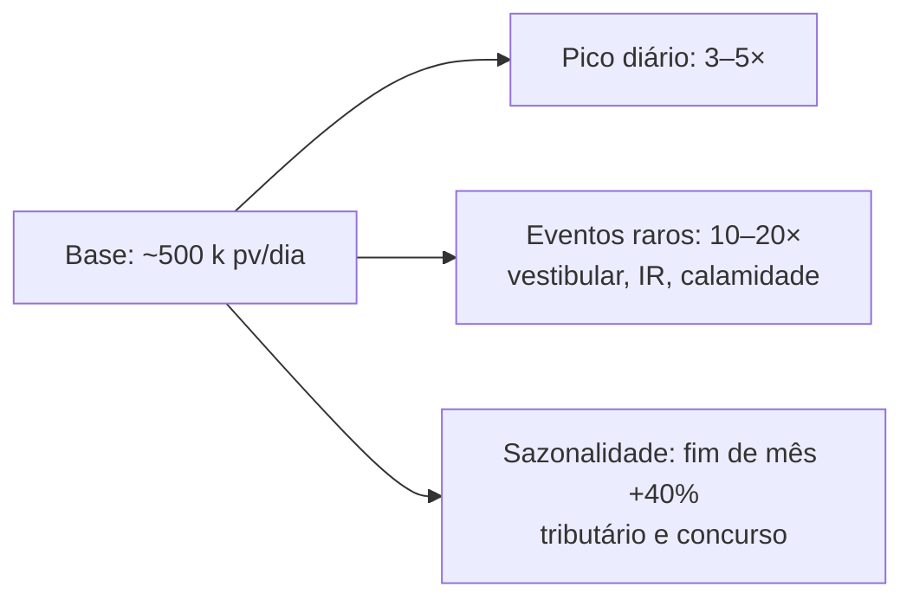

# Comparativo — Escalabilidade

> **Corte transversal** · Foco: limites conhecidos, estratégias de escala horizontal/vertical, benchmarks públicos
> [← Voltar ao índice](../README.md) · [Matriz de decisão](../docs/07-matriz-decisao.md)

---

## Sumário

- [1. Envelope de volume esperado](#1-envelope-de-volume-esperado)
- [2. Matriz sinóptica](#2-matriz-sinóptica)
- [3. Estratégias de escala](#3-estratégias-de-escala)
- [4. Gargalos conhecidos por plataforma](#4-gargalos-conhecidos-por-plataforma)
- [5. Benchmarks públicos e projeções](#5-benchmarks-públicos-e-projeções)
- [6. Latência típica](#6-latência-típica)
- [7. Recomendação](#7-recomendação)

---

## 1. Envelope de volume esperado

### 1.1 Estimativa para o Estado

| Métrica | Valor projetado |
|---------|:---------------:|
| Portais monitorados (5 anos) | ~200 |
| Page views agregados (mês 1) | ~5 milhões |
| Page views agregados (mês 60) | ~40 milhões |
| Eventos ingeridos por dia (média) | ~500 mil |
| Eventos ingeridos por dia (pico — evento de vestibular / declaração de IR) | ~5 milhões |
| Retenção de eventos brutos (política proposta) | 6 meses |
| Retenção de agregados | 24 meses |
| Volume total de dado bruto em 5 anos | ~5 bilhões de linhas |

### 1.2 Perfil de tráfego

O padrão típico governamental **não é uniforme**: picos concentrados em datas conhecidas (fim de mês, publicação de edital, vestibular, calamidade pública) definem o dimensionamento de pico, não a média.

---

## 2. Matriz sinóptica

| Plataforma | Escala horizontal (app) | Escala horizontal (banco) | Volume comprovado | Gargalo estrutural |
|-----------|:-----------------------:|:-------------------------:|:-----------------:|--------------------|
| **Matomo** | 🟢 Múltiplos pods | 🟠 Read replicas + particionamento | > 1 bilhão de ações/mês (referência: Comissão Europeia) | Arquivamento (`archive.php`) sob alto volume |
| Plausible CE | 🟢 | 🟢 Sharding ClickHouse | > 500 M eventos/mês (referência: plausible.io) | Cluster ClickHouse (competência operacional) |
| Umami | 🔴 Single-instance | 🟠 Depende do banco | ~100 M eventos/mês (referência: casos comunitários) | Falta de HA nativa |
| PostHog | 🟢 | 🟢 Sharding ClickHouse + Kafka | > 10 bilhões de eventos/mês (referência: cases do fornecedor) | Complexidade Kafka + ClickHouse |
| Adobe | 🟢 (gerido) | 🟢 (gerido) | Enterprise-scale | N/A (SaaS) |
| GA4 | 🟢 (gerido) | 🟢 (gerido) | Escala Google | N/A |
| Simple Analytics | 🟢 (gerido) | 🟢 (gerido) | Não publicado | N/A |
| Clarity | 🟢 (gerido) | 🟢 (gerido) | > 3 milhões de sites | N/A |
| Cloudflare | 🟢 (edge) | 🟢 (edge) | Escala Cloudflare | N/A |
| OWA | 🔴 | 🔴 | ~10 M eventos/mês | Projeto estagnado, sem otimização recente |

---

## 3. Estratégias de escala

### 3.1 Matomo

**Escala horizontal (aplicação):**

1. Múltiplos pods `matomo` atrás de load balancer.
2. Sessão em Redis compartilhado.
3. `archive.php` em pod dedicado (sem tráfego).

**Escala vertical (banco):**

1. MariaDB/MySQL primary com CPU/RAM ajustados ao volume.
2. Read replicas para consultas de relatório.
3. Particionamento de tabelas de log por mês.
4. Índices ajustados por segmentação frequente.

**Escala do arquivamento:**

1. Aumentar frequência do `core:archive` (default 1 h → 15 min sob volume).
2. Segmentar arquivamento por site (`--force-idsites`).
3. Executar arquivamento em nó dedicado com mais CPU.

> **⚠️ Bloco de Risco — arquivamento é o gargalo estrutural do Matomo**
> Documentação oficial do Matomo classifica *archiving* como o principal ponto de tuning em alto volume. Um site com 50 M ações/mês pode exigir job de arquivamento rodando quase continuamente. Estratégias: (a) segmentação, (b) hardware dedicado, (c) desativar plugins pesados na coleta.

### 3.2 Plausible CE

**Aplicação:** Elixir + BEAM VM é naturalmente concorrente. Múltiplas réplicas escalam bem.

**Banco:** ClickHouse escala por sharding. Para volume estadual, uma única instância ClickHouse bem dimensionada (16 GB RAM, SSD NVMe) sustenta ~10 bilhões de linhas com folga.

### 3.3 Umami

Escala vertical apenas. Modelo *single-instance* significa que atinge teto quando uma única VM não suporta mais o volume. Aplicável a portais pequenos e médios; **não é a plataforma primária adequada para o parque estadual**.

### 3.4 PostHog

Escala nativa em Kubernetes. Todos os componentes têm réplicas horizontais. Kafka absorve picos e desacopla ingestão do processamento — vantagem em cenário de tráfego irregular como o governamental. **Custo:** operar o stack completo exige competência dedicada.

### 3.5 SaaS (GA4, Adobe, Clarity, Cloudflare, Simple, Umami Cloud, PostHog Cloud, Matomo Cloud)

Escala é responsabilidade do fornecedor. Para o Estado, a preocupação **não é técnica**, é **custo** — a maioria dos SaaS cobra por volume ingerido, e o crescimento de portais implica crescimento linear de custo.

---

## 4. Gargalos conhecidos por plataforma

| Plataforma | Gargalo | Sintoma | Mitigação |
|-----------|---------|---------|-----------|
| Matomo | Arquivamento | Relatórios atrasados; job de archive travando | Segmentar por site; nó dedicado; ajustar `archive_max_workers` |
| Matomo | Escrita concorrente | Deadlocks em `matomo_log_visit` | Configurar `enable_php_process_functions`; usar Queue |
| Matomo | Segmentação em tempo real | Consultas ad-hoc lentas | Pré-agregar segmentos frequentes; cache Redis |
| Plausible | Ingestão sob rajada | Perda de eventos sem buffer | Frontend com fila (Elixir mailboxes) mitiga, mas para picos extremos requer Kafka na frente |
| Umami | Escrita | Perda de eventos em pico | Sem mitigação estrutural — plataforma não escala além do single-instance |
| PostHog | ClickHouse sob queries pesadas | Dashboards lentos | Materialize views; particionamento por data |
| PostHog | Session replay | Consumo de disco enorme (~50 GB/mês para 100 k sessões) | Reduzir sampling; retenção agressiva |
| GA4 | Amostragem em relatórios grandes | Métricas amostradas em vez de completas | Exportar para BigQuery e consultar SQL |
| Adobe | Latência de processamento (2–24 h) | Dashboards não são real-time | Real-Time Reporting API para casos específicos |

---

## 5. Benchmarks públicos e projeções

### 5.1 Casos institucionais de referência

| Plataforma | Caso | Volume declarado | Fonte |
|-----------|------|:----------------:|-------|
| Matomo | Comissão Europeia (Europa Analytics) | Bilhões de ações/mês agregadas | webanalytics.ec.europa.eu |
| Matomo | ONU / UNESCO (portais) | Não divulgado | Marketplace + press releases Matomo |
| Plausible | plausible.io (self) | ~500 M eventos/mês | Blog público do fornecedor |
| PostHog | Y Combinator portfolio (múltiplos) | Bilhões/mês agregados | Cases do fornecedor |
| GA4 | Alexa Top 1M | Escala Google | Documentação Google |

### 5.2 Projeção para o Estado — Matomo On-Premise

| Ano | Portais | PV/dia (média) | PV/dia (pico) | Ações agregadas/mês |
|:---:|:-------:|:--------------:|:-------------:|:-------------------:|
| 1 | 60 | 500.000 | 2.500.000 | ~15 M |
| 2 | 100 | 800.000 | 4.000.000 | ~24 M |
| 3 | 140 | 1.200.000 | 6.000.000 | ~36 M |
| 4 | 180 | 1.600.000 | 8.000.000 | ~48 M |
| 5 | 200 | 2.000.000 | 10.000.000 | ~60 M |

**Conclusão:** volume de pico do ano 5 (~60 M ações/mês) está bem abaixo do teto documentado do Matomo (bilhões/mês). Dimensionamento inicial de 3 pods + MariaDB gerenciado (4 vCPU / 16 GB RAM) suporta com folga; expansão vertical + read replicas cobre o crescimento sem migração de plataforma.

---

## 6. Latência típica

### 6.1 Latência de coleta (do beacon ao dashboard)

| Plataforma | Latência típica |
|-----------|:---------------:|
| Matomo | ~1 min (sem arquivamento) ou ~15 min (com arquivamento default) |
| Plausible | ~30 s (real time nativo) |
| Umami | ~30 s |
| PostHog | ~10 s (com Kafka na frente) |
| GA4 | ~1–4 h (relatórios padrão) / ~30 min (Real-Time Reporting) |
| Adobe Analytics | ~1 h (padrão) / real-time em relatórios específicos |
| Simple Analytics | ~1 min |
| Clarity | ~2 h |
| Cloudflare | Real time (dashboard) |

### 6.2 Latência de coleta (impacto no navegador)

Referência: mesma medição em [`comparativos/api.md`](api.md) §6 nas fichas individuais. Resumo:

| Plataforma | Peso do script (gzip) | Impacto em LCP |
|-----------|:---------------------:|:--------------:|
| Cloudflare beacon | 7 KB | Desprezível |
| Simple Analytics | 3 KB | Desprezível |
| Plausible | 1 KB | Desprezível |
| Umami | 2 KB | Desprezível |
| Matomo | 22 KB | < 50 ms |
| GA4 | 45 KB | 50–150 ms |
| PostHog | 55 KB | 50–200 ms |
| Adobe (Web SDK) | 60+ KB | 100–300 ms |
| Clarity | 35 KB | 40–120 ms |

---

## 7. Recomendação

> **✅ Bloco de Decisão — envelope de escala**
>
> O volume projetado do parque estadual (~60 M ações/mês no ano 5) **cabe folgadamente** dentro do envelope técnico do Matomo On-Premise sem sharding e sem infraestrutura exótica.
>
> **Consequência arquitetural:** a decisão de plataforma **não é limitada por escala** — todas as candidatas viáveis (Matomo, Plausible, PostHog) suportam com folga. A escolha é ditada por soberania, custo e cobertura funcional, não por capacidade.
>
> **Contingência:** caso o parque cresça uma ordem de grandeza acima do previsto (~500 M ações/mês, cenário federal), o gargalo do arquivamento do Matomo torna-se material. Estratégia: (a) escalar verticalmente o job de archive, (b) segmentar sites em instâncias dedicadas, (c) em caso extremo, avaliar migração de complementos para Plausible/PostHog para portais de alto volume — mantendo Matomo como plataforma primária de recursos avançados.

Referências de benchmark: [`anexos/benchmark.md`](../anexos/benchmark.md).
Custos de escala: [`comparativos/custo.md`](custo.md) §5.
Roadmap de expansão: [`docs/10-roadmap.md`](../docs/10-roadmap.md).
