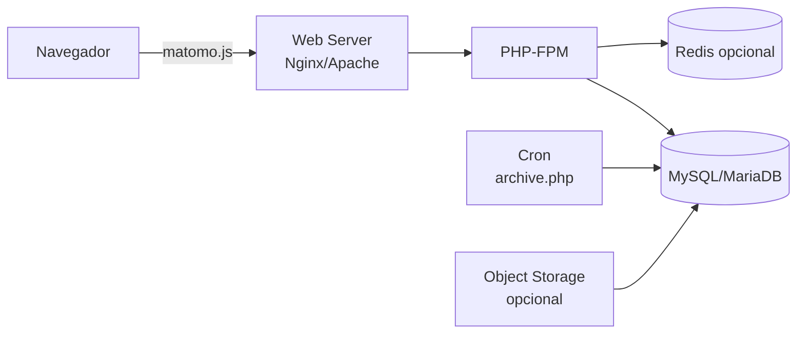
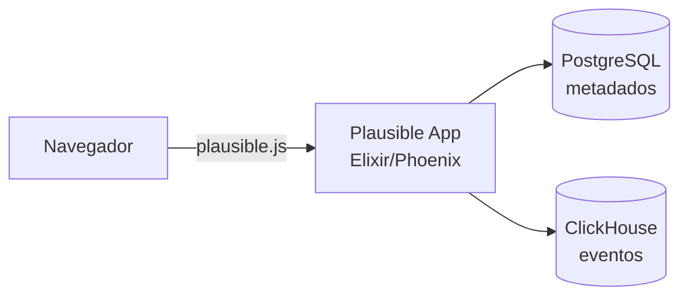
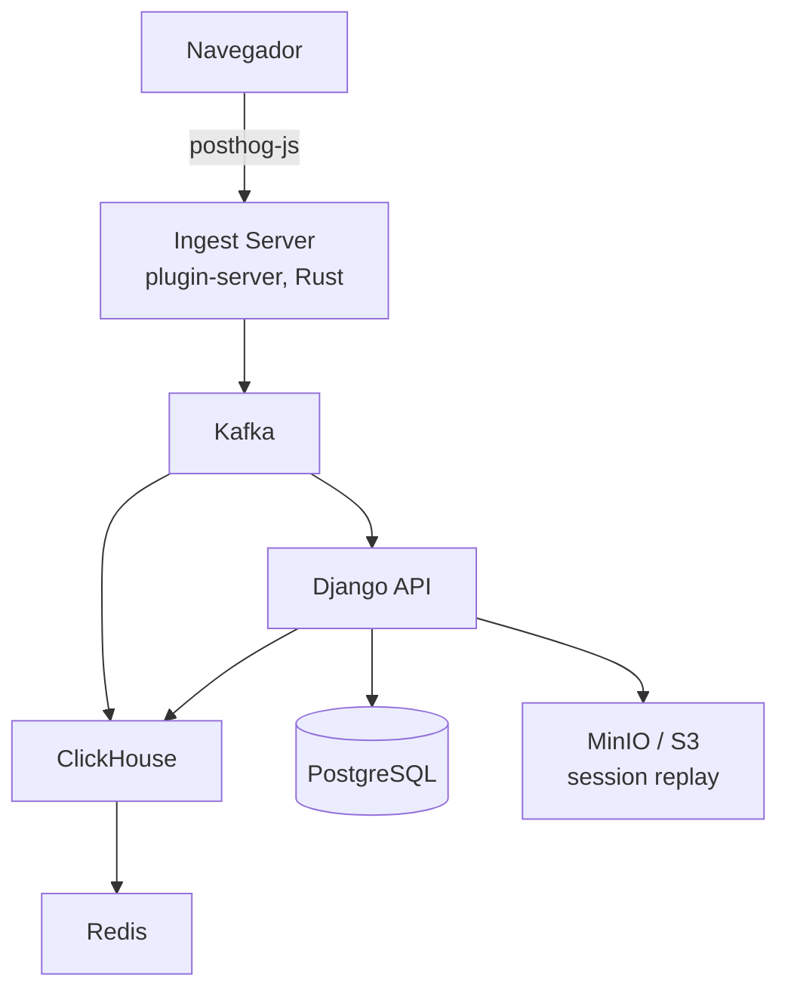
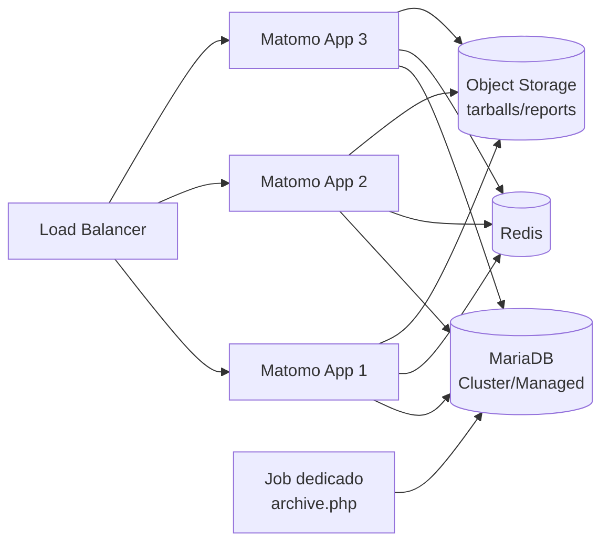
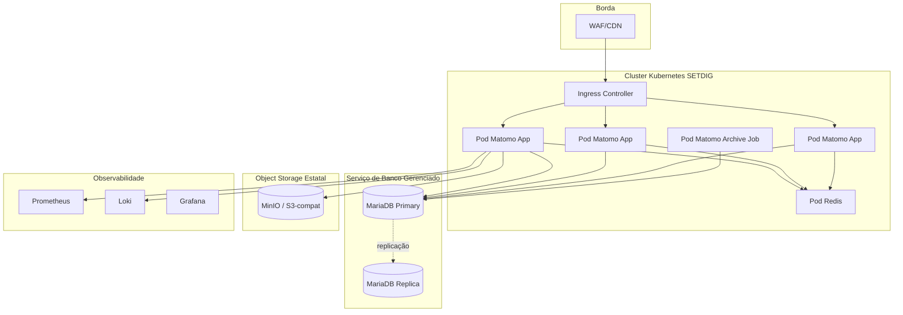

# Comparativo — Infraestrutura, banco e implantação

> **Corte transversal** · Foco: stack técnico, banco, containers, Kubernetes, HA, DR
> [← Voltar ao índice](../README.md) · [Matriz de decisão](../docs/07-matriz-decisao.md)

---

## Sumário

- [1. Dimensões avaliadas](#1-dimensões-avaliadas)
- [2. Matriz sinóptica](#2-matriz-sinóptica)
- [3. Stack técnico por plataforma](#3-stack-técnico-por-plataforma)
- [4. Banco de dados](#4-banco-de-dados)
- [5. Containerização e Kubernetes](#5-containerização-e-kubernetes)
- [6. Alta disponibilidade e cluster](#6-alta-disponibilidade-e-cluster)
- [7. Backup e Disaster Recovery](#7-backup-e-disaster-recovery)
- [8. Observabilidade](#8-observabilidade)
- [9. Arquitetura de referência recomendada](#9-arquitetura-de-referência-recomendada)
- [10. Recomendação](#10-recomendação)

---

## 1. Dimensões avaliadas

| Dimensão | O que é avaliado |
|----------|-----------------|
| Stack técnico | Linguagens, frameworks, dependências |
| Banco | Tipo, versões suportadas, complexidade operacional |
| Cache | Solução declarada e alternativas |
| Container | Imagem oficial, `docker-compose` |
| Kubernetes | Helm chart oficial, operador |
| HA | Modo cluster, replicação, *leader election* |
| Backup | Estratégia declarada |
| DR | Cross-região, RPO/RTO típicos |
| Observabilidade | Métricas, logs, integração com stack SETDIG |

---

## 2. Matriz sinóptica

| Plataforma | Modalidade | Linguagem | Banco | Cache | Docker oficial | Helm oficial | HA nativo | Complexidade |
|-----------|-----------|-----------|-------|-------|:--------------:|:------------:|:---------:|:------------:|
| **Matomo** | On-Premise | PHP 8+ | MySQL 8 / MariaDB 10.5+ | Redis (opcional) | 🟢 | 🟠 chart comunidade | 🟠 Ativo-passivo padrão | 🟢 Baixa-média |
| Plausible CE | On-Premise | Elixir/Phoenix | PostgreSQL 15+ + ClickHouse 22+ | ETS interno | 🟢 | 🟠 chart comunidade | 🟠 Requer setup manual | 🟠 Média |
| Umami | On-Premise | Node.js (Next.js) | PostgreSQL / MySQL / ClickHouse | Nenhum externo | 🟢 | ❌ | ❌ Single-instance | 🟢 Muito baixa |
| PostHog | On-Premise | Python (Django) + TS + Rust | PostgreSQL + ClickHouse + Kafka + Redis + MinIO | Redis + ClickHouse | 🟢 (dev) | 🟢 | 🟢 (via K8s + réplicas de ClickHouse) | 🔴 Alta |
| Adobe | SaaS | N/A | N/A | N/A | N/A | N/A | N/A (gerido) | N/A |
| GA4 | SaaS | N/A | N/A | N/A | N/A | N/A | N/A (gerido) | N/A |
| Simple Analytics | SaaS | N/A | N/A | N/A | N/A | N/A | N/A (gerido) | N/A |
| Microsoft Clarity | SaaS | N/A | N/A | N/A | N/A | N/A | N/A (gerido) | N/A |
| Cloudflare | SaaS | N/A | N/A | N/A | N/A | N/A | N/A (gerido) | N/A |
| Open Web Analytics | On-Premise | PHP 7 (legacy) | MySQL 5.7+ | Nenhum | 🟠 comunidade | ❌ | ❌ | 🟠 Média — projeto estagnado |

---

## 3. Stack técnico por plataforma

### 3.1 Matomo

- Linguagem: PHP 8.0+
- Web server: Nginx ou Apache
- Application server: PHP-FPM
- Job scheduler: cron (arquivamento periódico via `console core:archive`)
- Requisitos mínimos: 2 vCPU, 4 GB RAM, 20 GB disco para instalação básica
- Requisitos recomendados (portal médio, 500 k pv/mês): 4 vCPU, 8 GB RAM, DB gerenciado 100 GB

### 3.2 Plausible Community Edition

- Linguagem: Elixir + BEAM VM
- Dois bancos obrigatórios: PostgreSQL (metadados) + ClickHouse (eventos)
- Requisitos mínimos: 2 vCPU, 4 GB RAM para o app; ClickHouse ~4 vCPU, 8 GB RAM

### 3.3 Umami

- Linguagem: TypeScript (Next.js)
- Banco único (opções): PostgreSQL, MySQL ou ClickHouse
- Requisitos mínimos: 1 vCPU, 1 GB RAM
- Modelo *single-instance* — não há clusterização nativa

### 3.4 PostHog

- Componentes: Django (API), Rust (plugin-server), Kafka (streaming), ClickHouse (eventos), PostgreSQL (metadados), Redis (cache), MinIO/S3 (session replay), Zookeeper (Kafka + ClickHouse coordination)
- Requisitos mínimos produção: 8+ nós Kubernetes; ClickHouse dedicado (mín. 16 GB RAM, disco SSD rápido)
- Documentação oficial desencoraja Docker Compose em produção

### 3.5 Open Web Analytics

- Linguagem: PHP 7 (compatibilidade PHP 8 parcial)
- Banco: MySQL 5.7+ (não certificado para MySQL 8+ recente)
- Projeto estagnado: releases esparsas, dependências desatualizadas
- **Risco de segurança** por dependências não atualizadas

---

## 4. Banco de dados

### 4.1 Matriz por plataforma

| Plataforma | Banco primário | Banco secundário | Colunar? | Escalabilidade típica |
|-----------|----------------|------------------|:--------:|:---------------------:|
| Matomo | MySQL 8 / MariaDB 10.5+ | Redis (cache) | ❌ | Alta (com particionamento) |
| Plausible | ClickHouse | PostgreSQL (metadados) | 🟢 (ClickHouse) | Muito alta |
| Umami | PostgreSQL 13+ / MySQL 8 / ClickHouse | — | 🟠 (opcional) | Média |
| PostHog | ClickHouse | PostgreSQL | 🟢 | Muito alta |
| OWA | MySQL 5.7 | — | ❌ | Baixa-média |

### 4.2 MySQL/MariaDB versus ClickHouse

| Aspecto | MySQL/MariaDB | ClickHouse |
|---------|---------------|-----------|
| Modelo | OLTP row-based | OLAP colunar |
| Consulta ad-hoc sobre bilhões de linhas | 🔴 Lenta | 🟢 Rápida |
| Consulta pré-agregada | 🟢 Rápida | 🟢 Rápida |
| Escrita transacional | 🟢 ACID | 🟠 Eventual consistency |
| Familiaridade do time SETDIG | 🟢 Alta | 🟠 Média |
| Fornecedores de banco gerenciado no Brasil | 🟢 Múltiplos | 🟠 Limitados |
| Ferramentas de backup | 🟢 Maduras | 🟠 Requer `clickhouse-backup` ou snapshot |

> **📌 Observação — a escolha de banco define o teto de escala**
> Matomo em MySQL/MariaDB escala bem por particionamento e arquivamento periódico, mas atinge limite em consultas ad-hoc sobre dado bruto acima de ~10 bilhões de linhas. Plataformas ClickHouse (Plausible, PostHog) escalam confortavelmente uma ordem de grandeza acima. Isso não é problema para o volume estadual estimado (< 5 bilhões de linhas em 5 anos), mas é fator a considerar em cenário federal.

---

## 5. Containerização e Kubernetes

### 5.1 Imagens oficiais e Helm charts

| Plataforma | Imagem Docker oficial | Docker Compose | Helm chart oficial | Operador Kubernetes |
|-----------|:---------------------:|:--------------:|:-------------------:|:-------------------:|
| Matomo | 🟢 `matomo:latest` (Docker Hub) | 🟢 | 🟠 comunidade (`matomo-analytics/matomo`) | ❌ |
| Plausible | 🟢 `plausible/analytics` | 🟢 | 🟠 comunidade (`plausible-community/helm`) | ❌ |
| Umami | 🟢 `umamisoftware/umami` | 🟢 | 🟠 comunidade | ❌ |
| PostHog | 🟢 (via `docker-compose.hobby.yml`) | 🟠 apenas para POC | 🟢 `posthog/helm-charts` | ❌ |
| OWA | 🟠 comunidade | 🟠 | ❌ | ❌ |

### 5.2 Modelo de implantação recomendado por plataforma

| Plataforma | Sugestão |
|-----------|----------|
| Matomo (portal médio) | Docker Compose em VM dedicada + DB gerenciado |
| Matomo (parque grande) | Kubernetes (deployment + HPA) + DB gerenciado + Redis + object storage |
| Plausible | Kubernetes com Helm; ClickHouse gerenciado ou dedicado |
| Umami | Docker Compose em VM (single-node) |
| PostHog | Kubernetes obrigatório para produção |

### 5.3 Alinhamento com o parque SETDIG

O parque de execução da SETDIG opera Kubernetes (rke2 / EKS híbrido). Portanto:

- Matomo, Plausible, Umami podem ser implantados no cluster existente.
- PostHog requer **cluster dedicado** ou namespace com quota reservada e nós com SSD rápido.
- Open Web Analytics é **incompatível** com o padrão atual — dependências e imagem base antigas.

---

## 6. Alta disponibilidade e cluster

| Plataforma | HA nativo | Estratégia recomendada |
|-----------|:---------:|-----------------------|
| Matomo | 🟠 | 2+ réplicas do app atrás de load balancer + DB em modo `master-slave` ou cluster gerenciado + Redis + object storage compartilhado para tarballs |
| Plausible | 🟠 | 2+ réplicas do app + ClickHouse com Zookeeper + PostgreSQL em cluster |
| Umami | ❌ | Não há suporte oficial para múltiplas réplicas — escalar verticalmente |
| PostHog | 🟢 | Nativo em Kubernetes com Helm — múltiplas réplicas de cada componente |
| Adobe/GA4/etc. | N/A | Gerido pelo fornecedor |

### 6.1 Padrão de arquitetura HA para Matomo

Ponto de atenção: `archive.php` deve rodar em **um único nó** (job dedicado, não replicado) para evitar duplicação de agregação. Padrão comum: nó dedicado sem tráfego de usuário.

---

## 7. Backup e Disaster Recovery

| Plataforma | Estratégia de backup | RPO típico | RTO típico | Complexidade |
|-----------|---------------------|:----------:|:----------:|:------------:|
| Matomo | Dump MySQL/MariaDB (`mysqldump` ou `mariabackup`) + snapshot de disco + config files | 1 h | 2 h | 🟢 Baixa |
| Plausible | Dump PostgreSQL + snapshot ClickHouse (via `BACKUP TO` ou `clickhouse-backup`) | 1 h | 3 h | 🟠 Média |
| Umami | Dump do banco escolhido | 1 h | 1 h | 🟢 Baixa |
| PostHog | Dump PostgreSQL + snapshot ClickHouse + backup MinIO | 1 h | 6 h | 🔴 Alta |
| OWA | Dump MySQL | 1 h | 1 h | 🟢 Baixa (mas irrelevante, projeto estagnado) |

### 7.1 Padrão DR recomendado (Matomo)

- Backup incremental diário do DB em bucket S3-compatible (S3, MinIO, R2).
- Backup completo semanal.
- Snapshot de disco quinzenal (VM inteira).
- Retenção: 30 dias diários, 12 semanas semanais, 12 meses mensais.
- Restore-drill anual documentado.
- Cross-região (backup replicado para bucket em região distinta).

---

## 8. Observabilidade

| Plataforma | Métricas exportáveis (Prometheus) | Logs estruturados | Traces (OpenTelemetry) |
|-----------|:---------------------------------:|:-----------------:|:----------------------:|
| Matomo | 🟠 Via plugin comunidade (`Prometheus`) | 🟠 Configurável | ❌ |
| Plausible | 🟢 `/metrics` endpoint nativo | 🟢 | ❌ |
| Umami | 🟠 Requer sidecar | 🟢 | ❌ |
| PostHog | 🟢 `/metrics` completo | 🟢 | 🟢 |
| Adobe/GA4 | Dashboards proprietários do fornecedor | Idem | Idem |

Integração com stack SETDIG (Prometheus + Grafana + Loki): **PostHog e Plausible saem melhor**; Matomo requer plugin adicional.

---

## 9. Arquitetura de referência recomendada

### 9.1 Matomo On-Premise para o Estado

### 9.2 Dimensionamento inicial recomendado (portal médio)

| Componente | Quantidade | Configuração |
|-----------|:----------:|--------------|
| Pod Matomo App | 3 | 2 vCPU, 4 GB RAM cada |
| Pod Matomo Archive | 1 | 2 vCPU, 4 GB RAM (job) |
| Pod Redis | 1 (com PVC) | 1 vCPU, 2 GB RAM |
| MariaDB primary | 1 | 4 vCPU, 16 GB RAM, 200 GB SSD |
| MariaDB replica | 1 | Idem |
| Object storage | Compartilhado | 100 GB |

### 9.3 Camada complementar Plausible CE

Namespace separado no mesmo cluster:

| Componente | Quantidade | Configuração |
|-----------|:----------:|--------------|
| Pod Plausible App | 2 | 2 vCPU, 4 GB RAM |
| PostgreSQL | 1 | 2 vCPU, 8 GB RAM, 20 GB |
| ClickHouse | 1 | 4 vCPU, 16 GB RAM, 200 GB SSD |

---

## 10. Recomendação

> **✅ Bloco de Decisão — perfil de infraestrutura**
>
> Priorizar plataformas que:
>
> 1. **Rodam sob Kubernetes** com Helm ou Docker Compose maduro.
> 2. **Usam banco relacional maduro** (MariaDB/PostgreSQL) como padrão — familiaridade da equipe.
> 3. **Expõem métricas em formato Prometheus** (nativo ou via plugin de referência).
> 4. **Têm requisitos moderados** (não exigem cluster dedicado apenas para si).
>
> **Matomo** e **Plausible CE** atendem plenamente. **Umami** atende para casos pequenos, sem HA. **PostHog** atende, mas o custo de plataforma (Kubernetes + ClickHouse + Kafka) é desproporcional ao valor entregue no caso estadual. **OWA** é incompatível com o padrão atual da SETDIG.

Arquitetura-alvo consolidada: [`docs/09-recomendacao.md`](../docs/09-recomendacao.md).
Roadmap de implantação: [`docs/10-roadmap.md`](../docs/10-roadmap.md).
