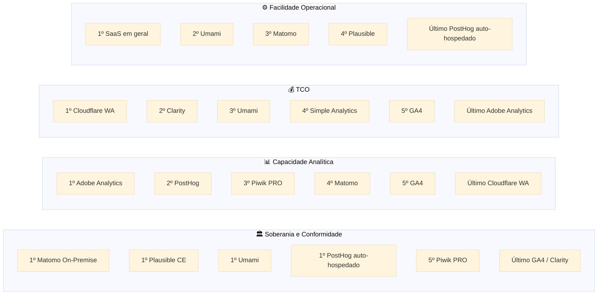

# 05 — Comparativo Detalhado

> **Anterior:** [04 — Panorama de mercado](04-mercado.md) · **Próximo:** [06 — Trade-offs](06-tradeoffs.md)

---

## Sumário

- [1. Como ler este documento](#1-como-ler-este-documento)
- [2. Identificação e licenciamento](#2-identificação-e-licenciamento)
- [3. Hospedagem e implantação](#3-hospedagem-e-implantação)
- [4. Arquitetura e infraestrutura](#4-arquitetura-e-infraestrutura)
- [5. Coleta de dados](#5-coleta-de-dados)
- [6. Funcionalidades analíticas](#6-funcionalidades-analíticas)
- [7. APIs e programabilidade](#7-apis-e-programabilidade)
- [8. Integrações](#8-integrações)
- [9. Privacidade e conformidade](#9-privacidade-e-conformidade)
- [10. Segurança](#10-segurança)
- [11. Governança e portabilidade](#11-governança-e-portabilidade)
- [12. Desempenho e escala](#12-desempenho-e-escala)
- [13. Custos](#13-custos)
- [14. Ecossistema e sustentabilidade](#14-ecossistema-e-sustentabilidade)
- [15. Síntese comparativa](#15-síntese-comparativa)

---

## 1. Como ler este documento

### 1.1 Códigos das plataformas

| Código | Plataforma | Modalidade avaliada |
|:------:|-----------|--------------------|
| **MAT** | Matomo | On-Premise (auto-hospedado) |
| **MTC** | Matomo | Cloud (SaaS) |
| **GA4** | Google Analytics 4 | SaaS, tier gratuito |
| **PLA** | Plausible | Community Edition (auto-hospedado) |
| **UMA** | Umami | Auto-hospedado |
| **OWA** | Open Web Analytics | Auto-hospedado |
| **ADB** | Adobe Analytics | SaaS enterprise |
| **SIM** | Simple Analytics | SaaS |
| **CLA** | Microsoft Clarity | SaaS gratuito |
| **CFA** | Cloudflare Web Analytics | SaaS gratuito |
| **PHS** | PostHog | Auto-hospedado (Open Source Edition) |
| **PWP** | Piwik PRO | Private Cloud / On-Premises |

### 1.2 Legenda de símbolos

| Símbolo | Significado |
|:-------:|-------------|
| ✅ | Suportado nativamente, sem custo adicional |
| 💲 | Suportado, porém como recurso pago (plugin, add-on ou plano superior) |
| ⚠️ | Suportado parcialmente, com limitação relevante |
| 🔧 | Possível apenas com desenvolvimento ou integração de terceiro |
| ❌ | Não suportado |
| — | Não aplicável a esta modalidade |

---

## 2. Identificação e licenciamento

| Dimensão | MAT | MTC | GA4 | PLA | UMA | OWA | ADB | SIM | CLA | CFA | PHS | PWP |
|----------|:---:|:---:|:---:|:---:|:---:|:---:|:---:|:---:|:---:|:---:|:---:|:---:|
| **Ano de lançamento** | 2007 | 2015 | 2020 | 2019 | 2020 | 2008 | 1996 | 2018 | 2020 | 2020 | 2020 | 2013 |
| **País do mantenedor** | NZ/DE | NZ/DE | EUA | EE | EUA | EUA | EUA | NL | EUA | EUA | EUA/UK | PL |
| **Licença do core** | GPL v3 | Proprietária (serviço) | Proprietária | AGPL v3 | MIT | GPL v2 | Proprietária | Proprietária | Proprietária | Proprietária | MIT | Proprietária |
| **Código-fonte auditável** | ✅ | ⚠️ (core sim, plataforma não) | ❌ | ✅ | ✅ | ✅ | ❌ | ❌ | ⚠️ (só `clarity-js`) | ❌ | ✅ (core) | ❌ |
| **Copyleft** | ✅ Forte | — | — | ✅ Forte (rede) | ❌ Permissivo | ✅ Forte | — | — | — | — | ❌ Permissivo | — |
| **Modelo de negócio** | Open core | SaaS | Publicidade / GA360 | Open core + SaaS | Open core + SaaS | Sem receita | Licença enterprise | SaaS | Gratuito estratégico | Agregado à CDN | Open core + SaaS | Licença |
| **Funcionalidades em edição paga** | 💲 Plugins premium | ✅ Incluídas nos planos | 💲 GA360 | 💲 Recursos Business | ⚠️ Poucas | ❌ N/A | 💲 Módulos | 💲 Planos | ❌ N/A | ❌ N/A | 💲 Edição EE | 💲 Planos |
| **Direito perpétuo sobre a versão obtida** | ✅ | ❌ | ❌ | ✅ | ✅ | ✅ | ❌ | ❌ | ❌ | ❌ | ✅ | ⚠️ Contratual |
| **Risco de relicenciamento futuro** | 🟢 Baixo | 🔴 N/A | 🔴 N/A | 🟡 Médio | 🟡 Médio | 🟢 Baixo | 🔴 N/A | 🔴 N/A | 🔴 N/A | 🔴 N/A | 🟡 Médio | 🔴 N/A |

> **📌 Observação — Copyleft e o setor público**
> A GPL v3 do Matomo e a AGPL v3 do Plausible garantem que **versões derivadas distribuídas permaneçam livres**. A MIT do Umami e do PostHog permite que o mantenedor feche versões futuras — o que já ocorreu em outros projetos do setor. O direito perpétuo sobre a versão já obtida existe em todas as licenças livres, mas a **continuidade da evolução em regime livre** é protegida apenas pelo copyleft com base ampla de contribuidores.

---

## 3. Hospedagem e implantação

| Dimensão | MAT | MTC | GA4 | PLA | UMA | OWA | ADB | SIM | CLA | CFA | PHS | PWP |
|----------|:---:|:---:|:---:|:---:|:---:|:---:|:---:|:---:|:---:|:---:|:---:|:---:|
| **Auto-hospedado** | ✅ | ❌ | ❌ | ✅ | ✅ | ✅ | ❌ | ❌ | ❌ | ❌ | ⚠️ Sem suporte | ✅ 💲 |
| **SaaS público** | — | ✅ | ✅ | ✅ | ✅ | ❌ | ✅ | ✅ | ✅ | ✅ | ✅ | ✅ |
| **Região de dados selecionável** | ✅ Total | ⚠️ UE / outras | ❌ | ⚠️ UE (padrão) | ⚠️ | — | ⚠️ Negociável | ⚠️ UE | ❌ | ❌ | ⚠️ UE/EUA | ✅ |
| **Imagem Docker oficial** | ✅ | — | — | ✅ | ✅ | ⚠️ Comunidade | — | — | — | — | ✅ | ✅ |
| **Helm chart / Kubernetes oficial** | ⚠️ Comunidade | — | — | ⚠️ Comunidade | ⚠️ Comunidade | ❌ | — | — | — | — | ⚠️ Descontinuado | ✅ 💲 |
| **Instalação em VM tradicional** | ✅ | — | — | ✅ | ✅ | ✅ | — | — | — | — | ⚠️ | ✅ |
| **Implantação em nuvem privada do cliente (BYOC)** | ✅ | — | ❌ | ✅ | ✅ | ✅ | ⚠️ Negociável | ❌ | ❌ | ❌ | 💲 Enterprise | ✅ |
| **On-premises com suporte do fornecedor** | 💲 Enterprise | — | ❌ | ❌ | ❌ | ❌ | ❌ | ❌ | ❌ | ❌ | ❌ | ✅ 💲 |
| **Complexidade de implantação** | 🟡 Média | 🟢 Nula | 🟢 Nula | 🟡 Média | 🟢 Baixa | 🟡 Média | 🟢 Nula | 🟢 Nula | 🟢 Nula | 🟢 Nula | 🔴 Alta | 🟡 Média |
| **Tempo estimado de implantação inicial** | 1–3 dias | Minutos | Minutos | 1–2 dias | 4 h | 1–2 dias | Semanas | Minutos | Minutos | Minutos | 1–3 semanas | Dias |

---

## 4. Arquitetura e infraestrutura

| Dimensão | MAT | PLA | UMA | OWA | PHS | PWP |
|----------|:---:|:---:|:---:|:---:|:---:|:---:|
| **Linguagem principal** | PHP | Elixir | TypeScript/Node | PHP | Python + TypeScript | Java/JS |
| **Framework** | Próprio (Zend-like) | Phoenix | Next.js | Próprio | Django + React | Próprio |
| **Banco de dados primário** | MySQL / MariaDB | PostgreSQL + ClickHouse | PostgreSQL, MySQL ou ClickHouse | MySQL | PostgreSQL + ClickHouse | Proprietário (colunar) |
| **Tipo de banco analítico** | Relacional (linha) | **Colunar** | Relacional ou colunar | Relacional (linha) | **Colunar** | **Colunar** |
| **Fila / streaming** | 🔧 Redis (plugin QueuedTracking) | ❌ (ingestão direta) | ❌ | ❌ | Kafka (obrigatório) | Interno |
| **Cache** | ✅ Redis/Memcached (plugin) | ✅ Interno | ⚠️ Básico | ⚠️ Básico | ✅ Redis | ✅ |
| **Object storage** | ❌ | ❌ | ❌ | ❌ | ✅ MinIO/S3 (obrigatório) | ✅ |
| **Componentes mínimos em produção** | 2 (app + DB) | 3 (app + PG + CH) | 2 (app + DB) | 2 (app + DB) | **6+** (app + PG + CH + Kafka + Redis + S3) | Gerenciado |
| **Processamento de agregação** | Cron (`core:archive`) | Consulta direta no ClickHouse | Consulta direta | Cron | Consulta direta + materialização | Interno |
| **Escala horizontal do app** | ✅ (stateless com sessão externa) | ✅ | ✅ | ⚠️ | ✅ | ✅ |
| **Escala horizontal do banco** | ⚠️ Difícil (réplicas de leitura) | ✅ ClickHouse cluster | ⚠️ Depende do banco | ❌ | ✅ ClickHouse cluster | ✅ |
| **Alta disponibilidade documentada** | ⚠️ Parcial | ⚠️ Parcial | ⚠️ Parcial | ❌ | ⚠️ Só enterprise | ✅ |
| **Backup** | ✅ Padrão MySQL | ✅ Padrão PG + CH | ✅ Padrão | ✅ Padrão MySQL | 🔴 Complexo (multi-store) | ✅ Gerenciado |
| **Disaster Recovery** | 🔧 Construir | 🔧 Construir | 🔧 Construir | 🔧 Construir | 🔧 Construir (complexo) | ✅ Contratual |

> **⚠️ Bloco de Risco — O gargalo do arquivamento no Matomo**
> O Matomo não consulta o dado bruto para gerar relatórios. Um processo de **arquivamento** (`core:archive`) pré-agrega os registros de `matomo_log_*` em `matomo_archive_*`. Esse processo é o **gargalo estrutural da plataforma**: seu custo cresce com o número de sites × períodos × segmentos.
>
> **Sintoma típico:** relatórios desatualizados, cron de arquivamento que não conclui dentro da janela, carga elevada e sustentada no banco.
>
> **Mitigações comprovadas:** (a) desabilitar arquivamento sob demanda no navegador (`browser_archiving_disabled_enforce = 1`); (b) executar o cron a partir de host dedicado; (c) paralelizar o arquivamento por site; (d) restringir segmentos pré-processados; (e) réplica de leitura dedicada a relatórios.
>
> Detalhamento em [`../comparativos/escalabilidade.md`](../comparativos/escalabilidade.md).

---

## 5. Coleta de dados

| Funcionalidade | MAT | MTC | GA4 | PLA | UMA | OWA | ADB | SIM | CLA | CFA | PHS | PWP |
|---------------|:---:|:---:|:---:|:---:|:---:|:---:|:---:|:---:|:---:|:---:|:---:|:---:|
| **Page views** | ✅ | ✅ | ✅ | ✅ | ✅ | ✅ | ✅ | ✅ | ✅ | ✅ | ✅ | ✅ |
| **Eventos customizados** | ✅ | ✅ | ✅ | ✅ | ✅ | ✅ | ✅ | ⚠️ | ⚠️ Limitado | ❌ | ✅ | ✅ |
| **Propriedades de evento** | ✅ | ✅ | ✅ | ⚠️ | ✅ | ⚠️ | ✅ | ⚠️ | ❌ | ❌ | ✅ | ✅ |
| **Dimensões customizadas** | ✅ | ✅ | ✅ | 💲 | ⚠️ | ❌ | ✅ | ⚠️ | ❌ | ❌ | ✅ | ✅ |
| **Download de arquivos (auto)** | ✅ | ✅ | ✅ | ✅ | ⚠️ | ✅ | 🔧 | ⚠️ | ❌ | ❌ | ⚠️ | ✅ |
| **Cliques em links externos (auto)** | ✅ | ✅ | ✅ | ✅ | ⚠️ | ✅ | 🔧 | ⚠️ | ❌ | ❌ | ✅ (autocapture) | ✅ |
| **Busca interna do site** | ✅ | ✅ | ✅ | ⚠️ | ❌ | ⚠️ | ✅ | ❌ | ❌ | ❌ | 🔧 | ✅ |
| **Campanhas / UTM** | ✅ | ✅ | ✅ | ✅ | ✅ | ✅ | ✅ | ✅ | ❌ | ⚠️ | ✅ | ✅ |
| **E-commerce** | ✅ | ✅ | ✅ | 💲 | ❌ | ⚠️ | ✅ | ❌ | ❌ | ❌ | 🔧 | ✅ |
| **Suporte a SPA** | ✅ | ✅ | ✅ | ✅ | ✅ | ⚠️ | ✅ | ✅ | ✅ | ⚠️ | ✅ | ✅ |
| **Cross-domain tracking** | ✅ | ✅ | ✅ | ⚠️ | ❌ | ⚠️ | ✅ | ❌ | ❌ | ❌ | ✅ | ✅ |
| **Tracking server-side (HTTP API)** | ✅ | ✅ | ✅ (MP) | ✅ | ✅ | ⚠️ | ✅ | ✅ | ❌ | ❌ | ✅ | ✅ |
| **Importação de logs de servidor** | ✅ | ✅ | ❌ | ⚠️ | ❌ | ❌ | ⚠️ | ❌ | ❌ | ❌ | ❌ | ⚠️ |
| **Rastreamento de mídia (vídeo/áudio)** | 💲 | ✅ | 🔧 | ❌ | ❌ | ❌ | ✅ | ❌ | ❌ | ❌ | 🔧 | ✅ |
| **Detecção de bots** | ✅ | ✅ | ✅ | ✅ | ⚠️ | ⚠️ | ✅ | ✅ | ✅ | ✅ | ⚠️ | ✅ |
| **Exclusão de IPs internos** | ✅ | ✅ | ✅ | ✅ | ⚠️ | ✅ | ✅ | ⚠️ | ❌ | ❌ | ✅ | ✅ |
| **Tamanho do script (gzip, aprox.)** | ~22 KB | ~22 KB | ~50 KB+ | **< 1 KB** | **~2 KB** | ~20 KB | ~80 KB+ | **~3 KB** | ~40 KB | **< 1 KB** | ~50 KB | ~25 KB |

> **📌 Observação — Tamanho do script e desempenho**
> Plausible (< 1 KB) e Cloudflare (< 1 KB) são uma ordem de grandeza menores que Matomo (~22 KB) e duas ordens menores que Adobe (~80 KB+). Para portais públicos acessados majoritariamente por dispositivos móveis em conexões limitadas — perfil relevante no interior de MS — isso é um diferencial concreto de acessibilidade digital, não apenas uma métrica técnica.
>
> **Contraponto:** o tamanho reduzido é consequência direta do escopo funcional reduzido. Não há almoço grátis.

---

## 6. Funcionalidades analíticas

### 6.1 Relatórios e análise

| Funcionalidade | MAT | MTC | GA4 | PLA | UMA | OWA | ADB | SIM | CLA | CFA | PHS | PWP |
|---------------|:---:|:---:|:---:|:---:|:---:|:---:|:---:|:---:|:---:|:---:|:---:|:---:|
| **Dashboard configurável** | ✅ | ✅ | ✅ | ⚠️ Fixo | ⚠️ Fixo | ⚠️ | ✅ | ⚠️ Fixo | ⚠️ Fixo | ⚠️ Fixo | ✅ | ✅ |
| **Relatórios de audiência** | ✅ | ✅ | ✅ | ✅ | ✅ | ✅ | ✅ | ✅ | ⚠️ | ⚠️ | ✅ | ✅ |
| **Relatórios de aquisição** | ✅ | ✅ | ✅ | ✅ | ✅ | ✅ | ✅ | ✅ | ❌ | ⚠️ | ✅ | ✅ |
| **Relatórios de comportamento** | ✅ | ✅ | ✅ | ✅ | ✅ | ✅ | ✅ | ✅ | ✅ | ⚠️ | ✅ | ✅ |
| **Geolocalização** | ✅ | ✅ | ✅ | ✅ | ✅ | ✅ | ✅ | ✅ | ✅ | ✅ | ✅ | ✅ |
| **Tecnologia (device/browser/SO)** | ✅ | ✅ | ✅ | ✅ | ✅ | ✅ | ✅ | ✅ | ✅ | ✅ | ✅ | ✅ |
| **Tempo real** | ✅ | ✅ | ✅ | ✅ | ✅ | ⚠️ | ✅ | ✅ | ⚠️ | ⚠️ | ✅ | ✅ |
| **Metas (goals)** | ✅ | ✅ | ✅ | ✅ | ⚠️ | ✅ | ✅ | ⚠️ | ❌ | ❌ | ✅ | ✅ |
| **Funil de conversão** | 💲 Plugin | ✅ | ✅ | ✅ | ❌ | ❌ | ✅ | ❌ | ⚠️ | ❌ | ✅ | ✅ |
| **Segmentação avançada** | ✅ | ✅ | ✅ | ⚠️ Filtros | ⚠️ Filtros | ⚠️ | ✅ | ⚠️ | ⚠️ | ❌ | ✅ | ✅ |
| **Comparação de períodos** | ✅ | ✅ | ✅ | ✅ | ✅ | ⚠️ | ✅ | ✅ | ⚠️ | ⚠️ | ✅ | ✅ |
| **Comparação de segmentos** | ✅ | ✅ | ✅ | ❌ | ❌ | ❌ | ✅ | ❌ | ⚠️ | ❌ | ✅ | ✅ |
| **Jornada / fluxo de usuários** | ✅ | ✅ | ✅ | ❌ | ❌ | ⚠️ | ✅ | ❌ | ⚠️ | ❌ | ✅ | ✅ |
| **Coortes** | ✅ | ✅ | ✅ | ❌ | ❌ | ❌ | ✅ | ❌ | ❌ | ❌ | ✅ | ✅ |
| **Retenção** | ⚠️ | ⚠️ | ✅ | ❌ | ❌ | ❌ | ✅ | ❌ | ❌ | ❌ | ✅ | ✅ |
| **Atribuição multicanal** | ✅ | ✅ | ✅ | ❌ | ❌ | ❌ | ✅ | ❌ | ❌ | ❌ | ⚠️ | ✅ |
| **Relatórios customizados** | 💲 Plugin | ✅ | ✅ (Explorações) | ❌ | ❌ | ❌ | ✅ | ❌ | ❌ | ❌ | ✅ (HogQL) | ✅ |
| **Consulta SQL sobre os dados** | ✅ (acesso direto ao MySQL) | ❌ | ⚠️ (via BigQuery) | ✅ (ClickHouse) | ✅ | ✅ | ✅ (Data Warehouse) | ❌ | ❌ | ❌ | ✅ (HogQL) | ⚠️ |
| **Relatórios agendados por e-mail** | ✅ | ✅ | ✅ | ✅ | ❌ | ⚠️ | ✅ | ✅ | ❌ | ❌ | ✅ | ✅ |
| **Anotações na linha do tempo** | ✅ | ✅ | ✅ | ❌ | ❌ | ❌ | ✅ | ❌ | ❌ | ❌ | ✅ | ✅ |
| **Alertas automáticos** | ✅ | ✅ | ✅ | ❌ | ❌ | ❌ | ✅ | ⚠️ | ❌ | ❌ | ✅ | ✅ |
| **Roll-up multi-site** | 💲 Plugin | ✅ | ⚠️ | ❌ | ⚠️ | ❌ | ✅ | ⚠️ | ❌ | ❌ | ⚠️ | ✅ |
| **Amostragem de dados (sampling)** | ❌ Sem amostragem | ❌ | ⚠️ **Sim, acima de limiar** | ❌ | ❌ | ❌ | ❌ | ❌ | ⚠️ | ❌ | ❌ | ❌ |

> **🔍 Evidência — Amostragem no GA4**
> O GA4 aplica **amostragem** em explorações que excedem o limite de eventos processáveis no tier gratuito. Relatórios padrão usam tabelas agregadas pré-computadas; análises ad-hoc sobre grandes volumes retornam resultado estimado, não exato.
>
> **Implicação para o setor público:** um relatório de audiência com valor de prestação de contas ou de transparência ativa **não pode ser baseado em amostra estatística sem essa condição estar explicitada**. Plataformas auto-hospedado não aplicam amostragem — todas as consultas percorrem o dado completo. Este é um diferencial substantivo, e não meramente técnico, para o caso de uso governamental.

### 6.2 Análise comportamental

| Funcionalidade | MAT | MTC | GA4 | PLA | UMA | OWA | ADB | SIM | CLA | CFA | PHS | PWP |
|---------------|:---:|:---:|:---:|:---:|:---:|:---:|:---:|:---:|:---:|:---:|:---:|:---:|
| **Heatmap de cliques** | 💲 Plugin | 💲 Plano | ❌ | ❌ | ❌ | ✅ | 💲 | ❌ | ✅ | ❌ | ✅ | ⚠️ |
| **Heatmap de movimento** | 💲 Plugin | 💲 Plano | ❌ | ❌ | ❌ | ⚠️ | 💲 | ❌ | ✅ | ❌ | ⚠️ | ❌ |
| **Heatmap de rolagem** | 💲 Plugin | 💲 Plano | ❌ | ❌ | ❌ | ❌ | 💲 | ❌ | ✅ | ❌ | ⚠️ | ❌ |
| **Gravação de sessão** | 💲 Plugin | 💲 Plano | ❌ | ❌ | ❌ | ❌ | 💲 | ❌ | ✅ | ❌ | ✅ | ⚠️ |
| **Mascaramento de dados na gravação** | ✅ | ✅ | — | — | — | — | ✅ | — | ✅ | — | ✅ | ✅ |
| **Análise de formulários** | 💲 Plugin | 💲 Plano | 🔧 | ❌ | ❌ | ❌ | 💲 | ❌ | ⚠️ | ❌ | 🔧 | ⚠️ |
| **Teste A/B** | 💲 Plugin | 💲 Plano | ⚠️ (via Optimize desligado) | ❌ | ❌ | ❌ | 💲 (Target) | ❌ | ❌ | ❌ | ✅ | ❌ |
| **Feature flags** | ❌ | ❌ | ❌ | ❌ | ❌ | ❌ | ❌ | ❌ | ❌ | ❌ | ✅ | ❌ |
| **Pesquisas / surveys** | 💲 Plugin | 💲 Plano | ❌ | ❌ | ❌ | ❌ | ⚠️ | ❌ | ❌ | ❌ | ✅ | ❌ |
| **Insights por IA** | ⚠️ | ⚠️ | ✅ | ❌ | ❌ | ❌ | ✅ | ❌ | ✅ (Copilot) | ❌ | ✅ | ⚠️ |

> **⚠️ Bloco de Risco — Gravação de sessão em portal de serviço público**
> A gravação de sessão captura a interação do usuário com a página, incluindo, se mal configurada, **conteúdo digitado em formulários**. Em portal de serviço público isso pode capturar CPF, dados de saúde, dados de benefício social — hipóteses de dado pessoal sensível (art. 5º, II da LGPD), cujo tratamento tem regime jurídico mais restrito (art. 11).
>
> **Controles obrigatórios se adotada:**
> 1. Mascaramento de campos por padrão (*deny by default*, não *allow by default*);
> 2. Exclusão explícita de páginas de formulário sensível do escopo de gravação;
> 3. RIPD específico para a funcionalidade;
> 4. Retenção mínima e definida;
> 5. **Vedação de uso de plataforma que envie a gravação para infraestrutura de terceiro** em portais que tratem dado sensível.
>
> O controle 5 é o que torna o **Microsoft Clarity inadequado** para essa classe de portal, e o plugin nativo do Matomo preferível, apesar do custo.

---

## 7. APIs e programabilidade

| Dimensão | MAT | MTC | GA4 | PLA | UMA | OWA | ADB | SIM | CLA | CFA | PHS | PWP |
|----------|:---:|:---:|:---:|:---:|:---:|:---:|:---:|:---:|:---:|:---:|:---:|:---:|
| **API REST de leitura** | ✅ | ✅ | ✅ | ✅ | ✅ | ⚠️ | ✅ | ✅ | ⚠️ | ✅ | ✅ | ✅ |
| **API GraphQL** | ❌ | ❌ | ❌ | ❌ | ❌ | ❌ | ❌ | ❌ | ❌ | ✅ | ❌ | ❌ |
| **API de ingestão (escrita)** | ✅ | ✅ | ✅ | ✅ | ✅ | ⚠️ | ✅ | ✅ | ❌ | ❌ | ✅ | ✅ |
| **API de importação histórica** | ✅ | ✅ | ⚠️ | ❌ | ❌ | ❌ | ✅ | ❌ | ❌ | ❌ | ⚠️ | ✅ |
| **API de administração** | ✅ | ✅ | ✅ | ⚠️ | ✅ | ❌ | ✅ | ⚠️ | ❌ | ⚠️ | ✅ | ✅ |
| **Formatos de saída** | JSON, XML, CSV, TSV, HTML, RSS, Original | idem | JSON | JSON, CSV | JSON | JSON, XML | JSON, CSV | JSON, CSV | JSON | JSON | JSON, CSV | JSON, CSV |
| **Autenticação** | Token (`token_auth`) | Token | OAuth 2.0 / Service Account | Token Bearer | Token Bearer | Token | OAuth 2.0 (S2S) | API key | Token | API token | Token pessoal / projeto | OAuth 2.0 / API key |
| **Versionamento explícito** | ⚠️ Implícito | ⚠️ | ✅ (`v1beta`, `v1`) | ✅ (`v1`, `v2`) | ⚠️ | ❌ | ✅ (`2.0`) | ✅ | ⚠️ | ✅ | ⚠️ | ✅ |
| **Rate limits documentados** | ⚠️ (autoimpostos) | ✅ | ✅ (quotas por token/dia) | ✅ | ✅ | ❌ | ✅ | ✅ | 🔴 **Muito restritivo** | ✅ | ✅ | ✅ |
| **Acesso ao dado bruto** | ✅ SQL direto | ⚠️ Via API | ✅ Export BigQuery | ✅ SQL (ClickHouse) | ✅ SQL | ✅ SQL | 💲 Data Feeds | ⚠️ Export | ❌ | ❌ | ✅ SQL (HogQL/CH) | ⚠️ |
| **Webhooks** | 🔧 Plugin | 🔧 | ❌ | ❌ | ❌ | ❌ | ⚠️ | ❌ | ❌ | ❌ | ✅ | ⚠️ |
| **SDK oficial Python** | ⚠️ Comunidade | ⚠️ | ✅ | ⚠️ Comunidade | ⚠️ | ❌ | ✅ | ⚠️ | ❌ | ❌ | ✅ | ⚠️ |
| **SDK oficial Node.js** | ⚠️ Comunidade | ⚠️ | ✅ | ⚠️ Comunidade | ✅ | ❌ | ✅ | ⚠️ | ❌ | ❌ | ✅ | ⚠️ |
| **SDK oficial PHP** | ✅ | ✅ | ✅ | ❌ | ❌ | ✅ | ✅ | ❌ | ❌ | ❌ | ✅ | ❌ |
| **SDK móvel (iOS/Android)** | ✅ | ✅ | ✅ (Firebase) | ❌ | ❌ | ❌ | ✅ | ❌ | ✅ | ❌ | ✅ | ✅ |

Exemplos de código de integração para todas as plataformas: [`../comparativos/api.md`](../comparativos/api.md).

> **🚨 Alerta — Limitação da API do Microsoft Clarity**
> A API de exportação de dados do Clarity é substancialmente restrita: opera sobre **janela temporal curta e recente**, retorna **dados agregados** e impõe **cota diária de chamadas de baixa ordem de grandeza**. Não é utilizável para construção de série histórica nem para alimentação regular de BI.
>
> Isso, somado à impossibilidade de exportação integral, é o que caracteriza o critério de eliminação **E5** aplicado ao Clarity em [`03-criterios-de-avaliacao.md`](03-criterios-de-avaliacao.md#23-justificativa-das-eliminações).

---

## 8. Integrações

| Integração | MAT | MTC | GA4 | PLA | UMA | OWA | ADB | SIM | CLA | CFA | PHS | PWP |
|-----------|:---:|:---:|:---:|:---:|:---:|:---:|:---:|:---:|:---:|:---:|:---:|:---:|
| **Google Tag Manager** | ✅ | ✅ | ✅ | ✅ | ✅ | 🔧 | ✅ | ✅ | ✅ | ⚠️ | ✅ | ✅ |
| **Tag Manager próprio** | ✅ Nativo | ✅ Nativo | ✅ (GTM) | ❌ | ❌ | ❌ | ✅ (Adobe Launch) | ❌ | ❌ | ❌ | ❌ | ✅ Nativo |
| **Consent Management Platform** | ✅ | ✅ | ✅ | — (dispensa) | — | ⚠️ | ✅ | — | ⚠️ | — | ⚠️ | ✅ Nativo |
| **OAuth 2.0 / OIDC (login)** | 💲 Plugin | ⚠️ | ✅ | ❌ | ❌ | ❌ | ✅ | ❌ | ✅ (conta MS) | ✅ | ✅ | ✅ |
| **SAML 2.0** | 💲 Plugin | 💲 | ✅ | ❌ | ❌ | ❌ | ✅ | ❌ | ❌ | ✅ | 💲 | ✅ |
| **LDAP / Active Directory** | 💲 Plugin | ❌ | ❌ | ❌ | ❌ | ❌ | ⚠️ | ❌ | ❌ | ❌ | ❌ | ✅ |
| **Power BI** | ⚠️ Via API/ODBC | ⚠️ | ✅ Conector | 🔧 | 🔧 | 🔧 | ✅ | 🔧 | ❌ | 🔧 | 🔧 | ⚠️ |
| **Grafana** | ✅ Plugin comunidade | ⚠️ | 🔧 | ✅ (ClickHouse DS) | ✅ | 🔧 | 🔧 | 🔧 | ❌ | 🔧 | ✅ (ClickHouse DS) | 🔧 |
| **Metabase** | ✅ (MySQL direto) | 🔧 | 🔧 | ✅ (ClickHouse) | ✅ | ✅ | 🔧 | 🔧 | ❌ | ❌ | ✅ | 🔧 |
| **Apache Superset** | ✅ (MySQL direto) | 🔧 | 🔧 | ✅ (ClickHouse) | ✅ | ✅ | 🔧 | 🔧 | ❌ | ❌ | ✅ | 🔧 |
| **Looker Studio** | ⚠️ Conector comunidade | ⚠️ | ✅ Nativo | ⚠️ | 🔧 | ❌ | ⚠️ | ⚠️ | ⚠️ | ❌ | 🔧 | ⚠️ |
| **Qlik Sense** | 🔧 (ODBC/REST) | 🔧 | ⚠️ Conector | 🔧 | 🔧 | 🔧 | ⚠️ | 🔧 | ❌ | ❌ | 🔧 | 🔧 |
| **BigQuery** | 🔧 | 🔧 | ✅ Nativo | ❌ | ❌ | ❌ | ⚠️ | ❌ | ❌ | ❌ | ⚠️ | ❌ |
| **WordPress** | ✅ Plugin oficial | ✅ | ✅ | ✅ | ✅ | ✅ | ⚠️ | ✅ | ✅ | ✅ | ✅ | ✅ |
| **Drupal** | ✅ Módulo | ✅ | ✅ | ✅ | ⚠️ | ⚠️ | ⚠️ | ⚠️ | ⚠️ | ⚠️ | ⚠️ | ✅ |
| **Slack / Teams (alertas)** | 🔧 | 🔧 | 🔧 | ✅ | ❌ | ❌ | ✅ | ✅ | ❌ | ❌ | ✅ | ⚠️ |

> **📌 Observação — Integração com BI: a vantagem estrutural do acesso ao banco**
> Plataformas auto-hospedado oferecem um caminho de integração que nenhuma SaaS oferece: **acesso SQL direto a uma réplica de leitura**. Isso elimina rate limits, elimina dependência de conector e permite ao Estado modelar seus próprios *data marts*.
>
> Para o Matomo especificamente, isso significa que Metabase, Superset, Power BI (via conector MySQL) e Grafana se conectam **diretamente à réplica**, sem intermediação de API. É a razão técnica de a nota do Matomo em C07 (Integrações) ser 4 e não 3, apesar da ausência de conectores nativos certificados.

---

## 9. Privacidade e conformidade

| Dimensão | MAT | MTC | GA4 | PLA | UMA | OWA | ADB | SIM | CLA | CFA | PHS | PWP |
|----------|:---:|:---:|:---:|:---:|:---:|:---:|:---:|:---:|:---:|:---:|:---:|:---:|
| **Papel do fornecedor** | Nenhum | Operador | ⚠️ Controlador conjunto (discutível) | Nenhum | Nenhum | Nenhum | Operador | Operador | ⚠️ Controlador | ⚠️ Controlador | Nenhum | Operador |
| **Localização do dado** | 🇧🇷 Estado | 🇪🇺/outros | 🌐 Global | 🇧🇷 Estado | 🇧🇷 Estado | 🇧🇷 Estado | 🌐 Negociável | 🇪🇺 NL | 🌐 Global | 🌐 Global | 🇧🇷 Estado | 🇪🇺/🇧🇷 negociável |
| **Transferência internacional** | ❌ Nenhuma | ⚠️ Sim | ⚠️ **Sim, para EUA** | ❌ Nenhuma | ❌ Nenhuma | ❌ Nenhuma | ⚠️ Sim | ⚠️ Sim (UE) | ⚠️ **Sim, para EUA** | ⚠️ **Sim, para EUA** | ❌ Nenhuma | ⚠️ Configurável |
| **Opera sem cookies** | ✅ Configurável | ✅ | ❌ | ✅ Por design | ✅ Por design | ⚠️ | ❌ | ✅ Por design | ❌ | ✅ Por design | ⚠️ Configurável | ✅ Configurável |
| **Anonimização de IP** | ✅ Configurável (1–4 bytes) | ✅ | ⚠️ Automática, não auditável | ✅ Não armazena IP | ✅ Hash | ⚠️ | ⚠️ | ✅ | ⚠️ | ✅ | ✅ Configurável | ✅ |
| **Requer consentimento** | ⚠️ Não, se configurado | ⚠️ | ✅ **Sim** | ❌ Não | ❌ Não | ⚠️ | ✅ Sim | ❌ Não | ✅ Sim | ❌ Não | ⚠️ Depende | ⚠️ Configurável |
| **Retenção configurável** | ✅ Total | ✅ | ⚠️ Máx. 14 meses (evento) | ✅ Total | ✅ Total | ✅ Total | ✅ Contratual | ⚠️ Por plano | ❌ Fixa | ❌ Fixa | ✅ Total | ✅ Total |
| **Exclusão física do dado bruto** | ✅ | ✅ | ⚠️ | ✅ | ✅ | ✅ | ✅ | ⚠️ | ❌ | ❌ | ✅ | ✅ |
| **Opt-out para o titular** | ✅ Iframe + API | ✅ | ⚠️ Extensão do navegador | — (sem dado pessoal) | — | ⚠️ | ✅ | — | ⚠️ | — | ✅ | ✅ |
| **Respeita Do Not Track** | ✅ Configurável | ✅ | ❌ | ✅ | ⚠️ | ⚠️ | ⚠️ | ✅ | ❌ | ✅ | ⚠️ | ✅ |
| **Realiza fingerprinting** | ⚠️ Config. (desativável) | ⚠️ | ⚠️ Sim (sinais) | ❌ Não | ❌ Não | ⚠️ | ⚠️ Sim | ❌ Não | ⚠️ Sim | ❌ Não | ⚠️ Config. | ⚠️ Config. |
| **Uso dos dados pelo fornecedor** | ❌ Nenhum | ❌ Declarado nenhum | ⚠️ **Sim, conforme termos** | ❌ Nenhum | ❌ Nenhum | ❌ Nenhum | ❌ Declarado nenhum | ❌ Declarado nenhum | ⚠️ **Sim, conforme termos** | ⚠️ Agregado | ❌ Nenhum | ❌ Declarado nenhum |
| **Aderência a RGPD (declarada)** | ✅ | ✅ | ⚠️ Contestada por DPAs | ✅ | ✅ | ⚠️ | ✅ | ✅ | ⚠️ | ⚠️ | ✅ | ✅ Central |
| **Precedente favorável de DPA** | ✅ **CNIL** | ⚠️ | ❌ **Decisões desfavoráveis** | ⚠️ | ❌ | ❌ | ⚠️ | ⚠️ | ❌ | ❌ | ❌ | ⚠️ |
| **DPA / contrato de operador disponível** | — (não aplicável) | ✅ | ✅ | — | — | — | ✅ | ✅ | ⚠️ Termos padrão | ⚠️ Termos padrão | — | ✅ |

Análise jurídico-técnica completa: [`../comparativos/lgpd.md`](../comparativos/lgpd.md).

---

## 10. Segurança

| Dimensão | MAT | MTC | GA4 | PLA | UMA | OWA | ADB | SIM | CLA | CFA | PHS | PWP |
|----------|:---:|:---:|:---:|:---:|:---:|:---:|:---:|:---:|:---:|:---:|:---:|:---:|
| **MFA nativo** | ✅ TOTP | ✅ | ✅ | ❌ | ❌ | ❌ | ✅ | ⚠️ | ✅ | ✅ | ⚠️ | ✅ |
| **RBAC granular** | ✅ | ✅ | ✅ | ⚠️ Básico | ⚠️ Básico | ⚠️ | ✅ | ⚠️ | ⚠️ | ⚠️ | ✅ | ✅ |
| **Log de auditoria** | ✅ | ✅ | ⚠️ | ❌ | ❌ | ❌ | ✅ | ⚠️ | ❌ | ⚠️ | ✅ | ✅ |
| **Exportação de log para SIEM** | ✅ (arquivo/DB) | ⚠️ | ❌ | 🔧 | 🔧 | 🔧 | ✅ | ❌ | ❌ | ⚠️ | 🔧 | ✅ |
| **Criptografia em trânsito** | ✅ | ✅ | ✅ | ✅ | ✅ | ✅ | ✅ | ✅ | ✅ | ✅ | ✅ | ✅ |
| **Criptografia em repouso** | 🔧 (nível de infra) | ✅ | ✅ | 🔧 | 🔧 | 🔧 | ✅ | ✅ | ✅ | ✅ | 🔧 | ✅ |
| **ISO 27001 do fornecedor** | — | ✅ | ✅ | ⚠️ | ❌ | — | ✅ | ⚠️ | ✅ | ✅ | ⚠️ | ✅ |
| **SOC 2 Type II** | — | ⚠️ | ✅ | ❌ | ❌ | — | ✅ | ❌ | ✅ | ✅ | ✅ | ⚠️ |
| **Programa de bug bounty / VDP** | ✅ | ✅ | ✅ | ⚠️ | ⚠️ | ❌ | ✅ | ⚠️ | ✅ | ✅ | ✅ | ✅ |
| **Cadência de patches de segurança** | 🟢 Regular | 🟢 | 🟢 | 🟢 | 🟡 | 🔴 **Irregular** | 🟢 | 🟢 | 🟢 | 🟢 | 🟢 | 🟢 |
| **CVE crítica conhecida sem correção** | ❌ Não | ❌ | ❌ | ❌ | ❌ | ⚠️ **Histórico de RCE** | ❌ | ❌ | ❌ | ❌ | ❌ | ❌ |
| **Superfície de ataque** | 🟡 Média (PHP + admin web exposto) | 🟢 Nula p/ o Estado | 🟢 Nula | 🟡 Média | 🟢 Baixa | 🔴 Alta | 🟢 Nula | 🟢 Nula | 🟢 Nula | 🟢 Nula | 🔴 Alta (6 componentes) | 🟡 Média |

> **📌 Observação — Certificações e auto-hospedado**
> Plataformas auto-hospedado **não possuem** ISO 27001 ou SOC 2, porque a certificação se aplica ao operador da infraestrutura — que, nesse caso, é o próprio Estado. Isso não é uma deficiência da plataforma: é um **deslocamento da responsabilidade**.
>
> **Consequência prática:** ao adotar auto-hospedado, a postura de segurança passa a depender da maturidade da STI (hardening, WAF, gestão de patches, segmentação de rede, monitoramento). Uma organização com processos de segurança maduros obtém postura equivalente ou superior; uma organização sem esses processos obtém postura inferior à de um SaaS certificado.
>
> Isso é registrado como **risco R-07** em [`11-riscos.md`](11-riscos.md), com mitigação prescrita no roadmap.

---

## 11. Governança e portabilidade

| Dimensão | MAT | MTC | GA4 | PLA | UMA | OWA | ADB | SIM | CLA | CFA | PHS | PWP |
|----------|:---:|:---:|:---:|:---:|:---:|:---:|:---:|:---:|:---:|:---:|:---:|:---:|
| **Vendor lock-in** | 🟢 Muito baixo | 🟡 Baixo | 🔴 Alto | 🟢 Muito baixo | 🟢 Muito baixo | 🟢 Muito baixo | 🔴 Muito alto | 🟠 Médio | 🔴 Muito alto | 🟠 Médio | 🟢 Baixo | 🟠 Médio |
| **Exportação de dado agregado** | ✅ | ✅ | ✅ | ✅ | ✅ | ✅ | ✅ | ✅ | ⚠️ | ⚠️ | ✅ | ✅ |
| **Exportação de dado bruto** | ✅ SQL | ⚠️ API | ✅ BigQuery | ✅ SQL | ✅ SQL | ✅ SQL | 💲 Data Feeds | ⚠️ | ❌ | ❌ | ✅ SQL | ⚠️ |
| **Formato de exportação aberto** | ✅ | ✅ | ✅ | ✅ | ✅ | ✅ | ✅ | ✅ | ⚠️ | ✅ | ✅ | ✅ |
| **Schema de banco documentado/inspecionável** | ✅ | ❌ | ❌ | ✅ | ✅ | ✅ | ❌ | ❌ | ❌ | ❌ | ✅ | ❌ |
| **Custo de saída estimado** | 🟢 Muito baixo | 🟡 Baixo | 🔴 Alto | 🟢 Muito baixo | 🟢 Muito baixo | 🟢 Muito baixo | 🔴 Muito alto | 🟡 Baixo | 🔴 Total (perda) | 🟡 Baixo | 🟢 Baixo | 🟠 Médio |
| **Capacidade de fork** | ✅ | ❌ | ❌ | ✅ | ✅ | ✅ | ❌ | ❌ | ❌ | ❌ | ✅ | ❌ |
| **Roadmap público** | ✅ | ✅ | ⚠️ | ✅ | ⚠️ | ❌ | ⚠️ | ⚠️ | ❌ | ❌ | ✅ | ⚠️ |
| **Processo de contribuição aberto** | ✅ | — | ❌ | ✅ | ✅ | ⚠️ | ❌ | ❌ | ⚠️ (só `clarity-js`) | ❌ | ✅ | ❌ |
| **Continuidade sem o fornecedor** | ✅ Indefinida | ❌ | ❌ | ✅ Indefinida | ✅ Indefinida | ✅ Indefinida | ❌ | ❌ | ❌ | ❌ | ✅ Indefinida | ❌ |
| **Soberania de dados** | ✅ Total | ⚠️ Parcial | ❌ Nenhuma | ✅ Total | ✅ Total | ✅ Total | ⚠️ Contratual | ⚠️ Parcial | ❌ Nenhuma | ❌ Nenhuma | ✅ Total | ⚠️ Contratual |

Análise completa: [`../comparativos/governanca.md`](../comparativos/governanca.md).

---

## 12. Desempenho e escala

| Dimensão | MAT | MTC | GA4 | PLA | UMA | OWA | ADB | SIM | CLA | CFA | PHS | PWP |
|----------|:---:|:---:|:---:|:---:|:---:|:---:|:---:|:---:|:---:|:---:|:---:|:---:|
| **Limite prático de eventos/mês (config. padrão)** | ~50 M | Por plano | Ilimitado (com amostragem) | ~500 M | ~100 M | ~10 M | Ilimitado | Por plano | Ilimitado | Ilimitado | ~500 M | Ilimitado |
| **Escala horizontal da coleta** | ✅ | ✅ | ✅ | ✅ | ✅ | ⚠️ | ✅ | ✅ | ✅ | ✅ | ✅ | ✅ |
| **Escala horizontal do processamento** | ⚠️ Parcial | ✅ | ✅ | ✅ | ⚠️ | ❌ | ✅ | ✅ | ✅ | ✅ | ✅ | ✅ |
| **Escala vertical** | ✅ | — | — | ✅ | ✅ | ✅ | — | — | — | — | ✅ | ✅ |
| **Desacoplamento por fila** | 🔧 Plugin | ✅ | ✅ | ❌ | ❌ | ❌ | ✅ | ✅ | ✅ | ✅ | ✅ Kafka | ✅ |
| **Gargalo estrutural principal** | 🔴 **Arquivamento** | — | Amostragem | Ingestão síncrona | Banco relacional | 🔴 Arquitetura | — | — | — | — | Operação | — |
| **Latência de relatório em alto volume** | 🟠 Alta sem tuning | 🟢 | 🟢 | 🟢 | 🟡 | 🔴 | 🟢 | 🟢 | 🟡 | 🟢 | 🟢 | 🟢 |
| **Tempo de resposta do endpoint de coleta** | 🟢 < 100 ms | 🟢 | 🟢 | 🟢 < 50 ms | 🟢 < 50 ms | 🟡 | 🟢 | 🟢 | 🟢 | 🟢 < 20 ms | 🟢 | 🟢 |
| **Impacto no LCP do portal** | 🟡 Baixo | 🟡 | 🟠 Médio | 🟢 Mínimo | 🟢 Mínimo | 🟡 | 🔴 Alto | 🟢 Mínimo | 🟠 Médio | 🟢 Mínimo | 🟠 Médio | 🟡 |

Metodologia e cenários: [`../anexos/benchmark.md`](../anexos/benchmark.md).

---

## 13. Custos (regime de custo marginal SETDIG)

Valores em BRL, cenário de referência (12 M page views/mês, 80 propriedades), horizonte de 5 anos, **regime marginal** (fundamento em P1/P2/R4 — ver [`03-criterios-de-avaliacao.md §5.C03`](03-criterios-de-avaliacao.md#c03--tco-peso-15)). Modelagem completa em [`../comparativos/custo.md`](../comparativos/custo.md).

| Componente de custo | MAT | MTC | GA4 | PLA | UMA | OWA | ADB | SIM | CLA | CFA | PHS | PWP |
|--------------------|----:|----:|----:|----:|----:|----:|----:|----:|----:|----:|----:|----:|
| **Licença / assinatura (5 anos)** | ~R$ 60 k¹ | ~R$ 240 k | R$ 0² | R$ 0 | R$ 0 | R$ 0 | ~R$ 4 M+³ | ~R$ 16 k | R$ 0 | R$ 0 | ~R$ 300 k | ~R$ 900 k³ |
| **Infra marginal (5 anos)** | ~R$ 30 k | R$ 0 | R$ 0 | ~R$ 20 k | ~R$ 15 k | ~R$ 20 k | R$ 0 | R$ 0 | R$ 0 | R$ 0 | ~R$ 300 k | R$ 0 |
| **Implantação (snippet ~200 portais)** | ~R$ 10 k | ~R$ 10 k | ~R$ 10 k | ~R$ 10 k | ~R$ 10 k | ~R$ 10 k | ~R$ 10 k | ~R$ 10 k | ~R$ 10 k | ~R$ 5 k | ~R$ 15 k | ~R$ 30 k |
| **Equipe marginal (5 anos)** | ~R$ 75 k | ~R$ 45 k | ~R$ 60 k | ~R$ 60 k | ~R$ 45 k | ~R$ 90 k | ~R$ 240 k | ~R$ 12 k | ~R$ 15 k | ~R$ 6 k | ~R$ 240 k | ~R$ 150 k |
| **Adequação LGPD + Riscos** | ~R$ 60 k | ~R$ 70 k | ~R$ 150 k | ~R$ 30 k | ~R$ 30 k | ~R$ 45 k | ~R$ 190 k | ~R$ 14 k | ~R$ 42 k | ~R$ 12 k | ~R$ 100 k | ~R$ 240 k |
| **TCO 5 anos marginal (aprox.)** | **~R$ 235 k** | **~R$ 365 k** | **~R$ 220 k** | **~R$ 120 k** | **~R$ 100 k** | **~R$ 165 k** | **~R$ 4,44 M+** | **~R$ 52 k** | **~R$ 67 k** | **~R$ 23 k** | **~R$ 955 k** | **~R$ 1,32 M** |
| **TCO 5 anos pleno (referência)** | ~R$ 700 k | ~R$ 365 k | ~R$ 220 k | ~R$ 415 k | ~R$ 285 k | ~R$ 675 k | ~R$ 4,44 M+ | ~R$ 52 k | ~R$ 67 k | ~R$ 23 k | ~R$ 1,6 M | ~R$ 1,32 M |
| **Nota C03 (TCO — marginal)** | **5** | **3** | **4** | **5** | **5** | **5** | **1** | **3** | **5** | **5** | **3** | **2** |

**Notas de rodapé:**
1. Matomo On-Premise: licença do core é gratuita (GPL v3). O valor refere-se a plugins premium (Heatmaps & Session Recording, Funnels, Form Analytics, Custom Reports, Roll-Up Reporting) em licença perpétua com atualizações anuais.
2. GA4 tier gratuito. GA360 é estimado em faixa superior a R$ 3 M em 5 anos — não incluído nesta linha por não ser a modalidade avaliada.
3. **Estimativa de mercado, não preço de tabela.** Adobe Analytics e Piwik PRO não publicam preços. Exige cotação formal antes de qualquer uso em processo de contratação.

> **⚠️ Bloco de Risco — A armadilha do "gratuito"**
> GA4, Clarity e Cloudflare aparecem com TCO baixo porque a **licença é zero**. Esse número esconde três custos:
>
> 1. **Custo de saída**: o desligamento do Universal Analytics demonstrou que a migração forçada é uma possibilidade real, e seu custo é integralmente do cliente.
> 2. **Custo de conformidade**: operar GA4 conforme a LGPD exige CMP, RIPD, revisão jurídica de transferência internacional e gestão de consentimento — custos reais não capturados na linha de licença.
> 3. **Custo de oportunidade regulatório**: uma eventual determinação de descontinuidade pela ANPD geraria migração emergencial não planejada.
>
> Por isso a nota C03 do GA4 é **4** e não **5**: o TCO monetário direto é baixo, mas o custo de saída e de conformidade é materialmente superior ao das alternativas auto-hospedado.

---

## 14. Ecossistema e sustentabilidade

| Dimensão | MAT | GA4 | PLA | UMA | OWA | ADB | SIM | CLA | CFA | PHS | PWP |
|----------|:---:|:---:|:---:|:---:|:---:|:---:|:---:|:---:|:---:|:---:|:---:|
| **Tamanho da comunidade** | 🟢 Grande | 🟢 Enorme | 🟡 Média | 🟡 Média | 🔴 Pequena | 🟡 Média | 🔴 Pequena | 🟡 Média | 🟡 Média | 🟢 Grande | 🔴 Pequena |
| **Cadência de releases** | 🟢 Regular | 🟢 Contínua | 🟢 Regular | 🟢 Regular | 🔴 Esparsa | 🟢 Regular | 🟢 | 🟢 | 🟢 | 🟢 Muito alta | 🟢 |
| **Marketplace / plugins** | ✅ Extenso | ⚠️ | ❌ | ❌ | ⚠️ | ✅ | ❌ | ❌ | ❌ | ✅ | ⚠️ |
| **Documentação oficial** | 🟢 Extensa | 🟢 Extensa | 🟢 Boa | 🟡 Adequada | 🔴 Fraca | 🟢 Extensa | 🟡 | 🟡 | 🟡 | 🟢 Excelente | 🟢 Boa |
| **Documentação em pt-BR** | ⚠️ Parcial | ✅ | ❌ | ❌ | ❌ | ✅ | ❌ | ⚠️ | ⚠️ | ❌ | ❌ |
| **Interface em pt-BR** | ✅ | ✅ | ⚠️ | ⚠️ | ⚠️ | ✅ | ❌ | ✅ | ⚠️ | ❌ | ❌ |
| **Suporte comercial contratável** | ✅ | 💲 GA360 | ✅ | ✅ | ❌ | ✅ | ✅ | ⚠️ | ⚠️ | ✅ | ✅ |
| **Fornecedores/parceiros no Brasil** | ⚠️ Poucos | 🟢 Muitos | ❌ | ❌ | ❌ | 🟢 Muitos | ❌ | ⚠️ | ⚠️ | ⚠️ | ❌ |
| **Disponibilidade de profissionais no mercado** | 🟡 Média | 🟢 Alta | 🔴 Baixa | 🔴 Baixa | 🔴 Muito baixa | 🟡 Média | 🔴 Baixa | 🟡 | 🟡 | 🟡 Média | 🔴 Baixa |
| **Adoção documentada no setor público** | ✅ **Forte (UE)** | ✅ Ampla | ⚠️ Crescente | ❌ | ❌ | ⚠️ | ❌ | ⚠️ | ❌ | ❌ | ⚠️ |

> **⚠️ Bloco de Risco — Disponibilidade de profissionais**
> A escassez de profissionais com experiência em Matomo, Plausible ou PostHog no mercado brasileiro é um risco operacional real. Diferentemente do GA4 — onde há oferta ampla de profissionais e agências —, uma solução auto-hospedado exige capacitação interna.
>
> **Fator atenuante:** as competências exigidas para operar o Matomo (Linux, PHP, MySQL, cron, observabilidade) são **competências genéricas de infraestrutura**, e não conhecimento específico do produto. A STI já as possui ou pode desenvolvê-las. O conhecimento específico de produto se concentra na **configuração analítica**, endereçável por capacitação de curta duração.
>
> Registrado como risco **R-04** em [`11-riscos.md`](11-riscos.md), com plano de capacitação no roadmap.

---

## 15. Síntese comparativa

### 15.1 Perfil resumido

| Plataforma | Melhor característica | Pior característica | Perfil de uso ideal |
|-----------|----------------------|--------------------|--------------------|
| **Matomo On-Premise** | Melhor equilíbrio entre soberania e cobertura funcional | Gargalo de arquivamento; funcionalidades avançadas pagas | Plataforma padrão de órgão público com equipe de infra |
| **Matomo Cloud** | Mesma cobertura funcional sem esforço operacional | Transferência internacional; custo recorrente | Órgão sem equipe de infra que aceita operador na UE |
| **Google Analytics 4** | Ecossistema, integração e maturidade | Zero soberania; risco regulatório documentado | Setor privado sem restrição de soberania |
| **Plausible CE** | Simplicidade radical + conformidade por design | Escopo funcional limitado; sem funil de jornada complexa | Portais de conteúdo onde só a métrica agregada importa |
| **Umami** | Menor TCO com soberania total | Escopo funcional mais restrito do conjunto viável | Sites pequenos, dashboards internos, baixo requisito |
| **Open Web Analytics** | Heatmap nativo em GPL | 🚨 Manutenção irregular; histórico de RCE | **Nenhum** — eliminado |
| **Adobe Analytics** | Profundidade analítica máxima do mercado | TCO proibitivo; lock-in máximo | Grande corporação com orçamento de marketing dedicado |
| **Simple Analytics** | Conformidade UE com operação zero | Escopo mínimo; sem auto-hospedado; custo por volume | Organização pequena, sem equipe técnica |
| **Microsoft Clarity** | Melhor session replay gratuito do mercado | Zero controle sobre os dados; sem exportação | Complemento comportamental em site sem dado sensível |
| **Cloudflare Web Analytics** | Custo zero, impacto zero, já disponível na CDN | Escopo mínimo; retenção fixa | Métrica de borda complementar |
| **PostHog auto-hospedado** | Suíte mais completa em licença livre | Operação de 6 componentes sem suporte oficial | Equipe de engenharia de plataforma madura |
| **Piwik PRO** | Conformidade como proposta de valor central | Proprietária; custo relevante | Órgão sem equipe de infra que exige conformidade forte |

### 15.2 Visão consolidada por eixo

> **✅ Bloco de Decisão — Conclusão do comparativo**
> Nenhuma plataforma lidera em todos os eixos. O Adobe Analytics lidera em capacidade analítica e perde em TCO e soberania; o Cloudflare lidera em TCO e perde em capacidade; o Umami lidera em TCO com soberania e perde em capacidade.
>
> **O Matomo On-Premise é a única plataforma que figura entre as melhores em soberania (1º), permanece competitiva em capacidade analítica (4º) e mantém TCO em faixa aceitável — sem ficar em último lugar em nenhum eixo.**
>
> Essa característica — ausência de deficiência crítica combinada com liderança nos eixos de maior peso — é precisamente o que a ponderação da matriz de decisão captura. Resultado formal em [`07-matriz-decisao.md`](07-matriz-decisao.md).

---

## Navegação

| ⬅️ Anterior | ➡️ Próximo |
|------------|-----------|
| [04 — Panorama de mercado](04-mercado.md) | [06 — Trade-offs](06-tradeoffs.md) |
