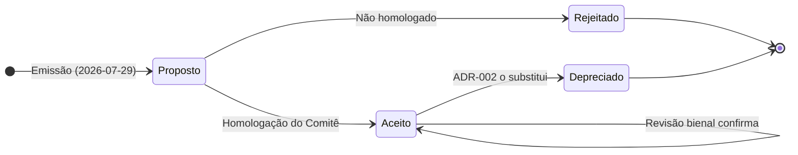
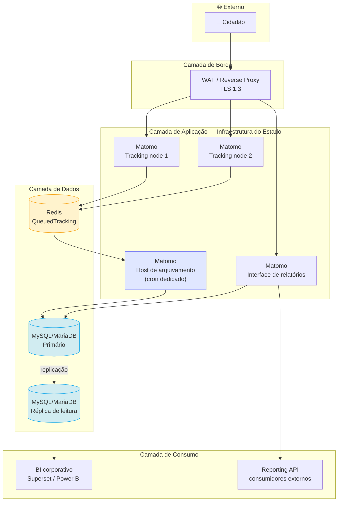

# 08 — ADR-001: Plataforma de Web Analytics do Governo do Estado de MS

> **Formato:** Michael Nygard / MADR 4.0
> **Anterior:** [07 — Matriz de decisão](07-matriz-decisao.md) · **Próximo:** [08 — ADR-002 (vigente)](08-adr-002.md) · [09 — Recomendação](09-recomendacao.md)

> **🚨 Alerta — ADR depreciado**
> Este ADR foi **substituído pelo [ADR-002](08-adr-002.md)** em agosto/2026. Conteúdo preservado integralmente como histórico e para rastreabilidade das decisões. Não deve ser usado como base para novas implantações. Consulte o ADR-002 para a decisão vigente.
>
> **Motivo da substituição:** revisão de premissa quanto ao peso do TCO na matriz (rebaixado a peso 0 — critério informativo) e formalização do PostHog auto-hospedado como camada complementar de product analytics no portal Xvia.

---

## Sumário

- [Metadados](#metadados)
- [1. Contexto](#1-contexto)
- [2. Problema](#2-problema)
- [3. Direcionadores da decisão](#3-direcionadores-da-decisão)
- [4. Alternativas consideradas](#4-alternativas-consideradas)
- [5. Trade-offs da decisão](#5-trade-offs-da-decisão)
- [6. Decisão](#6-decisão)
- [7. Justificativa](#7-justificativa)
- [8. Consequências](#8-consequências)
- [9. Riscos assumidos](#9-riscos-assumidos)
- [10. Condições de invalidação](#10-condições-de-invalidação)
- [11. Plano de revisão futura](#11-plano-de-revisão-futura)
- [12. Registro de aprovação](#12-registro-de-aprovação)

---

## Metadados

| Campo | Valor |
|-------|-------|
| **Identificador** | ADR-001 |
| **Título** | Plataforma padrão de Web Analytics para portais e serviços digitais do Governo do Estado de MS |
| **Status** | 🔴 **Depreciado** |
| **Data** | 2026-07-29 |
| **Autor** | Arquitetura de Soluções — SETDIG |
| **Decisores** | Secretário Executivo SETDIG · Superintendente SGD · Superintendente STI · Encarregado de Dados · Segurança da Informação |
| **Consultados** | Comunicação Social · Órgãos setoriais · Equipe de BI |
| **Informados** | Órgãos da Administração Direta e Indireta estadual |
| **Substitui** | Nenhum (primeira formalização) |
| **Substituído por** | [ADR-002](08-adr-002.md) — 2026-08 |
| **Escopo de aplicação** | Portais institucionais, serviços digitais e aplicações web do Poder Executivo estadual |
| **Prazo de revisão** | 24 meses (julho/2028), ou antecipado por gatilho da seção 11 |

### Ciclo de vida deste ADR

---

## 1. Contexto

O Governo do Estado de Mato Grosso do Sul opera o **Matomo** como plataforma de Web Analytics dos portais institucionais e serviços digitais estaduais. Essa adoção ocorreu sem processo formal de Arquitetura de Soluções: não existem benchmark documentado, análise comparativa estruturada, ADR registrado nem estudo de trade-offs.

O contexto completo está em [`01-contexto.md`](01-contexto.md). Elementos essenciais:

| Elemento | Situação |
|----------|----------|
| Plataforma em produção | Matomo, modalidade On-Premise |
| Volume estimado (cenário de referência) | ~12 M page views/mês, ~80 propriedades, ~1,5 M visitantes únicos/mês |
| Perfil de carga | Fortemente *bursty* — picos de 10× a 50× em eventos institucionais |
| Lacunas técnicas identificadas | 7 lacunas (L1 a L7): ingestão síncrona, retenção não formalizada, ausência de HA, ausência de DR testado, ausência de camada de BI, ausência de federação de identidade, ausência de padrão de anonimização |
| Restrição orçamentária e de pessoal | Sem previsão de ampliação do quadro da STI (restrição R5) |
| Marco legal aplicável | LGPD (Lei 13.709/2018), Lei do Governo Digital (14.129/2021), Lei de Licitações (14.133/2021), Lei 6.035/2022 (MS) |

---

## 2. Problema

> **🚨 Declaração do problema**
>
> **Não existe decisão arquitetural formalizada, fundamentada e auditável** sobre qual plataforma de Web Analytics deve ser o padrão do Governo do Estado de Mato Grosso do Sul, nem arquitetura de referência que assegure conformidade com a LGPD, soberania sobre os dados e integração com a plataforma de BI do Estado.

Consequências do problema não resolvido:

| Dimensão | Consequência |
|----------|-------------|
| **Controle externo** | A escolha não é defensável perante TCE-MS ou CGE — não há demonstração de economicidade nem de aderência técnica |
| **Regulatória** | Ausência de base legal documentada, de política de retenção formalizada e de registro de operações de tratamento (art. 37 da LGPD) |
| **Operacional** | Ausência de arquitetura de referência gera implantações divergentes entre órgãos, com níveis de conformidade heterogêneos |
| **Estratégica** | Impossibilidade de planejar evolução, orçamento plurianual ou eventual migração |

---

## 3. Direcionadores da decisão

Derivados de [`01-contexto.md`, seção 10](01-contexto.md#10-direcionadores-arquiteturais) e ponderados em [`03-criterios-de-avaliacao.md`](03-criterios-de-avaliacao.md).

| ID | Direcionador | Criticidade | Peso na matriz |
|----|-------------|:-----------:|---------------:|
| D1 | Soberania de dados | 🔴 Crítico | 15 |
| D2 | Conformidade LGPD | 🔴 Crítico | 15 |
| D7 | Economicidade (TCO 5 anos) | 🟠 Alto | 15 |
| D3 | Independência tecnológica | 🟠 Alto | 10 |
| D5 | Capacidade analítica | 🟡 Médio | 10 |
| D6 | Integração com BI | 🟡 Médio | 20 (APIs + Integrações) |
| D8 | Elasticidade sob pico | 🟡 Médio | 10 |
| — | Segurança (transversal) | 🔴 Crítico | 10 |
| D4 | Sustentabilidade operacional | 🟠 Alto | 5 |
| — | Sustentabilidade do produto | 🟡 Médio | 10 (Comunidade + Documentação) |

### 3.1 Restrições rígidas (não ponderáveis)

| ID | Restrição |
|----|-----------|
| R1 | Dado pessoal de cidadão tratado por órgão público estadual sujeita-se à LGPD |
| R2 | Transferência internacional exige base legal do art. 33 da LGPD, documentada |
| R3 | Contratação de solução paga exige processo licitatório ou hipótese de dispensa/inexigibilidade |
| R5 | Não há previsão de ampliação do quadro da STI |
| — | Veto absoluto do Encarregado de Dados e da Segurança da Informação sobre plataformas não conformes |

---

## 4. Alternativas consideradas

Foram avaliadas **13 alternativas** (10 plataformas obrigatórias + 3 modalidades/plataformas adicionais). Análise completa em [`05-comparativo-detalhado.md`](05-comparativo-detalhado.md), [`06-tradeoffs.md`](06-tradeoffs.md) e [`07-matriz-decisao.md`](07-matriz-decisao.md).

### 4.1 Alternativas de primeira ordem

| # | Alternativa | Pontuação | Situação |
|---|------------|----------:|----------|
| **A1** | **Matomo On-Premise** | **520/600 (86,7 %)** | ✅ **Selecionada** |
| **A2** | Plausible Community Edition | 485/600 (80,8 %) | 🟡 Selecionada como complemento |
| **A3** | Piwik PRO (Private Cloud / On-Premises) | 465/600 (77,5 %) | 🟡 Contingência formal |
| **A4** | Matomo Cloud | 465/600 (77,5 %) | 🟡 Contingência formal |
| **A5** | PostHog auto-hospedado | 455/600 (75,8 %) | ❌ Não selecionada |
| **A6** | Umami | 445/600 (74,2 %) | ❌ Não selecionada |
| **A7** | PostHog Cloud EU | 425/600 (70,8 %) | ❌ Não selecionada |
| **A8** | Google Analytics 4 | 410/600 (68,3 %) | ❌ Não selecionada |
| **A9** | Adobe Analytics | 405/600 (67,5 %) | ❌ Não selecionada |
| **A10** | Microsoft Clarity | 355/600 (59,2 %) | ⚠️ Complemento condicionado |
| **A11** | Simple Analytics | 355/600 (59,2 %) | ❌ Não selecionada |
| **A12** | Cloudflare Web Analytics | 345/600 (57,5 %) | ⚠️ Complemento opcional |
| **A13** | Open Web Analytics | 330/600 (55,0 %) | ❌ **Eliminada por segurança** |

### 4.2 Motivo de descarte de cada alternativa não selecionada

| Alternativa | Motivo objetivo do descarte |
|------------|----------------------------|
| **A5 — Umami** | Falha no requisito **RF-27** (funil de conversão), que é *Must have*, e no **RN-02** (análise de gargalos em jornadas de serviço). Cobertura funcional de nota 2. Melhor TCO do estudo, insuficiente para compensar |
| **A6 — PostHog auto-hospedado** | Operação de 6 componentes de infraestrutura distribuída **sem suporte do fornecedor** (descontinuado em 2023) é incompatível com a restrição **R5**. Nota 1 em C10 (Operação). TCO 2,5× superior ao selecionado |
| **A7 — PostHog Cloud EU** | **Dominado** pelo Matomo Cloud na análise de Pareto (superior em C01, C02, C03 e C04; inferior em nenhum). Custo por evento gera exposição orçamentária severa sob picos de 30× |
| **A8 — Google Analytics 4** | Nota 1 em C02 (Controle) e 2 em C01 (LGPD). Transferência internacional para jurisdição sem decisão de adequação da ANPD; uso questionado por quatro autoridades europeias sob norma análoga; retenção máxima de 14 meses definida unilateralmente; **precedente concretizado de descontinuidade de versão com perda de histórico** (Universal Analytics, 2023) |
| **A9 — Adobe Analytics** | TCO estimado entre R$ 4,5 M e R$ 7 M em 5 anos — 19× a 30× superior ao selecionado em regime marginal (~R$ 235 k), para atender ao mesmo conjunto de requisitos prioritários. Desproporção incompatível com o princípio da economicidade (art. 5º da Lei 14.133/2021). Lock-in máximo do estudo |
| **A11 — Simple Analytics** | **Dominado** pelo Plausible CE em 8 critérios. Não agrega capacidade sobre a alternativa complementar já selecionada, com custo recorrente adicional |
| **A13 — Open Web Analytics** | **Eliminado na triagem (critério E6)**: CVE-2022-24637 (execução remota de código) e cadência de correções incompatível com o cenário QA-05. **Dominado estritamente** pelo Matomo On-Premise — superior em 9 critérios, inferior em nenhum |

### 4.3 Alternativa "não fazer nada"

| Aspecto | Avaliação |
|---------|-----------|
| **Descrição** | Manter o Matomo em operação sem formalizar decisão nem executar plano de adequação arquitetural |
| **Custo aparente** | Zero |
| **Custo real** | Persistência das 7 lacunas técnicas (L1–L7); exposição regulatória continuada; indefensabilidade perante controle externo; risco de perda de eventos em pico (lacuna L1) |
| **Veredito** | ❌ **Rejeitada.** Não endereça o problema declarado na seção 2. A ausência de formalização é precisamente o problema, não uma alternativa a ele |

---

## 5. Trade-offs da decisão

A decisão selecionada implica trocas explícitas. Registrá-las é requisito do método ATAM e condição de honestidade arquitetural.

| # | O que se ganha | O que se abre mão | Justificativa da troca |
|---|----------------|-------------------|------------------------|
| **T1** | Soberania integral sobre o dado bruto | Esforço operacional de ~0,3 FTE permanente | As competências exigidas (Linux, MySQL, PHP, cron, observabilidade) são **genéricas de infraestrutura**, já presentes ou desenvolvíveis na STI — não são conhecimento específico de produto |
| **T2** | Base legal simplificada (dispensa de consentimento) | Precisão na identificação de visitante recorrente | Métrica de recorrência tem baixo valor decisório para portal público; a simplificação da base legal tem alto valor de mitigação de risco |
| **T3** | Independência de fornecedor (GPL v3) | SLA contratual de disponibilidade | Disponibilidade de plataforma de analytics é requisito de 99,5 %, não de missão crítica; a indisponibilidade não degrada os portais (requisito RNF-14) |
| **T4** | Ausência de custo de licença por volume | Ausência de suporte incluído | Suporte comercial pode ser contratado separadamente se necessário, sem alterar a arquitetura |
| **T5** | Ausência de amostragem estatística | Desempenho analítico inferior ao de bancos colunares | No volume avaliado (12 M page views/mês) a diferença não é material; o dado exato tem valor específico para prestação de contas |
| **T6** | Cobertura funcional ampla | Custo de plugins premium (~R$ 12 k/ano) | Alternativa sem esses recursos (Plausible, Umami) falharia em requisitos *Must have* |
| **T7** | Auditoria verificável (código + banco + rede) | Ausência de certificação ISO 27001 do produto | Certificação de terceiro é substituível por controles próprios; auditoria verificável não é substituível por certificação documental |
| **T8** | Custo previsível e insensível a pico | Necessidade de dimensionar infraestrutura para o pico | Mitigado por desacoplamento com fila, que permite dimensionar o banco para a vazão média |

> **📌 Observação — Trade-off não resolvido**
> O **TP-06** (banco relacional × colunar) permanece como limitação estrutural aceita. O Matomo continuará inferior a arquiteturas ClickHouse em consulta analítica ad-hoc sobre grande volume. A decisão assume esse custo por avaliar que, no volume atual e projetado, ele não é material — e estabelece **gatilho de reavaliação em crescimento de 5×** (seção 11).

---

## 6. Decisão

> **✅ DECISÃO ADR-001**
>
> **6.1 — Plataforma padrão**
> Adotar o **Matomo, na modalidade On-Premise (auto-hospedada em infraestrutura do Estado)**, como plataforma padrão de Web Analytics do Governo do Estado de Mato Grosso do Sul, para portais institucionais, serviços digitais e aplicações web do Poder Executivo estadual.
>
> **6.2 — Condicionante de adequação arquitetural**
> A decisão é **condicionada à execução do plano de adequação** definido em [`10-roadmap.md`](10-roadmap.md), que endereça as sete lacunas técnicas identificadas (L1–L7). A manutenção da plataforma sem execução desse plano **não é a decisão tomada** — é a continuidade do problema.
>
> **6.3 — Plataforma complementar aprovada**
> Aprovar o **Plausible Community Edition** como camada leve e opcional para portais de conteúdo de alto volume e baixa criticidade analítica, quando o requisito for exclusivamente métrica agregada com custo operacional mínimo. Uso facultativo, mediante justificativa do órgão demandante.
>
> **6.4 — Complementos condicionados**
> - **Microsoft Clarity**: uso admitido **exclusivamente** em portais institucionais e de conteúdo, **vedado** em serviços transacionais que tratem dado pessoal, mediante RIPD específico, mascaramento agressivo por padrão e prazo definido de substituição pelo plugin *Heatmaps & Session Recording* do Matomo.
> - **Cloudflare Web Analytics**: uso facultativo como métrica de borda complementar em domínios já servidos pela CDN, sem custo adicional e sem substituir a plataforma padrão.
>
> **6.5 — Plataformas vedadas como padrão**
> - **Google Analytics 4**: vedado como plataforma padrão em portais e serviços do Estado, em razão da transferência internacional para jurisdição sem decisão de adequação da ANPD e do controle nulo sobre os dados. Uso residual em propriedades específicas requer autorização expressa do Encarregado de Dados, com RIPD e CMP.
> - **Open Web Analytics**: vedado integralmente, por falha em critério eliminatório de segurança.
>
> **6.6 — Alternativas de contingência formalmente registradas**
> Caso o *gate* de validação da premissa **P2** (capacidade técnica interna sustentável), previsto na Onda 1 do roadmap, resulte negativo, ficam formalmente registradas como alternativas, nesta ordem de preferência:
> 1. **Matomo Cloud** (preserva o produto, a cobertura funcional e o caminho de retorno ao On-Premise);
> 2. **Piwik PRO Private Cloud** (preserva a conformidade forte, com dependência contratual).
>
> A ativação de qualquer contingência exige **novo ADR (ADR-002)**, não bastando decisão operacional.

### 6.1 Arquitetura-alvo resumida

Detalhamento da arquitetura-alvo: [`09-recomendacao.md`](09-recomendacao.md).

---

## 7. Justificativa

A justificativa é integralmente derivada de evidência documentada neste repositório. Nenhuma afirmação abaixo é opinativa.

### J1 — Resultado quantitativo da avaliação multicritério

O Matomo On-Premise obteve **520 de 600 pontos (86,7 %)** na faixa "Recomendada" (≥ 80 %), com vantagem de 35 pontos sobre o 2º colocado (Plausible CE, 485/600 = 80,8 %, também na faixa "Recomendada") e 110 pontos sobre o GA4.

**Evidência:** [`07-matriz-decisao.md`, seções 2 e 3](07-matriz-decisao.md#2-matriz-consolidada).

### J2 — Robustez à variação de pesos

Sob regime de custo marginal SETDIG (fundamento em P1/P2/R4), lidera exclusivamente em 3 cenários + empate técnico em 1 cenário = **4 de 5 cenários** — critério formal de robustez **atingido**. Único cenário sem liderança ("Operação enxuta") é vencido pelo próprio Matomo em outra modalidade (Cloud).

**Evidência:** [`07-matriz-decisao.md`, seção 5](07-matriz-decisao.md#5-análise-de-sensibilidade).

### J3 — Soberania verificável, não declarada

É a única categoria de solução em que o Estado pode **provar** — e não apenas declarar — o que ocorre com os dados: o código é inspecionável (GPL v3), o banco é consultável por SQL, o tráfego de rede da instância é capturável e a exclusão física de registros é verificável por consulta.

Em soluções SaaS, a auditoria é documental — depende de relatórios de certificação do fornecedor. Para dado de cidadão sob custódia de órgão público, auditoria verificável é qualitativamente superior a auditoria documental.

**Evidência:** [`06-tradeoffs.md`, seção 3.10](06-tradeoffs.md#310-facilidade-de-auditoria); [`../comparativos/governanca.md`](../comparativos/governanca.md).

### J4 — Base legal com precedente de autoridade de proteção de dados

A CNIL (autoridade francesa de proteção de dados) publicou orientação reconhecendo configuração específica do Matomo — sem cookie de identificação persistente, com IP anonimizado, sem cruzamento com outros tratamentos e sem compartilhamento — como **isenta de consentimento prévio**.

É a **única plataforma da matriz com precedente favorável de autoridade de proteção de dados**. Embora não vinculante no Brasil, constitui configuração técnica auditada por autoridade regulatória, aplicável por analogia na fundamentação da base legal perante a ANPD.

**Evidência:** [`04-mercado.md`, seção 7.1](04-mercado.md#71-casos-documentados); [`../comparativos/lgpd.md`](../comparativos/lgpd.md); [`12-referencias.md`](12-referencias.md).

### J5 — Precedente institucional em administração pública

O **Europa Analytics**, serviço oficial de analytics dos sítios da Comissão Europeia, opera sobre Matomo. A adoção por administração pública supranacional, submetida ao RGPD e a controle externo, demonstra adequação estrutural ao caso de uso governamental.

**Evidência:** [`04-mercado.md`, seção 7](04-mercado.md#7-adoção-no-setor-público).

### J6 — Única cobertura funcional adequada entre as opções soberanas

É a única plataforma auto-hospedada que cobre simultaneamente os requisitos *Must have* de funil de conversão (RF-27), metas (RF-26), segmentação (RF-28), jornada (RF-36) e dimensões customizadas (RF-05), além de heatmaps, session recording, form analytics e A/B testing.

As alternativas soberanas de melhor TCO (Plausible: nota 3; Umami: nota 2) **falham em requisitos obrigatórios** — o que as elimina como plataforma padrão, independentemente do custo.

**Evidência:** [`05-comparativo-detalhado.md`, seção 6](05-comparativo-detalhado.md#6-funcionalidades-analíticas); [`07-matriz-decisao.md`, seção 4](07-matriz-decisao.md#4-justificativa-nota-a-nota).

### J7 — Economicidade demonstrada

TCO estimado em regime marginal SETDIG (fundamento em P1/P2/R4): **~R$ 235 mil em 5 anos** (Matomo OP + plugins essenciais), contra ~R$ 1,32 M (Piwik PRO), ~R$ 955 k (PostHog auto-hospedado) e R$ 4,44 M+ (Adobe Analytics), para atender ao mesmo conjunto de requisitos prioritários.

O custo é **insensível a volume**: um pico de 30× de tráfego não gera aumento de custo de licença, ao contrário de todas as alternativas SaaS por evento ou por page view.

**Evidência:** [`../comparativos/custo.md`](../comparativos/custo.md); [`05-comparativo-detalhado.md`, seção 13](05-comparativo-detalhado.md#13-custos).

### J8 — Ausência de deficiência crítica não mitigável

Todas as alternativas de pontuação próxima apresentam ao menos uma posição desfavorável **não mitigável por arquitetura**:

| Alternativa | Deficiência não mitigável |
|------------|--------------------------|
| Google Analytics 4 | Soberania — não há configuração que elimine a custódia de terceiro |
| PostHog auto-hospedado | Operação — não há configuração que elimine 6 componentes sem suporte |
| Adobe Analytics | Custo — não há configuração que reduza o TCO à faixa aceitável |
| Plausible CE / Umami | Escopo funcional — não há configuração que adicione funil ou jornada |
| Open Web Analytics | Segurança — não há configuração que supra a ausência de manutenção |

A única deficiência relevante do Matomo On-Premise — o gargalo de arquivamento — **é mitigável por arquitetura** (fila com Redis, host de arquivamento dedicado, paralelização, réplica de leitura, restrição de segmentos pré-processados).

**Evidência:** [`06-tradeoffs.md`, seção 15](06-tradeoffs.md#15-síntese-comparativa-dos-trade-offs).

### J9 — Continuidade garantida por licença

A licença **GPL v3** assegura direito perpétuo de uso, modificação e operação sobre a versão obtida, com código auditável e possibilidade de fork. O cenário de qualidade **QA-06** (descontinuidade do fornecedor) é atendido plenamente: o Estado mantém operação indefinidamente sem o fornecedor.

Esse atributo é estruturalmente indisponível em qualquer alternativa proprietária, e é diretamente relevante ao ciclo de vida longo característico de sistema público.

**Evidência:** [`02-requisitos.md`, QA-06](02-requisitos.md#qa-06--descontinuidade-do-fornecedor); [`04-mercado.md`, seção 9](04-mercado.md#9-análise-de-viabilidade-de-fornecedor).

### J10 — Aderência aos princípios legais aplicáveis

| Princípio / norma | Aderência |
|-------------------|-----------|
| LGPD, art. 6º (necessidade, finalidade, segurança) | Coleta minimizada configurável; dado sob custódia própria |
| LGPD, arts. 33–36 (transferência internacional) | **Não aplicável** — não há transferência |
| LGPD, art. 37 (registro de operações) | Viabilizado por acesso direto ao schema e à configuração |
| LGPD, art. 46 (segurança) | Controles sob gestão direta do Estado |
| Lei 14.129/2021 (Governo Digital) — interoperabilidade e dados abertos | API aberta; acesso SQL; exportação em formatos abertos |
| Lei 14.129/2021, art. 16 (software público) | Solução de código aberto, compartilhável com outros entes |
| Lei 14.133/2021, art. 5º (economicidade) | Menor TCO entre alternativas de cobertura funcional equivalente |
| CF/88, art. 37 (eficiência) e art. 70 (economicidade) | Demonstrada por análise comparativa documentada |

---

## 8. Consequências

### 8.1 Consequências positivas

| # | Consequência | Prazo |
|---|-------------|-------|
| C+1 | Decisão arquitetural formalizada, auditável e defensável perante órgão de controle | Imediato |
| C+2 | Soberania sobre o dado de navegação de cidadão preservada e verificável | Imediato |
| C+3 | Base legal documentada, com dispensa de consentimento em configuração conforme | Onda 1 |
| C+4 | Política de retenção formalizada e aplicada automaticamente | Onda 1 |
| C+5 | Eliminação do risco de perda de eventos em pico (lacuna L1) | Onda 2 |
| C+6 | Capacidade de análise de funil dos serviços digitais prioritários (RN-02) | Onda 3 |
| C+7 | Integração padronizada com o BI corporativo (RN-04) | Onda 3 |
| C+8 | Padronização entre órgãos, com provisionamento em ≤ 1 dia útil (RN-07) | Onda 4 |
| C+9 | Custo previsível e insensível a variação de volume | Imediato |
| C+10 | Artefato reutilizável por outros entes federativos (transparência ativa) | Após homologação |

### 8.2 Consequências negativas assumidas

| # | Consequência | Mitigação |
|---|-------------|-----------|
| C−1 | Esforço operacional permanente de ~0,3 FTE recai sobre a STI | Automação (IaC), runbooks documentados, capacitação dupla |
| C−2 | Responsabilidade integral pela postura de segurança da plataforma | WAF, hardening, gestão de patches ≤ 72 h, interface administrativa restrita a rede interna/VPN |
| C−3 | Responsabilidade integral pela disponibilidade e pelo DR | Réplica, backup verificado semanalmente, teste de restauração trimestral |
| C−4 | Desempenho analítico inferior ao de arquiteturas colunares | Réplica de leitura dedicada ao BI; particionamento; gatilho de reavaliação em 5× de crescimento |
| C−5 | Custo recorrente de plugins premium (~R$ 12 k/ano) | Aquisição em licença perpétua com atualizações anuais; renovação avaliada anualmente |
| C−6 | Ausência de certificação ISO 27001/SOC 2 do produto | Controles compensatórios sob gestão do Estado; auditoria verificável como substituto qualitativamente superior |
| C−7 | Escassez de profissionais com experiência específica no mercado brasileiro | Competências exigidas são genéricas de infraestrutura; capacitação de 80–120 h prevista na Onda 1 |
| C−8 | Necessidade de janela de manutenção para atualizações de versão maior | Ambiente de homologação; procedimento reversível documentado |

### 8.3 Consequências neutras

| # | Consequência |
|---|-------------|
| C~1 | A decisão confirma a plataforma já em uso — não haverá custo nem risco de migração de plataforma |
| C~2 | O esforço concentra-se em **adequação arquitetural**, não em substituição tecnológica |
| C~3 | O conhecimento já existente na equipe é preservado e ampliado |

> **📌 Observação — Por que a confirmação do status quo não invalida o estudo**
> Uma preocupação metodológica legítima é que um estudo que conclui pela manutenção do que já existe possa ter sido conduzido para justificar a decisão pré-existente.
>
> Três elementos objetivos afastam essa leitura:
> 1. **O Matomo foi avaliado sem peso de status quo.** Nenhum critério da matriz atribui valor à plataforma já estar em uso. A pontuação de 520 decorre exclusivamente de atributos do produto.
> 2. **O estudo não confirma a operação vigente — ele a reprova.** Sete lacunas técnicas foram identificadas, e a decisão é **condicionada** à correção de todas elas. Manter o Matomo como está **não é a decisão tomada**.
> 3. **A robustez foi declarada em regime de custo marginal com transparência sobre a modalidade.** O estudo registra explicitamente o empate no cenário "Capacidade analítica" (Piwik PRO) e a inversão no cenário "Operação enxuta" (Matomo Cloud, mesmo produto). Alternativas de contingência estão formalmente registradas.

---

## 9. Riscos assumidos

Registro sumário. Registro completo com probabilidade, impacto, resposta e responsável em [`11-riscos.md`](11-riscos.md).

| ID | Risco | Prob. | Impacto | Resposta |
|----|-------|:-----:|:-------:|----------|
| R-01 | Arquivamento não conclui na janela, gerando relatórios desatualizados | 🟠 Média | 🟠 Alto | Mitigar — host dedicado, paralelização, monitoramento com alerta |
| R-02 | Perda de eventos em pico por ingestão síncrona | 🟠 Média | 🔴 Crítico | Mitigar — QueuedTracking + Redis (obrigatório, Onda 2) |
| R-03 | Vulnerabilidade crítica explorada na instância | 🟡 Baixa | 🔴 Crítico | Mitigar — WAF, patch ≤ 72 h, admin restrito a rede interna |
| R-04 | Escassez de competência interna para operar a plataforma | 🟠 Média | 🟠 Alto | Mitigar — capacitação; Aceitar residual com contingência A4/A3 |
| R-05 | Crescimento além do previsto degrada o MySQL | 🟡 Baixa | 🟠 Alto | Monitorar — gatilho de reavaliação em 5× |
| R-06 | Concentração de conhecimento em uma única pessoa | 🟠 Média | 🟠 Alto | Mitigar — runbook, IaC, dupla capacitação |
| R-07 | Postura de segurança inferior à de SaaS certificado | 🟡 Baixa | 🟠 Alto | Mitigar — controles compensatórios e auditoria periódica |
| R-08 | Manifestação da ANPD alterando o entendimento sobre analytics | 🟡 Baixa | 🟡 Médio | Monitorar — revisão antecipada do ADR |
| R-09 | Descontinuidade ou mudança de estratégia da InnoCraft | 🟢 Muito baixa | 🟡 Médio | Aceitar — GPL v3 garante continuidade |
| R-10 | Aumento de preço dos plugins premium | 🟡 Baixa | 🟢 Baixo | Aceitar — licença perpétua sobre a versão adquirida |

---

## 10. Condições de invalidação

Esta decisão deve ser reaberta se qualquer das premissas abaixo for demonstrada falsa.

| Premissa | Condição de invalidação | Alternativa aplicável |
|----------|------------------------|----------------------|
| **P1** — Infraestrutura própria disponível | Indisponibilidade de infraestrutura para hospedar aplicação web + banco com HA | A4 (Matomo Cloud) ou A3 (Piwik PRO) |
| **P2** — Capacidade técnica interna | *Gate* da Onda 1 conclui que a STI não sustenta a operação | A4 (Matomo Cloud), depois A3 |
| **P3** — Preferência por soberania sobre conveniência | Decisão institucional invertendo a prioridade | A4 ou A8, com RIPD |
| **P6** — Perfil de volume mantido | Crescimento superior a 5× a linha de base | Reavaliação de arquitetura de dados (ClickHouse, PostHog, Piwik PRO) |
| **P7** — Certificação de terceiro não exigida | Exigência normativa de ISO 27001 do fornecedor | A3 (Piwik PRO) ou A4 |
| **P8** — Software livre juridicamente aceitável | Parecer jurídico contrário à adoção de software livre | A3 (Piwik PRO) |

---

## 11. Plano de revisão futura

### 11.1 Revisão ordinária

| Parâmetro | Valor |
|-----------|-------|
| **Periodicidade** | 24 meses |
| **Próxima revisão** | Julho de 2028 |
| **Responsável** | Arquitetura de Soluções — SETDIG |
| **Participantes obrigatórios** | SGD, STI, Encarregado de Dados, Segurança da Informação |
| **Escopo mínimo** | Reexecução da matriz de decisão com dados atualizados de mercado; verificação dos indicadores da seção 11.3; reavaliação das premissas P1–P8 |
| **Produto** | Confirmação do ADR-001, ou emissão do ADR-002 substituindo-o |

### 11.2 Gatilhos de revisão antecipada

| # | Gatilho | Prazo de reação |
|---|---------|----------------|
| G1 | Manifestação da ANPD sobre uso de analytics de terceiros no setor público | 60 dias |
| G2 | Alteração de licenciamento do Matomo para regime restritivo | 90 dias |
| G3 | Descontinuidade ou aquisição da InnoCraft por terceiro | 90 dias |
| G4 | Crescimento de volume superior a 5× a linha de base do benchmark | 120 dias |
| G5 | Vulnerabilidade crítica no Matomo sem correção em prazo superior a 30 dias | 30 dias |
| G6 | Nova exigência normativa federal ou estadual sobre soberania de dados | 60 dias |
| G7 | Falha na execução do plano de adequação ([`10-roadmap.md`](10-roadmap.md)) por mais de 2 ondas consecutivas | 60 dias |
| G8 | Resultado negativo no *gate* de validação da premissa P2 | Imediato |

### 11.3 Indicadores de acompanhamento

Métricas que devem ser coletadas continuamente e apresentadas na revisão.

| Indicador | Meta | Fonte | Periodicidade |
|-----------|------|-------|---------------|
| Disponibilidade do endpoint de coleta | ≥ 99,5 % | Monitoramento sintético | Mensal |
| Taxa de perda de eventos | ≤ 1 % | Profundidade e descarte da fila | Mensal |
| Latência do endpoint de coleta (p95) | ≤ 200 ms | APM / logs de acesso | Mensal |
| Conclusão do arquivamento na janela | 100 % | Log do cron | Diária |
| Aderência à política de retenção | 100 % | Consulta SQL de auditoria | Trimestral |
| Portais migrados para o padrão | ≥ 80 % | Inventário de propriedades | Semestral |
| Serviços digitais prioritários com funil configurado | ≥ 20 | Configuração da plataforma | Semestral |
| Tempo de provisionamento de nova propriedade | ≤ 1 dia útil | Registro de chamados | Trimestral |
| Esforço operacional efetivo | ≤ 0,3 FTE | Apontamento de horas | Semestral |
| TCO acumulado × TCO projetado | Desvio ≤ 15 % | Execução orçamentária | Anual |
| Vulnerabilidades críticas corrigidas em ≤ 72 h | 100 % | Registro de patches | Trimestral |
| Teste de restauração de backup bem-sucedido | 100 % | Relatório de teste | Trimestral |

> **⚠️ Bloco de Risco — Indicadores como gatilho**
> O descumprimento sustentado de qualquer indicador por **dois períodos consecutivos** deve acionar análise de causa-raiz. O descumprimento dos indicadores de disponibilidade, perda de eventos ou aderência à retenção por **três períodos consecutivos** constitui gatilho de revisão antecipada, equiparado ao gatilho G7.

---

## 12. Registro de aprovação

| Papel | Nome | Manifestação | Data | Assinatura |
|-------|------|-------------|------|-----------|
| Arquiteto de Soluções (autor) | | Proposto | 2026-07-29 | |
| Superintendente — SGD | | ☐ De acordo ☐ Com ressalvas ☐ Contrário | | |
| Superintendente — STI | | ☐ De acordo ☐ Com ressalvas ☐ Contrário | | |
| Encarregado de Dados (DPO) | | ☐ De acordo ☐ Com ressalvas ☐ Contrário | | |
| Segurança da Informação | | ☐ De acordo ☐ Com ressalvas ☐ Contrário | | |
| Secretário Executivo — SETDIG | | ☐ Homologado ☐ Não homologado | | |

### 12.1 Registro de ressalvas

| # | Origem | Ressalva | Encaminhamento |
|---|--------|----------|----------------|
| | | | |

### 12.2 Histórico de versões do ADR

| Versão | Data | Alteração | Autor |
|--------|------|-----------|-------|
| 1.0 | 2026-07-29 | Emissão inicial | Arquitetura de Soluções — SETDIG |

---

## Navegação

| ⬅️ Anterior | ➡️ Próximo |
|------------|-----------|
| [07 — Matriz de decisão](07-matriz-decisao.md) | [09 — Recomendação](09-recomendacao.md) |
