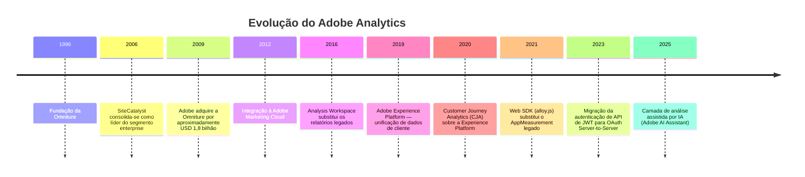
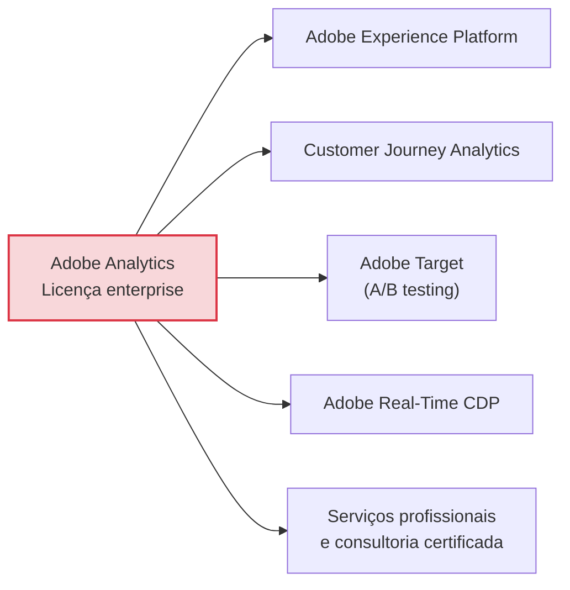
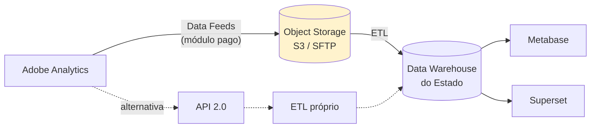

# Adobe Analytics

> **Ficha técnica de plataforma** · Pontuação na matriz: **405/600 (67,5 %)** — 9º lugar · 🟠 Condicionada
> **Situação:** ❌ **Não selecionada** — desproporção de custo frente ao princípio da economicidade
> [← Voltar ao índice](../README.md) · [Matriz de decisão](../docs/07-matriz-decisao.md) · [Análise de custo](../comparativos/custo.md)

---

## Sumário

- [1. Visão geral](#1-visão-geral)
- [2. Licenciamento](#2-licenciamento)
- [3. Hospedagem](#3-hospedagem)
- [4. Funcionalidades](#4-funcionalidades)
- [5. APIs](#5-apis)
- [6. Exemplos de integração](#6-exemplos-de-integração)
- [7. Integrações](#7-integrações)
- [8. Infraestrutura](#8-infraestrutura)
- [9. Segurança](#9-segurança)
- [10. Governança](#10-governança)
- [11. Performance](#11-performance)
- [12. Custos](#12-custos)
- [13. Pontos fortes](#13-pontos-fortes)
- [14. Pontos fracos](#14-pontos-fracos)
- [15. Quando utilizar](#15-quando-utilizar)
- [16. Quando evitar](#16-quando-evitar)
- [17. Notas do avaliador](#17-notas-do-avaliador)

---

## 1. Visão geral

### 1.1 Identificação

| Campo | Valor |
|-------|-------|
| **Nome** | Adobe Analytics |
| **Nomes anteriores** | Omniture SiteCatalyst → Adobe SiteCatalyst → Adobe Analytics |
| **Origem** | Omniture, fundada em 1996 |
| **Aquisição pela Adobe** | 2009 |
| **Mantenedor** | Adobe Inc. |
| **Sede** | Estados Unidos |
| **Segmento** | Enterprise Web Analytics / Customer Journey Analytics |
| **Site oficial** | `https://business.adobe.com/products/analytics/adobe-analytics.html` |

### 1.2 História



### 1.3 Comunidade

| Indicador | Situação |
|-----------|----------|
| Idade do produto | 29+ anos |
| Governança | Fechada — Adobe Inc. |
| Base instalada | Grandes corporações globais |
| Certificação oficial | ✅ Adobe Certified Professional / Expert |
| Rede de parceiros no Brasil | 🟢 Consolidada |
| Comunidade técnica | 🟡 Relevante, porém restrita ao segmento enterprise |
| Adoção no setor público | ⚠️ Presente em administrações de grande porte (ex.: setor público britânico) |
| **Nota C11 (Comunidade)** | **3/5** |

### 1.4 Modelo de negócio



**Classificação:** licenciamento enterprise por contrato, com forte estratégia de expansão dentro da suíte Adobe Experience Cloud.

### 1.5 Casos de uso

| Caso de uso | Aderência |
|-------------|:---------:|
| Grande corporação com orçamento de marketing dedicado | 🟢 Excelente |
| E-commerce de larga escala com atribuição complexa | 🟢 Excelente |
| Organização já investida na Adobe Experience Cloud | 🟢 Excelente |
| Análise de jornada omnichannel | 🟢 Excelente |
| Portal institucional público estadual | 🔴 **Desproporcional** |
| Organização sem equipe analítica dedicada | 🔴 Inadequada |

---

## 2. Licenciamento

| Campo | Valor |
|-------|-------|
| **Tipo** | 🔴 Proprietária |
| **Licença** | Contrato comercial (Adobe Enterprise Term License Agreement) |
| **Código-fonte** | ❌ Fechado |
| **Auditabilidade** | ❌ Nenhuma |
| **Preço** | ❌ **Não público** — negociado por contrato |
| **Modelo de cobrança** | Por volume de *server calls* / contrato anual com compromisso mínimo |
| **Direito perpétuo** | ❌ Nenhum |
| **Fork** | ❌ Impossível |

### 2.1 Edições

| Edição | Escopo |
|--------|--------|
| **Select** | Web analytics essencial |
| **Prime** | Multicanal, atribuição avançada |
| **Ultimate** | Atribuição algorítmica, Data Workbench, previsões |
| **Customer Journey Analytics** | Análise sobre a Adobe Experience Platform |

> **⚠️ Bloco de Risco — Preço não público**
> A Adobe **não publica preços**. As estimativas usadas neste estudo (faixa de R$ 4,5 M a R$ 7 M em 5 anos, incluindo licença, implantação, consultoria e treinamento) são **estimativas de mercado** e **não devem ser usadas em peça orçamentária ou licitatória sem cotação formal**.
>
> Registrado como pendência **V4** em [`../docs/12-referencias.md`](../docs/12-referencias.md#242-pendências-de-verificação-antes-da-homologação).
>
> Independentemente do valor exato, a **ordem de grandeza** é inequivocamente superior à das alternativas avaliadas, e é essa ordem de grandeza — não o valor preciso — que fundamenta a análise de economicidade.

---

## 3. Hospedagem

| Modalidade | Suporte |
|-----------|:-------:|
| Auto-hospedado | ❌ |
| Docker / Kubernetes | ❌ |
| SaaS público | ✅ Única modalidade |
| Região de dados selecionável | ⚠️ Negociável contratualmente |
| On-premises | ❌ |
| Nuvem privada do cliente | ⚠️ Negociável em contratos de grande porte |

| Aspecto | Detalhe |
|---------|---------|
| **Localização dos dados** | Datacenters da Adobe; região negociável em contrato |
| **Transferência internacional** | ⚠️ Sim |
| **Instrumento** | DPA formal + cláusulas contratuais padrão |
| **Aplicabilidade à LGPD** | ⚠️ Exige avaliação do art. 33 |

---

## 4. Funcionalidades

| Funcionalidade | Suporte | Detalhe |
|---------------|:-------:|---------|
| **Dashboards** | ✅ | Analysis Workspace — a interface analítica mais poderosa do mercado |
| **Eventos customizados** | ✅ | Modelo de eventos, props e eVars |
| **Goals** | ✅ | Métricas calculadas e eventos de sucesso |
| **Conversion Funnel** | ✅ | Fallout e Flow analysis |
| **Heatmaps** | 💲 | Via Adobe Target ou Activity Map |
| **Session Recording** | 💲 | Módulo adicional |
| **User Journey** | ✅ | Flow, Journey Canvas, CJA |
| **A/B Testing** | 💲 | Adobe Target (produto separado) |
| **Form Analytics** | 💲 | Via instrumentação customizada ou módulo |
| **Real Time** | ✅ | Real-Time Reports |
| **Cohort** | ✅ | Cohort Analysis nativo |
| **Retention** | ✅ | Nativo |
| **Custom Dimensions** | ✅ | eVars, props, dimensões calculadas — muito extensível |
| **Segmentação** | ✅ | Segment Builder com lógica ilimitada; segmentos sequenciais |
| **Atribuição** | ✅ | Modelos regra-base e **algorítmica** (Attribution IQ) |
| **Anomaly detection** | ✅ | Nativo, estatístico |
| **Contribution analysis** | ✅ | Análise automática de causa de anomalia |
| **Data Warehouse** | ✅ | Exportação de dados detalhados |
| **Data Feeds** | 💲 | Exportação de dado bruto (*hit-level*) |
| **Machine learning / IA** | ✅ | Previsões, segmentos preditivos, AI Assistant |
| **Amostragem** | ❌ | Nenhuma |

### 4.1 Cobertura dos requisitos funcionais

| Prioridade | Atendidos | Cobertura |
|-----------|:---------:|----------:|
| *Must have* | 17 / 17 | 100 % |
| *Should have* | 17 / 18 | 94 % |
| *Could have* | 11 / 12 | 92 % |
| **Ponderada** | **96 / 99** | **97 %** |

**Nota C05 (Recursos analíticos): 5/5** — a maior cobertura funcional do estudo.

---

## 5. APIs

| API | Tipo | Finalidade |
|-----|------|-----------|
| **Analytics API 2.0** | REST | Relatórios, segmentos, métricas calculadas |
| **Bulk Data Insertion API** | REST | Ingestão em lote |
| **Data Warehouse Request API** | REST | Exportação de dados detalhados |
| **Data Feeds** | Arquivo (FTP/S3) | Dado bruto *hit-level* |
| **Livestream** | Streaming | Fluxo de eventos em tempo quase real |
| **GraphQL** | ❌ | |
| **Webhooks** | ⚠️ | Via Adobe I/O Events |

### 5.1 Analytics API 2.0

| Característica | Valor |
|---------------|-------|
| **Base** | `https://analytics.adobe.io/api/{companyId}/` |
| **Autenticação** | **OAuth Server-to-Server** (o método JWT foi descontinuado) |
| **Versionamento** | ✅ Explícito (`2.0`) |
| **Formato** | JSON |
| **Rate limits** | ✅ Documentados por organização e por token |
| **Cabeçalhos obrigatórios** | `x-api-key`, `x-proxy-global-company-id`, `Authorization` |

### 5.2 SDKs oficiais

| Linguagem | Situação |
|----------|:--------:|
| Python | ✅ |
| Node.js | ✅ |
| Java | ✅ |
| .NET | ✅ |
| Web SDK (`alloy.js`) | ✅ |
| iOS / Android | ✅ |

**Nota C06 (APIs): 5/5** — a superfície de API mais completa do estudo: leitura, escrita, exportação de dado bruto, streaming, SDKs amplos, versionamento explícito e autenticação robusta.

---

## 6. Exemplos de integração

### 6.1 Python

```python
"""
Adobe Analytics API 2.0 — autenticação OAuth Server-to-Server.
Requisitos: requests
"""
import os
import requests

IMS_TOKEN_URL = "https://ims-na1.adobelogin.com/ims/token/v3"
API_BASE = "https://analytics.adobe.io/api"


def obter_token() -> str:
    """Obtém access token via OAuth Server-to-Server."""
    resp = requests.post(IMS_TOKEN_URL, data={
        "grant_type": "client_credentials",
        "client_id": os.environ["ADOBE_CLIENT_ID"],
        "client_secret": os.environ["ADOBE_CLIENT_SECRET"],
        "scope": "openid,AdobeID,additional_info.projectedProductContext",
    }, timeout=30)
    resp.raise_for_status()
    return resp.json()["access_token"]


def relatorio(rsid: str, data_inicio: str, data_fim: str,
              dimension: str = "variables/page",
              metric: str = "metrics/pageviews", limite: int = 50) -> list[dict]:
    token = obter_token()
    company_id = os.environ["ADOBE_COMPANY_ID"]

    headers = {
        "Authorization": f"Bearer {token}",
        "x-api-key": os.environ["ADOBE_CLIENT_ID"],
        "x-proxy-global-company-id": company_id,
        "Content-Type": "application/json",
    }

    payload = {
        "rsid": rsid,
        "globalFilters": [{
            "type": "dateRange",
            "dateRange": f"{data_inicio}T00:00:00.000/{data_fim}T23:59:59.999",
        }],
        "metricContainer": {
            "metrics": [{"columnId": "0", "id": metric}]
        },
        "dimension": dimension,
        "settings": {"limit": limite, "page": 0, "countRepeatInstances": True},
    }

    r = requests.post(f"{API_BASE}/{company_id}/reports",
                      headers=headers, json=payload, timeout=60)
    r.raise_for_status()
    dados = r.json()

    return [
        {"item": linha["value"], "valor": linha["data"][0]}
        for linha in dados.get("rows", [])
    ]


if __name__ == "__main__":
    for linha in relatorio(os.environ["ADOBE_RSID"], "2026-07-01", "2026-07-31"):
        print(f"{linha['valor']:>12,.0f}  {linha['item']}")
```

### 6.2 Node.js

```javascript
/** Adobe Analytics API 2.0 — Node.js 18+ */
async function obterToken() {
  const body = new URLSearchParams({
    grant_type: 'client_credentials',
    client_id: process.env.ADOBE_CLIENT_ID,
    client_secret: process.env.ADOBE_CLIENT_SECRET,
    scope: 'openid,AdobeID,additional_info.projectedProductContext',
  });

  const res = await fetch('https://ims-na1.adobelogin.com/ims/token/v3', {
    method: 'POST',
    headers: { 'Content-Type': 'application/x-www-form-urlencoded' },
    body,
  });
  if (!res.ok) throw new Error(`Adobe IMS ${res.status}`);
  return (await res.json()).access_token;
}

async function relatorio({ rsid, dataInicio, dataFim, dimension, metric }) {
  const token = await obterToken();
  const companyId = process.env.ADOBE_COMPANY_ID;

  const res = await fetch(`https://analytics.adobe.io/api/${companyId}/reports`, {
    method: 'POST',
    headers: {
      Authorization: `Bearer ${token}`,
      'x-api-key': process.env.ADOBE_CLIENT_ID,
      'x-proxy-global-company-id': companyId,
      'Content-Type': 'application/json',
    },
    body: JSON.stringify({
      rsid,
      globalFilters: [{
        type: 'dateRange',
        dateRange: `${dataInicio}T00:00:00.000/${dataFim}T23:59:59.999`,
      }],
      metricContainer: { metrics: [{ columnId: '0', id: metric }] },
      dimension,
      settings: { limit: 50, page: 0 },
    }),
  });

  if (!res.ok) throw new Error(`Adobe Analytics ${res.status}`);
  const data = await res.json();
  return data.rows.map((r) => ({ item: r.value, valor: r.data[0] }));
}
```

### 6.3 Power BI

| Caminho | Avaliação |
|---------|-----------|
| Conector nativo do Adobe Analytics | ✅ Disponível no Power BI Desktop |
| Data Feeds → Data Lake → Power BI | ✅ Preferencial para grande volume |
| Power Query M sobre a API 2.0 | 🔧 Requer tratamento de OAuth |

```
Power BI Desktop → Obter Dados → Adobe Analytics
→ Autenticar (conta Adobe)
→ Selecionar Report Suite
→ Escolher dimensões e métricas
```

### 6.4 Grafana

| Caminho | Avaliação |
|---------|-----------|
| Datasource nativo | ❌ Não existe |
| Coletor próprio (API 2.0) → Prometheus/InfluxDB | 🔧 Caminho usual |
| Data Feeds → data warehouse → datasource SQL | ✅ Preferencial |

### 6.5 Metabase e Apache Superset

Nenhuma conexão direta — não há endpoint SQL. Caminho:



### 6.6 Qlik Sense

```qlik
// Qlik REST Connector sobre a Analytics API 2.0
// Requer obtenção prévia do token OAuth (por script externo ou variável)
LIB CONNECT TO 'AdobeAnalyticsREST';

RestConnectorMasterTable:
SQL SELECT "value", "__KEY_rows", "data"
FROM JSON (wrap on) "rows"
WITH CONNECTION (
    URL "https://analytics.adobe.io/api/$(vCompanyId)/reports",
    HTTPHEADER "Authorization" "Bearer $(vToken)",
    HTTPHEADER "x-api-key" "$(vClientId)",
    HTTPHEADER "x-proxy-global-company-id" "$(vCompanyId)",
    BODY "$(vPayloadJson)"
);
```

### 6.7 Google Looker Studio

| Caminho | Avaliação |
|---------|-----------|
| Conector nativo | ❌ Não existe |
| Conector de terceiro (pago) | ⚠️ Disponível no mercado |
| Via BigQuery (Data Feeds → BigQuery) | 🔧 Viável |

> **📌 Observação**
> A integração Adobe → Google é deliberadamente pouco favorecida por ambos os fornecedores, por serem concorrentes diretos no mercado de plataformas de experiência. Organizações que operam nas duas suítes constroem a ponte por conta própria.

---

## 7. Integrações

| Integração | Suporte |
|-----------|:-------:|
| **Google Tag Manager** | ✅ Tag customizada |
| **Adobe Experience Platform Tags (Launch)** | ✅ **Nativo** — tag manager próprio |
| **Matomo Tag Manager** | 🔧 |
| **Consent Manager** | ✅ Adobe Privacy Service + integração com CMPs |
| **IAB TCF** | ✅ |
| **Identity Provider** | ✅ Adobe IMS federado |
| **OAuth 2.0** | ✅ Nativo |
| **OpenID Connect** | ✅ |
| **SAML 2.0** | ✅ |
| **Adobe Experience Cloud** | ✅ Integração de primeira classe |
| **Salesforce, Microsoft Dynamics** | ✅ |
| **Ecossistema de parceiros** | ✅ Amplo |

**Nota C07 (Integrações): 5/5**

---

## 8. Infraestrutura

| Aspecto | Detalhe |
|---------|---------|
| **Banco utilizado** | ❌ Não divulgado (proprietário) |
| **Escalabilidade** | ✅ Enterprise, sem esforço do cliente |
| **Cache** | Gerenciado |
| **Alta disponibilidade** | ✅ Com SLA contratual |
| **Cluster** | ➖ Não aplicável |
| **Backup** | ➖ Responsabilidade do fornecedor |
| **Disaster Recovery** | ✅ Contratual |
| **Controle do cliente** | ❌ Nenhum |

---

## 9. Segurança

| Aspecto | Situação |
|---------|----------|
| **LGPD** | ⚠️ DPA robusto e controles de privacidade maduros; transferência internacional exige avaliação |
| **GDPR** | ✅ Privacy Service com atendimento a direitos do titular |
| **ISO 27001** | ✅ |
| **SOC 2 Type II** | ✅ |
| **FedRAMP** | ✅ Em determinadas ofertas governamentais dos EUA |
| **Controle de acesso** | ✅ RBAC granular via Adobe Admin Console |
| **MFA** | ✅ |
| **Auditoria** | ✅ Audit Logs completo |
| **Logs** | ✅ Exportáveis |
| **Criptografia em trânsito** | ✅ TLS |
| **Criptografia em repouso** | ✅ |
| **Retenção de dados** | ✅ Contratual, configurável |
| **Nota C09 (Segurança)** | **5/5** — a mais alta do estudo |

> **📌 Observação — Segurança não é o problema do Adobe**
> O Adobe Analytics obtém a nota máxima em segurança e a maior cobertura funcional do estudo. Sua inadequação para este caso de uso **não é técnica** — é de **economicidade e de governança de dados**.
>
> Registrar isso explicitamente é importante para a integridade do estudo: descartar uma plataforma por custo é diferente de descartá-la por deficiência técnica, e a fundamentação deve refletir a razão real.

---

## 10. Governança

| Aspecto | Avaliação |
|---------|:---------:|
| **Vendor lock-in** | 🔴 **Muito alto** — o maior do estudo |
| **Controle dos dados** | 🟠 Parcial — Data Feeds disponíveis, porém como módulo pago |
| **Portabilidade** | 🟠 Parcial |
| **Transparência** | 🔴 Nenhuma — código fechado |
| **Auditoria** | 🟡 Documental, apoiada em certificações robustas |
| **Soberania** | 🟠 Contratual — região negociável, sem custódia própria |
| **Continuidade sem o fornecedor** | ❌ Impossível |
| **Custo de saída** | 🔴 ~R$ 600 k+ |
| **Nota C02 (Controle)** | **2/5** |
| **Nota C04 (Independência)** | **1/5** |

> **⚠️ Bloco de Risco — O lock-in mais profundo do estudo**
> O lock-in do Adobe Analytics não decorre apenas do formato dos dados. Decorre da **implementação**:
>
> 1. A instrumentação usa eVars, props e events com semântica específica da plataforma — não portável;
> 2. Segmentos, métricas calculadas e Analysis Workspaces representam anos de trabalho analítico acumulado, não exportáveis para outra ferramenta;
> 3. A equipe é certificada em uma ferramenta específica;
> 4. Integrações com Target, Launch e Experience Platform criam dependências cruzadas.
>
> Migrar do Adobe Analytics não é exportar dados — é **reimplementar toda a camada analítica**. Daí o custo de saída estimado em R$ 600 k+.

---

## 11. Performance

| Métrica | Valor |
|---------|-------|
| **Volume suportado** | Ilimitado (enterprise) |
| **Escalabilidade horizontal** | ✅ Gerenciada |
| **Escalabilidade vertical** | ➖ Não aplicável |
| **Latência de coleta** | 🟢 Baixa |
| **Latência de relatório** | 🟢 Rápida, mesmo em consultas complexas |
| **Frescor dos dados** | 🟢 30 min a 2 h para relatórios completos |
| **Tamanho do script (gzip)** | 🔴 ~80 KB+ (Web SDK / AppMeasurement) |
| **Impacto no LCP** | 🔴 **Alto** — o maior do estudo |
| **Amostragem** | ❌ Nenhuma |
| **Nota C08 (Escalabilidade)** | **5/5** |

> **⚠️ Bloco de Risco — Peso do script**
> O Web SDK do Adobe é aproximadamente **80× maior** que o tracker do Plausible e **4× maior** que o do Matomo. Em portal público acessado majoritariamente por dispositivos móveis em conexões limitadas, isso tem impacto mensurável em Core Web Vitals e, portanto, em acessibilidade digital.

---

## 12. Custos

| Componente | 5 anos (estimativa de mercado) |
|-----------|-------------------------------:|
| **Licenciamento** | R$ 3.000.000 – R$ 6.000.000 |
| Infraestrutura | R$ 0 (SaaS) |
| **Implantação e consultoria** | R$ 300.000 – R$ 800.000 |
| **Treinamento e certificação** | R$ 80.000 – R$ 150.000 |
| Equipe / operação (especialista dedicado) | R$ 500.000 |
| Adobe Target (se A/B testing for requisito) | Contrato adicional |
| Data Feeds (dado bruto) | Módulo adicional |
| **Custo estimado de saída** | R$ 600.000+ |
| **TCO 5 anos** | **≈ R$ 4.500.000 – R$ 7.000.000** |
| **Nota C03 (TCO)** | **1/5** — nota mínima |

> **🚨 Alerta — Análise de economicidade**
>
> | Comparação | Razão |
> |-----------|------:|
> | Adobe Analytics × Matomo On-Premise | **7× a 10×** |
> | Adobe Analytics × Piwik PRO | 3,5× a 5× |
> | Adobe Analytics × PostHog auto-hospedado | 2,7× a 4× |
>
> Uma diferença dessa ordem para mensurar portais institucionais estaduais tem sustentação difícil perante:
> - **CF/88, art. 37** — princípio da eficiência;
> - **CF/88, art. 70** — controle de economicidade pelo Tribunal de Contas;
> - **Lei nº 14.133/2021, art. 5º** — princípio da economicidade nas contratações.
>
> A questão não é se o Adobe Analytics é melhor — em capacidade analítica, é. A questão é se a **capacidade adicional justifica o custo adicional** no caso de uso concreto. Para portais institucionais de um Estado, a resposta objetiva é não: os requisitos *Must have* são integralmente atendidos por alternativas a 10 % a 15 % do custo.

---

## 13. Pontos fortes

| # | Ponto forte |
|---|------------|
| 1 | **A maior profundidade analítica do mercado** — Analysis Workspace |
| 2 | **Atribuição algorítmica** (Attribution IQ) |
| 3 | **Segmentação ilimitada**, incluindo segmentos sequenciais |
| 4 | **Detecção de anomalias e contribution analysis** nativas |
| 5 | **API mais completa do estudo** — leitura, escrita, dado bruto, streaming |
| 6 | **Segurança e certificações no nível mais alto** (ISO 27001, SOC 2, FedRAMP) |
| 7 | **SLA contratual e suporte enterprise** |
| 8 | **Escalabilidade ilimitada sem amostragem** |
| 9 | **Tag manager próprio** (Adobe Experience Platform Tags) |
| 10 | **Ecossistema integrado** — Target, CJA, Real-Time CDP |
| 11 | **Rede de parceiros consolidada no Brasil** |
| 12 | **Documentação e certificação formal** |

---

## 14. Pontos fracos

| # | Ponto fraco | Mitigável? |
|---|------------|:----------:|
| 1 | **TCO 7× a 10× superior às alternativas adequadas** | ❌ Não |
| 2 | **Lock-in mais profundo do estudo** | ❌ Não |
| 3 | **Preço não público** — dificulta planejamento e licitação | ❌ Não |
| 4 | **Custo de saída ~R$ 600 k+** | ❌ Não |
| 5 | **Script de ~80 KB degrada o desempenho do portal** | ⚠️ Configuração parcial |
| 6 | **Curva de aprendizado muito alta** | ⚠️ Certificação formal |
| 7 | **Dependência de consultoria certificada** | ⚠️ Capacitação interna |
| 8 | **Transferência internacional** | ⚠️ Região negociável |
| 9 | **Código fechado — sem auditoria verificável** | ❌ Não |
| 10 | **A/B testing exige produto adicional (Adobe Target)** | ❌ Não |
| 11 | **Dado bruto exige módulo pago (Data Feeds)** | ❌ Não |
| 12 | **Contratação complexa para órgão público** | ⚠️ Processo licitatório |

---

## 15. Quando utilizar

> **✅ Use o Adobe Analytics quando:**
>
> - A organização for **grande corporação** com orçamento de marketing digital na ordem de milhões;
> - A **atribuição multicanal complexa** for central ao negócio;
> - A organização já operar a **Adobe Experience Cloud**;
> - Existir **equipe analítica dedicada e certificada**;
> - **Análise omnichannel** (web, app, loja física, call center) for requisito;
> - **SLA contratual e suporte enterprise** forem obrigatórios;
> - **Certificações formais do fornecedor** (ISO 27001, SOC 2, FedRAMP) forem exigência normativa;
> - O volume for de bilhões de eventos e a ausência de amostragem for crítica.

---

## 16. Quando evitar

> **🚨 Evite o Adobe Analytics quando:**
>
> - O orçamento não comportar a ordem de grandeza de milhões — **caso deste estudo**;
> - Não houver **equipe analítica dedicada** para extrair valor da profundidade oferecida;
> - **Independência tecnológica** for requisito de governança;
> - **Auditabilidade verificável** for exigência de controle;
> - O caso de uso for **web analytics convencional** — a capacidade adicional não seria utilizada;
> - **Soberania sobre os dados** for requisito;
> - O **desempenho do portal** for crítico (peso do script);
> - A organização não puder assumir **compromisso contratual plurianual** de alto valor;
> - Como plataforma de portais institucionais de um governo estadual — **desproporcional**.

---

## 17. Notas do avaliador

### 17.1 Notas atribuídas

| Critério | Peso | Nota | Pontos |
|----------|-----:|:----:|-------:|
| C01 — LGPD | 15 | 3 | 45 |
| C02 — Controle dos dados | 15 | **2** | 30 |
| C03 — TCO | 15 | **1** | 15 |
| C04 — Independência tecnológica | 10 | **1** | 10 |
| C05 — Recursos analíticos | 10 | **5** | 50 |
| C06 — APIs | 10 | **5** | 50 |
| C07 — Integrações | 10 | **5** | 50 |
| C08 — Escalabilidade | 10 | **5** | 50 |
| C09 — Segurança | 10 | **5** | 50 |
| C10 — Operação | 5 | 4 | 20 |
| C11 — Comunidade | 5 | 3 | 15 |
| C12 — Documentação | 5 | 4 | 20 |
| **Total** | **120** | | **405 / 600 (67,5 %)** |

### 17.2 Observação final

> **📌 Observação — A plataforma mais capaz do estudo, em 9º lugar**
>
> O Adobe Analytics obtém **nota 5 em cinco critérios** — mais que qualquer outra plataforma avaliada. É, tecnicamente, a plataforma mais capaz do estudo.
>
> Sua posição decorre de **nota 1 em C03 (TCO, peso 15)** e **nota 1 em C04 (Independência, peso 10)**. Somente nesses dois critérios perde **85 pontos** para o Matomo On-Premise.
>
> Isso ilustra com precisão o que uma matriz de decisão ponderada faz: **não escolhe a plataforma mais capaz, escolhe a mais adequada ao contexto**. Um Ferrari é um carro melhor que uma van escolar, e ainda assim não se compra Ferrari para transportar alunos.
>
> A comparação vale nos dois sentidos: se o contexto fosse uma corporação global com orçamento de marketing dedicado, os pesos seriam outros e o Adobe Analytics venceria com folga.

---

## Referências

- Produto: `https://business.adobe.com/products/analytics/adobe-analytics.html`
- Documentação: `https://experienceleague.adobe.com/docs/analytics.html`
- Analytics API 2.0: `https://developer.adobe.com/analytics-apis/docs/2.0/`
- Autenticação OAuth S2S: `https://developer.adobe.com/developer-console/docs/guides/authentication/`
- Data Feeds: `https://experienceleague.adobe.com/docs/analytics/export/analytics-data-feed/data-feed-overview.html`
- Conformidade: `https://www.adobe.com/trust/compliance/compliance-list.html`
- Lista completa: [`../docs/12-referencias.md`, seção 12](../docs/12-referencias.md#12-documentação-oficial--adobe-analytics)

---

| ← Anterior | Índice | Próxima → |
|-----------|--------|-----------|
| [Open Web Analytics](open-web-analytics.md) | [Plataformas](../README.md) | [Simple Analytics](simple-analytics.md) |
