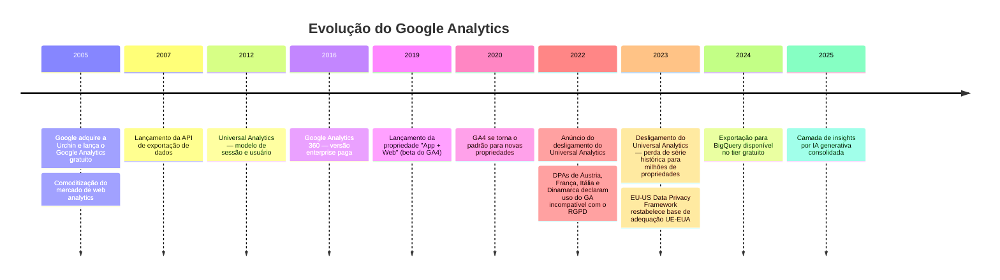
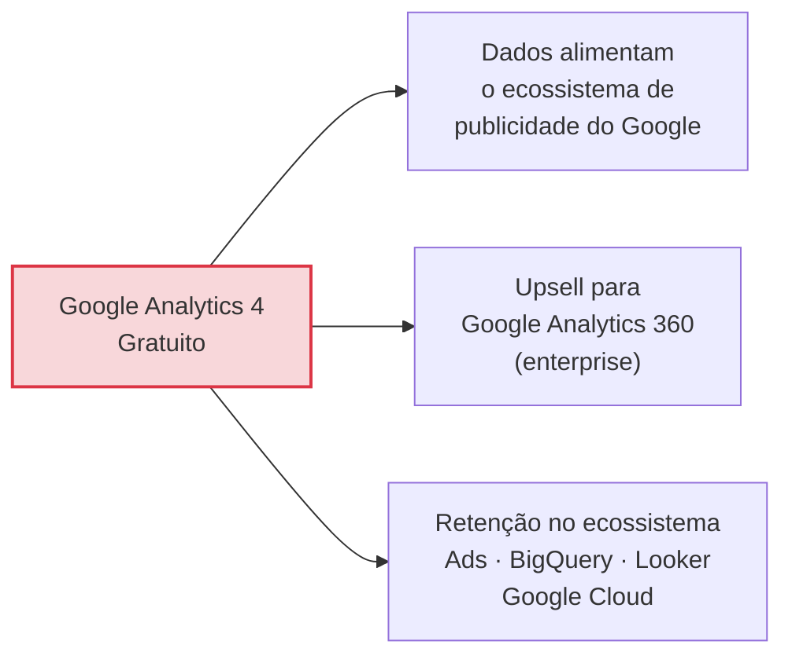
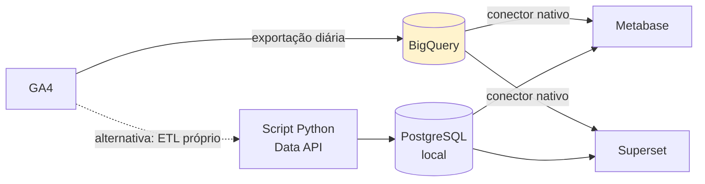

# Google Analytics 4

> **Ficha técnica de plataforma** · Pontuação na matriz: **410/600 (68,3 %)** — 8º lugar · 🟠 Condicionada
> **Situação:** ⛔ **Vedado como plataforma padrão** pelo ADR-001
> [← Voltar ao índice](../README.md) · [Matriz de decisão](../docs/07-matriz-decisao.md) · [Análise LGPD](../comparativos/lgpd.md)

---

## Sumário

- [1. Visão geral](#1-visão-geral)
- [2. Licenciamento](#2-licenciamento)
- [3. Hospedagem](#3-hospedagem)
- [4. Funcionalidades](#4-funcionalidades)
- [5. APIs](#5-apis)
- [6. Exemplos de integração](#6-exemplos-de-integração)
- [7. Integrações](#7-integrações)
- [8. Infraestrutura](#8-infraestrutura)
- [9. Segurança](#9-segurança)
- [10. Governança](#10-governança)
- [11. Performance](#11-performance)
- [12. Custos](#12-custos)
- [13. Pontos fortes](#13-pontos-fortes)
- [14. Pontos fracos](#14-pontos-fracos)
- [15. Quando utilizar](#15-quando-utilizar)
- [16. Quando evitar](#16-quando-evitar)
- [17. Notas do avaliador](#17-notas-do-avaliador)

---

## 1. Visão geral

### 1.1 Identificação

| Campo | Valor |
|-------|-------|
| **Nome** | Google Analytics 4 (GA4) |
| **Antecessores** | Urchin (adquirido em 2005) → Google Analytics → Universal Analytics → GA4 |
| **Ano de lançamento (GA4)** | 2020 (como "App + Web"); consolidado em 2020–2022 |
| **Mantenedor** | Google LLC |
| **Sede** | Estados Unidos |
| **Segmento** | Web Analytics tradicional + Product Analytics |
| **Site oficial** | `https://analytics.google.com/` |

### 1.2 História



> **⚠️ Bloco de Risco — A lição de 2023**
> O desligamento do Universal Analytics é o evento mais relevante deste histórico para uma decisão de arquitetura pública. Ele demonstrou que:
>
> 1. Uma plataforma SaaS gratuita pode ser **descontinuada unilateralmente**, com prazo definido pelo fornecedor;
> 2. A migração **não preservou o histórico** — os dados do UA não são importáveis para o GA4;
> 3. O custo integral da migração (reimplantação de tags, reconfiguração, retreinamento, perda de série histórica) foi transferido ao cliente;
> 4. O modelo de dados mudou de sessão para evento, exigindo **retreinamento completo** das equipes.
>
> Esse é o fundamento empírico — não hipotético — da nota **1** atribuída ao critério C04 (Independência tecnológica).

### 1.3 Comunidade

| Indicador | Situação |
|-----------|----------|
| Base instalada | A maior do mercado de web analytics |
| Profissionais no Brasil | 🟢 Oferta ampla — agências, consultorias, certificações |
| Material de aprendizagem | 🟢 Abundante, incluindo em português |
| Certificação oficial | ✅ Google Analytics Certification (gratuita) |
| Comunidade de desenvolvedores | 🟢 Grande |
| Governança | ❌ Fechada — nenhuma participação externa |
| **Nota C11 (Comunidade)** | **5/5** |

### 1.4 Modelo de negócio



**Classificação:** produto gratuito estratégico. A gratuidade é sustentada pelo valor dos dados e pela retenção no ecossistema, não por assinatura.

> **📌 Observação — Implicação para o setor público**
> Um produto cujo modelo de negócio depende do valor dos dados coletados exige, do controlador público, avaliação específica sobre finalidade e compartilhamento. Os Termos de Serviço do Google Analytics preveem hipóteses de uso dos dados pelo fornecedor. Para um órgão público brasileiro, isso deve ser examinado à luz dos princípios da finalidade e da necessidade (art. 6º, I e III da LGPD).

### 1.5 Casos de uso

| Caso de uso | Aderência |
|-------------|:---------:|
| Site comercial com foco em marketing digital | 🟢 Excelente |
| E-commerce integrado a Google Ads | 🟢 Excelente |
| Aplicativo móvel (via Firebase) | 🟢 Excelente |
| Organização já no ecossistema Google Cloud | 🟢 Excelente |
| Portal público com requisito de soberania | 🔴 **Inadequada** |
| Serviço digital com dado pessoal sensível | 🔴 **Inadequada** |
| Organização que precisa de dado exato sem amostragem | 🟠 Limitada |

---

## 2. Licenciamento

| Campo | Valor |
|-------|-------|
| **Tipo** | 🔴 Proprietária |
| **Licença** | Termos de Serviço do Google Analytics |
| **Código-fonte** | ❌ Fechado |
| **Auditabilidade** | ❌ Nenhuma |
| **Custo — tier gratuito** | **R$ 0** |
| **Custo — Google Analytics 360** | Contrato; não público (estimativa de mercado: faixa superior a USD 100 k/ano) |
| **Direito perpétuo** | ❌ Nenhum — o serviço pode ser descontinuado |
| **Fork** | ❌ Impossível |

### 2.1 Limites do tier gratuito

| Limite | Valor |
|--------|-------|
| Eventos coletados | Sem limite declarado |
| **Retenção de dados de evento** | ⚠️ Máximo **14 meses** |
| Retenção de dados de aquisição de usuário | 14 meses |
| **Amostragem em explorações** | ⚠️ Aplicada acima de limiar de eventos |
| Cardinalidade de dimensões | Limitada — valores excedentes agrupados em "(other)" |
| Dimensões customizadas de evento | 50 |
| Dimensões customizadas de usuário | 25 |
| Métricas customizadas | 50 |
| Audiências | 100 |
| Conversões (eventos-chave) | 30 |
| Exportação para BigQuery | ✅ Disponível (com limite diário de eventos exportados) |
| SLA | ❌ Nenhum |
| Suporte | ❌ Comunidade e documentação |

> **🚨 Alerta — Retenção máxima de 14 meses**
> O limite de retenção de dados de evento é **definido unilateralmente pelo fornecedor** e não é ampliável no tier gratuito. Isso significa que:
>
> 1. Análise ad-hoc sobre período superior a 14 meses é impossível;
> 2. Séries históricas de longo prazo só existem nos relatórios pré-agregados padrão;
> 3. A única forma de preservar o dado bruto é a **exportação contínua para o BigQuery**, que precisa estar configurada **desde o início da coleta** — dado anterior à configuração é irrecuperável.
>
> Isso caracteriza falha no requisito **RL-05** (controle sobre a política de retenção): o Estado não define por quanto tempo seus dados são mantidos.

---

## 3. Hospedagem

| Modalidade | Suporte |
|-----------|:-------:|
| Auto-hospedado | ❌ |
| Docker / Kubernetes | ❌ |
| SaaS público | ✅ Única modalidade |
| Região de dados selecionável | ❌ |
| On-premises | ❌ |
| Nuvem privada do cliente | ❌ |

| Aspecto | Detalhe |
|---------|---------|
| **Localização dos dados** | Infraestrutura global do Google; sem controle do cliente |
| **Transferência internacional** | ⚠️ **Sim, incluindo para os Estados Unidos** |
| **Instrumento de transferência** | Cláusulas contratuais padrão e, no contexto europeu, o EU-US Data Privacy Framework |
| **Aplicabilidade ao Brasil** | ⚠️ O DPF **não se aplica** — a LGPD tem regime próprio (arts. 33–36) e a ANPD não reconheceu os EUA como país de nível adequado |

---

## 4. Funcionalidades

| Funcionalidade | Suporte | Detalhe |
|---------------|:-------:|---------|
| **Dashboards** | ✅ | Relatórios padrão + coleções customizáveis |
| **Eventos customizados** | ✅ | Modelo integralmente baseado em eventos |
| **Goals (eventos-chave)** | ✅ | Até 30 no tier gratuito |
| **Conversion Funnel** | ✅ | Exploração de funil, com funil aberto e fechado |
| **Heatmaps** | ❌ | Não disponível |
| **Session Recording** | ❌ | Não disponível |
| **User Journey** | ✅ | Exploração de caminho (*path exploration*) |
| **A/B Testing** | ⚠️ | O Google Optimize foi descontinuado; requer ferramenta externa |
| **Form Analytics** | 🔧 | Apenas via eventos customizados manualmente instrumentados |
| **Real Time** | ✅ | Relatório em tempo real (janela de 30 min) |
| **Cohort** | ✅ | Exploração de coorte |
| **Retention** | ✅ | Relatório de retenção nativo |
| **Custom Dimensions** | ✅ | 50 de evento, 25 de usuário |
| **Segmentação** | ✅ | Comparações e segmentos em explorações |
| **Atribuição** | ✅ | Modelos de atribuição, incluindo baseada em dados |
| **Machine learning** | ✅ | Métricas preditivas, detecção de anomalias, insights |
| **Exportação para BigQuery** | ✅ | Disponível no tier gratuito |
| **Amostragem** | ⚠️ **Sim** | Aplicada em explorações acima de limiar |
| **Consulta SQL** | ⚠️ | Apenas via BigQuery (custo adicional) |

### 4.1 Cobertura dos requisitos funcionais

| Prioridade | Atendidos | Cobertura |
|-----------|:---------:|----------:|
| *Must have* | 15 / 17 | 88 % |
| *Should have* | 14 / 18 | 78 % |
| *Could have* | 6 / 12 | 50 % |
| **Ponderada** | **79 / 99** | **80 %** |

**Nota C05 (Recursos analíticos): 4/5** — cobertura na faixa 75–89 %. Rebaixada de 5 pela ausência de heatmap e session recording, pela aplicação de amostragem e pelos limites de cardinalidade.

---

## 5. APIs

| API | Tipo | Finalidade |
|-----|------|-----------|
| **Data API v1** | REST | Leitura de relatórios |
| **Admin API v1** | REST | Gestão de propriedades, streams, dimensões |
| **Measurement Protocol (GA4)** | HTTP POST | Ingestão server-side |
| **Realtime API** | REST | Dados em tempo real |
| **User Deletion API** | REST | Atendimento a requisições de titular |
| **GraphQL** | ❌ | Não disponível |
| **Webhooks** | ❌ | Não disponível |

### 5.1 Data API v1

| Característica | Valor |
|---------------|-------|
| **Endpoint** | `https://analyticsdata.googleapis.com/v1beta/properties/{propertyId}:runReport` |
| **Protocolo** | REST (JSON) e gRPC |
| **Autenticação** | OAuth 2.0 ou Service Account (JWT) |
| **Versionamento** | ✅ Explícito (`v1beta`, `v1alpha`) |
| **Formato de saída** | JSON |
| **Paginação** | `limit` e `offset` |
| **Rate limits** | ✅ Documentados — quotas por propriedade, por token e por dia |

#### Quotas relevantes (tier gratuito)

| Quota | Limite aproximado |
|-------|-------------------|
| Tokens core por propriedade por dia | 200.000 |
| Tokens core por propriedade por hora | 40.000 |
| Requisições simultâneas por propriedade | 10 |
| Requisições em tempo real por dia | 200.000 tokens |

> **⚠️ Bloco de Risco — Quotas e pipelines de BI**
> As quotas são consumidas por "tokens", cujo custo por requisição varia conforme a complexidade da consulta (número de dimensões, período, filtros). Um pipeline de ETL que extraia dados de 80 propriedades diariamente com granularidade fina pode **esgotar a quota diária**, causando falha silenciosa do pipeline.
>
> Mitigação: paginação, agregação server-side, agendamento distribuído ao longo do dia e, preferencialmente, **exportação para BigQuery** em vez de consumo da API.

### 5.2 Measurement Protocol

| Característica | Valor |
|---------------|-------|
| **Endpoint** | `https://www.google-analytics.com/mp/collect` |
| **Autenticação** | `api_secret` + `measurement_id` |
| **Método** | POST com corpo JSON |
| **Limitações** | ⚠️ Eventos enviados pelo Measurement Protocol **não aparecem em todos os relatórios**; alguns relatórios exigem coleta client-side |

### 5.3 SDKs oficiais

| Linguagem | Situação |
|----------|:--------:|
| Python | ✅ `google-analytics-data` |
| Node.js | ✅ `@google-analytics/data` |
| Java | ✅ |
| PHP | ✅ |
| .NET | ✅ |
| Go | ✅ |
| Ruby | ✅ |
| iOS / Android | ✅ Via Firebase |

**Nota C06 (APIs): 4/5** — API completa, versionada, com SDKs oficiais amplos. Rebaixada de 5 pelas quotas rígidas e pela ausência de acesso ao dado bruto fora do BigQuery.

---

## 6. Exemplos de integração

### 6.1 Python

```python
"""
Extração de relatório do GA4 via Data API v1.
Requisitos: google-analytics-data
Autenticação: Service Account (GOOGLE_APPLICATION_CREDENTIALS)
"""
import os
from google.analytics.data_v1beta import BetaAnalyticsDataClient
from google.analytics.data_v1beta.types import (
    DateRange, Dimension, Metric, RunReportRequest, OrderBy,
)

PROPERTY_ID = os.environ["GA4_PROPERTY_ID"]


def relatorio_paginas(data_inicio: str, data_fim: str, limite: int = 100):
    client = BetaAnalyticsDataClient()

    request = RunReportRequest(
        property=f"properties/{PROPERTY_ID}",
        date_ranges=[DateRange(start_date=data_inicio, end_date=data_fim)],
        dimensions=[
            Dimension(name="pagePath"),
            Dimension(name="pageTitle"),
        ],
        metrics=[
            Metric(name="screenPageViews"),
            Metric(name="totalUsers"),
            Metric(name="averageSessionDuration"),
        ],
        order_bys=[OrderBy(
            metric=OrderBy.MetricOrderBy(metric_name="screenPageViews"),
            desc=True,
        )],
        limit=limite,
    )

    response = client.run_report(request)

    # Verificação obrigatória: a resposta pode estar amostrada
    for md in response.metadata.__class__.__dict__:
        pass
    if getattr(response, "property_quota", None):
        print(f"Quota restante hoje: {response.property_quota.tokens_per_day.remaining}")

    resultados = []
    for row in response.rows:
        resultados.append({
            "pagina": row.dimension_values[0].value,
            "titulo": row.dimension_values[1].value,
            "visualizacoes": int(row.metric_values[0].value),
            "usuarios": int(row.metric_values[1].value),
            "duracao_media_s": float(row.metric_values[2].value),
        })
    return resultados


if __name__ == "__main__":
    for linha in relatorio_paginas("30daysAgo", "today", limite=20):
        print(f"{linha['visualizacoes']:>8,}  {linha['pagina']}")
```

> **⚠️ Bloco de Risco — Detecção de amostragem**
> A Data API pode retornar dados amostrados sem sinalização evidente em todos os cenários. Em contexto de prestação de contas pública, **um relatório amostrado não pode ser apresentado como número exato**. Qualquer publicação de estatística oficial extraída do GA4 deve declarar essa condição.

### 6.2 Node.js

```javascript
/**
 * Extração do GA4 via Data API — Node.js
 * npm install @google-analytics/data
 */
import { BetaAnalyticsDataClient } from '@google-analytics/data';

const client = new BetaAnalyticsDataClient();
const propertyId = process.env.GA4_PROPERTY_ID;

async function relatorioEventos(dataInicio = '30daysAgo', dataFim = 'today') {
  const [response] = await client.runReport({
    property: `properties/${propertyId}`,
    dateRanges: [{ startDate: dataInicio, endDate: dataFim }],
    dimensions: [{ name: 'eventName' }],
    metrics: [
      { name: 'eventCount' },
      { name: 'totalUsers' },
    ],
    orderBys: [{ metric: { metricName: 'eventCount' }, desc: true }],
    limit: 50,
  });

  return response.rows.map((row) => ({
    evento: row.dimensionValues[0].value,
    ocorrencias: Number(row.metricValues[0].value),
    usuarios: Number(row.metricValues[1].value),
  }));
}

console.table(await relatorioEventos());
```

#### Envio server-side (Measurement Protocol)

```javascript
async function enviarEventoGA4({ clientId, nomeEvento, parametros = {} }) {
  const url = new URL('https://www.google-analytics.com/mp/collect');
  url.searchParams.set('measurement_id', process.env.GA4_MEASUREMENT_ID);
  url.searchParams.set('api_secret', process.env.GA4_API_SECRET);

  await fetch(url, {
    method: 'POST',
    body: JSON.stringify({
      client_id: clientId,
      events: [{ name: nomeEvento, params: parametros }],
    }),
  });
}
```

### 6.3 Power BI

| Caminho | Detalhe | Avaliação |
|---------|---------|-----------|
| **Conector nativo do Google Analytics** | Disponível no Power BI Desktop | ✅ Suporta GA4 |
| **Via BigQuery** | Conector nativo do BigQuery | ✅ Preferencial para volume |
| **Via Data API (Web/REST)** | Power Query M com OAuth | 🔧 Complexo (OAuth em M) |

```
Power BI Desktop → Obter Dados → Google Analytics
→ Autenticar com conta Google
→ Selecionar propriedade GA4
→ Escolher dimensões e métricas
```

> **⚠️ Bloco de Risco — Power BI + GA4 e soberania**
> Esse caminho estabelece um fluxo de dados **Google → Microsoft**, ambos fora da jurisdição brasileira. Para um órgão público, essa cadeia de tratamento deve constar do registro de operações (art. 37 da LGPD) e ser avaliada no RIPD.

### 6.4 Grafana

| Caminho | Avaliação |
|---------|-----------|
| Plugin de datasource do Google Analytics (comunidade) | ⚠️ Funcional, com limitações no GA4 |
| Datasource BigQuery | ✅ Preferencial |
| Coleta própria via Data API → Prometheus/InfluxDB | 🔧 Máximo controle |

### 6.5 Metabase e Apache Superset

Nenhuma das duas ferramentas conecta diretamente ao GA4 — não há endpoint SQL. O caminho é:



```sql
-- BigQuery: consulta sobre a tabela de exportação do GA4
SELECT
    event_date,
    event_name,
    COUNT(*)                                        AS eventos,
    COUNT(DISTINCT user_pseudo_id)                  AS usuarios,
    COUNTIF(event_name = 'page_view')               AS pageviews
FROM `projeto.analytics_123456789.events_*`
WHERE _TABLE_SUFFIX BETWEEN '20260601' AND '20260630'
GROUP BY 1, 2
ORDER BY 1 DESC, 3 DESC;
```

### 6.6 Qlik Sense

| Caminho | Avaliação |
|---------|-----------|
| Conector Google Analytics do Qlik | ⚠️ Suporte ao GA4 variável por versão |
| Conector BigQuery (ODBC/JDBC) | ✅ Preferencial |
| REST Connector sobre a Data API | 🔧 Requer tratamento de OAuth |

### 6.7 Google Looker Studio

✅ **Integração nativa e sem atrito** — é o caminho de menor esforço para o GA4.

```
Looker Studio → Criar → Fonte de dados → Google Analytics
→ Selecionar conta, propriedade
→ Conectar
```

> **📌 Observação**
> Esta é a principal vantagem prática do GA4 e a razão da nota 5 em C07 (Integrações). Nenhuma outra plataforma da matriz possui integração de BI tão imediata. O custo dessa conveniência é a permanência integral dos dados na infraestrutura do fornecedor.

---

## 7. Integrações

| Integração | Suporte | Detalhe |
|-----------|:-------:|---------|
| **Google Tag Manager** | ✅ Nativo | Integração de primeira classe |
| **Matomo Tag Manager** | 🔧 | Possível via tag customizada |
| **Consent Manager** | ✅ | Consent Mode v2 nativo; integração com CMPs certificadas |
| **IAB TCF** | ✅ | Suportado via CMPs certificadas |
| **Identity Provider** | ✅ | Google Workspace / Cloud Identity |
| **OAuth 2.0** | ✅ | Nativo para APIs |
| **OpenID Connect** | ✅ | Via Google Identity |
| **SAML 2.0** | ✅ | Via Google Workspace |
| **BigQuery** | ✅ Nativo | Exportação de eventos |
| **Google Ads** | ✅ Nativo | Importação de conversões, audiências |
| **Search Console** | ✅ Nativo | Dados de busca orgânica |
| **Looker Studio** | ✅ Nativo | Painéis |
| **Firebase** | ✅ Nativo | Analytics de aplicativos móveis |
| **Salesforce, HubSpot, Shopify** | ✅ | Integrações de terceiros amplas |

**Nota C07 (Integrações): 5/5** — o ecossistema mais amplo do mercado.

---

## 8. Infraestrutura

| Aspecto | Detalhe |
|---------|---------|
| **Banco utilizado** | ❌ Não divulgado (infraestrutura proprietária do Google) |
| **Escalabilidade** | ✅ Global, sem esforço do cliente |
| **Cache** | Gerenciado |
| **Alta disponibilidade** | ✅ Gerenciada; sem SLA no tier gratuito |
| **Cluster** | ➖ Não aplicável |
| **Backup** | ➖ Responsabilidade do fornecedor; o cliente não tem acesso |
| **Disaster Recovery** | ➖ Responsabilidade do fornecedor |
| **Controle do cliente** | ❌ Nenhum |

---

## 9. Segurança

| Aspecto | Situação |
|---------|----------|
| **LGPD** | ⚠️ **Problemática** — transferência internacional; consentimento obrigatório; retenção limitada; controle nulo |
| **GDPR** | ⚠️ **Contestada** — decisões desfavoráveis de quatro autoridades europeias em 2022; mitigada pelo DPF em 2023 |
| **ISO 27001** | ✅ Infraestrutura Google certificada |
| **SOC 2 / SOC 3** | ✅ |
| **Controle de acesso** | ✅ RBAC por conta, propriedade e stream |
| **MFA** | ✅ Via conta Google |
| **Auditoria** | ⚠️ Histórico de alterações limitado; não exportável para SIEM |
| **Logs** | ⚠️ Não disponíveis ao cliente |
| **Criptografia em trânsito** | ✅ TLS |
| **Criptografia em repouso** | ✅ Gerenciada pelo Google |
| **Retenção de dados** | ⚠️ Máximo 14 meses; definida pelo fornecedor |
| **Nota C09 (Segurança)** | **4/5** |

> **🚨 Alerta — O risco regulatório em detalhe**
>
> **Cadeia de fatos verificáveis:**
> 1. O GA4 coleta dado que constitui dado pessoal (identificador de dispositivo, endereço IP processado, comportamento de navegação).
> 2. Esse dado é transferido para infraestrutura do Google, incluindo servidores nos Estados Unidos.
> 3. O TJUE, em *Schrems II* (C-311/18, 2020), invalidou o Privacy Shield ao concluir que o regime norte-americano de vigilância não oferecia proteção equivalente.
> 4. Em 2022, autoridades de proteção de dados de Áustria, França, Itália e Dinamarca declararam que o uso do Google Analytics por sítios europeus era incompatível com o RGPD.
> 5. O EU-US Data Privacy Framework (2023) restabeleceu uma base de adequação **para a União Europeia**.
> 6. **A ANPD não reconheceu os Estados Unidos como país de nível adequado de proteção**, nos termos do art. 33, I da LGPD.
> 7. A base legal aplicável no Brasil seria, portanto, cláusulas-padrão contratuais ou outro instrumento do art. 33, com avaliação documentada.
>
> **Conclusão:** não há decisão da ANPD declarando o uso ilegal. Há **risco regulatório antecipável e documentado**, cujo desfecho é incerto. Um órgão público que adote hoje ferramenta já questionada sob norma análoga assume esse risco de forma consciente — o que agrava sua responsabilidade em caso de fiscalização futura.

---

## 10. Governança

| Aspecto | Avaliação | Detalhe |
|---------|:---------:|---------|
| **Vendor lock-in** | 🔴 Alto | Formato não portável; migração exige reimplementação |
| **Controle dos dados** | 🔴 Nenhum | Custódia exclusiva do fornecedor |
| **Portabilidade** | 🟠 Parcial | Apenas via BigQuery configurado previamente |
| **Transparência** | 🔴 Nenhuma | Caixa-preta; algoritmos de amostragem e modelagem não divulgados |
| **Auditoria** | 🔴 Documental | Depende de certificações do fornecedor |
| **Soberania dos dados** | 🔴 Nenhuma | Sem controle de localização |
| **Continuidade sem o fornecedor** | ❌ Impossível | |
| **Custo de saída** | 🔴 ~R$ 200 k | Reimplantação + perda de histórico |
| **Nota C02 (Controle)** | **1/5** | |
| **Nota C04 (Independência)** | **1/5** | |

---

## 11. Performance

| Métrica | Valor |
|---------|-------|
| **Volume suportado** | Ilimitado (com amostragem acima de limiar) |
| **Escalabilidade horizontal** | ✅ Gerenciada |
| **Escalabilidade vertical** | ➖ Não aplicável |
| **Latência de coleta** | Baixa (rede global do Google) |
| **Latência de relatório** | 🟢 Rápida em relatórios padrão; variável em explorações |
| **Frescor dos dados** | ⚠️ 24–48 h para relatórios completos; tempo real em janela de 30 min |
| **Tamanho do script (gzip)** | ~50 KB+ (gtag.js) |
| **Impacto no LCP** | 🟠 Médio — script mais pesado que alternativas privacy-first |
| **Amostragem** | ⚠️ **Sim** |
| **Nota C08 (Escalabilidade)** | **5/5** |

---

## 12. Custos

| Componente | 5 anos |
|-----------|-------:|
| Licenciamento (tier gratuito) | R$ 0 |
| Infraestrutura | R$ 0 |
| Implantação | R$ 30.000 |
| **Consent Management Platform** | R$ 100.000 |
| **Conformidade jurídica (RIPD, análise de transferência)** | R$ 60.000 |
| BigQuery (armazenamento e consulta) | R$ 40.000 |
| Equipe / operação | R$ 150.000 |
| **Custo estimado de saída** | R$ 200.000 |
| **TCO 5 anos** | **≈ R$ 580.000** |
| **Nota C03 (TCO)** | **4/5** |

> **📌 Observação — Onde está o custo do "gratuito"**
> A licença custa zero. O TCO não. Os custos reais são:
>
> 1. **CMP obrigatória** — o consentimento é base legal necessária, e gerenciá-lo exige ferramenta;
> 2. **Conformidade jurídica** — RIPD, análise de transferência internacional, revisão contratual;
> 3. **BigQuery** — a exportação é gratuita, mas armazenamento e consulta são cobrados;
> 4. **Custo de saída** — precedente concretizado de migração forçada;
> 5. **Custo não monetizável** — perda de 20 % a 50 % dos eventos por consentimento negado, degradando a utilidade analítica.
>
> Ainda assim, o TCO monetário direto é competitivo. É por isso que a nota C03 é **4** — a deficiência do GA4 não está no custo, e sim na soberania.

---

## 13. Pontos fortes

| # | Ponto forte |
|---|------------|
| 1 | Custo de licença zero |
| 2 | Ecossistema de integração mais amplo do mercado |
| 3 | Exportação nativa para BigQuery, inclusive no tier gratuito |
| 4 | Escalabilidade ilimitada sem esforço |
| 5 | Maior oferta de profissionais e material no Brasil |
| 6 | Modelo de dados baseado em eventos, moderno e flexível |
| 7 | Machine learning e métricas preditivas nativas |
| 8 | Documentação extensa, atualizada e em português |
| 9 | Integração nativa com Looker Studio, Ads e Search Console |
| 10 | Nenhum esforço operacional |

---

## 14. Pontos fracos

| # | Ponto fraco | Mitigável? |
|---|------------|:----------:|
| 1 | **Controle nulo sobre os dados** | ❌ Não |
| 2 | **Transferência internacional para jurisdição sem adequação da ANPD** | ❌ Não |
| 3 | **Precedente regulatório desfavorável sob norma análoga** | ❌ Não |
| 4 | **Retenção máxima de 14 meses definida pelo fornecedor** | ⚠️ Apenas via BigQuery |
| 5 | **Amostragem em análises acima de limiar** | ⚠️ Apenas via GA360 ou BigQuery |
| 6 | **Precedente concretizado de descontinuidade de versão** | ❌ Não |
| 7 | **Exige consentimento e CMP** | ❌ Não |
| 8 | **Auditoria impossível — caixa-preta** | ❌ Não |
| 9 | **Perda de 20–50 % dos eventos por consentimento negado** | ⚠️ Consent mode e modelagem |
| 10 | **Sem heatmap nem session recording** | ⚠️ Ferramenta complementar |
| 11 | **Limites de cardinalidade agrupam valores em "(other)"** | ⚠️ Modelagem de dimensões |
| 12 | **Sem SLA nem suporte no tier gratuito** | ⚠️ Apenas com GA360 |
| 13 | **Curva de aprendizado do modelo GA4** | ✅ Capacitação |

---

## 15. Quando utilizar

> **✅ Use o GA4 quando:**
>
> - A organização for **privada** e não tiver requisito de soberania de dados;
> - A **integração com Google Ads** for central ao negócio;
> - A organização já operar em **Google Cloud e BigQuery**;
> - O **custo de licença zero** for restrição dominante e a conformidade for administrável por CMP;
> - Não houver equipe de infraestrutura nem orçamento para alternativa;
> - Analytics de **aplicativo móvel** for requisito (integração com Firebase);
> - O uso for **complementar**, em propriedade específica com autorização do Encarregado.

---

## 16. Quando evitar

> **🚨 Evite o GA4 quando:**
>
> - A organização for **órgão público brasileiro** com dever de soberania sobre dados de cidadãos — **caso deste estudo**;
> - For necessário operar **sem consentimento** com base legal simples;
> - For exigido **dado exato sem amostragem** para prestação de contas ou transparência ativa;
> - A **série histórica de longo prazo** (> 14 meses) for requisito e não houver BigQuery configurado;
> - A **auditabilidade verificável** for requisito de conformidade ou de controle externo;
> - Houver tratamento de **dado pessoal sensível** (saúde, assistência social, biometria);
> - O **ciclo de vida do sistema for longo** e a independência de fornecedor tiver valor;
> - A organização não puder assumir **risco regulatório antecipável e documentado**.

---

## 17. Notas do avaliador

### 17.1 Notas atribuídas

| Critério | Peso | Nota | Pontos |
|----------|-----:|:----:|-------:|
| C01 — LGPD | 15 | **2** | 30 |
| C02 — Controle dos dados | 15 | **1** | 15 |
| C03 — TCO | 15 | 4 | 60 |
| C04 — Independência tecnológica | 10 | **1** | 10 |
| C05 — Recursos analíticos | 10 | 4 | 40 |
| C06 — APIs | 10 | 4 | 40 |
| C07 — Integrações | 10 | **5** | 50 |
| C08 — Escalabilidade | 10 | **5** | 50 |
| C09 — Segurança | 10 | 4 | 40 |
| C10 — Operação | 5 | **5** | 25 |
| C11 — Comunidade | 5 | **5** | 25 |
| C12 — Documentação | 5 | **5** | 25 |
| **Total** | **120** | | **410 / 600 (68,3 %)** |

### 17.2 Observação final

> **📌 Observação — O GA4 não perde por ser tecnicamente inferior**
>
> O GA4 obtém **nota 5 em quatro critérios** (Integrações, Escalabilidade, Operação, Comunidade e Documentação — cinco, na verdade) e nota 4 em outros quatro. É, sob vários aspectos, uma plataforma tecnicamente excelente.
>
> Sua posição no ranking decorre exclusivamente das notas **1 e 2 nos dois critérios de maior peso**: C02 (Controle dos dados, nota 1) e C01 (LGPD, nota 2). Somente nesses dois critérios, perde **105 pontos** para o Matomo On-Premise — mais que a diferença total de 95 pontos entre as duas plataformas.
>
> Isso não é distorção da ponderação. É exatamente o que a ponderação foi construída para capturar: **para um órgão público, soberania e conformidade não são compensáveis por conveniência de integração**.

---

## Referências

- Central de Ajuda: `https://support.google.com/analytics/`
- Documentação de desenvolvedor: `https://developers.google.com/analytics`
- Data API v1: `https://developers.google.com/analytics/devguides/reporting/data/v1`
- Quotas: `https://developers.google.com/analytics/devguides/reporting/data/v1/quotas`
- Retenção de dados: `https://support.google.com/analytics/answer/7667196`
- Termos de Serviço: `https://marketingplatform.google.com/about/analytics/terms/`
- Lista completa: [`../docs/12-referencias.md`, seção 8](../docs/12-referencias.md#8-documentação-oficial--google-analytics-4)

---

| ← Anterior | Índice | Próxima → |
|-----------|--------|-----------|
| [Matomo](matomo.md) | [Plataformas](../README.md) | [Plausible](plausible.md) |
