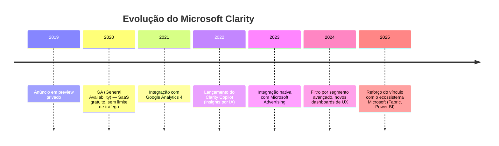

# Microsoft Clarity

> **Ficha técnica de plataforma** · Pontuação na matriz: **355/600 (59,2 %)** — 10º lugar (empate) · 🔴 Uso restrito
> **Situação:** ⚠️ **Complemento condicionado** (recomendação RC-2 do ADR-001) — uso temporário e circunscrito, sem dado pessoal sensível, com preferência pela substituição pelo plugin *Heatmaps & Session Recording* do Matomo
> [← Voltar ao índice](../README.md) · [Matriz de decisão](../docs/07-matriz-decisao.md)

---

## Sumário

- [1. Visão geral](#1-visão-geral)
- [2. Licenciamento](#2-licenciamento)
- [3. Hospedagem](#3-hospedagem)
- [4. Funcionalidades](#4-funcionalidades)
- [5. APIs](#5-apis)
- [6. Exemplos de integração](#6-exemplos-de-integração)
- [7. Integrações](#7-integrações)
- [8. Infraestrutura](#8-infraestrutura)
- [9. Segurança](#9-segurança)
- [10. Governança](#10-governança)
- [11. Performance](#11-performance)
- [12. Custos](#12-custos)
- [13. Pontos fortes](#13-pontos-fortes)
- [14. Pontos fracos](#14-pontos-fracos)
- [15. Quando utilizar](#15-quando-utilizar)
- [16. Quando evitar](#16-quando-evitar)
- [17. Notas do avaliador](#17-notas-do-avaliador)

---

## 1. Visão geral

### 1.1 Identificação

| Campo | Valor |
|-------|-------|
| **Nome** | Microsoft Clarity |
| **Mantenedor** | Microsoft Corporation |
| **Ano de lançamento (GA)** | 2020 |
| **Sede** | Redmond, Washington — Estados Unidos |
| **Segmento** | *Behavioral analytics* — heatmaps e session recording |
| **Site oficial** | `https://clarity.microsoft.com/` |
| **Documentação** | `https://learn.microsoft.com/clarity/` |
| **Componente open-source** | `clarity-js` — biblioteca de captura, licença MIT (`https://github.com/microsoft/clarity`) |

### 1.2 História



### 1.3 Comunidade

| Indicador | Situação |
|-----------|----------|
| Idade do produto | 5+ anos (GA em 2020) |
| Governança | Produto proprietário, gerido pela Microsoft |
| Cadência de releases | Regular (SaaS — atualizações contínuas do fornecedor) |
| Base instalada declarada | > 3,3 milhões de sites (dado do fornecedor, 2024) |
| Adoção institucional pública | ⚠️ Presente em governos que já operam ecossistema Microsoft; sem endosso formal como padrão |
| Comunidade externa (biblioteca `clarity-js`) | Restrita — o núcleo do serviço é proprietário |
| **Nota C11 (Comunidade)** | **3/5** |

### 1.4 Modelo de negócio

**Classificação:** SaaS gratuito. Microsoft não cobra pelo uso do serviço. A monetização é indireta — dados agregados alimentam o ecossistema Microsoft Advertising e produtos relacionados de personalização.

> **🚨 Alerta — "gratuito" com contrapartida em dados**
> O modelo comercial do Clarity é assimétrico: o cliente cede telemetria comportamental rica (incluindo reconstrução visual de sessões via *DOM snapshot*) em troca de acesso sem custo. Os termos do serviço autorizam a Microsoft a usar dados agregados e de-identificados para melhoria de produtos, treinamento de modelos e otimização publicitária.
>
> **Implicação para governo:** o "custo zero" é aparente. Sob o prisma da LGPD, existe **tratamento de dado pessoal por terceiro** (operador Microsoft) com finalidade adicional (aprimoramento de produtos do controlador do tratamento), o que exige base legal explícita e provavelmente **consentimento**, não bastando o legítimo interesse.

### 1.5 Casos de uso

| Caso de uso | Aderência |
|-------------|:---------:|
| Diagnóstico rápido de UX em página específica | 🟢 Excelente |
| Investigação de fricção em formulários | 🟢 Excelente |
| Heatmap de scroll e clique em landing page | 🟢 Boa |
| Portal institucional sem dado sensível | 🟠 Condicionada — exige consentimento |
| Serviço digital com dado pessoal sensível (saúde, tributário, judicial) | 🔴 Inadequada — transferência internacional |
| Fonte primária de métricas de audiência | 🔴 Inadequada — não é a proposta do produto |

---

## 2. Licenciamento

| Campo | Valor |
|-------|-------|
| **Serviço** | Proprietário — SaaS |
| **Termos de uso** | `https://clarity.microsoft.com/terms` |
| **Contrato** | Aceite eletrônico (click-through). Não há SLA financeiro no tier gratuito |
| **Biblioteca `clarity-js`** | Open-source, licença MIT |
| **Custo direto** | US$ 0,00 |
| **Restrição de uso** | Proibido rastrear dado sensível (definido pelo próprio Microsoft nos termos) — o compliance recai sobre o cliente |

> **📌 Observação — o que é MIT no Clarity**
> Apenas a **biblioteca de captura no cliente** (`clarity-js`) é MIT. O núcleo do serviço — ingestão, armazenamento, dashboard, IA — é proprietário e não auditável. Não existe modalidade auto-hospedada.

---

## 3. Hospedagem

| Modalidade | Disponibilidade | Observação |
|-----------|:--------------:|-----------|
| SaaS Microsoft (global) | ✅ Única modalidade | Datacenters da Microsoft — sem escolha explícita de região pelo cliente |
| Self-hosted | ❌ Não oferecido | |
| Cloud privada | ❌ Não oferecido | |
| On-Premise | ❌ Não oferecido | |

**Localização declarada dos dados:** múltiplas regiões globais, sem garantia contratual de residência de dados no tier gratuito.

> **🚨 Alerta — soberania de dados**
> O Clarity **não oferece controle sobre a jurisdição** dos dados no plano gratuito. Isso torna a plataforma inadequada como fonte primária de analytics para portais governamentais brasileiros que tratem dado pessoal.

---

## 4. Funcionalidades

### 4.1 Cobertura funcional

| Funcionalidade | Suporte | Observação |
|---------------|:-------:|-----------|
| Dashboards padrão | 🟢 | Interface pronta, sem customização estrutural |
| Eventos customizados | 🟢 | Via `clarity('event', 'nome')` |
| Metas (`goals`) | 🟢 | Chamadas de `clarity('set', ...)` e filtros |
| Funil de conversão | 🟠 | Limitado — sem funil visual pronto; requer combinação com GA4 |
| **Heatmaps** | 🟢 | Recurso central — click, scroll e área |
| **Session recording** | 🟢 | Recurso central — reprodução completa da sessão |
| User journey | 🟠 | Visão parcial via *rage clicks* e *dead clicks* |
| A/B testing | ❌ | Não é a proposta do produto |
| Form analytics | 🟢 | Detecta abandono e fricção em formulários |
| Real time | ❌ | Ingestão é *batch* — dashboards atualizados a cada ~2 h |
| Cohort | ❌ | Não suportado |
| Retenção | ❌ | Não suportado |
| Dimensões customizadas | 🟢 | Até 5 dimensões por site |
| Copilot (insights por IA) | 🟢 | Sumários e diagnósticos automáticos |

### 4.2 O que o produto é — e o que não é

> **📌 Observação**
> O Clarity é um **produto de UX Analytics**, não de Web Analytics tradicional. Ele responde perguntas como "onde o usuário clicou, hesitou, teve fricção" — não "quantos visitantes únicos, quais os canais de aquisição, qual a taxa de conversão do funil". Como fonte primária de audiência, ele **não substitui** Matomo, GA4 ou Plausible.

---

## 5. APIs

### 5.1 Superfície de API

| Recurso | Situação |
|---------|:--------:|
| REST API pública | 🟠 Limitada — *Data Export API* disponível apenas para projetos com > 1.000 sessões/dia |
| GraphQL | ❌ |
| Webhooks | ❌ |
| SDKs oficiais | JavaScript (`clarity-js`) — demais linguagens via `fetch` direto |
| Rate limits declarados | Não publicados |
| Autenticação | *Bearer token* de projeto |
| Versionamento | Não versionada formalmente — publicada em `learn.microsoft.com/clarity/data-export/` |

### 5.2 Data Export API (formato)

```http
GET https://www.clarity.ms/export-data/api/v1-beta/project-live-insights?numOfDays=1&dimension1=Browser
Authorization: Bearer <api-token>
```

Resposta em JSON com métricas agregadas por dimensão. **Não exporta sessões individuais** — apenas agregados. Não permite exportar heatmaps ou gravações.

> **⚠️ Bloco de Risco — API insuficiente para BI institucional**
> A superfície de API do Clarity é **inadequada como fonte de dados para o ecossistema de BI do Estado**. Não há como replicar sessões, heatmaps ou dados brutos para um data warehouse. O uso está restrito a métricas agregadas de alto nível dentro do próprio portal Clarity.

---

## 6. Exemplos de integração

### 6.1 Instalação no site

```html
<script type="text/javascript">
  (function(c,l,a,r,i,t,y){
    c[a]=c[a]||function(){(c[a].q=c[a].q||[]).push(arguments)};
    t=l.createElement(r);t.async=1;t.src="https://www.clarity.ms/tag/"+i;
    y=l.getElementsByTagName(r)[0];y.parentNode.insertBefore(t,y);
  })(window, document, "clarity", "script", "<PROJECT_ID>");
</script>
```

### 6.2 Evento customizado (Python-side — enfileira via GTM server-side)

```python
import requests

def send_gtm_server_event(client_id: str, event_name: str) -> None:
    payload = {
        "client_id": client_id,
        "events": [{"name": event_name}],
    }
    requests.post(
        "https://gtm.exemplo.gov.br/g/collect",
        json=payload,
        timeout=5,
    )
```

### 6.3 Node.js — consulta ao Data Export API

```javascript
async function fetchClarityInsights(token, days = 1) {
  const url = `https://www.clarity.ms/export-data/api/v1-beta/project-live-insights?numOfDays=${days}`;
  const res = await fetch(url, {
    headers: { Authorization: `Bearer ${token}` },
  });
  if (!res.ok) throw new Error(`Clarity API ${res.status}`);
  return res.json();
}
```

### 6.4 Power BI

Conector nativo **não existe**. Integração viável via:

1. Web connector do Power BI apontando para o Data Export API (JSON).
2. Refresh manual limitado a 10 sessões/dia por token.
3. Uso realista: dashboards operacionais internos, não repositório canônico.

### 6.5 Google Looker Studio

Não há conector oficial. Integração via Community Connector customizado (JavaScript no Apps Script).

### 6.6 Grafana / Metabase / Superset

Não suportado nativamente. Requer *pipeline* de ETL customizado consumindo o Data Export API e persistindo em banco intermediário.

---

## 7. Integrações

| Integração | Status |
|-----------|:------:|
| Google Tag Manager | 🟢 Template oficial disponível na galeria do GTM |
| Matomo Tag Manager | 🟠 Via tag HTML customizada |
| Google Analytics 4 | 🟢 Integração nativa — vincula sessões do Clarity a eventos do GA4 |
| Microsoft Advertising | 🟢 Integração nativa |
| Consent Manager (OneTrust, Cookiebot, Osano) | 🟠 Requer configuração manual — carregar `clarity-js` apenas após consentimento |
| IdP corporativo (Azure AD / Microsoft Entra ID) | 🟢 SSO nativo |
| OAuth 2.0 / OIDC (fora do Azure AD) | ❌ Não suportado |

---

## 8. Infraestrutura

Não aplicável — SaaS totalmente gerido pela Microsoft.

Componentes internos declarados:

- Ingestão sobre Azure (região não revelada por projeto).
- Armazenamento em Azure Blob e serviços de análise proprietários.
- Processamento de IA para insights em Azure OpenAI.

**Backup, DR, HA:** responsabilidade integral da Microsoft; sem SLA financeiro no tier gratuito.

---

## 9. Segurança

| Item | Situação |
|------|----------|
| Criptografia em trânsito | 🟢 TLS 1.2+ obrigatório |
| Criptografia em repouso | 🟢 Padrão Azure |
| **Conformidade LGPD** | 🟠 Cliente é controlador; Microsoft é operador. DPA disponível mediante contrato corporativo — no tier gratuito, aplicam-se termos padrão |
| GDPR | 🟢 DPA disponível para clientes corporativos |
| ISO 27001 / SOC 2 | 🟢 Herdadas do Azure |
| Controle de acesso | 🟠 Baseado em conta Microsoft; RBAC limitado |
| Auditoria (logs de acesso ao dashboard) | 🟠 Limitada — sem *audit trail* exportável para SIEM |
| Retenção de dados | ⚠️ **30 dias fixos** — sessões antigas são descartadas automaticamente |
| Mascaramento de conteúdo sensível | 🟢 Suporta atributos `data-clarity-mask="True"` para censurar campos |

> **🚨 Alerta — retenção fixa de 30 dias**
> A retenção de 30 dias é **imposta pelo fornecedor**, sem opção de extensão. Para uso governamental, isso significa que o Clarity **não pode ser fonte de trilha de auditoria de longo prazo** — apenas ferramenta de diagnóstico pontual.

---

## 10. Governança

| Dimensão | Avaliação |
|----------|-----------|
| Vendor lock-in | 🔴 Alto — dado bruto não é exportável; nenhuma alternativa binário-compatível |
| Controle dos dados | 🔴 Baixo — dados residem em infraestrutura Microsoft, sob termos padrão |
| Portabilidade | 🔴 Muito baixa — não há migração de sessões/heatmaps para outra plataforma |
| Transparência | 🟠 Média — biblioteca de captura é MIT (auditável); *backend* é opaco |
| Auditoria | 🔴 Baixa — sem *audit trail* de acesso ao dashboard exportável |
| Soberania dos dados | 🔴 Baixa — sem residência garantida no Brasil ou UE no tier gratuito |

**Nota C02 (Controle dos dados):** 1/5.
**Nota C04 (Independência tecnológica):** 1/5.

---

## 11. Performance

### 11.1 Impacto no site

| Métrica | Valor típico |
|---------|:-----------:|
| Tamanho do script (`clarity.js`) | ~35 KB (gzip) |
| Carregamento | Assíncrono |
| Impacto médio em LCP | +40 ms a +120 ms (dependente do volume de eventos DOM capturados) |
| Impacto médio em CLS | Nulo |

### 11.2 Escala do serviço

Sem limite declarado de tráfego. Microsoft assume a escala. Ausência de SLA torna a **previsibilidade** o problema, não a **capacidade**.

---

## 12. Custos

### 12.1 Modelo tarifário

| Item | Valor |
|------|-------|
| Licenciamento | US$ 0,00 |
| Ingestão | US$ 0,00 |
| Armazenamento | US$ 0,00 |
| Sessões | Ilimitadas |
| Suporte | Comunidade / documentação — sem SLA |

### 12.2 TCO em 5 anos (para um portal médio)

| Rubrica | Ano 1 | Ano 2 | Ano 3 | Ano 4 | Ano 5 | Total |
|---------|:-----:|:-----:|:-----:|:-----:|:-----:|:-----:|
| Licenciamento | R$ 0 | R$ 0 | R$ 0 | R$ 0 | R$ 0 | **R$ 0** |
| Infraestrutura | R$ 0 | R$ 0 | R$ 0 | R$ 0 | R$ 0 | **R$ 0** |
| Equipe (implantação + operação) | R$ 8.000 | R$ 4.000 | R$ 4.000 | R$ 4.000 | R$ 4.000 | **R$ 24.000** |
| Adequação LGPD (consentimento, banner, DPIA) | R$ 15.000 | R$ 3.000 | R$ 3.000 | R$ 3.000 | R$ 3.000 | **R$ 27.000** |
| **Total** | **R$ 23.000** | **R$ 7.000** | **R$ 7.000** | **R$ 7.000** | **R$ 7.000** | **R$ 51.000** |

> **📌 Observação — o custo real do "gratuito"**
> O TCO acima **desconta o custo aparente** e mostra o real: mesmo sem licenciamento, o cumprimento LGPD (DPIA, gestão de consentimento, revisão jurídica) transforma o "gratuito" em algo que **não é zero**. Comparação completa em [`comparativos/custo.md`](../comparativos/custo.md).

> **📌 Observação metodológica — sem rubrica absorvível**
> O Clarity é SaaS puro. Diferentemente das plataformas auto-hospedadas (Matomo/Plausible/Umami), **não há infraestrutura estatal a rateiar** — o custo é integralmente incremental. O TCO reportado já é o marginal para o Estado. Fundamento em [`../docs/03-criterios-de-avaliacao.md §5.C03`](../docs/03-criterios-de-avaliacao.md#c03--tco-peso-15).

---

## 13. Pontos fortes

- **Heatmaps e session recording de qualidade profissional**, sem custo direto.
- **Copilot de UX** — sumarização automática de sessões e detecção de fricção.
- **Integração nativa com GA4 e Microsoft Advertising**.
- **Adoção larga na indústria** — profissionais brasileiros de UX conhecem a ferramenta.
- **Biblioteca de captura open-source** (MIT), passível de auditoria isolada.

## 14. Pontos fracos

- Sem controle sobre residência de dados; sem SLA no tier gratuito.
- Retenção fixa de 30 dias — inadequado para trilha de auditoria de longo prazo.
- API limitada; sem exportação de sessões brutas; sem integração real com BI corporativo.
- Sessões e heatmaps não migráveis — lock-in de dado histórico.
- Modelo comercial gratuito com contrapartida em dado — exige base legal LGPD explícita.
- Sem funil de conversão nativo; sem cohort; sem retention.

## 15. Quando utilizar

- **Diagnóstico pontual de UX** em página específica ou fluxo específico.
- **Complemento temporário** à plataforma primária durante redesign de portal.
- Sites institucionais **sem tratamento de dado sensível** e com banner de consentimento em conformidade.
- Investigação de fricção em formulários públicos não-sensíveis.

## 16. Quando evitar

- **Sempre** que o portal trate dado sensível (saúde, tributário, judicial, benefícios sociais).
- **Sempre** que o requisito for repositório canônico de métricas de audiência.
- **Sempre** que se exija residência de dados no Brasil ou UE por norma interna.
- **Sempre** que a integração com BI corporativo (Power BI, Superset) seja requisito não-negociável.
- **Sempre** que a retenção histórica de dados de comportamento for necessária para auditoria (> 30 dias).

---

## 17. Notas do avaliador

O Microsoft Clarity ocupa um nicho legítimo — heatmaps e session recording gratuitos — mas seu enquadramento neste estudo é **complemento condicionado**, não fonte primária. A recomendação do ADR-001 é preferir o plugin *Heatmaps & Session Recording* do próprio Matomo (mesmo pago) para eliminar transferência internacional e manter os dados na custódia do Estado.

O uso do Clarity só se justifica quando:

1. O portal alvo **não trata dado pessoal sensível**;
2. Há banner de consentimento funcional em conformidade LGPD;
3. O uso é **temporário e circunscrito** (diagnóstico específico, não monitoramento permanente);
4. A retenção de 30 dias é aceitável para o caso de uso.

Análise cruzada de LGPD: [`comparativos/lgpd.md`](../comparativos/lgpd.md). Governança e lock-in: [`comparativos/governanca.md`](../comparativos/governanca.md).
