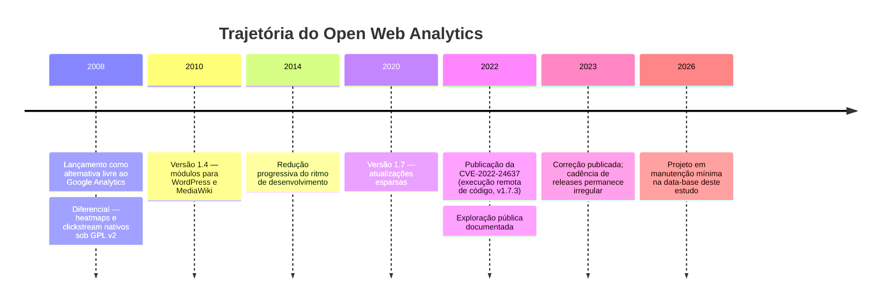

# Open Web Analytics (OWA)

> **Ficha técnica de plataforma** · Pontuação na matriz: **330/600 (55,0 %)** — 13º lugar · 🔴 Não recomendada
> **Situação:** ⛔ **ELIMINADA na triagem** — critério **E6** (gestão de vulnerabilidades) · Vedada integralmente pelo ADR-001
> [← Voltar ao índice](../README.md) · [Critérios de eliminação](../docs/03-criterios-de-avaliacao.md#23-justificativa-das-eliminações)

---

## Sumário

- [1. Aviso preliminar](#1-aviso-preliminar)
- [2. Visão geral](#2-visão-geral)
- [3. Licenciamento](#3-licenciamento)
- [4. Hospedagem](#4-hospedagem)
- [5. Funcionalidades](#5-funcionalidades)
- [6. APIs](#6-apis)
- [7. Exemplos de integração](#7-exemplos-de-integração)
- [8. Integrações](#8-integrações)
- [9. Infraestrutura](#9-infraestrutura)
- [10. Segurança](#10-segurança)
- [11. Governança](#11-governança)
- [12. Performance](#12-performance)
- [13. Custos](#13-custos)
- [14. Pontos fortes](#14-pontos-fortes)
- [15. Pontos fracos](#15-pontos-fracos)
- [16. Quando utilizar](#16-quando-utilizar)
- [17. Quando evitar](#17-quando-evitar)
- [18. Notas do avaliador](#18-notas-do-avaliador)

---

## 1. Aviso preliminar

> **🚨 ALERTA — Plataforma eliminada por critério de segurança**
>
> O Open Web Analytics foi **eliminado na triagem eliminatória** deste estudo, por falha no critério **E6** (vulnerabilidade crítica conhecida / projeto sem manutenção ativa).
>
> **Fundamento objetivo:**
> 1. Registra **CVE-2022-24637** — vulnerabilidade de **execução remota de código** na versão 1.7.3, com exploração pública documentada;
> 2. A cadência de correções do projeto é **esparsa e irregular**;
> 3. A base de mantenedores é reduzida;
> 4. O cenário de qualidade **QA-05** exige correção de vulnerabilidade crítica em ≤ 15 dias — capacidade que o projeto **não demonstra estruturalmente**.
>
> Adotar uma aplicação web com esse perfil para expor endpoint público na infraestrutura do Estado é incompatível com o dever de segurança do **art. 46 da LGPD**.
>
> **Esta ficha é mantida integralmente por transparência do processo decisório**, conforme exigência de auditabilidade perante órgão de controle. Não constitui recomendação de uso sob nenhuma hipótese.

---

## 2. Visão geral

### 2.1 Identificação

| Campo | Valor |
|-------|-------|
| **Nome** | Open Web Analytics (OWA) |
| **Criador** | Peter Adams |
| **Ano de lançamento** | ~2008 |
| **Mantenedor** | Mantenedor individual + poucos contribuidores |
| **Sede** | Estados Unidos |
| **Segmento** | Web Analytics tradicional |
| **Repositório** | `https://github.com/Open-Web-Analytics/Open-Web-Analytics` |
| **Site oficial** | `http://www.openwebanalytics.com/` |

### 2.2 História



### 2.3 Comunidade

| Indicador | Situação |
|-----------|----------|
| Idade do projeto | 17+ anos |
| Governança | Mantenedor individual |
| Cadência de releases | 🔴 **Esparsa e irregular** |
| Contribuidores ativos | 🔴 Muito poucos |
| Fórum / suporte | 🔴 Praticamente inativo |
| Adoção institucional | ❌ Nenhuma documentada |
| Documentação | 🔴 Wiki desatualizada |
| **Nota C11 (Comunidade)** | **1/5** |

### 2.4 Modelo de negócio

**Nenhum.** Projeto sem entidade comercial mantenedora, sem edição paga e sem serviços associados.

> **⚠️ Bloco de Risco — Ausência de modelo de sustentação**
> A inexistência de modelo de receita não é, por si só, um defeito — muitos projetos livres bem-sucedidos são mantidos por comunidade ampla ou por fundação. O problema no OWA é a **combinação** de ausência de receita **com** base de contribuidores muito reduzida: não há nem incentivo econômico nem massa crítica comunitária para sustentar a gestão de vulnerabilidades.
>
> É essa combinação que caracteriza o risco estrutural, e não a gratuidade em si.

### 2.5 Casos de uso

| Caso de uso | Aderência |
|-------------|:---------:|
| Qualquer uso em produção com exposição pública | 🔴 **Inadequada** |
| Ambiente isolado de laboratório / estudo | 🟡 Aceitável |
| Referência histórica de arquitetura de analytics livre | 🟡 Aceitável |

---

## 3. Licenciamento

| Campo | Valor |
|-------|-------|
| **Tipo** | 🟢 Open Source |
| **Licença** | **GNU GPL v2** |
| **Texto** | `https://www.gnu.org/licenses/old-licenses/gpl-2.0.html` |
| **Copyleft** | Forte |
| **Uso comercial / modificação / fork** | ✅ Permitidos |
| **Direito perpétuo** | ✅ Sim |
| **Custo de licença** | **R$ 0** |

> **📌 Observação**
> O licenciamento é o aspecto mais favorável do OWA — GPL v2 com heatmaps nativos é uma combinação rara. Isso é o que sustenta sua nota **5 em C02** (Controle dos dados) e **3 em C04** (Independência).
>
> A nota C04 não é 5 porque a independência prática é ilusória: manter o projeto exigiria que o Estado **assumisse o desenvolvimento**, transformando "economia de licença" em custo permanente de engenharia PHP.

---

## 4. Hospedagem

| Modalidade | Suporte |
|-----------|:-------:|
| Auto-hospedado | ✅ Única modalidade |
| Docker | ⚠️ Apenas imagens da comunidade, não oficiais |
| Kubernetes | ❌ |
| SaaS | ❌ Não existe |
| On-premises com suporte | ❌ |

### 4.1 Requisitos

| Componente | Requisito |
|-----------|-----------|
| PHP | 7.x (compatibilidade com PHP 8.x limitada) |
| Banco de dados | MySQL 5.x+ |
| Servidor web | Apache ou Nginx |
| Cron | Recomendado |

> **⚠️ Bloco de Risco — Dependência de PHP antigo**
> A compatibilidade limitada com PHP 8.x cria um dilema sem saída favorável:
>
> - **Fixar PHP 7.x:** a versão está fora do ciclo de suporte de segurança, ampliando a superfície de vulnerabilidade do runtime;
> - **Forçar PHP 8.x:** risco de comportamento incorreto ou falha da aplicação.
>
> Ambas as opções degradam a postura de segurança. Não há mitigação satisfatória.

---

## 5. Funcionalidades

| Funcionalidade | Suporte | Detalhe |
|---------------|:-------:|---------|
| **Dashboards** | ⚠️ Básico | Interface datada |
| **Eventos customizados** | ⚠️ | Suporte limitado |
| **Goals (metas)** | ✅ | Metas por URL |
| **Conversion Funnel** | ❌ | Não disponível |
| **Heatmaps** | ✅ **Nativo** | Diferencial histórico do projeto |
| **Session Recording** | ❌ | |
| **User Journey** | ⚠️ | Clickstream por visita, sem agregação de fluxo |
| **A/B Testing** | ❌ | |
| **Form Analytics** | ❌ | |
| **Real Time** | ⚠️ | Limitado |
| **Cohort** | ❌ | |
| **Retention** | ❌ | |
| **Custom Dimensions** | ❌ | |
| **Segmentação** | ⚠️ | Muito limitada |
| **Campanhas / UTM** | ✅ | |
| **Geolocalização** | ✅ | |
| **Tecnologia** | ✅ | |
| **Multi-site** | ✅ | |
| **DOM clickstream** | ✅ **Nativo** | Rastreamento de cliques por elemento |
| **Amostragem** | ❌ | Dado completo |

### 5.1 Cobertura dos requisitos funcionais

| Prioridade | Atendidos | Cobertura |
|-----------|:---------:|----------:|
| *Must have* | 10 / 17 | 59 % |
| *Should have* | 6 / 18 | 33 % |
| *Could have* | 4 / 12 | 33 % |
| **Ponderada** | **46 / 99** | **46 %** |

**Nota C05 (Recursos analíticos): 2/5**

---

## 6. APIs

| API | Situação |
|-----|----------|
| **REST API** | ⚠️ Existe, mas restrita e mal documentada |
| **GraphQL** | ❌ |
| **API de ingestão** | ⚠️ Endpoint de tracking; sem documentação formal |
| **API de administração** | ❌ |
| **Webhooks** | ❌ |
| **SDKs oficiais** | ❌ Nenhum |
| **Versionamento** | ❌ Inexistente |
| **Rate limits** | ❌ Não documentados |
| **Formatos** | JSON, XML |
| **Autenticação** | Chave de API simples |
| **Acesso SQL** | ✅ Direto no MySQL — na prática, o único caminho viável |

**Nota C06 (APIs): 2/5** — API restrita, sem versionamento, sem SDK, com documentação insuficiente para uso confiável em pipeline de produção.

---

## 7. Exemplos de integração

> **📌 Observação**
> Os exemplos abaixo são fornecidos por completude metodológica. Dado que a plataforma está eliminada, **não devem ser usados como orientação de implementação**.

### 7.1 Python — acesso via SQL (único caminho confiável)

```python
"""
Extração de métricas do OWA diretamente do MySQL.
A API do OWA é insuficientemente documentada para uso em produção.
"""
import os
import pandas as pd
from sqlalchemy import create_engine, text

engine = create_engine(
    f"mysql+pymysql://{os.environ['OWA_DB_USER']}:{os.environ['OWA_DB_PASS']}"
    f"@{os.environ['OWA_DB_HOST']}/{os.environ['OWA_DB_NAME']}"
)

QUERY = text("""
    SELECT
        DATE(FROM_UNIXTIME(s.timestamp))    AS data,
        st.name                             AS site,
        COUNT(DISTINCT s.session_id)        AS sessoes,
        COUNT(DISTINCT s.user_id)           AS visitantes,
        COUNT(*)                            AS pageviews
    FROM owa_session s
    JOIN owa_site st ON st.site_id = s.site_id
    WHERE s.timestamp >= UNIX_TIMESTAMP(:desde)
    GROUP BY 1, 2
    ORDER BY 1 DESC
""")

df = pd.read_sql(QUERY, engine, params={"desde": "2026-01-01"})
print(df.head(20))
```

### 7.2 Node.js — chamada à API

```javascript
/** Chamada à API do OWA — documentação limitada, formato instável. */
async function owaApi(metric, params = {}) {
  const url = new URL(`${process.env.OWA_URL}/index.php`);
  url.searchParams.set('owa_do', 'base.reportApi');
  url.searchParams.set('owa_metrics', metric);
  url.searchParams.set('owa_format', 'json');
  url.searchParams.set('owa_apiKey', process.env.OWA_API_KEY);
  Object.entries(params).forEach(([k, v]) => url.searchParams.set(`owa_${k}`, v));

  const res = await fetch(url);
  if (!res.ok) throw new Error(`OWA ${res.status}`);
  return res.json();
}
```

### 7.3 Power BI, Grafana, Metabase, Superset, Qlik Sense

Todos seguem o mesmo padrão: **conexão direta ao MySQL**, pois não há conector nativo, API confiável nem documentação de schema oficial.

```sql
-- View de referência para BI (o schema precisa ser inferido do código-fonte)
CREATE OR REPLACE VIEW vw_owa_diario AS
SELECT
    DATE(FROM_UNIXTIME(s.timestamp))  AS data,
    st.name                           AS site,
    COUNT(DISTINCT s.session_id)      AS sessoes,
    COUNT(DISTINCT s.user_id)         AS visitantes,
    COUNT(*)                          AS pageviews
FROM owa_session s
JOIN owa_site st ON st.site_id = s.site_id
GROUP BY 1, 2;
```

> **⚠️ Bloco de Risco — Schema não documentado**
> O schema do OWA **não possui documentação oficial**. Qualquer ETL construído sobre ele depende de engenharia reversa do código-fonte, e quebra silenciosamente a cada atualização. É o pior cenário de integração entre todas as plataformas do estudo.

### 7.4 Google Looker Studio

Sem conector. Exigiria expor o MySQL à internet — inaceitável.

**Nota C07 (Integrações): 1/5**

---

## 8. Integrações

| Integração | Suporte |
|-----------|:-------:|
| Google Tag Manager | 🔧 Tag customizada |
| Matomo Tag Manager | 🔧 Tag customizada |
| Consent Manager | ⚠️ Sem integração nativa |
| Identity Provider / SSO | ❌ |
| OAuth 2.0 / OIDC / SAML | ❌ |
| MFA | ❌ |
| LDAP | ❌ |
| WordPress | ✅ Plugin (desatualizado) |
| MediaWiki | ✅ Extensão (desatualizada) |
| Webhooks | ❌ |

---

## 9. Infraestrutura

| Aspecto | Detalhe |
|---------|---------|
| **Banco utilizado** | MySQL (relacional, orientado a linha) |
| **Componentes mínimos** | 2 (PHP + MySQL) |
| **Fila / streaming** | ❌ |
| **Cache** | ⚠️ Básico |
| **Escalabilidade horizontal** | ⚠️ Limitada |
| **Alta disponibilidade** | ❌ Não documentada |
| **Cluster** | ❌ |
| **Backup** | ✅ Padrão MySQL |
| **Disaster Recovery** | 🔧 Construir integralmente |
| **Documentação de operação em escala** | ❌ Inexistente |

---

## 10. Segurança

> **🚨 ALERTA — Esta é a seção determinante da eliminação**

| Aspecto | Situação |
|---------|----------|
| **LGPD** | ⚠️ Auto-hospedado elimina transferência internacional; porém rastreia por cookie por padrão e a anonimização não é padrão |
| **GDPR** | ⚠️ Configurável, com esforço |
| **ISO 27001 / SOC 2** | ➖ Não aplicável |
| **Controle de acesso** | ⚠️ Básico |
| **MFA** | ❌ **Não disponível** |
| **Auditoria** | ❌ **Sem log de auditoria** |
| **Logs** | ⚠️ Apenas log de aplicação |
| **Criptografia em trânsito** | ✅ TLS no servidor web |
| **Criptografia em repouso** | 🔧 Nível de infraestrutura |
| **Retenção de dados** | ✅ Controle total (via SQL) |
| **Programa de divulgação de vulnerabilidades** | ❌ **Inexistente** |
| **Cadência de patches** | 🔴 **Irregular** |
| **CVE relevante** | 🚨 **CVE-2022-24637 — execução remota de código** |
| **Superfície de ataque** | 🔴 **Alta** |
| **Nota C09 (Segurança)** | **1/5** — nota mínima |

### 10.1 CVE-2022-24637

| Campo | Valor |
|-------|-------|
| **Identificador** | CVE-2022-24637 |
| **Versão afetada** | Open Web Analytics 1.7.3 |
| **Classe** | Execução remota de código (RCE) |
| **Vetor** | Exposição de informação sensível que permite escrita e execução de código PHP |
| **Exploração pública** | ✅ Documentada |
| **Referência** | `https://nvd.nist.gov/vuln/detail/CVE-2022-24637` |
| **Correção** | Disponível em versão posterior |

> **🚨 Alerta — Por que uma CVE corrigida ainda elimina a plataforma**
>
> A CVE-2022-24637 **foi corrigida**. A eliminação não decorre da existência da vulnerabilidade — vulnerabilidades ocorrem em todo software, inclusive no Matomo.
>
> A eliminação decorre da **capacidade demonstrada do projeto de responder a vulnerabilidades futuras**. O cenário de qualidade QA-05 exige correção de vulnerabilidade crítica em ≤ 15 dias. Avaliação dessa capacidade:
>
> | Fator | Matomo | OWA |
> |-------|:------:|:---:|
> | Programa formal de divulgação de vulnerabilidades | ✅ | ❌ |
> | Mantenedor comercial com equipe dedicada | ✅ | ❌ |
> | Cadência de releases previsível | ✅ | ❌ |
> | Base ampla de contribuidores | ✅ | ❌ |
> | Histórico de resposta tempestiva | ✅ | ⚠️ |
>
> **Conclusão:** o OWA não demonstra capacidade estrutural de atender ao QA-05. Adotar a plataforma significaria que o Estado assumiria o papel de mantenedor de segurança de uma aplicação PHP exposta publicamente — o que inverteria completamente a análise de TCO.

---

## 11. Governança

| Aspecto | Avaliação |
|---------|:---------:|
| **Vendor lock-in** | 🟢 Muito baixo (GPL v2) |
| **Controle dos dados** | 🟢 Total |
| **Portabilidade** | 🟢 SQL direto |
| **Transparência** | 🟢 Código aberto |
| **Auditoria** | 🟡 Código auditável, porém extenso e sem documentação |
| **Soberania** | 🟢 Total |
| **Continuidade sem o fornecedor** | 🟡 Formalmente indefinida; **na prática, exige assumir o desenvolvimento** |
| **Custo de saída** | 🟢 ~R$ 20 k |
| **Nota C02 (Controle)** | **5/5** |
| **Nota C04 (Independência)** | **3/5** |

---

## 12. Performance

| Métrica | Valor |
|---------|-------|
| **Volume suportado** | ~10 M eventos/mês — o menor do estudo |
| **Escalabilidade horizontal** | ⚠️ Muito limitada |
| **Escalabilidade vertical** | ✅ Limitada |
| **Ingestão com fila** | ❌ |
| **Latência do endpoint** | 🟡 Moderada |
| **Latência de relatório** | 🔴 Degrada rapidamente |
| **Estratégia de escala documentada** | ❌ **Inexistente** |
| **Tamanho do script (gzip)** | ~20 KB |
| **Nota C08 (Escalabilidade)** | **1/5** — nota mínima |

---

## 13. Custos

Regime de custo marginal SETDIG. Detalhamento em [`../comparativos/custo.md §1.4`](../comparativos/custo.md#14-regime-de-custo--marginal-para-o-estado).

| Rubrica | Custo marginal SETDIG (5 anos) | Custo pleno de referência (greenfield, 5 anos) |
|---------|-------------------------------:|----------------------------------------------:|
| **Licenciamento** | R$ 0 | R$ 0 |
| **Infra marginal** — 1 VM PHP + MySQL compartilhado | R$ 20.000 | R$ 180.000 |
| **Equipe marginal** — ~0,15 FTE incremental por vigilância de segurança contínua | R$ 90.000 | R$ 400.000 |
| **Implantação (snippet ~200 portais)** | R$ 10.000 | R$ 50.000 |
| **Adequação LGPD** | R$ 15.000 | R$ 15.000 |
| **Riscos operacionais** — CVEs, correções próprias, ausência de mantenedor | R$ 30.000 | R$ 30.000 |
| **TCO 5 anos** | **≈ R$ 165.000** | **≈ R$ 675.000** |
| **Faixa de nota C03** | ≤ 250k = **5** | 600k–1,2M = 3 |

> **🚨 Alerta — TCO baixo não redime a plataforma**
> Mesmo em regime marginal, o OWA continua **reprovado** pela triagem eliminatória (falha em C09 Segurança — nota 1) e por Escalabilidade (C08 = 1). O TCO baixo é irrelevante quando a plataforma não atende requisitos *Must have*.
>
> Adotar o OWA transformaria o Estado em **mantenedor de segurança** de aplicação PHP sem projeto ativo. Isso inverteria o cálculo: a "economia" viraria custo de desenvolvimento permanente. A nota C03 sobe pelo regime marginal, mas a decisão final permanece: **não recomendada**.

---

## 14. Pontos fortes

| # | Ponto forte |
|---|------------|
| 1 | **Heatmaps e DOM clickstream nativos sob GPL v2** — combinação rara |
| 2 | Licença GPL v2 — copyleft forte |
| 3 | Soberania total (auto-hospedado) |
| 4 | Stack familiar (PHP + MySQL) |
| 5 | Sem custo de licença |
| 6 | Sem amostragem |

---

## 15. Pontos fracos

| # | Ponto fraco | Mitigável? |
|---|------------|:----------:|
| 1 | **Histórico de vulnerabilidade de execução remota de código** | ⚠️ Corrigida; o problema é a capacidade futura |
| 2 | **Sem programa de divulgação de vulnerabilidades** | ❌ **Não** |
| 3 | **Cadência de correções irregular** | ❌ **Não** |
| 4 | **Comunidade praticamente inativa** | ❌ Não |
| 5 | **Compatibilidade limitada com PHP 8.x** | ❌ Não |
| 6 | **Sem funil de conversão** | ❌ Não |
| 7 | **Sem MFA nem log de auditoria** | ⚠️ Compensação por infraestrutura |
| 8 | **API restrita e mal documentada** | ❌ Não |
| 9 | **Schema não documentado** | ⚠️ Engenharia reversa |
| 10 | **Sem estratégia de escala** | ❌ Não |
| 11 | **Documentação esparsa e desatualizada** | ❌ Não |
| 12 | **Sem integrações de BI** | ⚠️ SQL direto |
| 13 | **Interface datada** | ❌ Não |

---

## 16. Quando utilizar

> **🚨 Não há cenário recomendado de uso em produção.**
>
> Contextos residuais em que o OWA pode ser considerado:
> - **Ambiente isolado de laboratório**, sem exposição pública e sem dado real;
> - **Estudo histórico** de arquitetura de analytics livre;
> - **Fork como base de desenvolvimento** por organização com equipe PHP dedicada disposta a assumir a manutenção — cenário fora do escopo deste estudo.

---

## 17. Quando evitar

> **🚨 Evite o Open Web Analytics em qualquer cenário de produção com exposição pública.**
>
> Especificamente, **não use**:
> - Em qualquer sistema de órgão público;
> - Em qualquer aplicação que trate dado pessoal;
> - Em qualquer endpoint acessível pela internet;
> - Em qualquer contexto sujeito a auditoria de segurança;
> - Como plataforma de analytics de portais governamentais — **vedado pelo ADR-001**.
>
> **Alternativa direta:** o **Matomo On-Premise** oferece tudo que o OWA oferece — incluindo heatmaps, sob licença livre, com soberania total — e é superior em 9 dos 12 critérios, inferior em nenhum.

---

## 18. Notas do avaliador

### 18.1 Notas atribuídas

| Critério | Peso | Nota | Pontos |
|----------|-----:|:----:|-------:|
| C01 — LGPD | 15 | 4 | 60 |
| C02 — Controle dos dados | 15 | **5** | 75 |
| C03 — TCO | 15 | **5** | 75 |
| C04 — Independência tecnológica | 10 | 3 | 30 |
| C05 — Recursos analíticos | 10 | **2** | 20 |
| C06 — APIs | 10 | **2** | 20 |
| C07 — Integrações | 10 | **1** | 10 |
| C08 — Escalabilidade | 10 | **1** | 10 |
| C09 — Segurança | 10 | **1** | 10 |
| C10 — Operação | 5 | **2** | 10 |
| C11 — Comunidade | 5 | **1** | 5 |
| C12 — Documentação | 5 | **1** | 5 |
| **Total** | **120** | | **330 / 600 (55,0 %)** |

### 18.2 Dominância estrita

> **✅ Bloco de Decisão — Eliminação independente de ponderação**
>
> O **Matomo On-Premise domina estritamente** o Open Web Analytics:
>
> | Critério | Matomo OP | OWA | Resultado |
> |----------|:---------:|:---:|-----------|
> | C01 — LGPD | 5 | 4 | Matomo superior |
> | C02 — Controle | 5 | 5 | Empate |
> | C03 — TCO | 5 | 5 | Empate (regime marginal) |
> | C04 — Independência | 5 | 3 | Matomo superior |
> | C05 — Recursos | 4 | 2 | Matomo superior |
> | C06 — APIs | 4 | 2 | Matomo superior |
> | C07 — Integrações | 4 | 1 | Matomo superior |
> | C08 — Escalabilidade | 3 | 1 | Matomo superior |
> | C09 — Segurança | 4 | 1 | Matomo superior |
> | C10 — Operação | 3 | 2 | Matomo superior |
> | C11 — Comunidade | 4 | 1 | Matomo superior |
> | C12 — Documentação | 4 | 1 | Matomo superior |
>
> **Superior em 11 critérios, empatado em 1, inferior em nenhum.**
>
> **Consequência matemática:** não existe qualquer atribuição de pesos, por mais extrema, sob a qual o OWA supere o Matomo On-Premise. A eliminação é **independente da metodologia de ponderação adotada neste estudo** — é uma conclusão robusta que não depende de nenhuma escolha subjetiva do avaliador.

### 18.3 Observação final

> **📌 Observação**
> O OWA é o exemplo mais claro da distinção entre **licença livre** e **software sustentável**. Ter código aberto sob GPL v2 é condição necessária, mas não suficiente, para adoção institucional.
>
> O que falta ao OWA não é liberdade jurídica — é **capacidade de manutenção**. E capacidade de manutenção de uma aplicação web exposta publicamente é requisito de segurança, não de conveniência.

---

## Referências

- Site oficial: `http://www.openwebanalytics.com/`
- Repositório: `https://github.com/Open-Web-Analytics/Open-Web-Analytics`
- Wiki: `https://github.com/Open-Web-Analytics/Open-Web-Analytics/wiki`
- **CVE-2022-24637**: `https://nvd.nist.gov/vuln/detail/CVE-2022-24637`
- Licença GPL v2: `https://www.gnu.org/licenses/old-licenses/gpl-2.0.html`
- Lista completa: [`../docs/12-referencias.md`, seção 11](../docs/12-referencias.md#11-documentação-oficial--open-web-analytics)

---

| ← Anterior | Índice | Próxima → |
|-----------|--------|-----------|
| [Umami](umami.md) | [Plataformas](../README.md) | [Adobe Analytics](adobe-analytics.md) |
