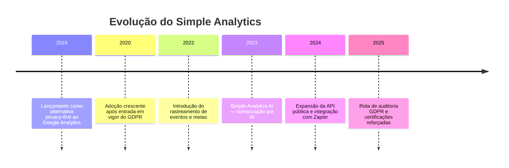

# Simple Analytics

> **Ficha técnica de plataforma** · Pontuação na matriz: **355/600 (59,2 %)** — 10º lugar (empate) · 🔴 Não recomendada
> **Situação:** ❌ **Descartada como plataforma primária** — cobertura funcional insuficiente e ausência de modalidade auto-hospedada
> [← Voltar ao índice](../README.md) · [Matriz de decisão](../docs/07-matriz-decisao.md)

---

## Sumário

- [1. Visão geral](#1-visão-geral)
- [2. Licenciamento](#2-licenciamento)
- [3. Hospedagem](#3-hospedagem)
- [4. Funcionalidades](#4-funcionalidades)
- [5. APIs](#5-apis)
- [6. Exemplos de integração](#6-exemplos-de-integração)
- [7. Integrações](#7-integrações)
- [8. Infraestrutura](#8-infraestrutura)
- [9. Segurança](#9-segurança)
- [10. Governança](#10-governança)
- [11. Performance](#11-performance)
- [12. Custos](#12-custos)
- [13. Pontos fortes](#13-pontos-fortes)
- [14. Pontos fracos](#14-pontos-fracos)
- [15. Quando utilizar](#15-quando-utilizar)
- [16. Quando evitar](#16-quando-evitar)
- [17. Notas do avaliador](#17-notas-do-avaliador)

---

## 1. Visão geral

### 1.1 Identificação

| Campo | Valor |
|-------|-------|
| **Nome** | Simple Analytics |
| **Fundadores** | Adriaan van Rossum e Iron Brands |
| **Ano de lançamento** | 2018 |
| **Mantenedor** | Simple Analytics B.V. |
| **Sede** | Utrecht — Países Baixos (União Europeia) |
| **Segmento** | Privacy-first analytics |
| **Site oficial** | `https://www.simpleanalytics.com/` |
| **Documentação** | `https://docs.simpleanalytics.com/` |
| **Repositório** | Fechado — produto proprietário |

### 1.2 História



### 1.3 Comunidade

| Indicador | Situação |
|-----------|----------|
| Idade do produto | 7+ anos |
| Governança | Empresa privada holandesa |
| Cadência de releases | Regular (SaaS gerido) |
| Base instalada | Concentrada em pequenas empresas, agências e projetos independentes |
| Adoção institucional pública | ⚠️ Escassa e não documentada em governos |
| Profissionais no Brasil | 🔴 Muito escassa |
| **Nota C11 (Comunidade)** | **2/5** |

### 1.4 Modelo de negócio

**Classificação:** SaaS proprietário puro, com preço por volume de *page views* e domínios.

| Plano (referência 2026) | Volume | Preço |
|------------------------|:------:|:-----:|
| Starter | 100 mil pv/mês | US$ 9/mês |
| Business | 1 milhão pv/mês | US$ 49/mês |
| Enterprise | Sob demanda | Sob demanda |

Preços dolarizados, cobrados em cartão. Sem tier gratuito perpétuo (apenas trial).

### 1.5 Casos de uso

| Caso de uso | Aderência |
|-------------|:---------:|
| Site pessoal, blog, documentação | 🟢 Excelente |
| Portal institucional simples (baixa criticidade) | 🟠 Aceitável |
| Portal com análise de conversão | 🔴 Limitada |
| Serviço digital transacional | 🔴 Inadequada |
| Análise comportamental profunda | 🔴 Inadequada |
| Fonte primária de analytics para o Estado | 🔴 Inadequada |

---

## 2. Licenciamento

| Campo | Valor |
|-------|-------|
| **Modelo** | Proprietário — SaaS |
| **Termos** | `https://docs.simpleanalytics.com/terms-and-conditions` |
| **DPA** | Disponível — modelo europeu compatível com GDPR |
| **Modalidade self-hosted** | ❌ Inexistente |
| **Código-fonte** | Fechado |

> **📌 Observação — não confundir com Umami/Plausible**
> Embora se apresente como alternativa "privacy-first", o Simple Analytics **não é open-source**. Não existe modalidade auto-hospedada nem código público. A comparação correta é com Cloudflare Web Analytics, não com Plausible ou Umami.

---

## 3. Hospedagem

| Modalidade | Disponibilidade | Observação |
|-----------|:--------------:|-----------|
| SaaS (União Europeia) | ✅ Única modalidade | Datacenters em Amsterdam (AWS eu-west-1) |
| Self-hosted | ❌ | |
| Cloud privada | ❌ | |
| On-Premise | ❌ | |

Residência de dados: **Países Baixos**, contratualmente garantida.

---

## 4. Funcionalidades

| Funcionalidade | Suporte | Observação |
|---------------|:-------:|-----------|
| Dashboards padrão | 🟢 | Interface enxuta, uma tela por site |
| Eventos customizados | 🟢 | Simples — via API `sa_event()` |
| Metas (`goals`) | 🟢 | Associação de eventos a metas |
| Funil de conversão | ❌ | Não suportado |
| Heatmaps | ❌ | Não suportado |
| Session recording | ❌ | Não suportado (por escolha de privacidade) |
| User journey | 🔴 | Muito limitado — apenas *bounce* e *entrada/saída* |
| A/B testing | ❌ | Não suportado |
| Form analytics | ❌ | Não suportado |
| Real time | 🟢 | Dashboard ao vivo |
| Cohort | ❌ | Não suportado |
| Retenção | ❌ | Não suportado |
| Dimensões customizadas | 🟠 | Limitadas — via *metadata* de eventos |
| Simple Analytics AI | 🟢 | Sumarização automática de tendências |

> **📌 Observação**
> O produto é deliberadamente minimalista. Isso é vantagem para blogs e sites de conteúdo, mas **falha estrutural** para requisitos governamentais (RF-27 funil, RF-33 form analytics).

---

## 5. APIs

### 5.1 Superfície de API

| Recurso | Situação |
|---------|:--------:|
| REST API pública | 🟢 v1 estável — `https://api.simpleanalytics.io/` |
| GraphQL | ❌ |
| Webhooks | 🟠 Limitados (via Zapier) |
| SDKs oficiais | JavaScript |
| Rate limits | 60 requisições/minuto por API key |
| Autenticação | API key (`X-Api-Key` header) |
| Versionamento | v1 |

### 5.2 Exemplo — page views agregados

```http
GET https://api.simpleanalytics.io/v1/statistics?version=5&fields=histogram&info=false&hostname=exemplo.gov.br&start=2026-07-01&end=2026-07-31
X-Api-Key: <api-key>
User-Id: <user-id>
```

### 5.3 Exportação e importação

- **Exportação:** JSON e CSV via API ou botão no dashboard.
- **Importação:** Não suportada — não há migração de histórico de outra plataforma para o Simple Analytics.

---

## 6. Exemplos de integração

### 6.1 Instalação no site

```html
<script async defer src="https://scripts.simpleanalyticscdn.com/latest.js"></script>
<noscript></noscript>
```

### 6.2 Evento customizado

```javascript
sa_event('inscricao_boletim', { origem: 'rodape' });
```

### 6.3 Python — consumo da API

```python
import os
import requests

API_KEY = os.environ["SIMPLE_ANALYTICS_KEY"]
USER_ID = os.environ["SIMPLE_ANALYTICS_USER_ID"]

def daily_pageviews(hostname: str, start: str, end: str) -> dict:
    url = "https://api.simpleanalytics.io/v1/statistics"
    params = {
        "version": 5,
        "hostname": hostname,
        "start": start,
        "end": end,
        "fields": "histogram",
        "info": "false",
    }
    headers = {"X-Api-Key": API_KEY, "User-Id": USER_ID}
    response = requests.get(url, params=params, headers=headers, timeout=10)
    response.raise_for_status()
    return response.json()
```

### 6.4 Node.js — evento customizado no servidor

```javascript
async function trackServerEvent(event, hostname) {
  await fetch("https://queue.simpleanalyticscdn.com/events", {
    method: "POST",
    headers: { "Content-Type": "application/json" },
    body: JSON.stringify({ type: "event", hostname, event }),
  });
}
```

### 6.5 Power BI / Looker Studio / Metabase / Superset / Grafana

Nenhum conector nativo. Integração viável por **Web Data Source** consumindo o JSON da API. Refresh periódico via *dataflow* customizado. Ausência de esquema tabular padronizado dificulta modelagem em BI corporativo.

---

## 7. Integrações

| Integração | Status |
|-----------|:------:|
| Google Tag Manager | 🟢 Via *custom HTML tag* |
| Matomo Tag Manager | 🟠 Via HTML customizado |
| Consent Manager | 🟠 Configurável — recomendação do fornecedor é operar **sem** banner (cookieless) |
| IdP corporativo | ❌ Sem SSO empresarial no plano padrão |
| OAuth 2.0 / OIDC | ❌ Login por e-mail e senha, com 2FA opcional |
| Zapier | 🟢 App oficial |

---

## 8. Infraestrutura

Não aplicável — SaaS gerido. Componentes internos declarados pelo fornecedor:

- Infraestrutura em AWS eu-west-1 (Amsterdam).
- Ingestão via Cloudflare (proxy sem persistência de dado pessoal).
- Persistência em banco relacional (não revelado publicamente).

**Backup, DR, HA:** responsabilidade do fornecedor. SLA de disponibilidade não declarado publicamente (contratual sob NDA).

---

## 9. Segurança

| Item | Situação |
|------|----------|
| Criptografia em trânsito | 🟢 TLS 1.2+ |
| Criptografia em repouso | 🟢 AES-256 (AWS gerenciado) |
| **Conformidade LGPD** | 🟠 Não certifica LGPD; ampara-se em GDPR (base equivalente em muitos pontos) |
| GDPR | 🟢 Compliant — DPA e SCC assinados |
| ISO 27001 | 🟠 Herdada da AWS; a empresa em si não certifica |
| SOC 2 | ❌ Não certifica |
| Controle de acesso | 🟠 Papéis básicos (admin, member); RBAC limitado |
| Auditoria | 🟠 Log básico de acessos administrativos |
| Retenção | 🟢 Configurável (padrão: indefinida enquanto a conta existir) |
| Anonimização | 🟢 IP nunca persistido; sem cookie; sem fingerprint |

---

## 10. Governança

| Dimensão | Avaliação |
|----------|-----------|
| Vendor lock-in | 🟠 Médio — dados agregados exportáveis, mas produto proprietário |
| Controle dos dados | 🟠 Dados em UE, sob GDPR — bom, mas não é custódia estatal |
| Portabilidade | 🟠 Exportação de agregados em JSON/CSV; sem migração fácil para plataforma equivalente |
| Transparência | 🟠 Documentação clara; código-fonte fechado |
| Auditoria | 🔴 Auditoria de código impossível — SaaS proprietário |
| Soberania dos dados | 🟠 Média — jurisdição holandesa (UE), não brasileira |

**Nota C02 (Controle dos dados):** 2/5.
**Nota C04 (Independência tecnológica):** 2/5.

---

## 11. Performance

### 11.1 Impacto no site

| Métrica | Valor típico |
|---------|:-----------:|
| Tamanho do script | ~3 KB (gzip) — um dos menores do mercado |
| Carregamento | Assíncrono |
| Impacto médio em LCP | Desprezível (< 20 ms) |
| Impacto médio em CLS | Nulo |

### 11.2 Escala do serviço

Sem limite técnico declarado além do plano contratado. Plano Business cobre até 1 milhão de *page views*/mês; acima disso, upgrade para Enterprise.

---

## 12. Custos

### 12.1 TCO em 5 anos (portal médio, ~500 mil pv/mês)

| Rubrica | Ano 1 | Ano 2 | Ano 3 | Ano 4 | Ano 5 | Total |
|---------|:-----:|:-----:|:-----:|:-----:|:-----:|:-----:|
| Licenciamento (Business @ US$ 49/mês, ~R$ 265) | R$ 3.180 | R$ 3.180 | R$ 3.180 | R$ 3.180 | R$ 3.180 | **R$ 15.900** |
| Infraestrutura | R$ 0 | R$ 0 | R$ 0 | R$ 0 | R$ 0 | **R$ 0** |
| Equipe | R$ 6.000 | R$ 3.000 | R$ 3.000 | R$ 3.000 | R$ 3.000 | **R$ 18.000** |
| Adequação LGPD (DPIA leve) | R$ 8.000 | R$ 1.000 | R$ 1.000 | R$ 1.000 | R$ 1.000 | **R$ 12.000** |
| Câmbio (risco) | R$ 400 | R$ 400 | R$ 400 | R$ 400 | R$ 400 | **R$ 2.000** |
| **Total** | **R$ 17.580** | **R$ 7.580** | **R$ 7.580** | **R$ 7.580** | **R$ 7.580** | **R$ 47.900** |

> **⚠️ Bloco de Risco — cobrança em dólar por cartão internacional**
> Para o Estado, contratar SaaS estrangeiro em dólar via cartão corporativo é operacionalmente complexo (impostos IOF, câmbio, prestação de contas). Não há representante fiscal brasileiro do Simple Analytics.

> **📌 Observação metodológica — sem rubrica absorvível**
> Simple Analytics é SaaS puro. Não há infraestrutura ou operação estatal a rateiar — o custo é integralmente incremental. O TCO reportado já é o marginal para o Estado. Fundamento em [`../docs/03-criterios-de-avaliacao.md §5.C03`](../docs/03-criterios-de-avaliacao.md#c03--tco-peso-15).

Comparação completa: [`comparativos/custo.md`](../comparativos/custo.md).

---

## 13. Pontos fortes

- Script de rastreamento leve — impacto praticamente nulo em performance de página.
- Design minimalista, curva de aprendizado curta.
- Cookieless por padrão — banner de consentimento tipicamente dispensável.
- Residência de dados na União Europeia (GDPR).
- IA para sumarização de tendências (utilidade real para gestores não-técnicos).

## 14. Pontos fracos

- Sem funil de conversão, heatmaps, session recording, cohort, retenção, A/B ou form analytics.
- Sem modalidade auto-hospedada; código-fonte fechado.
- Sem SSO empresarial nem integração com IdP corporativo padrão.
- Cobrança em dólar por cartão internacional (fricção contratual para órgão público brasileiro).
- Sem conector nativo para BI corporativo.
- Comunidade e adoção institucional muito pequenas — baixo suporte de mercado no Brasil.

## 15. Quando utilizar

- Blog institucional ou hotsite temporário com necessidade **exclusivamente de métrica agregada de audiência**.
- Micro-portal estático com equipe técnica pequena e sem requisito de integração.

## 16. Quando evitar

- Qualquer portal com requisito de funil, form analytics, heatmap ou session recording.
- Órgão público que necessite contratação em moeda nacional, nota fiscal em BRL e residência de dado no Brasil.
- Cenários com requisito de integração nativa com BI (Power BI, Superset, Metabase).
- Serviços digitais transacionais.

---

## 17. Notas do avaliador

O Simple Analytics é um bom produto para o mercado de origem (pequenas empresas, agências, projetos independentes na Europa). Para o Estado, entretanto, três fatores o descartam:

1. **Cobertura funcional** — falha em requisitos *must-have* (funil, form analytics).
2. **Contratação** — não há representação fiscal brasileira; cobrança em dólar via cartão.
3. **Auditabilidade** — sem código público, sem modalidade auto-hospedada, sem certificação ISO/SOC2 própria.

Sua nota (355/600) empatou com Microsoft Clarity, mas por razões distintas: **Clarity perde em soberania**, **Simple Analytics perde em cobertura funcional**. Nenhum dos dois é candidato a plataforma primária.
