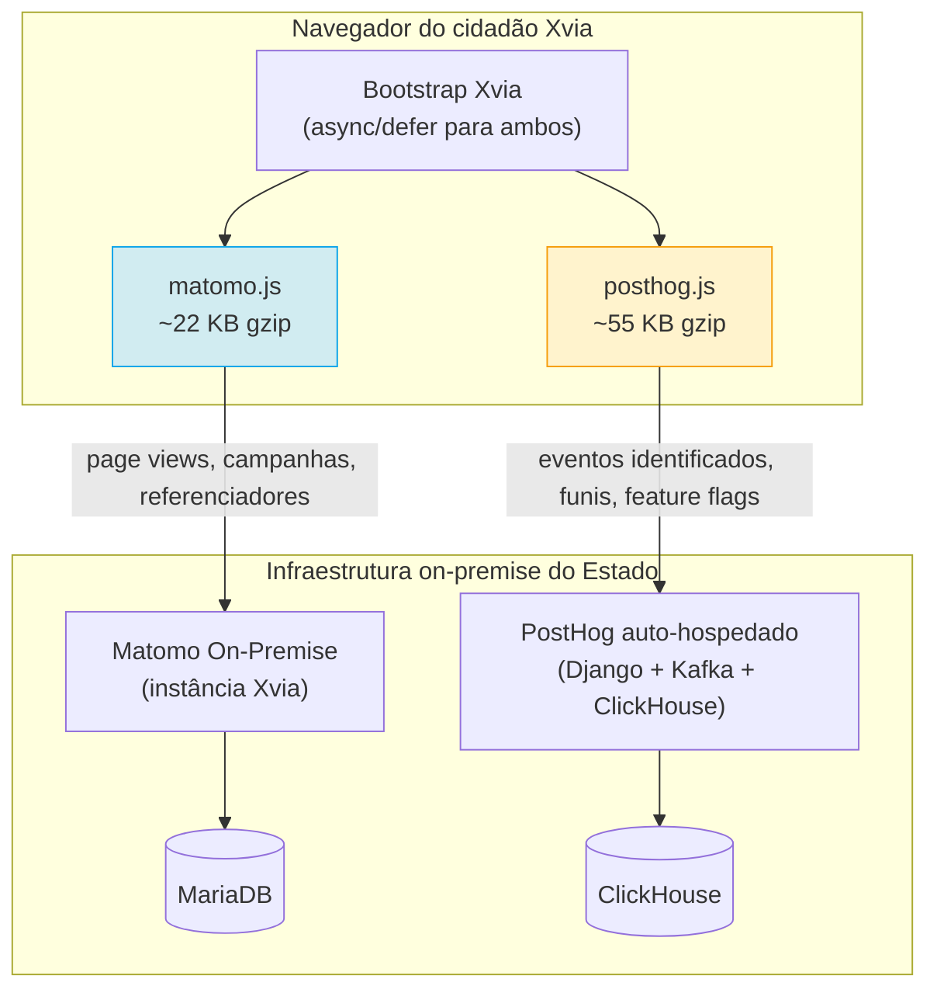

# Comparativo — Coexistência Matomo + PostHog no portal Xvia

> **Corte transversal** · Modelo operacional da coexistência formalizada pelo [ADR-002 §6.2](../docs/06-adr-002.md#6-decisão)
> [← Voltar ao índice](../README.md) · [Complementaridade Matomo × PostHog](matomo-vs-posthog.md) · [ADR-002](../docs/06-adr-002.md)

> **📌 Nota metodológica — Documento renomeado e reescrito na revisão 2026**
> Este arquivo substitui `migracao-matomo-posthog.md`, que analisava o custo hipotético de **substituir** Matomo por PostHog em todo o parque. O [ADR-002](../docs/06-adr-002.md) rejeita substituição e formaliza **coexistência restrita ao portal Xvia**. O escopo do documento muda: de análise de risco de migração para modelo operacional de coexistência.

---

## Sumário

- [1. Escopo](#1-escopo)
- [2. Arquitetura de instrumentação](#2-arquitetura-de-instrumentação)
- [3. Segmentação de eventos por SDK](#3-segmentação-de-eventos-por-sdk)
- [4. Política de retenção coordenada](#4-política-de-retenção-coordenada)
- [5. Consentimento e session replay](#5-consentimento-e-session-replay)
- [6. Reconciliação e governança de divergência](#6-reconciliação-e-governança-de-divergência)
- [7. Impacto de desempenho no navegador](#7-impacto-de-desempenho-no-navegador)
- [8. Plano de deprecação caso o gate falhe](#8-plano-de-deprecação-caso-o-gate-falhe)
- [9. O que este documento NÃO cobre](#9-o-que-este-documento-não-cobre)

---

## 1. Escopo

A coexistência descrita aqui aplica-se **exclusivamente ao portal Xvia** (superapp cidadão do Governo de MS). Portais institucionais, sites gov e serviços digitais de conteúdo do parque existente permanecem em **Matomo puro**, conforme [ADR-002 §6.1](../docs/06-adr-002.md#6-decisão). O uso do PostHog fora do Xvia exige justificativa específica e novo ADR.

**Duração:** coexistência com **gate de reavaliação em 12 meses** — critérios de sucesso definidos em [`../docs/08-roadmap.md §7bis.4`](../docs/08-roadmap.md#8-onda-5--portal-xvia-posthog). Falha no gate aciona G12 do ADR-002 e reavaliação em 60 dias com três cenários possíveis: (a) ajuste de configuração, (b) migração para PostHog Cloud EU, (c) reversão a Matomo puro no Xvia.

---

## 2. Arquitetura de instrumentação

Ambos os SDKs coexistem no bootstrap do portal Xvia, sob custódia integral do Estado (sem transferência internacional).

**Regras técnicas obrigatórias:**

- Ambos os SDKs carregados com `defer` (não bloqueiam parse do HTML).
- `posthog.js` inicializado com `disable_session_recording: true` como padrão; ativado por serviço via config remota do PostHog após consentimento explícito.
- Endpoints de coleta expostos em subdomínios do Estado (ex.: `analytics.xvia.ms.gov.br`, `product.xvia.ms.gov.br`), nunca em domínios de terceiros.
- Autohospedagem sem transferência internacional — validado no DPIA (Onda 5.1).

---

## 3. Segmentação de eventos por SDK

Regra geral: **cada capability é instrumentada em uma única ferramenta**. Duplicação só onde a análise em ambas agrega valor demonstrável.

| Categoria de evento | Matomo | PostHog | Racional |
|---------------------|:------:|:-------:|----------|
| Page view (anônimo) | ✅ | ❌ | Matomo é fonte oficial de audiência |
| Sessão anônima | ✅ | ❌ | Matomo |
| Campanhas UTM | ✅ | ❌ | Matomo (roll-up multi-site) |
| Referenciadores e busca orgânica | ✅ | ❌ | Matomo |
| Evento de conversão anônima | ✅ | ❌ | Matomo (meta) |
| Login de cidadão (`user_signed_in`) | ❌ | ✅ | PostHog (identificação) |
| Início de fluxo transacional (`service_started`) | ❌ | ✅ | PostHog (funil identificado) |
| Etapa de fluxo (`step_completed`) | ❌ | ✅ | PostHog |
| Conclusão de serviço (`service_completed`) | ❌ | ✅ | PostHog (funil de conversão) |
| Abandono explícito (`service_abandoned`) | ❌ | ✅ | PostHog |
| Feature flag exposta (`$feature_flag_called`) | ❌ | ✅ | PostHog (nativo) |
| Evento de experimento (`$experiment_started`) | ❌ | ✅ | PostHog (nativo) |
| Erro de UI | ❌ | ✅ | PostHog (correlação com session replay) |
| Clique em CTA | ❌ | ✅ | PostHog (SDK mais rico) |

**Página de configuração da segmentação:** deve viver em repositório versionado dentro do time Xvia, revisada trimestralmente pelo comitê de governança.

---

## 4. Política de retenção coordenada

Retenção **idêntica em ambas as plataformas** para evitar consulta em ferramenta com janela temporal divergente.

| Camada | Retenção | Aplicação em Matomo | Aplicação em PostHog |
|--------|----------|---------------------|----------------------|
| Dado bruto | 12 meses | `delete_logs_older_than=365` + cron | `event_retention_days: 365` na config + TTL ClickHouse |
| Agregados | 60 meses | Arquivos de arquivamento retidos por 60 meses | Materialized views + TTL 60 meses |
| Session replays | 30 dias | N/A (não usado no Xvia) | `session_recording_retention_days: 30` |
| IP anonimizado | Sempre (4 bytes) | `anonymize_ip=true` | `ip_anonymize: last_octet` |
| Consentimento revogado | Purga em ≤ 30 dias | API de direitos do titular + rotina mensal | API de direitos do titular + rotina mensal |

**Rotina de auditoria trimestral:** DPO valida por amostragem que a retenção efetiva corresponde à configurada.

---

## 5. Consentimento e session replay

Session replay é o único componente da coexistência com **risco crítico** de captura acidental de dado sensível ([R-11](../docs/07-recomendacao.md#10-riscos)). Regras rígidas:

1. **Desabilitado por padrão.** `disable_session_recording: true` no init do `posthog.js`.
2. **Ativado apenas após opt-in explícito**, coletado por Consent Manager único (compartilhado entre Matomo e PostHog).
3. **Mascaramento agressivo por padrão**:
   - Todos os inputs: `data-ph-no-capture` ou máscara automática.
   - Campos sensíveis (CPF, senha, dado de saúde, valor financeiro): máscara `***`.
   - Regex de segurança rejeita padrões de CPF/CNPJ/CEP em campos texto.
4. **Ativação por serviço**, não por padrão. Cada serviço que quiser ativar replay requer:
   - Aprovação do DPO com DPIA específico do serviço.
   - Homologação da configuração pelo time de segurança.
   - Justificativa formal do valor incremental (ex.: "diagnóstico de fluxo de agendamento onde 15 % abandonam sem completar").
5. **Retenção curta** — 30 dias, não os 12 meses do evento bruto.
6. **Auditoria mensal** — amostragem aleatória de replays revisada pelo time de segurança para caçar captura acidental.

**Bloqueio operacional:** ativação em qualquer serviço sem os 6 requisitos acima é considerada incidente de conformidade e aciona R-11.

---

## 6. Reconciliação e governança de divergência

Métricas equivalentes divergirão — é o comportamento esperado, não a exceção. Causas:

- Diferenças de sampling e de definição de sessão (padrão de 30 min vs 30 min inatividade).
- Bloqueadores de rastreamento diferentes (uBlock bloqueia domínios diferentes).
- Timing de disparo dos scripts (um pode disparar antes do outro em conexão lenta).
- Filtros de bot diferentes.

**Regra de convivência:**

| Divergência mensal (métrica equivalente) | Situação | Ação |
|------------------------------------------|----------|------|
| ≤ 15 % | Esperada | Nenhuma — dashboard consolidado marca a fonte |
| 15–25 % | Alerta | Análise de causa em 30 dias |
| > 25 % ou sustentada > 15 % por 3 meses | Incidente de governança | Aciona [G10 do ADR-002](../docs/06-adr-002.md#112-gatilhos-antecipados) — reavaliação em 90 dias |

**Reconciliação mensal:** SGD + BI comparam page views, sessões e conversões em ambas as plataformas. Relatório publicado no dashboard executivo do Xvia com fonte e delta em cada card.

---

## 7. Impacto de desempenho no navegador

Aceite consciente registrado no [ADR-002 §5.T1](../docs/06-adr-002.md#5-trade-offs).

| Métrica | Matomo sozinho | PostHog sozinho | **Ambos em paralelo** | Alvo Xvia |
|---------|:--------------:|:---------------:|:---------------------:|:---------:|
| JS transferido (gzip) | 22 KB | 55 KB | **~77 KB** | ≤ 100 KB |
| Requisições no first paint | 1 | 1–2 | **2–3** | ≤ 4 |
| Impacto no LCP (3G simulado, p75) | < 50 ms | 50–200 ms | **~100–250 ms** | ≤ 75 ms |
| Impacto no LCP (4G+, p75) | Desprezível | 20–50 ms | **~30–80 ms** | ≤ 75 ms |

**Mitigações obrigatórias:**

- Ambos com `defer`.
- Autohost dos JS no domínio do Estado (elimina resolução DNS de terceiro).
- Segmentação de eventos rigorosa — só rastrear o que tem valor decisório.
- Monitoramento contínuo de LCP p75 3G via Lighthouse CI (Onda 5.10).

**Gatilho de reavaliação:** LCP > 75 ms sustentado por 2 meses aciona [G9 do ADR-002](../docs/06-adr-002.md#112-gatilhos-antecipados). Contingências (§8) preveem PostHog Cloud EU com CDN de borda ou reversão a Matomo puro no Xvia.

---

## 8. Plano de deprecação caso o gate falhe

Falha em qualquer critério do [gate de 12 meses](../docs/08-roadmap.md#8-onda-5--portal-xvia-posthog) aciona reavaliação em 60 dias. Três cenários pré-definidos:

### 8.1 Cenário A — Ajuste de configuração

**Quando:** LCP marginal, divergência marginal, mas capacidade funcional está sendo usada com valor.
**Ação:** ajustes técnicos (segmentação mais rigorosa, retirada de session replay de serviços marginais, revisão de eventos duplicados).
**Impacto:** baixo. Coexistência mantida com escopo reduzido.

### 8.2 Cenário B — Migração para PostHog Cloud EU

**Quando:** operação do stack auto-hospedado excede capacidade da STI, mas capacidade funcional é essencial.
**Ação:** provisionar PostHog Cloud EU; migrar configuração; encerrar stack auto-hospedado.
**Impacto:** DPIA novo (transferência para UE, sob art. 33 da LGPD); custo recorrente em moeda estrangeira; perda de acesso SQL direto.
**Base legal:** exige aprovação formal do DPO e RIPD específico.

### 8.3 Cenário C — Reversão a Matomo puro no Xvia

**Quando:** capacidade funcional do PostHog não foi usada (feature flags vazias, funis não configurados, replays não capturados).
**Ação:** remover `posthog.js` do bootstrap; encerrar stack; migrar necessidades residuais (funis) para plugins do Matomo; documentar aprendizado.
**Impacto:** perda de dado histórico do PostHog (exportação recomendada antes do desligamento); cobertura reduzida de product analytics, aceita.
**Custo evitado:** operação recorrente do stack PostHog.

**Escolha do cenário:** decisão colegiada do comitê de governança + Arquitetura + DPO, com base em relatório do gate.

---

## 9. O que este documento NÃO cobre

- **Análise comparativa das duas ferramentas.** Ver [`matomo-vs-posthog.md`](matomo-vs-posthog.md).
- **Custo comparativo.** Não é mais critério de decisão — referência histórica em [`custo.md`](../anexos/historico/comparativos/custo.md).
- **Configuração detalhada de Matomo.** Ver [`../plataformas/matomo.md`](../plataformas/matomo.md).
- **Configuração detalhada de PostHog.** Ver [`../plataformas/posthog.md`](../plataformas/posthog.md).
- **Coexistência fora do Xvia.** Vedada por padrão — exige novo ADR.

---

## Navegação

| Documento | Papel |
|-----------|-------|
| [ADR-002](../docs/06-adr-002.md) | Decisão formal |
| [Complementaridade Matomo × PostHog](matomo-vs-posthog.md) | Comparativo das duas ferramentas |
| [Onda 5 do roadmap](../docs/08-roadmap.md#8-onda-5--portal-xvia-posthog) | Plano de execução |
| [R-11, R-17, R-18, R-19, R-20](../docs/07-recomendacao.md#10-riscos) | Riscos associados |
