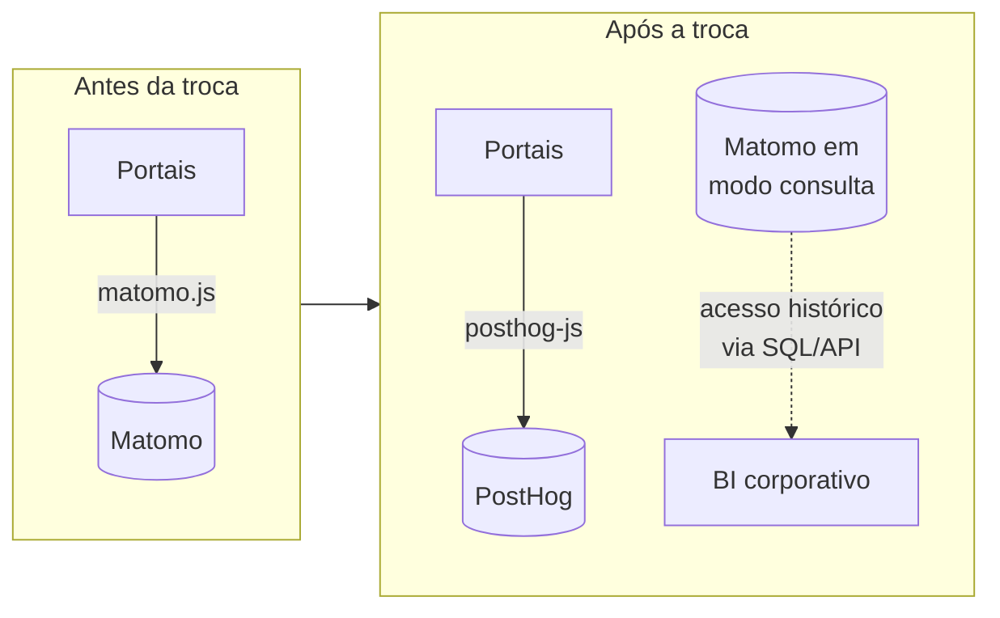
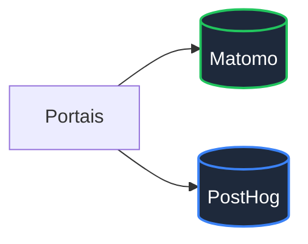

# Comparativo — Risco e custo de migração Matomo → PostHog

> **Corte transversal** · Análise do custo de trocar Matomo por PostHog **após** implantação já em curso na infraestrutura do Estado
> **Motivação:** MS está implantando Matomo On-Premise agora. Se a decisão fosse revertida para PostHog, qual o custo real da migração?
> [← Voltar ao índice](../README.md) · [Matomo × PostHog (comparativo bilateral)](matomo-vs-posthog.md) · [Matriz de decisão](../docs/07-matriz-decisao.md)

---

## Sumário

- [1. Contexto — situação atual no Estado](#1-contexto--situação-atual-no-estado)
- [2. Resposta direta — a série histórica não migra](#2-resposta-direta--a-série-histórica-não-migra)
- [3. O que se perde em uma migração Matomo → PostHog](#3-o-que-se-perde-em-uma-migração-matomo--posthog)
- [4. Por que a incompatibilidade — modelos de dados divergentes](#4-por-que-a-incompatibilidade--modelos-de-dados-divergentes)
- [5. Estratégias de migração](#5-estratégias-de-migração)
- [6. Custo real da migração (adição ao TCO)](#6-custo-real-da-migração-adição-ao-tco)
- [7. Impacto normativo — governança, LGPD e Lei de Acesso à Informação](#7-impacto-normativo--governança-lgpd-e-lei-de-acesso-à-informação)
- [8. Impacto no ADR-001](#8-impacto-no-adr-001)
- [9. Cenário-específico SETDIG/MS](#9-cenário-específico-setdigms)
- [10. Recomendação circunstanciada](#10-recomendação-circunstanciada)
- [11. Antipadrão a evitar — migração impulsiva por experiência positiva com Cloud](#11-antipadrão-a-evitar--migração-impulsiva-por-experiência-positiva-com-cloud)

---

## 1. Contexto — situação atual no Estado

Situação declarada em 2026-07:

| Fato | Situação |
|------|----------|
| Plataforma em implantação ativa | **Matomo On-Premise** na infraestrutura do Governo do Estado de MS |
| Investimento em curso | Infra provisionada, scripts implantados em portais WordPress, geração de histórico de acesso iniciada |
| Estado da decisão arquitetural | Este estudo (ADR-001) recomendou o Matomo — implantação alinhada à recomendação |
| Motivação da pergunta | Viés positivo pela experiência com **PostHog Cloud** em outro contexto |
| Pergunta técnica | *"Se trocar para PostHog, perdemos os dados?"* |

Este documento responde a essa pergunta e quantifica o custo da hipótese.

---

## 2. Resposta direta — a série histórica não migra

> **🚨 Alerta — resposta objetiva**
> **Sim, os dados são perdidos** — no sentido operacional que importa: **não existe migração automática ou ferramenta oficial** que reconstrua o histórico do Matomo dentro do PostHog. A série temporal de indicadores **quebra na data da troca**.
>
> O que sobrevive:
>
> - Os **dados brutos permanecem no banco do Matomo** (MySQL/MariaDB) — consultáveis via SQL ou pela API do Matomo enquanto a instância existir.
> - Métricas **agregadas históricas** podem ser exportadas para um data warehouse externo (Power BI, Superset, Metabase) e ali permanecerem consultáveis.
>
> O que se perde:
>
> - **Continuidade da série dentro da nova plataforma** — o PostHog começa do zero.
> - **Dashboards operacionais** já configurados no Matomo (não são portáveis).
> - **Metas, funis, segmentos e permissões** — reconfigurados manualmente.
> - **Comparabilidade ano-a-ano** dentro de uma única ferramenta.

---

## 3. O que se perde em uma migração Matomo → PostHog

### 3.1 Tabela consolidada

| Ativo analítico | Migra automaticamente? | Estratégia de continuidade |
|-----------------|:----------------------:|----------------------------|
| Histórico de visitas (agregado) | ❌ Não | Exportar CSV/API para BI externo; congelar Matomo em modo consulta |
| Histórico de visitas (bruto, evento a evento) | ❌ Não | Consulta ao banco MariaDB do Matomo (SQL direto) |
| Eventos customizados | ❌ Não | Reimplantar tracking no PostHog; sem retrocompatibilidade |
| Metas / conversões | ❌ Não | Recriar manualmente |
| Funis de conversão | ❌ Não | Recriar; modelo de funil difere entre as plataformas |
| Segmentos salvos | ❌ Não | Recriar |
| Dashboards | ❌ Não | Recriar do zero — modelo de widget difere |
| Custom Reports (plugin pago) | ❌ Não | Não há equivalente direto no PostHog |
| Heatmaps e session recordings | ❌ Não | Session recording do PostHog existe, mas não replica gravações antigas |
| Usuários e permissões | ❌ Não | Reconfigurar; modelos de RBAC diferentes |
| Sites e configurações | ❌ Não | Reconfigurar por projeto no PostHog |
| Tags do Matomo Tag Manager | ❌ Não | PostHog não tem Tag Manager próprio — reimplantar |
| **Dados brutos no banco Matomo** | ✅ Permanecem | Preservação passiva; leitura por SQL |

### 3.2 O que "perder o dado" significa na prática governamental

Para um órgão público, a série histórica de audiência dos portais é ativo:

1. **Prestação de contas** — indicadores de acesso a serviços digitais alimentam relatórios de gestão, PPA e prestação ao TCE-MS.
2. **Transparência ativa** (Lei nº 12.527/2011 e Lei nº 14.129/2021) — dados de uso dos portais podem compor páginas públicas de transparência.
3. **Governança da transformação digital** — a evolução ano-a-ano de acessos por serviço mede o próprio avanço da EGD estadual.
4. **Baseline para experimentos** — comparações "antes/depois" de melhorias em portais exigem série contínua.

**Quebrar a série significa perder essas capacidades por 12–24 meses**, tempo mínimo para reconstruir baseline confiável na nova plataforma.

---

## 4. Por que a incompatibilidade — modelos de dados divergentes

### 4.1 Matomo — modelo relacional orientado a visita

Tabelas principais:

| Tabela | Papel |
|--------|-------|
| `matomo_log_visit` | Visita (sessão): timestamp de entrada/saída, resolução, geolocalização, referenciador |
| `matomo_log_link_visit_action` | Cada ação (page view, evento, download) associada a uma visita |
| `matomo_log_action` | Dicionário de URLs, títulos, nomes de evento (deduplicados) |
| `matomo_archive_numeric_*` | Agregações pré-computadas por período (produzidas pelo `core:archive`) |
| `matomo_archive_blob_*` | Segmentos e visualizações serializadas |
| `matomo_site` | Configurações de site rastreado |
| `matomo_goal` | Metas configuradas |

Modelo mental: **visita como unidade primária**, com ações filhas.

### 4.2 PostHog — modelo event-stream colunar

Tabelas principais (ClickHouse):

| Tabela | Papel |
|--------|-------|
| `events` | Cada evento com timestamp, `distinct_id`, `properties` (JSON) |
| `person` | Identidade agregada de usuário (deduplicada por `distinct_id`) |
| `person_distinct_id` | Mapeamento de identificadores para pessoas |
| `session_replay_events` | Frames de session replay |
| `feature_flag_hash_key_overrides` | Overrides de feature flags |

Modelo mental: **evento como unidade primária**, sessão derivada por lógica de reconstrução.

### 4.3 Por que não há mapeamento 1:1

| Diferença estrutural | Consequência para migração |
|---------------------|----------------------------|
| Matomo agrega no ingest (arquivamento); PostHog agrega no query (ClickHouse) | Contadores diários do Matomo não têm correspondente exato no PostHog |
| Matomo identifica visitas por hash de fingerprint volátil; PostHog identifica pessoas por `distinct_id` persistente | Contagem de "visitantes únicos" é conceitualmente distinta |
| Matomo tem *goals* como entidades de primeira classe; PostHog usa *insights* configuráveis | Metas do Matomo não têm análogo direto |
| Matomo trata heatmap como plugin dedicado; PostHog trata como derivado do session replay | Heatmaps antigos não se convertem |
| Matomo permite retenção configurável por site; PostHog por projeto ou (na EE) por evento | Políticas de retenção diferem |

**Conclusão técnica:** mesmo com esforço de engenharia dedicado, uma migração fiel exigiria **reimplementar a semântica** dos indicadores no PostHog — e ainda assim os números não bateriam exatamente. Isso é o oposto de "migração automática".

---

## 5. Estratégias de migração

### 5.1 Estratégia A — Congelar o Matomo (mais comum)

Fluxo:

1. Deploy do PostHog em paralelo.
2. Data D: troca do tracker nos portais (Matomo → PostHog).
3. Matomo permanece **online, somente leitura**, com desativação da coleta.
4. Consultas históricas continuam sendo feitas na instância Matomo enquanto for útil.
5. Após 24–36 meses (fim da utilidade prática), a instância Matomo é desligada e o banco arquivado.

**Custo:** infra Matomo em standby (~30 % do custo original) durante o período de retenção.

**Perda:** nenhuma dashboard funciona em modo integrado — sempre é preciso escolher "período antes" (Matomo) ou "período depois" (PostHog).

### 5.2 Estratégia B — Coleta paralela (recomendada quando a decisão é reversível)

Fluxo:

1. Portais carregam **ambos** os trackers durante 3–6 meses.
2. Analistas comparam métricas dia a dia — validam se PostHog cumpre o esperado.
3. No fim do período de validação, decide-se:
   - Manter Matomo (reverter a troca) → nenhuma perda; PostHog é descontinuado.
   - Manter PostHog → Matomo entra em modo congelamento (Estratégia A).

**Custo:** dois trackers no cliente (impacto de performance somado); duas instâncias operadas em paralelo; dupla capacitação de equipe.

**Ganho:** decisão baseada em dado real, não em vídeo demo. Reversível.

### 5.3 Estratégia C — Exportação para BI externo (complementar)

Executada **em paralelo** com A ou B, não substitui:

1. Extração periódica do banco Matomo para o data warehouse do Estado (Power BI dataset, Superset connection, Metabase).
2. Dashboards de longa duração vivem no BI, não em cada plataforma de analytics.
3. Ambas as plataformas (Matomo antigo e PostHog novo) alimentam o mesmo BI — série histórica reconstruída na camada de BI, não na plataforma de analytics.

**Vantagem:** desacopla decisão de plataforma de tracking da decisão de plataforma de visualização.

**Custo:** desenvolvimento e manutenção de pipelines ETL.

### 5.4 Estratégia D — Reprocessamento de logs web (não recomendado)

Teoricamente viável: reproduzir eventos passados a partir dos logs de acesso do servidor web (Nginx/Apache) para o PostHog.

**Por que não recomendado:**

- Logs web não têm dado de sessão (não conseguem reconstruir "visita").
- Não contêm eventos JavaScript (cliques, tempo em vídeo).
- Volumetria explode — cada acesso vira múltiplas requisições.
- Custo de engenharia > valor entregue.

---

## 6. Custo real da migração (adição ao TCO)

Modelagem em regime marginal SETDIG. Cenário: parque de ~200 portais, coleta paralela por 6 meses (Estratégia B), depois congelamento do Matomo (Estratégia A) por 24 meses.

### 6.1 Rubricas do custo de migração

| Rubrica | Estimativa (única) |
|---------|-------------------:|
| Provisionamento do PostHog (Kafka+CH+MinIO+K8s Helm) | R$ 90.000 |
| Capacitação da equipe SETDIG (ClickHouse + Kafka + operação PostHog) | R$ 60.000 |
| Recriação de dashboards operacionais (~200 portais) | R$ 40.000 |
| Recriação de metas, funis e segmentos | R$ 30.000 |
| Reconfiguração de tags em cada portal WordPress | R$ 20.000 |
| Reimplantação de Consent Manager (banner recalibrado) | R$ 25.000 |
| Coleta paralela — operação em duplicidade por 6 meses | R$ 50.000 |
| Comunicação e treinamento de usuários finais dos dashboards | R$ 15.000 |
| Nova DPIA (produto orientado a identificação) | R$ 30.000 |
| Migração de integrações com BI corporativo | R$ 40.000 |
| Manutenção do Matomo em modo congelamento (24 meses × R$ 1.500/mês) | R$ 36.000 |
| **Custo de migração (única)** | **R$ 436.000** |

### 6.2 Impacto acumulado no TCO 5 anos

| Cenário | TCO 5 anos |
|---------|-----------:|
| Manter Matomo On-Premise (recomendado — ADR-001) | R$ 235.000 |
| Migrar para PostHog OSS após implantação Matomo | R$ 235.000 (Matomo já pago) + **R$ 436.000 (migração)** + R$ 955.000 (PostHog 5 anos) = **R$ 1.626.000** |
| **Diferencial da hipótese de migração** | **+R$ 1.391.000 (6,9× mais caro)** |

> **⚠️ Bloco de Risco — o custo do "arrependimento"**
> Reverter a decisão do ADR-001 após a implantação em curso custa **quase R$ 1,4 M em 5 anos**. Isso não é apenas custo financeiro — é custo político (justificativa perante TCE-MS), custo institucional (perda de credibilidade da esteira de arquitetura) e custo operacional (equipe sob dois stacks distintos simultaneamente).

### 6.3 Custo de "hedge" (Estratégia B — coleta paralela sem substituição)

Se o objetivo for **validar** o PostHog sem descartar o Matomo:

| Rubrica | Estimativa |
|---------|-----------:|
| Provisionamento do PostHog em ambiente de piloto | R$ 45.000 |
| Coleta paralela em 3 portais representativos por 6 meses | R$ 30.000 |
| Análise comparativa e relatório de decisão | R$ 25.000 |
| **Custo do hedge** | **R$ 100.000** |

Este é o **valor máximo defensável** para investigar o PostHog sem comprometer a implantação Matomo. Se o piloto confirmar preferência pelo PostHog, o custo de migração completa se soma.

---

## 7. Impacto normativo — governança, LGPD e Lei de Acesso à Informação

### 7.1 LGPD — nova DPIA obrigatória

| Fato | Consequência |
|------|--------------|
| Matomo em configuração cookieless dispensa consentimento (precedente CNIL) | DPIA atual permite operar sob **legítimo interesse** |
| PostHog é orientado a identificação (`distinct_id` persistente) | DPIA precisa ser **refeita**; provavelmente exigirá **consentimento** para session replay e feature flags |
| Migração de plataforma = mudança material no tratamento | **Comunicação obrigatória à ANPD** (art. 48 quando aplicável) e revisão do ROPA |
| Retenção do banco Matomo em modo congelamento | Precisa ter **base legal declarada** (guarda para atender direito do titular ou obrigação legal) |

### 7.2 Lei de Acesso à Informação (12.527/2011)

Se dashboards de audiência dos portais forem publicados como transparência ativa, a migração:

- Interrompe a série histórica publicada;
- Exige nova nota metodológica explicando a descontinuidade;
- Cria janela em que **duas metodologias distintas** convivem no mesmo painel público.

Justificar essa quebra perante controle social é ônus institucional adicional.

### 7.3 Lei de Governo Digital (14.129/2021)

Princípios impactados:

- **Interoperabilidade** — migração ativa e não planejada é o oposto de interoperabilidade estável.
- **Economicidade** — TCO 6,9× superior contraria o art. 3º da Lei 14.129/2021.
- **Continuidade** — quebra da série é o oposto de continuidade de indicadores.

### 7.4 Norma interna SETDIG

Alterações materiais em plataforma padrão exigem:

- Revisão do ADR (novo ADR-002 revogando ou emendando o ADR-001);
- Aprovação do Comitê de Arquitetura;
- Comunicação a todas as Secretarias que operam portais rastreados;
- Prazo mínimo de deprecation formal.

---

## 8. Impacto no ADR-001

Migrar Matomo → PostHog **agora** exige:

1. **Revogar ou emendar o ADR-001** — a decisão foi formal, com base em matriz auditável.
2. **Registrar novo ADR** justificando por que a matriz mudou. As justificativas plausíveis são:
   - **Mudança das premissas** (P1/P2/R4 deixaram de valer) → improvável no horizonte de meses.
   - **Mudança dos requisitos** (novo caso de uso exige *product analytics* de SaaS) → possível se surgir superapp cidadão.
   - **Novo dado técnico** (Matomo falhou em requisito) → não é o caso.
3. **Aceitar o custo financeiro documentado** (R$ 1,4 M adicional em 5 anos) e explicá-lo em memória técnica.
4. **Comunicar à ANPD** e revisar ROPA.

Nenhuma dessas condições está satisfeita hoje. **Reverter a decisão do ADR-001 seria arquiteturalmente indefensável no momento**.

---

## 9. Cenário-específico SETDIG/MS

### 9.1 Estado presente da implantação

| Investimento | Estado |
|--------------|--------|
| Infraestrutura provisionada | 🟢 Em curso |
| Scripts implantados em portais WordPress | 🟢 Em curso |
| Configuração inicial de sites e permissões | 🟢 Em curso |
| Geração de histórico de acesso | 🟢 Iniciada |
| Integração com BI corporativo | 🟡 Planejada |
| Adequação LGPD (DPIA cookieless) | 🟡 Em elaboração |

Todo investimento já feito precisaria ser **abandonado ou refeito** no PostHog:

| Componente | Custo já investido no Matomo | Perda se migrar |
|-----------|------------------------------|-----------------|
| Provisão de infra | Já contratado | Parcialmente reaproveitável (VMs, storage) |
| Configuração de tracking em portais | ~40 h × R$ 120 = ~R$ 5 k | Perda total; recriar no PostHog |
| Configuração de sites Matomo | ~30 h × R$ 120 = ~R$ 4 k | Perda total |
| Capacitação equipe SETDIG em Matomo | ~80 h × R$ 120 = ~R$ 10 k | Perda total; capacitar de novo em PostHog |
| DPIA em elaboração | ~R$ 20 k | Precisa ser refeita — modelo distinto |
| **Total afundado** | **~R$ 40 k** | Perda de 100 % se migrar |

### 9.2 Cenários futuros hipotéticos

**Cenário 1 — Manter Matomo, avaliar PostHog em piloto isolado** (recomendado)

- Continua implantação Matomo conforme ADR-001.
- Provisiona PostHog em piloto isolado para 1 serviço digital específico (se houver caso de uso claro).
- Investimento: ~R$ 100 k em hedge (§6.3).
- Não afeta a decisão principal.

**Cenário 2 — Coleta paralela obrigatória por 6 meses**

- Ambos os trackers em todos os portais por 6 meses.
- Custo adicional: R$ 100 k.
- Ao fim, decisão informada por dado real.
- **Só faz sentido se houver dúvida legítima** — não é o caso hoje (matriz decidiu com folga).

**Cenário 3 — Migração completa Matomo → PostHog**

- Custo adicional: R$ 1,39 M em 5 anos.
- Perda de série histórica de audiência.
- Nova DPIA + comunicação ANPD.
- Revogação do ADR-001.
- **Requer justificativa arquitetural forte** — não existe hoje.

**Cenário 4 — Superapp cidadão futuro exige *product analytics***

- Mantém Matomo para portais institucionais.
- Adota PostHog **exclusivamente** para o superapp.
- Convivência de plataformas por escopo de uso.
- Custo: soma dos dois TCOs (~R$ 1,2 M em 5 anos).
- **Cenário defensável** se e quando o superapp for formalizado como iniciativa estratégica.

### 9.3 Análise da irreversibilidade

Contra o senso comum, **a decisão do ADR-001 é reversível** — a qualquer momento pode-se revogar por novo ADR. O que **não é reversível** é a **série histórica** e o **investimento afundado**.

Regra prática: **quanto mais tempo o Matomo operar, maior o custo de migrar**. A janela onde a migração é *comparativamente barata* (< 3 meses de operação) já se fechou parcialmente. Após 12 meses de operação estabilizada, o custo triplica.

---

## 10. Recomendação circunstanciada

> **✅ Bloco de Decisão — a migração não é economicamente defensável no momento**
>
> **Recomendação:** manter a implantação do Matomo On-Premise em curso, conforme ADR-001. Não iniciar migração para PostHog agora.
>
> **Fundamento:**
>
> 1. **Custo financeiro:** +R$ 1,39 M em 5 anos, 6,9× o TCO original.
> 2. **Perda de continuidade histórica** dos indicadores dos portais — quebra irreversível de série temporal.
> 3. **Investimento afundado** de ~R$ 40 k já aplicado na implantação atual.
> 4. **Nova DPIA obrigatória** e comunicação à ANPD.
> 5. **Revogação formal do ADR-001** com justificativa arquitetural que hoje não existe.
> 6. **Nenhum requisito prioritário** dos portais estaduais depende de recursos exclusivos do PostHog.
>
> **Hedge admissível:** provisionar PostHog em **piloto isolado** para um serviço digital específico, ao custo de ~R$ 100 k, sem afetar a implantação Matomo. Isso permite validar o produto em contexto real sem comprometer a decisão principal.
>
> **Gatilho para reavaliar:** formalização de iniciativa de **superapp cidadão** ou serviço digital transacional complexo que exija *feature flags*, *experimentation* ou *product analytics* orientado a produto. Neste cenário, o PostHog entraria como plataforma **adicional para escopo específico**, não como substituta do Matomo.

### 10.1 Gate formal de reavaliação

O ADR-001 já prevê revisão em 24 meses (2028-07). Antecipação da revisão requer:

- Requisito funcional novo, formalmente documentado, não atendido pelo Matomo;
- Falha material do Matomo em requisito *Must have* (não identificada até o momento);
- Mudança normativa (LGPD, EGD, norma SETDIG) que reprove a arquitetura vigente;
- Decisão do Comitê de Arquitetura.

Nenhum desses gatilhos foi acionado.

---

## 11. Antipadrão a evitar — migração impulsiva por experiência positiva com Cloud

Padrão comum de decisão institucional que este documento pretende evitar:

**Como evitar:**

1. Documentar formalmente **qual requisito** o Matomo não atende. Se essa lista está vazia, a migração é injustificada.
2. Testar o PostHog **em modalidade auto-hospedada real** (não Cloud) por 30 dias antes de qualquer decisão.
3. Estimar o custo total incluindo migração — nunca comparar TCO da nova plataforma isoladamente.
4. Passar pela esteira do Comitê de Arquitetura com ADR de revisão formal, não por decisão de gestor individual.

### 11.1 Perguntas de sanidade antes de propor migração

Se responder **"não"** a qualquer uma delas, a migração não é justificada:

- [ ] Existe requisito funcional obrigatório que o Matomo comprovadamente não atende?
- [ ] Testei o PostHog auto-hospedado (não a Cloud) em cenário representativo?
- [ ] Calculei o TCO incluindo os R$ 400 k+ de migração?
- [ ] Aceito a perda da série histórica dos portais?
- [ ] Tenho orçamento e mandato para revogar o ADR-001?
- [ ] Comuniquei à ANPD e revisei o ROPA?
- [ ] Consegui aprovação do Comitê de Arquitetura?

---

## Referências cruzadas

- Comparativo bilateral Matomo × PostHog: [`matomo-vs-posthog.md`](matomo-vs-posthog.md)
- ADR-001: [`../docs/08-adr.md`](../docs/08-adr.md)
- Custo em regime marginal: [`custo.md`](custo.md)
- LGPD e transferência internacional: [`lgpd.md`](lgpd.md)
- Trade-offs Matomo: [`../docs/06-tradeoffs.md §3`](../docs/06-tradeoffs.md#3-matomo-on-premise)
- Trade-offs PostHog: [`../docs/06-tradeoffs.md`](../docs/06-tradeoffs.md)
- Ficha Matomo: [`../plataformas/matomo.md`](../plataformas/matomo.md)
- Ficha PostHog: [`../plataformas/posthog.md`](../plataformas/posthog.md)
- Roadmap de implantação Matomo: [`../docs/10-roadmap.md`](../docs/10-roadmap.md)
- Registro de riscos: [`../docs/11-riscos.md`](../docs/11-riscos.md)
