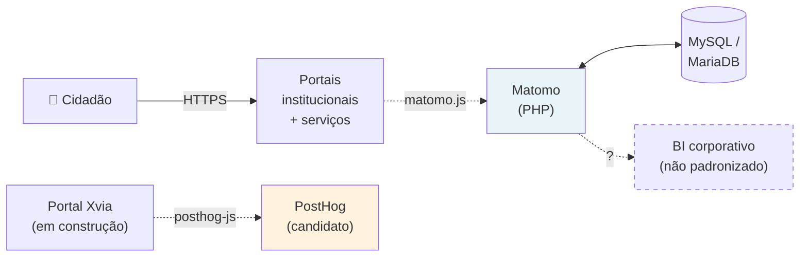

# 01 — Contexto Arquitetural

> **Fase TOGAF ADM:** A — Architecture Vision
> **Documento anterior:** [README](../README.md) · **Próximo:** [02 — Requisitos](02-requisitos.md)

## Sumário

- [1. Situação atual](#1-situação-atual)
- [2. Pergunta central](#2-pergunta-central)
- [3. Motivação para o estudo](#3-motivação-para-o-estudo)
- [4. Stakeholders](#4-stakeholders)
- [5. Arquitetura vigente (as-is)](#5-arquitetura-vigente-as-is)
- [6. Contexto normativo](#6-contexto-normativo)
- [7. Premissas e restrições](#7-premissas-e-restrições)
- [8. Perfil de carga](#8-perfil-de-carga)
- [9. Direcionadores arquiteturais](#9-direcionadores-arquiteturais)
- [10. Fora do escopo](#10-fora-do-escopo)

---

## 1. Situação atual

O Estado opera **Matomo On-Premise** como plataforma de Web Analytics para portais institucionais e serviços digitais. Está em produção, atende à mensuração básica, mas foi **implantado sem estudo prévio** de alternativas.

Em paralelo, o novo **portal Xvia** (superapp cidadão) está sendo construído. A stack de Web Analytics on-premise gratuita adotada pela equipe Xvia é o **PostHog**. Isso obriga a decisão arquitetural: **coexistir, substituir ou padronizar**?

Três lacunas de governança na situação vigente:

| Lacuna | Consequência |
|--------|--------------|
| Sem artefato decisório do Matomo | Escolha não é auditável nem defensável em órgão de controle |
| Sem benchmark de alternativas | Não se pode afirmar que a escolha é a melhor disponível |
| Sem arquitetura de referência | Implantações divergem entre órgãos; conformidade LGPD ad-hoc |

> **📌 Observação**
> A ausência de artefato decisório **não implica que a decisão esteja errada** — só que é indefensável formalmente. Este estudo remedia o processo. O resultado (confirmar, ajustar ou contrariar o status quo) está em [`07-recomendacao.md`](07-recomendacao.md).

---

## 2. Pergunta central

**Manter Matomo, substituir por PostHog, ou operar os dois em coexistência?**

Antes de responder, benchmark documental das quatro plataformas **on-premise gratuitas** viáveis dentro da infra do Estado: Matomo, PostHog, Plausible, Umami. Alternativas SaaS ou proprietárias saíram do escopo — arquivadas em `anexos/historico/`.

Direção estratégica (a validar no ADR e no roadmap): coexistência de curto prazo (Matomo parque + PostHog Xvia) → Matomo camada de consulta histórica → convergência em uma única ferramenta a médio prazo.

---

## 3. Motivação para o estudo

| Motivação | Fundamento | O que exige |
|-----------|-----------|-------------|
| **Conformidade** | LGPD arts. 37 (registro), 38 (RIPD), 46 (segurança); Marco Civil art. 15 | Documentar quais dados, onde, por quanto tempo, sob qual base legal |
| **Arquitetura corporativa** | Lei 14.129/2021 (Gov Digital) — interoperabilidade e eficiência | Justificar aderência a princípios |
| **Econômica** | Lei 14.133/2021 arts. 18 e 40 (ETP) | Modelar TCO 5 anos; prever custo de saída |
| **Capacidade analítica** | Dados de portal subaproveitados | Priorizar melhorias por evidência, alimentar BI |

---

## 4. Stakeholders

| Stakeholder | Papel | Poder de veto | Preocupação-chave |
|-------------|-------|---------------|-------------------|
| SETDIG — Secretário Executivo | Patrocinador | Alto | Custo-benefício, imagem institucional |
| SGD | Dono do negócio | Alto | Capacidade analítica, usabilidade |
| STI | Operação | Alto | Sustentabilidade, disponibilidade, segurança |
| **DPO** | Conformidade | **Absoluto** | Base legal, transferência internacional, retenção |
| **SegInfo** | Conformidade | **Absoluto** | CVEs, controle de acesso, criptografia, logs |
| Equipe Xvia | Consumidora nova | Médio | Product analytics, funil, feature flags |
| Órgãos setoriais | Usuário final | Baixo | Autonomia, segregação de dados |
| TCE-MS / CGE | Fiscalização | Indireto | Justificativa da escolha, economicidade |
| Cidadão / titular | Sujeito de direito | Indireto (via ANPD) | Privacidade, direitos do titular |

DPO e SegInfo vetam absolutamente: plataforma que falhe em requisito legal ou de segurança é eliminada, independentemente da pontuação nos demais critérios.

---

## 5. Arquitetura vigente (as-is)

**Lacunas técnicas do parque atual:** ingestão síncrona (sem fila), sem política formal de retenção, sem cache de agregação para BI, sem HA documentada, anonimização ad-hoc, sem integração com IdP corporativo, sem DR testado. Tratadas na arquitetura-alvo em [`07-recomendacao.md`](07-recomendacao.md).

---

## 6. Contexto normativo

Base legal aplicável ao estudo (rastreável na íntegra em [`99-referencias.md`](99-referencias.md)):

- **Federal:** LGPD (Lei 13.709/2018), Gov Digital (14.129/2021), LAI (12.527/2011), Marco Civil (12.965/2014), Nova Lei de Licitações (14.133/2021), IN SGD/ME 94/2022.
- **Estadual (MS):** Lei 6.035/2022 (cria SETDIG), Decreto 16.166/2023 (regulamenta estrutura).
- **Precedentes internacionais aplicáveis por analogia:** CNIL (exemption Matomo), TJUE Schrems II, decisões EDPB sobre Google Analytics (2022), EU-US DPF (2023).

---

## 7. Premissas e restrições

**Premissas — se falsas, mudam a conclusão:**

| # | Premissa |
|---|----------|
| P1 | Infra própria do Estado suporta hospedar aplicação web + banco relacional com HA |
| P2 | STI possui ou desenvolve competência em Linux, containers, banco relacional, observabilidade |
| P3 | Soberania de dados prevalece sobre conveniência operacional |
| P4 | Horizonte de planejamento: 5 anos ou mais |
| P5 | Integração com BI corporativo é requisito |
| P6 | Volume permanece na ordem de grandeza da seção 8 |
| P7 | Não há exigência regulatória de certificação de fornecedor (ex.: ISO 27001) |
| P8 | Software livre é juridicamente aceitável |

**Restrições — limites não negociáveis:**

| # | Restrição | Natureza |
|---|-----------|----------|
| R1 | LGPD aplicável integralmente | Absoluta |
| R2 | Transferência internacional exige base do art. 33 documentada | Absoluta |
| R3 | Solução paga exige licitação ou dispensa/inexigibilidade fundamentada | Absoluta |
| R4 | Operar sobre infra/nuvem já contratada pelo Estado | Forte |
| R5 | Sem ampliação prevista de quadro da STI | Forte |
| R6 | Segregação de acesso por órgão | Forte |
| R7 | HTTPS obrigatório e CSP dos portais respeitada | Forte |
| R8 | Tracking sem degradação perceptível dos portais | Forte |
| R9 | Acessibilidade eMAG/WCAG para operadores internos | Média |

---

## 8. Perfil de carga

> **📌 Observação**
> Premissa de dimensionamento para modelagem arquitetural. Deve ser substituída por medição real na Onda 1 do roadmap. Metodologia em [`../anexos/benchmark.md`](../anexos/benchmark.md).

| Parâmetro | Conservador | Referência | Pico |
|-----------|-----------:|-----------:|-----:|
| Portais / propriedades | 30 | 80 | 150 |
| Page views / mês | 3M | 12M | 30M |
| Eventos / mês | 5M | 20M | 55M |
| Visitantes únicos / mês | 400k | 1,5M | 4M |
| Tracking req/s (média) | ~2 | ~8 | ~21 |
| Tracking req/s (pico) | ~40 | ~150 | ~400 |
| Usuários internos | 50 | 200 | 400 |

**Eventos geradores de pico** (multiplicador sobre a média): concurso público (10–30×), resultado de processo seletivo (20–50×), emergência (defesa civil, saúde) (15–40×), campanha estadual (5–15×), abertura de programa social (10–25×).

> **⚠️ Bloco de Risco — Elasticidade**
> Carga do setor público é **bursty**: baixa média com picos de duas ordens de grandeza. Dimensionamento para média falha no pico; para pico é antieconômico na média. **Mitigação:** ingestão via fila (Redis/QueuedTracking no Matomo, batch ingestion no PostHog) — dimensiona banco para vazão média, absorve pico assincronamente.

---

## 9. Direcionadores arquiteturais

| ID | Direcionador | Criticidade | Critério correspondente |
|----|-------------|-------------|------------------------|
| D1 | Soberania de dados | 🔴 Crítico | Controle dos dados (peso 15) |
| D2 | Conformidade LGPD | 🔴 Crítico | LGPD (peso 15) |
| D3 | Independência tecnológica | 🟠 Alto | Independência (peso 10) |
| D4 | Sustentabilidade operacional | 🟠 Alto | Operação (peso 5) |
| D5 | Capacidade analítica (funis, jornada, product analytics) | 🟡 Médio | Recursos analíticos (peso 10) |
| D6 | Integração com BI corporativo | 🟡 Médio | APIs + Integrações (10 + 10) |
| D7 | Economicidade em 5 anos | 🟠 Alto | TCO — informativo no ADR-002 |
| D8 | Elasticidade sob pico 10–50× | 🟡 Médio | Escalabilidade (peso 10) |

---

## 10. Fora do escopo

Analytics mobile nativo, APM/observabilidade de infra, social listening, CDP, data warehouse corporativo, teste de usabilidade moderado, SEO / Search Console. São camadas distintas ou consumidoras deste estudo.

---

## Navegação

| ⬅️ Anterior | ➡️ Próximo |
|------------|-----------|
| [README](../README.md) | [02 — Requisitos](02-requisitos.md) |
