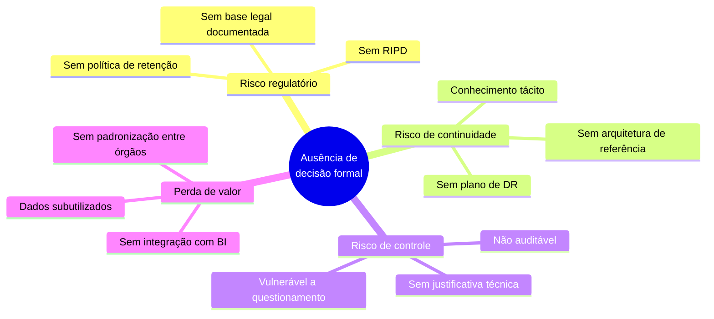
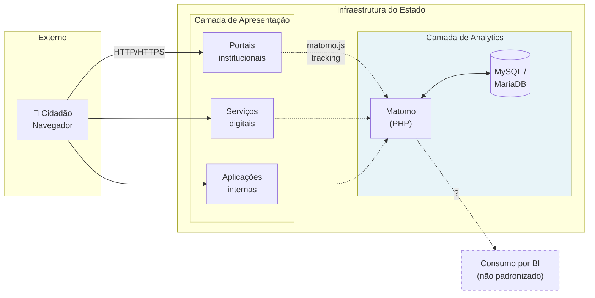

# 01 — Contexto Arquitetural

> **Fase TOGAF ADM:** A — Architecture Vision
> **Documento anterior:** [README](../README.md) · **Próximo:** [02 — Requisitos](02-requisitos.md)

---

## Sumário

- [1. Situação atual](#1-situação-atual)
- [2. Motivação para o estudo](#2-motivação-para-o-estudo)
- [3. Declaração do problema](#3-declaração-do-problema)
- [4. Stakeholders](#4-stakeholders)
- [5. Arquitetura vigente (as-is)](#5-arquitetura-vigente-as-is)
- [6. Contexto normativo](#6-contexto-normativo)
- [7. Premissas](#7-premissas)
- [8. Restrições](#8-restrições)
- [9. Perfil de carga e dimensionamento](#9-perfil-de-carga-e-dimensionamento)
- [10. Direcionadores arquiteturais](#10-direcionadores-arquiteturais)
- [11. Fora do escopo](#11-fora-do-escopo)

---

## 1. Situação atual

O Governo do Estado de Mato Grosso do Sul opera o **Matomo** como plataforma de Web Analytics para o conjunto de portais institucionais e serviços digitais do Estado. A plataforma está em produção e atende à necessidade operacional básica de mensuração de audiência.

A situação apresenta, no entanto, três lacunas de governança arquitetural:

| Lacuna | Descrição | Consequência |
|--------|-----------|--------------|
| **Ausência de artefato decisório** | Não existe ADR, estudo comparativo ou memória técnica registrando por que o Matomo foi escolhido | A decisão não é auditável nem defensável perante órgão de controle |
| **Ausência de benchmark** | Não houve avaliação formal de alternativas de mercado | Não é possível afirmar que a escolha é a melhor disponível |
| **Ausência de arquitetura de referência** | Não há padrão documentado de implantação, retenção, integração ou operação | Implantações divergem entre órgãos; conformidade LGPD não é uniformemente garantida |

> **📌 Observação**
> A ausência de artefato decisório **não implica que a decisão esteja errada**. Implica que ela é indefensável formalmente. Este estudo remedia o processo, e o resultado da avaliação — que pode confirmar ou contrariar o status quo — está em [`09-recomendacao.md`](09-recomendacao.md).

---

## 2. Motivação para o estudo

### 2.1 Motivação de conformidade

A **Lei nº 13.709/2018 (LGPD)** exige, no art. 37, que o controlador mantenha registro das operações de tratamento de dados pessoais. O art. 38 faculta à ANPD determinar a elaboração de Relatório de Impacto à Proteção de Dados Pessoais (RIPD/DPIA). Uma plataforma de Web Analytics realiza tratamento de dados pessoais (endereço IP é dado pessoal, conforme entendimento consolidado tanto no RGPD europeu quanto na doutrina LGPD brasileira).

Sem artefato arquitetural que documente:
- quais dados são coletados,
- onde são armazenados,
- por quanto tempo,
- sob qual base legal,
- e se há transferência internacional,

o Estado opera em situação de exposição regulatória.

### 2.2 Motivação de arquitetura corporativa

A **Lei nº 14.129/2021 (Lei do Governo Digital)** estabelece, entre os princípios do governo digital, o uso de soluções tecnológicas que promovam interoperabilidade, a abertura de dados e a eficiência do gasto público. A adoção de plataformas sem estudo formal impede demonstrar aderência a esses princípios.

### 2.3 Motivação econômica

O custo total de propriedade (TCO) de uma plataforma de analytics não se limita a licença. Inclui infraestrutura, equipe, operação, atualizações e o custo de eventual migração futura. Sem modelagem de TCO, o Estado não consegue:
- justificar orçamento;
- comparar objetivamente alternativas;
- prever o custo de saída (*exit cost*) caso precise migrar.

### 2.4 Motivação de capacidade analítica

Os portais e serviços digitais do Estado geram dados de uso que hoje são subaproveitados. Analytics maduro habilita:
- identificação de gargalos em jornadas de serviço digital;
- priorização de melhorias por evidência, não por percepção;
- mensuração objetiva de adesão a serviços digitalizados;
- alimentação de painéis de BI e indicadores de transformação digital.

---

## 3. Declaração do problema

> **🚨 Alerta — Problema arquitetural central**
>
> **Não existe decisão arquitetural formalizada, fundamentada e auditável** sobre qual plataforma de Web Analytics deve ser o padrão do Governo do Estado de Mato Grosso do Sul, nem arquitetura de referência que garanta conformidade com a LGPD, soberania sobre os dados e integração com a plataforma de BI do Estado.

Desdobramentos do problema:

---

## 4. Stakeholders

Análise conforme técnica de *stakeholder mapping* do TOGAF (Fase A, passo 4).

| Stakeholder | Papel | Interesse principal | Poder de veto | Preocupação-chave |
|-------------|-------|--------------------|---------------|-------------------|
| **SETDIG — Secretário Executivo** | Patrocinador | Aderência à estratégia de transformação digital | Alto | Custo-benefício, imagem institucional |
| **SGD — Superintendência de Governo Digital** | Dono do negócio | Métricas de adesão e qualidade dos serviços digitais | Alto | Capacidade analítica, usabilidade das ferramentas |
| **STI — Superintendência de Tecnologia da Informação** | Operação | Sustentabilidade operacional | Alto | Esforço de manutenção, disponibilidade, segurança |
| **Encarregado de Dados (DPO)** | Conformidade | Aderência à LGPD | **Veto absoluto** | Base legal, transferência internacional, retenção |
| **Área de Segurança da Informação** | Conformidade | Superfície de ataque, gestão de vulnerabilidades | **Veto absoluto** | CVEs, controle de acesso, criptografia, logs |
| **Comunicação Social / Assessorias** | Usuário final | Audiência dos portais, alcance de campanhas | Baixo | Facilidade de uso, relatórios prontos |
| **Órgãos setoriais (Secretarias)** | Usuário final | Métricas de seus próprios portais | Baixo | Autonomia, segregação de dados |
| **Órgãos de controle (TCE-MS, CGE)** | Fiscalização | Legalidade, economicidade, transparência | Indireto | Justificativa da escolha, economicidade do gasto |
| **Cidadão / Titular de dados** | Sujeito de direito | Privacidade | Indireto (via ANPD) | Rastreamento, consentimento, direitos do titular |

> **📌 Observação**
> O DPO e a área de Segurança da Informação exercem **veto absoluto**: uma plataforma que não atenda aos requisitos legais e de segurança é eliminada independentemente da pontuação obtida nos demais critérios. Isso está formalizado como critério eliminatório em [`03-criterios-de-avaliacao.md`](03-criterios-de-avaliacao.md).

---

## 5. Arquitetura vigente (as-is)

### 5.1 Diagrama de contexto

### 5.2 Componentes identificados

| Componente | Tecnologia | Observação |
|-----------|-----------|------------|
| Coletor de eventos | `matomo.js` (JavaScript, client-side) | Script embarcado nas páginas |
| Aplicação | Matomo, PHP 8.x + servidor web | Interface de relatórios + endpoint de tracking (`matomo.php`) |
| Persistência | MySQL ou MariaDB | Tabelas `matomo_log_*` (dado bruto) e `matomo_archive_*` (dado agregado) |
| Processamento | Cron de arquivamento (`core:archive`) | Agrega dado bruto em relatórios pré-calculados |
| Consumo | Interface web + Reporting API | Integração com BI não padronizada |

### 5.3 Lacunas técnicas da arquitetura vigente

| # | Lacuna | Impacto |
|---|--------|---------|
| L1 | Ingestão síncrona (sem fila) | Pico de tráfego pode degradar tempo de resposta do tracking e do banco |
| L2 | Ausência de política formal de retenção | Dado bruto acumula indefinidamente; risco LGPD (princípio da necessidade) e degradação de performance |
| L3 | Ausência de camada de cache/agregação para BI | Consultas de BI competem com o tracking pelo mesmo banco |
| L4 | Sem alta disponibilidade documentada | Ponto único de falha |
| L5 | Sem padrão de anonimização documentado | Conformidade LGPD depende de configuração ad-hoc por instância |
| L6 | Sem integração com provedor de identidade | Gestão de usuários manual e desconectada do diretório do Estado |
| L7 | Sem plano de Disaster Recovery testado | RPO/RTO indefinidos |

Essas lacunas são endereçadas na arquitetura-alvo em [`09-recomendacao.md`](09-recomendacao.md) e no plano em [`10-roadmap.md`](10-roadmap.md).

---

## 6. Contexto normativo

### 6.1 Federal

| Norma | Ementa | Relevância para o estudo |
|-------|--------|--------------------------|
| **Lei nº 13.709/2018** (LGPD) | Proteção de dados pessoais | Base legal do tratamento, direitos do titular, transferência internacional (arts. 33–36), segurança (art. 46), RIPD (art. 38) |
| **Lei nº 14.129/2021** | Governo Digital | Princípios de interoperabilidade, dados abertos, eficiência; art. 16 (uso de software público) |
| **Lei nº 12.527/2011** (LAI) | Acesso à informação | Dados de uso de portais públicos podem ser objeto de pedido de acesso |
| **Lei nº 12.965/2014** (Marco Civil) | Direitos na Internet | Guarda de registros de acesso (art. 15), neutralidade, privacidade |
| **Decreto nº 10.046/2019** | Governança de dados na Administração federal | Referência de boas práticas para compartilhamento e classificação de dados |
| **Lei nº 14.133/2021** | Nova Lei de Licitações | Art. 18 (estudo técnico preliminar), art. 40 (planejamento da contratação) — este estudo instrui eventual contratação |
| **IN SGD/ME nº 94/2022** | Contratações de TIC | Modelo de referência para ETP e Termo de Referência de soluções de TIC |

### 6.2 Estadual (MS)

| Norma | Ementa | Relevância |
|-------|--------|-----------|
| **Lei nº 6.035/2022** | Estrutura da Administração estadual; cria a SETDIG | Define a competência da SETDIG para estabelecer padrões de transformação digital |
| **Decreto nº 16.166/2023** | Regulamenta a estrutura da SETDIG | Atribui à SGD e à STI as competências operacionais |

> **📌 Observação**
> A verificação da existência de decreto estadual específico de MS regulamentando a LGPD no âmbito da Administração estadual (comitê gestor, encarregado, política de segurança da informação) deve ser feita junto à Procuradoria-Geral do Estado antes da homologação deste documento. Este estudo assume, conservadoramente, a aplicação integral da LGPD federal.

### 6.3 Referências internacionais aplicáveis por analogia

| Referência | Conteúdo | Aplicação |
|-----------|----------|-----------|
| **CNIL (França)** — exemption de consentement | Autoridade francesa reconhece configuração específica do Matomo como isenta de consentimento | Precedente técnico de configuração cookieless auditada por autoridade de proteção de dados |
| **TJUE — Schrems II (C-311/18)** | Invalida o Privacy Shield; exige avaliação de transferências para EUA | Fundamento da análise de transferência internacional em [`../comparativos/lgpd.md`](../comparativos/lgpd.md) |
| **EDPB — decisões sobre Google Analytics (2022)** | Autoridades austríaca, francesa, italiana e dinamarquesa consideraram o uso do GA incompatível com o RGPD | Evidência primária sobre risco regulatório de analytics de terceiros |
| **EU-US Data Privacy Framework (2023)** | Nova base de adequação para transferências UE→EUA | Mitiga, mas não elimina, o risco identificado nas decisões de 2022 |

---

## 7. Premissas

Premissas são condições assumidas como verdadeiras. Se uma premissa for falsa, a conclusão do estudo pode mudar.

| # | Premissa | Se falsa, impacta |
|---|----------|-------------------|
| P1 | O Estado dispõe de infraestrutura própria (datacenter ou nuvem contratada) capaz de hospedar aplicação web + banco relacional com HA | Elimina viabilidade de todas as opções auto-hospedado |
| P2 | A equipe da STI possui ou pode desenvolver competência em Linux, PHP/containers, MySQL e observabilidade | Aumenta drasticamente o custo de operação de opções auto-hospedado |
| P3 | Preferência institucional por soberania de dados sobre conveniência operacional | Inverte o peso relativo de critérios de controle vs. operação |
| P4 | Horizonte de planejamento é de 5 anos ou mais | Reduz o peso do custo de implantação frente ao custo recorrente |
| P5 | Haverá necessidade de integrar analytics com a plataforma de BI do Estado | Reduz o peso do critério de APIs |
| P6 | O volume de tráfego permanece na ordem de grandeza descrita na seção 9 | Invalida o dimensionamento e a análise de escalabilidade |
| P7 | Não há exigência regulatória de certificação específica (ex.: exigência formal de ISO 27001 do fornecedor) | Elimina opções auto-hospedado sem certificação de terceiro |
| P8 | Software livre é aceitável do ponto de vista jurídico e de suporte | Elimina Matomo On-Premise, Plausible, Umami, OWA e PostHog |

---

## 8. Restrições

Restrições são limites impostos, não negociáveis no âmbito deste estudo.

| # | Restrição | Origem | Natureza |
|---|-----------|--------|----------|
| R1 | Dado pessoal de cidadão brasileiro tratado por órgão público estadual está sujeito à LGPD | Legal | Absoluta |
| R2 | Transferência internacional de dados requer base legal do art. 33 da LGPD e avaliação documentada | Legal | Absoluta |
| R3 | Contratação de solução paga exige processo licitatório ou hipótese de dispensa/inexigibilidade | Legal | Absoluta |
| R4 | A solução deve operar sobre a infraestrutura ou contratos de nuvem já disponíveis ao Estado | Orçamentária | Forte |
| R5 | Não há previsão de ampliação significativa do quadro de pessoal da STI para operar a plataforma | Orçamentária | Forte |
| R6 | A solução deve suportar segregação de acesso por órgão | Organizacional | Forte |
| R7 | A solução deve funcionar sob HTTPS obrigatório e política de CSP dos portais | Técnica | Forte |
| R8 | O script de tracking não pode degradar de forma perceptível o desempenho dos portais | Técnica | Forte |
| R9 | Solução deve ser acessível conforme eMAG/WCAG para os usuários internos que operam relatórios | Legal (LBI) | Média |

---

## 9. Perfil de carga e dimensionamento

> **📌 Observação**
> Os números abaixo constituem **premissa de dimensionamento** para fins de modelagem arquitetural e de TCO. Devem ser substituídos por medição real da instância Matomo em produção antes da homologação. A metodologia de coleta está em [`../anexos/benchmark.md`](../anexos/benchmark.md).

### 9.1 Cenários de dimensionamento

| Parâmetro | Cenário conservador | Cenário de referência | Cenário de pico |
|-----------|--------------------:|----------------------:|----------------:|
| Portais / propriedades rastreadas | 30 | 80 | 150 |
| Page views / mês | 3.000.000 | 12.000.000 | 30.000.000 |
| Eventos / mês (page views + eventos customizados) | 5.000.000 | 20.000.000 | 55.000.000 |
| Visitantes únicos / mês | 400.000 | 1.500.000 | 4.000.000 |
| Requisições de tracking / segundo (média) | ~2 req/s | ~8 req/s | ~21 req/s |
| Requisições de tracking / segundo (pico) | ~40 req/s | ~150 req/s | ~400 req/s |
| Usuários internos da plataforma | 50 | 200 | 400 |
| Retenção de dado bruto | 6 meses | 6 meses | 6 meses |
| Retenção de dado agregado | 60 meses | 60 meses | 60 meses |

### 9.2 Eventos geradores de pico

| Evento | Multiplicador esperado sobre a média |
|--------|-------------------------------------:|
| Publicação de edital de concurso público | 10× a 30× |
| Divulgação de resultado de processo seletivo | 20× a 50× |
| Emergência (defesa civil, saúde pública) | 15× a 40× |
| Campanha publicitária estadual | 5× a 15× |
| Abertura de programa social | 10× a 25× |

> **⚠️ Bloco de Risco — Elasticidade**
> O perfil de carga do setor público é **fortemente bursty**: longos períodos de baixa utilização interrompidos por picos de duas ordens de grandeza. Uma arquitetura dimensionada para a média **falha no pico**; uma dimensionada para o pico é **antieconômica na média**. Esse é o principal *trade-off point* de infraestrutura identificado no estudo, tratado em [`../comparativos/escalabilidade.md`](../comparativos/escalabilidade.md).
>
> **Mitigação arquitetural:** desacoplamento da ingestão via fila (Redis/QueuedTracking no Matomo), que absorve o pico e processa de forma assíncrona, permitindo dimensionar o banco para a vazão média e não para o pico instantâneo.

---

## 10. Direcionadores arquiteturais

Direcionadores (*architectural drivers*) são os fatores que efetivamente moldam a arquitetura. Derivados dos stakeholders, restrições e premissas acima.

```mermaid
flowchart TD
    subgraph AD["Direcionadores Arquiteturais"]
        D1["D1 — Soberania de dados<br/>🔴 Crítico"]
        D2["D2 — Conformidade LGPD<br/>🔴 Crítico"]
        D3["D3 — Independência de fornecedor<br/>🟠 Alto"]
        D4["D4 — Sustentabilidade operacional<br/>🟠 Alto"]
        D5["D5 — Capacidade analítica<br/>🟡 Médio"]
        D6["D6 — Integração com BI<br/>🟡 Médio"]
        D7["D7 — Economicidade<br/>🟠 Alto"]
        D8["D8 — Elasticidade sob pico<br/>🟡 Médio"]
    end

    D1 --> DEC{{"Decisão<br/>Arquitetural"}}
    D2 --> DEC
    D3 --> DEC
    D4 --> DEC
    D5 --> DEC
    D6 --> DEC
    D7 --> DEC
    D8 --> DEC

    %% Críticos
    style D1 fill:#7F1D1D,stroke:#EF4444,stroke-width:2px,color:#FFFFFF
    style D2 fill:#7F1D1D,stroke:#EF4444,stroke-width:2px,color:#FFFFFF

    %% Altos
    style D3 fill:#7C2D12,stroke:#F97316,stroke-width:2px,color:#FFFFFF
    style D4 fill:#7C2D12,stroke:#F97316,stroke-width:2px,color:#FFFFFF
    style D7 fill:#7C2D12,stroke:#F97316,stroke-width:2px,color:#FFFFFF

    %% Médios
    style D5 fill:#713F12,stroke:#FACC15,stroke-width:2px,color:#FFFFFF
    style D6 fill:#713F12,stroke:#FACC15,stroke-width:2px,color:#FFFFFF
    style D8 fill:#713F12,stroke:#FACC15,stroke-width:2px,color:#FFFFFF

    %% Decisão
    style DEC fill:#1E3A8A,stroke:#60A5FA,stroke-width:3px,color:#FFFFFF
```

| ID | Direcionador | Criticidade | Justificativa | Critério correspondente |
|----|-------------|-------------|---------------|------------------------|
| **D1** | Soberania de dados — o dado bruto deve permanecer sob custódia jurídica e física do Estado | 🔴 Crítico | Dado de navegação de cidadão em portal público é ativo estratégico do Estado; transferi-lo a terceiro estrangeiro cria dependência e exposição | Controle dos dados (peso 15) |
| **D2** | Conformidade LGPD — base legal clara, minimização, retenção definida, direitos do titular exercíveis | 🔴 Crítico | Exigência legal absoluta; veto do DPO | LGPD (peso 15) |
| **D3** | Independência tecnológica — capacidade de trocar de fornecedor ou de operar sem ele | 🟠 Alto | Ciclo de vida de sistema público é longo; lock-in em ciclo longo é passivo | Independência tecnológica (peso 10) |
| **D4** | Sustentabilidade operacional — a equipe existente deve conseguir operar a solução | 🟠 Alto | Restrição R5 (sem ampliação de quadro) | Operação (peso 5) |
| **D5** | Capacidade analítica — funis, jornada, eventos, segmentação | 🟡 Médio | Necessário para melhoria de serviços digitais por evidência | Recursos analíticos (peso 10) |
| **D6** | Integração com BI — dados devem alimentar painéis corporativos | 🟡 Médio | Premissa P5 | APIs (10) + Integrações (10) |
| **D7** | Economicidade — melhor relação custo-benefício em 5 anos | 🟠 Alto | Princípio constitucional da eficiência; art. 5º da Lei 14.133/2021 | TCO (peso 15) |
| **D8** | Elasticidade — absorver picos de 10× a 50× sem degradação | 🟡 Médio | Perfil de carga da seção 9 | Escalabilidade (peso 10) |

---

## 11. Fora do escopo

| Item | Justificativa da exclusão |
|------|--------------------------|
| Analytics de aplicativos móveis nativos (iOS/Android) | Requer avaliação de SDKs móveis, telemetria offline e políticas de app store — estudo distinto |
| APM e observabilidade de infraestrutura | Domínio de engenharia de plataforma (OpenTelemetry, Prometheus, Grafana, Zabbix) |
| Social listening / monitoramento de redes | Domínio de comunicação institucional |
| Customer Data Platform (CDP) | Camada arquitetural superior que consome analytics; pressupõe esta decisão tomada |
| Data warehouse corporativo | Objeto de arquitetura de dados; este estudo apenas define o ponto de integração |
| Ferramentas de teste de usabilidade moderado | Pesquisa qualitativa; complementar, não substitutiva |
| SEO e Search Console | Ferramentas de motor de busca; não são analytics de propriedade |

---

## Navegação

| ⬅️ Anterior | ➡️ Próximo |
|------------|-----------|
| [README](../README.md) | [02 — Requisitos](02-requisitos.md) |
