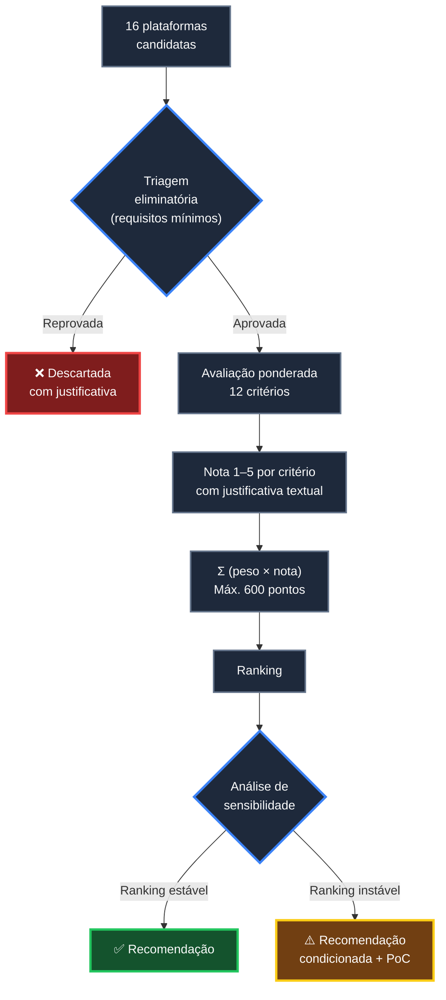
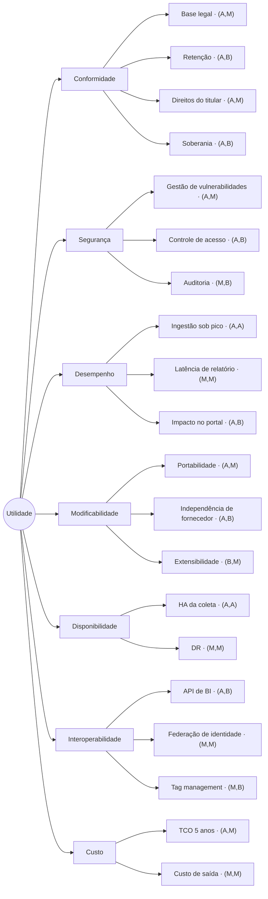
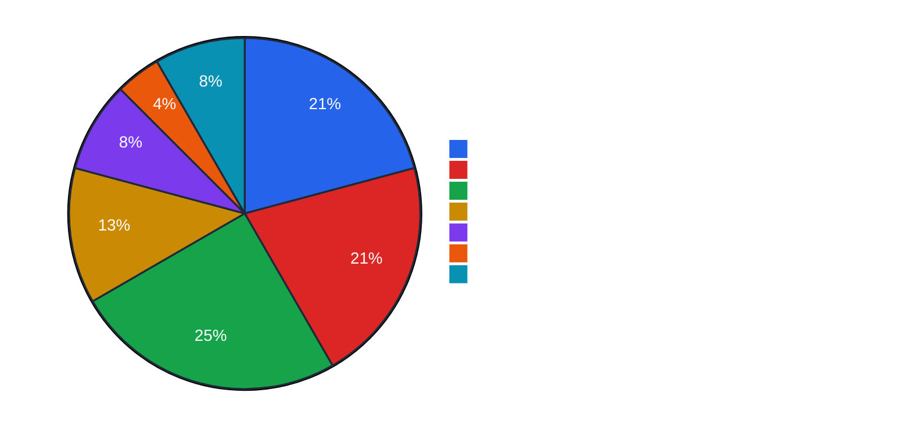

# 03 — Critérios de Avaliação

> **Método:** Gartner Decision Framework + ATAM Utility Tree + MAUT
> **Anterior:** [02 — Requisitos](02-requisitos.md) · **Próximo:** [04 — Panorama de mercado](04-mercado.md)

---

## Sumário

- [1. Modelo de avaliação](#1-modelo-de-avaliação)
- [2. Triagem eliminatória](#2-triagem-eliminatória)
- [3. Árvore de atributos de qualidade](#3-árvore-de-atributos-de-qualidade)
- [4. Critérios e pesos](#4-critérios-e-pesos)
- [5. Definição operacional de cada critério](#5-definição-operacional-de-cada-critério)
- [6. Fórmula de agregação](#6-fórmula-de-agregação)
- [7. Análise de sensibilidade](#7-análise-de-sensibilidade)
- [8. Limitações do método](#8-limitações-do-método)

---

## 1. Modelo de avaliação

O modelo é composto por **duas etapas sequenciais**: uma triagem eliminatória binária e uma avaliação ponderada contínua.

> **📌 Observação — Por que duas etapas**
> Um modelo puramente ponderado permite que uma plataforma compense uma falha legal grave com excelência técnica em outros critérios. Isso é inaceitável em contexto público: conformidade não é negociável contra desempenho. A triagem eliminatória impede essa compensação indevida — é a aplicação do conceito de *constraint* (restrição rígida) do TOGAF, distinto de *requirement* (requisito ponderável).

---

## 2. Triagem eliminatória

Uma plataforma é eliminada se **falhar em qualquer requisito Must have** de [`02-requisitos.md`](02-requisitos.md).

### 2.1 Critérios de eliminação aplicados

| # | Critério eliminatório | Requisito | Racional |
|---|----------------------|-----------|----------|
| E1 | Impossibilidade de operar como controlador com custódia definida | RL-01 | Órgão público não pode delegar controle sem instrumento jurídico adequado |
| E2 | Transferência internacional sem base legal viável | RL-02 | Art. 33 da LGPD |
| E3 | Impossibilidade de anonimizar IP | RL-03 | Princípio da necessidade |
| E4 | Impossibilidade de definir e aplicar retenção | RL-05 | Art. 15/16 da LGPD |
| E5 | Impossibilidade de exportar integralmente os dados | RG-03 | Lock-in inaceitável em ativo público |
| E6 | Vulnerabilidade crítica conhecida sem correção / projeto sem manutenção ativa | RNF-39, RNF-36 | Risco de segurança inaceitável |
| E7 | Ausência de API de leitura programática | RI-01 | Impede integração com BI (RN-04) |

### 2.2 Resultado da triagem

| Plataforma | E1 | E2 | E3 | E4 | E5 | E6 | E7 | Situação |
|-----------|:--:|:--:|:--:|:--:|:--:|:--:|:--:|----------|
| **Matomo On-Premise** | ✅ | ✅ | ✅ | ✅ | ✅ | ✅ | ✅ | **Aprovada** |
| **Matomo Cloud** | ✅ | ⚠️ | ✅ | ✅ | ✅ | ✅ | ✅ | **Aprovada com ressalva** |
| **Google Analytics 4** | ⚠️ | ⚠️ | ⚠️ | ⚠️ | ⚠️ | ✅ | ✅ | **Aprovada com ressalva grave** |
| **Plausible CE** | ✅ | ✅ | ✅ | ✅ | ✅ | ✅ | ✅ | **Aprovada** |
| **Umami** | ✅ | ✅ | ✅ | ✅ | ✅ | ✅ | ✅ | **Aprovada** |
| **Open Web Analytics** | ✅ | ✅ | ✅ | ✅ | ✅ | ❌ | ⚠️ | **Eliminada (E6)** |
| **Adobe Analytics** | ✅ | ⚠️ | ✅ | ✅ | ✅ | ✅ | ✅ | **Aprovada com ressalva** |
| **Simple Analytics** | ✅ | ✅ | ✅ | ⚠️ | ⚠️ | ✅ | ✅ | **Aprovada com ressalva** |
| **Microsoft Clarity** | ❌ | ⚠️ | ⚠️ | ❌ | ❌ | ✅ | ⚠️ | **Eliminada como plataforma primária (E1, E4, E5)** |
| **Cloudflare Web Analytics** | ⚠️ | ⚠️ | ✅ | ❌ | ⚠️ | ✅ | ✅ | **Eliminada como plataforma primária (E4)** |
| **PostHog auto-hospedado** | ✅ | ✅ | ✅ | ✅ | ✅ | ✅ | ✅ | **Aprovada** |
| **PostHog Cloud EU** | ✅ | ⚠️ | ✅ | ✅ | ✅ | ✅ | ✅ | **Aprovada com ressalva** |
| **Piwik PRO** | ✅ | ✅ | ✅ | ✅ | ✅ | ✅ | ✅ | **Aprovada** |

**Legenda:** ✅ atende · ⚠️ atende parcialmente ou com condições · ❌ não atende

> **📌 Observação — Tratamento das eliminadas**
> Plataformas eliminadas **permanecem no estudo e são pontuadas**, por duas razões: (a) transparência do processo decisório perante órgão de controle; (b) algumas eliminadas como *plataforma primária* permanecem viáveis como *complemento pontual* (caso do Microsoft Clarity para análise comportamental e do Cloudflare Web Analytics para métrica de borda). A eliminação restringe o papel, não apaga a análise.

### 2.3 Justificativa das eliminações

#### Open Web Analytics — eliminada por E6

> **🚨 Alerta**
> O OWA registra **CVE-2022-24637**, vulnerabilidade de execução remota de código na versão 1.7.3, com exploração pública documentada. A cadência de releases do projeto é esparsa e a base de mantenedores é reduzida. O cenário de qualidade **QA-05** ([02, seção 9](02-requisitos.md#qa-05--vulnerabilidade-crítica-divulgada)) exige correção de vulnerabilidade crítica em ≤ 15 dias — capacidade que o projeto não demonstra estruturalmente. Detalhamento em [`../plataformas/open-web-analytics.md`](../plataformas/open-web-analytics.md).

#### Microsoft Clarity — eliminada como plataforma primária por E1, E4, E5

- **E1:** o modelo de serviço não oferece instrumento contratual de operador nos termos da LGPD para órgão público brasileiro; o serviço é gratuito e regido por termos de uso unilaterais.
- **E4:** a retenção é definida unilateralmente pela Microsoft e não é configurável pelo cliente.
- **E5:** não há exportação integral dos dados; a API de exportação disponibiliza apenas janela recente e agregada.

**Papel residual admitido:** análise comportamental complementar (heatmap, session recording) em portais **sem tratamento de dado sensível**, mediante RIPD específico. Ver [`09-recomendacao.md`](09-recomendacao.md).

#### Cloudflare Web Analytics — eliminada como plataforma primária por E4

- **E4:** retenção fixa e curta, definida pelo fornecedor, sem controle do cliente.
- Adicionalmente, não atende RF-02 (eventos customizados), RF-26 (metas) nem RF-27 (funis), que são requisitos **Must have**.

**Papel residual admitido:** métrica de borda (RUM) complementar em domínios já servidos pela Cloudflare, sem custo adicional.

---

## 3. Árvore de atributos de qualidade

Estrutura ATAM: atributo de qualidade → refinamento → cenário → prioridade `(importância para o negócio, dificuldade técnica)`.

**Legenda de prioridade:** `(importância para o negócio, dificuldade técnica)` — A = Alta, M = Média, B = Baixa.

### 3.1 Pontos de sensibilidade e trade-off points

Terminologia ATAM:
- **Ponto de sensibilidade:** decisão que afeta fortemente **um** atributo de qualidade.
- **Trade-off point:** decisão que afeta **dois ou mais** atributos em direções opostas.
- **Risco:** decisão que ameaça um atributo prioritário.

| ID | Tipo | Decisão | Atributos afetados |
|----|------|---------|--------------------|
| **TP-01** | 🔀 Trade-off | Auto-hospedado vs. SaaS | ⬆️ Soberania, Independência, Custo de licença · ⬇️ Facilidade de operação, Disponibilidade fora da caixa |
| **TP-02** | 🔀 Trade-off | Banco relacional (MySQL) vs. colunar (ClickHouse) | ⬆️ Simplicidade operacional, Ecossistema de ferramentas · ⬇️ Desempenho analítico em alto volume |
| **TP-03** | 🔀 Trade-off | Coleta rica (identificação) vs. cookieless anônima | ⬆️ Capacidade analítica, Precisão · ⬇️ Conformidade, Simplicidade da base legal |
| **TP-04** | 🔀 Trade-off | Retenção longa de dado bruto vs. curta | ⬆️ Capacidade de reprocessamento e análise histórica · ⬇️ Conformidade, Custo de armazenamento, Desempenho |
| **TP-05** | 🔀 Trade-off | Ingestão síncrona vs. assíncrona (fila) | ⬆️ Simplicidade, Dado imediato · ⬇️ Resiliência a pico |
| **TP-06** | 🎯 Sensibilidade | Estratégia de arquivamento (cron vs. sob demanda) | Desempenho de relatório |
| **TP-07** | 🎯 Sensibilidade | Plugins pagos vs. escopo funcional reduzido | Custo, Capacidade analítica |
| **TP-08** | ⚠️ Risco | Dependência de um único mantenedor comercial em projeto "open source" | Independência, Continuidade |
| **TP-09** | 🔀 Trade-off | Instância única multi-site vs. instâncias por órgão | ⬆️ Economia de escala, Visão consolidada · ⬇️ Isolamento de falha, Segregação forte |
| **TP-10** | 🎯 Sensibilidade | Tracking client-side vs. server-side | Precisão (bloqueadores), Conformidade, Complexidade |

Análise completa dos trade-offs por plataforma: [`06-tradeoffs.md`](06-tradeoffs.md).

---

## 4. Critérios e pesos

### 4.1 Tabela de pesos

| # | Critério | Peso | % do total | Direcionador | Natureza |
|---|----------|-----:|-----------:|--------------|----------|
| C01 | **LGPD** | 15 | 12,5 % | D2 | Conformidade |
| C02 | **Controle dos dados** | 15 | 12,5 % | D1 | Governança |
| C03 | **TCO** | 15 | 12,5 % | D7 | Econômico |
| C04 | **Independência tecnológica** | 10 | 8,3 % | D3 | Governança |
| C05 | **Recursos analíticos** | 10 | 8,3 % | D5 | Funcional |
| C06 | **APIs** | 10 | 8,3 % | D6 | Técnico |
| C07 | **Integrações** | 10 | 8,3 % | D6 | Técnico |
| C08 | **Escalabilidade** | 10 | 8,3 % | D8 | Técnico |
| C09 | **Segurança** | 10 | 8,3 % | Transversal | Conformidade |
| C10 | **Operação** | 5 | 4,2 % | D4 | Operacional |
| C11 | **Comunidade** | 5 | 4,2 % | Transversal | Sustentabilidade |
| C12 | **Documentação** | 5 | 4,2 % | Transversal | Sustentabilidade |
| | **Total** | **120** | **100 %** | | |

### 4.2 Distribuição por natureza

### 4.3 Justificativa da atribuição de pesos

> **✅ Bloco de Decisão — Racional dos pesos**
>
> **Peso 15 (12,5 % cada) para LGPD, Controle dos dados e TCO.** Os três representam os riscos de maior severidade em contexto público: risco regulatório (sanção da ANPD de até R$ 50 milhões por infração, art. 52 da LGPD), risco de soberania (perda de controle sobre ativo público de dados) e risco econômico (comprometimento orçamentário plurianual, sujeito a fiscalização de órgão de controle). Nenhum outro critério tem consequência de severidade comparável.
>
> **Peso 10 (8,3 % cada) para os critérios técnicos e de governança de segundo nível.** Independência tecnológica, Recursos analíticos, APIs, Integrações, Escalabilidade e Segurança determinam a viabilidade técnica e a longevidade da solução, mas são endereçáveis por arquitetura complementar (por exemplo: escalabilidade insuficiente pode ser mitigada com fila e réplicas; integrações ausentes podem ser construídas sobre a API).
>
> **Peso 5 (4,2 % cada) para Operação, Comunidade e Documentação.** São critérios de custo de aprendizado e de sustentação, não de viabilidade. Uma documentação fraca aumenta o custo do projeto, mas não o inviabiliza; uma não conformidade com a LGPD, sim.
>
> **Por que Segurança tem peso 10 e não 15.** Segurança em plataforma auto-hospedado é substancialmente determinada pela **arquitetura de implantação do Estado** (WAF, segmentação de rede, hardening, gestão de patches), e não apenas pelo produto. O critério pontua a contribuição do produto para a postura de segurança — que é relevante, mas não é a variável dominante. A ausência de gestão de vulnerabilidades ativa, por outro lado, é tratada na **triagem eliminatória (E6)**, onde tem peso absoluto.

### 4.4 Pesos alternativos testados

Cenários de ponderação alternativa avaliados na análise de sensibilidade (seção 7):

| Cenário | Descrição | Ajuste de pesos |
|---------|-----------|-----------------|
| **Base** | Ponderação oficial deste estudo | Conforme tabela 4.1 |
| **Conformidade máxima** | Priorização absoluta de LGPD e soberania | LGPD 25, Controle 25, demais reduzidos proporcionalmente |
| **Econômico** | Priorização de custo | TCO 30, demais reduzidos proporcionalmente |
| **Capacidade analítica** | Priorização de funcionalidade | Recursos analíticos 25, APIs 15, Integrações 15 |
| **Operação enxuta** | Priorização de baixo esforço operacional | Operação 25, Escalabilidade 15, Documentação 10 |

---

## 5. Definição operacional de cada critério

Cada critério define **exatamente** o que caracteriza cada nota. Isso torna a avaliação reproduzível e auditável.

### C01 — LGPD (peso 15)

**O que mede:** grau de aderência estrutural da plataforma às exigências da Lei nº 13.709/2018.

**Sub-dimensões avaliadas:**
1. Necessidade de consentimento para operar (menor necessidade = melhor)
2. Existência de transferência internacional
3. Capacidade de anonimização nativa
4. Controle sobre política de retenção
5. Capacidade de atender direitos do titular
6. Existência de mecanismo de opt-out
7. Disponibilidade de instrumento contratual adequado (quando SaaS)

| Nota | Definição |
|:----:|-----------|
| **5** | Opera sem coleta de dado pessoal identificável (cookieless + IP anonimizado por padrão); nenhuma transferência internacional; retenção totalmente controlada pelo Estado; base legal dispensável ou trivialmente sustentável |
| **4** | Configurável para operar sem dado pessoal; nenhuma transferência internacional ou transferência dentro de jurisdição com nível adequado; retenção controlada; base legal de legítimo interesse sustentável com RIPD |
| **3** | Requer configuração não trivial para conformidade; transferência internacional presente mas com salvaguardas contratuais robustas; retenção controlada parcialmente |
| **2** | Coleta dado pessoal por padrão; transferência internacional para jurisdição com histórico de questionamento regulatório; requer consentimento explícito; retenção limitada pelo fornecedor |
| **1** | Estruturalmente incompatível com operação conforme por órgão público; sem instrumento contratual adequado; sem controle de retenção |

### C02 — Controle dos dados (peso 15)

**O que mede:** grau de custódia efetiva do Estado sobre o dado bruto.

**Sub-dimensões:** localização física do dado · titularidade jurídica · acesso direto ao armazenamento · capacidade de exportação integral · capacidade de eliminação verificável.

| Nota | Definição |
|:----:|-----------|
| **5** | Dado bruto em infraestrutura do Estado, com acesso direto ao banco (SQL); exportação e eliminação totais e verificáveis |
| **4** | Dado bruto em infraestrutura contratada pelo Estado com isolamento dedicado; acesso direto ao armazenamento contratualmente garantido |
| **3** | Dado em SaaS multi-tenant com exportação integral garantida do dado bruto |
| **2** | Dado em SaaS; exportação apenas de dado agregado ou com limitações relevantes |
| **1** | Dado sob custódia exclusiva do fornecedor; exportação parcial, tardia ou inexistente |

### C03 — TCO (peso 15)

**O que mede:** custo total de propriedade em horizonte de 5 anos, incluindo implantação, licenciamento, infraestrutura, equipe, operação, atualização e custo estimado de saída. Modelagem completa em [`../comparativos/custo.md`](../comparativos/custo.md).

| Nota | Definição (TCO 5 anos, cenário de referência de [01, seção 9](01-contexto.md#9-perfil-de-carga-e-dimensionamento)) |
|:----:|-----------|
| **5** | ≤ R$ 250 mil |
| **4** | R$ 250 mil – R$ 600 mil |
| **3** | R$ 600 mil – R$ 1,2 milhão |
| **2** | R$ 1,2 milhão – R$ 3 milhões |
| **1** | > R$ 3 milhões |

> **📌 Observação**
> O TCO considera o **custo de equipe** mesmo em soluções gratuitas. Software livre não é gratuito em TCO — desloca o custo de licença para custo de operação. Ignorar isso é o erro mais comum em comparativos de analytics.

### C04 — Independência tecnológica (peso 10)

**O que mede:** capacidade do Estado de continuar operando e de trocar de solução sem penalidade proibitiva.

| Nota | Definição |
|:----:|-----------|
| **5** | Licença livre (GPL/MIT/Apache/AGPL); código auditável; sem dependência de serviço do fornecedor para operar; schema aberto; múltiplas opções de hospedagem |
| **4** | Licença livre com governança concentrada em um mantenedor comercial, ou com funcionalidades relevantes em plugins/edição proprietária |
| **3** | Proprietária com padrões abertos de exportação e existência de alternativas de migração documentadas |
| **2** | Proprietária com forte acoplamento a ecossistema do fornecedor |
| **1** | Proprietária com acoplamento profundo, formatos fechados e custo de saída elevado |

### C05 — Recursos analíticos (peso 10)

**O que mede:** cobertura funcional frente aos requisitos RF-01 a RF-45.

Método: percentual de requisitos funcionais atendidos, ponderado por prioridade MoSCoW (M = 3, S = 2, C = 1).

| Nota | Cobertura ponderada dos RF |
|:----:|---------------------------|
| **5** | ≥ 90 % |
| **4** | 75 % – 89 % |
| **3** | 55 % – 74 % |
| **2** | 35 % – 54 % |
| **1** | < 35 % |

### C06 — APIs (peso 10)

**O que mede:** qualidade, completude e usabilidade da superfície programática. Detalhamento em [`../comparativos/api.md`](../comparativos/api.md).

**Sub-dimensões:** API de leitura · API de escrita/importação · formatos de saída · autenticação · rate limits · versionamento · SDKs oficiais · webhooks · acesso a dado bruto.

| Nota | Definição |
|:----:|-----------|
| **5** | API completa de leitura e escrita, múltiplos formatos, autenticação robusta, versionada, SDKs oficiais em várias linguagens, webhooks, acesso a dado bruto |
| **4** | API completa de leitura, boa cobertura de escrita, formatos múltiplos, versionada, SDKs oficiais ou comunitários maduros |
| **3** | API de leitura funcional, cobertura parcial de escrita, formatos limitados, sem SDK oficial |
| **2** | API restrita (endpoints, janela temporal ou volume limitados) |
| **1** | Sem API ou API não utilizável para integração de BI |

### C07 — Integrações (peso 10)

**O que mede:** integração com o ecossistema de ferramentas do Estado — BI, identidade, tag management, consent management.

| Nota | Definição |
|:----:|-----------|
| **5** | Conectores nativos ou oficiais para as principais ferramentas de BI, federação de identidade (SAML/OIDC), tag manager próprio e integração com GTM, integração com CMP |
| **4** | Boa cobertura, com pelo menos uma lacuna relevante (ex.: sem SAML, ou sem conector nativo de BI) |
| **3** | Integração viável via API, sem conectores prontos; federação de identidade limitada ou via plugin |
| **2** | Integração exige desenvolvimento significativo; sem federação de identidade |
| **1** | Integração inviável ou muito limitada |

### C08 — Escalabilidade (peso 10)

**O que mede:** capacidade de crescer em volume sem redesenho arquitetural. Detalhamento em [`../comparativos/escalabilidade.md`](../comparativos/escalabilidade.md).

| Nota | Definição |
|:----:|-----------|
| **5** | Escala horizontal comprovada em ordens de grandeza superiores ao cenário de pico; arquitetura distribuída nativa; sem gargalo estrutural conhecido |
| **4** | Escala horizontal documentada e suficiente para o cenário de pico com margem; gargalos conhecidos mas contornáveis |
| **3** | Escala vertical + horizontal parcial; atende o cenário de referência; exige tuning ativo no cenário de pico |
| **2** | Escala limitada; atende o cenário conservador; degradação previsível acima disso |
| **1** | Sem estratégia de escala documentada; gargalo estrutural sem contorno |

### C09 — Segurança (peso 10)

**O que mede:** contribuição do produto para a postura de segurança.

**Sub-dimensões:** histórico e cadência de correções · processo de divulgação de vulnerabilidades · MFA · RBAC · auditoria · criptografia · certificações de terceiro (quando SaaS).

| Nota | Definição |
|:----:|-----------|
| **5** | Certificações independentes (ISO 27001, SOC 2 Type II); SDLC seguro documentado; MFA e RBAC granulares; auditoria completa; sem CVE crítica em aberto |
| **4** | Gestão de vulnerabilidades ativa e responsiva; MFA e RBAC presentes; auditoria adequada; sem certificação de terceiro (típico de auto-hospedado) |
| **3** | Gestão de vulnerabilidades presente mas com cadência irregular; controles de acesso básicos |
| **2** | Gestão de vulnerabilidades fraca; controles limitados; histórico de CVEs relevantes |
| **1** | Sem processo de segurança demonstrável; CVE crítica em aberto |

### C10 — Operação (peso 5)

**O que mede:** esforço para implantar, operar, atualizar e sustentar.

| Nota | Definição |
|:----:|-----------|
| **5** | SaaS gerenciado — esforço operacional próximo de zero |
| **4** | Auto-hospedado de operação simples (stack única, containerizado, atualização trivial) ou SaaS com administração leve |
| **3** | Auto-hospedado de complexidade moderada (2–3 componentes, cron, tuning periódico) |
| **2** | Auto-hospedado complexo (4+ componentes, dependências de streaming/storage, tuning frequente) |
| **1** | Operação exige equipe dedicada especializada; sem suporte oficial para a modalidade |

### C11 — Comunidade (peso 5)

**O que mede:** vitalidade do ecossistema e probabilidade de continuidade.

**Sub-dimensões:** número de contribuidores · cadência de commits e releases · atividade em fóruns · base instalada · adoção institucional documentada · viabilidade financeira do mantenedor.

| Nota | Definição |
|:----:|-----------|
| **5** | Comunidade muito grande e diversa; adoção massiva; múltiplos fornecedores de suporte |
| **4** | Comunidade grande e ativa; releases regulares; adoção institucional documentada |
| **3** | Comunidade moderada; releases regulares; base instalada relevante mas concentrada |
| **2** | Comunidade pequena; dependência de poucos mantenedores |
| **1** | Comunidade inativa ou projeto em manutenção mínima |

### C12 — Documentação (peso 5)

**O que mede:** qualidade, completude e atualidade da documentação oficial.

| Nota | Definição |
|:----:|-----------|
| **5** | Documentação completa, atualizada, com referência de API, guias de implantação, exemplos executáveis, guias de migração e traduções |
| **4** | Documentação completa e atualizada, com lacunas pontuais |
| **3** | Documentação suficiente para operar, mas incompleta em tópicos avançados |
| **2** | Documentação esparsa; dependência de fóruns e código-fonte |
| **1** | Documentação ausente, desatualizada ou incorreta |

---

## 6. Fórmula de agregação

### 6.1 Pontuação ponderada

$$
S_p = \sum_{i=1}^{12} w_i \cdot n_{p,i}
$$

Onde:
- $S_p$ = pontuação da plataforma $p$
- $w_i$ = peso do critério $i$
- $n_{p,i}$ = nota (1 a 5) da plataforma $p$ no critério $i$

**Máximo teórico:** $S_{max} = 5 \times \sum w_i = 5 \times 120 = 600$

### 6.2 Pontuação normalizada

$$
S_p^{norm} = \frac{S_p}{600} \times 100 \%
$$

### 6.3 Bandas de interpretação

| Faixa | Classificação | Interpretação |
|-------|--------------|---------------|
| ≥ 80 % | 🟢 **Recomendada** | Adequada como plataforma padrão |
| 70 % – 79 % | 🟡 **Viável** | Adequada, com mitigações documentadas |
| 60 % – 69 % | 🟠 **Condicionada** | Adotável apenas em nicho específico com justificativa |
| < 60 % | 🔴 **Não recomendada** | Inadequada como plataforma padrão |

### 6.4 Regra de desempate

Em caso de empate na pontuação total, aplicar sequencialmente:

1. Maior nota em **C01 — LGPD**
2. Maior nota em **C02 — Controle dos dados**
3. Menor **TCO absoluto** (valor, não nota)
4. Maior nota em **C04 — Independência tecnológica**

---

## 7. Análise de sensibilidade

A análise de sensibilidade testa se o ranking é robusto a variações razoáveis nos pesos. Um ranking que se inverte com pequena mudança de peso indica decisão frágil.

### 7.1 Método

1. Recalcular a pontuação de todas as plataformas sob cada cenário alternativo de peso (seção 4.4);
2. Verificar se a plataforma líder muda;
3. Calcular o **ponto de virada** (*breakeven*): quanto um peso precisa mudar para alterar o líder.

### 7.2 Critério de robustez

> **✅ Bloco de Decisão — Critério de aceitação da recomendação**
>
> A recomendação é considerada **robusta** se a plataforma líder permanecer líder em pelo menos **4 dos 5 cenários** de ponderação testados.
>
> Se a liderança mudar em 2 ou mais cenários, a recomendação passa a ser **condicionada**, exigindo prova de conceito comparativa antes da decisão definitiva.

Os resultados da análise de sensibilidade estão em [`07-matriz-decisao.md`](07-matriz-decisao.md), seção 5.

---

## 8. Limitações do método

Declaração explícita das limitações, requisito de honestidade metodológica em avaliação arquitetural.

| # | Limitação | Impacto | Mitigação adotada |
|---|-----------|---------|-------------------|
| L1 | As notas envolvem julgamento técnico e não são medidas puramente objetivas | Subjetividade residual | Definição operacional detalhada de cada nota (seção 5) + justificativa textual obrigatória por nota |
| L2 | A soma ponderada permite compensação entre critérios | Excelência em um critério mascara deficiência em outro | Triagem eliminatória prévia (seção 2) impede compensação de falhas críticas |
| L3 | Pesos refletem prioridades institucionais, que podem mudar | Ranking pode não refletir prioridade futura | Análise de sensibilidade (seção 7) + revisão de 24 meses |
| L4 | Dados de fornecedores proprietários são parcialmente autodeclarados | Possível superestimação de capacidades | Priorização de fonte primária; rotulagem explícita de informação não verificável |
| L5 | Benchmarks de desempenho não foram executados em ambiente do Estado | Números de escalabilidade são estimativas | PoC prevista no roadmap ([10](10-roadmap.md), Onda 1) |
| L6 | Preços enterprise não são públicos | TCO de Adobe e GA360 é estimativa | Faixa larga adotada; rotulada como estimativa; recomendação de cotação formal |
| L7 | A escala 1–5 é grosseira; diferenças finas se perdem | Empates artificiais | Regra de desempate (seção 6.4) |
| L8 | O estudo avalia produtos, não implementações | Uma implantação ruim de plataforma boa produz resultado ruim | Arquitetura de referência prescrita em [`09-recomendacao.md`](09-recomendacao.md) |

---

## Navegação

| ⬅️ Anterior | ➡️ Próximo |
|------------|-----------|
| [02 — Requisitos](02-requisitos.md) | [04 — Panorama de mercado](04-mercado.md) |
