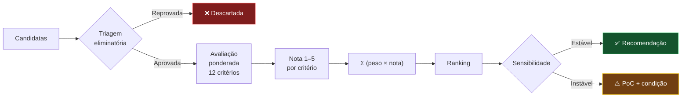

# 03 — Critérios de Avaliação

> **Método:** Gartner Decision Framework + ATAM Utility Tree + MAUT
> **Anterior:** [02 — Requisitos](02-requisitos.md) · **Próximo:** [04 — Panorama de mercado](04-mercado.md)

> **📌 Revisão 2026**
> C03 (TCO) rebaixado a **peso 0**, informativo. Racional: sob P1/P2/R4 ([`01-contexto.md`](01-contexto.md#7-premissas-e-restrições)), a infra on-premise absorve o custo marginal — TCO deixa de filtrar decisão. Os 15 pontos foram redistribuídos entre C05, C06, C08, C09, C10, C11. TCO continua modelado em `anexos/historico/comparativos/custo.md` para dimensionamento de infra e prestação de contas ao TCE-MS. Histórico do ADR-001 em `anexos/historico/`.

---

## Sumário

- [1. Modelo](#1-modelo)
- [2. Triagem eliminatória](#2-triagem-eliminatória)
- [3. Trade-off points](#3-trade-off-points)
- [4. Critérios e pesos](#4-critérios-e-pesos)
- [5. Definição operacional](#5-definição-operacional)
- [6. Fórmula de agregação](#6-fórmula-de-agregação)
- [7. Análise de sensibilidade](#7-análise-de-sensibilidade)
- [8. Limitações](#8-limitações)

---

## 1. Modelo

Duas etapas sequenciais.

> **📌 Por que duas etapas**
> Modelo puramente ponderado permite que excelência técnica compense falha legal. Inaceitável em contexto público. Triagem eliminatória bloqueia essa compensação — aplica *constraint* do TOGAF (limite rígido), distinto de *requirement* (ponderável).

---

## 2. Triagem eliminatória

Falha em qualquer *Must have* de [`02-requisitos.md`](02-requisitos.md) elimina.

### 2.1 Critérios de eliminação

| # | Critério | Requisito | Racional |
|---|----------|-----------|----------|
| E1 | Não pode operar como controlador com custódia definida | RL-01 | Delegação sem instrumento jurídico |
| E2 | Transferência internacional sem base legal viável | RL-02 | Art. 33 LGPD |
| E3 | Não anonimiza IP | RL-03 | Necessidade |
| E4 | Não define/aplica retenção | RL-05 | Arts. 15/16 |
| E5 | Não exporta integralmente | RG-03 | Lock-in inaceitável |
| E6 | CVE crítica em aberto / projeto sem manutenção | RNF-39, RNF-36 | Segurança |
| E7 | Sem API de leitura | RI-01 | Impede BI |

### 2.2 Resultado (escopo enxugado — só on-prem grátis)

| Plataforma | E1 | E2 | E3 | E4 | E5 | E6 | E7 | Situação |
|-----------|:--:|:--:|:--:|:--:|:--:|:--:|:--:|----------|
| **Matomo On-Premise** | ✅ | ✅ | ✅ | ✅ | ✅ | ✅ | ✅ | **Aprovada** |
| **PostHog auto-hospedado** | ✅ | ✅ | ✅ | ✅ | ✅ | ✅ | ✅ | **Aprovada** |
| **Plausible CE** | ✅ | ✅ | ✅ | ✅ | ✅ | ✅ | ✅ | **Aprovada** |
| **Umami** | ✅ | ✅ | ✅ | ✅ | ✅ | ✅ | ✅ | **Aprovada** |

**Plataformas fora do escopo (arquivadas em `anexos/historico/plataformas-descartadas/`):** GA4, Adobe Analytics, Microsoft Clarity, Cloudflare Web Analytics, Simple Analytics, Open Web Analytics. Motivos: SaaS proprietário (fora do escopo on-prem grátis) ou eliminado por E4/E6 (OWA — CVE-2022-24637 sem correção; Clarity — retenção definida unilateralmente pela MS; Cloudflare — retenção fixa curta). Ver histórico para análise completa.

---

## 3. Trade-off points

Terminologia ATAM: sensibilidade (afeta 1 atributo), trade-off (afeta 2+ em direções opostas), risco (ameaça atributo prioritário).

| ID | Tipo | Decisão | Atributos afetados |
|----|------|---------|--------------------|
| TP-01 | 🔀 Trade-off | Auto-hospedado vs. SaaS | ⬆️ Soberania, Independência · ⬇️ Facilidade operacional |
| TP-02 | 🔀 Trade-off | Banco relacional vs. colunar (ClickHouse) | ⬆️ Simplicidade · ⬇️ Desempenho analítico em alto volume |
| TP-03 | 🔀 Trade-off | Coleta rica (identificação) vs. cookieless | ⬆️ Analítica · ⬇️ Conformidade |
| TP-04 | 🔀 Trade-off | Retenção longa vs. curta | ⬆️ Análise histórica · ⬇️ Conformidade, custo |
| TP-05 | 🔀 Trade-off | Ingestão síncrona vs. assíncrona (fila) | ⬆️ Simplicidade · ⬇️ Resiliência a pico |
| TP-06 | 🎯 Sensibilidade | Arquivamento (cron vs. sob demanda) | Desempenho relatório |
| TP-07 | 🎯 Sensibilidade | Plugins pagos vs. escopo funcional | Custo, cobertura |
| TP-08 | ⚠️ Risco | Um mantenedor comercial em projeto "open source" | Independência, continuidade |
| TP-09 | 🔀 Trade-off | Instância única vs. por órgão | ⬆️ Escala, visão consolidada · ⬇️ Isolamento |
| TP-10 | 🎯 Sensibilidade | Tracking client-side vs. server-side | Precisão, conformidade, complexidade |

Análise por plataforma: [`05-matriz.md`](05-matriz.md).

---

## 4. Critérios e pesos

| # | Critério | Peso | % | Direcionador | Natureza |
|---|----------|-----:|--:|--------------|----------|
| C01 | LGPD | 15 | 12,5 | D2 | Conformidade |
| C02 | Controle dos dados | 15 | 12,5 | D1 | Governança |
| C03 | TCO *(informativo, peso 0)* | 0 | 0,0 | D7 | Econômico |
| C04 | Independência tecnológica | 10 | 8,3 | D3 | Governança |
| C05 | Recursos analíticos | 13 | 10,8 | D5 | Funcional |
| C06 | APIs | 13 | 10,8 | D6 | Técnico |
| C07 | Integrações | 10 | 8,3 | D6 | Técnico |
| C08 | Escalabilidade | 13 | 10,8 | D8 | Técnico |
| C09 | Segurança | 12 | 10,0 | Transversal | Conformidade |
| C10 | Operação | 7 | 5,8 | D4 | Operacional |
| C11 | Comunidade | 7 | 5,8 | Transversal | Sustentabilidade |
| C12 | Documentação | 5 | 4,2 | Transversal | Sustentabilidade |
| | **Total** | **120** | 100 | | |

> **✅ Racional dos pesos (revisão 2026)**
>
> - **15 em LGPD e Controle dos dados**: risco regulatório (multa ANPD até R$ 50M, art. 52) e risco de soberania. Nenhum outro critério com severidade comparável.
> - **13 em Analíticos, APIs e Escalabilidade** (era 10): on-prem consolidado desloca o valor real para capacidade técnica/funcional. Escala sobe pra acomodar Xvia.
> - **12 em Segurança** (era 10): on-prem concentra responsabilidade no Estado.
> - **10 em Independência e Integrações**: longevidade + interoperabilidade.
> - **7 em Operação e Comunidade** (era 5): coexistência Matomo+PostHog no Xvia aumenta a complexidade operacional; comunidade importa mais sem contrato comercial.
> - **5 em Documentação**: custo de aprendizado, importante mas não decisor.
> - **0 em TCO**: rebaixado — infra do Estado absorve. Mantido na tabela para rastreabilidade e no `anexos/historico/comparativos/custo.md` para dimensionamento.
>
> **Por que Segurança tem 12 e não 15**: postura de segurança on-prem é majoritariamente da arquitetura do Estado (WAF, segmentação, hardening), não do produto. Produto contribui — não domina. Falha estrutural do produto é filtrada pela triagem E6 com peso absoluto.

### 4.1 Cenários de sensibilidade

| Cenário | Ajuste |
|---------|--------|
| **Base** | Pesos oficiais acima |
| Conformidade máxima | LGPD 25, Controle 25, demais reduzidos proporcionalmente |
| Capacidade analítica | Analíticos 25, APIs 15, Integrações 15 |
| Operação enxuta | Operação 25, Escalabilidade 15, Documentação 10 |
| Custo pleno (referência histórica) | TCO 15 (peso ADR-001); C05, C06, C08 voltam a 10; C09 a 10; C10 e C11 a 5 |

Cenário "Custo pleno" existe para auditar a mudança de peso, não é candidato à decisão.

---

## 5. Definição operacional

Cada critério define notas 1 e 5 explicitamente. Notas 2–4 se interpretam por gradação.

### C01 — LGPD (15)

Aderência estrutural à LGPD. Sub-dimensões: consentimento necessário, transferência internacional, anonimização nativa, retenção configurável, direitos do titular, opt-out, instrumento contratual (SaaS).

- **5**: opera sem dado pessoal identificável (cookieless + IP anonimizado por padrão); sem transferência; retenção 100% do Estado; base legal dispensável.
- **1**: incompatível com órgão público; sem instrumento contratual; sem controle de retenção.

### C02 — Controle dos dados (15)

Custódia efetiva sobre o dado bruto. Sub-dimensões: localização física, titularidade, acesso ao armazenamento, exportação integral, eliminação verificável.

- **5**: dado bruto na infra do Estado, acesso SQL direto, exportação e eliminação totais verificáveis.
- **1**: dado sob custódia exclusiva do fornecedor; exportação parcial ou inexistente.

### C03 — TCO (0, informativo)

TCO 5 anos em regime de **custo marginal para o Estado** (P1/P2/R4). Rubricas de infra compartilhada e operação de kernel já absorvidas pelo contrato — TCO reportado inclui apenas incremento sobre o baseline. Modelagem completa em `anexos/historico/comparativos/custo.md`.

- **5**: ≤ R$ 250 mil
- **4**: R$ 250 mil – R$ 600 mil
- **3**: R$ 600 mil – R$ 1,2 milhão
- **2**: R$ 1,2M – R$ 3M
- **1**: > R$ 3M

> **📌 SaaS estrangeiras não têm rubrica absorvível** — custo delas é integralmente incremental. Assimetria intencional, reflete a realidade contratual.

### C04 — Independência tecnológica (10)

- **5**: licença livre (GPL/MIT/Apache/AGPL); código auditável; sem dependência de serviço do fornecedor; schema aberto; múltiplas opções de hospedagem.
- **1**: proprietária, acoplamento profundo, formatos fechados, custo de saída elevado.

### C05 — Recursos analíticos (13)

Cobertura funcional de RF-01 a RF-45, ponderada por MoSCoW (M=3, S=2, C=1).

- **5**: ≥ 90 %
- **4**: 75–89 %
- **3**: 55–74 %
- **2**: 35–54 %
- **1**: < 35 %

### C06 — APIs (13)

Qualidade da superfície programática. Sub-dimensões: leitura, escrita/importação, formatos, autenticação, rate limits, versionamento, SDKs, webhooks, acesso ao bruto.

- **5**: API completa leitura+escrita, múltiplos formatos, versionada, SDKs oficiais, webhooks, acesso ao bruto.
- **1**: sem API utilizável para BI.

### C07 — Integrações (10)

Ecossistema do Estado: BI, IdP, tag manager, CMP.

- **5**: conectores nativos para BI, SAML/OIDC, tag manager próprio + GTM, CMP.
- **1**: integração inviável.

### C08 — Escalabilidade (13)

- **5**: escala horizontal comprovada acima do cenário de pico; arquitetura distribuída nativa.
- **1**: sem estratégia; gargalo estrutural sem contorno.

### C09 — Segurança (12)

- **5**: certificações independentes (ISO 27001, SOC 2 Type II); SDLC seguro; MFA+RBAC granular; auditoria completa; sem CVE crítica.
- **1**: sem processo demonstrável; CVE crítica em aberto.

### C10 — Operação (7)

- **5**: SaaS gerenciado — esforço zero.
- **4**: auto-hospedado simples (stack única, container, update trivial).
- **3**: 2–3 componentes, cron, tuning periódico.
- **2**: 4+ componentes, streaming/storage, tuning frequente.
- **1**: equipe dedicada especializada.

### C11 — Comunidade (7)

- **5**: comunidade muito grande e diversa; adoção massiva; múltiplos fornecedores de suporte.
- **1**: comunidade inativa ou projeto em manutenção mínima.

### C12 — Documentação (5)

- **5**: completa, atualizada, referência de API, guias, exemplos executáveis, traduções.
- **1**: ausente, desatualizada ou incorreta.

---

## 6. Fórmula de agregação

$$
S_p = \sum_{i=1}^{12} w_i \cdot n_{p,i} \qquad S_p^{norm} = \frac{S_p}{600} \times 100\%
$$

**Máximo teórico:** 5 × 120 = **600**.

**Bandas:** ≥80 % 🟢 Recomendada · 70–79 % 🟡 Viável · 60–69 % 🟠 Condicionada · <60 % 🔴 Não recomendada.

**Desempate:** (1) LGPD → (2) Controle dos dados → (3) Independência → (4) Segurança.

---

## 7. Análise de sensibilidade

Testa se o ranking é robusto a variações razoáveis de peso.

**Critério de robustez:** recomendação é **robusta** se o líder permanecer líder em pelo menos **4 dos 5 cenários**. Se muda em 2+, recomendação passa a **condicionada** — exige PoC comparativa.

Resultados em [`05-matriz.md`](05-matriz.md).

---

## 8. Limitações

| # | Limitação | Mitigação |
|---|-----------|-----------|
| L1 | Julgamento técnico envolve subjetividade | Definição operacional detalhada + justificativa por nota |
| L2 | Soma ponderada permite compensação | Triagem eliminatória bloqueia falha crítica |
| L3 | Pesos podem mudar no tempo | Sensibilidade + revisão 24 meses |
| L4 | Dados de proprietárias são autodeclarados | Fonte primária + rótulo explícito de não verificável |
| L5 | Benchmark não executado em ambiente do Estado | PoC prevista em [`08-roadmap.md`](08-roadmap.md) Onda 1 |
| L6 | Escala 1–5 é grosseira | Desempate |
| L7 | Estudo avalia produto, não implementação | Arquitetura de referência em [`07-recomendacao.md`](07-recomendacao.md) |

---

## Navegação

| ⬅️ Anterior | ➡️ Próximo |
|------------|-----------|
| [02 — Requisitos](02-requisitos.md) | [04 — Panorama de mercado](04-mercado.md) |
