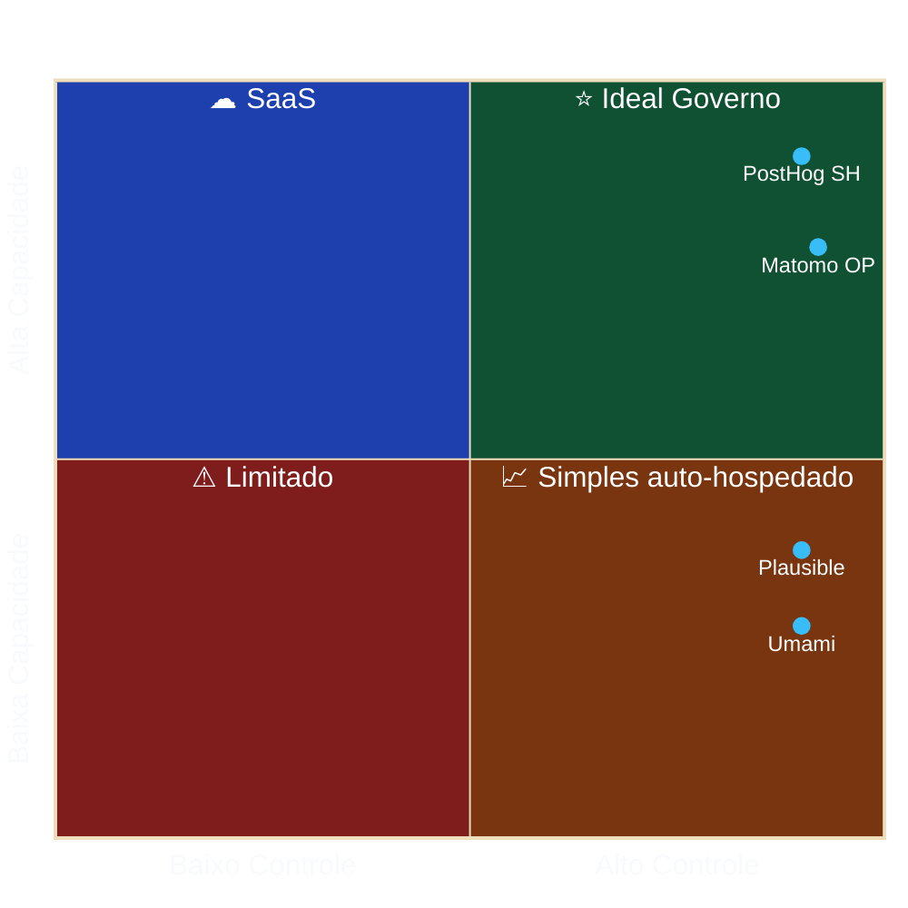

# 04 — Panorama de Mercado

> **Anterior:** [03 — Critérios](03-criterios.md) · **Próximo:** [05 — Matriz de decisão](05-matriz.md)

## Sumário

- [1. Segmentação do mercado](#1-segmentação-do-mercado)
- [2. Quadrante controle × capacidade](#2-quadrante-controle--capacidade)
- [3. Plataformas no escopo](#3-plataformas-no-escopo)
- [4. Plataformas fora do escopo](#4-plataformas-fora-do-escopo)
- [5. Adoção no setor público](#5-adoção-no-setor-público)
- [6. Tendências relevantes](#6-tendências-relevantes)
- [7. Viabilidade dos fornecedores](#7-viabilidade-dos-fornecedores)

---

## 1. Segmentação do mercado

Mercado não é homogêneo. Comparar Clarity com Adobe é comparar produtos que resolvem problemas diferentes. Segmentação é pré-requisito para comparação honesta.

| Segmento | Problema | Métrica central | Plataformas de referência |
|----------|----------|-----------------|---------------------------|
| Web Analytics tradicional | Quem acessa, de onde, o quê | Sessão / visita | **Matomo**, Piwik PRO, GA4 |
| Privacy-first | Métrica agregada sem dado pessoal | Page view agregado | **Plausible**, **Umami**, Simple, Cloudflare |
| Product analytics | Comportamento em produto digital | Evento / usuário | **PostHog**, Amplitude, Mixpanel |
| Behavioral / experience | Por que o usuário fez o que fez | Sessão gravada | Clarity, Hotjar, FullStory |
| Behavioral data pipeline | Coletar e entregar bruto ao DW | Evento bruto | Snowplow, Segment |

**Escopo deste estudo:** só quatro plataformas em negrito acima — cobertura dos três segmentos que importam ao Estado (WA tradicional, privacy-first, product analytics). Os demais segmentos estão representados por plataformas comparáveis nas fichas ou saíram por inadequação (ver §4).

---

## 2. Quadrante controle × capacidade

Quadrante superior direito (ideal setor público) tem só Matomo OP e PostHog SH. Plausible e Umami ficam no quadrante inferior direito (simples e soberanos, capacidade menor). Antecipa e é consistente com o resultado da matriz.

---

## 3. Plataformas no escopo

| # | Plataforma | Origem | Ano | Licença | Segmento | Ficha |
|---|-----------|--------|-----|---------|----------|-------|
| 1 | **Matomo** | Nova Zelândia / Alemanha | 2007 | GPL v3 | WA tradicional | [📄](../plataformas/matomo.md) |
| 2 | **PostHog** | EUA / Reino Unido | 2020 | MIT (core) + EE proprietária | Product analytics | [📄](../plataformas/posthog.md) |
| 3 | **Plausible** | Estônia | 2019 | AGPL v3 (CE) | Privacy-first | [📄](../plataformas/plausible.md) |
| 4 | **Umami** | EUA | 2020 | MIT | Privacy-first | [📄](../plataformas/umami.md) |

---

## 4. Plataformas fora do escopo

Descartadas no início deste ciclo por escopo (on-prem grátis) ou triagem eliminatória. Análise completa preservada em `anexos/historico/plataformas-descartadas/`.

| Plataforma | Motivo do descarte |
|-----------|-------------------|
| Google Analytics 4 | SaaS proprietário; transferência internacional; sem controle do bruto; precedente UA→GA4 |
| Adobe Analytics | SaaS proprietário; custo enterprise |
| Piwik PRO | Proprietária (fere RG-01); custo relevante — mantida como plano B se P2 falhar |
| Simple Analytics | SaaS estrangeiro; sem auto-hospedado |
| Microsoft Clarity | E1, E4, E5 — sem instrumento contratual gov; retenção unilateral; sem export integral |
| Cloudflare Web Analytics | E4; sem eventos customizados, metas nem funis |
| Open Web Analytics | E6 — CVE-2022-24637 RCE sem correção; projeto sem manutenção |
| Fathom, GoatCounter, Pirsch, Shynet, Ackee, TelemetryDeck | Sobreposição com Plausible/Umami; comunidade menor |
| Amplitude, Mixpanel, Heap | Sem auto-hospedado — PostHog cobre segmento |
| Hotjar, FullStory, Contentsquare | Behavioral; Clarity representava — fora do escopo agora |
| Snowplow, RudderStack, Segment | Data pipeline (segmento distinto); Snowplow relicenciado em 2024 |
| Countly | Community edition descontinuada |
| AWStats, Webalizer | Superadas; sem eventos, sem API moderna |
| Yandex Metrica, Baidu Tongji | Risco geopolítico incompatível com RL-02 |

---

## 5. Adoção no setor público

Evidência de adoção institucional — indicador de maturidade e aceitação regulatória.

| Instituição | Plataforma | Observação |
|------------|-----------|------------|
| Comissão Europeia — Europa Analytics | Matomo | Serviço oficial de analytics dos sítios da CE |
| CNIL (França) | Matomo | Configuração específica reconhecida como isenta de consentimento |
| Setor público alemão | Matomo | Recomendação recorrente em guias RGPD |
| Setor público francês | Matomo | Catálogo de software livre da administração pública |
| Diversos municípios europeus | Matomo, Plausible | Migração pós-decisões de DPAs de 2022 |

> **🔍 Precedente CNIL**
> A CNIL mantém publicação sobre configuração de medição de audiência isenta de consentimento (*exemption de consentement*). Matomo, em configuração específica (sem cookie persistente, IP anonimizado, sem cruzamento com outros tratamentos), é reconhecido nessa categoria.
>
> **Relevância BR:** não vinculante, mas **precedente auditado por autoridade de proteção de dados**, aplicável por analogia perante a ANPD. Ver [`99-referencias.md`](99-referencias.md).

**Movimento pós-2022:** após DPAs de Áustria, França, Itália e Dinamarca declararem uso do GA incompatível com RGPD, setor público europeu migrou para alternativas auto-hospedadas — predominantemente Matomo.

> **📌 Aplicabilidade ao Brasil**
> ANPD **não emitiu** manifestação específica sobre analytics estrangeiras. Ausência ≠ autorização. LGPD tem estrutura análoga ao RGPD em transferência internacional (arts. 33–36). Raciocínio das DPAs europeias é **tecnicamente transponível**. Órgão que adote hoje plataforma já questionada sob norma análoga assume risco antecipável — agrava responsabilidade em eventual fiscalização.

---

## 6. Tendências relevantes

| Tendência | Impacto | Horizonte |
|-----------|---------|-----------|
| Server-side tracking | Aumenta precisão e controle; aumenta complexidade | Consolidada |
| Cookieless por padrão | Reduz atrito regulatório; reduz precisão de recorrente | Consolidada |
| Convergência (WA + product + replay) | Menos ferramentas; mais lock-in | Em curso |
| Bancos colunares (ClickHouse) | Melhor desempenho analítico; mais complexidade | Consolidada |
| IA generativa em analytics | Nova superfície de tratamento — exige avaliação de conformidade | Emergente |
| Warehouse-first | Dado bruto no DW; analytics como visualização | Em curso |
| Endurecimento de transferência internacional | Favorece soluções soberanas | Consolidada |

> **⚠️ IA generativa em analytics**
> Camadas de IA processam dados coletados na infra do fornecedor. Para órgão público, pode configurar **novo tratamento com nova finalidade** — exige avaliação de base legal própria, mesmo quando a plataforma principal já foi avaliada. **Mitigação:** capacidade de desabilitar IA que implique processamento externo; cláusula contratual específica.

---

## 7. Viabilidade dos fornecedores

Componente Gartner: não só produto, mas probabilidade do fornecedor existir ao longo do ciclo de vida do sistema.

| Plataforma | Mantenedor | Receita | Descontinuidade | Relicenciamento | Mitigação |
|-----------|-----------|---------|:---------------:|:---------------:|-----------|
| **Matomo** | InnoCraft (NZ) + comunidade | Cloud + plugins premium + Enterprise | 🟢 Baixo | 🟢 Baixo (GPL v3, contribuidores diversos) | Código GPL, fork viável, direito perpétuo |
| **PostHog** | PostHog Inc. | Cloud + Enterprise | 🟢 Baixo (bem capitalizada) | 🟡 Médio (**já concretizado**: suporte a self-host K8s descontinuado em 2023) | MIT sobre core; self-host sem suporte |
| **Plausible** | Plausible Insights OÜ (EE) | SaaS | 🟡 Médio (empresa pequena) | 🟡 Médio (AGPL, mantenedor único) | AGPL garante direito perpétuo |
| **Umami** | Umami Software Inc. | Cloud | 🟡 Médio | 🟡 Médio (MIT permite fechar versões futuras) | MIT garante direito perpétuo |

> **🚨 PostHog e o risco TP-08 concretizado**
> Em 2023 a PostHog descontinuou suporte a implantação auto-hospedada gerenciada (Kubernetes/Helm), mantendo só `docker-compose` explicitamente rotulada como não suportada. Trata-se de caso em que TP-08 (mantenedor comercial único em projeto "open source") **não é hipotético** — se materializou. Consequência: PostHog SH recebe nota **1** em C10 (Operação); Estado assume integralmente stack complexa (ClickHouse + PG + Kafka + Redis + object storage) sem suporte do fornecedor.

---

## Navegação

| ⬅️ Anterior | ➡️ Próximo |
|------------|-----------|
| [03 — Critérios](03-criterios.md) | [05 — Matriz de decisão](05-matriz.md) |
