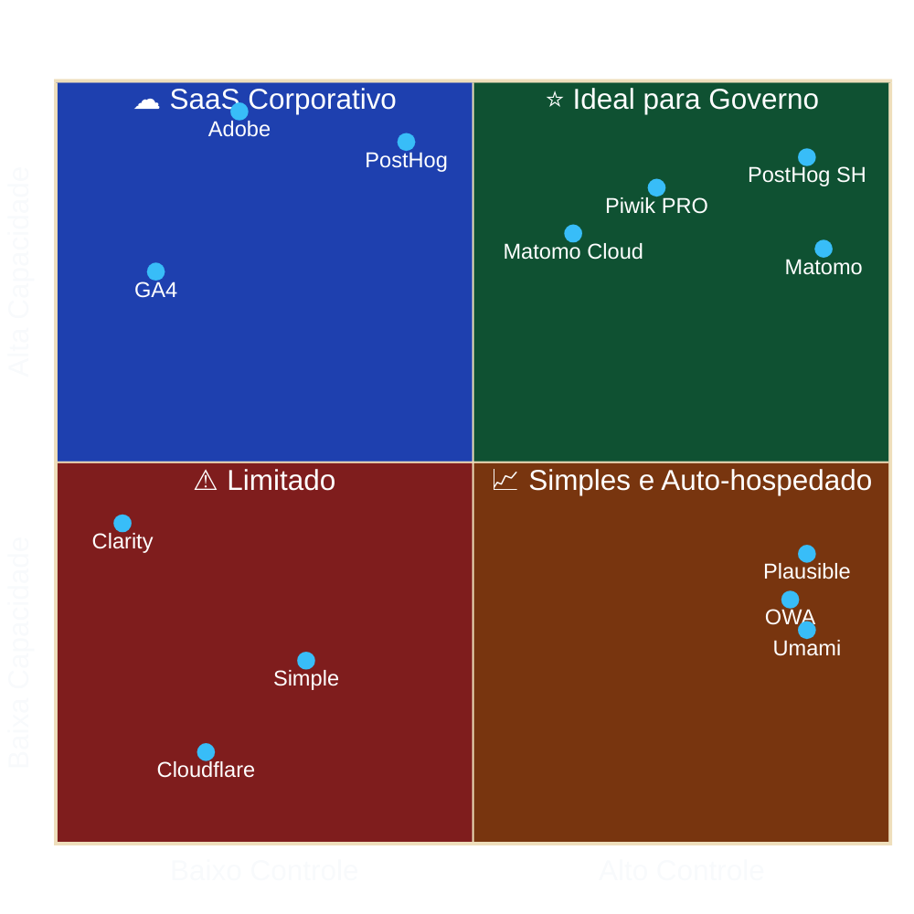
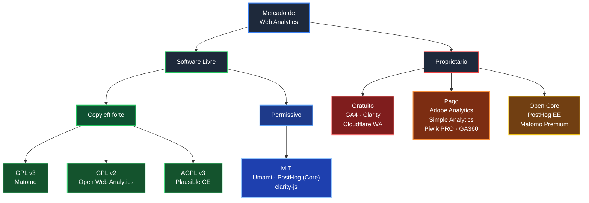

# 04 — Panorama de Mercado

> **Anterior:** [03 — Critérios de avaliação](03-criterios-de-avaliacao.md) · **Próximo:** [05 — Comparativo detalhado](05-comparativo-detalhado.md)

---

## Sumário

- [1. Segmentação do mercado](#1-segmentação-do-mercado)
- [2. Mapa de posicionamento](#2-mapa-de-posicionamento)
- [3. Evolução histórica e forças estruturais](#3-evolução-histórica-e-forças-estruturais)
- [4. Plataformas avaliadas](#4-plataformas-avaliadas)
- [5. Plataformas adicionais consideradas](#5-plataformas-adicionais-consideradas)
- [6. Plataformas descartadas na pré-seleção](#6-plataformas-descartadas-na-pré-seleção)
- [7. Adoção no setor público](#7-adoção-no-setor-público)
- [8. Tendências relevantes para a decisão](#8-tendências-relevantes-para-a-decisão)
- [9. Análise de viabilidade de fornecedor](#9-análise-de-viabilidade-de-fornecedor)

---

## 1. Segmentação do mercado

O mercado de Web Analytics não é homogêneo. Comparar Microsoft Clarity com Adobe Analytics é comparar produtos que resolvem problemas diferentes. A segmentação abaixo é pré-requisito para uma comparação honesta.

| Segmento | Problema que resolve | Métrica central | Plataformas |
|----------|---------------------|-----------------|-------------|
| **Web Analytics tradicional** | Quem acessa, de onde, o quê | Sessão / visita | Matomo, GA4, Adobe Analytics, Piwik PRO, OWA |
| **Privacy-first analytics** | Métrica agregada sem dado pessoal | Page view agregado | Plausible, Umami, Simple Analytics, Fathom, Pirsch, GoatCounter, Cloudflare WA |
| **Product analytics** | Comportamento do usuário em produto digital | Evento / usuário | PostHog, Amplitude, Mixpanel, Heap |
| **Behavioral / experience analytics** | Por que o usuário fez o que fez | Sessão gravada / interação | Microsoft Clarity, Hotjar, FullStory, Contentsquare |
| **Behavioral data pipeline** | Coletar e entregar dado bruto a um data warehouse | Evento bruto | Snowplow, RudderStack, Segment |

> **📌 Observação — Leitura do quadrante**
> O quadrante superior direito ("ideal para setor público") combina alta profundidade analítica com alto controle dos dados. Apenas três plataformas o ocupam: **Matomo On-Premise**, **PostHog auto-hospedado** e **Piwik PRO**. Essa observação antecipa — e é consistente com — o resultado da matriz de decisão em [`07-matriz-decisao.md`](07-matriz-decisao.md).

---

## 2. Mapa de posicionamento

### 2.1 Por modelo de licenciamento

### 2.2 Por modelo de hospedagem

| Plataforma | Auto-hospedado | SaaS público | SaaS região UE | Private cloud | On-premises com suporte |
|-----------|:-----------:|:------------:|:--------------:|:-------------:|:-----------------------:|
| Matomo | ✅ | ✅ | ✅ | — | ✅ (Enterprise) |
| Google Analytics 4 | ❌ | ✅ | ❌ | ❌ | ❌ |
| Plausible | ✅ (CE) | ✅ | ✅ (padrão) | ❌ | ❌ |
| Umami | ✅ | ✅ | ✅ | ❌ | ❌ |
| Open Web Analytics | ✅ | ❌ | ❌ | ❌ | ❌ |
| Adobe Analytics | ❌ | ✅ | ✅ | ✅ (negociável) | ❌ |
| Simple Analytics | ❌ | ✅ | ✅ (padrão) | ❌ | ❌ |
| Microsoft Clarity | ❌ | ✅ | ⚠️ (parcial) | ❌ | ❌ |
| Cloudflare Web Analytics | ❌ | ✅ | ❌ | ❌ | ❌ |
| PostHog | ⚠️ (OSS, sem suporte) | ✅ | ✅ | ✅ (BYOC, enterprise) | ❌ |
| Piwik PRO | ✅ (Enterprise) | ✅ | ✅ | ✅ | ✅ |

---

## 3. Evolução histórica e forças estruturais

```mermaid
timeline
    title Marcos que moldaram o mercado de Web Analytics
    2005 : Google adquire Urchin e lança Google Analytics gratuito
         : Comoditização do mercado; players pagos perdem mercado massivo
    2007 : Lançamento do Piwik (posteriormente Matomo)
         : Surge alternativa livre e auto-hospedada
    2009 : Adobe adquire Omniture (SiteCatalyst)
         : Consolidação do segmento enterprise
    2016 : Ascensão de bloqueadores de rastreamento e do Do Not Track
         : Precisão do tracking client-side começa a degradar
    2018 : Entrada em vigor do RGPD (UE)
         : Consentimento torna-se obrigatório; nasce o segmento privacy-first
    2018 : Lei 13.709 (LGPD) sancionada no Brasil
    2019 : Lançamento de Plausible e Fathom
         : Consolidação do segmento cookieless
    2020 : TJUE — Schrems II invalida o Privacy Shield
         : Transferência UE→EUA passa a exigir avaliação caso a caso
    2020 : Vigência da LGPD no Brasil
    2022 : DPAs de Áustria, França, Itália e Dinamarca declaram uso do GA incompatível com o RGPD
         : Migração institucional europeia para alternativas soberanas
    2022 : Rebranding Universal Analytics → GA4 anunciado com data de desligamento
         : Migração forçada evidencia o risco de lock-in em SaaS
    2023 : Desligamento do Universal Analytics
         : Perda de continuidade histórica de dados para milhões de propriedades
    2023 : EU-US Data Privacy Framework aprovado
         : Nova base de adequação; risco mitigado, não eliminado
    2023 : PostHog descontinua o suporte ao auto-hospedado gerenciado
         : Demonstra fragilidade do "open source" com mantenedor comercial único
    2024 : Snowplow altera licenciamento de Apache 2.0 para licença de uso limitado
         : Nova evidência do risco de relicenciamento
    2025 : Consolidação de IA generativa em camadas de insight analítico
         : Novo eixo de diferenciação; amplia questões de tratamento de dados
```

### 3.1 Forças estruturais em operação

| Força | Descrição | Consequência para o setor público |
|-------|-----------|----------------------------------|
| **Pressão regulatória crescente** | RGPD, LGPD, ePrivacy, decisões de DPAs | Aumenta o valor de soluções auto-hospedado e cookieless |
| **Degradação do tracking client-side** | Bloqueadores, ITP/ETP, remoção de cookies de terceiros | Aumenta o valor de tracking first-party e server-side |
| **Risco de relicenciamento** | Projetos open source migrando para licenças restritivas (Snowplow, Elastic, HashiCorp, Redis) | Aumenta o valor de licenças copyleft com base de contribuidores diversa |
| **Descontinuidade forçada em SaaS** | UA→GA4 é o caso paradigmático | Demonstra que "gratuito" não elimina custo de migração |
| **Convergência de segmentos** | Web analytics + product analytics + session replay em produto único | Reduz o número de ferramentas necessárias; aumenta o lock-in de quem consolida |
| **Commoditização da métrica básica** | Page view e sessão são resolvidos por dezenas de produtos gratuitos | O diferencial migrou para governança, integração e profundidade |

> **⚠️ Bloco de Risco — Lição do desligamento do Universal Analytics**
> Em 2023 o Google desligou o Universal Analytics, forçando migração para o GA4. A migração **não preservou o histórico**: os dados do UA não são importáveis para o GA4 e ficaram acessíveis apenas por janela limitada. Milhares de organizações — incluindo órgãos públicos — perderam continuidade de série histórica.
>
> **Consequência arquitetural:** o custo de uma plataforma SaaS gratuita não é zero. Inclui o risco de descontinuidade unilateral, cujo custo é integralmente transferido ao cliente. Isso é modelado como *custo de saída* em [`../comparativos/custo.md`](../comparativos/custo.md) e fundamenta o peso 10 do critério de Independência tecnológica.

---

## 4. Plataformas avaliadas

As 10 plataformas obrigatórias do escopo, com sua ficha técnica individual.

| # | Plataforma | Origem | Ano | Licença | Segmento | Ficha |
|---|-----------|--------|-----|---------|----------|-------|
| 1 | **Matomo** | Nova Zelândia / Alemanha | 2007 | GPL v3 | Web Analytics tradicional | [📄](../plataformas/matomo.md) |
| 2 | **Google Analytics 4** | EUA | 2005 (GA) / 2020 (GA4) | Proprietária | Web Analytics tradicional | [📄](../plataformas/google-analytics.md) |
| 3 | **Plausible** | Estônia | 2019 | AGPL v3 (CE) | Privacy-first | [📄](../plataformas/plausible.md) |
| 4 | **Umami** | EUA | 2020 | MIT | Privacy-first | [📄](../plataformas/umami.md) |
| 5 | **Open Web Analytics** | EUA | 2008 | GPL v2 | Web Analytics tradicional | [📄](../plataformas/open-web-analytics.md) |
| 6 | **Adobe Analytics** | EUA | 1996 (Omniture) | Proprietária | Enterprise / Web Analytics | [📄](../plataformas/adobe-analytics.md) |
| 7 | **Simple Analytics** | Países Baixos | 2018 | Proprietária | Privacy-first | [📄](../plataformas/simple-analytics.md) |
| 8 | **Microsoft Clarity** | EUA | 2020 | Proprietária (`clarity-js` MIT) | Behavioral analytics | [📄](../plataformas/microsoft-clarity.md) |
| 9 | **Cloudflare Web Analytics** | EUA | 2020 | Proprietária | Privacy-first / RUM | [📄](../plataformas/cloudflare-web-analytics.md) |
| 10 | **PostHog** | EUA / Reino Unido | 2020 | MIT (core) + EE proprietária | Product analytics | [📄](../plataformas/posthog.md) |

---

## 5. Plataformas adicionais consideradas

Plataformas fora da lista obrigatória, incluídas por relevância técnica ou institucional para o caso de uso.

### 5.1 Piwik PRO — incluída na matriz

**Por que foi incluída:** é a alternativa comercial mais próxima do perfil de requisitos do setor público. Derivada do mesmo código-base original do Piwik (posterior fork comercial independente), oferece **Private Cloud e On-Premises** com conformidade RGPD/HIPAA, consent manager nativo, Tag Manager e Customer Data Platform integrados.

| Dimensão | Avaliação |
|----------|-----------|
| Origem | Polônia (UE) |
| Licença | Proprietária |
| Hospedagem | SaaS UE, Private Cloud (Azure/AWS), On-Premises |
| Diferencial | Consent Manager nativo + CDP + Tag Manager em produto único; conformidade RGPD/HIPAA como proposta de valor central |
| Limitação | Proprietária — não atende RG-01 (auditabilidade do código); custo de licença relevante |
| Pontuação na matriz | **465/600 (77,5 %)** — empatada em 3º |

> **📌 Observação**
> A Piwik PRO representa a alternativa de referência caso a premissa **P2** ([01, seção 7](01-contexto.md#7-premissas)) — capacidade técnica interna para operar solução auto-hospedado — se mostre falsa. É a opção que preserva a maior parte dos atributos de conformidade transferindo a operação para um fornecedor.

### 5.2 Fathom Analytics — não incluída na matriz

| Dimensão | Avaliação |
|----------|-----------|
| Origem | Canadá |
| Licença | Proprietária (a versão "Fathom Lite" open source foi descontinuada) |
| Motivo da exclusão | Sobreposição funcional quase completa com Simple Analytics, com menor maturidade de API; ausência de auto-hospedado mantido |

### 5.3 Snowplow — não incluída na matriz

| Dimensão | Avaliação |
|----------|-----------|
| Origem | Reino Unido |
| Licença | Snowplow Limited Use License (desde 2024; anteriormente Apache 2.0) |
| Motivo da exclusão | Pertence a segmento distinto (*behavioral data pipeline*), não a Web Analytics. Não entrega interface de relatórios — entrega evento bruto a um data warehouse. Exigiria stack analítica completa adicional |

> **⚠️ Bloco de Risco — Precedente de relicenciamento**
> A mudança do Snowplow de Apache 2.0 para uma licença de uso limitado em 2024 é evidência empírica direta do risco **TP-08** ([03, seção 3.1](03-criterios-de-avaliacao.md#31-pontos-de-sensibilidade-e-trade-off-points)): projetos de software livre com mantenedor comercial único podem relicenciar unilateralmente as versões futuras. A proteção contra esse risco é (a) licença copyleft, (b) base de contribuidores diversa, (c) direito perpétuo sobre a versão já licenciada.

### 5.4 Countly — não incluída na matriz

| Dimensão | Avaliação |
|----------|-----------|
| Origem | Turquia / Reino Unido |
| Licença | A edição community foi descontinuada; produto passou a ser exclusivamente comercial |
| Motivo da exclusão | Perda da modalidade open source elimina o principal atrativo para o caso de uso; foco primário em analytics de aplicativos móveis |

### 5.5 GoatCounter, Pirsch, Shynet, Ackee — não incluídas

| Plataforma | Licença | Motivo da exclusão |
|-----------|---------|--------------------|
| GoatCounter | EUPL 1.2 | Escopo funcional muito reduzido; projeto de mantenedor único |
| Pirsch | Dual (AGPL core) | Sobreposição com Plausible, com comunidade menor |
| Shynet | Apache 2.0 | Projeto pequeno; cobertura funcional inferior ao Umami |
| Ackee | MIT | Projeto com baixa atividade; escopo mínimo |

**Racional comum:** todas ocupam o mesmo nicho de Plausible e Umami com comunidade menor e menor cobertura funcional. Incluí-las aumentaria a extensão do estudo sem alterar o resultado.

### 5.6 Amplitude, Mixpanel, Heap — não incluídas

| Motivo da exclusão | Detalhe |
|--------------------|---------|
| Segmento distinto | Product analytics puro, sem cobertura de Web Analytics tradicional (aquisição, canais, SEO) |
| Sem auto-hospedado | Exclusivamente SaaS proprietário, com dados nos EUA |
| Sobreposição | PostHog representa o segmento na matriz, com a vantagem de possuir modalidade auto-hospedado |

### 5.7 Hotjar, FullStory, Contentsquare — não incluídas

| Motivo da exclusão | Detalhe |
|--------------------|---------|
| Segmento complementar | Behavioral analytics, não substitutivo de Web Analytics |
| Representação na matriz | Microsoft Clarity representa o segmento, com a vantagem de ser gratuito |
| Custo | Contentsquare e FullStory operam em faixa enterprise sem preço público |

---

## 6. Plataformas descartadas na pré-seleção

Resumo consolidado, para rastreabilidade da decisão.

| Plataforma | Segmento | Motivo do descarte |
|-----------|----------|--------------------|
| Fathom Analytics | Privacy-first | Sobreposição com Simple Analytics; sem auto-hospedado mantido |
| Snowplow | Data pipeline | Segmento distinto; relicenciamento restritivo em 2024 |
| Countly | Mobile analytics | Edição community descontinuada |
| GoatCounter | Privacy-first | Escopo reduzido; mantenedor único |
| Pirsch | Privacy-first | Sobreposição com Plausible; comunidade menor |
| Shynet | Privacy-first | Projeto pequeno |
| Ackee | Privacy-first | Baixa atividade |
| TelemetryDeck | Privacy-first | Foco em aplicativos, não em web |
| Amplitude | Product analytics | Sem auto-hospedado; representado por PostHog |
| Mixpanel | Product analytics | Sem auto-hospedado; representado por PostHog |
| Heap | Product analytics | Sem auto-hospedado; representado por PostHog |
| Hotjar | Behavioral | Representado por Microsoft Clarity |
| FullStory | Behavioral | Faixa enterprise; representado por Microsoft Clarity |
| Contentsquare | Behavioral | Faixa enterprise; sem preço público |
| RudderStack | Data pipeline | Segmento distinto |
| Segment (Twilio) | Data pipeline | Segmento distinto; proprietário |
| AWStats / Webalizer | Log analysis | Tecnologia superada; sem eventos, sem API moderna |
| Yandex Metrica | Web Analytics | Risco geopolítico e de transferência internacional incompatível com o requisito RL-02 |
| Baidu Tongji | Web Analytics | Idem; sem suporte adequado ao mercado brasileiro |

---

## 7. Adoção no setor público

Evidência de adoção institucional, relevante como indicador de maturidade e de aceitação regulatória.

### 7.1 Casos documentados

| Instituição | Plataforma | Observação |
|------------|-----------|------------|
| **Comissão Europeia — Europa Analytics** | Matomo | Serviço oficial de analytics dos sítios da Comissão Europeia, operado sobre Matomo |
| **CNIL (França)** | Matomo | A autoridade francesa de proteção de dados publicou orientação reconhecendo configuração específica do Matomo como isenta de consentimento prévio |
| **Setor público alemão** | Matomo | Recomendação recorrente em guias de conformidade RGPD de órgãos alemães |
| **Setor público francês** | Matomo | Presente no catálogo de software livre recomendado pela administração pública francesa |
| **NHS / Reino Unido** | Adobe Analytics + GA | Setor público britânico historicamente adota soluções comerciais |
| **Diversos municípios europeus** | Matomo, Plausible | Migração pós-decisões de DPAs de 2022 |

> **🔍 Evidência — Precedente da CNIL**
> A CNIL mantém publicação sobre configuração de ferramentas de medição de audiência isentas de consentimento (*exemption de consentement*). O Matomo, em configuração específica (sem cookie de identificação persistente ou com cookie estritamente necessário, IP anonimizado, sem cruzamento com outros tratamentos, dado não compartilhado), é reconhecido nessa categoria.
>
> **Relevância para o Brasil:** não é vinculante, mas constitui **precedente técnico auditado por autoridade de proteção de dados**, aplicável por analogia na fundamentação da base legal perante a ANPD. Referência em [`12-referencias.md`](12-referencias.md).

### 7.2 Movimento pós-2022 na Europa

Após as decisões das autoridades de proteção de dados de Áustria, França, Itália e Dinamarca declarando o uso do Google Analytics incompatível com o RGPD, observou-se migração institucional relevante do setor público europeu para alternativas auto-hospedadas — predominantemente Matomo e, secundariamente, Plausible e Piwik PRO.

> **📌 Observação — Aplicabilidade ao Brasil**
> A ANPD **não emitiu, até a data-base deste estudo, manifestação específica** sobre o uso de ferramentas de analytics estrangeiras pelo setor público brasileiro. A ausência de manifestação **não é autorização** — é ausência de fiscalização.
>
> A LGPD tem estrutura substancialmente análoga ao RGPD nas disposições sobre transferência internacional (arts. 33–36) e sobre bases legais (art. 7º). O raciocínio das autoridades europeias é, portanto, **tecnicamente transponível**. Um órgão público estadual que adote hoje uma plataforma cujo uso já foi questionado sob norma análoga assume **risco regulatório antecipável e documentado** — o que agrava a responsabilidade em caso de futura fiscalização.
>
> Esse é o fundamento técnico-jurídico da nota 2 atribuída ao GA4 no critério C01 ([07 — Matriz de decisão](07-matriz-decisao.md)).

---

## 8. Tendências relevantes para a decisão

| Tendência | Descrição | Impacto na decisão | Horizonte |
|-----------|-----------|--------------------|-----------|
| **Server-side tracking** | Deslocamento da coleta do navegador para o servidor | Aumenta precisão e controle; aumenta complexidade e responsabilidade do controlador | Consolidada |
| **Cookieless por padrão** | Identificação sem cookie persistente | Reduz atrito regulatório; reduz precisão de visitante recorrente | Consolidada |
| **Convergência de suítes** | Web + product + replay + feature flags em produto único | Reduz número de ferramentas; aumenta lock-in | Em curso |
| **Bancos colunares** | ClickHouse como padrão de fato para analytics | Melhora desempenho analítico; aumenta complexidade operacional | Consolidada |
| **IA generativa em analytics** | Camada de insight em linguagem natural sobre os dados | Novo eixo de diferenciação; **cria nova superfície de tratamento de dados que exige avaliação de conformidade** | Emergente |
| **Warehouse-first analytics** | Dado bruto no data warehouse; analytics como camada de visualização | Alinhado com arquitetura de dados corporativa; aumenta esforço de engenharia | Em curso |
| **Regulação de transferência internacional** | Endurecimento contínuo pós-Schrems II | Favorece estruturalmente soluções soberanas | Consolidada |

> **⚠️ Bloco de Risco — IA generativa em plataformas de analytics**
> Diversas plataformas passaram a incorporar camadas de análise assistida por IA, que processam os dados coletados em infraestrutura do fornecedor. Para um órgão público, isso pode configurar **novo tratamento de dados com nova finalidade**, exigindo avaliação de base legal própria — mesmo quando a plataforma principal já foi avaliada.
>
> **Mitigação:** exigir capacidade de desabilitar funcionalidades de IA que impliquem processamento externo; incluir cláusula específica em eventual contrato. Registrado no [registro de riscos](11-riscos.md).

---

## 9. Análise de viabilidade de fornecedor

Componente do Gartner Decision Framework: avaliar não só o produto, mas a probabilidade de o fornecedor existir ao longo do ciclo de vida do sistema.

| Plataforma | Mantenedor | Modelo de receita | Risco de descontinuidade | Risco de relicenciamento | Mitigação disponível |
|-----------|-----------|-------------------|:------------------------:|:------------------------:|---------------------|
| **Matomo** | InnoCraft (NZ) + comunidade | Cloud + plugins premium + Enterprise | 🟢 Baixo | 🟢 Baixo (GPL v3, base ampla de contribuidores) | Código GPL; fork viável; direito perpétuo sobre a versão obtida |
| **Google Analytics** | Google LLC | Publicidade + GA360 | 🟡 Médio (produto persiste, **versões não** — precedente UA→GA4) | 🔴 N/A (proprietária) | Nenhuma; risco integralmente assumido pelo cliente |
| **Plausible** | Plausible Insights OÜ (EE) | SaaS | 🟡 Médio (empresa pequena) | 🟡 Médio (AGPL, mantenedor único) | AGPL garante direito perpétuo sobre a versão obtida |
| **Umami** | Umami Software Inc. | Cloud | 🟡 Médio | 🟡 Médio (MIT permite fechar versões futuras) | MIT garante direito perpétuo sobre a versão obtida |
| **Open Web Analytics** | Mantenedor individual | Nenhum | 🔴 Alto | 🟢 Baixo (GPL v2) | Fork viável, mas exige assumir a manutenção |
| **Adobe Analytics** | Adobe Inc. | Licenciamento enterprise | 🟢 Baixo (empresa consolidada) | 🔴 N/A | Contrato; custo de saída elevado |
| **Simple Analytics** | Simple Analytics B.V. (NL) | SaaS | 🟡 Médio (empresa pequena) | 🔴 N/A | Exportação de dados |
| **Microsoft Clarity** | Microsoft Corp. | Gratuito (estratégico) | 🟡 Médio (produto gratuito pode ser descontinuado) | 🔴 N/A | Nenhuma; dados não exportáveis integralmente |
| **Cloudflare Web Analytics** | Cloudflare Inc. | Gratuito (agregado à plataforma) | 🟡 Médio | 🔴 N/A | Nenhuma |
| **PostHog** | PostHog Inc. | Cloud + Enterprise | 🟢 Baixo (bem capitalizada) | 🟡 Médio (**precedente já concretizado**: suporte ao auto-hospedado descontinuado em 2023) | MIT sobre o core; self-host sem suporte |
| **Piwik PRO** | Piwik PRO S.A. (PL) | Licenciamento | 🟡 Médio | 🔴 N/A | Contrato; exportação |

> **🚨 Alerta — PostHog e o risco concretizado**
> Em 2023 a PostHog **descontinuou o suporte à implantação auto-hospedado gerenciada** (Kubernetes/Helm), mantendo apenas uma opção de `docker-compose` explicitamente rotulada como não suportada e adequada apenas a volumes reduzidos. Trata-se de um caso em que o risco **TP-08** não é hipotético — já se materializou.
>
> **Consequência para a avaliação:** o PostHog auto-hospedado recebe nota **1** no critério C10 (Operação), refletindo que o Estado assumiria integralmente a operação de uma stack complexa (ClickHouse + PostgreSQL + Kafka + Redis + object storage) sem suporte do fornecedor. Ver [`../plataformas/posthog.md`](../plataformas/posthog.md).

---

## Navegação

| ⬅️ Anterior | ➡️ Próximo |
|------------|-----------|
| [03 — Critérios de avaliação](03-criterios-de-avaliacao.md) | [05 — Comparativo detalhado](05-comparativo-detalhado.md) |
