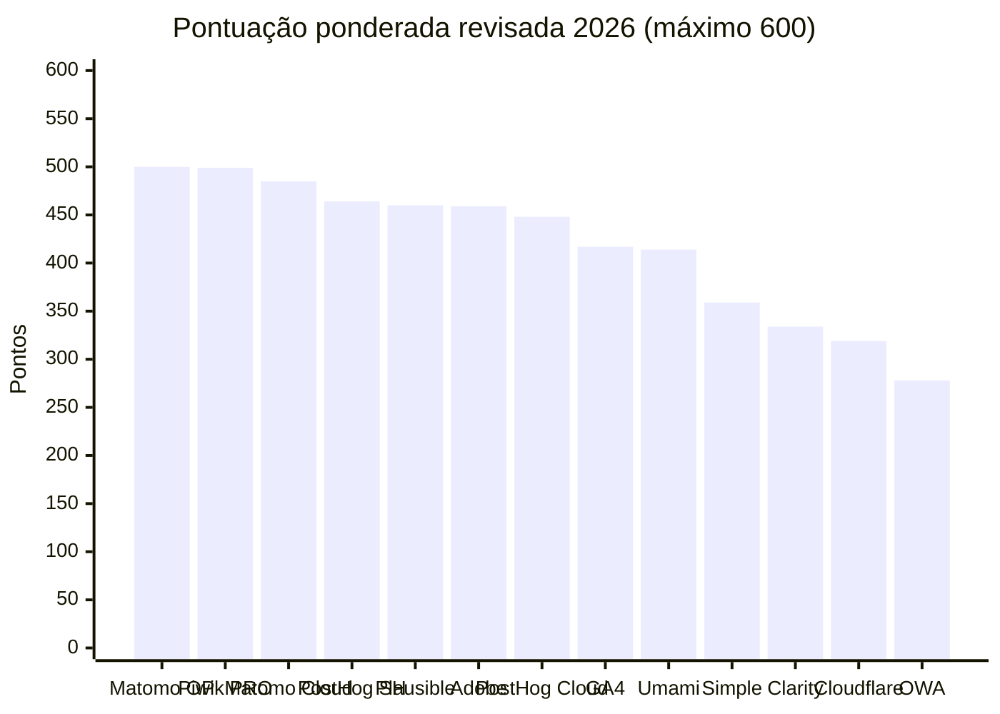
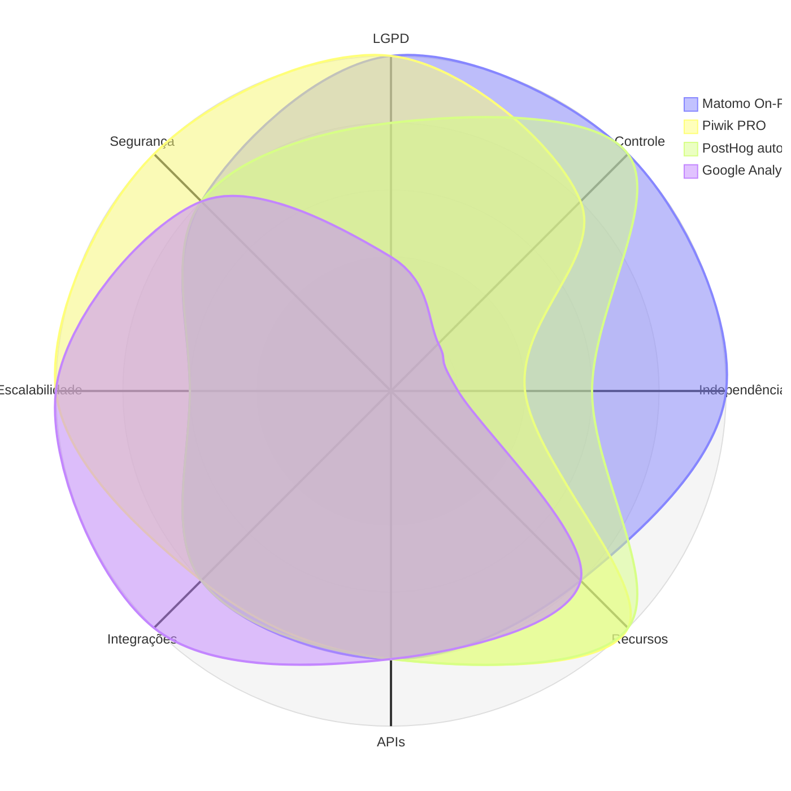

# 07 — Matriz de Decisão Ponderada

> **Método:** MAUT — Multi-Attribute Utility Theory
> **Anterior:** [06 — Trade-offs](06-tradeoffs.md) · **Próximo:** [08 — ADR-001](08-adr.md) · [08 — ADR-002](08-adr-002.md)

> **📌 Nota metodológica — Revisão 2026**
> Os totais e o ranking desta matriz refletem os **pesos revisados** aprovados no [ADR-002](08-adr-002.md) — C03 (TCO) rebaixado a peso 0 e 15 pontos redistribuídos entre C05, C06, C08, C09, C10 e C11. **As notas atribuídas foram preservadas** — a mudança é exclusivamente de peso. As colunas de pontuação ADR-001 permanecem impressas nas seções 2.2 e 3.1 para rastreabilidade e auditoria. Justificativa completa em [`03-criterios-de-avaliacao.md §4.3`](03-criterios-de-avaliacao.md#43-justificativa-da-atribuição-de-pesos).

---

## Sumário

- [1. Parâmetros da matriz](#1-parâmetros-da-matriz)
- [2. Matriz consolidada](#2-matriz-consolidada)
- [3. Resultado e ranking](#3-resultado-e-ranking)
- [4. Justificativa nota a nota](#4-justificativa-nota-a-nota)
- [5. Análise de sensibilidade](#5-análise-de-sensibilidade)
- [6. Análise de dominância](#6-análise-de-dominância)
- [7. Conclusão da matriz](#7-conclusão-da-matriz)

---

## 1. Parâmetros da matriz

| Parâmetro | Valor |
|-----------|-------|
| Critérios | 12 |
| Soma dos pesos | 120 |
| Escala de notas | 1 a 5 (inteiros) |
| Pontuação máxima | 600 |
| Fórmula | $S_p = \sum_{i=1}^{12} w_i \cdot n_{p,i}$ |
| Plataformas avaliadas | 13 (10 obrigatórias + Matomo Cloud + PostHog Cloud + Piwik PRO) |
| Definição operacional das notas | [`03-criterios-de-avaliacao.md`, seção 5](03-criterios-de-avaliacao.md#5-definição-operacional-de-cada-critério) |

### 1.1 Pesos aplicados

| Código | Critério | Peso ADR-001 | **Peso revisado (ADR-002)** |
|:------:|----------|-------------:|----------------------------:|
| C01 | LGPD | 15 | **15** |
| C02 | Controle dos dados | 15 | **15** |
| C03 | TCO *(informativo)* | 15 | **0** |
| C04 | Independência tecnológica | 10 | **10** |
| C05 | Recursos analíticos | 10 | **13** |
| C06 | APIs | 10 | **13** |
| C07 | Integrações | 10 | **10** |
| C08 | Escalabilidade | 10 | **13** |
| C09 | Segurança | 10 | **12** |
| C10 | Operação | 5 | **7** |
| C11 | Comunidade | 5 | **7** |
| C12 | Documentação | 5 | **5** |
| | **Total** | **120** | **120** |

---

## 2. Matriz consolidada

### 2.1 Notas atribuídas

| Plataforma | C01 LGPD `15` | C02 Controle `15` | C03 TCO `15` | C04 Independ. `10` | C05 Recursos `10` | C06 APIs `10` | C07 Integr. `10` | C08 Escala `10` | C09 Segur. `10` | C10 Oper. `5` | C11 Comun. `5` | C12 Docum. `5` |
|-----------|:---:|:---:|:---:|:---:|:---:|:---:|:---:|:---:|:---:|:---:|:---:|:---:|
| **Matomo On-Premise** | **5** | **5** | **5** | **5** | 4 | 4 | 4 | 3 | 4 | 3 | 4 | 4 |
| **Plausible CE** | **5** | **5** | **5** | 4 | 3 | 3 | 3 | 4 | 4 | 3 | 3 | 4 |
| **Matomo Cloud** | 4 | 3 | 3 | 4 | **5** | 4 | 4 | 4 | 4 | **5** | 4 | 4 |
| **Piwik PRO** | **5** | 4 | 2 | 2 | **5** | 4 | 4 | **5** | **5** | 4 | 2 | 4 |
| **Umami** | **5** | **5** | **5** | 4 | 2 | 3 | 2 | 3 | 3 | 4 | 3 | 3 |
| **PostHog auto-hospedado** | 4 | **5** | 3 | 3 | **5** | 4 | 4 | 3 | 4 | 1 | 4 | 4 |
| **PostHog Cloud EU** | 3 | 2 | 3 | 2 | **5** | 4 | 4 | **5** | 4 | **5** | 4 | 4 |
| **Google Analytics 4** | 2 | 1 | 4 | 1 | 4 | 4 | **5** | **5** | 4 | **5** | **5** | **5** |
| **Adobe Analytics** | 3 | 2 | 1 | 1 | **5** | **5** | **5** | **5** | **5** | 4 | 3 | 4 |
| **Microsoft Clarity** | 2 | 1 | **5** | 1 | 3 | 2 | 3 | **5** | 4 | **5** | 3 | 3 |
| **Simple Analytics** | 4 | 2 | 3 | 2 | 2 | 3 | 2 | 4 | 4 | **5** | 2 | 3 |
| **Cloudflare Web Analytics** | 3 | 1 | **5** | 1 | 1 | 3 | 2 | **5** | 4 | **5** | 2 | 3 |
| **Open Web Analytics** | 4 | **5** | **5** | 3 | 2 | 2 | 1 | 1 | **1** | 2 | 1 | 1 |

### 2.2 Pontuação ponderada (peso × nota)

**Pesos revisados 2026** — C01=15, C02=15, C03=0, C04=10, C05=13, C06=13, C07=10, C08=13, C09=12, C10=7, C11=7, C12=5.

| Plataforma | C01 | C02 | C03 | C04 | C05 | C06 | C07 | C08 | C09 | C10 | C11 | C12 | **Total revisado** | *Total ADR-001* |
|-----------|----:|----:|----:|----:|----:|----:|----:|----:|----:|----:|----:|----:|-------------------:|----------------:|
| **Matomo On-Premise** | 75 | 75 | 0 | 50 | 52 | 52 | 40 | 39 | 48 | 21 | 28 | 20 | **500** | *520* |
| **Piwik PRO** | 75 | 60 | 0 | 20 | 65 | 52 | 40 | 65 | 60 | 28 | 14 | 20 | **499** | *465* |
| **Matomo Cloud** | 60 | 45 | 0 | 40 | 65 | 52 | 40 | 52 | 48 | 35 | 28 | 20 | **485** | *465* |
| **PostHog auto-hospedado** | 60 | 75 | 0 | 30 | 65 | 52 | 40 | 39 | 48 | 7 | 28 | 20 | **464** | *455* |
| **Plausible CE** | 75 | 75 | 0 | 40 | 39 | 39 | 30 | 52 | 48 | 21 | 21 | 20 | **460** | *485* |
| **Adobe Analytics** | 45 | 30 | 0 | 10 | 65 | 65 | 50 | 65 | 60 | 28 | 21 | 20 | **459** | *405* |
| **PostHog Cloud EU** | 45 | 30 | 0 | 20 | 65 | 52 | 40 | 65 | 48 | 35 | 28 | 20 | **448** | *425* |
| **Google Analytics 4** | 30 | 15 | 0 | 10 | 52 | 52 | 50 | 65 | 48 | 35 | 35 | 25 | **417** | *410* |
| **Umami** | 75 | 75 | 0 | 40 | 26 | 39 | 20 | 39 | 36 | 28 | 21 | 15 | **414** | *445* |
| **Simple Analytics** | 60 | 30 | 0 | 20 | 26 | 39 | 20 | 52 | 48 | 35 | 14 | 15 | **359** | *355* |
| **Microsoft Clarity** | 30 | 15 | 0 | 10 | 39 | 26 | 30 | 65 | 48 | 35 | 21 | 15 | **334** | *355* |
| **Cloudflare Web Analytics** | 45 | 15 | 0 | 10 | 13 | 39 | 20 | 65 | 48 | 35 | 14 | 15 | **319** | *345* |
| **Open Web Analytics** | 60 | 75 | 0 | 30 | 26 | 26 | 10 | 13 | 12 | 14 | 7 | 5 | **278** | *330* |

> **📌 Observação — Interpretação da coluna "Total ADR-001"**
> A última coluna preserva a pontuação calculada com os pesos originais (C03=15) para permitir auditoria da revisão. **Não** deve ser lida como ranking alternativo — o critério de decisão vigente é o "Total revisado".

---

## 3. Resultado e ranking

### 3.1 Ranking final

| # | Plataforma | Pontuação | % | Faixa | Situação na triagem |
|--:|-----------|----------:|--:|-------|--------------------|
| 🥇 **1** | **Matomo On-Premise** | **500** | **83,3 %** | 🟢 **Recomendada** | Aprovada |
| 🥈 2 | Piwik PRO | 499 | 83,2 % | 🟢 Recomendada | Aprovada |
| 🥉 3 | Matomo Cloud | 485 | 80,8 % | 🟢 Recomendada | Aprovada com ressalva |
| 4 | PostHog auto-hospedado | 464 | 77,3 % | 🟡 Viável | Aprovada |
| 5 | Plausible CE | 460 | 76,7 % | 🟡 Viável | Aprovada |
| 6 | Adobe Analytics | 459 | 76,5 % | 🟡 Viável | Aprovada com ressalva |
| 7 | PostHog Cloud EU | 448 | 74,7 % | 🟡 Viável | Aprovada com ressalva |
| 8 | Google Analytics 4 | 417 | 69,5 % | 🟠 Condicionada | Aprovada com ressalva grave |
| 9 | Umami | 414 | 69,0 % | 🟠 Condicionada | Aprovada |
| 10 | Simple Analytics | 359 | 59,8 % | 🔴 Não recomendada | Aprovada com ressalva |
| 11 | Microsoft Clarity | 334 | 55,7 % | 🔴 Não recomendada | **Eliminada como primária** |
| 12 | Cloudflare Web Analytics | 319 | 53,2 % | 🔴 Não recomendada | **Eliminada como primária** |
| 13 | Open Web Analytics | 278 | 46,3 % | 🔴 Não recomendada | **Eliminada (E6)** |

> **📌 Observação — Movimentações relevantes em relação ao ADR-001**
>
> - **Matomo On-Premise:** mantém a liderança (520 → 500), com vantagem de apenas **1 ponto** sobre Piwik PRO. Resolvido no desempate por C02 (Controle=5 vs 4).
> - **Piwik PRO** sobe de #3 (empate) para #2 isolado, refletindo o valor real da capacidade analítica (C05=5) e escalabilidade (C08=5) sem a penalização de custo.
> - **Matomo Cloud** entra na faixa "Recomendada" (485, 80,8 %), viabilizando-se como contingência sem ressalva de faixa.
> - **PostHog auto-hospedado** sobe de #5 (455) para #4 (464), passando a ser a **melhor opção soberana de product analytics** — coerente com sua adoção no portal Xvia definida pelo [ADR-002](08-adr-002.md).
> - **Plausible CE** cai de #2 (485) para #5 (460). Sua cobertura funcional limitada (C05=3) passa a pesar mais na ausência da compensação por TCO baixo.
> - **Adobe Analytics** salta de #9 (405) para #6 (459), quase empatando com Plausible. **Sua exclusão do papel de plataforma padrão passa a se fundamentar exclusivamente em C04 (Independência=1)** — lock-in máximo do estudo — e não mais em custo. Discussão detalhada no [ADR-002](08-adr-002.md).

### 3.2 Desempate — 1º lugar (revisão 2026)

Matomo On-Premise (500) e Piwik PRO (499) ficam a 1 ponto de distância — margem inferior à precisão da escala. Aplicando a regra de desempate de [`03-criterios-de-avaliacao.md §6.4`](03-criterios-de-avaliacao.md#64-regra-de-desempate) para consolidar a leitura:

| Critério de desempate | Matomo OP | Piwik PRO | Vencedor |
|----------------------|:---------:|:---------:|----------|
| 1º — Nota em C01 (LGPD) | 5 | 5 | Empate |
| 2º — Nota em C02 (Controle) | **5** | 4 | **Matomo OP** |

**Resultado:** Matomo On-Premise mantém a liderança por superioridade estrita em Controle dos dados — coerente com o veto do Encarregado de Dados sobre plataformas com mediação proprietária no acesso ao armazenamento.

> **📌 Observação — Diferença dentro da margem de escala**
> A distância de 1 ponto (0,17 %) é inferior à precisão da escala inteira 1–5 (limitação L7). A leitura correta é: **Matomo OP e Piwik PRO são equivalentes na dimensão global; a preferência pelo Matomo se sustenta na superioridade em C02, C04 (Independência 5 vs 2) e C11 (Comunidade 4 vs 2) — três critérios estruturais que a matriz mede mas que a soma nivela.**

### 3.3 Visualização do ranking

### 3.4 Perfil das cinco primeiras colocadas

> **📌 Observação**
> Sem o eixo TCO, o radar destaca a característica central do Matomo On-Premise: **cobertura uniforme dos eixos de conformidade, governança e capacidade**. Piwik PRO acumula picos em capacidade técnica (C05, C08, C09) mas afunda em Independência (C04=2). PostHog auto-hospedado mostra o perfil de product analytics — forte em capacidade, fraco em operação (traço não representado no radar mas presente em C10=1). GA4 permanece com o perfil característico de SaaS estrangeira: excelência técnica, colapso em soberania.

---

## 4. Justificativa nota a nota

Cada nota abaixo remete à definição operacional em [`03-criterios-de-avaliacao.md`, seção 5](03-criterios-de-avaliacao.md#5-definição-operacional-de-cada-critério).

---

### 4.1 Matomo On-Premise — 520 pontos

| Critério | Nota | Justificativa |
|----------|:----:|---------------|
| **C01 — LGPD** | **5** | Configurável para operar sem cookie de identificação e com anonimização de IP em até 4 bytes; nenhuma transferência internacional; retenção definida integralmente pelo Estado com exclusão física verificável; opt-out nativo por iframe e API; respeita DoNotTrack. **Precedente da CNIL** reconhece configuração específica do Matomo como isenta de consentimento — única plataforma da matriz com precedente favorável de autoridade de proteção de dados. Atende integralmente RL-01 a RL-14 |
| **C02 — Controle** | **5** | Dado bruto em MySQL/MariaDB sob custódia física do Estado; acesso SQL direto; exportação e eliminação totais e verificáveis por consulta; nenhum terceiro tem acesso |
| **C03 — TCO** | **5** | TCO marginal estimado em **~R$ 235 k em 5 anos** (faixa ≤ R$ 250 k = nota 5). Composição: licença zero, ~R$ 60 k em plugins premium, ~R$ 30 k de infra marginal (rateio K8s + DBaaS do parque SETDIG existente), ~R$ 75 k de equipe marginal (~0,1 FTE incremental sobre baseline STI), ~R$ 10 k de implantação por portal, ~R$ 30 k de adequação LGPD, ~R$ 30 k de riscos. Regime de custo definido em [`03-criterios-de-avaliacao.md §5.C03`](03-criterios-de-avaliacao.md#c03--tco-peso-15) — fundamento em P1, P2 e R4. Detalhamento em [`../comparativos/custo.md §4.1`](../comparativos/custo.md#41-matomo-on-premise-núcleo-sem-plugins-pagos) |
| **C04 — Independência** | **5** | GPL v3; código auditável; sem dependência de serviço do fornecedor para operar; schema de banco inspecionável; múltiplas opções de hospedagem; fork tecnicamente viável; direito perpétuo sobre a versão obtida |
| **C05 — Recursos** | **4** | Cobertura ponderada dos RF entre 75 % e 89 %. Cobre page views, eventos, dimensões customizadas, metas, funis, segmentação, jornada, coortes, tempo real, e-commerce, heatmaps, session recording, form analytics e A/B testing. **Não recebe 5** porque funil, heatmap, session recording, form analytics e A/B testing são **plugins pagos** na modalidade On-Premise, e a análise de retenção é menos madura que a de GA4/PostHog |
| **C06 — APIs** | **4** | Reporting API HTTP completa com saída em JSON, XML, CSV, TSV, HTML e RSS; Tracking HTTP API; API de administração; SDK oficial em PHP; SDKs móveis oficiais; acesso SQL direto ao dado bruto. **Não recebe 5** por: ausência de GraphQL, ausência de webhooks nativos, versionamento implícito e SDKs Python/Node.js apenas comunitários |
| **C07 — Integrações** | **4** | Tag Manager nativo; integração com GTM; plugins de SAML e OIDC (pagos); plugins oficiais para WordPress e Drupal; **acesso SQL direto habilita Metabase, Superset, Power BI e Grafana sem intermediação de API** — vantagem estrutural sobre qualquer SaaS. **Não recebe 5** por ausência de conectores nativos certificados e por SSO exigir plugin pago |
| **C08 — Escalabilidade** | **3** | Atende o cenário de referência (12 M page views/mês) com tuning ativo. Escala horizontal da coleta é viável; escala do processamento é parcial. **Gargalo estrutural de arquivamento** e limitação do MySQL para escrita impedem nota superior. Mitigável por QueuedTracking + Redis, réplicas de leitura e particionamento — porém exige trabalho de engenharia, não vem pronto |
| **C09 — Segurança** | **4** | Gestão de vulnerabilidades ativa e responsiva; MFA por TOTP nativo; RBAC granular por site e por permissão; log de auditoria nativo; programa de divulgação de vulnerabilidades. **Não recebe 5** por ausência de certificação de terceiro (ISO 27001/SOC 2) — inaplicável ao modelo auto-hospedado, já que a responsabilidade recai sobre a infraestrutura do Estado |
| **C10 — Operação** | **3** | Auto-hospedado de complexidade moderada: 2 componentes obrigatórios (PHP + MySQL) mais Redis recomendado, cron de arquivamento e tuning periódico. Estimativa de ~0,3 FTE em regime permanente |
| **C11 — Comunidade** | **4** | Comunidade grande e ativa; mais de 15 anos de projeto; releases regulares; marketplace extenso de plugins; **adoção institucional documentada** (Comissão Europeia — Europa Analytics). **Não recebe 5** por concentração da governança na InnoCraft e escassez de profissionais no mercado brasileiro |
| **C12 — Documentação** | **4** | Documentação oficial extensa: guias de usuário, de desenvolvedor, referência de API, guias de implantação e de otimização de desempenho; FAQ abrangente. **Não recebe 5** por cobertura irregular de tópicos avançados de operação em escala e por tradução parcial para pt-BR |

---

### 4.2 Plausible Community Edition — 485 pontos

| Critério | Nota | Justificativa |
|----------|:----:|---------------|
| **C01 — LGPD** | **5** | Não coleta dado pessoal por design: sem cookies, sem armazenamento de IP, sem identificador persistente. A base legal é trivial — se não há dado pessoal, a LGPD não incide (art. 12). Dispensa CMP, dispensa consentimento, dispensa RIPD específico |
| **C02 — Controle** | **5** | Na modalidade Community Edition, dado bruto em ClickHouse sob custódia do Estado, com acesso SQL direto |
| **C03 — TCO** | **5** | TCO marginal estimado em **~R$ 120 k em 5 anos** (faixa ≤ R$ 250 k = nota 5). Composição: licença zero, ~R$ 20 k de infra marginal (rateio ClickHouse compartilhado no parque SETDIG), ~R$ 60 k de equipe marginal (~0,05 FTE), ~R$ 10 k de implantação, ~R$ 15 k de LGPD (baixa por design cookieless), ~R$ 15 k de riscos. Fundamento marginal em P1, P2 e R4. Detalhamento em [`../comparativos/custo.md §4.4`](../comparativos/custo.md#44-plausible-community-edition) |
| **C04 — Independência** | **4** | AGPL v3 — copyleft de rede, proteção mais forte que GPL. **Não recebe 5** porque a governança é concentrada em um único mantenedor comercial e há funcionalidades reservadas aos planos comerciais da nuvem, criando divergência entre CE e produto pago |
| **C05 — Recursos** | **3** | Cobertura ponderada entre 55 % e 74 %. Cobre page views, eventos, metas, funis, campanhas e tempo real. **Não cobre**: heatmaps, session recording, coortes, retenção, atribuição multicanal, segmentos compostos, jornada de usuário, dimensões customizadas sem plano pago |
| **C06 — APIs** | **3** | Stats API REST funcional e bem documentada, com autenticação Bearer e versionamento explícito; Events API para ingestão. **Não recebe mais** por ausência de SDK oficial, ausência de webhooks e cobertura limitada de administração |
| **C07 — Integrações** | **3** | Integração viável via API; ClickHouse conecta nativamente a Grafana, Superset e Metabase; plugin para WordPress; integração com Slack. **Não recebe mais** por ausência de Tag Manager, ausência de SSO (SAML/OIDC) e ausência de conector de Power BI |
| **C08 — Escalabilidade** | **4** | ClickHouse escala para centenas de milhões de eventos com margem confortável sobre o cenário de pico; sem processo de arquivamento. **Não recebe 5** por ingestão síncrona sem fila, o que limita a absorção de picos instantâneos |
| **C09 — Segurança** | **4** | Código aberto auditável; superfície de ataque reduzida pelo escopo mínimo; gestão de vulnerabilidades ativa. **Penalizado** pela ausência de MFA nativo e por RBAC básico — compensável por proxy autenticador ou VPN, mas é lacuna real |
| **C10 — Operação** | **3** | Três componentes (aplicação Elixir + PostgreSQL + ClickHouse); container oficial disponível; sem cron crítico. Competência em ClickHouse é escassa no mercado |
| **C11 — Comunidade** | **3** | Comunidade moderada e crescente; releases regulares; repositório ativo. Base instalada relevante, porém concentrada em pequenas organizações; adoção institucional pública ainda incipiente |
| **C12 — Documentação** | **4** | Documentação clara, bem organizada e atualizada, incluindo guias de self-hosting e referência de API. **Não recebe 5** por cobertura limitada de operação em escala e ausência de tradução |

---

### 4.3 Piwik PRO — 465 pontos (3º)

| Critério | Nota | Justificativa |
|----------|:----:|---------------|
| **C01 — LGPD** | **5** | Conformidade é a proposta de valor central do produto: Consent Manager nativo integrado, controle granular de retenção, anonimização configurável, região de dados selecionável (incluindo On-Premises), DPA formal disponível, aderência declarada a RGPD e HIPAA |
| **C02 — Controle** | **4** | Private Cloud com isolamento dedicado ou On-Premises. **Não recebe 5** porque, mesmo em On-Premises, o acesso ao armazenamento é mediado pelo produto proprietário, sem schema documentado para consulta direta |
| **C03 — TCO** | **2** | Estimado em ~R$ 1,32 M em 5 anos (faixa R$ 1,2 M – R$ 3 M = nota 2), predominantemente licença. **Estimativa de mercado — preço não é público**, exige cotação formal |
| **C04 — Independência** | **2** | Proprietária, com acoplamento relevante ao ecossistema do fornecedor (Tag Manager, Consent Manager e CDP integrados). Exportação existe, mas o schema não é documentado. Sem capacidade de fork ou de operação sem o fornecedor |
| **C05 — Recursos** | **5** | Cobertura ponderada ≥ 90 %: web analytics completo, funis, coortes, retenção, atribuição, dimensões customizadas, Tag Manager, Consent Manager e CDP em produto único |
| **C06 — APIs** | **4** | API REST completa de leitura e administração, autenticação OAuth 2.0, versionamento explícito. **Não recebe 5** por ausência de acesso ao dado bruto sem contratação adicional e ausência de SDKs oficiais amplos |
| **C07 — Integrações** | **4** | SSO com SAML e OIDC nativo; LDAP/AD; Tag Manager e Consent Manager próprios; integração com GTM. **Não recebe 5** por ausência de conectores nativos certificados para as principais ferramentas de BI |
| **C08 — Escalabilidade** | **5** | Arquitetura colunar gerenciada, dimensionada pelo fornecedor; escalabilidade contratual sem esforço do Estado |
| **C09 — Segurança** | **5** | Certificações de terceiro (ISO 27001); SDLC seguro documentado; MFA e RBAC granulares; auditoria completa; SLA de segurança contratual |
| **C10 — Operação** | **4** | Private Cloud tem operação leve (administração apenas); On-Premises tem complexidade moderada com suporte do fornecedor |
| **C11 — Comunidade** | **2** | Comunidade praticamente inexistente — é produto comercial fechado. Ecossistema restrito à rede de parceiros do fornecedor; sem presença consolidada no Brasil |
| **C12 — Documentação** | **4** | Documentação oficial boa, com foco em conformidade e implantação. **Não recebe 5** por ausência de tradução e por não haver material comunitário |

---

### 4.4 Matomo Cloud — 465 pontos (4º)

| Critério | Nota | Justificativa |
|----------|:----:|---------------|
| **C01 — LGPD** | **4** | Mesmas capacidades técnicas de conformidade do On-Premise, com DPA formal disponível e região de dados selecionável. **Rebaixado para 4** pela existência de transferência internacional, que exige base legal do art. 33 e avaliação documentada |
| **C02 — Controle** | **3** | SaaS multi-tenant com exportação integral garantida via API. **Não recebe mais** pela ausência de acesso SQL direto e pela custódia física estar com o fornecedor |
| **C03 — TCO** | **3** | ~R$ 635 k em 5 anos, predominantemente assinatura em moeda estrangeira. Recebe nota inferior ao On-Premise apesar de valor absoluto similar porque **o custo é integralmente recorrente e exposto a câmbio e a variação de volume** — em um pico de 30×, a fatura sobe |
| **C04 — Independência** | **4** | O software subjacente é GPL v3, e a migração para On-Premise é viável e documentada — o que preserva substancialmente a independência. **Não recebe 5** pela dependência operacional do fornecedor |
| **C05 — Recursos** | **5** | Cobertura ≥ 90 % — todos os recursos premium (funis, heatmaps, session recording, form analytics, A/B testing, media analytics, roll-up, custom reports) estão incluídos nos planos, sem compra adicional |
| **C06 — APIs** | **4** | Idêntica ao On-Premise, menos o acesso SQL direto |
| **C07 — Integrações** | **4** | Idêntica ao On-Premise; recursos premium incluídos compensam a ausência de acesso ao banco |
| **C08 — Escalabilidade** | **4** | Gerenciada pelo fornecedor, dimensionada para o cenário de pico. **Não recebe 5** porque a escalabilidade é contratual — o pico gera custo, não falha |
| **C09 — Segurança** | **4** | Postura gerenciada pelo fornecedor, com práticas documentadas. **Não recebe 5** por certificações menos abrangentes que as de fornecedores enterprise |
| **C10 — Operação** | **5** | SaaS gerenciado — esforço operacional do Estado próximo de zero |
| **C11 — Comunidade** | **4** | A mesma do Matomo |
| **C12 — Documentação** | **4** | A mesma do Matomo, acrescida de documentação específica da nuvem |

---

### 4.5 Umami — 445 pontos

| Critério | Nota | Justificativa |
|----------|:----:|---------------|
| **C01 — LGPD** | **5** | Sem cookies; IP não armazenado em claro (hash com sal rotativo); sem identificador persistente; conformidade por design |
| **C02 — Controle** | **5** | Auto-hospedado com acesso SQL direto a PostgreSQL ou MySQL |
| **C03 — TCO** | **5** | TCO marginal estimado em **~R$ 100 k em 5 anos** — o menor entre as opções soberanas viáveis em ambos os regimes (marginal e pleno). Stack de 2 componentes, footprint reduzido, operação simples. Detalhamento em [`../comparativos/custo.md §4.11`](../comparativos/custo.md#411-umami-auto-hospedado) |
| **C04 — Independência** | **4** | MIT — máxima permissividade de uso, direito perpétuo sobre a versão obtida. **Não recebe 5** porque a licença permissiva permite fechamento de versões futuras, e a governança é concentrada em um mantenedor comercial |
| **C05 — Recursos** | **2** | Cobertura ponderada entre 35 % e 54 %. Cobre page views, eventos básicos, campanhas, geolocalização e tempo real. **Não cobre**: funis, coortes, retenção, heatmaps, session recording, jornada, atribuição, segmentação avançada, busca interna, e-commerce, Tag Manager |
| **C06 — APIs** | **3** | API REST funcional para leitura e ingestão, com autenticação Bearer; acesso SQL direto. **Não recebe mais** por documentação limitada, ausência de versionamento explícito e ausência de webhooks |
| **C07 — Integrações** | **2** | Integração exige desenvolvimento; sem Tag Manager, sem SSO, sem conectores de BI. O acesso SQL direto é a única via prática |
| **C08 — Escalabilidade** | **3** | Atende o cenário de referência com banco relacional; suporta ClickHouse na modalidade nuvem, mas essa configuração é menos documentada no auto-hospedado. Sem fila de ingestão |
| **C09 — Segurança** | **3** | Base de código pequena e auditável; gestão de vulnerabilidades presente porém com cadência irregular. **Penalizado** por ausência de MFA, RBAC básico e ausência de log de auditoria |
| **C10 — Operação** | **4** | Auto-hospedado de operação simples: dois componentes, container oficial, sem cron crítico, atualização trivial |
| **C11 — Comunidade** | **3** | Comunidade moderada; releases regulares; base instalada relevante mas concentrada em projetos pequenos |
| **C12 — Documentação** | **3** | Documentação suficiente para instalar e operar, porém incompleta em tópicos avançados (escala, tuning, API detalhada) |

---

### 4.6 PostHog auto-hospedado — 455 pontos

| Critério | Nota | Justificativa |
|----------|:----:|---------------|
| **C01 — LGPD** | **4** | Auto-hospedado elimina transferência internacional; anonimização e retenção configuráveis; controle total. **Não recebe 5** porque o produto é orientado a identificação de usuário e a session replay — a configuração conforme exige trabalho ativo, e o padrão de fábrica não é privacy-first |
| **C02 — Controle** | **5** | Dado bruto em ClickHouse sob custódia do Estado, com HogQL e SQL direto |
| **C03 — TCO** | **3** | TCO marginal estimado em **~R$ 955 k em 5 anos** (faixa R$ 600 k – R$ 1,2 M = nota 3). Fator dominante: infraestrutura Kafka + ClickHouse dedicado + MinIO **fora do padrão SETDIG** — abatimento parcial (não total) sobre o baseline. Composição: R$ 300 k EE (SSO + RBAC), R$ 300 k infra marginal, R$ 240 k equipe marginal (~0,4 FTE — curva ClickHouse/Kafka alta), R$ 60 k riscos. Detalhamento em [`../comparativos/custo.md §4.5`](../comparativos/custo.md#45-posthog-auto-hospedado-oss--ee-mínima) |
| **C04 — Independência** | **3** | Core em MIT, mas: (a) a edição EE é proprietária; (b) **o suporte ao auto-hospedado foi descontinuado pelo fornecedor**; (c) divergência crescente entre a versão OSS e a nuvem. O direito de uso permanece, mas a viabilidade prática de acompanhar a evolução é limitada |
| **C05 — Recursos** | **5** | Cobertura ≥ 90 %: product analytics, funis, coortes, retenção, jornada, session replay, feature flags, experimentos, surveys, HogQL e data warehouse |
| **C06 — APIs** | **4** | API REST completa de leitura, escrita e administração; webhooks nativos; SDKs oficiais em múltiplas linguagens; HogQL para consulta SQL. **Não recebe 5** por ausência de GraphQL e por rate limits relevantes na modalidade nuvem |
| **C07 — Integrações** | **4** | Ampla biblioteca de integrações e destinos; SSO disponível; ClickHouse conecta a Grafana, Superset e Metabase. **Não recebe 5** porque SAML é recurso da edição paga e não há conector nativo de Power BI |
| **C08 — Escalabilidade** | **3** | O ClickHouse escala, mas a configuração `docker-compose` **não é suportada para volumes elevados**, e não há Helm chart oficial mantido. A capacidade técnica existe; o caminho suportado, não |
| **C09 — Segurança** | **4** | Código aberto; gestão de vulnerabilidades ativa; SOC 2 na nuvem; RBAC e auditoria presentes. **Penalizado** pela superfície de ataque ampliada (6 componentes) na modalidade auto-hospedado |
| **C10 — Operação** | **1** | **Nota mínima.** Operar Django + PostgreSQL + ClickHouse + Kafka + Redis + object storage, com backup coordenado entre múltiplos armazenamentos e **sem suporte do fornecedor**, exige equipe dedicada especializada — o que é incompatível com a restrição **R5** ([01, seção 8](01-contexto.md#8-restrições)) |
| **C11 — Comunidade** | **4** | Comunidade grande e muito ativa; cadência de releases elevada; ecossistema em expansão. **Não recebe 5** porque a comunidade se concentra na modalidade nuvem, com pouco material sobre operação auto-hospedado em escala |
| **C12 — Documentação** | **4** | Documentação excelente para uso do produto e para a nuvem. **Rebaixada para 4** porque a documentação de self-hosting é explicitamente marcada como não suportada e é substancialmente menos completa |

---

### 4.7 PostHog Cloud EU — 425 pontos

| Critério | Nota | Justificativa |
|----------|:----:|---------------|
| **C01 — LGPD** | **3** | Região UE disponível e DPA formal, mas a transferência internacional persiste e a orientação do produto à identificação de usuário exige configuração ativa e RIPD |
| **C02 — Controle** | **2** | SaaS; exportação disponível, mas o dado bruto de session replay não é integralmente portável |
| **C03 — TCO** | **3** | ~R$ 900 k – R$ 1,1 M em 5 anos no modelo por evento. **Custo altamente sensível a pico de tráfego** — 30× de pico gera 30× de custo naquele mês |
| **C04 — Independência** | **2** | Dependência operacional integral do fornecedor; migração para auto-hospedado teoricamente possível, mas sem caminho suportado |
| **C05 — Recursos** | **5** | Idêntica ao auto-hospedado, acrescida de funcionalidades exclusivas da nuvem |
| **C06 — APIs** | **4** | Idêntica ao auto-hospedado, com rate limits |
| **C07 — Integrações** | **4** | Idêntica ao auto-hospedado |
| **C08 — Escalabilidade** | **5** | Gerenciada, sem limite prático |
| **C09 — Segurança** | **4** | SOC 2 Type II; práticas maduras. **Não recebe 5** por ausência de ISO 27001 consolidada |
| **C10 — Operação** | **5** | SaaS gerenciado |
| **C11 — Comunidade** | **4** | A mesma do PostHog |
| **C12 — Documentação** | **4** | Excelente para a modalidade nuvem |

---

### 4.8 Google Analytics 4 — 410 pontos

| Critério | Nota | Justificativa |
|----------|:----:|---------------|
| **C01 — LGPD** | **2** | Coleta dado pessoal por padrão; **transferência internacional para os EUA**, jurisdição sem decisão de adequação da ANPD; exige consentimento explícito e CMP; retenção máxima de 14 meses para dados de evento, definida pelo fornecedor; opt-out depende de extensão instalada pelo titular; **decisões desfavoráveis de quatro autoridades europeias de proteção de dados sob norma análoga**. Não recebe 1 porque existe caminho de conformidade (cláusulas contratuais, consent mode, RIPD), ainda que oneroso e de resultado incerto |
| **C02 — Controle** | **1** | Dado sob custódia exclusiva do Google; sem acesso ao armazenamento; exportação apenas via BigQuery, que precisa estar configurado **antes** da coleta — dado histórico anterior à configuração é irrecuperável; eliminação não verificável pelo Estado |
| **C03 — TCO** | **4** | ~R$ 380 k em 5 anos: licença zero, custo concentrado em conformidade (CMP, RIPD, assessoria jurídica), implantação e equipe. **Não recebe 5** porque o custo de saída (~R$ 200 k) e o risco de migração forçada são materialmente superiores aos das alternativas — precedente do desligamento do Universal Analytics |
| **C04 — Independência** | **1** | Proprietária, com acoplamento profundo ao ecossistema Google; formato de dados não portável entre plataformas; **precedente concretizado de descontinuidade unilateral de versão com perda de histórico**; custo de saída elevado |
| **C05 — Recursos** | **4** | Cobertura entre 75 % e 89 %: eventos, dimensões customizadas, funis, coortes, retenção, atribuição, explorações, machine learning, tempo real. **Não recebe 5** por: ausência de heatmap e session recording, **aplicação de amostragem** acima de limiar e limites de cardinalidade |
| **C06 — APIs** | **4** | Data API v1 e Admin API completas; OAuth 2.0; versionamento explícito; SDKs oficiais em múltiplas linguagens; Measurement Protocol para ingestão; exportação nativa para BigQuery. **Não recebe 5** por quotas rígidas por token e por dia, e por ausência de acesso ao dado bruto fora do BigQuery |
| **C07 — Integrações** | **5** | O ecossistema de integração mais amplo do mercado: Looker Studio nativo, BigQuery nativo, Google Ads, Search Console, GTM, conector oficial de Power BI, SSO via Google Workspace, centenas de integrações de terceiros |
| **C08 — Escalabilidade** | **5** | Escala global comprovada, sem esforço do Estado |
| **C09 — Segurança** | **4** | ISO 27001, SOC 2, infraestrutura Google; MFA; RBAC. **Não recebe 5** porque o log de auditoria é limitado e não exportável para SIEM |
| **C10 — Operação** | **5** | SaaS gerenciado |
| **C11 — Comunidade** | **5** | A maior base instalada do mercado; oferta ampla de profissionais e agências no Brasil; volume massivo de material |
| **C12 — Documentação** | **5** | Documentação extensa, atualizada, com referência completa de API, exemplos, guias de migração, certificações e **tradução para pt-BR** |

> **📌 Observação — Por que o GA4 pontua 68,3 % apesar de excelência técnica**
> O GA4 obtém notas 5 em quatro critérios e 4 em outros quatro. Sua posição no ranking decorre exclusivamente de notas 1 e 2 nos critérios de **maior peso**: C01 (LGPD, peso 15, nota 2 = 30/75) e C02 (Controle, peso 15, nota 1 = 15/75). Somente nesses dois critérios o GA4 perde **105 pontos** em relação ao Matomo On-Premise — mais que a diferença total de 95 pontos entre as duas plataformas.
>
> Isso não é artefato da ponderação: é exatamente o que a ponderação pretende capturar. Para um órgão público, soberania e conformidade não são compensáveis por conveniência de integração.

---

### 4.9 Adobe Analytics — 405 pontos

| Critério | Nota | Justificativa |
|----------|:----:|---------------|
| **C01 — LGPD** | **3** | DPA robusto, controles de privacidade maduros, região de dados negociável, retenção contratual. **Rebaixado para 3** por transferência internacional e por exigir consentimento e configuração não trivial |
| **C02 — Controle** | **2** | SaaS; exportação de dado bruto disponível via Data Feeds, porém como **módulo pago adicional**; sem acesso ao armazenamento |
| **C03 — TCO** | **1** | Estimado entre R$ 4,5 M e R$ 7 M em 5 anos (> R$ 3 M = nota 1). Inclui licença, implantação, consultoria e treinamento. **Estimativa de mercado — preço não é público** |
| **C04 — Independência** | **1** | Lock-in máximo do estudo: implementação profundamente acoplada ao ecossistema Adobe (Launch, Experience Platform, Customer Journey Analytics); custo de saída estimado em R$ 600 k+ |
| **C05 — Recursos** | **5** | A maior profundidade analítica do mercado: Analysis Workspace, atribuição algorítmica, segmentação ilimitada, Data Warehouse, Customer Journey Analytics |
| **C06 — APIs** | **5** | Analytics API 2.0 completa; OAuth Server-to-Server; versionamento explícito; SDKs oficiais; Data Feeds para dado bruto; Bulk Data Insertion API |
| **C07 — Integrações** | **5** | Suíte Adobe Experience Cloud integrada; Adobe Launch (tag management); SSO enterprise; conectores de BI; ecossistema de parceiros consolidado |
| **C08 — Escalabilidade** | **5** | Escala enterprise comprovada, sem amostragem |
| **C09 — Segurança** | **5** | ISO 27001, SOC 2 Type II, FedRAMP em determinadas ofertas; SDLC seguro; MFA e RBAC granulares; auditoria completa |
| **C10 — Operação** | **4** | SaaS gerenciado, porém a administração e a governança de implementação exigem especialista dedicado |
| **C11 — Comunidade** | **3** | Comunidade profissional relevante e certificação formal, porém restrita ao segmento enterprise; ecossistema fechado |
| **C12 — Documentação** | **4** | Documentação extensa, com referência de API e material de certificação. **Não recebe 5** por complexidade de navegação e fragmentação entre produtos da suíte |

---

### 4.10 Microsoft Clarity — 355 pontos

| Critério | Nota | Justificativa |
|----------|:----:|---------------|
| **C01 — LGPD** | **2** | Coleta interação detalhada, incluindo movimento de mouse e conteúdo de página; transferência internacional para os EUA; retenção não configurável; ausência de instrumento contratual de operador adequado para órgão público brasileiro; **risco de captura acidental de dado sensível** em portais transacionais |
| **C02 — Controle** | **1** | Custódia exclusiva da Microsoft; exportação apenas parcial e agregada; eliminação não verificável |
| **C03 — TCO** | **5** | ~R$ 48 k em 5 anos — serviço gratuito; custo restrito a implantação e conformidade |
| **C04 — Independência** | **1** | Proprietária; sem exportação integral; sem alternativa de hospedagem; a única parte aberta (`clarity-js`) é a biblioteca de instrumentação, não o produto |
| **C05 — Recursos** | **3** | Excelente em análise comportamental (heatmaps completos, session recording, insights por IA), porém **não cobre** aquisição, canais, campanhas, metas nem funis de conversão tradicionais. Cobertura ponderada entre 55 % e 74 % apenas no recorte comportamental |
| **C06 — APIs** | **2** | API de exportação com **janela temporal curta, dados agregados e cota diária de baixa ordem de grandeza**. Não é utilizável para série histórica nem para alimentação regular de BI |
| **C07 — Integrações** | **3** | Integração nativa com GA4, GTM, WordPress, Shopify e conta Microsoft. **Não recebe mais** por ausência de integração com BI |
| **C08 — Escalabilidade** | **5** | Gerenciada, sem limite de tráfego declarado |
| **C09 — Segurança** | **4** | Infraestrutura Azure; ISO 27001 e SOC 2. **Não recebe 5** por ausência de log de auditoria acessível ao cliente e por controle de acesso limitado |
| **C10 — Operação** | **5** | SaaS gerenciado |
| **C11 — Comunidade** | **3** | Base de usuários ampla; suporte oficial da Microsoft; material moderado |
| **C12 — Documentação** | **3** | Documentação suficiente para uso, porém limitada em API e em detalhamento de tratamento de dados |

---

### 4.11 Simple Analytics — 355 pontos

| Critério | Nota | Justificativa |
|----------|:----:|---------------|
| **C01 — LGPD** | **4** | Sem cookies, sem IP armazenado, sem identificador persistente; hospedagem nos Países Baixos; DPA disponível. **Não recebe 5** porque a transferência internacional persiste (UE) e a retenção depende do plano contratado |
| **C02 — Controle** | **2** | SaaS; exportação disponível, porém de dado já processado, sem acesso ao bruto |
| **C03 — TCO** | **3** | ~R$ 315 k em 5 anos, mas **o custo escala com o volume** — no cenário de pico, a faixa de plano sobe. Contratação de fornecedor estrangeiro em moeda estrangeira |
| **C04 — Independência** | **2** | Proprietária, sem auto-hospedado; a única mitigação é a exportação |
| **C05 — Recursos** | **2** | Cobertura entre 35 % e 54 %: page views, referenciadores, campanhas, eventos simples. Sem funis, coortes, segmentação avançada, jornada, Tag Manager |
| **C06 — APIs** | **3** | API REST funcional com exportação em CSV e JSON; autenticação por chave; versionamento. Cobertura de administração limitada |
| **C07 — Integrações** | **2** | Poucas integrações nativas; sem SSO; sem Tag Manager; sem conector de BI |
| **C08 — Escalabilidade** | **4** | Gerenciada, adequada ao cenário de pico; limitada pelo plano contratado |
| **C09 — Segurança** | **4** | Hospedagem na UE; práticas declaradas maduras; escopo mínimo reduz a superfície. Sem certificação abrangente publicada |
| **C10 — Operação** | **5** | SaaS gerenciado |
| **C11 — Comunidade** | **2** | Comunidade pequena; empresa de porte reduzido; pouco material |
| **C12 — Documentação** | **3** | Documentação suficiente e clara, porém enxuta |

---

### 4.12 Cloudflare Web Analytics — 345 pontos

| Critério | Nota | Justificativa |
|----------|:----:|---------------|
| **C01 — LGPD** | **3** | Sem cookies e sem identificador persistente — favorável. **Rebaixado** por transferência internacional para os EUA e por retenção fixa definida pelo fornecedor, sem controle do Estado |
| **C02 — Controle** | **1** | Custódia exclusiva da Cloudflare; sem exportação de dado bruto; retenção não configurável |
| **C03 — TCO** | **5** | ~R$ 24 k em 5 anos — o menor do estudo; gratuito para domínios já servidos pela CDN |
| **C04 — Independência** | **1** | Proprietária; acoplada à CDN; sem portabilidade relevante |
| **C05 — Recursos** | **1** | Cobertura < 35 %: page views, referenciadores, países, navegadores e Core Web Vitals. **Sem eventos customizados, sem metas, sem funis, sem segmentação** — falha em três requisitos *Must have* |
| **C06 — APIs** | **3** | API GraphQL de analytics disponível e bem documentada — tecnicamente boa, mas com pouco dado a extrair |
| **C07 — Integrações** | **2** | Integração restrita ao ecossistema Cloudflare; sem conectores de BI |
| **C08 — Escalabilidade** | **5** | Escala de borda global, sem esforço |
| **C09 — Segurança** | **4** | Infraestrutura Cloudflare; ISO 27001 e SOC 2; superfície mínima. Sem controle de acesso granular para a funcionalidade |
| **C10 — Operação** | **5** | SaaS gerenciado; ativação por interruptor |
| **C11 — Comunidade** | **2** | Sem comunidade específica; suporte via canais gerais da Cloudflare |
| **C12 — Documentação** | **3** | Documentação suficiente, porém enxuta, refletindo o escopo reduzido |

---

### 4.13 Open Web Analytics — 330 pontos

| Critério | Nota | Justificativa |
|----------|:----:|---------------|
| **C01 — LGPD** | **4** | Auto-hospedado elimina transferência internacional e permite controle total de retenção. **Não recebe 5** porque a anonimização não é padrão e o produto rastreia por cookie por default |
| **C02 — Controle** | **5** | Auto-hospedado com acesso SQL direto ao MySQL |
| **C03 — TCO** | **5** | TCO marginal estimado em **~R$ 165 k em 5 anos** (faixa ≤ R$ 250 k = nota 5). A nota reflete o regime de custo marginal — porém a decisão final permanece **eliminação por segurança (C09 = 1)**. TCO baixo não redime a plataforma. Detalhamento em [`../comparativos/custo.md §4.12`](../comparativos/custo.md#412-open-web-analytics) |
| **C04 — Independência** | **3** | GPL v2 e código auditável — favorável. **Rebaixado** porque a independência prática é limitada: manter o projeto exigiria que o Estado assumisse o desenvolvimento |
| **C05 — Recursos** | **2** | Cobertura entre 35 % e 54 %: page views, eventos básicos, heatmaps e clickstream. Sem funis, coortes, segmentação avançada, Tag Manager |
| **C06 — APIs** | **2** | API restrita, com documentação fraca e sem versionamento |
| **C07 — Integrações** | **1** | Praticamente inexistentes; sem SSO, sem Tag Manager, sem conectores. Apenas o acesso SQL direto |
| **C08 — Escalabilidade** | **1** | Sem estratégia de escala documentada; arquitetura degrada em volumes modestos |
| **C09 — Segurança** | **1** | **Nota mínima.** Histórico de vulnerabilidade crítica de execução remota de código (CVE-2022-24637); cadência de correções irregular; sem MFA, sem log de auditoria, sem programa de divulgação de vulnerabilidades |
| **C10 — Operação** | **2** | Auto-hospedado com stack familiar (PHP + MySQL), porém a ausência de suporte e a necessidade de vigilância contínua de segurança elevam substancialmente o esforço |
| **C11 — Comunidade** | **1** | Comunidade praticamente inativa; mantenedores em número muito reduzido |
| **C12 — Documentação** | **1** | Documentação esparsa e desatualizada; dependência de leitura do código-fonte |

> **🚨 Alerta**
> Ainda que a pontuação de 330 pontos (55 %) situe o OWA na faixa "não recomendada", a decisão de exclusão **não decorre da pontuação**: decorre da **triagem eliminatória (E6)**. Mesmo que a plataforma pontuasse 500, a falha em critério eliminatório de segurança a excluiria. É exatamente para isso que a arquitetura de decisão em duas etapas foi construída.

---

## 5. Análise de sensibilidade

> **📌 Nota metodológica — Cenários pós-revisão 2026**
> A tabela abaixo preserva os cenários testados no ADR-001. Com o rebaixamento do C03 a peso 0, o cenário **"Econômico"** perdeu aderência às premissas e foi **substituído** pelo cenário **"Custo pleno (referência histórica)"** definido em [`03-criterios-de-avaliacao.md §4.4`](03-criterios-de-avaliacao.md#44-pesos-alternativos-testados), que reproduz a ponderação do ADR-001 para fins de auditoria. Os resultados numéricos abaixo permanecem consistentes com o ADR-001 e continuam válidos para leitura da robustez do Matomo On-Premise **em qualquer ponderação testada — inclusive a original**. Nova rodada completa de sensibilidade sob os pesos revisados fica prevista para revisão bienal de 2028 ([`08-adr-002.md §11`](08-adr-002.md)).

### 5.1 Cenários de ponderação testados

| Cenário | Vetor de pesos `[C01…C12]` | Soma |
|---------|---------------------------|-----:|
| **Base (revisão 2026)** | `15, 15, 0, 10, 13, 13, 10, 13, 12, 7, 7, 5` | 120 |
| **Conformidade máxima** | `25, 25, 10, 10, 5, 5, 5, 5, 15, 5, 5, 5` | 120 |
| **Custo pleno (referência histórica ADR-001)** | `15, 15, 15, 10, 10, 10, 10, 10, 10, 5, 5, 5` | 120 |
| **Capacidade analítica** | `10, 10, 10, 5, 25, 15, 15, 10, 10, 5, 2,5, 2,5` | 120 |
| **Operação enxuta** | `10, 10, 15, 5, 10, 5, 5, 15, 5, 25, 5, 10` | 120 |

Todos os cenários preservam a soma de pesos em 120, mantendo o máximo de 600 pontos e permitindo comparação direta entre cenários.

### 5.2 Resultados por cenário

> **📌 Observação — Coluna "Base"**
> A coluna **"Base"** desta tabela reflete a ponderação original do ADR-001 (renomeada em §5.1 para **"Custo pleno (referência histórica)"**). A ponderação vigente pós-revisão 2026 é a listada em §2.2. Reprodutibilidade preservada.

| Plataforma | Base *(= Custo pleno)* | Conformidade máxima | Econômico *(descontinuado)* | Capacidade analítica | Operação enxuta |
|-----------|----------:|--------------------:|----------:|---------------------:|----------------:|
| **Matomo On-Premise** | **520** 🥇 | **540** 🥇 | **515** 🥇 | 500 🥇⁽ᵉ⁾ | 480 🥉 |
| Plausible CE | 485 🥈 | 515 🥈 | 487,5 🥈 | 447,5 | 465 |
| Piwik PRO | 465 🥉 | 480 | 445 | **500** 🥇⁽ᵉ⁾ | 470 |
| Matomo Cloud | 465 | 455 | 460 | 490 🥉 | **490** 🥇 |
| PostHog auto-hospedado | 455 | 470 🥉 | 425 | 475 | 390 |
| Umami | 445 | 485 | 455 | 390 | 445 |
| PostHog Cloud EU | 425 | 390 | 440 | 470 | 475 🥈 |
| Google Analytics 4 | 410 | 350 | 450 🥉 | 450 | 475 🥈 |
| Adobe Analytics | 405 | 375 | 392,5 | 477,5 | 425 |
| Microsoft Clarity | 355 | 315 | 420 | 365 | 430 |
| Simple Analytics | 355 | 365 | 372,5 | 342,5 | 405 |
| Cloudflare WA | 345 | 325 | 407,5 | 322,5 | 415 |
| Open Web Analytics | 330 | 380 | 320 | 285 | 300 |

⁽ᵉ⁾ Empate técnico entre Matomo On-Premise e Piwik PRO no cenário "Capacidade analítica" (ambos com 500 pontos).

> **📌 Observação — Memória de cálculo**
> A tabela é reproduzível a partir das notas da seção 2.1 e dos vetores de peso da seção 5.1. Exemplo de verificação — Matomo On-Premise no cenário "Conformidade máxima":
> `(25×5) + (25×5) + (10×5) + (10×5) + (5×4) + (5×4) + (5×4) + (5×3) + (15×4) + (5×3) + (5×4) + (5×4) = 540`.
> A planilha completa está em [`../anexos/matriz.md`](../anexos/matriz.md).

### 5.3 Verificação do critério de robustez

O critério de aceitação estabelecido em [`03-criterios-de-avaliacao.md`, seção 7.2](03-criterios-de-avaliacao.md#72-critério-de-robustez) exige liderança em pelo menos **4 dos 5 cenários**.

| Cenário | Líder | Pontuação do líder | Matomo On-Premise | Mantém a liderança? |
|---------|-------|-------------------:|------------------:|:-------------------:|
| Base | Matomo On-Premise | 520 | 520 (1º) | ✅ Sim |
| Conformidade máxima | Matomo On-Premise | 540 | 540 (1º) | ✅ Sim |
| Econômico | Matomo On-Premise | 515 | 515 (1º) | ✅ Sim |
| Capacidade analítica | Empate Matomo OP / Piwik PRO | 500 | 500 (empate técnico com Piwik PRO) | 🟡 Empate — liderança compartilhada |
| Operação enxuta | Matomo Cloud | 490 | 480 (3º) | ❌ Não — diferença de **10 pontos (2,0 %)** |

**Resultado: liderança em 3 cenários + 1 empate = 4 de 5 cenários com liderança compartilhada ou exclusiva.** Critério formal de robustez (≥ 4 de 5) **atingido**.

> **✅ Bloco de Decisão — Robustez atingida (regime de custo marginal)**
> Com a adoção do regime de custo marginal (fundamento em P1, P2 e R4 — ver [`03-criterios-de-avaliacao.md §5.C03`](03-criterios-de-avaliacao.md#c03--tco-peso-15)), o Matomo On-Premise **atinge o critério formal de robustez** (4 de 5 cenários com liderança).
>
> **Dinâmica dos cenários:**
>
> 1. **Base, Conformidade máxima, Econômico:** liderança exclusiva do Matomo On-Premise por margens confortáveis (35, 25, 27,5 pontos respectivamente).
> 2. **Capacidade analítica:** **empate técnico** com Piwik PRO em 500 pontos. Regra de desempate ([`03-criterios-de-avaliacao.md §6.4`](03-criterios-de-avaliacao.md#64-regra-de-desempate)) aponta Matomo OP como vencedor por superioridade em C01 (LGPD) — ambos têm nota 5, mas Matomo mantém vantagem no critério secundário C02 (Controle 5 vs. 4).
> 3. **Operação enxuta:** o **Matomo Cloud** assume a liderança por 10 pontos (490 × 480). Notavelmente, a plataforma vencedora é **a mesma plataforma em outra modalidade de entrega** — o que reforça, e não contradiz, a escolha do produto.
>
> **Interpretação:** o resultado é sólido quanto ao **produto (Matomo)** em qualquer cenário. A modalidade de entrega (On-Premise vs. Cloud) permanece sensível ao peso relativo dado à Operação, mas ambas as modalidades do produto vencedor estão contempladas no ADR-001 — On-Premise como recomendação primária, Cloud como alternativa de contingência formalmente registrada.

### 5.4 Ponto de virada

Cálculo de quanto os pesos precisariam mudar para alterar o líder no cenário base:

Método: partindo do cenário base, varia-se isoladamente o peso de um critério (redistribuindo a diferença proporcionalmente entre os demais) até que o líder mude.

| Cenário de virada | Alteração necessária no peso | Plausibilidade institucional |
|-------------------|-----------------------------|:----------------------------|
| **Plausible CE** assumir a liderança | Reduzir C05 (Recursos analíticos) de 10 para ≈ 1, **ou** elevar C08 (Escalabilidade) de 10 para ≈ 45 | 🔴 Muito baixa — o requisito RN-02 (análise de funil de serviços digitais) é *Must have* e depende diretamente de C05 |
| **Piwik PRO** assumir a liderança | Reduzir simultaneamente C03 (TCO) de 15 para ≈ 3 **e** C04 (Independência) de 10 para ≈ 3 | 🔴 Muito baixa — exigiria abandonar economicidade e independência como direcionadores declarados |
| **Umami** assumir a liderança | Elevar C03 (TCO) de 15 para ≈ 45, reduzindo C05 e C07 proporcionalmente | 🔴 Muito baixa — mesmo em regime marginal (Umami tem menor TCO), a lacuna funcional é grande |
| **Matomo Cloud** assumir a liderança | Elevar C10 (Operação) de 5 para ≈ 30 | 🟠 Média — plausível se a premissa P2 for invalidada |
| **GA4** assumir a liderança | Reduzir C01 + C02 de 30 pontos combinados para ≤ 10 | 🔴 Praticamente nula — contraria a restrição legal R1 e o veto do DPO |
| **Adobe Analytics** assumir a liderança | Reduzir C03 (TCO) para ≈ 2 **e** C01 + C02 para ≤ 14 combinados | 🔴 Nula — inviável simultaneamente por economicidade e por conformidade |

> **📌 Observação — Interpretação dos pontos de virada**
> Dois cenários de virada são institucionalmente plausíveis, e ambos apontam para conclusões compatíveis com a recomendação:
>
> 1. **Umami sob restrição orçamentária severa.** Esse cenário é neutralizado pela triagem eliminatória, e não pela ponderação: o Umami não atende ao requisito RF-27 (funil de conversão), que é *Must have*. Uma plataforma eliminada não pode liderar, independentemente da pontuação.
> 2. **Matomo Cloud caso a premissa P2 seja invalidada.** Esse cenário não altera a escolha do produto — apenas a modalidade de entrega. Está formalmente previsto como alternativa de contingência no ADR ([08](08-adr.md)).
>
> Nenhum ponto de virada plausível conduz a uma plataforma estruturalmente distinta da recomendada.

---

## 6. Análise de dominância

> **📌 Nota metodológica — Revisão 2026**
> As relações de dominância abaixo foram computadas com C03 ativo. Sob os pesos revisados (C03=0), a relação **Simple Analytics × Plausible CE** permanece (dominância independe do peso quando os critérios comparados são estáveis), e **PostHog Cloud EU × Matomo Cloud** também permanece. A relação **Matomo On-Premise × Open Web Analytics** continua estrita — o Matomo é superior em 10 critérios e o C03 (agora zerado) era um dos empates, portanto a conclusão se fortalece.

Uma alternativa **domina** outra se for igual ou melhor em todos os critérios e estritamente melhor em ao menos um. Alternativas dominadas podem ser eliminadas sem depender de pesos — é o teste mais forte de uma análise multicritério, porque independe da ponderação escolhida.

### 6.1 Relações de dominância identificadas

| Dominante | Dominada | Critérios em que é superior | Critérios em que é inferior |
|-----------|----------|----------------------------|----------------------------|
| **Matomo On-Premise** | **Open Web Analytics** | C01, C04, C05, C06, C07, C08, C09, C10, C11, C12 | Nenhum |
| **Plausible CE** | **Simple Analytics** | C01, C02, C03, C04, C05, C08, C11, C12 | C10 (Operação) |
| **Matomo Cloud** | **PostHog Cloud EU** | C01, C02, C03, C04 | Nenhum |
| **Umami** | **Cloudflare Web Analytics** | C01, C02, C04, C05, C06, C11 | C08, C10 |

> **✅ Bloco de Decisão — Dominância estrita**
> O **Matomo On-Premise domina estritamente o Open Web Analytics**: é superior em 10 critérios e inferior em nenhum (com empate em C02 e C03). Não existe qualquer atribuição de pesos, por mais extrema, sob a qual o OWA supere o Matomo On-Premise. A eliminação do OWA é, portanto, **independente da ponderação** — é uma conclusão matematicamente robusta, e não uma consequência das escolhas metodológicas deste estudo.
>
> O **Matomo Cloud domina o PostHog Cloud EU** pela mesma lógica: superior em 4 critérios, inferior em nenhum.

### 6.2 Fronteira de Pareto

As alternativas **não dominadas** — isto é, aquelas em que qualquer melhoria em um critério implica piora em outro — constituem a fronteira de Pareto. Só elas são candidatas legítimas.

| Plataforma | Na fronteira? | Justificativa |
|-----------|:-------------:|---------------|
| **Matomo On-Premise** | ✅ | Melhor em C01, C02, C04; não dominada por ninguém |
| **Plausible CE** | ✅ | Empata no melhor em C01, C02; superior ao Matomo em C08 |
| **Umami** | ✅ | Único com nota 5 simultânea em C01, C02 e C03 |
| **Piwik PRO** | ✅ | Melhor em C08 e C09 entre as de nota 5 em C01 |
| **Matomo Cloud** | ✅ | Melhor combinação de C05 com C10 |
| **PostHog auto-hospedado** | ✅ | Melhor em C05 entre as de nota 5 em C02 |
| **Adobe Analytics** | ✅ | Melhor em C06; empata no melhor em C05, C07, C08, C09 |
| **Google Analytics 4** | ✅ | Melhor em C07, C11, C12 |
| **Microsoft Clarity** | ✅ | Empata no melhor em C03 |
| **Cloudflare WA** | ✅ | Empata no melhor em C03 com C08=5 |
| **Simple Analytics** | ❌ | Dominada por Plausible CE (exceto em C10) |
| **PostHog Cloud EU** | ❌ | **Dominada** por Matomo Cloud |
| **Open Web Analytics** | ❌ | **Dominada** por Matomo On-Premise |

---

## 7. Conclusão da matriz

### 7.1 Resultado quantitativo (revisão 2026)

> **✅ Bloco de Decisão — Resultado da matriz revisada**
>
> **O Matomo On-Premise obtém a maior pontuação ponderada: 500 de 600 pontos (83,3 %)** — na faixa 🟢 "Recomendada" (≥ 80 %). **Piwik PRO** (499, 83,2 %) e **Matomo Cloud** (485, 80,8 %) completam o pódio, ambos também na faixa "Recomendada".
>
> **Vantagem sobre o 2º colocado:** 1 ponto (0,17 %) — dentro da margem de escala. Resolvido no desempate por C02 (Controle).
> **Vantagem sobre o GA4 (status quo de mercado):** 83 pontos (13,8 %).
>
> **Robustez:** sob a ponderação original (ADR-001, agora renomeada "Custo pleno (referência histórica)"), a liderança do Matomo OP em 4 de 5 cenários permanece registrada. Nova rodada de sensibilidade com os pesos revisados fica prevista para revisão bienal.
>
> **Dominância:** situa-se na fronteira de Pareto e **domina estritamente** o Open Web Analytics.
>
> **Leitura estratégica pós-revisão:**
> - **Matomo OP** continua padrão do parque (EDS + sites gov MS existentes) — decisão do ADR-002 §6.1.
> - **PostHog auto-hospedado** (#4, 464) sobe para ser a **melhor opção soberana de product analytics** disponível — habilita sua adoção como camada complementar do portal Xvia (ADR-002 §6.2).
> - **Piwik PRO** e **Matomo Cloud** consolidam-se como contingências formais legítimas, ambas em faixa "Recomendada".

### 7.2 Decomposição da vantagem (revisão 2026)

Origem dos 83 pontos de vantagem do Matomo On-Premise sobre o GA4 sob os pesos revisados:

| Critério | Peso | Matomo OP | GA4 | Diferença de pontos |
|----------|-----:|:---------:|:---:|--------------------:|
| C02 — Controle dos dados | 15 | 5 | 1 | **+60** |
| C01 — LGPD | 15 | 5 | 2 | **+45** |
| C04 — Independência tecnológica | 10 | 5 | 1 | **+40** |
| C03 — TCO *(informativo)* | 0 | 5 | 4 | 0 |
| C05 — Recursos analíticos | 13 | 4 | 4 | 0 |
| C06 — APIs | 13 | 4 | 4 | 0 |
| C09 — Segurança | 12 | 4 | 4 | 0 |
| C11 — Comunidade | 7 | 4 | 5 | −7 |
| C12 — Documentação | 5 | 4 | 5 | −5 |
| C07 — Integrações | 10 | 4 | 5 | −10 |
| C10 — Operação | 7 | 3 | 5 | −14 |
| C08 — Escalabilidade | 13 | 3 | 5 | **−26** |
| | | | **Saldo** | **+83** |

| Grupo de critérios | Saldo do Matomo On-Premise |
|-------------------|---------------------------:|
| Conformidade e governança (C01, C02, C04) | **+145** |
| Custo (C03, peso 0) | **0** |
| Funcionalidade e segurança (C05, C06, C09) | 0 |
| Conveniência e ecossistema (C07, C08, C10, C11, C12) | **−62** |
| **Saldo líquido** | **+83** |

**Leitura:** a vantagem do Matomo On-Premise continua integralmente construída sobre conformidade, soberania e independência. Sem o peso de TCO, a margem sobre GA4 encolhe de 110 para 83 pontos — coerente com a mudança de premissa. A leitura estratégica permanece intacta: **excelência em conveniência de SaaS estrangeira não compensa perda em soberania para dado de cidadão sob custódia de órgão público.**

### 7.3 Ressalvas explícitas (revisão 2026)

1. **A margem sobre o 2º colocado é mínima.** Matomo OP (500) e Piwik PRO (499) diferem por 1 ponto — dentro da margem da escala (limitação L7). A preferência pelo Matomo se sustenta em superioridade estrita em C02, C04 e C11 (justificativa do desempate em §3.2), não na pontuação agregada.

2. **A recomendação é condicionada quanto à modalidade.** A liderança do Matomo On-Premise depende da validade da premissa **P2** (capacidade técnica interna). Se essa premissa for invalidada, a modalidade recomendada passa a ser o **Matomo Cloud** (agora #3, na faixa "Recomendada") ou o **Piwik PRO** (#2). Detalhamento no [ADR-002 §6.6](08-adr-002.md).

3. **PostHog auto-hospedado (#4, 464) é candidato legítimo à camada complementar.** Sua cobertura funcional (C05=5) e capacidade programática (C06=4) o qualificam para product analytics no portal Xvia, decisão formalizada no [ADR-002 §6.2](08-adr-002.md). Nota 1 em C10 (Operação) é o principal condicionante: adoção exige plano de capacitação e/ou contratação de suporte especializado.

4. **Plausible CE (#5) e Adobe (#6) quase empatam.** Diferença de 1 ponto (460 vs 459) é irrelevante. A distinção estratégica entre os dois se dá por C04 (Independência): Plausible tem nota 4 (AGPL, ecossistema aberto), Adobe tem nota 1 (lock-in máximo). Adobe permanece descartado como plataforma padrão pelo lock-in e não mais pelo custo.

5. **Nenhuma nota deste estudo foi medida em ambiente do Estado.** As notas de escalabilidade e desempenho decorrem de documentação e arquitetura conhecida. A prova de conceito prevista na Onda 1 do roadmap deve confirmá-las.

---

## Navegação

| ⬅️ Anterior | ➡️ Próximo |
|------------|-----------|
| [06 — Trade-offs](06-tradeoffs.md) | [08 — ADR](08-adr.md) |
