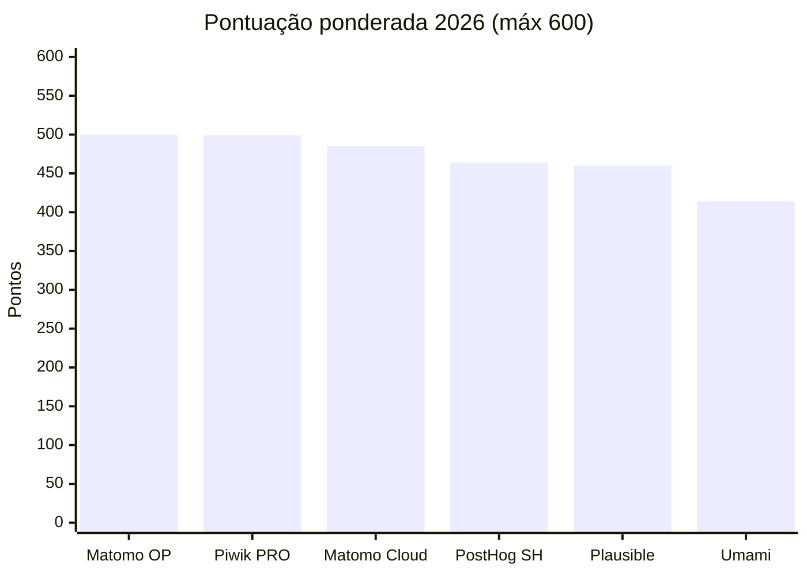
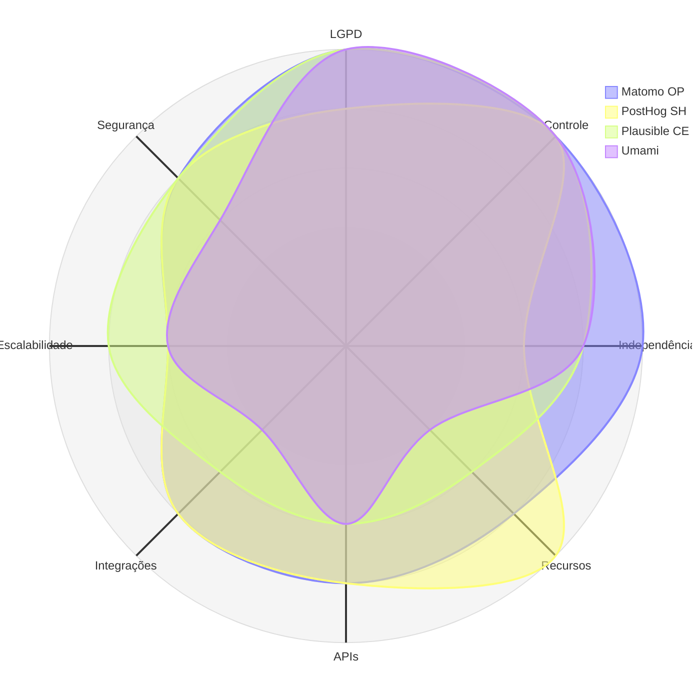

# 05 — Matriz de Decisão Ponderada

> **Método:** MAUT — Multi-Attribute Utility Theory
> **Anterior:** [04 — Panorama de mercado](04-mercado.md) · **Próximo:** [06 — ADR-002](06-adr-002.md)

> **📌 Revisão 2026**
> Ranking reflete os pesos revisados aprovados no [ADR-002](06-adr-002.md) — C03 (TCO) rebaixado a 0; 15 pontos redistribuídos entre C05, C06, C08, C09, C10, C11. Notas preservadas — mudou peso, não avaliação. Racional em [`03-criterios.md §4`](03-criterios.md#4-critérios-e-pesos).

---

## Sumário

- [1. Parâmetros](#1-parâmetros)
- [2. Matriz consolidada](#2-matriz-consolidada)
- [3. Ranking](#3-ranking)
- [4. Justificativa nota a nota](#4-justificativa-nota-a-nota)
- [5. Sensibilidade](#5-sensibilidade)
- [6. Dominância](#6-dominância)
- [7. Conclusão](#7-conclusão)

---

## 1. Parâmetros

| Parâmetro | Valor |
|-----------|-------|
| Critérios | 12 |
| Soma dos pesos | 120 |
| Escala | 1 a 5 (inteiros) |
| Máximo | 600 |
| Fórmula | $S_p = \sum_i w_i \cdot n_{p,i}$ |
| Plataformas | 4 no escopo (Matomo OP, PostHog SH, Plausible CE, Umami) + 2 contingências (Matomo Cloud, Piwik PRO) |

**Pesos aplicados (revisão 2026):** C01=15, C02=15, C03=0, C04=10, C05=13, C06=13, C07=10, C08=13, C09=12, C10=7, C11=7, C12=5.

---

## 2. Matriz consolidada

### 2.1 Notas

| Plataforma | C01 | C02 | C03 | C04 | C05 | C06 | C07 | C08 | C09 | C10 | C11 | C12 |
|-----------|:---:|:---:|:---:|:---:|:---:|:---:|:---:|:---:|:---:|:---:|:---:|:---:|
| **Matomo On-Premise** | 5 | 5 | 5 | 5 | 4 | 4 | 4 | 3 | 4 | 3 | 4 | 4 |
| **Plausible CE** | 5 | 5 | 5 | 4 | 3 | 3 | 3 | 4 | 4 | 3 | 3 | 4 |
| **Matomo Cloud** ⁽ᶜ⁾ | 4 | 3 | 3 | 4 | 5 | 4 | 4 | 4 | 4 | 5 | 4 | 4 |
| **Piwik PRO** ⁽ᶜ⁾ | 5 | 4 | 2 | 2 | 5 | 4 | 4 | 5 | 5 | 4 | 2 | 4 |
| **Umami** | 5 | 5 | 5 | 4 | 2 | 3 | 2 | 3 | 3 | 4 | 3 | 3 |
| **PostHog auto-hospedado** | 4 | 5 | 3 | 3 | 5 | 4 | 4 | 3 | 4 | 1 | 4 | 4 |

⁽ᶜ⁾ Contingência formal do ADR-002 se a premissa P2 (competência STI) for invalidada.

### 2.2 Pontuação ponderada

Pesos revisados 2026 (C03=0).

| Plataforma | C01 | C02 | C03 | C04 | C05 | C06 | C07 | C08 | C09 | C10 | C11 | C12 | **Total** |
|-----------|----:|----:|----:|----:|----:|----:|----:|----:|----:|----:|----:|----:|----------:|
| **Matomo On-Premise** | 75 | 75 | 0 | 50 | 52 | 52 | 40 | 39 | 48 | 21 | 28 | 20 | **500** |
| Piwik PRO ⁽ᶜ⁾ | 75 | 60 | 0 | 20 | 65 | 52 | 40 | 65 | 60 | 28 | 14 | 20 | **499** |
| Matomo Cloud ⁽ᶜ⁾ | 60 | 45 | 0 | 40 | 65 | 52 | 40 | 52 | 48 | 35 | 28 | 20 | **485** |
| **PostHog auto-hospedado** | 60 | 75 | 0 | 30 | 65 | 52 | 40 | 39 | 48 | 7 | 28 | 20 | **464** |
| **Plausible CE** | 75 | 75 | 0 | 40 | 39 | 39 | 30 | 52 | 48 | 21 | 21 | 20 | **460** |
| **Umami** | 75 | 75 | 0 | 40 | 26 | 39 | 20 | 39 | 36 | 28 | 21 | 15 | **414** |

Ranking completo com plataformas fora do escopo em `anexos/matriz.md` e `anexos/historico/`.

---

## 3. Ranking

| # | Plataforma | Pontos | % | Faixa | Papel na arquitetura |
|--:|-----------|------:|--:|-------|----------------------|
| 🥇 **1** | **Matomo On-Premise** | **500** | **83,3 %** | 🟢 Recomendada | **Padrão do parque** (portais + sites gov) |
| 🥈 2 | Piwik PRO ⁽ᶜ⁾ | 499 | 83,2 % | 🟢 Recomendada | Contingência se P2 falhar |
| 🥉 3 | Matomo Cloud ⁽ᶜ⁾ | 485 | 80,8 % | 🟢 Recomendada | Contingência gerenciada |
| 4 | **PostHog auto-hospedado** | 464 | 77,3 % | 🟡 Viável | **Product analytics no Xvia** |
| 5 | **Plausible CE** | 460 | 76,7 % | 🟡 Viável | Alternativa cookieless simples |
| 6 | **Umami** | 414 | 69,0 % | 🟠 Condicionada | Referência de leveza; não cobre funil |

### 3.1 Desempate 1º–2º

Matomo OP (500) × Piwik PRO (499) — 1 ponto, dentro da margem da escala (limitação L7). Regra de desempate ([`03-criterios.md §6`](03-criterios.md#6-fórmula-de-agregação)):

| Nível | Matomo OP | Piwik PRO | Vencedor |
|-------|:---------:|:---------:|----------|
| 1º — C01 (LGPD) | 5 | 5 | Empate |
| 2º — C02 (Controle) | **5** | 4 | **Matomo OP** |

Preferência pelo Matomo se sustenta em superioridade estrita em C02, C04 (Independência 5 vs. 2) e C11 (Comunidade 4 vs. 2) — três critérios estruturais que a soma nivela.

### 3.2 Visualização

Matomo OP tem cobertura uniforme em conformidade, governança e capacidade. PostHog SH mostra perfil de product analytics — forte em capacidade, fraco em operação (C10=1, não representado no radar). Plausible e Umami afundam em analíticos por design cookieless enxuto.

---

## 4. Justificativa nota a nota

Cada nota remete à definição operacional em [`03-criterios.md §5`](03-criterios.md#5-definição-operacional).

### 4.1 Matomo On-Premise — 500 pontos

| Critério | Nota | Justificativa |
|----------|:----:|---------------|
| C01 — LGPD | **5** | Cookieless configurável; anonimização de IP até 4 bytes; sem transferência internacional; retenção definida pelo Estado; opt-out nativo. **Precedente CNIL** reconhece configuração específica como isenta de consentimento — única com precedente favorável de DPA. |
| C02 — Controle | **5** | Dado bruto em MySQL/MariaDB sob custódia do Estado; SQL direto; export e eliminação verificáveis. |
| C03 — TCO | 5 | ~R$ 235 k marginal 5 anos (P1/P2/R4 absorvem infra/kernel). Detalhe em `anexos/historico/comparativos/custo.md`. |
| C04 — Independência | **5** | GPL v3; código auditável; fork viável; direito perpétuo; múltiplas hospedagens. |
| C05 — Recursos | 4 | Cobertura 75–89 %. Cobre eventos, dimensões, metas, funis, segmentação, tempo real, e-commerce. **Não 5**: heatmap, session recording, form analytics, A/B testing são **plugins pagos** no On-Premise. |
| C06 — APIs | 4 | Reporting API HTTP (JSON/XML/CSV/TSV/HTML/RSS); Tracking API; SDK PHP oficial; SDKs móveis oficiais; SQL direto ao bruto. **Não 5**: sem GraphQL nem webhooks nativos; SDKs Py/Node comunitários. |
| C07 — Integrações | 4 | Tag Manager nativo + GTM; SAML/OIDC (plugin pago); WordPress/Drupal; **SQL direto habilita Metabase, Superset, Power BI, Grafana** sem API — vantagem estrutural. **Não 5**: sem conectores certificados; SSO pago. |
| C08 — Escalabilidade | 3 | Atende cenário de referência (12M PV/mês) com tuning. Coleta escala horizontal; processamento parcial. **Gargalo estrutural de arquivamento** + limite MySQL para escrita. Mitigável com QueuedTracking + Redis. |
| C09 — Segurança | 4 | Gestão de CVE ativa; MFA TOTP nativo; RBAC granular; log de auditoria; programa de disclosure. **Não 5**: sem certificação de terceiro — inaplicável a auto-hospedado (responsabilidade recai na infra). |
| C10 — Operação | 3 | Complexidade moderada: PHP + MySQL + Redis + cron + tuning. ~0,3 FTE permanente. |
| C11 — Comunidade | 4 | Grande e ativa; 15+ anos; releases regulares; marketplace extenso; **adoção institucional** (Comissão Europeia). **Não 5**: governança concentrada na InnoCraft; poucos profissionais no BR. |
| C12 — Documentação | 4 | Extensa oficialmente; guias de usuário, dev, API, implantação, otimização. **Não 5**: cobertura irregular de operação em escala; tradução parcial pt-BR. |

### 4.2 PostHog auto-hospedado — 464 pontos

| Critério | Nota | Justificativa |
|----------|:----:|---------------|
| C01 — LGPD | 4 | Auto-hospedado elimina transferência; anonimização e retenção configuráveis. **Não 5**: produto é orientado a identificação e session replay — configuração conforme exige trabalho ativo; padrão de fábrica não é privacy-first. |
| C02 — Controle | **5** | Dado bruto em ClickHouse sob custódia; HogQL e SQL direto. |
| C03 — TCO | 3 | ~R$ 955 k marginal 5 anos — Kafka + ClickHouse dedicado + MinIO **fora do padrão SETDIG**, abatimento parcial. |
| C04 — Independência | 3 | Core MIT, mas EE proprietária; **suporte a self-host K8s descontinuado em 2023**; divergência crescente entre OSS e nuvem. |
| C05 — Recursos | **5** | Cobertura ≥ 90 %: product analytics, funis, coortes, retenção, jornada, session replay, feature flags, experimentos, surveys, HogQL, data warehouse. |
| C06 — APIs | 4 | REST completa (leitura/escrita/admin); webhooks nativos; SDKs oficiais em várias linguagens; HogQL para SQL. **Não 5**: sem GraphQL; rate limits relevantes na nuvem. |
| C07 — Integrações | 4 | Ampla biblioteca; SSO disponível; ClickHouse conecta a Grafana/Superset/Metabase. **Não 5**: SAML é EE pago; sem conector Power BI. |
| C08 — Escalabilidade | 3 | ClickHouse escala, mas `docker-compose` **não suportado** para volume alto e Helm oficial deprecado. Capacidade existe — caminho suportado não. |
| C09 — Segurança | 4 | Aberto; gestão de CVE ativa; SOC 2 na nuvem; RBAC + auditoria. Penalizado por superfície ampla (6 componentes) no self-host. |
| C10 — Operação | **1** | **Mínima.** Django + PG + ClickHouse + Kafka + Redis + object storage, backup coordenado, **sem suporte do fornecedor**. Exige equipe dedicada especializada — incompatível com R5 (sem ampliação STI). |
| C11 — Comunidade | 4 | Grande e ativa; cadência elevada. **Não 5**: concentrada na nuvem, pouco material de self-host em escala. |
| C12 — Documentação | 4 | Excelente para uso do produto e nuvem. **Rebaixada**: docs de self-hosting explicitamente "não suportado" e substancialmente menores. |

### 4.3 Plausible CE — 460 pontos

| Critério | Nota | Justificativa |
|----------|:----:|---------------|
| C01 — LGPD | **5** | Sem cookies, sem armazenamento de IP, sem identificador persistente — trivial: se não há dado pessoal, LGPD não incide (art. 12). Dispensa CMP, consentimento e RIPD específico. |
| C02 — Controle | **5** | CE: dado bruto em ClickHouse sob custódia; SQL direto. |
| C03 — TCO | 5 | ~R$ 120 k marginal 5 anos. |
| C04 — Independência | 4 | AGPL v3 (copyleft de rede). **Não 5**: governança concentrada; divergência CE vs. nuvem paga. |
| C05 — Recursos | 3 | 55–74 %. Cobre PV, eventos, metas, funis, campanhas, tempo real. **Não cobre**: heatmap, session replay, coortes, retenção, atribuição multicanal, dimensões customizadas sem plano pago. |
| C06 — APIs | 3 | Stats API REST + Events API para ingestão, bem documentadas, Bearer, versionadas. **Não 4**: sem SDK oficial, sem webhooks, admin limitada. |
| C07 — Integrações | 3 | Via API; ClickHouse conecta a Grafana/Superset/Metabase; WordPress; Slack. **Não 4**: sem Tag Manager, sem SSO, sem conector Power BI. |
| C08 — Escalabilidade | 4 | ClickHouse escala confortavelmente para centenas de milhões de eventos; sem arquivamento. **Não 5**: ingestão síncrona sem fila. |
| C09 — Segurança | 4 | Aberto e auditável; superfície reduzida; gestão de CVE ativa. Penalizado por MFA ausente e RBAC básico — mitigável por proxy autenticador. |
| C10 — Operação | 3 | 3 componentes (Elixir + PG + ClickHouse); container oficial; sem cron crítico. Competência ClickHouse escassa. |
| C11 — Comunidade | 3 | Moderada e crescente; releases regulares. Adoção institucional pública ainda incipiente. |
| C12 — Documentação | 4 | Clara, organizada, atualizada; guias de self-hosting + API. **Não 5**: sem tradução, cobertura limitada de operação em escala. |

### 4.4 Umami — 414 pontos

| Critério | Nota | Justificativa |
|----------|:----:|---------------|
| C01 — LGPD | **5** | Sem cookies; IP hash com sal rotativo; sem identificador persistente. Conformidade por design. |
| C02 — Controle | **5** | Auto-hospedado; SQL direto a PostgreSQL ou MySQL. |
| C03 — TCO | 5 | ~R$ 100 k marginal 5 anos — o menor entre soberanas viáveis. |
| C04 — Independência | 4 | MIT — permissiva. **Não 5**: permite fechar versões futuras; governança concentrada. |
| C05 — Recursos | 2 | 35–54 %. Cobre PV, eventos básicos, campanhas, geo, tempo real. **Não cobre**: **funis** (RF-27 é *Must have*), coortes, retenção, heatmap, session replay, jornada, atribuição, segmentação avançada, busca interna, e-commerce, Tag Manager. |
| C06 — APIs | 3 | REST para leitura e ingestão, Bearer; SQL direto ao bruto. **Não 4**: doc limitada, sem versionamento explícito, sem webhooks. |
| C07 — Integrações | 2 | Exige desenvolvimento; sem Tag Manager, sem SSO, sem conector BI. SQL direto é a única via prática. |
| C08 — Escalabilidade | 3 | Atende cenário de referência com banco relacional. ClickHouse é nuvem — menos documentado no self-host. Sem fila. |
| C09 — Segurança | 3 | Base pequena e auditável; gestão de CVE presente mas cadência irregular. Penalizado por MFA ausente e RBAC básico. |
| C10 — Operação | 4 | Auto-hospedado simples: 2 componentes, container oficial, sem cron, update trivial. |
| C11 — Comunidade | 3 | Moderada; releases regulares; base concentrada em projetos pequenos. |
| C12 — Documentação | 3 | Suficiente para instalar e operar; incompleta em tópicos avançados. |

### 4.5 Contingências — resumo curto

**Piwik PRO (499)** — conformidade é proposta de valor central (Consent Manager + CDP + TM em produto único, RGPD/HIPAA); Private Cloud ou On-Premises com suporte. **Contra:** proprietária (C04=2), custo relevante (C03=2, estimativa; preço não é público), comunidade praticamente inexistente (C11=2).

**Matomo Cloud (485)** — mesmas capacidades do OP com premium incluídos (heatmap, funis, session recording, form analytics, A/B, media, roll-up). Operação zero (C10=5). **Contra:** transferência internacional (C01=4), SaaS multi-tenant (C02=3), custo recorrente em moeda estrangeira exposto a câmbio e pico (C03=3), sem SQL direto.

Ambas são contingências formais do ADR-002 se P2 (competência STI) for invalidada.

---

## 5. Sensibilidade

Cenários em [`03-criterios.md §4.1`](03-criterios.md#41-cenários-de-sensibilidade). Resultado resumido — planilha completa em `anexos/matriz.md`.

| Cenário | Líder | Matomo OP mantém pódio? |
|---------|-------|:-----------------------:|
| **Base (2026)** | Matomo OP (500) | 🥇 |
| Conformidade máxima | Matomo OP (540) | 🥇 |
| Custo pleno (histórico ADR-001) | Matomo OP (515) | 🥇 |
| Capacidade analítica | Empate Matomo OP / Piwik PRO (500) | 🥇 empate |
| Operação enxuta | Matomo Cloud (490) | 🥉 (480) |

**Robustez atingida:** liderança em 3 cenários + 1 empate = 4 de 5. Cenário "Operação enxuta" elege **outra modalidade do mesmo produto** (Matomo Cloud) — reforça, não contradiz, a escolha do produto. Consistente com a contingência do ADR-002.

### 5.1 Ponto de virada

Método: variar peso de um critério até o líder mudar.

| Cenário de virada | Alteração necessária | Plausibilidade |
|-------------------|---------------------|:--------------:|
| PostHog SH assumir liderança | Reduzir C10 (Operação) para ≤ 2 **e** C04 para ≤ 3 | 🔴 Baixa (contraria R5) |
| Plausible assumir liderança | Reduzir C05 para ≈ 1 **ou** elevar C08 para ≈ 45 | 🔴 Muito baixa (RN-02 exige funil) |
| Umami assumir liderança | Elevar C03 para ≈ 45 e cortar C05, C07 | 🔴 Muito baixa (lacuna funcional grande) |
| Matomo Cloud assumir liderança | Elevar C10 para ≈ 30 | 🟠 Média se P2 falhar |
| Piwik PRO assumir liderança | Reduzir C04 para ≤ 3 e C03 para ≈ 3 (irrelevante — peso 0) | 🟠 Média em cenário "capacidade máxima" |

Nenhum ponto de virada plausível conduz a plataforma estruturalmente distinta da recomendada. O único caminho realista é mudar de modalidade do mesmo produto (OP → Cloud).

---

## 6. Dominância

Alternativa A **domina** B se A ≥ B em todos critérios e estritamente > em ao menos um. Independe de peso.

| Dominante | Dominada | Superior em | Inferior em |
|-----------|----------|------------|-------------|
| **Matomo OP** | Umami | C05, C06, C07, C09, C11, C12 | C10 (Operação) |
| **Plausible CE** | Umami | C05, C06, C07, C09 | C10 |

Nenhuma das 4 no escopo é dominada estritamente. Todas na fronteira de Pareto.

**Umami quase dominado por Plausible + Matomo OP** — vence apenas em C10 (Operação). Sinal de que Umami tem espaço estreito: só faz sentido se operação enxuta prevalecer sobre cobertura funcional — cenário incompatível com RN-02 (funil obrigatório).

---

## 7. Conclusão

> **✅ Bloco de Decisão — Resultado**
>
> **Matomo On-Premise: 500/600 (83,3 %)** — 🟢 Recomendada. Padrão do parque (portais + sites gov MS).
>
> **PostHog auto-hospedado: 464/600 (77,3 %)** — 🟡 Viável. **Melhor opção soberana de product analytics** — habilita adoção como camada complementar no portal Xvia (ADR-002 §6.2). Condicionante: C10=1 exige plano de capacitação ou suporte contratado.
>
> **Contingências formais:** Piwik PRO (499) e Matomo Cloud (485) — ambas 🟢 Recomendadas. Ativação se P2 (competência STI) for invalidada.
>
> **Alternativas soberanas simples:** Plausible CE (460) e Umami (414) permanecem como referência de leveza para portais classe C. Umami reprovado em RN-02 (funil).
>
> **Robustez:** 4 de 5 cenários com liderança do produto Matomo (OP ou Cloud). Dominância estrita não muda ranking dentro do escopo.
>
> **Decomposição da vantagem:** vantagem sobre 2º colocado (1 ponto) é dentro da margem. Preferência pelo Matomo se sustenta em superioridade estrita em C02, C04, C11 — três critérios estruturais que a soma nivela.

### Ressalvas

1. **Margem 1º–2º é mínima** (500 vs. 499). Preferência estrutural pelo Matomo por C02, C04, C11.
2. **Recomendação condicionada à modalidade.** Se P2 falhar, Matomo Cloud ou Piwik PRO.
3. **PostHog SH exige mitigação de C10.** Sem plano de capacitação/suporte, adoção é frágil.
4. **Umami reprovado em funil (RF-27, *Must*).** Só serve para portais sem exigência de funil.
5. **Nenhuma nota foi medida em ambiente do Estado.** PoC prevista na Onda 1 do [`08-roadmap.md`](08-roadmap.md).

---

## Navegação

| ⬅️ Anterior | ➡️ Próximo |
|------------|-----------|
| [04 — Panorama de mercado](04-mercado.md) | [06 — ADR-002](06-adr-002.md) |
