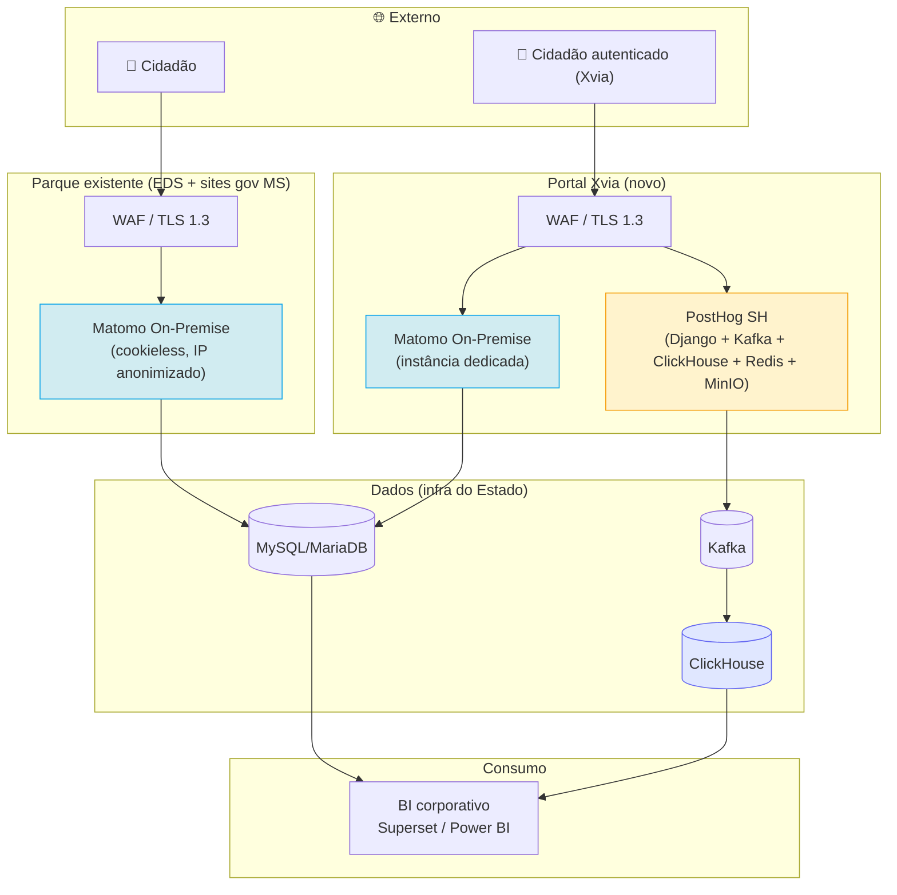

# 06 — ADR-002: Matomo padrão do parque + PostHog complementar no portal Xvia

> **Formato:** Michael Nygard / MADR 4.0
> **Substitui:** ADR-001 (arquivado em `../anexos/historico/docs/adr-001.md`)
> **Anterior:** [05 — Matriz de decisão](05-matriz.md) · **Próximo:** [07 — Recomendação](07-recomendacao.md)

---

## Sumário

- [Metadados](#metadados)
- [1. Contexto](#1-contexto)
- [2. Problema](#2-problema)
- [3. Direcionadores](#3-direcionadores)
- [4. Alternativas](#4-alternativas)
- [5. Trade-offs](#5-trade-offs)
- [6. Decisão](#6-decisão)
- [7. Justificativa](#7-justificativa)
- [8. Consequências](#8-consequências)
- [9. Riscos assumidos](#9-riscos-assumidos)
- [10. Condições de invalidação](#10-condições-de-invalidação)
- [11. Revisão futura](#11-revisão-futura)
- [12. Aprovação](#12-aprovação)

---

## Metadados

| Campo | Valor |
|-------|-------|
| Identificador | ADR-002 |
| Título | Matomo On-Premise padrão do parque + PostHog auto-hospedado complementar no portal Xvia |
| Status | 🟡 **Proposto** |
| Data | 2026-08-25 |
| Autor | Arquitetura de Soluções — SETDIG |
| Decisores | Secretário Executivo SETDIG · Superintendentes SGD/STI · DPO · SegInfo · Time Xvia |
| Consultados | Comunicação Social · Órgãos setoriais · Equipe BI |
| Informados | Administração Direta e Indireta estadual |
| Substitui | ADR-001 (arquivado) |
| Escopo | Portais + serviços digitais do Executivo estadual + portal Xvia |
| Prazo de revisão | 24 meses (agosto/2028), ou antecipado por gatilho §11 |

```mermaid
stateDiagram-v2
    direction LR
    ADR001["ADR-001 (Depreciado)"] --> [*]
    [*] --> Proposto: Emissão (2026-08-25)
    Proposto --> Aceito: Homologação
    Proposto --> Rejeitado: Não homologado
    Aceito --> Depreciado: ADR-003 supersedes
    Aceito --> Aceito: Revisão bienal
```

---

## 1. Contexto

**Substitui ADR-001** por duas mudanças de premissa formalizadas em agosto/2026:

### 1.1 Rebaixamento do TCO

Premissa on-premise (P1/P2/R4) sempre esteve registrada. No ADR-001, C03 (TCO) tinha peso 15 (12,5 %), o mais alto junto de LGPD/Controle. Esse peso funcionava como filtro implícito contra plataformas de stack rico (PostHog OSS, TCO 4× o Matomo).

Com o parque de infra consolidado e a premissa on-prem confirmada como direcionador estrutural, o peso 15 produzia distorção: penalizava plataformas cujo custo marginal já é absorvido, sem gerar economia real.

**Consequência:** C03 rebaixado a **peso 0** (informativo). Os 15 pontos redistribuídos entre critérios técnicos e funcionais. Racional em [`03-criterios.md §4`](03-criterios.md#4-critérios-e-pesos). Custo continua modelado em `anexos/historico/comparativos/custo.md` para dimensionamento e prestação de contas ao TCE-MS.

### 1.2 Entrada do portal Xvia

Governo MS lançará **Xvia como superapp cidadão** — porta única para serviços transacionais. Perfil analítico difere do parque atual: jornada identificada, experimentação (feature flags), coortes/retenção sobre autenticados, session replay em serviços complexos (com consentimento).

Núcleo do domínio de **product analytics** — PostHog é referência de mercado. Matomo cobre web analytics tradicional com excelência, mas não é o produto adequado para o eixo de product analytics do Xvia.

### 1.3 Ranking revisado

Sob os pesos revisados ([`05-matriz.md §2.2`](05-matriz.md#22-pontuação-ponderada)):

| # | Plataforma | Score 2026 | Score ADR-001 |
|--:|-----------|-------:|--------------:|
| 🥇 1 | Matomo On-Premise | **500** (83,3 %) | 520 |
| 🥈 2 | Piwik PRO | **499** (83,2 %) | 465 |
| 🥉 3 | Matomo Cloud | **485** (80,8 %) | 465 |
| 4 | PostHog auto-hospedado | **464** (77,3 %) | 455 |
| 5 | Plausible CE | **460** (76,7 %) | 485 |
| 6 | Umami | **414** (69,0 %) | 445 |

Matomo OP mantém liderança (1 ponto sobre Piwik PRO, desempate por C02). PostHog SH sobe para #4 — **melhor opção soberana de product analytics** disponível — coerente com adoção no Xvia.

### 1.4 O que permanece do ADR-001

- Metodologia (MAUT + ATAM + Gartner + ADR): inalterada.
- Notas atribuídas: preservadas — mudança é só de peso.
- Triagem eliminatória: OWA continua eliminado por E6; Clarity e Cloudflare como primárias eliminadas.
- Lacunas L1–L7 do parque Matomo: continuam pendentes.
- Direcionadores (soberania, LGPD, independência, sustentabilidade): inalterados.

---

## 2. Problema

> **🚨 Declaração do problema**
>
> **ADR-001 não contempla o portal Xvia**, cujo perfil exige capacidades de product analytics (jornada identificada, feature flags, experimentação, session replay consentido) que não são a força do Matomo. Simultaneamente, C03=15 filtrava plataformas de stack rico — inclusive as que atenderiam ao Xvia — mesmo com custo marginal para o Estado.
>
> **Consequência:** sob ADR-001, única opção "aprovada" para Xvia seria Matomo puro (não cobre product analytics) ou exceção caso-a-caso (frágil em prestação de contas).

---

## 3. Direcionadores

Reponderados na revisão 2026:

| ID | Direcionador | Criticidade | Peso |
|----|-------------|:-----------:|-----:|
| D1 | Soberania de dados | 🔴 Crítico | 15 |
| D2 | Conformidade LGPD | 🔴 Crítico | 15 |
| D3 | Independência tecnológica | 🟠 Alto | 10 |
| D5 | Capacidade analítica | 🟠 Alto | 13 |
| D6 | Integração com BI | 🟠 Alto | 23 (APIs 13 + Integr. 10) |
| D8 | Elasticidade sob pico | 🟠 Alto | 13 |
| — | Segurança (transversal) | 🔴 Crítico | 12 |
| D4 | Sustentabilidade operacional | 🟡 Médio | 7 |
| — | Sustentabilidade do produto | 🟡 Médio | 12 (Comun. 7 + Docs 5) |
| D7 | Economicidade *(informativo)* | 🟢 Baixo | 0 |

**Restrições rígidas (inalteradas):** R1 (LGPD aplicável), R2 (transferência internacional exige art. 33), R3 (paga exige licitação), R5 (sem ampliação STI), veto absoluto DPO/SegInfo.

---

## 4. Alternativas

Arranjos de arquitetura considerados:

| # | Arranjo | Situação |
|---|---------|----------|
| AR1 | Matomo puro em todo o parque + Xvia | ❌ Não cobre product analytics do Xvia |
| **AR2** | **Matomo parque + PostHog complementar no Xvia** | ✅ **Selecionada** |
| AR3 | PostHog substitui Matomo no Xvia | ❌ Abre mão do precedente CNIL / cookieless do Matomo em ambiente sensível |
| AR4 | PostHog + Matomo em todo o parque | ❌ Sem valor incremental fora do Xvia; custo marginal ampliado |
| AR5 | Piwik PRO substitui Matomo no parque | ❌ Regressão de soberania (C04=2); troca ativo open source consolidado por proprietário |

### 4.1 Descartes

- **AR1**: Xvia sem product analytics = cegueira funcional em produto de alto valor.
- **AR3**: Matomo tem precedente CNIL + dispensa de consentimento; substituí-lo exigiria refazer base legal sem ganho — força do PostHog está em identificado, não em audiência anônima.
- **AR4**: portais de conteúdo já cobertos 100 % pelo Matomo; 2 stacks duplica operação, orçamento e overhead sem valor.
- **AR5**: Piwik PRO é contingência formal (§6.6), não substituição planejada.

---

## 5. Trade-offs

| # | Ganho | Perda | Racional |
|---|-------|-------|----------|
| T1 | Cobertura product analytics no Xvia (funil identificado, feature flags, replay, HogQL) | Overhead ~+55 KB gzip, +50–200 ms LCP em 3G | Xvia é transacional identificado; degradação marginal aceitável em troca da instrumentação. RNF-02 (LCP ≤ 50 ms) permanece válido no resto do parque |
| T2 | Product analytics soberano — PostHog SH em infra do Estado | Operar 6 componentes distribuídos sem suporte oficial | Capacitação STI (Onda 5) + reserva orçamentária para suporte especializado ClickHouse/Kafka se o gate falhar |
| T3 | Governança distribuída no Xvia (Matomo=audiência, PostHog=produto) | Complexidade de política de retenção coordenada | Endereçado em [`../comparativos/coexistencia-matomo-posthog.md`](../comparativos/coexistencia-matomo-posthog.md) — "qual evento vai onde" |
| T4 | Recomendação ADR-001 preservada no parque | Duas arquiteturas de referência distintas (parque puro Matomo; Xvia híbrido) | Diferenciação por perfil de uso, não incoerência arquitetural |
| T5 | Custo deixa de filtrar decisões | Perda do sinal de disciplina orçamentária que C03=15 fornecia | Substituído por monitoramento explícito §11.3 — desvio ≤ 15 % como alerta |
| T6 | Piwik PRO e Matomo Cloud sobem para faixa "Recomendada" | Complexidade de decisão de contingência (2 opções fortes) | Ordem de preferência explícita em §6.6 |

> **📌 Trade-off crítico aceito**
> **T1 (overhead LCP)** é o mais sensível. Aceito deliberadamente com gatilho de reavaliação: LCP > 75 ms em 3G sustentado por 2 meses → reavaliar PostHog no Xvia (G9 §11.2). Não é "overhead deixa de existir"; é overhead monitorado e mitigável.

---

## 6. Decisão

> **✅ DECISÃO ADR-002**
>
> **6.1 — Plataforma padrão do parque (EDS + sites gov MS)**
> **Matomo On-Premise** como padrão único do parque existente — portais institucionais, sites gov, serviços digitais de conteúdo. Confirma ADR-001 §6.1 sob pesos revisados.
>
> **6.2 — Arquitetura do novo portal Xvia**
> Arquitetura **híbrida deliberada**: **Matomo On-Premise + PostHog auto-hospedado em paralelo**, com segmentação de responsabilidade:
> - **Matomo**: audiência agregada, campanhas, SEO, conteúdo, base legal cookieless simplificada.
> - **PostHog**: jornada identificada, funil transacional, feature flags, experimentação, session replay **consentido** e mascarado.
>
> Ambos em stack próprio do Estado, sem transferência internacional.
>
> **6.3 — Plataforma complementar aprovada (opcional)**
> **Plausible CE** como opção facultativa em portais de conteúdo de altíssimo volume e baixa criticidade analítica, mediante justificativa do órgão. Uso não obrigatório.
>
> **6.4 — Plataformas vedadas como padrão**
> - **Google Analytics 4**: vedado em portais e serviços do Estado.
> - **Open Web Analytics**: vedado por falha em critério eliminatório de segurança.
> - **Microsoft Clarity e Cloudflare WA**: fora do escopo atual (revisões futuras podem readmitir com RIPD específico).
>
> **6.5 — Contingências formais**
> Se o *gate* de validação da premissa **P2** (competência STI sustentável) falhar:
>
> **Parque (contingência do Matomo OP):**
> 1. **Matomo Cloud** (#3, 485 pts — "Recomendada"; preserva produto e caminho de retorno ao OP);
> 2. **Piwik PRO Private Cloud** (#2, 499 pts — conformidade forte, dependência contratual, menor C04).
>
> **Xvia (contingência do PostHog SH):**
> 1. **PostHog Cloud EU** (com RIPD e mitigação de transferência via região UE);
> 2. **Matomo puro no Xvia** com plugins de funil/heatmap/replay — cobre 60–70 % do caso, sacrifica feature flags e experimentação estruturados.
>
> Ativação exige **novo ADR (ADR-003)** — não basta decisão operacional.

### 6.1 Arquitetura-alvo



Detalhes em [`07-recomendacao.md`](07-recomendacao.md) e em [`../comparativos/coexistencia-matomo-posthog.md`](../comparativos/coexistencia-matomo-posthog.md).

---

## 7. Justificativa

**J1 — Quantitativo:** Matomo OP mantém liderança (500/600, 83,3 %, "Recomendada"). PostHog SH sobe para #4 (464/600, 77,3 %, "Viável") — **maior pontuação soberana de product analytics** do estudo. [`05-matriz.md`](05-matriz.md).

**J2 — Xvia difere estruturalmente:** superapp cidadão = autenticado, transacional, experimentação. Matomo cobre WA tradicional; PostHog cobre product analytics. Xvia precisa dos dois eixos, não da soma linear.

**J3 — Overhead LCP aceitável:** usuário chega ao Xvia com intenção de serviço; abandono por LCP qualitativamente menor que em conteúdo. LCP alvo ≤ 75 ms em 3G registrado como métrica-gatilho §11.

**J4 — PostHog SH preserva soberania:** sob custódia do Estado, sem transferência. Configuração LGPD exige trabalho ativo (mascaramento agressivo padrão; replay opt-in) — equivalente ao já feito no Matomo. DPIA do replay é o principal item novo, coberto por R-11 (§9).

**J5 — Ranking revisado remove filtro implícito do TCO:** sob C03=15, PostHog SH ficava em #5 (455) com 65 pts abaixo do Matomo OP — majoritariamente artefato de peso alto de custo marginal. Sob pesos revisados, fica em #4 (464), 36 pts abaixo — diferença agora reflete atributos técnicos comparáveis (C10=1 vs. C10=3), não penalização financeira.

**J6 — Continuidade do parque preservada:** ADR-002 **não desloca** Matomo do parque. Base instalada, competência STI e arquitetura de referência do ADR-001 seguem valendo. Revisão é aditiva (novo perfil de uso no Xvia), não substitutiva.

**J7 — Aderência legal idêntica ao ADR-001:** operação continua integralmente sob custódia do Estado.

---

## 8. Consequências

### 8.1 Positivas

| # | Consequência | Prazo |
|---|-------------|-------|
| C+1 | Product analytics soberano habilitado no Xvia | Onda 5 |
| C+2 | Continuidade do parque preservada; zero migração | Imediato |
| C+3 | Filtro implícito do C03 removido — decisões passam a se pautar por atributos técnicos/funcionais | Imediato |
| C+4 | Matomo Cloud e Piwik PRO consolidados como contingências "Recomendadas" | Imediato |
| C+5 | Base de comparação Matomo × PostHog em produção real por 12 meses | Onda 5 + 12 meses |
| C+6 | Capacidade de feature flags e experimentação em serviço transacional prioritário | Onda 5 |

### 8.2 Negativas assumidas

| # | Consequência | Mitigação |
|---|-------------|-----------|
| C−1 | Overhead LCP Xvia (~50–200 ms) | G9 §11.2; defer/async; segmentação de eventos; revisar se > 75 ms sustentado |
| C−2 | 2 stacks no Xvia recaem sobre STI | Capacitação ClickHouse/Kafka (Onda 5); reserva orçamentária para suporte especializado |
| C−3 | DPIA adicional para session replay | Compliance mapeado; mascaramento padrão; opt-in explícito |
| C−4 | 2 arquiteturas de referência distintas | Documentação explícita em [`07-recomendacao.md`](07-recomendacao.md) e coexistência |
| C−5 | Custo marginal do PostHog (~R$ 955 k / 5a) deixa de filtrar | Monitorado no §11.3; desvio > 15 % aciona análise |

---

## 9. Riscos assumidos

Riscos R-01 a R-10 preservados do ADR-001 (agora consolidados em [`07-recomendacao.md §Riscos`](07-recomendacao.md#10-riscos)). Novos:

| ID | Risco | Prob. | Impacto | Resposta |
|----|-------|:-----:|:-------:|----------|
| R-11 | Captura acidental de dado sensível em session replay (CPF, saúde) | 🟠 Média | 🔴 Crítico | Mascaramento agressivo padrão; opt-in explícito; DPIA específico; homologação SegInfo antes de ativar |
| R-17 | LCP do Xvia > 75 ms sustentado por overhead do 2º script | 🟡 Baixa | 🟠 Alto | G9 §11.2 aciona reavaliação em 60 dias |
| R-18 | STI não sustenta stack PostHog | 🟠 Média | 🟠 Alto | Capacitação; suporte contratado; fallback Cloud EU |
| R-19 | Divergência Matomo × PostHog no Xvia gera confusão em relatórios | 🟠 Média | 🟡 Médio | Governança explícita de origem por métrica; dashboard consolidado no BI |
| R-20 | PostHog descontinua modalidade auto-hospedada (iniciado em 2023) | 🟢 Muito baixa (curto) / 🟠 Alta (longo) | 🟠 Alto | G3 aciona revisão em 90 dias; fallback Cloud EU com RIPD |

---

## 10. Condições de invalidação

| Premissa | Condição de invalidação | Alternativa |
|----------|------------------------|-------------|
| P1 (infra própria) | Indisponibilidade para Matomo + PostHog com HA | Matomo Cloud + PostHog Cloud EU (com RIPD) |
| P2 (competência STI) | Gate Onda 5 conclui que STI não sustenta PostHog | PostHog Cloud EU |
| P3 (soberania > conveniência) | Decisão institucional inverte prioridade | Reavaliação integral |
| P6 (volume mantido) | Crescimento > 5× baseline do Xvia | Reavaliação de arquitetura de dados |
| Xvia justifica product analytics | Portal entra em produção com rotas 100 % anônimas | Reverter para Matomo puro no Xvia |
| PostHog mantém self-host | Fornecedor descontinua OSS SH | Cloud EU ou fork mantido por comunidade |

---

## 11. Revisão futura

### 11.1 Ordinária

Periodicidade **24 meses** (próxima: agosto/2028). Responsável: Arquitetura de Soluções SETDIG. Participantes obrigatórios: SGD, STI, DPO, SegInfo, Time Xvia. Escopo mínimo: reexecutar matriz com dados atualizados; verificar indicadores §11.3; avaliar gate de 12 meses do PostHog no Xvia. Produto: confirmação ADR-002 ou ADR-003.

### 11.2 Gatilhos antecipados

G1–G8 preservados do ADR-001. Novos:

| # | Gatilho | Prazo de reação |
|---|---------|----------------|
| G9 | LCP Xvia > 75 ms em 3G sustentado por 2 meses | 60 dias |
| G10 | Divergência Matomo × PostHog no Xvia > 15 % por 3 meses | 90 dias |
| G11 | Descontinuidade formal do PostHog OSS SH | 90 dias |
| G12 | Gate 12 meses PostHog no Xvia falha (sem feature flag ativa, sem funil identificado, sem replay em serviço crítico) | 60 dias |

### 11.3 Indicadores

| Indicador | Meta | Fonte | Periodicidade |
|-----------|------|-------|---------------|
| LCP Xvia (p75, 3G) | ≤ 75 ms | RUM / Lighthouse CI | Mensal |
| TCO acumulado × projetado | Desvio ≤ 15 % | Execução orçamentária | Anual |
| Feature flags ativas Xvia | ≥ 3 | PostHog | Trimestral |
| Funis identificados Xvia | ≥ 5 | PostHog | Trimestral |
| Replays com consentimento explícito | 100 % dos capturados | PostHog + registro | Contínua |
| Divergência PV Matomo × PostHog Xvia | ≤ 15 % | Reconciliação mensal | Mensal |

---

## 12. Aprovação

| Papel | Nome | Manifestação | Data |
|-------|------|-------------|------|
| Arquiteto de Soluções (autor) | | Proposto | 2026-08-25 |
| Superintendente SGD | | ☐ De acordo ☐ Ressalvas ☐ Contrário | |
| Superintendente STI | | ☐ De acordo ☐ Ressalvas ☐ Contrário | |
| DPO | | ☐ De acordo ☐ Ressalvas ☐ Contrário | |
| SegInfo | | ☐ De acordo ☐ Ressalvas ☐ Contrário | |
| Time Xvia | | ☐ De acordo ☐ Ressalvas ☐ Contrário | |
| Secretário Executivo SETDIG | | ☐ Homologado ☐ Não homologado | |

### 12.1 Histórico

| Versão | Data | Alteração | Autor |
|--------|------|-----------|-------|
| 1.0 | 2026-08-25 | Emissão inicial — supersedes ADR-001 | Arquitetura de Soluções SETDIG |

---

## Navegação

| ⬅️ Anterior | ➡️ Próximo |
|------------|-----------|
| [05 — Matriz de decisão](05-matriz.md) | [07 — Recomendação](07-recomendacao.md) |
