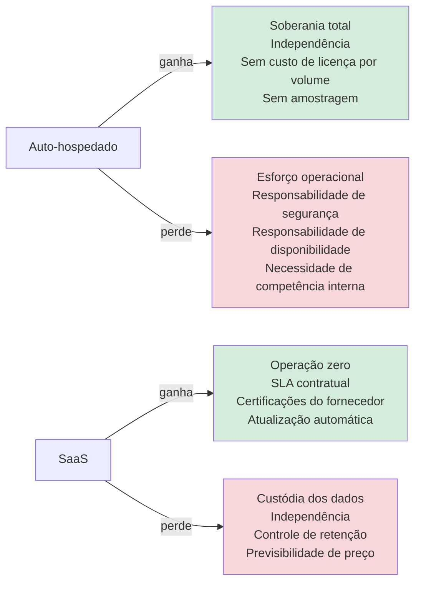
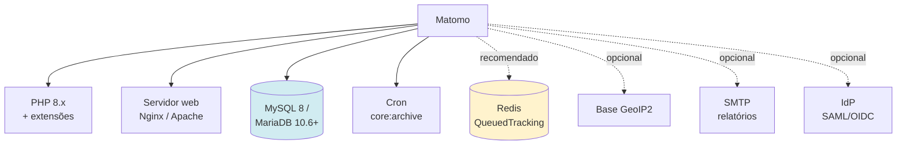

# 06 — Análise de Trade-offs

> **Método:** ATAM — identificação de *sensitivity points*, *trade-off points* e riscos
> **Anterior:** [05 — Comparativo detalhado](05-comparativo-detalhado.md) · **Próximo:** [07 — Matriz de decisão](07-matriz-decisao.md)

---

## Sumário

- [1. Trade-offs estruturais do domínio](#1-trade-offs-estruturais-do-domínio)
- [2. Modelo de análise por plataforma](#2-modelo-de-análise-por-plataforma)
- [3. Matomo On-Premise](#3-matomo-on-premise)
- [4. Matomo Cloud](#4-matomo-cloud)
- [5. Google Analytics 4](#5-google-analytics-4)
- [6. Plausible Community Edition](#6-plausible-community-edition)
- [7. Umami](#7-umami)
- [8. Open Web Analytics](#8-open-web-analytics)
- [9. Adobe Analytics](#9-adobe-analytics)
- [10. Simple Analytics](#10-simple-analytics)
- [11. Microsoft Clarity](#11-microsoft-clarity)
- [12. Cloudflare Web Analytics](#12-cloudflare-web-analytics)
- [13. PostHog](#13-posthog)
- [14. Piwik PRO](#14-piwik-pro)
- [15. Síntese comparativa dos trade-offs](#15-síntese-comparativa-dos-trade-offs)

---

## 1. Trade-offs estruturais do domínio

Antes de analisar plataformas, é necessário explicitar os trade-offs que **existem independentemente da escolha** — são propriedades do domínio, não de um produto.

### TP-01 — Soberania × Facilidade operacional

> **📌 Observação — Este trade-off não tem solução, apenas posicionamento**
> Não existe arquitetura que entregue simultaneamente soberania total e esforço operacional zero. O que existe são **posicionamentos intermediários**: private cloud gerenciada (Piwik PRO), SaaS com região de dados selecionável (Matomo Cloud UE) ou auto-hospedado com suporte contratado.
>
> A decisão sobre onde se posicionar nesse eixo é **institucional, não técnica**. A arquitetura implementa a decisão; não a substitui.

### TP-02 — Riqueza da coleta × Conformidade

| Extremo A: coleta rica | Extremo B: coleta mínima |
|------------------------|--------------------------|
| Identificação de visitante recorrente | Sem identificação persistente |
| Jornada cross-device | Apenas sessão isolada |
| Coortes e retenção reais | Métricas agregadas apenas |
| Atribuição multitoque | Atribuição de último clique ou nenhuma |
| **Requer:** consentimento, RIPD, política de retenção, atendimento a direitos do titular | **Requer:** nada, se realmente anônimo |

> **✅ Bloco de Decisão — Posicionamento recomendado para o setor público**
> Para **portais institucionais e de conteúdo**: coleta mínima (cookieless, IP anonimizado). O valor analítico marginal da identificação persistente não compensa o custo de conformidade.
>
> Para **serviços digitais transacionais**: coleta intermediária — identificação de sessão para permitir análise de funil, sem identificação cross-sessão persistente. Isso permite responder "onde o cidadão abandona o serviço" sem construir perfil individual.
>
> Essa distinção por classe de portal é a arquitetura recomendada em [`09-recomendacao.md`](09-recomendacao.md).

### TP-03 — Retenção longa × Conformidade e custo

| Retenção longa de dado bruto | Retenção curta |
|------------------------------|----------------|
| ✅ Permite reprocessar com novas dimensões | ❌ Reprocessamento impossível |
| ✅ Permite investigação retroativa | ❌ Só o agregado sobrevive |
| ❌ Viola o princípio da necessidade se sem justificativa | ✅ Aderente à LGPD |
| ❌ Custo de armazenamento crescente | ✅ Custo controlado |
| ❌ Degrada desempenho de consulta | ✅ Desempenho estável |
| ❌ Aumenta o impacto de um vazamento | ✅ Reduz superfície de exposição |

**Posicionamento recomendado:** dado bruto por **6 meses**; dado agregado por **60 meses**. O agregado não contém dado pessoal e pode ser retido indefinidamente para série histórica.

### TP-04 — Instância única × Instâncias por órgão

| Instância única multi-site | Instância por órgão |
|---------------------------|--------------------|
| ✅ Economia de escala em infraestrutura | ❌ Custo multiplicado |
| ✅ Visão consolidada do Estado (roll-up) | ❌ Consolidação exige ETL |
| ✅ Operação centralizada | ❌ Operação distribuída ou centralizada com N ambientes |
| ✅ Padronização garantida | ❌ Divergência de configuração |
| ❌ Falha afeta todos os órgãos | ✅ Isolamento de falha |
| ❌ Segregação lógica, não física | ✅ Segregação física |
| ❌ Gargalo de arquivamento compartilhado | ✅ Carga distribuída |

**Posicionamento recomendado:** **instância única** com segregação por permissão, mais uma **instância separada para serviços de alta criticidade** (saúde, assistência social), onde o isolamento justifica o custo adicional.

### TP-05 — Tracking client-side × server-side

| Client-side | Server-side |
|-------------|-------------|
| ✅ Implantação trivial (uma tag) | ❌ Exige alteração na aplicação |
| ✅ Captura contexto do navegador | ❌ Contexto limitado ao que a aplicação enviar |
| ❌ Bloqueado por ad blockers (perda de 10–40 %) | ✅ Não bloqueável |
| ❌ Impacta desempenho da página | ✅ Impacto zero na página |
| ❌ Dados podem ser adulterados pelo cliente | ✅ Dados confiáveis |
| ⚠️ Expõe o endpoint publicamente | ✅ Endpoint interno |

**Posicionamento recomendado:** client-side como padrão; server-side para eventos críticos de negócio (conclusão de serviço, protocolo gerado), onde a precisão importa.

### TP-06 — Banco relacional × colunar

| MySQL/MariaDB (Matomo, OWA) | ClickHouse (Plausible, PostHog, Umami Cloud) |
|-----------------------------|---------------------------------------------|
| ✅ Competência amplamente disponível | ❌ Competência escassa |
| ✅ Ferramental de backup/HA maduro | ⚠️ Ferramental menos maduro |
| ✅ Conectividade universal com BI | ⚠️ Conectores mais recentes |
| ✅ Um único componente | ❌ Componente adicional (PostgreSQL + ClickHouse) |
| ❌ Exige pré-agregação (arquivamento) | ✅ Consulta direta em dado bruto |
| ❌ Degrada acima de dezenas de milhões de linhas | ✅ Escala para bilhões |
| ❌ Análise ad-hoc lenta | ✅ Análise ad-hoc rápida |

> **📌 Observação — Por que isso importa para a decisão**
> Este é o trade-off técnico mais consequente entre Matomo e as alternativas modernas. O Matomo paga o preço do MySQL com o **processo de arquivamento**; as plataformas ClickHouse pagam o preço com **complexidade operacional adicional**.
>
> Para o volume do cenário de referência (12 M page views/mês), **ambas as abordagens funcionam**. A diferença se torna material apenas acima de ~50 M eventos/mês. Isso reduz o peso prático desse trade-off para o caso de uso avaliado — e é o motivo de o Matomo receber nota 3 (e não 2) em C08 (Escalabilidade).

---

## 2. Modelo de análise por plataforma

Cada plataforma é analisada nas 10 dimensões solicitadas:

| Dimensão | Pergunta que responde |
|----------|----------------------|
| **O que ganha** | Quais atributos de qualidade melhoram ao escolher esta opção |
| **O que perde** | Quais atributos pioram |
| **Custos ocultos** | Custos reais não visíveis na lista de preços |
| **Riscos** | Eventos de probabilidade × impacto relevante |
| **Limitações** | Fronteiras técnicas rígidas do produto |
| **Dependências** | Do que a solução depende para funcionar |
| **Complexidade operacional** | Esforço contínuo de sustentação |
| **Curva de aprendizado** | Esforço para atingir proficiência |
| **Facilidade de migração** | Custo de entrar e de sair |
| **Facilidade de auditoria** | Quão verificável é o comportamento da plataforma |

---

## 3. Matomo On-Premise

### 3.1 O que ganha

| Ganho | Detalhe |
|-------|---------|
| **Soberania integral** | Dado bruto em banco sob custódia física e jurídica do Estado; nenhuma transferência internacional |
| **Base legal simplificada** | Configuração cookieless + IP anonimizado permite operar sem consentimento; precedente da CNIL |
| **Ausência de amostragem** | Toda consulta percorre o dado completo — relevante para prestação de contas |
| **Acesso SQL ao dado bruto** | Habilita ETL próprio, data marts e integração com BI sem intermediação de API |
| **Cobertura funcional ampla** | Único auto-hospedado com funis, heatmaps, session recording, form analytics, A/B testing e Tag Manager nativo |
| **Tag Manager nativo** | Elimina dependência do Google Tag Manager e o carregamento de script de terceiro |
| **Licença GPL v3** | Direito perpétuo; capacidade de fork; proteção contra relicenciamento restritivo |
| **Precedente institucional** | Adoção pela Comissão Europeia (Europa Analytics) reduz o risco de questionamento da escolha |
| **Interface em pt-BR** | Reduz a barreira de uso para servidores de comunicação e gestores |
| **Sem custo por volume** | O custo não cresce com o tráfego — relevante para picos de 30× |

### 3.2 O que perde

| Perda | Detalhe |
|-------|---------|
| **Esforço operacional** | Implantação, atualização, backup, monitoramento e tuning são responsabilidade do Estado |
| **Responsabilidade de segurança** | Não há fornecedor com ISO 27001 assumindo a postura; recai sobre a STI |
| **Desempenho analítico** | MySQL é inferior a ClickHouse em consulta ad-hoc sobre grande volume |
| **Funcionalidades avançadas pagas** | Funis, heatmaps, session recording, form analytics e A/B testing são plugins comerciais |
| **Alta disponibilidade não trivial** | Exige construção (réplica, balanceador, sessão externalizada); não vem pronta |
| **Sem SLA** | Não há garantia contratual de disponibilidade |
| **Ecossistema de conectores** | Menos conectores prontos de BI que o GA4 |

### 3.3 Custos ocultos

| Custo oculto | Estimativa | Observação |
|-------------|-----------|------------|
| **Tuning de arquivamento** | 40–80 h iniciais + 8 h/mês | Torna-se crítico acima de ~30 sites |
| **Plugins premium** | ~R$ 12 k/ano | Necessários para funil e heatmap; frequentemente omitidos em comparativos |
| **Infraestrutura para pico** | +30 % sobre o dimensionamento médio | Fila com Redis reduz, mas não elimina |
| **Atualizações de versão maior** | 16–24 h por upgrade | Requer janela, teste e validação de plugins |
| **Capacitação da equipe** | 80–120 h iniciais | Configuração analítica, não infraestrutura |
| **Réplica de leitura para BI** | ~R$ 2 k/mês | Necessária para não competir com o tracking |
| **Monitoramento e observabilidade** | 40 h de implantação | Métricas de fila, arquivamento, latência |

### 3.4 Riscos

| Risco | Prob. | Impacto | Mitigação |
|-------|:-----:|:-------:|-----------|
| Arquivamento não conclui na janela → relatórios desatualizados | 🟠 Média | 🟠 Alto | Host dedicado para cron; paralelização; restrição de segmentos pré-processados; monitoramento com alerta |
| Perda de eventos em pico por ingestão síncrona | 🟠 Média | 🔴 Crítico | Plugin `QueuedTracking` com Redis — **obrigatório** na arquitetura-alvo |
| Vulnerabilidade em PHP ou no Matomo explorada | 🟡 Baixa | 🔴 Crítico | WAF, atualização em ≤ 72 h, interface administrativa restrita a rede interna/VPN |
| Concentração de conhecimento em um servidor | 🟠 Média | 🟠 Alto | Runbook documentado, IaC, dupla capacitação |
| Descontinuidade da InnoCraft | 🟢 Muito baixa | 🟡 Médio | GPL v3 garante continuidade; comunidade permite fork |
| Crescimento além do previsto degrada o MySQL | 🟡 Baixa | 🟠 Alto | Particionamento, réplicas, política de retenção rígida; gatilho de reavaliação em 5× |

### 3.5 Limitações

1. **MySQL não escala horizontalmente para escrita** — a solução é vertical, réplicas de leitura e particionamento.
2. **Arquivamento é pré-computação** — segmentos não pré-processados exigem cálculo sob demanda, com latência.
3. **Sem GraphQL** — apenas API HTTP no padrão `module=API`.
4. **Sem webhooks nativos** — exige plugin ou desenvolvimento.
5. **SSO exige plugin pago** — LoginSaml e LoginOIDC são plugins do marketplace.
6. **Session recording de alto volume pesa no banco** — o plugin armazena no mesmo MySQL.

### 3.6 Dependências

### 3.7 Complexidade operacional

| Atividade | Frequência | Esforço | Criticidade |
|-----------|-----------|---------|:-----------:|
| Monitorar cron de arquivamento | Diária (automatizada) | 0,5 h/semana | 🔴 Alta |
| Monitorar profundidade da fila | Contínua (automatizada) | — | 🔴 Alta |
| Atualização de versão menor | Mensal | 2 h | 🟡 Média |
| Atualização de versão maior | Semestral | 16–24 h | 🟠 Alta |
| Verificação de backup | Semanal | 1 h | 🔴 Alta |
| Teste de restauração | Trimestral | 8 h | 🔴 Alta |
| Tuning de banco | Trimestral | 8 h | 🟡 Média |
| Provisionar novo site | Sob demanda | 0,5 h | 🟢 Baixa |
| Gestão de usuários | Semanal | 1 h | 🟢 Baixa |
| Revisão de política de retenção | Semestral | 4 h | 🟠 Alta (LGPD) |

**Esforço total estimado:** ~0,3 FTE em regime permanente.

### 3.8 Curva de aprendizado

| Perfil | Tempo até proficiência | Conhecimento necessário |
|--------|-----------------------|------------------------|
| Administrador de infraestrutura | 2–3 semanas | Linux, PHP-FPM, MySQL, Nginx, cron, Redis |
| Analista de dados | 1 semana | Conceitos de web analytics, interface, segmentação |
| Usuário de negócio (comunicação) | 4 horas | Navegação e leitura de relatórios |
| Desenvolvedor (integração) | 3 dias | API de tracking, API de relatórios |

### 3.9 Facilidade de migração

| Direção | Facilidade | Detalhe |
|---------|:----------:|---------|
| **Entrada** (de outra plataforma) | 🟡 Média | Importação de logs de servidor e API de importação disponíveis; histórico do GA4 não é importável |
| **Saída** (para outra plataforma) | 🟢 Alta | Acesso SQL direto ao dado bruto; exportação total em CSV/JSON; sem cláusula restritiva |
| **Migração entre instâncias Matomo** | 🟢 Muito alta | Dump de banco + arquivos de configuração |
| **Custo estimado de saída** | 🟢 ~R$ 20 k | Essencialmente esforço de ETL |

### 3.10 Facilidade de auditoria

| Aspecto | Avaliação |
|---------|-----------|
| Código-fonte inspecionável | ✅ GPL v3, repositório público |
| Comportamento de coleta verificável | ✅ Inspeção do payload no navegador + código do tracker |
| Dado armazenado verificável | ✅ Consulta SQL direta |
| Log de acesso administrativo | ✅ Nativo |
| Aplicação da retenção verificável | ✅ Consulta SQL comprova a exclusão física |
| Ausência de exfiltração verificável | ✅ Inspeção de tráfego de rede da instância |

> **✅ Bloco de Decisão — Auditabilidade como diferencial decisivo**
> O Matomo On-Premise é a única categoria de solução em que o Estado pode **provar**, e não apenas declarar, o que acontece com os dados. Um auditor do TCE-MS ou da CGE pode: ler o código, inspecionar o banco, capturar o tráfego de rede e verificar a exclusão física dos registros.
>
> Em SaaS, a auditoria é **documental** — depende de relatórios de certificação do fornecedor. Para dado de cidadão sob custódia de órgão público, a auditoria verificável é qualitativamente superior à documental. Isso fundamenta a nota 5 em C02 (Controle dos dados).

---

## 4. Matomo Cloud

### 4.1 O que ganha e o que perde

| Ganha | Perde |
|-------|-------|
| Esforço operacional próximo de zero | Custódia física do dado |
| Todos os recursos premium incluídos nos planos | Acesso SQL direto ao dado bruto |
| SLA contratual | Previsibilidade de custo em pico de tráfego |
| Atualizações automáticas | Independência de fornecedor |
| Escalabilidade gerenciada | Auditoria verificável (passa a ser documental) |
| Backup e DR gerenciados | Controle sobre a localização física |

### 4.2 Custos ocultos

| Custo oculto | Observação |
|-------------|------------|
| **Custo por volume** | Um pico de 30× em um mês pode gerar salto de faixa de plano |
| **Custo de saída** | Exportação via API é mais lenta e limitada que dump SQL |
| **Custo de conformidade** | Exige contrato de operador, avaliação de transferência internacional e RIPD |
| **Contratação** | Serviço estrangeiro em moeda estrangeira gera complexidade de licitação e câmbio |

### 4.3 Riscos

| Risco | Prob. | Impacto |
|-------|:-----:|:-------:|
| Variação cambial impacta o orçamento | 🔴 Alta | 🟡 Médio |
| Mudança unilateral de preço ou de planos | 🟠 Média | 🟡 Médio |
| Questionamento de transferência internacional pela ANPD | 🟡 Baixa | 🟠 Alto |
| Dificuldade de contratação de fornecedor estrangeiro | 🟠 Média | 🟠 Alto |

### 4.4 Demais dimensões

| Dimensão | Avaliação |
|----------|-----------|
| **Limitações** | Sem acesso ao banco; API sujeita a rate limit; sem controle de infraestrutura |
| **Dependências** | Disponibilidade do fornecedor; conectividade internacional |
| **Complexidade operacional** | 🟢 Muito baixa (~0,05 FTE) |
| **Curva de aprendizado** | 🟢 Idêntica ao On-Premise na camada analítica; sem camada de infraestrutura |
| **Facilidade de migração** | 🟢 Alta para outro Matomo (mesmo schema lógico); média para outras plataformas |
| **Facilidade de auditoria** | 🟡 Documental — depende de relatórios do fornecedor |

---

## 5. Google Analytics 4

### 5.1 O que ganha

| Ganho | Detalhe |
|-------|---------|
| Custo de licença zero no tier gratuito | |
| Ecossistema e integração mais amplos do mercado | Looker Studio, Ads, Search Console, BigQuery |
| Exportação nativa para BigQuery | Disponível no tier gratuito do GA4 |
| Escalabilidade ilimitada sem esforço | |
| Disponibilidade de profissionais no mercado brasileiro | A maior de todas as plataformas |
| Modelo de dados baseado em eventos | Moderno e flexível |
| Machine learning e projeções nativas | |

### 5.2 O que perde

| Perda | Detalhe |
|-------|---------|
| **Soberania integral** | Dados em infraestrutura do Google, jurisdição estrangeira |
| **Base legal simples** | Exige consentimento e CMP |
| **Precisão** | Amostragem em análises acima de limiar; perda por bloqueadores |
| **Controle de retenção** | Limite máximo de 14 meses para dados de evento no tier gratuito |
| **Continuidade** | Precedente do desligamento do Universal Analytics |
| **Auditabilidade** | Caixa-preta; comportamento não verificável |
| **Uso exclusivo dos dados** | Termos de serviço permitem uso pelo fornecedor |

### 5.3 Custos ocultos

| Custo oculto | Estimativa | Observação |
|-------------|-----------|------------|
| **Consent Management Platform** | R$ 15–60 k/ano | Necessária para conformidade |
| **Conformidade jurídica** | R$ 40 k inicial | RIPD, análise de transferência internacional, revisão contratual |
| **BigQuery** | Variável | Exportação gratuita, mas armazenamento e consulta são cobrados |
| **Perda de dados por consentimento negado** | 20–50 % dos eventos | Reduz a utilidade analítica; exige *consent mode* e modelagem |
| **Custo de migração forçada** | R$ 200 k+ | Se ocorrer novo desligamento de versão |
| **Retreinamento em nova versão** | R$ 30 k | UA→GA4 exigiu retreinamento completo |

### 5.4 Riscos

> **🚨 Alerta — Risco regulatório do GA4 no setor público**
>
> Autoridades de proteção de dados da **Áustria, França, Itália e Dinamarca** declararam, em 2022, que o uso do Google Analytics por sítios europeus era incompatível com o RGPD, em decorrência da transferência de dados para os EUA e do acesso potencial por autoridades norte-americanas (fundamento: TJUE, *Schrems II*, C-311/18).
>
> O **EU-US Data Privacy Framework** (2023) restabeleceu uma base de adequação para transferências UE→EUA, mitigando o risco no contexto europeu. Contudo:
>
> 1. O DPF **não se aplica ao Brasil** — a LGPD tem regime próprio de transferência internacional (arts. 33–36), e a ANPD não reconheceu os EUA como país de nível adequado de proteção.
> 2. A base legal aplicável no Brasil seria cláusulas-padrão contratuais ou outro instrumento do art. 33, exigindo avaliação documentada.
> 3. Um órgão público que adote hoje ferramenta **já questionada sob norma análoga** assume risco antecipável — o que agrava a responsabilidade em caso de fiscalização futura.

| Risco | Prob. | Impacto | Mitigação disponível |
|-------|:-----:|:-------:|---------------------|
| Manifestação restritiva da ANPD | 🟡 Baixa–média | 🔴 Crítico | Nenhuma efetiva; migração emergencial |
| Novo desligamento de versão | 🟡 Baixa | 🔴 Crítico | Exportação contínua para BigQuery |
| Alteração unilateral de termos | 🟠 Média | 🟠 Alto | Nenhuma |
| Perda de dados por consentimento negado | 🔴 Alta | 🟡 Médio | Consent mode; modelagem estatística |
| Bloqueio por ad blockers | 🔴 Alta | 🟡 Médio | Tracking server-side (aumenta complexidade e responsabilidade) |

### 5.5 Demais dimensões

| Dimensão | Avaliação |
|----------|-----------|
| **Limitações** | Amostragem; limites de cardinalidade; retenção máxima de 14 meses; sem acesso ao dado bruto fora do BigQuery |
| **Dependências** | Conta Google; disponibilidade global do Google; CMP; conectividade internacional |
| **Complexidade operacional** | 🟢 Muito baixa tecnicamente; 🟠 alta juridicamente |
| **Curva de aprendizado** | 🟠 Média–alta — o modelo do GA4 é conceitualmente distinto do UA e da maioria das plataformas |
| **Facilidade de migração (saída)** | 🔴 Baixa — o histórico não é portável para outra plataforma sem BigQuery configurado desde o início |
| **Facilidade de auditoria** | 🔴 Muito baixa — caixa-preta; auditoria puramente documental |

---

## 6. Plausible Community Edition

### 6.1 O que ganha

| Ganho | Detalhe |
|-------|---------|
| **Conformidade por design** | Não coleta dado pessoal; base legal trivial; dispensa consentimento e CMP |
| **Script de menos de 1 KB** | Impacto praticamente nulo no desempenho do portal |
| **ClickHouse** | Desempenho analítico superior ao MySQL; sem processo de arquivamento |
| **Simplicidade de uso** | Painel único; curva de aprendizado de minutos para usuário de negócio |
| **AGPL v3** | Copyleft de rede — proteção mais forte que GPL contra apropriação em SaaS |
| **Soberania total** na modalidade auto-hospedado | |
| **Ausência de amostragem** | |

### 6.2 O que perde

| Perda | Detalhe |
|-------|---------|
| **Escopo funcional** | Sem heatmaps, sem session recording, sem coortes, sem retenção, sem atribuição multicanal |
| **Segmentação** | Filtros simples, não segmentos compostos comparáveis |
| **Sem Tag Manager** | |
| **Sem SSO** | Sem SAML/OIDC na CE |
| **Sem MFA** | Ausência relevante para acesso administrativo |
| **Sem visitante recorrente confiável** | Consequência direta da ausência de identificação persistente |
| **Comunidade menor** | Menos material, menos plugins, menos profissionais |
| **Recursos gated** | Algumas funcionalidades são reservadas a planos comerciais da nuvem |

### 6.3 Custos ocultos

| Custo oculto | Observação |
|-------------|------------|
| **Operação do ClickHouse** | Competência escassa; backup e tuning distintos do MySQL |
| **Dois bancos** | PostgreSQL (metadados) + ClickHouse (eventos) — dobra a superfície de backup e DR |
| **Ausência de MFA** | Exige compensação por proxy autenticador ou VPN — trabalho adicional |
| **Ferramenta complementar** | A ausência de heatmap/replay pode exigir segunda ferramenta |

### 6.4 Riscos

| Risco | Prob. | Impacto | Mitigação |
|-------|:-----:|:-------:|-----------|
| Recursos migrarem progressivamente para a edição comercial | 🟠 Média | 🟡 Médio | AGPL garante o já obtido; fork viável |
| Empresa pequena descontinuar o produto | 🟡 Baixa | 🟡 Médio | AGPL; código operável indefinidamente |
| Escopo funcional insuficiente para análise de serviços digitais | 🟠 Média | 🟠 Alto | Uso restrito a portais de conteúdo |
| Ausência de MFA ser vetada pela Segurança da Informação | 🟠 Média | 🟠 Alto | Proxy autenticador (oauth2-proxy) ou acesso apenas por VPN |

### 6.5 Demais dimensões

| Dimensão | Avaliação |
|----------|-----------|
| **Limitações** | Sem funil complexo; sem segmento composto; sem replay; sem identificação de recorrência |
| **Dependências** | PostgreSQL, ClickHouse, SMTP; Elixir/BEAM (competência incomum, mas o container abstrai) |
| **Complexidade operacional** | 🟡 Média (~0,15 FTE) |
| **Curva de aprendizado** | 🟢 Muito baixa para usuário; 🟡 média para operação (ClickHouse) |
| **Facilidade de migração** | 🟢 Alta — SQL direto no ClickHouse; sem lock-in |
| **Facilidade de auditoria** | 🟢 Muito alta — código aberto, escopo mínimo, fácil de verificar que não há dado pessoal |

---

## 7. Umami

### 7.1 O que ganha e o que perde

| Ganha | Perde |
|-------|-------|
| Menor TCO entre as opções soberanas | Escopo funcional mais restrito do conjunto viável |
| Operação mais simples do conjunto auto-hospedado (2 componentes) | Sem funil, sem coorte, sem replay, sem heatmap |
| Licença MIT — máxima permissividade de uso | MIT permite fechamento de versões futuras |
| Script de ~2 KB | Sem Tag Manager |
| Flexibilidade de banco (PostgreSQL, MySQL ou ClickHouse) | Sem MFA nativo; RBAC básico |
| Conformidade por design (sem cookies, IP com hash) | Comunidade e documentação menores |
| Implantação em minutos | Sem detecção robusta de bots |

### 7.2 Custos ocultos

| Custo oculto | Observação |
|-------------|------------|
| **Ferramenta complementar** | O escopo restrito frequentemente exige segunda plataforma |
| **Ausência de MFA e RBAC granular** | Compensação por infraestrutura (proxy autenticador, VPN) |
| **Desenvolvimento de relatórios** | Análises não cobertas exigem consulta SQL manual |

### 7.3 Riscos

| Risco | Prob. | Impacto |
|-------|:-----:|:-------:|
| Escopo funcional insuficiente para o caso de uso | 🔴 Alta | 🟠 Alto |
| Relicenciamento de versões futuras (MIT permite) | 🟡 Baixa | 🟡 Médio |
| Ausência de MFA vetada pela Segurança da Informação | 🟠 Média | 🟠 Alto |
| Detecção de bots inferior distorce as métricas | 🟠 Média | 🟡 Médio |

### 7.4 Demais dimensões

| Dimensão | Avaliação |
|----------|-----------|
| **Limitações** | Sem funil, coorte, retenção, replay, heatmap, atribuição; segmentação apenas por filtro |
| **Dependências** | Node.js, PostgreSQL ou MySQL |
| **Complexidade operacional** | 🟢 Baixa (~0,1 FTE) |
| **Curva de aprendizado** | 🟢 Muito baixa |
| **Facilidade de migração** | 🟢 Muito alta — schema simples, SQL direto |
| **Facilidade de auditoria** | 🟢 Muito alta — base de código pequena e legível |

---

## 8. Open Web Analytics

> **🚨 Alerta — Plataforma eliminada**
> O OWA foi eliminado na triagem por falha no critério **E6** (gestão de vulnerabilidades). A análise abaixo é mantida por transparência do processo decisório.

### 8.1 O que ganharia e o que perde

| Ganharia | Perde |
|----------|-------|
| Heatmap e clickstream nativos em GPL v2 (raro) | 🚨 **Manutenção irregular** |
| Soberania total | 🚨 **Histórico de RCE (CVE-2022-24637)** |
| Stack familiar (PHP + MySQL) | Escopo funcional inferior ao Matomo |
| Sem custo de licença | Sem funil, sem segmentação avançada, sem Tag Manager |
| | API limitada; documentação fraca |
| | Comunidade praticamente inativa |
| | Arquitetura não escala além de volumes modestos |

### 8.2 Riscos

| Risco | Prob. | Impacto | Mitigação |
|-------|:-----:|:-------:|-----------|
| **Vulnerabilidade crítica sem correção tempestiva** | 🔴 **Alta** | 🔴 **Crítico** | ❌ **Nenhuma efetiva** — a mitigação seria assumir a manutenção do projeto |
| Descontinuidade definitiva do projeto | 🔴 Alta | 🟠 Alto | Fork (exige equipe de desenvolvimento PHP dedicada) |
| Incompatibilidade com versões futuras do PHP | 🟠 Média | 🟠 Alto | Fixar versão do PHP (aumenta a superfície de vulnerabilidade) |

> **✅ Bloco de Decisão — Fundamento técnico da eliminação**
> Adotar uma plataforma web com histórico documentado de execução remota de código e sem processo ativo de gestão de vulnerabilidades, para expor um endpoint público na infraestrutura do Estado, é incompatível com o dever de segurança do art. 46 da LGPD e com práticas mínimas de segurança da informação.
>
> A única forma de mitigar seria o Estado assumir a manutenção do código — o que transformaria a "economia de licença" em custo de desenvolvimento permanente, invertendo completamente a análise de TCO.

---

## 9. Adobe Analytics

### 9.1 O que ganha e o que perde

| Ganha | Perde |
|-------|-------|
| Maior profundidade analítica do mercado (Analysis Workspace) | TCO proibitivo para o caso de uso |
| Atribuição avançada e algorítmica | Lock-in máximo do estudo |
| Integração com suíte Adobe Experience Cloud | Complexidade de implantação (semanas a meses) |
| Governança de dados enterprise | Curva de aprendizado muito alta |
| Suporte enterprise com SLA | Script pesado (~80 KB+) degrada o portal |
| Escalabilidade ilimitada | Transferência internacional |
| Certificações completas (ISO 27001, SOC 2) | Contratação complexa; preço não público |

### 9.2 Custos ocultos

| Custo oculto | Estimativa |
|-------------|-----------|
| Consultoria de implementação | R$ 300–800 k |
| Certificação e treinamento da equipe | R$ 80–150 k |
| Adobe Launch / Tag Management | Incluído, mas exige especialista |
| Custo de saída (reimplementação completa) | R$ 600 k+ |
| Renovação com reajuste contratual | Histórico de aumentos superiores à inflação |

### 9.3 Demais dimensões

| Dimensão | Avaliação |
|----------|-----------|
| **Riscos** | Comprometimento orçamentário plurianual; dependência de consultoria externa; questionamento de economicidade por órgão de controle |
| **Limitações** | Nenhuma técnica relevante — a limitação é econômica e de governança |
| **Dependências** | Adobe Experience Platform; conectividade; consultoria certificada |
| **Complexidade operacional** | 🟡 Baixa tecnicamente; 🔴 alta em governança e gestão contratual |
| **Curva de aprendizado** | 🔴 Muito alta — Analysis Workspace exige treinamento formal |
| **Facilidade de migração (saída)** | 🔴 Muito baixa — implementação profundamente acoplada |
| **Facilidade de auditoria** | 🔴 Baixa — documental |

> **✅ Bloco de Decisão — Inadequação por economicidade**
> O Adobe Analytics é tecnicamente superior em capacidade analítica. Sua inadequação para este caso de uso é de **economicidade e proporcionalidade**, não de capacidade.
>
> Um TCO estimado entre R$ 4,5 M e R$ 7 M em 5 anos para mensurar portais institucionais estaduais seria de difícil justificativa perante o TCE-MS, especialmente quando alternativas atendem aos requisitos por 10 % a 15 % desse valor. O princípio da economicidade (art. 70 da CF/88) e o art. 5º da Lei nº 14.133/2021 tornam essa desproporção um obstáculo material.

---

## 10. Simple Analytics

| Dimensão | Avaliação |
|----------|-----------|
| **O que ganha** | Conformidade por design; operação zero; hospedagem na UE; script leve (~3 KB); interface simples |
| **O que perde** | Escopo funcional mínimo; sem auto-hospedado; custo recorrente por volume; sem funil; sem Tag Manager; sem SSO |
| **Custos ocultos** | Custo escala com o tráfego — picos de 30× geram salto de faixa; contratação de fornecedor estrangeiro; câmbio |
| **Riscos** | Empresa pequena (risco de descontinuidade); custo imprevisível em pico; escopo insuficiente |
| **Limitações** | Sem auto-hospedado (elimina a soberania); retenção por plano; API funcional mas simples |
| **Dependências** | Disponibilidade do fornecedor; conectividade internacional |
| **Complexidade operacional** | 🟢 Nula |
| **Curva de aprendizado** | 🟢 Muito baixa |
| **Facilidade de migração** | 🟡 Média — exportação disponível, mas apenas de dado processado |
| **Facilidade de auditoria** | 🟡 Documental; escopo mínimo facilita a verificação de que não há dado pessoal |

---

## 11. Microsoft Clarity

> **🚨 Alerta — Eliminado como plataforma primária**
> Falha nos critérios E1 (papel de operador), E4 (controle de retenção) e E5 (exportação integral). Mantido em análise por ser admissível como **complemento pontual**.

| Dimensão | Avaliação |
|----------|-----------|
| **O que ganha** | Melhor session replay gratuito do mercado; heatmaps completos; sem limite de tráfego; implantação em minutos |
| **O que perde** | Controle total sobre os dados; capacidade de exportação; controle de retenção; base legal simples |
| **Custos ocultos** | Custo de conformidade (CMP, RIPD); custo de perda total dos dados em caso de descontinuidade; script de ~40 KB impacta o desempenho |
| **Riscos** | 🔴 Dado de sessão de cidadão em infraestrutura de terceiro nos EUA; captura acidental de dado sensível se o mascaramento falhar; descontinuidade de produto gratuito |
| **Limitações** | Sem métricas de aquisição; API de exportação muito restrita; retenção fixa; sem controle de residência |
| **Dependências** | Conta Microsoft; conectividade internacional |
| **Complexidade operacional** | 🟢 Nula |
| **Curva de aprendizado** | 🟢 Baixa |
| **Facilidade de migração** | 🔴 Nenhuma — os dados não são portáveis |
| **Facilidade de auditoria** | 🔴 Muito baixa |

> **✅ Bloco de Decisão — Condições para uso admissível**
> Se utilizado, o Clarity deve observar cumulativamente:
> 1. **Apenas** em portais institucionais e de conteúdo, **nunca** em serviços transacionais com dado pessoal;
> 2. Mascaramento agressivo configurado (`data-clarity-mask` em todos os formulários);
> 3. RIPD específico da funcionalidade, aprovado pelo Encarregado;
> 4. Consentimento como base legal, gerenciado por CMP;
> 5. Prazo de uso definido, com plano de substituição pelo plugin nativo do Matomo.

---

## 12. Cloudflare Web Analytics

> **🚨 Alerta — Eliminado como plataforma primária** (falha em E4 e nos requisitos RF-02, RF-26, RF-27, que são *Must have*). Admissível como complemento.

| Dimensão | Avaliação |
|----------|-----------|
| **O que ganha** | Custo zero; impacto zero no desempenho; sem cookies; disponível para domínios já na CDN; opção server-side sem script |
| **O que perde** | Praticamente toda a capacidade analítica; controle de retenção; eventos; metas; funis |
| **Custos ocultos** | Praticamente nenhum — é genuinamente gratuito para quem já usa a CDN |
| **Riscos** | Escopo insuficiente; retenção fixa e curta; dependência da CDN |
| **Limitações** | Sem eventos customizados; sem metas; sem funis; sem segmentação; retenção limitada |
| **Dependências** | Domínio servido pela Cloudflare (para o modo server-side) |
| **Complexidade operacional** | 🟢 Nula |
| **Curva de aprendizado** | 🟢 Mínima |
| **Facilidade de migração** | 🟡 API GraphQL permite extração, mas há pouco a extrair |
| **Facilidade de auditoria** | 🔴 Documental |

---

## 13. PostHog

### 13.1 PostHog Cloud

| Dimensão | Avaliação |
|----------|-----------|
| **O que ganha** | Suíte mais completa em modalidade acessível: product analytics + session replay + feature flags + experimentos + surveys + data warehouse; HogQL (SQL sobre os dados); região UE disponível |
| **O que perde** | Custódia do dado; previsibilidade de custo (modelo por evento); soberania |
| **Custos ocultos** | Custo por evento cresce rapidamente com o volume; session replay é cobrado à parte; picos de tráfego geram picos de fatura |
| **Riscos** | Custo imprevisível em pico de 30×; empresa em fase de crescimento com histórico de mudança de estratégia de produto |

### 13.2 PostHog auto-hospedado (Open Source Edition)

> **🚨 Alerta — Modalidade sem suporte do fornecedor**
> A PostHog descontinuou, em 2023, o suporte à implantação auto-hospedado gerenciada. A opção remanescente (`docker-compose`) é explicitamente documentada como **não suportada** e adequada apenas a volumes reduzidos.

| Dimensão | Avaliação |
|----------|-----------|
| **O que ganha** | Suíte funcional mais completa disponível sob licença MIT; soberania total; HogQL para consulta SQL direta |
| **O que perde** | Suporte do fornecedor; documentação de operação em escala; caminho de atualização confiável |
| **Custos ocultos** | 🔴 **Operação de 6+ componentes** (Django, PostgreSQL, ClickHouse, Kafka, Redis, object storage); backup coordenado entre múltiplos armazenamentos; competência em Kafka e ClickHouse; ausência de caminho de upgrade suportado |
| **Riscos** | 🔴 Falha operacional sem suporte; complexidade de DR; divergência crescente entre a versão OSS e a Cloud; **risco TP-08 já concretizado** |
| **Limitações** | Escala limitada na configuração `docker-compose`; ausência de Helm chart oficial mantido |
| **Dependências** | 6 componentes de infraestrutura; competência em streaming e banco colunar |
| **Complexidade operacional** | 🔴 **Muito alta** (~0,8 FTE de engenheiro de plataforma) |
| **Curva de aprendizado** | 🔴 Alta para operação; 🟡 média para uso |
| **Facilidade de migração** | 🟢 Alta em termos de dados (SQL direto); 🔴 baixa em termos de esforço de reimplantação |
| **Facilidade de auditoria** | 🟢 Alta quanto ao código; 🟠 média quanto ao comportamento (superfície grande) |

> **📌 Observação — Por que o PostHog não lidera apesar da riqueza funcional**
> O PostHog auto-hospedado tem a melhor cobertura funcional entre as opções de licença livre. Perde na matriz por dois motivos objetivos:
>
> 1. **C10 — Operação: nota 1.** Operar 6 componentes de infraestrutura distribuída sem suporte do fornecedor é incompatível com a restrição R5 ([01, seção 8](01-contexto.md#8-restrições)): não haverá ampliação do quadro da STI.
> 2. **C03 — TCO: nota 2.** O custo de infraestrutura e de operação estimado (~R$ 1,68 M em 5 anos) supera em 2,5× o do Matomo On-Premise, para atender ao mesmo conjunto de requisitos prioritários.
>
> Se a premissa **P2** fosse diferente — isto é, se o Estado dispusesse de equipe de engenharia de plataforma dedicada —, o PostHog seria um candidato substancialmente mais competitivo.

---

## 14. Piwik PRO

| Dimensão | Avaliação |
|----------|-----------|
| **O que ganha** | Conformidade como proposta de valor central; Consent Manager, Tag Manager e CDP nativos; opção On-Premises e Private Cloud; suporte contratual; certificações; interface madura |
| **O que perde** | Código proprietário (não auditável); custo de licença relevante; dependência de fornecedor único; comunidade inexistente |
| **Custos ocultos** | Custo de implantação e consultoria; reajuste contratual; custo de saída (formato não documentado); contratação de fornecedor estrangeiro |
| **Riscos** | Lock-in em fornecedor de porte médio; preço não público dificulta o planejamento orçamentário; complexidade de licitação |
| **Limitações** | Sem código aberto; extensibilidade limitada ao que o fornecedor oferece |
| **Dependências** | Fornecedor (mesmo em On-Premises, para licença e suporte) |
| **Complexidade operacional** | 🟢 Baixa (Private Cloud) a 🟡 média (On-Premises) |
| **Curva de aprendizado** | 🟡 Média |
| **Facilidade de migração** | 🟡 Média — exportação disponível, mas schema não documentado |
| **Facilidade de auditoria** | 🟡 Documental, porém com boa transparência sobre tratamento de dados |

> **📌 Observação — O papel do Piwik PRO na decisão**
> O Piwik PRO é a **alternativa de contingência**. Se a análise de capacidade da STI concluir que a premissa **P2** é falsa — isto é, que não há competência interna sustentável para operar solução auto-hospedado —, o Piwik PRO preserva a maior parte dos atributos de conformidade e soberania (Private Cloud em região selecionável, ou On-Premises), transferindo a operação ao fornecedor.
>
> Custo: perda da auditabilidade do código e assunção de dependência contratual. É um trade-off explícito e razoável, registrado como **alternativa formal** no ADR ([08](08-adr.md)).

---

## 15. Síntese comparativa dos trade-offs

### 15.1 Matriz de ganhos e perdas

| Plataforma | Principal ganho | Principal perda | O trade-off compensa para MS? |
|-----------|-----------------|-----------------|-------------------------------|
| **Matomo On-Premise** | Soberania + cobertura funcional | Esforço operacional | ✅ **Sim** — o esforço é absorvível e as competências são genéricas |
| **Matomo Cloud** | Operação zero com mesma cobertura | Custódia + custo em moeda estrangeira | ⚠️ Parcial — viável como contingência |
| **Google Analytics 4** | Ecossistema | Soberania integral | ❌ Não — risco regulatório supera o ganho |
| **Plausible CE** | Conformidade trivial | Escopo funcional | ⚠️ Parcial — sim para portais de conteúdo |
| **Umami** | Menor TCO soberano | Escopo funcional muito restrito | ⚠️ Parcial — apenas para casos simples |
| **Open Web Analytics** | Heatmap em GPL | 🚨 Segurança | ❌ Não — eliminado |
| **Adobe Analytics** | Profundidade máxima | TCO | ❌ Não — desproporcional |
| **Simple Analytics** | Simplicidade | Escopo + sem auto-hospedado | ❌ Não — não agrega sobre Plausible |
| **Microsoft Clarity** | Replay gratuito | Controle dos dados | ⚠️ Só como complemento condicionado |
| **Cloudflare WA** | Custo e impacto zero | Capacidade analítica | ⚠️ Só como complemento |
| **PostHog auto-hospedado** | Riqueza funcional em MIT | Complexidade operacional | ❌ Não — incompatível com a restrição R5 |
| **Piwik PRO** | Conformidade gerenciada | Custo + código fechado | ⚠️ Alternativa de contingência |

### 15.2 Mapa de posicionamento nos trade-offs estruturais

```mermaid
flowchart TB
    subgraph TP1["TP-01 · Soberania × Operação"]
        direction LR
        S1["Soberania máxima<br/>Matomo OP · Plausible<br/>Umami · PostHog SH"] --- S2["Intermediário<br/>Piwik PRO<br/>Matomo Cloud"] --- S3["Operação mínima<br/>GA4 · Clarity<br/>Cloudflare · Simple"]
    end

    subgraph TP2["TP-02 · Riqueza × Conformidade"]
        direction LR
        R1["Coleta mínima<br/>Plausible · Umami<br/>Cloudflare · Simple"] --- R2["Intermediário<br/>Matomo configurado<br/>Piwik PRO"] --- R3["Coleta rica<br/>GA4 · Adobe<br/>PostHog · Clarity"]
    end

    subgraph TP6["TP-06 · Relacional × Colunar"]
        direction LR
        B1["Relacional<br/>Matomo · OWA"] --- B2["Flexível<br/>Umami"] --- B3["Colunar<br/>Plausible · PostHog<br/>Piwik PRO"]
    end

    style S1 fill:#d4edda
    style R2 fill:#d4edda
    style B1 fill:#fff3cd
```

> **✅ Bloco de Decisão — Conclusão da análise de trade-offs**
>
> A análise revela um padrão consistente: **o Matomo On-Premise ocupa posição favorável ou intermediária em todos os trade-offs estruturais, sem ocupar posição desfavorável em nenhum**.
>
> - **TP-01:** posição de soberania máxima, com custo operacional absorvível por competências genéricas já disponíveis.
> - **TP-02:** posição intermediária configurável — permite coleta mínima em portais de conteúdo e coleta intermediária em serviços transacionais, sem trocar de plataforma.
> - **TP-06:** posição desfavorável (relacional), porém **não material no volume avaliado**, e mitigável por arquitetura (réplica de leitura, particionamento, tuning de arquivamento).
>
> As alternativas apresentam, cada uma, ao menos uma posição desfavorável **não mitigável**: GA4 em soberania, PostHog em operação, Adobe em custo, Plausible e Umami em escopo funcional, OWA em segurança.
>
> A quantificação formal desse padrão é a matriz de decisão: [`07-matriz-decisao.md`](07-matriz-decisao.md).

---

## Navegação

| ⬅️ Anterior | ➡️ Próximo |
|------------|-----------|
| [05 — Comparativo detalhado](05-comparativo-detalhado.md) | [07 — Matriz de decisão](07-matriz-decisao.md) |
