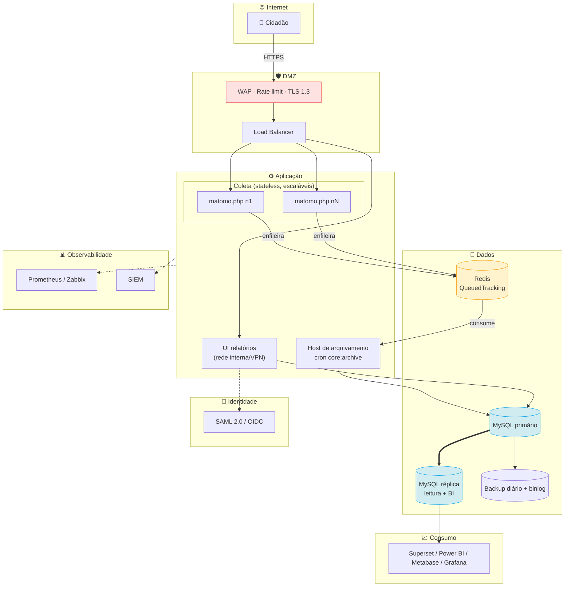
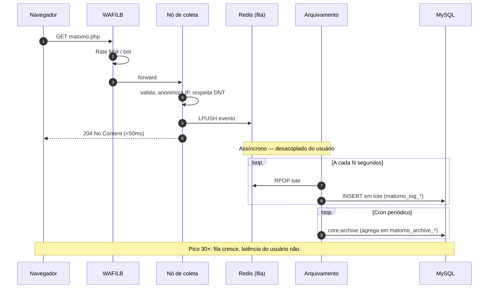
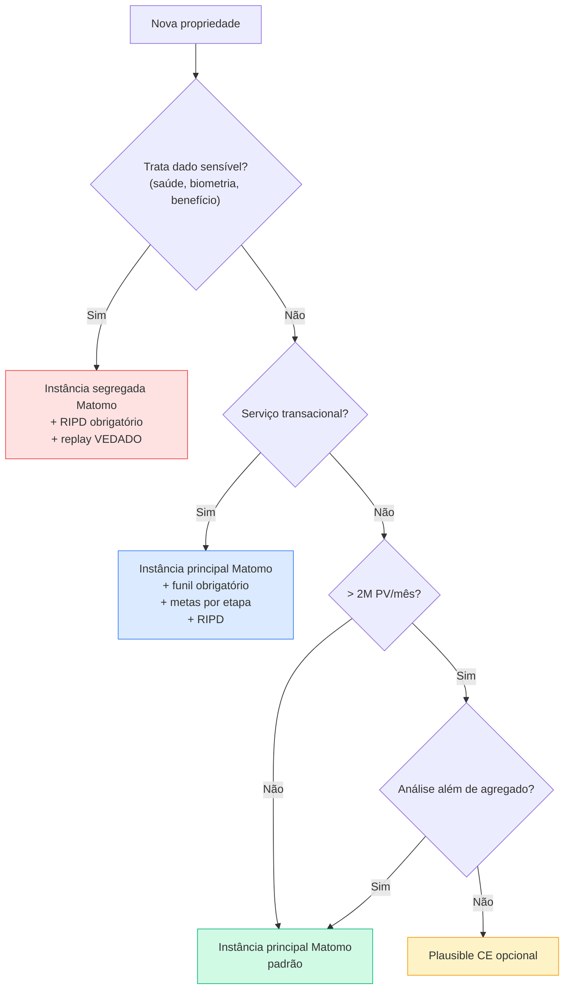

# 07 — Recomendação Técnica

> **Anterior:** [06 — ADR-002](06-adr-002.md) · **Próximo:** [08 — Roadmap](08-roadmap.md)

Reflete a decisão vigente do [ADR-002](06-adr-002.md) — dois perfis: parque existente (§1.1) e portal Xvia (§1.2). Recomendação do parque confirma linha do ADR-001 sob pesos revisados; recomendação do Xvia é nova.

---

## Sumário

- [1. Recomendação](#1-recomendação)
- [2. Aderência às premissas do setor público](#2-aderência-às-premissas-do-setor-público)
- [3. Demonstração técnica da manutenção do Matomo](#3-demonstração-técnica-da-manutenção-do-matomo)
- [4. Por que não as alternativas](#4-por-que-não-as-alternativas)
- [5. Arquitetura-alvo de referência](#5-arquitetura-alvo-de-referência)
- [6. Padrão de conformidade LGPD](#6-padrão-de-conformidade-lgpd)
- [7. Padrão de integração com BI](#7-padrão-de-integração-com-bi)
- [8. Estratégia por classe de portal](#8-estratégia-por-classe-de-portal)
- [9. Dimensionamento](#9-dimensionamento)
- [10. Riscos](#10-riscos)
- [11. Condicionantes](#11-condicionantes)
- [12. O que esta recomendação NÃO afirma](#12-o-que-esta-recomendação-não-afirma)

---

## 1. Recomendação

### 1.1 Parque existente (EDS + sites gov MS)

> **✅ RECOMENDAÇÃO — PARQUE**
> Manter **Matomo On-Premise** como plataforma padrão única de Web Analytics do parque existente. Condicionada à execução integral do plano em [`08-roadmap.md`](08-roadmap.md) (Ondas 1–4).
>
> **Quantitativo:** 500/600 (83,3 %) — 🟢 Recomendada. Vantagem de 1 ponto sobre Piwik PRO (499); desempate por C02.
>
> **Qualitativo:** combina soberania verificável, cobertura funcional suficiente aos *Must have* do parque, e independência tecnológica por licença copyleft — sem deficiência crítica não mitigável por arquitetura.

### 1.2 Portal Xvia (superapp cidadão)

> **✅ RECOMENDAÇÃO — XVIA**
> **Arquitetura híbrida: Matomo On-Premise + PostHog auto-hospedado em paralelo.**
>
> - **Matomo:** audiência agregada, campanhas, SEO, conteúdo — base legal cookieless simplificada.
> - **PostHog:** jornada identificada, funil transacional, feature flags, experimentação, session replay **consentido** e mascarado.
>
> Ambos sob custódia do Estado, sem transferência internacional.
>
> **Quantitativo:** PostHog SH — 464/600 (77,3 %), #4 do ranking, maior pontuação entre plataformas soberanas de product analytics.
>
> **Qualitativo:** perfil analítico do Xvia (jornada identificada, funil transacional, experimentação, replay em serviços críticos) não é domínio do Matomo. Plugins do Matomo cobrem parcial — PostHog cobre.
>
> **Overhead aceito:** ~+55 KB gzip, +50–200 ms LCP em 3G. Monitorado por G9 do [ADR-002](06-adr-002.md#112-gatilhos-antecipados) — reavaliação se LCP > 75 ms sustentado por 2 meses.

### 1.3 Recomendações complementares

| # | Recomendação | Escopo | Natureza |
|---|-------------|--------|----------|
| RC-1 | Plausible CE como camada leve opcional em portais de conteúdo classe C | Parque | Facultativa, com justificativa |
| RC-2 | Vedar **Google Analytics 4** como plataforma padrão em qualquer contexto | Ambos | Obrigatória |
| RC-3 | Vedar **Open Web Analytics** por falha em critério eliminatório de segurança | Ambos | Obrigatória |
| RC-4 | Contingências formais ativáveis por novo ADR: **Matomo Cloud** e **Piwik PRO** (parque); **PostHog Cloud EU** (Xvia) | Ambos | Formal |

---

## 2. Aderência às premissas do setor público

Verificação item a item para o setor público brasileiro.

| # | Premissa | Matomo OP | Plausible CE | Piwik PRO |
|---|----------|:---------:|:------------:|:---------:|
| 1 | LGPD | ✅ | ✅ | ✅ |
| 2 | Governo Digital (14.129/2021) | ✅ | ⚠️ API limitada | ⚠️ Fechado |
| 3 | Soberania | ✅ | ✅ | ⚠️ Contratual |
| 4 | Hospedagem própria | ✅ | ✅ | ✅ |
| 5 | Infra estatal | ✅ | ⚠️ ClickHouse | ✅ |
| 6 | Custo-benefício | ✅ | ✅ | ❌ |
| 7 | Longo ciclo de vida | ✅ | ⚠️ Mantenedor único | ⚠️ Contratual |
| 8 | Integração com BI | ✅ | ⚠️ Sem conectores | ⚠️ |
| 9 | APIs abertas | ✅ | ⚠️ | ⚠️ |
| 10 | Auditoria | ✅ | ✅ | ❌ Fechado |
| 11 | Transparência | ✅ | ✅ | ❌ |
| 12 | Evitar lock-in | ✅ | ✅ | ❌ |
| **Plenas/12** | **12** | 7 | 2 |

---

## 3. Demonstração técnica da manutenção do Matomo

### M1 — Única plataforma soberana com cobertura funcional suficiente

Entre as auto-hospedadas do escopo, só Matomo cobre simultaneamente funil (RF-27), metas (RF-26), segmentação avançada (RF-28), jornada (RF-36) e dimensões customizadas (RF-05):

| Plataforma | RF-26 | RF-27 | RF-28 | RF-36 | RF-05 |
|-----------|:-----:|:-----:|:-----:|:-----:|:-----:|
| **Matomo OP** | ✅ | ✅ 💲 | ✅ | ✅ | ✅ |
| Plausible CE | ✅ | ✅ | ⚠️ Filtros | ❌ | 💲 |
| Umami | ⚠️ | ❌ | ⚠️ Filtros | ❌ | ⚠️ |
| PostHog SH | ✅ | ✅ | ✅ | ✅ | ✅ |

PostHog cobre igualmente, mas é eliminado por M4 (sob R5).

**Consequência:** alternativas soberanas de menor custo **não são substitutos** — falham em RN-01/RN-02. Não é preferência; é não atendimento.

### M2 — Única com precedente regulatório favorável

CNIL publicou orientação reconhecendo configuração específica do Matomo como isenta de consentimento. Nenhuma outra da matriz tem precedente equivalente de DPA.

**Consequência:** fundamentação da base legal perante ANPD dispõe de configuração já **auditada por autoridade regulatória**, não só argumentação própria.

### M3 — Auditoria verificável, não documental

Auditor pode, sem depender do fornecedor:

| Camada | Método |
|--------|--------|
| Código-fonte | Inspeção do repositório GPL v3 |
| Payload | Captura de tráfego do navegador + código do tracker |
| Dado persistido | Consulta SQL direta ao banco |
| Aplicação de retenção | `SELECT MIN(server_time) FROM matomo_log_visit` comprova exclusão física |
| Ausência de exfiltração | Captura de tráfego de saída |
| Acesso admin | Log de auditoria nativo, exportável para SIEM |

Nenhum SaaS oferece cinco das seis camadas. Para dado de navegação de cidadão sob órgão público, auditoria verificável é qualitativamente superior à documental.

### M4 — Custo insensível a volume; perfil de carga é *bursty*

| Modelo | Efeito de pico 30× |
|--------|-------------------|
| Auto-hospedado (Matomo OP) | **Custo inalterado** — consumo de capacidade provisionada |
| SaaS por PV (Plausible, Simple, Matomo Cloud) | Salto de plano; possível excedente |
| SaaS por evento (PostHog Cloud) | **Fatura proporcional ao pico** |
| Gratuito com limites (GA4) | Amostragem, degradação de precisão |

Previsibilidade orçamentária do auto-hospedado é direta ao orçamento público — dotação fixa não comporta variação proporcional a evento imprevisível.

### M5 — Deficiência relevante é mitigável por arquitetura

Gargalo de arquivamento do Matomo é conhecido e tem mitigações estabelecidas:

| Mitigação | Custo |
|-----------|-------|
| `browser_archiving_disabled_enforce = 1` | Configuração |
| Host dedicado para cron de arquivamento | 1 VM |
| Paralelização (`--concurrent-requests-per-website`) | Configuração |
| Réplica de leitura para relatórios e BI | 1 instância de banco |
| QueuedTracking + Redis | 1 instância Redis |

Compare com o não mitigável nas alternativas: nenhuma configuração do GA4 elimina custódia de terceiro; nenhuma do PostHog reduz aos 6 componentes; nenhuma do Adobe traz TCO à faixa aceitável.

---

## 4. Por que não as alternativas

### 4.1 Plausible CE

| Requisito | Situação |
|-----------|----------|
| RF-27 Funil | ✅ Atende |
| RF-28 Segmentação avançada | ⚠️ Só filtros simples |
| RF-36 Jornada | ❌ Não atende |
| RF-31 Coortes e retenção | ❌ |
| RF-32/33/34 Heatmap, replay, forms | ❌ |
| RNF-31 MFA | ❌ Veto potencial SegInfo |
| RN-02 Gargalos em jornadas | ⚠️ Parcial |

Excelente como camada complementar para conteúdo; insuficiente como padrão de Estado que precisa diagnosticar jornadas.

### 4.2 Umami

Falha em **RF-27 (funil, *Must*)** e RN-02. Cobertura 35–54 %. Melhor TCO entre soberanas — insuficiente para compensar não atendimento de *Must have*.

### 4.3 PostHog auto-hospedado (como padrão do parque)

Ver M4 (§3) — superioridade funcional inacessível sob R5. Coloca-se como **complemento do Xvia**, não substituto do parque.

### 4.4 Piwik PRO

Conformidade e capacidade excelentes, mas: TCO ~R$ 1,32M/5a (2× Matomo OP); C04=2 (proprietária, sem fork, sem operação independente); auditoria só documental; código não inspecionável. Contingência formal se P2 falhar.

### 4.5 Google Analytics 4 (arquivado)

Quatro fundamentos independentes:

1. **Controle nulo** (C02=1) — custódia do fornecedor; export só via BigQuery pré-configurado.
2. **Transferência internacional** para jurisdição sem adequação da ANPD.
3. **Precedente regulatório desfavorável** — 4 DPAs europeias.
4. **Precedente concretizado de descontinuidade** — UA→GA4 impôs migração forçada com perda de série histórica.

### 4.6 Open Web Analytics (arquivado)

Eliminado por E6 — CVE-2022-24637 sem correção; cadência incompatível com QA-05. **Dominado estritamente** pelo Matomo OP.

---

## 5. Arquitetura-alvo de referência

### 5.1 Componentes (parque)

### 5.2 Decisões da arquitetura-alvo

| # | Decisão | Lacuna | Justificativa |
|---|---------|:------:|---------------|
| AA-1 | **Ingestão assíncrona** (QueuedTracking + Redis) | L1 | Único mecanismo que atende QA-01 (pico 30×, 45 min, perda ≤ 1 %) |
| AA-2 | Coleta stateless, escala horizontal | L1 | Absorve pico sem tocar no banco |
| AA-3 | Host dedicado ao cron; arquivamento pelo navegador desabilitado | — | Isola agregação da UI |
| AA-4 | Réplica de leitura para relatórios e BI | L3 | Elimina competição com coleta |
| AA-5 | UI restrita a rede interna/VPN; só endpoint de coleta público | — | Superfície mínima |
| AA-6 | Retenção automatizada: bruto 6 meses, agregado 60 meses | L2 | Atende RL-05 |
| AA-7 | SAML 2.0 / OIDC (plugin) | L6 | Elimina gestão manual de usuários |
| AA-8 | Anonimização padrão: IP 2 bytes, cookieless, sem fingerprint | L5 | Alinhado ao precedente CNIL |
| AA-9 | Backup diário + binlog; teste trimestral | L4, L7 | Atende RNF-12/13 |
| AA-10 | Observabilidade de fila, cron e latência | L4 | Converte indicadores do ADR em métricas |
| AA-11 | IaC para toda implantação | L4 | Reprodutibilidade; evita conhecimento tácito |
| AA-12 | Instância segregada p/ dado sensível (saúde, assistência) | — | Isolamento e segregação física |

### 5.3 Fluxo de coleta desacoplada

> **✅ AA-1 é a decisão arquitetural mais importante do estudo**
> Sem desacoplamento: pico 30× → latência crescente → conexões acumuladas → pool MySQL esgotado → **perda de eventos** ou indisponibilidade.
> Com desacoplamento: pico = crescimento temporário da fila, absorvido em minutos. Usuário não percebe. Nenhum evento perdido.
> Lacuna L1. Razão pela qual a recomendação é **condicionada**.

---

## 6. Padrão de conformidade LGPD

### 6.1 Configuração padrão obrigatória

| Parâmetro | Valor | Fundamento |
|-----------|-------|-----------|
| Anonimização de IP | 2 bytes mascarados (mín.) | RL-03; CNIL |
| Cookies | Desabilitados (`disableCookies`) ou estritamente necessários 13m | RL-04 |
| `userId` | Vedado, salvo justificativa formal com RIPD | Necessidade |
| Do Not Track | Respeitado | RL-08 |
| Retenção bruto | 6 meses, exclusão automática | RL-05 |
| Retenção agregado | 60 meses | RL-05 |
| Compartilhamento entre sites | Desabilitado | Finalidade |
| Fingerprinting | Desabilitado | RL-13 |
| Session recording | Vedado por padrão; habilitação exige RIPD | Art. 11 LGPD |
| Log de auditoria | Habilitado, exportado para SIEM | RL-10, RNF-34 |
| TLS | 1.2 mín; 1.3 preferencial | RL-12 |

### 6.2 Base legal por classe

| Classe | Configuração | Base legal | Consentimento? | RIPD? |
|--------|-------------|-----------|:--------------:|:-----:|
| Portal institucional/conteúdo | Cookieless, IP anonimizado, sem userId | Anonimizado — LGPD não incide (art. 12) | ❌ | ⚠️ Recomendado |
| Serviço transacional | Cookieless, IP anonimizado, sessão para funil | Políticas públicas (art. 7º III) ou legítimo interesse (art. 7º IX) | ❌ | ✅ |
| Session recording / heatmap | Mascaramento total padrão | Consentimento (art. 7º I) | ✅ | ✅ |
| Análise com usuário logado | userId habilitado | Políticas públicas (art. 7º III) | ❌ | ✅ |

> **📌 Configuração ótima dispensa a discussão**
> Cookieless + IP anonimizado + sem identificador persistente → dado **não é pessoal** (art. 5º I), passa a anonimizado (art. 12). LGPD não incide: dispensa consentimento, CMP, art. 18 (não há titular identificável), reduz impacto de incidente, elimina discussão de base legal. **Trade-off:** perde métrica de recorrente e cross-sessão — troca favorável para portal público.

### 6.3 Artefatos de conformidade

| Artefato | Responsável | Prazo | Fundamento |
|----------|------------|-------|-----------|
| Registro de operações de tratamento | DPO + STI | Onda 1 | LGPD art. 37 |
| RIPD da plataforma | DPO | Onda 1 | LGPD art. 38 |
| Política de retenção formal | SETDIG | Onda 1 | Arts. 15, 16 |
| Aviso de privacidade | Comunicação + DPO | Onda 1 | Art. 9º |
| Procedimento de atendimento a titular | DPO | Onda 2 | Art. 18 |
| Opt-out publicado | STI | Onda 2 | Art. 18 §2º |
| Auditoria de conformidade | DPO | Semestral | Boa prática |

---

## 7. Padrão de integração com BI

Dois caminhos:

| Caminho | Quando usar | Vantagens | Limitações |
|---------|------------|-----------|-----------|
| **Reporting API** | Métricas agregadas; integrações externas; automações | Simples; consistente com UI; sem acesso ao banco | Rate limits; menos flexível |
| **Réplica de leitura (SQL)** | ETL p/ data warehouse; modelagem própria; junção com outras bases | Máxima flexibilidade; sem rate limit; joins com sistemas do Estado | Exige schema; acopla ETL a estrutura interna |

> **✅ Padrão recomendado**
> **Reporting API** para consumo de métricas e integrações externas; **réplica de leitura** apenas para pipeline de ETL do DW corporativo.
> Réplica **não deve ser exposta** a BI de autoatendimento — consultas mal formadas sobre dezenas de milhões de linhas geram carga imprevisível. Padrão: réplica → ETL → data mart modelado → BI.

**Tabelas relevantes p/ ETL:** `matomo_log_visit` (sessões), `matomo_log_link_visit_action` (eventos/PV), `matomo_log_action` (dicionário), `matomo_log_conversion` (metas), `matomo_site` (dimensão órgão), `matomo_archive_numeric_*` (agregados). **Não usar** `matomo_archive_blob_*` (formato interno serializado).

> **⚠️ Acoplamento a schema interno**
> `matomo_log_*` pode mudar entre versões maiores. ETL deve ser versionado com a versão do Matomo. **Mitigação:** camada de *views* SQL estáveis entre schema e ETL — mudança de schema atualiza só views.

---

## 8. Estratégia por classe de portal

| Classe | Exemplos | Plataforma | Configuração |
|--------|---------|-----------|-------------|
| **A — Serviço transacional** | Protocolo, agendamento, benefício | **Matomo** (principal ou segregada se sensível) | Eventos, metas, funis, dimensões, server-side crítico |
| **B — Portal institucional principal** | Portal do Governo, Secretarias | **Matomo** (principal) | Padrão completa |
| **C — Conteúdo de alto volume** | Notícias, transparência | **Matomo** ou **Plausible CE** | Métricas agregadas |
| **D — Temporário / campanha** | Hotsite | **Matomo** (propriedade dedicada) | Mínima + UTM |
| **E — Aplicação interna** | Sistemas administrativos | **Matomo** (principal, segregada) | Eventos + metas de uso |
| **F — Superapp cidadão (Xvia)** | Portal Xvia | **Matomo + PostHog SH** paralelo | Matomo anônimo cookieless; PostHog identificado, funil, feature flags, replay consentido |

### 8.1 Árvore de decisão

---

## 9. Dimensionamento

Cenário de referência: 12M PV/mês, 80 propriedades, picos até 30×.

| Componente | Qtd. | vCPU | RAM | Disco | Observação |
|-----------|:----:|-----:|----:|------:|------------|
| Coleta (PHP-FPM + Nginx) | 2 mín → 4 pico | 4 | 8 GB | 40 GB | Stateless, escala horizontal |
| UI relatórios | 1 | 4 | 16 GB | 40 GB | Rede interna |
| Arquivamento | 1 | 8 | 16 GB | 40 GB | Cron dedicado |
| Redis (fila + cache) | 1 + 1 réplica | 2 | 8 GB | 20 GB | AOF habilitada |
| MySQL primário | 1 | 8 | 32 GB | 1 TB SSD NVMe | `buffer_pool_size` ≈ 24 GB |
| MySQL réplica | 1 | 8 | 32 GB | 1 TB SSD NVMe | Leitura + ETL |
| Backup | — | — | — | 3 TB | 30d + mensal 12m |

**Volume estimado:** ~6 GB/mês bruto; ~280 GB em regime (retenção 6m/60m + índices). Provisionar 1 TB (3,5× estimado).

Configuração completa de MySQL + Matomo (`config.ini.php`) — validar na PoC da Onda 1. Documentação em `anexos/benchmark.md`.

---

## 10. Riscos

Top-10 preservados dos R-01 a R-20 (ADR-001 + ADR-002). Registro completo em [`06-adr-002.md §9`](06-adr-002.md#9-riscos-assumidos).

| ID | Risco | Prob | Impacto | Resposta |
|----|-------|:----:|:-------:|----------|
| R-01 | Gargalo de arquivamento do Matomo em pico | 🟠 | 🔴 | AA-1 (QueuedTracking + Redis) |
| R-02 | Perda de eventos em pico sem fila | 🟠 | 🔴 | AA-1; teste de carga na Onda 1 |
| R-03 | CVE crítica no produto | 🟡 | 🔴 | Patch ≤ 15 dias; SIEM; hardening |
| R-05 | Escalonamento inadequado do MySQL | 🟡 | 🟠 | Réplica de leitura; buffer_pool tuning |
| R-06 | Conhecimento tácito concentrado na STI | 🟠 | 🟠 | IaC; documentação; rotação |
| R-11 | Captura acidental de dado sensível em replay do PostHog | 🟠 | 🔴 | Mascaramento agressivo padrão; opt-in; DPIA; homologação SegInfo |
| R-17 | LCP Xvia > 75 ms sustentado por overhead 2º script | 🟡 | 🟠 | G9 §11.2 aciona reavaliação em 60d |
| R-18 | STI não sustenta stack PostHog | 🟠 | 🟠 | Capacitação; suporte contratado; fallback Cloud EU |
| R-19 | Divergência Matomo × PostHog no Xvia gera confusão | 🟠 | 🟡 | Governança de origem por métrica; dashboard consolidado |
| R-20 | PostHog descontinua SH (iniciado 2023) | 🟢 curto / 🟠 longo | 🟠 | G11 revisão em 90d; fallback Cloud EU |

---

## 11. Condicionantes

| # | Condicionante | Verificação | Prazo | Se não satisfeita |
|---|--------------|-------------|-------|-------------------|
| CD-1 | Execução integral do plano | Marcos Ondas 1–4 | 18 m | Gatilho G7 do ADR |
| CD-2 | Validação de P2 (competência STI) | Gate na Onda 1 | 3 m | Ativar contingência via ADR-003 |
| CD-3 | Implementação de AA-1 (desacoplamento) | Teste de carga pico 30× | 6 m | R-02 permanece crítico |
| CD-4 | Aprovação da configuração pelo DPO | Parecer formal | 3 m | Veto absoluto — recomendação suspensa |
| CD-5 | Aprovação pela SegInfo | Parecer formal | 3 m | Veto absoluto — recomendação suspensa |
| CD-6 | Confirmação do perfil de volume por medição | Relatório de benchmark | 3 m | Redimensionamento |
| CD-7 | Orçamento p/ plugins premium + infra | Dotação confirmada | 6 m | Escopo funcional reduzido |

---

## 12. O que esta recomendação NÃO afirma

| # | Não afirma |
|---|-----------|
| 1 | Que Matomo é tecnicamente superior em todos aspectos. **Não é.** PostHog o supera em capacidade analítica; GA4 em ecossistema |
| 2 | Que a operação atual do Matomo está adequada. **Não está.** 7 lacunas L1–L7 pendentes |
| 3 | Que o resultado seria o mesmo sob outra ponderação. Análise de sensibilidade mostra inversão em 1 de 5 cenários (para outra modalidade do mesmo produto) |
| 4 | Que os números de desempenho foram medidos no ambiente do Estado. **Não foram** — exigem PoC (Onda 1) |
| 5 | Que os valores de TCO são preços contratados. **São estimativas modeladas** |
| 6 | Que GA4 é ilegal no BR. **Não há decisão da ANPD nesse sentido** — é risco antecipável sob norma análoga |
| 7 | Que a recomendação é permanente. **Vale por 24 meses** ou até gatilho de revisão |
| 8 | Que a escolha do produto resolve o problema. **Não resolve** — o problema é ausência de arquitetura e governança; produto é um componente |

---

## Navegação

| ⬅️ Anterior | ➡️ Próximo |
|------------|-----------|
| [06 — ADR-002](06-adr-002.md) | [08 — Roadmap](08-roadmap.md) |
