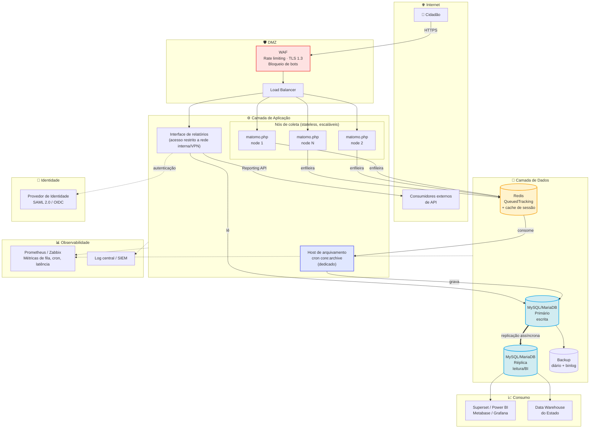
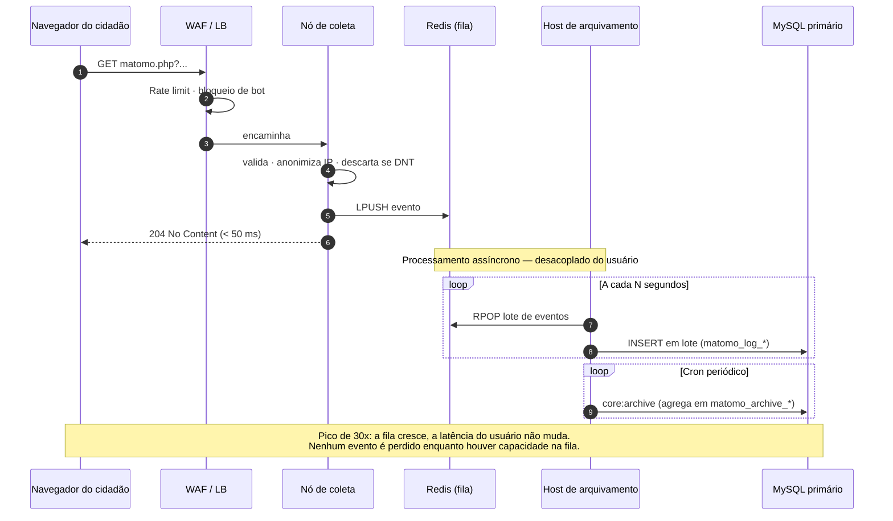
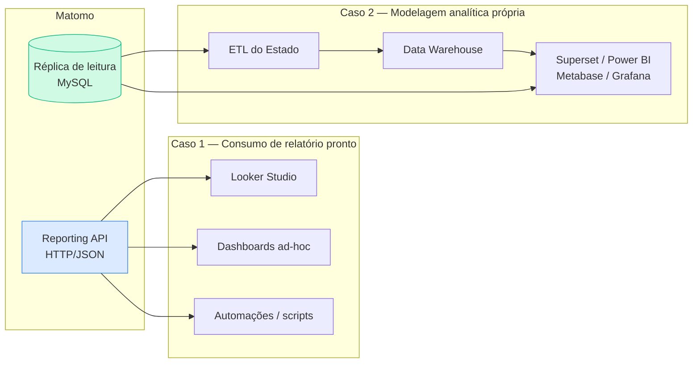
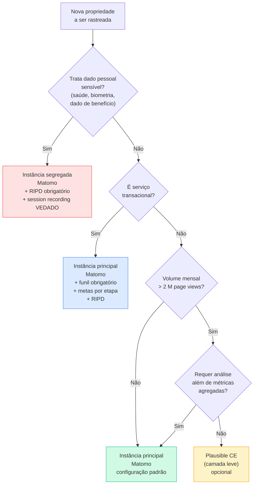

# 09 — Recomendação Técnica

> **Anterior:** [08 — ADR-001](08-adr.md) · [08 — ADR-002 (vigente)](08-adr-002.md) · **Próximo:** [10 — Roadmap](10-roadmap.md)

> **📌 Nota metodológica — Revisão 2026**
> Este documento reflete a decisão vigente registrada no [ADR-002](08-adr-002.md), que separa a recomendação em **dois perfis**: parque existente (§1.1) e novo portal Xvia (§1.2). A recomendação para o parque **confirma** a linha do ADR-001 sob pesos revisados; a recomendação para o Xvia é nova. Fundamentos técnicos e aderências normativas (§2–§7) permanecem válidos para ambos os perfis; nuances específicas do Xvia estão no §8 (estratégia de camadas).

---

## Sumário

- [1. Recomendação](#1-recomendação)
- [2. Aderência às premissas do setor público brasileiro](#2-aderência-às-premissas-do-setor-público-brasileiro)
- [3. Demonstração técnica da manutenção do Matomo](#3-demonstração-técnica-da-manutenção-do-matomo)
- [4. Por que não as alternativas](#4-por-que-não-as-alternativas)
- [5. Arquitetura-alvo de referência](#5-arquitetura-alvo-de-referência)
- [6. Padrão de conformidade LGPD](#6-padrão-de-conformidade-lgpd)
- [7. Padrão de integração com BI](#7-padrão-de-integração-com-bi)
- [8. Estratégia de camadas por classe de portal](#8-estratégia-de-camadas-por-classe-de-portal)
- [9. Dimensionamento recomendado](#9-dimensionamento-recomendado)
- [10. Condicionantes da recomendação](#10-condicionantes-da-recomendação)
- [11. O que esta recomendação não afirma](#11-o-que-esta-recomendação-não-afirma)

---

## 1. Recomendação

### 1.1 Recomendação para o parque existente (EDS + sites gov MS)

> **✅ RECOMENDAÇÃO PRINCIPAL — PARQUE**
>
> **Manter o Matomo, na modalidade On-Premise, como plataforma padrão única de Web Analytics do parque existente do Governo do Estado de MS** — portais institucionais, sites gov e serviços digitais de conteúdo. Condicionada à execução integral do plano de adequação arquitetural definido em [`10-roadmap.md`](10-roadmap.md) (Ondas 1–4).
>
> **Fundamento quantitativo:** 500 de 600 pontos (83,3 %) na matriz revisada 2026 — faixa "Recomendada". Vantagem de 1 ponto sobre Piwik PRO (499), desempatada por C02 (Controle=5 vs 4). Ver [`07-matriz-decisao.md §3.2`](07-matriz-decisao.md#32-desempate--1º-lugar-revisão-2026).
>
> **Fundamento qualitativo:** combina soberania verificável sobre os dados, cobertura funcional suficiente para os requisitos obrigatórios do parque e independência tecnológica assegurada por licença copyleft — sem apresentar deficiência crítica não mitigável por arquitetura.

### 1.2 Recomendação para o novo portal Xvia (superapp cidadão)

> **✅ RECOMENDAÇÃO PRINCIPAL — XVIA**
>
> **Adotar arquitetura híbrida: Matomo On-Premise + PostHog auto-hospedado em paralelo no portal Xvia**, com segmentação clara de responsabilidade entre as duas plataformas:
>
> - **Matomo:** audiência agregada, campanhas, SEO, métricas de conteúdo, base legal cookieless simplificada.
> - **PostHog:** jornada identificada de usuário autenticado, funil de serviços transacionais, feature flags e experimentação, session replay **consentido** e mascarado.
>
> Ambos rodam sob custódia do Estado, sem transferência internacional.
>
> **Fundamento quantitativo:** PostHog auto-hospedado alcança 464/600 (77,3 %) sob pesos revisados — 4ª posição do ranking, e **a maior pontuação entre plataformas soberanas de product analytics** avaliadas.
>
> **Fundamento qualitativo:** o perfil analítico do Xvia (jornada identificada, funil transacional, experimentação estruturada, session replay em serviços críticos) não é o domínio do Matomo. Reforçar o Matomo com plugins cobre parcialmente a lacuna — não a fecha. PostHog cobre.
>
> **Aceitação explícita de overhead:** ~+55 KB gzip e +50–200 ms no LCP do Xvia em conexão 3G, monitorado por G9 do [ADR-002](08-adr-002.md#112-gatilhos-de-revisão-antecipada) (gatilho de reavaliação se LCP > 75 ms sustentado por 2 meses).

### 1.3 Recomendações complementares

| # | Recomendação | Escopo | Natureza |
|---|-------------|--------|----------|
| **RC-1** | Adotar **Plausible Community Edition** como camada leve opcional para portais de conteúdo de altíssimo volume e baixa criticidade analítica | Parque | Facultativa, mediante justificativa |
| **RC-2** | Substituir o **Microsoft Clarity** pelo plugin *Heatmaps & Session Recording* do Matomo (no parque) e por session replay do PostHog (no Xvia, com consentimento) | Ambos | Obrigatória, com prazo |
| **RC-3** | Usar **Cloudflare Web Analytics** como métrica de borda complementar em domínios já servidos pela CDN | Parque | Facultativa, sem custo |
| **RC-4** | Vedar o **Google Analytics 4** como plataforma padrão em qualquer contexto | Ambos | Obrigatória |
| **RC-5** | Vedar integralmente o **Open Web Analytics** por falha em critério eliminatório de segurança | Ambos | Obrigatória |
| **RC-6** | Registrar contingências formais ativáveis apenas por novo ADR: **Matomo Cloud** e **Piwik PRO** para o parque; **PostHog Cloud EU** para o Xvia | Ambos | Formal |

---

## 2. Aderência às premissas do setor público brasileiro

Verificação item a item das premissas declaradas para órgãos públicos brasileiros.

| # | Premissa | Aderência do Matomo On-Premise | Evidência |
|---|----------|-------------------------------|-----------|
| 1 | **LGPD** | ✅ **Plena.** Configuração cookieless + anonimização de IP permite operar sem consentimento; retenção controlada com exclusão física verificável; opt-out nativo; direitos do titular atendíveis; sem transferência internacional | [`../comparativos/lgpd.md`](../comparativos/lgpd.md) |
| 2 | **Governo Digital** (Lei 14.129/2021) | ✅ **Plena.** API aberta; formatos abertos de exportação; solução de código aberto compartilhável entre entes (art. 16); habilita mensuração de serviços digitais | [`../comparativos/api.md`](../comparativos/api.md) |
| 3 | **Soberania dos dados** | ✅ **Plena.** Dado bruto em banco sob custódia física e jurídica do Estado; nenhum terceiro tem acesso; verificável por inspeção de rede | [`../comparativos/governanca.md`](../comparativos/governanca.md) |
| 4 | **Hospedagem própria preferencial** | ✅ **Plena.** Modalidade On-Premise é a nativa e mais madura do produto | [`../plataformas/matomo.md`](../plataformas/matomo.md) |
| 5 | **Infraestrutura estatal** | ✅ **Plena.** Requisitos de infraestrutura convencionais (PHP, MySQL, Nginx, Redis) — compatíveis com datacenter estadual | [`../comparativos/infraestrutura.md`](../comparativos/infraestrutura.md) |
| 6 | **Custo-benefício** | ✅ **Plena.** Menor TCO entre alternativas de cobertura funcional equivalente; custo insensível a volume | [`../comparativos/custo.md`](../comparativos/custo.md) |
| 7 | **Longo ciclo de vida** | ✅ **Plena.** Projeto com mais de 15 anos; GPL v3 garante direito perpétuo; continuidade independe do fornecedor | [`04-mercado.md`](04-mercado.md#9-análise-de-viabilidade-de-fornecedor) |
| 8 | **Integração com BI** | ✅ **Plena.** Reporting API + **acesso SQL direto a réplica de leitura** — via de integração indisponível em qualquer SaaS | [`../comparativos/api.md`](../comparativos/api.md) |
| 9 | **APIs abertas** | ✅ **Plena.** Reporting API, Tracking API e API de administração documentadas, com saída em JSON, XML, CSV, TSV e RSS | [`../comparativos/api.md`](../comparativos/api.md) |
| 10 | **Auditoria** | ✅ **Plena.** Auditoria verificável em quatro camadas: código-fonte, banco de dados, tráfego de rede e log administrativo | [`06-tradeoffs.md`](06-tradeoffs.md#310-facilidade-de-auditoria) |
| 11 | **Transparência** | ✅ **Plena.** Código aberto; schema documentado; estatísticas publicáveis como dado aberto (RF-14) | [`../comparativos/governanca.md`](../comparativos/governanca.md) |
| 12 | **Evitar Vendor Lock-in** | ✅ **Plena.** GPL v3; fork viável; schema inspecionável; exportação total por SQL; custo de saída estimado em ~R$ 20 k | [`../comparativos/governanca.md`](../comparativos/governanca.md) |

**Resultado: aderência plena às 12 premissas.**

### 2.1 Comparação de aderência entre as três primeiras colocadas

| Premissa | Matomo On-Premise | Plausible CE | Piwik PRO |
|----------|:-----------------:|:------------:|:---------:|
| LGPD | ✅ Plena | ✅ Plena | ✅ Plena |
| Governo Digital | ✅ Plena | ⚠️ Parcial (API limitada) | ⚠️ Parcial (código fechado) |
| Soberania dos dados | ✅ Plena | ✅ Plena | ⚠️ Parcial (contratual) |
| Hospedagem própria | ✅ Plena | ✅ Plena | ✅ Plena (custo adicional) |
| Infraestrutura estatal | ✅ Plena | ⚠️ Parcial (ClickHouse) | ✅ Plena |
| Custo-benefício | ✅ Plena | ✅ Plena | ❌ Não atendida |
| Longo ciclo de vida | ✅ Plena | ⚠️ Parcial (mantenedor único) | ⚠️ Parcial (contratual) |
| Integração com BI | ✅ Plena | ⚠️ Parcial (sem conectores) | ⚠️ Parcial |
| APIs abertas | ✅ Plena | ⚠️ Parcial | ⚠️ Parcial |
| Auditoria | ✅ Plena | ✅ Plena | ❌ Não atendida (código fechado) |
| Transparência | ✅ Plena | ✅ Plena | ❌ Não atendida |
| Evitar lock-in | ✅ Plena | ✅ Plena | ❌ Não atendida |
| **Plenas / 12** | **12** | **7** | **2** |

---

## 3. Demonstração técnica da manutenção do Matomo

Esta seção atende à exigência de demonstrar **claramente os motivos técnicos** da manutenção. Cada motivo é verificável e independente de julgamento subjetivo.

### M1 — É a única plataforma soberana com cobertura funcional suficiente

**Fato verificável:** entre as plataformas auto-hospedadas avaliadas, apenas o Matomo cobre simultaneamente os requisitos *Must have* de funil de conversão (RF-27), metas (RF-26), segmentação avançada (RF-28), jornada de usuário (RF-36) e dimensões customizadas (RF-05).

| Plataforma soberana | RF-26 Metas | RF-27 Funil | RF-28 Segmentação | RF-36 Jornada | RF-05 Dimensões |
|--------------------|:-----------:|:-----------:|:-----------------:|:-------------:|:---------------:|
| **Matomo On-Premise** | ✅ | ✅ 💲 | ✅ | ✅ | ✅ |
| Plausible CE | ✅ | ✅ | ⚠️ Filtros | ❌ | 💲 |
| Umami | ⚠️ | ❌ | ⚠️ Filtros | ❌ | ⚠️ |
| Open Web Analytics | ✅ | ❌ | ⚠️ | ⚠️ | ❌ |
| PostHog auto-hospedado | ✅ | ✅ | ✅ | ✅ | ✅ |

O PostHog cobre igualmente, mas é eliminado por outro fundamento (M6).

**Consequência:** as alternativas soberanas de menor custo **não são substitutos** — falham em requisitos obrigatórios de negócio (RN-01 e RN-02). Não se trata de preferência, mas de não atendimento.

### M2 — É a única plataforma com precedente regulatório favorável

**Fato verificável:** a CNIL, autoridade francesa de proteção de dados, publicou orientação reconhecendo configuração específica do Matomo como isenta de consentimento prévio. Nenhuma outra plataforma da matriz possui precedente equivalente de autoridade de proteção de dados.

**Consequência:** na fundamentação da base legal perante a ANPD, o Estado dispõe de configuração técnica **já auditada por autoridade regulatória**, e não apenas de argumentação própria.

### M3 — É a única em que a auditoria é verificável, e não documental

**Fato verificável:** um auditor pode, sem depender do fornecedor:

| Camada de auditoria | Método | Disponível em SaaS? |
|--------------------|--------|:-------------------:|
| Código-fonte | Inspeção do repositório GPL v3 | ❌ |
| Payload coletado | Captura do tráfego no navegador + leitura do código do tracker | ⚠️ Parcial |
| Dado persistido | Consulta SQL direta ao banco | ❌ |
| Aplicação da retenção | `SELECT MIN(server_time) FROM matomo_log_visit` comprova a exclusão física | ❌ |
| Ausência de exfiltração | Captura do tráfego de saída da instância | ❌ |
| Acesso administrativo | Log de auditoria nativo, exportável para SIEM | ⚠️ Parcial |

**Consequência:** para dado de navegação de cidadão sob custódia de órgão público, auditoria verificável é qualitativamente superior a auditoria documental baseada em certificados de terceiro.

### M4 — O custo é insensível a volume, e o perfil de carga é *bursty*

**Fato verificável:** o perfil de carga do setor público apresenta picos de 10× a 50× em eventos institucionais (resultado de concurso, emergência, abertura de programa social).

| Modelo de preço | Efeito de um pico de 30× em um mês |
|-----------------|-----------------------------------|
| Auto-hospedado (Matomo On-Premise) | **Custo inalterado** — apenas consumo de capacidade já provisionada |
| SaaS por page view (Plausible, Simple Analytics, Matomo Cloud) | Salto de faixa de plano; possível cobrança de excedente |
| SaaS por evento (PostHog Cloud) | **Fatura proporcional ao pico** |
| Gratuito com limites (GA4) | Amostragem e degradação de precisão |

**Consequência:** a previsibilidade orçamentária do modelo auto-hospedado é diretamente relevante à execução orçamentária pública, que opera sob dotação fixa e não comporta variação de despesa proporcional a evento imprevisível.

### M5 — A única deficiência relevante é mitigável por arquitetura

**Fato verificável:** o gargalo de arquivamento do Matomo é conhecido, documentado e possui mitigações estabelecidas.

| Mitigação | Efeito | Custo de implementação |
|-----------|--------|-----------------------|
| `browser_archiving_disabled_enforce = 1` | Elimina arquivamento sob demanda disparado por acesso à interface | Configuração |
| Host dedicado para o cron de arquivamento | Isola a carga de agregação da carga de coleta | 1 VM |
| Paralelização do arquivamento (`--concurrent-requests-per-website`) | Reduz a janela de conclusão | Configuração |
| Restrição de segmentos pré-processados | Reduz a explosão combinatória de arquivos | Governança |
| Réplica de leitura para relatórios e BI | Elimina competição com a coleta | 1 instância de banco |
| `QueuedTracking` + Redis | Desacopla a ingestão; absorve picos | 1 instância Redis |

Compare-se com as deficiências não mitigáveis das alternativas ([`08-adr.md`, J8](08-adr.md#j8--ausência-de-deficiência-crítica-não-mitigável)): não há configuração do GA4 que elimine a custódia de terceiro, nem do PostHog que elimine os 6 componentes, nem do Adobe que reduza o TCO à faixa aceitável.

### M6 — A alternativa funcionalmente equivalente é operacionalmente inviável

**Fato verificável:** o PostHog auto-hospedado iguala ou supera o Matomo em cobertura funcional (nota 5 × 4 em C05), mas:

1. O fornecedor **descontinuou o suporte à implantação auto-hospedado** em 2023;
2. A opção remanescente é documentada como **não suportada** e adequada apenas a volumes reduzidos;
3. Exige operação de **6 componentes** de infraestrutura distribuída (Django, PostgreSQL, ClickHouse, Kafka, Redis, object storage);
4. O esforço estimado (~0,8 FTE de engenheiro de plataforma) é incompatível com a **restrição R5** — não há previsão de ampliação do quadro da STI.

**Consequência:** a superioridade funcional do PostHog não é acessível sob as restrições reais do Estado.

### M7 — O custo de manutenção é substancialmente inferior ao de migração

**Fato verificável:** a decisão de manter elimina custos que qualquer migração incorreria.

| Custo evitado pela manutenção | Estimativa |
|------------------------------|-----------:|
| Migração de dados históricos | R$ 60–120 k |
| Reimplantação de tags em ~80 propriedades | R$ 80–150 k |
| Reconfiguração de metas, funis e dimensões | R$ 40–80 k |
| Recapacitação de usuários | R$ 30–60 k |
| Período de operação em paralelo | R$ 40–80 k |
| Risco de descontinuidade de série histórica | Não monetizável |
| **Total evitado** | **R$ 250–490 k** |

**Consequência:** ainda que uma alternativa apresentasse pontuação marginalmente superior, o custo de transição precisaria ser superado pela vantagem — o que não ocorre em nenhum dos cenários avaliados.

> **📌 Observação metodológica**
> O custo de migração **não foi incluído na matriz de decisão**. Incluí-lo teria introduzido viés de status quo, favorecendo artificialmente a plataforma em uso. A matriz avaliou os produtos em condições de igualdade.
>
> O motivo M7 é apresentado **após** o resultado da matriz, como consideração econômica adicional que reforça — mas não determina — a recomendação. Se a matriz tivesse apontado outra plataforma com vantagem superior a ~R$ 490 k em valor, a recomendação seria pela migração.

---

## 4. Por que não as alternativas

### 4.1 Por que não o Plausible CE como plataforma padrão

| Requisito | Situação |
|-----------|----------|
| RF-27 — Funil de conversão | ✅ Atende |
| RF-28 — Segmentação avançada | ⚠️ Apenas filtros simples, sem segmentos compostos comparáveis |
| RF-36 — Jornada do usuário | ❌ **Não atende** |
| RF-31 — Coortes e retenção | ❌ Não atende |
| RF-32/33/34 — Heatmap, replay, form analytics | ❌ Não atende |
| RNF-31 — MFA | ❌ **Não atende** (veto potencial da Segurança da Informação) |
| RI-13 — Tag Manager próprio | ❌ Não atende |
| RN-02 — Identificação de gargalos em jornadas | ⚠️ Parcialmente — funil sem jornada limita o diagnóstico |

**Conclusão:** o Plausible falha em requisitos obrigatórios (RF-36, RNF-31) e atende parcialmente ao requisito de negócio RN-02. É **excelente como camada complementar** para portais de conteúdo, e insuficiente como plataforma padrão de um Estado que precisa diagnosticar jornadas de serviço digital.

### 4.2 Por que não o Piwik PRO

| Fator | Avaliação |
|-------|-----------|
| Conformidade | ✅ Excelente — nota 5 em C01 |
| Capacidade analítica | ✅ Excelente — nota 5 em C05 |
| **TCO** | ❌ ~R$ 1,32 M em 5 anos — **2× o custo do Matomo On-Premise** |
| **Independência tecnológica** | ❌ Nota 2 — código fechado, sem fork, sem operação independente do fornecedor |
| **Auditoria** | ❌ Documental, não verificável |
| **Transparência** | ❌ Código não inspecionável |
| Contratação | ⚠️ Preço não público; fornecedor estrangeiro; complexidade licitatória |

**Conclusão:** o Piwik PRO entrega conformidade equivalente ao dobro do custo, sacrificando auditabilidade, transparência e independência — três das doze premissas declaradas. Permanece como **contingência formal** caso a premissa P2 seja invalidada.

### 4.3 Por que não o Google Analytics 4

Fundamentação em quatro camadas independentes:

| # | Fundamento | Natureza |
|---|-----------|----------|
| 1 | **Controle nulo sobre os dados** (nota 1 em C02) — custódia exclusiva do fornecedor; exportação apenas via BigQuery configurado previamente; dado anterior à configuração é irrecuperável | Governança |
| 2 | **Transferência internacional** para jurisdição sem decisão de adequação da ANPD, exigindo base legal do art. 33 com avaliação documentada de resultado incerto | Jurídica |
| 3 | **Precedente regulatório desfavorável** — quatro autoridades europeias declararam o uso incompatível com norma estruturalmente análoga à LGPD | Regulatória |
| 4 | **Precedente concretizado de descontinuidade** — o desligamento do Universal Analytics em 2023 impôs migração forçada com perda de série histórica, demonstrando que o custo de "gratuito" inclui risco de descontinuidade unilateral | Continuidade |

Acrescente-se: retenção máxima de 14 meses definida unilateralmente pelo fornecedor (viola o controle exigido por RL-05) e aplicação de amostragem estatística em análises acima de limiar (inadequada a relatório com valor de prestação de contas).

**Conclusão:** vedado como plataforma padrão. Não se trata de inferioridade técnica — o GA4 obtém nota 5 em quatro critérios —, mas de incompatibilidade estrutural com os direcionadores de soberania e conformidade de um órgão público.

### 4.4 Por que não o Adobe Analytics

**Fundamento único e suficiente:** TCO estimado em R$ 4,44 M+ em 5 anos, contra ~R$ 235 k marginais da solução recomendada, para atender ao mesmo conjunto de requisitos prioritários.

Uma diferença de aproximadamente 19× no custo para mensurar portais institucionais estaduais é de difícil sustentação perante os princípios da economicidade (CF/88, art. 70) e da eficiência (CF/88, art. 37), bem como do art. 5º da Lei nº 14.133/2021.

Acrescente-se o lock-in máximo do estudo (nota 1 em C04) e o custo de saída estimado em R$ 600 k+.

### 4.5 Por que não o Umami

Falha no requisito **RF-27** (funil de conversão), que é *Must have*, e no requisito de negócio **RN-02**. Cobertura funcional de nota 2 (35 % a 54 % dos requisitos ponderados). Melhor TCO do estudo entre as opções soberanas — insuficiente para compensar não atendimento de requisito obrigatório.

### 4.6 Por que não o PostHog

Ver motivo **M6** (seção 3). Superioridade funcional inacessível sob a restrição R5.

### 4.7 Por que não o Open Web Analytics

Eliminado na triagem por critério **E6** (segurança). CVE-2022-24637 (execução remota de código) e cadência de correções incompatível com o cenário QA-05. **Dominado estritamente** pelo Matomo On-Premise na análise de Pareto — superior em 9 critérios, inferior em nenhum. A eliminação independe de qualquer ponderação.

---

## 5. Arquitetura-alvo de referência

### 5.1 Visão de componentes



### 5.2 Decisões arquiteturais da arquitetura-alvo

| # | Decisão | Lacuna endereçada | Justificativa |
|---|---------|:-----------------:|---------------|
| **AA-1** | **Ingestão assíncrona** via plugin `QueuedTracking` com Redis | L1 | Único mecanismo que atende ao cenário QA-01 (pico de 30× por 45 min com perda ≤ 1 %) |
| **AA-2** | **Nós de coleta stateless** atrás de balanceador, escaláveis horizontalmente | L1 | Permite absorver pico ampliando réplicas sem tocar no banco |
| **AA-3** | **Host dedicado para o cron de arquivamento**, com arquivamento pelo navegador desabilitado | — | Isola a carga de agregação; elimina latência imprevisível na interface |
| **AA-4** | **Réplica de leitura** dedicada a relatórios pesados e ao BI | L3 | Elimina competição entre consultas analíticas e coleta |
| **AA-5** | **Interface administrativa restrita** a rede interna ou VPN; apenas o endpoint de coleta é público | — | Reduz a superfície de ataque ao mínimo necessário |
| **AA-6** | **Política de retenção automatizada**: dado bruto 6 meses, dado agregado 60 meses | L2 | Atende RL-05; reduz volume do banco; reduz impacto de eventual incidente |
| **AA-7** | **Federação de identidade** via SAML 2.0 ou OIDC (plugin) | L6 | Elimina gestão manual de usuários; centraliza o ciclo de vida de acesso |
| **AA-8** | **Anonimização por padrão**: IP com 2 bytes mascarados, cookieless, sem fingerprinting | L5 | Configuração alinhada ao precedente da CNIL |
| **AA-9** | **Backup diário + binlog**, com teste de restauração trimestral | L4, L7 | Atende RNF-12 (RPO ≤ 24 h) e RNF-13 (RTO ≤ 8 h) |
| **AA-10** | **Observabilidade** de profundidade de fila, conclusão do cron e latência do endpoint | L4 | Converte os indicadores da seção 11.3 do ADR em métricas monitoráveis |
| **AA-11** | **Infrastructure as Code** para toda a implantação | L4, R-06 | Reprodutibilidade; elimina concentração de conhecimento tácito |
| **AA-12** | **Instância segregada** para serviços de alta criticidade (saúde, assistência social) | — | Isolamento de falha e segregação física onde o dado é mais sensível |

### 5.3 Fluxo de coleta com desacoplamento



> **✅ Bloco de Decisão — AA-1 é a decisão arquitetural mais importante deste estudo**
> O desacoplamento da ingestão é o que transforma o Matomo de "plataforma que funciona no dia a dia" em "plataforma que sobrevive ao dia do resultado do concurso".
>
> Sem ele, um pico de 30× produz: latência crescente no endpoint → conexões acumuladas no servidor web → esgotamento do pool de conexões do MySQL → **perda de eventos** e, em cenários severos, indisponibilidade do serviço de coleta.
>
> Com ele, o pico se traduz em **crescimento temporário da profundidade da fila**, absorvido em minutos após o pico. O usuário não percebe; o banco não é sobrecarregado; nenhum evento é perdido.
>
> **Esta é a lacuna L1, e é a razão pela qual a decisão do ADR-001 é condicionada.** Manter o Matomo sem executar AA-1 não é a recomendação deste estudo.

---

## 6. Padrão de conformidade LGPD

### 6.1 Configuração padrão obrigatória

| Parâmetro | Valor obrigatório | Fundamento |
|-----------|-------------------|-----------|
| Anonimização de IP | 2 bytes mascarados (mínimo) | RL-03; precedente CNIL |
| Cookies | Desabilitados (`disableCookies`) ou cookie estritamente necessário de 13 meses | RL-04 |
| `userId` | Vedado, salvo justificativa formal com RIPD | Princípio da necessidade |
| Do Not Track | Respeitado | RL-08 |
| Retenção de dado bruto | 6 meses, com exclusão automática | RL-05 |
| Retenção de dado agregado | 60 meses | RL-05 |
| Compartilhamento entre sites | Desabilitado | Princípio da finalidade |
| Fingerprinting | Desabilitado; `enable_userid_overwrites_visitorid = 0` | RL-13 |
| Relatório de e-mail com dado pessoal | Vedado | Princípio da segurança |
| Session recording | Vedado por padrão; habilitação exige RIPD por propriedade | Art. 11 da LGPD |
| Log de auditoria | Habilitado e exportado para SIEM | RL-10; RNF-34 |
| TLS | 1.2 mínimo; 1.3 preferencial | RL-12 |

### 6.2 Base legal por classe de tratamento

| Classe de portal | Configuração | Base legal | Consentimento? | RIPD? |
|-----------------|-------------|-----------|:--------------:|:-----:|
| **Portal institucional / conteúdo** | Cookieless, IP anonimizado, sem `userId` | Dado anonimizado — **LGPD não incide** (art. 12) | ❌ Não | ⚠️ Recomendado |
| **Serviço digital transacional** | Cookieless, IP anonimizado, identificação de sessão para funil | Execução de políticas públicas (art. 7º, III) ou legítimo interesse (art. 7º, IX) | ❌ Não | ✅ Obrigatório |
| **Session recording / heatmap** | Mascaramento total por padrão | Consentimento (art. 7º, I) | ✅ Sim | ✅ Obrigatório |
| **Análise com identificação de usuário logado** | `userId` habilitado | Execução de políticas públicas (art. 7º, III) | ❌ Não | ✅ Obrigatório |

> **📌 Observação — A configuração ótima é a que dispensa a discussão**
> Na configuração cookieless com IP anonimizado e sem identificador persistente, o dado coletado **não é dado pessoal** nos termos do art. 5º, I da LGPD, e passa a ser dado anonimizado nos termos do art. 12. Nessa hipótese a LGPD não incide, o que:
>
> - dispensa consentimento e CMP;
> - dispensa o atendimento a requisições do art. 18 (não há titular identificável);
> - reduz o impacto de eventual incidente de segurança;
> - elimina a necessidade de discutir base legal.
>
> **Trade-off assumido:** perde-se a métrica de visitante recorrente e a análise cross-sessão. Esse é o **TP-02** ([`06-tradeoffs.md`](06-tradeoffs.md#tp-02--riqueza-da-coleta--conformidade)), e a troca é favorável para portal público.

### 6.3 Artefatos de conformidade a produzir

| Artefato | Responsável | Prazo | Fundamento |
|----------|------------|-------|-----------|
| Registro de operações de tratamento | Encarregado + STI | Onda 1 | LGPD art. 37 |
| RIPD da plataforma de analytics | Encarregado | Onda 1 | LGPD art. 38 |
| Política de retenção formalizada | SETDIG | Onda 1 | LGPD arts. 15 e 16 |
| Aviso de privacidade dos portais (seção analytics) | Comunicação + Encarregado | Onda 1 | LGPD art. 9º |
| Procedimento de atendimento a requisição de titular | Encarregado | Onda 2 | LGPD art. 18 |
| Mecanismo de opt-out publicado | STI | Onda 2 | LGPD art. 18, §2º |
| Relatório de auditoria de conformidade | Encarregado | Semestral | Boa prática |

---

## 7. Padrão de integração com BI

### 7.1 Dois caminhos, dois casos de uso



| Caminho | Quando usar | Vantagens | Limitações |
|---------|------------|-----------|-----------|
| **Reporting API** | Consumo de métricas já agregadas; integrações externas; automações | Simples; métricas prontas e consistentes com a interface; não requer acesso ao banco | Sujeita a limites de requisição autoimpostos; menos flexível para modelagem |
| **Réplica de leitura (SQL)** | ETL para data warehouse; modelagem própria; junção com outras bases do Estado | Máxima flexibilidade; sem limites de requisição; permite *joins* com dados de outros sistemas | Exige conhecimento do schema; acopla o ETL à estrutura interna do produto |

> **✅ Bloco de Decisão — Padrão recomendado**
> **Usar a Reporting API como padrão** para consumo de métricas e integrações externas; **usar a réplica de leitura** exclusivamente para o pipeline de ETL do data warehouse corporativo.
>
> A réplica **não deve ser exposta diretamente** a ferramentas de BI de autoatendimento — consultas mal formadas por usuários finais sobre tabelas de dezenas de milhões de linhas geram carga imprevisível. O padrão é: réplica → ETL → *data mart* modelado → ferramenta de BI.

### 7.2 Tabelas relevantes para ETL

| Tabela | Conteúdo | Uso no ETL |
|--------|----------|-----------|
| `matomo_log_visit` | Uma linha por visita | Base de sessões |
| `matomo_log_link_visit_action` | Uma linha por ação dentro da visita | Base de eventos e page views |
| `matomo_log_action` | Dicionário de URLs, títulos e nomes de evento | Junção para desnormalizar |
| `matomo_log_conversion` | Conversões de metas | Base de conversões |
| `matomo_site` | Cadastro de propriedades | Dimensão de órgão/portal |
| `matomo_archive_numeric_*` | Métricas agregadas por período | Alternativa de menor custo para séries históricas |
| `matomo_archive_blob_*` | Relatórios agregados serializados | ⚠️ Formato interno — **não usar em ETL** |

> **⚠️ Bloco de Risco — Acoplamento ao schema interno**
> As tabelas `matomo_log_*` compõem o schema interno do produto e podem mudar entre versões maiores. O ETL construído sobre elas **deve ser versionado junto com a versão do Matomo** e revalidado a cada atualização de versão maior.
>
> **Mitigação:** manter uma camada de *views* SQL estáveis entre o schema do Matomo e o ETL. A mudança de schema exige atualizar apenas as views, não todo o pipeline.

---

## 8. Estratégia de camadas por classe de portal

Nem todo portal precisa da mesma profundidade analítica. Aplicar a mesma configuração a todos gera custo e risco desnecessários.

| Classe | Exemplos | Plataforma | Configuração | Justificativa |
|--------|---------|-----------|-------------|---------------|
| **A — Serviço digital transacional** | Protocolo, agendamento, benefício, licenciamento | **Matomo** (instância principal ou segregada, se dado sensível) | Eventos, metas, funis, dimensões customizadas, tracking server-side para eventos críticos | Requisito RN-02; necessidade de diagnóstico de jornada |
| **B — Portal institucional principal** | Portal do Governo, portais das Secretarias | **Matomo** (instância principal) | Configuração padrão completa | Métrica de alcance e comportamento |
| **C — Portal de conteúdo de alto volume** | Notícias, transparência, agenda | **Matomo** ou **Plausible CE** | Métricas agregadas | O valor marginal da análise profunda é baixo; custo operacional pode ser reduzido |
| **D — Site temporário ou de campanha** | Hotsite de campanha, evento | **Matomo** (propriedade dedicada) | Configuração mínima + UTM | Provisionamento rápido; descarte após o ciclo |
| **E — Aplicação interna** | Sistemas administrativos | **Matomo** (instância principal, propriedade segregada) | Eventos e metas de uso | Mensuração de adoção interna |
| **F — Superapp cidadão (Xvia)** | Portal Xvia | **Matomo + PostHog auto-hospedado** em paralelo | Matomo: audiência anônima cookieless. PostHog: usuário identificado, funil transacional, feature flags, session replay consentido | Perfil de product analytics — ver [`../comparativos/coexistencia-matomo-posthog.md`](../comparativos/coexistencia-matomo-posthog.md) |

### 8.1 Árvore de decisão de configuração



---

## 9. Dimensionamento recomendado

Para o cenário de referência ([`01-contexto.md`, seção 9](01-contexto.md#9-perfil-de-carga-e-dimensionamento)): 12 M page views/mês, 80 propriedades, picos de até 30×.

### 9.1 Recursos por componente

| Componente | Quantidade | vCPU | RAM | Disco | Observação |
|-----------|:----------:|-----:|----:|------:|------------|
| Nó de coleta (PHP-FPM + Nginx) | 2 (mín.) → 4 (pico) | 4 | 8 GB | 40 GB | Stateless; escalável horizontalmente |
| Interface de relatórios | 1 | 4 | 16 GB | 40 GB | Acesso restrito a rede interna |
| Host de arquivamento | 1 | 8 | 16 GB | 40 GB | Dedicado ao cron `core:archive` |
| Redis (fila + cache) | 1 (+1 réplica) | 2 | 8 GB | 20 GB | Persistência AOF habilitada |
| MySQL/MariaDB primário | 1 | 8 | 32 GB | 1 TB SSD NVMe | `innodb_buffer_pool_size` ≈ 24 GB |
| MySQL/MariaDB réplica | 1 | 8 | 32 GB | 1 TB SSD NVMe | Leitura, relatórios pesados e ETL |
| Armazenamento de backup | — | — | — | 3 TB | Retenção de 30 dias + mensal de 12 meses |

### 9.2 Estimativa de volume de dados

| Item | Cálculo | Resultado |
|------|---------|----------|
| Ações/mês | 12 M page views + ~8 M eventos | 20 M ações |
| Tamanho médio por ação | ~150 bytes em `log_link_visit_action` + índices | ~300 bytes |
| Crescimento mensal de dado bruto | 20 M × 300 B | ~6 GB/mês |
| Dado bruto em 6 meses de retenção | 6 GB × 6 | ~36 GB |
| Tabelas de arquivo (agregados) | ~40 % do volume bruto, acumulando 60 meses | ~150 GB |
| Índices e sobrecarga | ~50 % | ~95 GB |
| **Total estimado em regime** | | **~280 GB** |
| **Provisionamento recomendado** | 3,5× o estimado, para picos e crescimento | **1 TB** |

### 9.3 Configuração crítica do MySQL

```ini
# my.cnf — parâmetros críticos para Matomo em produção
[mysqld]
innodb_buffer_pool_size          = 24G      # ~75% da RAM da instância
innodb_buffer_pool_instances     = 8
innodb_log_file_size             = 2G
innodb_flush_log_at_trx_commit   = 2        # desempenho de escrita; RPO de 1s aceitável
innodb_flush_method              = O_DIRECT
innodb_file_per_table            = 1
max_connections                  = 500
tmp_table_size                   = 512M
max_heap_table_size              = 512M
sort_buffer_size                 = 4M
join_buffer_size                 = 4M
```

### 9.4 Configuração crítica do Matomo

```ini
; config/config.ini.php — parâmetros de conformidade e desempenho

[General]
; --- Desempenho / arquivamento ---
enable_browser_archiving_triggering = 0
browser_archiving_disabled_enforce  = 1
archiving_range_force_on_browser_request = 0
time_before_today_archive_considered_outdated = 900

; --- Conformidade LGPD ---
enable_userid_overwrites_visitorid  = 0
force_ssl                           = 1

[Tracker]
; --- Fila de ingestão (plugin QueuedTracking) ---
record_statistics                   = 1
window_look_back_for_visitor        = 1800

[PrivacyManager]
ip_address_mask_length              = 2
useAnonymizedIpForVisitEnrichment   = 1
anonymize_user_id                   = 1
```

> **📌 Observação**
> Os blocos acima são **ponto de partida documentado**, não configuração final. Devem ser validados na prova de conceito da Onda 1 do roadmap, com medição sob carga conforme [`../anexos/benchmark.md`](../anexos/benchmark.md).

---

## 10. Condicionantes da recomendação

Esta recomendação é válida **somente se** as condições abaixo forem satisfeitas.

| # | Condicionante | Verificação | Prazo | Se não satisfeita |
|---|--------------|-------------|-------|-------------------|
| **CD-1** | Execução integral do plano de adequação ([`10-roadmap.md`](10-roadmap.md)) | Marcos das ondas 1 a 4 | 18 meses | Gatilho G7 do ADR — revisão antecipada |
| **CD-2** | Validação da premissa **P2** (capacidade técnica interna sustentável) | *Gate* formal na Onda 1 | 3 meses | Ativar contingência A4 (Matomo Cloud) via ADR-002 |
| **CD-3** | Implementação do desacoplamento de ingestão (AA-1) | Teste de carga com pico de 30× | 6 meses | Risco R-02 permanece em nível crítico |
| **CD-4** | Aprovação da configuração de conformidade pelo Encarregado de Dados | Parecer formal | 3 meses | Veto absoluto — recomendação suspensa |
| **CD-5** | Aprovação da arquitetura pela Segurança da Informação | Parecer formal | 3 meses | Veto absoluto — recomendação suspensa |
| **CD-6** | Confirmação do perfil de volume por medição real | Relatório de benchmark | 3 meses | Redimensionamento; possível gatilho G4 |
| **CD-7** | Disponibilidade orçamentária para plugins premium e infraestrutura | Dotação confirmada | 6 meses | Escopo funcional reduzido; reavaliação de RN-02 |

---

## 11. O que esta recomendação não afirma

Delimitação explícita do alcance das conclusões — requisito de honestidade metodológica.

| # | Esta recomendação **não** afirma |
|---|----------------------------------|
| 1 | Que o Matomo é tecnicamente superior a todas as alternativas em todos os aspectos. **Não é.** Adobe Analytics e PostHog o superam em capacidade analítica; GA4 o supera em integrações e ecossistema; Plausible e ClickHouse o superam em desempenho analítico |
| 2 | Que a operação atual do Matomo no Estado está adequada. **Não está.** Sete lacunas técnicas foram identificadas, e a recomendação é condicionada à correção de todas elas |
| 3 | Que o resultado seria o mesmo sob outra ponderação de critérios. **Não seria.** A análise de sensibilidade demonstra inversão de liderança em 2 de 5 cenários |
| 4 | Que os números de desempenho e escalabilidade foram medidos no ambiente do Estado. **Não foram.** Derivam de documentação e arquitetura conhecida; exigem confirmação na prova de conceito |
| 5 | Que os valores de TCO são preços contratados. **Não são.** São estimativas modeladas; valores de plataformas enterprise são estimativas de mercado e exigem cotação formal |
| 6 | Que o uso do Google Analytics 4 é ilegal no Brasil. **Não há decisão da ANPD nesse sentido.** A avaliação é de **risco regulatório antecipável**, fundada em precedentes sob norma análoga, não de ilegalidade declarada |
| 7 | Que a recomendação é permanente. **Não é.** Vale por 24 meses ou até o acionamento de um dos oito gatilhos de revisão antecipada |
| 8 | Que a escolha do produto resolve o problema. **Não resolve.** O problema declarado é a ausência de arquitetura e de governança; a plataforma é apenas um de seus componentes |

---

## Navegação

| ⬅️ Anterior | ➡️ Próximo |
|------------|-----------|
| [08 — ADR](08-adr.md) | [10 — Roadmap](10-roadmap.md) |
