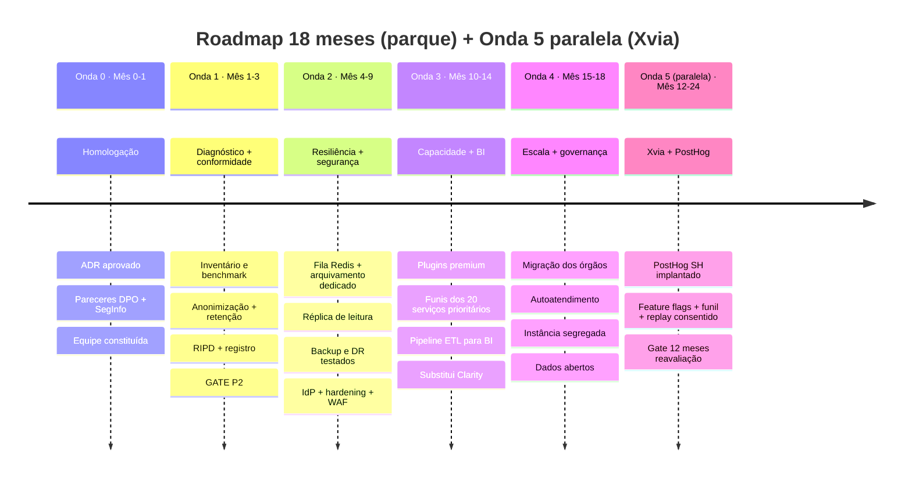
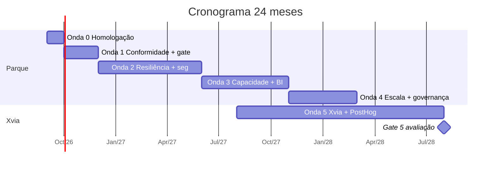

# 08 — Roadmap de Implementação

> **Anterior:** [07 — Recomendação](07-recomendacao.md) · **Próximo:** [99 — Referências](99-referencias.md)

Roadmap Ondas 0–4 do parque **preservado do ADR-001**. Revisão adiciona **Onda 5 — Portal Xvia (PostHog complementar)** com gate de 12 meses. Custo removido como driver de priorização (C03=0), mas orçamento mantido como referência de execução e prestação de contas.

---

## Sumário

- [1. Estratégia](#1-estratégia)
- [2. Visão geral](#2-visão-geral)
- [3. Onda 0 — Homologação](#3-onda-0--homologação)
- [4. Onda 1 — Diagnóstico + conformidade + gate P2](#4-onda-1--diagnóstico--conformidade--gate-p2)
- [5. Onda 2 — Resiliência + segurança](#5-onda-2--resiliência--segurança)
- [6. Onda 3 — Capacidade analítica + BI](#6-onda-3--capacidade-analítica--bi)
- [7. Onda 4 — Escala + governança](#7-onda-4--escala--governança)
- [8. Onda 5 — Portal Xvia (PostHog)](#8-onda-5--portal-xvia-posthog)
- [9. Cronograma consolidado](#9-cronograma-consolidado)
- [10. Orçamento](#10-orçamento)
- [11. Critérios de aceite](#11-critérios-de-aceite)

---

## 1. Estratégia

### Princípios

| # | Princípio |
|---|-----------|
| P1 | **Conformidade antes de funcionalidade** — nenhuma capacidade nova antes de LGPD formalizada |
| P2 | **Resiliência antes de escala** — desacoplamento precede ampliação de propriedades |
| P3 | **Sem migração de plataforma** — só adequação; sem risco de perda de histórico |
| P4 | **Entrega incremental com valor por onda** |
| P5 | **Gate de decisão antes de investimento pesado** — P2 validada na Onda 1 |
| P6 | **IaC desde o início** — elimina conhecimento tácito |
| P7 | **Reversibilidade** — rollback documentado e testado |

### Mapeamento lacunas → ondas

| Lacuna | Descrição | Onda |
|--------|-----------|:----:|
| L2 | Retenção formal | 1 |
| L5 | Anonimização padrão | 1 |
| L1 | Ingestão síncrona | 2 |
| L4 | Sem HA | 2 |
| L7 | Sem DR testado | 2 |
| L6 | Sem IdP | 2 |
| L3 | Agregação para BI | 3 |

---

## 2. Visão geral

### Resumo executivo

| Onda | Período | Objetivo | Valor | Investimento |
|:----:|---------|----------|-------|-------------:|
| 0 | Mês 0–1 | Homologar decisão | Auditável | ~R$ 15 k |
| 1 | Mês 1–3 | Conformidade + diagnóstico | Risco regulatório mitigado; P2 validada | ~R$ 85 k |
| 2 | Mês 4–9 | Resiliência + segurança | Zero perda em pico; DR testado | ~R$ 260 k |
| 3 | Mês 10–14 | Capacidade + BI | Funis dos serviços; BI integrado | ~R$ 175 k |
| 4 | Mês 15–18 | Escala + padronização | 80 % portais no padrão; autoatendimento | ~R$ 120 k |
| 5 | Mês 12–24 (paralela) | Xvia + PostHog | Product analytics soberano; gate 12 m | ~R$ 260 k |
| | | **Total 24 m** | | **~R$ 915 k** |

---

## 3. Onda 0 — Homologação

**Mês 0–1** · Transformar estudo em decisão institucional vinculante.

**Atividades-chave:** apresentação ao Comitê; parecer DPO + SegInfo; verificação junto à PGE de normativos estaduais LGPD; homologação do ADR-002 pelo Secretário Executivo; publicação do repositório (MkDocs); constituição da equipe; comunicação aos órgãos setoriais.

**Saída:** ADR-002 homologado; equipe formalmente alocada; repositório publicado.

---

## 4. Onda 1 — Diagnóstico + conformidade + gate P2

**Mês 1–3** · Mitigar risco regulatório e validar premissa técnica.

**Atividades-chave:**
- Inventário completo da instância Matomo atual (versão, plugins, propriedades, volume real).
- Benchmark de carga sob perfil de referência (`anexos/benchmark.md`).
- Configuração de anonimização de IP (2 bytes), cookieless e retenção (bruto 6m / agregado 60m) — aplicar em todas instâncias.
- Elaboração do RIPD da plataforma; registro de operações (LGPD art. 37); política de retenção formal.
- Aviso de privacidade dos portais atualizado.
- **Gate P2:** avaliação formal da capacidade STI. Falha → ativar contingência via ADR-003.

**Gate 1:** só passa à Onda 2 se DPO e SegInfo emitirem parecer favorável.

---

## 5. Onda 2 — Resiliência + segurança

**Mês 4–9** · Corrigir L1, L4, L6, L7.

**Atividades-chave:**
- Instalar plugin `QueuedTracking` + Redis (AA-1).
- Provisionar host dedicado ao cron `core:archive`; desabilitar arquivamento pelo navegador.
- Configurar réplica MySQL de leitura para relatórios e BI.
- Backup diário + binlog; teste trimestral de restauração; DR documentado (RPO ≤ 24h, RTO ≤ 8h).
- Federação de identidade via SAML/OIDC (plugin).
- Hardening + WAF + MFA obrigatório para admin.
- Log de auditoria exportado para SIEM.
- IaC (Terraform/Ansible) para toda implantação.

**Gate 2:** teste de carga com pico 30× em 45 min. Perda ≤ 1 %, p95 ≤ 200 ms, LCP inalterado.

---

## 6. Onda 3 — Capacidade analítica + BI

**Mês 10–14** · Habilitar diagnóstico de jornada de serviço digital.

**Frentes:**

**A — Analítica:** aquisição de plugins premium; metas + funis para os 20 serviços prioritários; taxonomia padrão de eventos; dimensões customizadas (órgão, tipo, canal); tracking server-side para eventos críticos; Matomo Tag Manager como padrão.

**B — Substituição do Microsoft Clarity:** configurar Heatmaps & Session Recording com mascaramento total; RIPD específico; propriedades autorizadas definidas; operação em paralelo por 4 semanas para comparar; remover script Clarity de 100 % dos portais.

**C — Integração BI:** modelar data mart; camada de *views* estáveis sobre schema; pipeline ETL da réplica para DW; consumo alternativo via Reporting API; painel corporativo de transformação digital; validar consistência entre painel e Matomo.

**Gate 3:** ≥ 20 serviços com funil; ETL em janela ≤ 2h sem degradar coleta; painel publicado; Clarity removido de 100 %.

---

## 7. Onda 4 — Escala + governança

**Mês 15–18** · Estender padrão a toda Administração; institucionalizar governança.

**Atividades-chave:**
- Guia de adoção para órgãos setoriais.
- Migrar portais dos órgãos para instância padronizada (≥ 80 %).
- Autoatendimento de provisionamento (≤ 1 dia útil por propriedade).
- Instância segregada para alta criticidade (saúde, assistência social) — AA-12.
- Roll-up por Secretaria.
- Avaliar Plausible CE para portais classe C (opcional).
- Publicar estatísticas agregadas como dado aberto.
- Institucionalizar comitê de governança de analytics.
- Revisão trimestral dos indicadores do ADR.
- Runbook v3; retrospectiva; lições aprendidas.

---

## 8. Onda 5 — Portal Xvia (PostHog)

**Mês 12–24 (paralela às Ondas 3 e 4)** · Product analytics soberano no Xvia. **Escopo restrito ao Xvia** — não altera o parque.

### Pré-requisitos

- ADR-002 homologado (Onda 0).
- Portal Xvia em desenvolvimento com equipe técnica alocada.
- Capacidade da infra do Estado para suportar stack PostHog (ClickHouse + Kafka + PG + Redis + MinIO).
- Reserva orçamentária para suporte especializado (contingência R-18).

### Atividades-chave

- Plano de capacitação da STI em ClickHouse + Kafka (12 semanas).
- Instalar Matomo (instância dedicada Xvia) com config cookieless padrão.
- Instalar PostHog auto-hospedado via Helm (ou fork mantido pela comunidade, dado que suporte oficial de K8s foi descontinuado em 2023).
- Configurar mascaramento agressivo padrão + opt-in explícito para session replay.
- Elaborar RIPD específico do replay (R-11).
- Integrar SSO (SAML/OIDC — EE PostHog).
- Instrumentar 5 funis identificados nos serviços transacionais críticos do Xvia.
- Habilitar feature flags para experimentação estruturada.
- Configurar reconciliação mensal Matomo × PostHog (divergência ≤ 15 % — G10).
- Monitoramento contínuo de LCP (p75, 3G) — meta ≤ 75 ms (G9).

### Gate 5 (mês 24 — 12 meses de operação)

Avaliar valor incremental:

- ≥ 3 feature flags ativas em produção?
- ≥ 5 funis identificados configurados?
- Session replay em ≥ 1 serviço crítico com consentimento?
- LCP ≤ 75 ms sustentado?
- Divergência Matomo × PostHog ≤ 15 %?
- STI opera stack sustentavelmente?

**Falha em 2+ critérios** → ADR-003 avalia migração para PostHog Cloud EU ou retorno a Matomo puro com plugins.

---

## 9. Cronograma consolidado

---

## 10. Orçamento

Valores marginais (P1/P2/R4 absorvem infra/kernel). Detalhamento por rubrica em `anexos/historico/comparativos/custo.md`.

| Onda | Rubricas principais | Total |
|:----:|--------------------|------:|
| 0 | Consultoria jurídica; workshops | ~R$ 15 k |
| 1 | Benchmark; DPO; documentação | ~R$ 85 k |
| 2 | Infra Redis + réplica; SI + hardening; capacitação | ~R$ 260 k |
| 3 | **Plugins premium** (~R$ 60 k); ETL; painel BI | ~R$ 175 k |
| 4 | Migração órgãos; automação provisionamento | ~R$ 120 k |
| 5 | PostHog EE (SSO+RBAC ~R$ 300 k); infra ClickHouse+Kafka; capacitação; suporte | ~R$ 260 k |
| | **Total 24 m** | **~R$ 915 k** |

**Custo recorrente pós-projeto:** ~R$ 145 k/ano (plugins + PostHog EE + operação marginal).

---

## 11. Critérios de aceite

| Onda | Critério de aceite |
|:----:|-------------------|
| 0 | ADR-002 homologado; equipe alocada; repositório publicado |
| 1 | Config LGPD aplicada em 100 % das instâncias; RIPD emitido; parecer DPO+SegInfo favorável; gate P2 validado |
| 2 | Teste de carga pico 30× — perda ≤ 1 %, p95 ≤ 200 ms; DR testado com sucesso; MFA em 100 % dos admins |
| 3 | ≥ 20 serviços com funil; ETL ≤ 2h; painel BI publicado; Clarity removido de 100 % |
| 4 | ≥ 80 % dos portais no padrão; autoatendimento ≤ 1 dia; dados abertos publicados; comitê de governança em operação |
| 5 | ≥ 3 feature flags + 5 funis; LCP Xvia ≤ 75 ms sustentado; divergência ≤ 15 %; STI sustenta stack |

---

## Navegação

| ⬅️ Anterior | ➡️ Próximo |
|------------|-----------|
| [07 — Recomendação](07-recomendacao.md) | [99 — Referências](99-referencias.md) |
