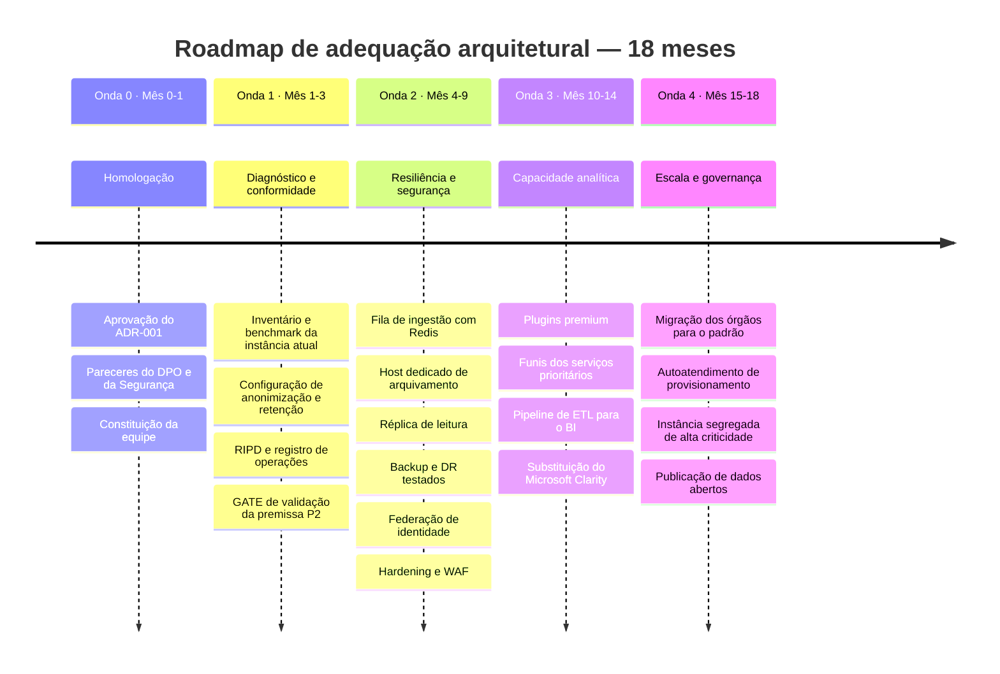
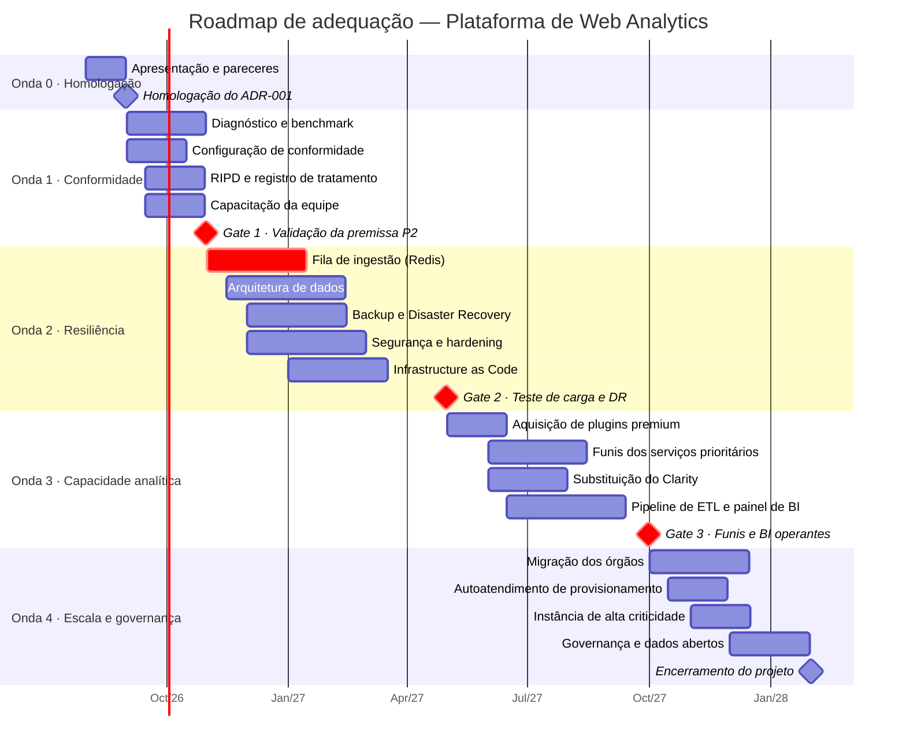
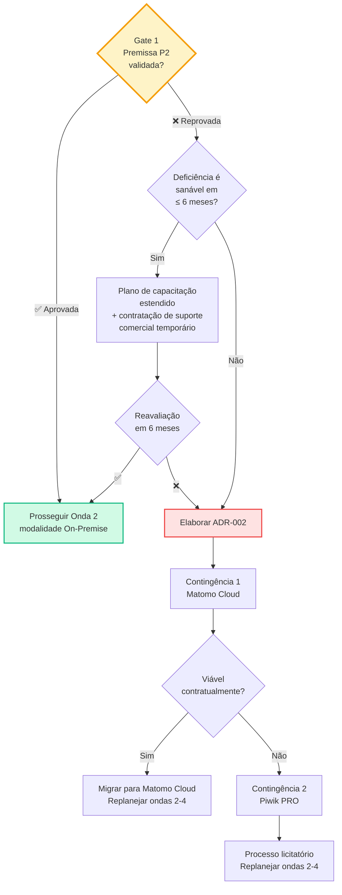

# 10 — Roadmap de Implementação

> **Anterior:** [09 — Recomendação](09-recomendacao.md) · **Próximo:** [11 — Riscos](11-riscos.md)

---

## Sumário

- [1. Estratégia de execução](#1-estratégia-de-execução)
- [2. Visão geral das ondas](#2-visão-geral-das-ondas)
- [3. Onda 0 — Homologação](#3-onda-0--homologação)
- [4. Onda 1 — Diagnóstico, conformidade e gate de capacidade](#4-onda-1--diagnóstico-conformidade-e-gate-de-capacidade)
- [5. Onda 2 — Resiliência e segurança](#5-onda-2--resiliência-e-segurança)
- [6. Onda 3 — Capacidade analítica e integração com BI](#6-onda-3--capacidade-analítica-e-integração-com-bi)
- [7. Onda 4 — Escala, padronização e governança](#7-onda-4--escala-padronização-e-governança)
- [8. Cronograma consolidado](#8-cronograma-consolidado)
- [9. Orçamento por onda](#9-orçamento-por-onda)
- [10. Equipe e papéis](#10-equipe-e-papéis)
- [11. Critérios de aceite](#11-critérios-de-aceite)
- [12. Plano de contingência](#12-plano-de-contingência)

---

## 1. Estratégia de execução

### 1.1 Princípios

| # | Princípio | Aplicação |
|---|-----------|-----------|
| P1 | **Conformidade antes de funcionalidade** | Nenhuma nova capacidade analítica é entregue antes de a conformidade LGPD estar formalizada |
| P2 | **Resiliência antes de escala** | O desacoplamento da ingestão precede qualquer ampliação de escopo de propriedades |
| P3 | **Sem migração de plataforma** | O esforço é de adequação arquitetural; não há troca de produto, portanto não há risco de perda de série histórica |
| P4 | **Entrega incremental com valor por onda** | Cada onda entrega benefício verificável, não apenas trabalho intermediário |
| P5 | **Gate de decisão antes de investimento pesado** | A premissa P2 é validada na Onda 1, antes do investimento das ondas seguintes |
| P6 | **Infrastructure as Code desde o início** | Toda a infraestrutura é declarada em código, eliminando conhecimento tácito |
| P7 | **Reversibilidade** | Toda alteração possui procedimento de rollback documentado e testado |

### 1.2 Mapeamento lacunas → ondas

| Lacuna ([01, seção 5.3](01-contexto.md#53-lacunas-técnicas-da-arquitetura-vigente)) | Descrição | Onda |
|---|-----------|:----:|
| **L2** | Ausência de política formal de retenção | 1 |
| **L5** | Ausência de padrão de anonimização documentado | 1 |
| **L1** | Ingestão síncrona (sem fila) | 2 |
| **L4** | Sem alta disponibilidade documentada | 2 |
| **L7** | Sem plano de Disaster Recovery testado | 2 |
| **L6** | Sem integração com provedor de identidade | 2 |
| **L3** | Ausência de camada de agregação para BI | 3 |

---

## 2. Visão geral das ondas

### 2.1 Resumo executivo das ondas

| Onda | Período | Objetivo | Valor entregue | Investimento |
|:----:|---------|----------|----------------|-------------:|
| **0** | Mês 0–1 | Homologar a decisão | Decisão formalizada e auditável | ~R$ 15 k |
| **1** | Mês 1–3 | Conformidade e diagnóstico | Risco regulatório mitigado; premissa P2 validada | ~R$ 85 k |
| **2** | Mês 4–9 | Resiliência e segurança | Zero perda de eventos em pico; DR testado | ~R$ 260 k |
| **3** | Mês 10–14 | Capacidade analítica | Funis dos serviços digitais; BI integrado | ~R$ 175 k |
| **4** | Mês 15–18 | Escala e padronização | 80 % dos portais no padrão; autoatendimento | ~R$ 120 k |
| | | **Total** | | **~R$ 655 k** |

---

## 3. Onda 0 — Homologação

**Período:** Mês 0 a 1 · **Objetivo:** transformar o estudo em decisão institucional vinculante.

### 3.1 Atividades

| # | Atividade | Responsável | Duração | Dependência |
|---|-----------|------------|---------|-------------|
| 0.1 | Apresentação do estudo ao Comitê de Arquitetura | Arquitetura | 1 semana | — |
| 0.2 | Parecer do Encarregado de Dados sobre o padrão de conformidade | DPO | 2 semanas | 0.1 |
| 0.3 | Parecer da Segurança da Informação sobre a arquitetura-alvo | SI | 2 semanas | 0.1 |
| 0.4 | Verificação junto à PGE sobre normativos estaduais de LGPD aplicáveis | Arquitetura + PGE | 2 semanas | — |
| 0.5 | Homologação do ADR-001 pelo Secretário Executivo | SETDIG | 1 semana | 0.2, 0.3, 0.4 |
| 0.6 | Publicação do repositório do estudo (MkDocs ou wiki) | Arquitetura | 1 semana | 0.5 |
| 0.7 | Constituição da equipe do projeto e alocação formal | STI + SGD | 1 semana | 0.5 |
| 0.8 | Comunicação da decisão aos órgãos setoriais | SETDIG | 1 semana | 0.5 |

### 3.2 Entregas

- [ ] ADR-001 homologado, com registro de aprovação preenchido
- [ ] Parecer favorável do Encarregado de Dados (ou ressalvas registradas)
- [ ] Parecer favorável da Segurança da Informação (ou ressalvas registradas)
- [ ] Manifestação da PGE sobre normativos estaduais aplicáveis
- [ ] Repositório do estudo publicado e acessível
- [ ] Equipe constituída, com papéis atribuídos
- [ ] Comunicação formal aos órgãos

### 3.3 Critérios de saída

> **✅ Gate 0**
> A Onda 1 só inicia se: (a) o ADR-001 estiver homologado; **e** (b) não houver veto do DPO ou da Segurança da Informação; **e** (c) a equipe estiver formalmente alocada.
>
> **Veto do DPO ou da SI suspende integralmente o roadmap** e exige revisão do estudo antes de qualquer prosseguimento.

---

## 4. Onda 1 — Diagnóstico, conformidade e gate de capacidade

**Período:** Mês 1 a 3 · **Objetivo:** eliminar o risco regulatório imediato e decidir sobre a modalidade de entrega.

### 4.1 Frente A — Diagnóstico

| # | Atividade | Responsável | Duração |
|---|-----------|------------|---------|
| 1.1 | Inventário completo de propriedades rastreadas, por órgão | STI | 2 semanas |
| 1.2 | Medição de volume real: page views, eventos, visitantes, picos | STI | 2 semanas |
| 1.3 | Levantamento da configuração atual de cada instância | STI | 2 semanas |
| 1.4 | Benchmark da instância atual conforme [`../anexos/benchmark.md`](../anexos/benchmark.md) | STI | 3 semanas |
| 1.5 | Análise de gap entre a configuração atual e a arquitetura-alvo | Arquitetura | 1 semana |
| 1.6 | Revisão do dimensionamento com base no volume medido | Arquitetura | 1 semana |

### 4.2 Frente B — Conformidade

| # | Atividade | Responsável | Duração | Requisito |
|---|-----------|------------|---------|-----------|
| 1.10 | Aplicar anonimização de IP (2 bytes) em todas as propriedades | STI | 1 semana | RL-03 |
| 1.11 | Desabilitar cookies de identificação (`disableCookies`) | STI | 2 semanas | RL-04 |
| 1.12 | Configurar `enable_userid_overwrites_visitorid = 0` | STI | 1 dia | RL-13 |
| 1.13 | Habilitar respeito a Do Not Track | STI | 1 dia | RL-08 |
| 1.14 | Configurar política de retenção: bruto 6 meses, agregado 60 meses | STI | 1 semana | RL-05 |
| 1.15 | Executar a primeira purga de dado bruto excedente | STI | 1 semana | RL-05 |
| 1.16 | Habilitar log de auditoria e definir destino de exportação | STI | 1 semana | RL-10 |
| 1.17 | Publicar mecanismo de opt-out nos portais | STI + Comunicação | 2 semanas | RL-07 |
| 1.18 | Atualizar aviso de privacidade dos portais (seção analytics) | Comunicação + DPO | 3 semanas | LGPD art. 9º |
| 1.19 | Elaborar registro de operações de tratamento | DPO + STI | 3 semanas | RL-09 |
| 1.20 | Elaborar RIPD da plataforma de analytics | DPO | 4 semanas | LGPD art. 38 |
| 1.21 | Formalizar a política de retenção como norma interna | SETDIG + DPO | 3 semanas | RL-05 |
| 1.22 | Suspender ou restringir o uso do Microsoft Clarity em serviços transacionais | STI + DPO | 2 semanas | RC-2 |

> **🚨 Alerta — A atividade 1.15 é irreversível**
> A purga de dado bruto excedente **elimina permanentemente** registros anteriores ao prazo de retenção. Antes da execução:
> 1. Confirmar que o dado agregado correspondente (`matomo_archive_*`) está íntegro — é ele que preserva a série histórica;
> 2. Executar backup completo e **verificar a restauração** em ambiente separado;
> 3. Executar primeiro em ambiente de homologação, com validação dos relatórios;
> 4. Obter autorização formal do Encarregado de Dados.
>
> A eliminação do dado bruto **não elimina a série histórica de relatórios**, pois o Matomo mantém os agregados. Essa distinção deve estar clara para todos os envolvidos antes da execução.

### 4.3 Frente C — Capacitação e gate

| # | Atividade | Responsável | Duração |
|---|-----------|------------|---------|
| 1.30 | Capacitação da equipe de infraestrutura (40 h) | STI | 4 semanas |
| 1.31 | Capacitação de analistas na plataforma (24 h) | SGD | 3 semanas |
| 1.32 | Elaboração do runbook operacional inicial | STI | 3 semanas |
| 1.33 | **Avaliação formal da capacidade de sustentação (premissa P2)** | Arquitetura + STI | 2 semanas |

### 4.4 Gate de validação da premissa P2

> **✅ Gate 1 — Validação da capacidade técnica interna**
>
> Avaliação formal, com resultado documentado, sobre a capacidade da STI de sustentar a plataforma na modalidade On-Premise.
>
> **Critérios objetivos de aprovação — todos devem ser atendidos:**
>
> | # | Critério | Verificação |
> |---|----------|-------------|
> | G1.1 | Ao menos **2 servidores** capacitados em Linux, MySQL e operação do Matomo | Avaliação prática pós-capacitação |
> | G1.2 | Alocação formal de **≥ 0,3 FTE** para operação da plataforma | Portaria ou designação formal |
> | G1.3 | Ferramental de monitoramento disponível e operante | Métricas coletadas do ambiente atual |
> | G1.4 | Procedimento de backup **testado com restauração bem-sucedida** | Relatório de teste |
> | G1.5 | Runbook operacional elaborado e validado | Documento aprovado |
> | G1.6 | Capacidade de aplicar patch de segurança em ≤ 72 h demonstrada | Simulação executada |
>
> **Resultado aprovado** → prosseguir para a Onda 2 na modalidade On-Premise.
>
> **Resultado reprovado** → acionar o plano de contingência (seção 12): elaborar **ADR-002** propondo a migração para Matomo Cloud, com o Piwik PRO como segunda alternativa. As ondas 2 a 4 são replanejadas.

### 4.5 Entregas da Onda 1

- [ ] Inventário completo de propriedades e configurações
- [ ] Relatório de benchmark com volume real medido
- [ ] Dimensionamento revisado
- [ ] Todas as propriedades com anonimização de IP e cookieless
- [ ] Política de retenção formalizada e aplicada
- [ ] Primeira purga executada e validada
- [ ] Registro de operações de tratamento
- [ ] RIPD aprovado pelo Encarregado
- [ ] Aviso de privacidade atualizado
- [ ] Opt-out publicado
- [ ] Runbook operacional v1
- [ ] Equipe capacitada
- [ ] **Resultado do Gate 1 documentado**

### 4.6 Indicadores de sucesso

| Indicador | Meta |
|-----------|------|
| Propriedades com anonimização de IP | 100 % |
| Propriedades operando cookieless | ≥ 95 % |
| Aderência à política de retenção | 100 % |
| RIPD aprovado | Sim |
| Servidores capacitados | ≥ 2 |

---

## 5. Onda 2 — Resiliência e segurança

**Período:** Mês 4 a 9 · **Objetivo:** eliminar o risco de perda de eventos e estabelecer postura de segurança e continuidade.

### 5.1 Frente A — Desacoplamento de ingestão (AA-1)

| # | Atividade | Responsável | Duração | Lacuna |
|---|-----------|------------|---------|:------:|
| 2.1 | Provisionar Redis com persistência AOF e réplica | STI | 2 semanas | L1 |
| 2.2 | Instalar e configurar o plugin `QueuedTracking` | STI | 1 semana | L1 |
| 2.3 | Configurar número de filas e workers conforme volume medido | STI | 2 semanas | L1 |
| 2.4 | Implementar monitoramento de profundidade de fila com alertas | STI | 2 semanas | L1 |
| 2.5 | **Teste de carga com pico de 30×** (cenário QA-01) | STI | 3 semanas | L1 |
| 2.6 | Ajuste fino com base no resultado do teste | STI | 2 semanas | L1 |

### 5.2 Frente B — Arquitetura de dados

| # | Atividade | Responsável | Duração | Lacuna |
|---|-----------|------------|---------|:------:|
| 2.10 | Provisionar host dedicado para o cron de arquivamento (AA-3) | STI | 2 semanas | — |
| 2.11 | Desabilitar arquivamento disparado pelo navegador | STI | 1 dia | — |
| 2.12 | Configurar paralelização do arquivamento | STI | 2 semanas | — |
| 2.13 | Definir governança de segmentos pré-processados | Arquitetura + SGD | 2 semanas | — |
| 2.14 | Provisionar réplica de leitura do MySQL (AA-4) | STI | 3 semanas | L3 |
| 2.15 | Configurar aplicação de relatórios para usar a réplica | STI | 2 semanas | L3 |
| 2.16 | Aplicar tuning do MySQL conforme seção 9.3 da recomendação | STI | 2 semanas | — |
| 2.17 | Implementar particionamento das tabelas `matomo_log_*` | STI | 3 semanas | — |

### 5.3 Frente C — Continuidade

| # | Atividade | Responsável | Duração | Lacuna |
|---|-----------|------------|---------|:------:|
| 2.20 | Implementar backup diário completo + binlog contínuo (AA-9) | STI | 3 semanas | L7 |
| 2.21 | Definir e documentar RPO (≤ 24 h) e RTO (≤ 8 h) | Arquitetura | 1 semana | L7 |
| 2.22 | Elaborar plano de Disaster Recovery | Arquitetura + STI | 3 semanas | L7 |
| 2.23 | **Executar teste completo de DR** com restauração em ambiente limpo | STI | 2 semanas | L7 |
| 2.24 | Estabelecer rotina trimestral de teste de restauração | STI | 1 semana | L7 |
| 2.25 | Implementar segundo nó de coleta atrás do balanceador (AA-2) | STI | 3 semanas | L4 |

### 5.4 Frente D — Segurança

| # | Atividade | Responsável | Duração | Lacuna |
|---|-----------|------------|---------|:------:|
| 2.30 | Restringir a interface administrativa a rede interna/VPN (AA-5) | STI + SI | 2 semanas | — |
| 2.31 | Configurar WAF sobre o endpoint de coleta | STI + SI | 3 semanas | — |
| 2.32 | Aplicar hardening do sistema operacional e do PHP | STI | 2 semanas | — |
| 2.33 | Habilitar MFA obrigatório para todos os usuários administrativos | STI | 2 semanas | RNF-31 |
| 2.34 | Integrar autenticação com o provedor de identidade (SAML/OIDC) (AA-7) | STI | 4 semanas | L6 |
| 2.35 | Exportar log de auditoria para o SIEM | STI + SI | 3 semanas | RNF-34 |
| 2.36 | Estabelecer processo de aplicação de patch em ≤ 72 h | STI + SI | 2 semanas | RNF-36 |
| 2.37 | Executar teste de intrusão na plataforma | SI | 3 semanas | — |

### 5.5 Frente E — Infrastructure as Code

| # | Atividade | Responsável | Duração |
|---|-----------|------------|---------|
| 2.40 | Declarar toda a infraestrutura em código (AA-11) | STI | 6 semanas |
| 2.41 | Implementar ambiente de homologação equivalente ao de produção | STI | 3 semanas |
| 2.42 | Documentar procedimento de atualização com rollback | STI | 2 semanas |
| 2.43 | Atualizar o runbook operacional (v2) | STI | 2 semanas |

### 5.6 Critérios de saída

> **✅ Gate 2**
> A Onda 3 só inicia se, cumulativamente:
> - Teste de carga com pico de 30× concluído com **perda de eventos ≤ 1 %** e **latência p95 ≤ 200 ms**;
> - Teste de DR executado com sucesso dentro do RTO de 8 h;
> - MFA habilitado para 100 % dos usuários administrativos;
> - Interface administrativa inacessível pela internet pública;
> - Teste de intrusão sem achado crítico em aberto.

### 5.7 Entregas da Onda 2

- [ ] Fila de ingestão operante com monitoramento
- [ ] Teste de carga de pico aprovado
- [ ] Host de arquivamento dedicado
- [ ] Réplica de leitura operante
- [ ] Backup diário verificado
- [ ] Plano de DR documentado e testado
- [ ] Segundo nó de coleta em produção
- [ ] Interface administrativa restrita
- [ ] WAF configurado
- [ ] MFA obrigatório
- [ ] Federação de identidade integrada
- [ ] Log de auditoria no SIEM
- [ ] Infraestrutura declarada em código
- [ ] Ambiente de homologação disponível
- [ ] Relatório de teste de intrusão

---

## 6. Onda 3 — Capacidade analítica e integração com BI

**Período:** Mês 10 a 14 · **Objetivo:** habilitar diagnóstico de jornadas de serviço digital e alimentar o BI corporativo.

### 6.1 Frente A — Capacidade analítica

| # | Atividade | Responsável | Duração | Requisito |
|---|-----------|------------|---------|-----------|
| 3.1 | Aquisição dos plugins premium (Funnels, Heatmaps & Session Recording, Form Analytics, Custom Reports, Roll-Up Reporting) | SETDIG | 6 semanas | RF-27, RF-32/33/34 |
| 3.2 | Instalar e configurar os plugins | STI | 2 semanas | — |
| 3.3 | Mapear os 20 serviços digitais de maior volume | SGD | 3 semanas | RN-02 |
| 3.4 | Configurar metas para os serviços digitais prioritários | SGD | 4 semanas | RF-26, RN-01 |
| 3.5 | Configurar funis multi-etapa para os 20 serviços prioritários | SGD | 6 semanas | RF-27, RN-02 |
| 3.6 | Definir e implantar taxonomia padrão de eventos | Arquitetura + SGD | 4 semanas | RF-02 |
| 3.7 | Implementar dimensões customizadas padronizadas (órgão, tipo de serviço, canal) | STI + SGD | 3 semanas | RF-05 |
| 3.8 | Implementar tracking server-side para eventos críticos de conclusão de serviço | STI | 4 semanas | RF-06 |
| 3.9 | Configurar o Matomo Tag Manager como padrão | STI | 3 semanas | RI-13 |

### 6.2 Frente B — Substituição do Microsoft Clarity (RC-2)

| # | Atividade | Responsável | Duração |
|---|-----------|------------|---------|
| 3.15 | Configurar Heatmaps & Session Recording do Matomo com mascaramento total por padrão | STI | 2 semanas |
| 3.16 | Elaborar RIPD específico da funcionalidade de gravação de sessão | DPO | 3 semanas |
| 3.17 | Definir lista de propriedades autorizadas a usar gravação de sessão | SGD + DPO | 2 semanas |
| 3.18 | Executar operação em paralelo e comparar resultados | SGD | 4 semanas |
| 3.19 | **Remover o script do Microsoft Clarity de todos os portais** | STI | 2 semanas |

### 6.3 Frente C — Integração com BI

| # | Atividade | Responsável | Duração | Requisito |
|---|-----------|------------|---------|-----------|
| 3.20 | Modelar o *data mart* de analytics | Arquitetura + BI | 4 semanas | RN-04 |
| 3.21 | Implementar camada de *views* SQL estáveis sobre o schema do Matomo | STI | 3 semanas | — |
| 3.22 | Desenvolver o pipeline de ETL da réplica para o data warehouse | BI | 6 semanas | RI-17 |
| 3.23 | Implementar consumo alternativo via Reporting API para casos não cobertos pelo ETL | BI | 3 semanas | RI-01 |
| 3.24 | Construir painel corporativo de transformação digital | BI + SGD | 6 semanas | RN-04 |
| 3.25 | Validar consistência entre o painel de BI e a interface do Matomo | BI + SGD | 2 semanas | — |
| 3.26 | Documentar o padrão de integração para os órgãos | Arquitetura | 2 semanas | — |

### 6.4 Critérios de saída

> **✅ Gate 3**
> A Onda 4 só inicia se:
> - ≥ 20 serviços digitais prioritários com funil configurado e produzindo dados;
> - Pipeline de ETL executando na janela definida (≤ 2 h) sem degradar a coleta;
> - Painel corporativo publicado e validado;
> - Script do Microsoft Clarity removido de 100 % dos portais.

### 6.5 Entregas da Onda 3

- [ ] Plugins premium adquiridos e operantes
- [ ] 20 serviços prioritários com funil configurado
- [ ] Metas configuradas para os serviços digitais
- [ ] Taxonomia padrão de eventos publicada
- [ ] Dimensões customizadas padronizadas
- [ ] Tracking server-side para eventos críticos
- [ ] Matomo Tag Manager como padrão
- [ ] Microsoft Clarity substituído e removido
- [ ] *Data mart* de analytics modelado
- [ ] Pipeline de ETL operante
- [ ] Painel corporativo publicado
- [ ] Guia de integração para órgãos

---

## 7. Onda 4 — Escala, padronização e governança

**Período:** Mês 15 a 18 · **Objetivo:** estender o padrão a toda a Administração e institucionalizar a governança.

### 7.1 Atividades

| # | Atividade | Responsável | Duração | Requisito |
|---|-----------|------------|---------|-----------|
| 4.1 | Elaborar o guia de adoção para órgãos setoriais | Arquitetura + SGD | 3 semanas | RN-03 |
| 4.2 | Migrar os portais dos órgãos para a instância padronizada | STI + órgãos | 10 semanas | RN-03 |
| 4.3 | Implementar autoatendimento de provisionamento de propriedades | STI | 6 semanas | RN-07 |
| 4.4 | Provisionar instância segregada para serviços de alta criticidade (AA-12) | STI | 4 semanas | — |
| 4.5 | Migrar serviços de saúde e assistência social para a instância segregada | STI + órgãos | 4 semanas | — |
| 4.6 | Implementar relatórios agregados (roll-up) por Secretaria | SGD | 3 semanas | RF-42 |
| 4.7 | Avaliar e, se justificado, implantar Plausible CE para portais classe C | STI | 4 semanas | RC-1 |
| 4.8 | Publicar estatísticas agregadas de uso como dado aberto | SGD + Comunicação | 4 semanas | RN-06, RF-14 |
| 4.9 | Institucionalizar o comitê de governança de analytics | SETDIG | 3 semanas | — |
| 4.10 | Estabelecer rotina de revisão trimestral dos indicadores do ADR | Arquitetura | 2 semanas | ADR seção 11.3 |
| 4.11 | Atualizar o runbook operacional (v3) e a documentação final | STI | 3 semanas | — |
| 4.12 | Realizar retrospectiva do projeto e registrar lições aprendidas | Todos | 2 semanas | — |

### 7.2 Entregas da Onda 4

- [ ] Guia de adoção publicado
- [ ] ≥ 80 % dos portais na instância padronizada
- [ ] Autoatendimento de provisionamento operante (≤ 1 dia útil)
- [ ] Instância segregada de alta criticidade em produção
- [ ] Relatórios agregados por Secretaria
- [ ] Avaliação do Plausible CE concluída
- [ ] Conjunto de dados abertos publicado
- [ ] Comitê de governança constituído
- [ ] Rotina de revisão de indicadores estabelecida
- [ ] Documentação final e runbook v3
- [ ] Registro de lições aprendidas

---

## 8. Cronograma consolidado

### 8.1 Marcos críticos

| Marco | Data prevista | Criticidade | Consequência do atraso |
|-------|--------------|:-----------:|-----------------------|
| **M0** — ADR homologado | Ago/2026 | 🔴 Crítico | Bloqueia todo o roadmap |
| **M1** — Gate da premissa P2 | Out/2026 | 🔴 Crítico | Define a modalidade; atraso posterga todo o investimento |
| **M2** — Teste de carga e DR aprovados | Abr/2027 | 🔴 Crítico | Risco R-02 permanece crítico |
| **M3** — Funis e BI operantes | Set/2027 | 🟠 Alto | Requisitos RN-02 e RN-04 não atendidos |
| **M4** — Encerramento | Jan/2028 | 🟡 Médio | Padronização incompleta |

---

## 9. Orçamento por onda

> **⚠️ Bloco de Risco — Natureza das estimativas**
> Os valores são **estimativas de planejamento**, não cotações. Baseiam-se em bandas de referência de mercado de TI público e nas premissas de infraestrutura de [`../comparativos/custo.md`](../comparativos/custo.md). **Não devem ser usados em peça orçamentária ou licitatória sem cotação formal.**

### 9.1 Detalhamento

| Onda | Item | Natureza | Valor estimado |
|:----:|------|----------|---------------:|
| **0** | Horas de equipe própria (homologação) | OPEX | R$ 15.000 |
| | **Subtotal Onda 0** | | **R$ 15.000** |
| **1** | Horas de equipe própria (diagnóstico e conformidade) | OPEX | R$ 45.000 |
| | Capacitação técnica (2 servidores) | OPEX | R$ 25.000 |
| | Assessoria em conformidade (RIPD) | OPEX | R$ 15.000 |
| | **Subtotal Onda 1** | | **R$ 85.000** |
| **2** | Infraestrutura adicional (Redis, réplica, host de arquivamento, nó de coleta) | CAPEX/OPEX | R$ 120.000 |
| | Armazenamento de backup (3 TB) | CAPEX | R$ 25.000 |
| | Horas de equipe própria | OPEX | R$ 80.000 |
| | Teste de intrusão | OPEX | R$ 35.000 |
| | **Subtotal Onda 2** | | **R$ 260.000** |
| **3** | Plugins premium Matomo (licença + 1º ano de atualizações) | OPEX | R$ 25.000 |
| | Horas de equipe própria (configuração analítica) | OPEX | R$ 70.000 |
| | Desenvolvimento do pipeline de ETL e painel de BI | OPEX | R$ 80.000 |
| | **Subtotal Onda 3** | | **R$ 175.000** |
| **4** | Infraestrutura da instância segregada | CAPEX/OPEX | R$ 45.000 |
| | Horas de equipe própria (migração e governança) | OPEX | R$ 60.000 |
| | Infraestrutura do Plausible CE (se adotado) | CAPEX/OPEX | R$ 15.000 |
| | **Subtotal Onda 4** | | **R$ 120.000** |
| | **TOTAL DO PROJETO (18 meses)** | | **R$ 655.000** |

### 9.2 Custo recorrente pós-projeto

| Item | Valor anual estimado |
|------|---------------------:|
| Infraestrutura (7 instâncias + armazenamento) | R$ 44.000 |
| Renovação de atualizações dos plugins premium | R$ 12.000 |
| Operação (0,3 FTE) | R$ 60.000 |
| **Total anual recorrente** | **R$ 116.000** |

### 9.3 Conciliação com o TCO de 5 anos

| Componente | Valor |
|-----------|------:|
| Projeto de adequação (18 meses) | R$ 655.000 |
| Custo recorrente — anos 2 a 5 (3,5 anos × R$ 116 k) | R$ 406.000 |
| **TCO total em 5 anos** | **R$ 1.061.000** |

> **📌 Observação — Divergência em relação ao TCO da matriz**
> O TCO estimado em [`05-comparativo-detalhado.md`](05-comparativo-detalhado.md#13-custos) para o Matomo On-Premise é de ~R$ 660 k. O valor acima é de ~R$ 1,06 M. A diferença de ~R$ 400 k é explicável e não invalida a comparação:
>
> 1. **A matriz comparou plataformas em condição de igualdade** — o custo de estabelecer arquitetura, conformidade e integração com BI seria incorrido em **qualquer** plataforma auto-hospedado escolhida.
> 2. **Este roadmap inclui custos de adequação institucional** (RIPD, capacitação, teste de intrusão, painel de BI) que não são custos da plataforma, e sim da maturidade que o Estado está adquirindo.
> 3. **Aplicando a mesma base de cálculo às alternativas**, a ordem relativa se mantém: as demais plataformas auto-hospedado incorreriam nos mesmos custos institucionais, e as SaaS os incorreriam parcialmente, acrescidos de licença.
>
> A comparação da matriz permanece válida; este orçamento é o custo real de execução, não a base comparativa.

---

## 10. Equipe e papéis

| Papel | Alocação | Responsabilidades | Ondas |
|-------|:--------:|-------------------|:-----:|
| **Patrocinador** (Secretário Executivo) | 5 % | Homologação, remoção de impedimentos, decisões de contingência | Todas |
| **Arquiteto de Soluções** | 30 % | Arquitetura-alvo, gates, ADRs, governança técnica | Todas |
| **Gerente de projeto** | 50 % | Cronograma, riscos, articulação entre órgãos | Todas |
| **Administrador de infraestrutura** (2 pessoas) | 50 % cada | Implantação, tuning, backup, monitoramento, IaC | 1–4 |
| **DBA** | 20 % | Tuning do MySQL, réplica, particionamento, backup | 2–3 |
| **Analista de segurança** | 20 % | Hardening, WAF, teste de intrusão, SIEM | 2 |
| **Encarregado de Dados (DPO)** | 20 % | RIPD, registro de tratamento, pareceres, autorizações | 1, 3 |
| **Analista de dados / BI** | 40 % | ETL, *data mart*, painel corporativo | 3 |
| **Analista de negócio** (SGD) | 40 % | Taxonomia, metas, funis, capacitação de usuários | 1, 3, 4 |
| **Analista de comunicação** | 10 % | Aviso de privacidade, comunicação, dados abertos | 1, 4 |

### 10.1 Matriz RACI resumida

| Atividade-chave | Patrocinador | Arquiteto | GP | Infra | DPO | BI | SGD |
|----------------|:------------:|:---------:|:--:|:-----:|:---:|:--:|:---:|
| Homologação do ADR | **A** | R | C | I | C | I | C |
| Configuração de conformidade | I | C | C | **R** | **A** | I | I |
| Gate da premissa P2 | **A** | **R** | C | C | I | I | I |
| Fila de ingestão | I | C | C | **R/A** | I | I | I |
| Teste de DR | I | C | C | **R/A** | I | I | I |
| Configuração de funis | I | C | C | C | I | C | **R/A** |
| Pipeline de ETL | I | C | C | C | I | **R/A** | C |
| Migração dos órgãos | I | C | **R/A** | R | I | I | C |

**R** = Responsável pela execução · **A** = Aprovador · **C** = Consultado · **I** = Informado

---

## 11. Critérios de aceite

### 11.1 Por onda

| Onda | Critério de aceite | Método de verificação |
|:----:|-------------------|----------------------|
| **0** | ADR homologado sem veto | Documento assinado |
| **1** | 100 % das propriedades com anonimização e retenção conforme | Consulta SQL de auditoria |
| **1** | RIPD aprovado | Parecer do Encarregado |
| **1** | Gate P2 com resultado documentado | Relatório de avaliação |
| **2** | Perda de eventos ≤ 1 % em pico de 30× | Teste de carga |
| **2** | Latência p95 do endpoint ≤ 200 ms sob pico | Teste de carga |
| **2** | RTO ≤ 8 h comprovado | Teste de DR |
| **2** | MFA em 100 % dos usuários administrativos | Auditoria de contas |
| **2** | Zero achado crítico em aberto | Relatório de teste de intrusão |
| **3** | ≥ 20 serviços com funil produzindo dados | Inspeção da plataforma |
| **3** | ETL executando em ≤ 2 h sem degradar a coleta | Log de execução + métricas |
| **3** | Clarity removido de 100 % dos portais | Varredura automatizada de tags |
| **4** | ≥ 80 % dos portais na instância padronizada | Inventário |
| **4** | Provisionamento em ≤ 1 dia útil | Registro de chamados |
| **4** | Dados abertos publicados | URL pública |

### 11.2 Critério de aceite global do projeto

> **✅ Aceite final**
> O projeto é considerado concluído com sucesso quando **todos os 12 indicadores de acompanhamento** definidos em [`08-adr.md`, seção 11.3](08-adr.md#113-indicadores-de-acompanhamento) forem medidos e apresentarem resultado dentro da meta por **dois trimestres consecutivos**.
>
> A conclusão das atividades do roadmap **não é**, por si só, critério de aceite. O critério é o resultado operacional sustentado.

---

## 12. Plano de contingência

### 12.1 Contingência principal — reprovação no Gate 1

### 12.2 Contingências específicas

| Cenário | Gatilho | Resposta | Responsável |
|---------|---------|----------|-------------|
| **Reprovação no Gate 1** | Menos de 2 critérios G1.x atendidos | Plano de capacitação estendido; se persistir, ADR-002 → Matomo Cloud | Arquiteto |
| **Teste de carga reprovado** | Perda de eventos > 1 % com a fila configurada | Redimensionar Redis e workers; adicionar nós de coleta; se persistir, avaliar arquitetura de ingestão alternativa | Infra + Arquiteto |
| **Teste de DR reprovado** | RTO > 8 h | Revisar estratégia de backup; considerar réplica em sítio secundário | Infra |
| **Achado crítico no teste de intrusão** | Vulnerabilidade crítica explorável | Suspender exposição pública até correção; acionar gatilho G5 do ADR | SI |
| **Indisponibilidade orçamentária para plugins** | Dotação não confirmada | Reduzir escopo da Onda 3: manter metas e funis básicos; adiar heatmap e session recording | Patrocinador |
| **Atraso superior a 2 ondas** | Cronograma com desvio > 6 meses | Acionar gatilho G7 do ADR — revisão antecipada | GP + Arquiteto |
| **Manifestação da ANPD** | Publicação de entendimento sobre analytics | Acionar gatilho G1 do ADR — revisão em 60 dias | DPO + Arquiteto |
| **Crescimento superior a 5×** | Volume medido excede a projeção | Acionar gatilho G4 do ADR — reavaliar arquitetura de dados | Arquiteto |
| **Perda de pessoal-chave** | Saída de servidor capacitado | Ativar segundo capacitado; contratar suporte comercial temporário; revalidar Gate 1 | STI |

### 12.3 Impacto das contingências no cronograma e no orçamento

| Contingência | Impacto no prazo | Impacto no orçamento |
|-------------|:----------------:|---------------------:|
| Capacitação estendida | +6 meses | +R$ 60 k |
| Migração para Matomo Cloud | +3 meses | +R$ 480 k (5 anos) − R$ 220 k (infra evitada) |
| Migração para Piwik PRO | +9 meses (licitação) | +R$ 900 k (5 anos) |
| Redimensionamento pós-teste de carga | +2 meses | +R$ 60 k |
| Escopo reduzido da Onda 3 | 0 | −R$ 25 k |

---

## Navegação

| ⬅️ Anterior | ➡️ Próximo |
|------------|-----------|
| [09 — Recomendação](09-recomendacao.md) | [11 — Riscos](11-riscos.md) |
