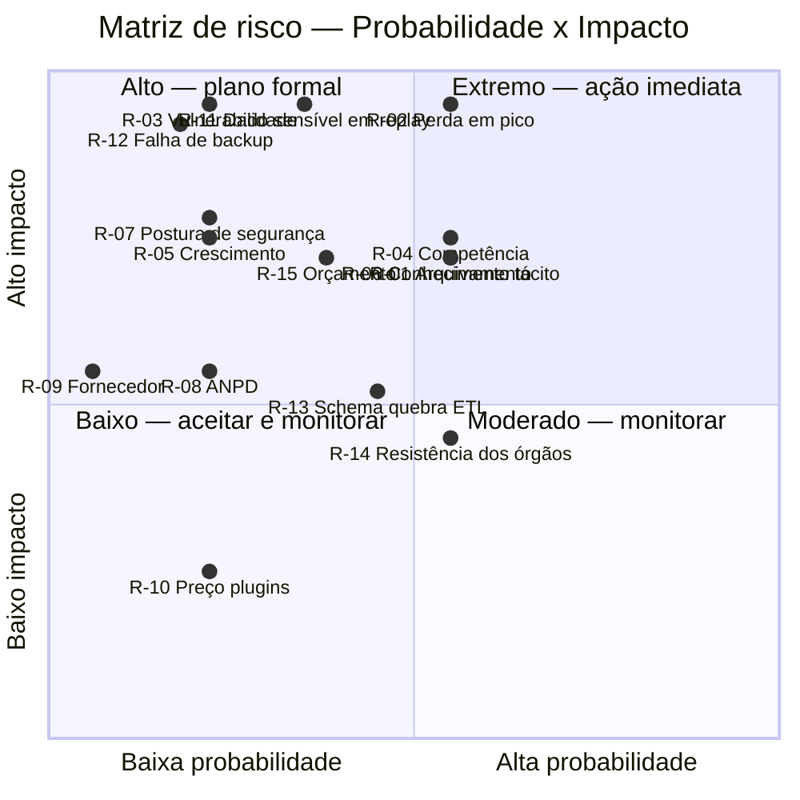
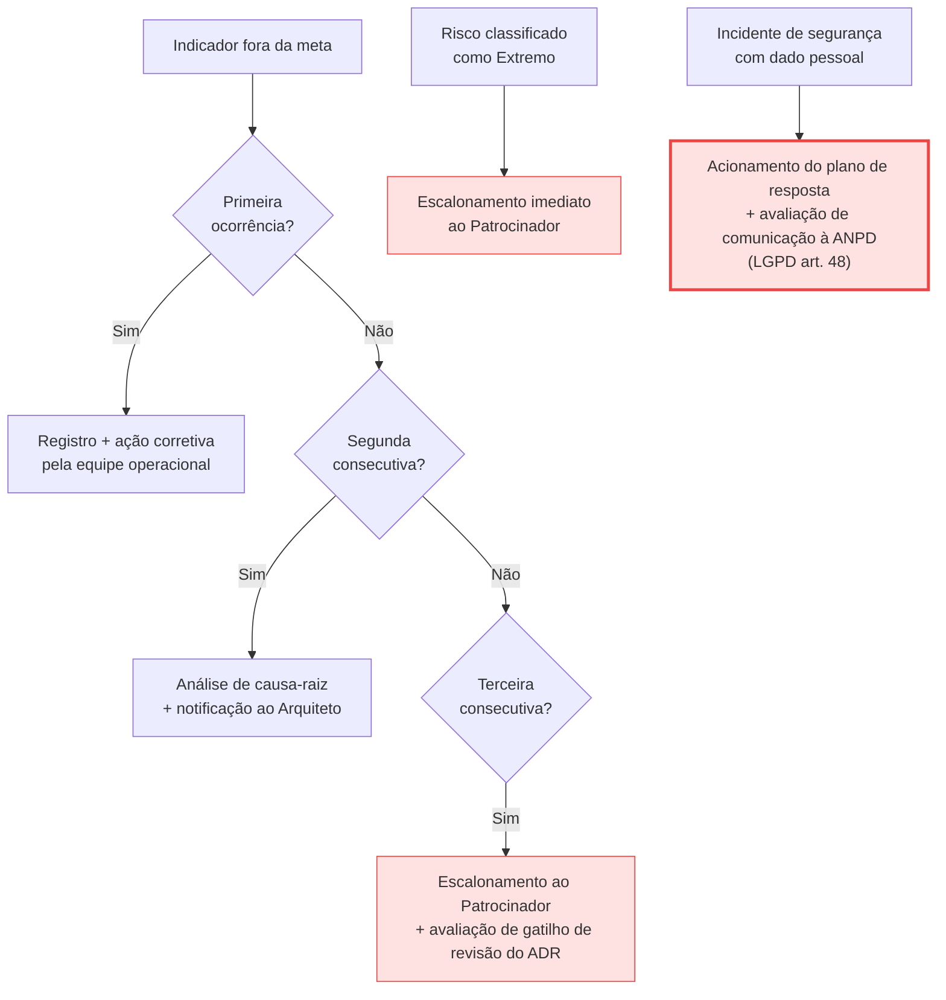

# 11 — Registro de Riscos

> **Anterior:** [10 — Roadmap](10-roadmap.md) · **Próximo:** [12 — Referências](12-referencias.md)

---

## Sumário

- [1. Método de gestão de riscos](#1-método-de-gestão-de-riscos)
- [2. Matriz de exposição](#2-matriz-de-exposição)
- [3. Riscos técnicos](#3-riscos-técnicos)
- [4. Riscos de conformidade e jurídicos](#4-riscos-de-conformidade-e-jurídicos)
- [5. Riscos de segurança](#5-riscos-de-segurança)
- [6. Riscos organizacionais](#6-riscos-organizacionais)
- [7. Riscos de fornecedor e mercado](#7-riscos-de-fornecedor-e-mercado)
- [8. Riscos de projeto](#8-riscos-de-projeto)
- [9. Riscos residuais aceitos](#9-riscos-residuais-aceitos)
- [10. Plano de monitoramento](#10-plano-de-monitoramento)

---

## 1. Método de gestão de riscos

### 1.1 Escalas

**Probabilidade:**

| Nível | Rótulo | Faixa | Descrição |
|:-----:|--------|-------|-----------|
| 1 | 🟢 Muito baixa | < 5 % | Não esperado no horizonte de 5 anos |
| 2 | 🟡 Baixa | 5–25 % | Possível, sem indicadores presentes |
| 3 | 🟠 Média | 25–60 % | Plausível; há indicadores ou precedentes |
| 4 | 🔴 Alta | 60–85 % | Provável no horizonte considerado |
| 5 | ⚫ Muito alta | > 85 % | Praticamente certo se nada for feito |

**Impacto:**

| Nível | Rótulo | Descrição |
|:-----:|--------|-----------|
| 1 | 🟢 Insignificante | Sem efeito perceptível na operação ou na conformidade |
| 2 | 🟡 Baixo | Degradação pontual; contornável em horas |
| 3 | 🟠 Moderado | Perda de funcionalidade ou de dados por período limitado |
| 4 | 🔴 Alto | Indisponibilidade prolongada, perda relevante de dados ou não conformidade |
| 5 | ⚫ Crítico | Sanção regulatória, vazamento de dados pessoais ou paralisação do serviço |

**Exposição = Probabilidade × Impacto**

| Faixa | Classificação | Tratamento exigido |
|-------|--------------|--------------------|
| 15–25 | 🔴 **Extremo** | Ação imediata; escalonamento ao patrocinador |
| 9–14 | 🟠 **Alto** | Plano de resposta formal com responsável e prazo |
| 4–8 | 🟡 **Moderado** | Monitorar com resposta planejada |
| 1–3 | 🟢 **Baixo** | Aceitar e monitorar |

### 1.2 Estratégias de resposta

| Estratégia | Quando aplicar |
|-----------|----------------|
| **Mitigar** | Reduzir probabilidade ou impacto por ação arquitetural ou de processo |
| **Transferir** | Deslocar a consequência a terceiro (contrato, seguro, fornecedor) |
| **Evitar** | Alterar a decisão de modo a eliminar a causa do risco |
| **Aceitar** | Assumir conscientemente, com registro formal e monitoramento |

---

## 2. Matriz de exposição

### 2.1 Riscos por classificação

| Classificação | Quantidade | IDs |
|--------------|:----------:|-----|
| 🔴 Extremo (15–25) | 3 | R-02, R-03, R-11 |
| 🟠 Alto (9–14) | 7 | R-01, R-04, R-05, R-06, R-07, R-12, R-15 |
| 🟡 Moderado (4–8) | 4 | R-08, R-13, R-14, R-16 |
| 🟢 Baixo (1–3) | 2 | R-09, R-10 |

---

## 3. Riscos técnicos

### R-01 — Arquivamento não conclui na janela

| Campo | Valor |
|-------|-------|
| **Categoria** | Técnico — desempenho |
| **Descrição** | O processo `core:archive` não conclui dentro da janela programada, gerando relatórios desatualizados e carga sustentada no banco |
| **Causa** | Crescimento do número de sites × períodos × segmentos pré-processados; ausência de host dedicado; execução serial |
| **Consequência** | Relatórios exibindo dados de dias anteriores; perda de confiança dos usuários; degradação do banco |
| **Probabilidade** | 🟠 3 (Média) — o risco cresce proporcionalmente ao número de propriedades |
| **Impacto** | 🔴 4 (Alto) |
| **Exposição** | **12 — 🟠 Alto** |
| **Estratégia** | **Mitigar** |
| **Ações** | 1. Host dedicado para o cron (AA-3, Onda 2) 2. `browser_archiving_disabled_enforce = 1` 3. Paralelização por site 4. Governança de segmentos pré-processados 5. Monitoramento de duração do cron com alerta acima de 70 % da janela |
| **Indicador** | Conclusão do arquivamento na janela — meta 100 % (diário) |
| **Responsável** | STI — Administrador de infraestrutura |
| **Prazo** | Onda 2 (mês 9) |
| **Exposição residual** | 🟡 6 (Moderado) |

---

### R-02 — Perda de eventos em pico por ingestão síncrona

| Campo | Valor |
|-------|-------|
| **Categoria** | Técnico — resiliência |
| **Descrição** | Em pico de tráfego de 10× a 50×, a gravação síncrona no MySQL esgota o pool de conexões, causando erro no endpoint de coleta e perda de eventos |
| **Causa** | Lacuna **L1** — ausência de desacoplamento entre coleta e persistência |
| **Consequência** | Perda irrecuperável de dados justamente no evento de maior interesse analítico (resultado de concurso, emergência); potencial degradação do servidor web |
| **Probabilidade** | 🟠 3 (Média) — depende da ocorrência de evento gerador de pico, que é recorrente no setor público |
| **Impacto** | ⚫ 5 (Crítico) |
| **Exposição** | **15 — 🔴 Extremo** |
| **Estratégia** | **Mitigar** |
| **Ações** | 1. Plugin `QueuedTracking` + Redis com persistência AOF (AA-1, Onda 2) — **obrigatório** 2. Nós de coleta stateless escaláveis (AA-2) 3. Teste de carga com pico de 30× antes do Gate 2 4. Monitoramento de profundidade de fila com alerta 5. Rate limiting no WAF para conter tráfego anômalo |
| **Indicador** | Taxa de perda de eventos — meta ≤ 1 % (mensal) |
| **Responsável** | STI — Administrador de infraestrutura |
| **Prazo** | Onda 2 (mês 6) |
| **Exposição residual** | 🟢 3 (Baixo) |

> **🚨 Alerta — Este é o risco crítico da arquitetura vigente**
> Enquanto a mitigação não estiver implantada e testada, **o Estado opera com risco extremo de perda de dados no exato momento de maior relevância analítica**. É a razão técnica pela qual o ADR-001 é uma decisão **condicionada**, e não uma confirmação do estado atual.

---

### R-05 — Crescimento de volume degrada o MySQL

| Campo | Valor |
|-------|-------|
| **Categoria** | Técnico — escalabilidade |
| **Descrição** | Crescimento do volume além do projetado leva o MySQL a degradação de desempenho não contornável por tuning |
| **Causa** | Limitação estrutural de banco relacional orientado a linha para carga analítica (trade-off TP-06, aceito no ADR) |
| **Consequência** | Latência de relatório inaceitável; janela de arquivamento inviável; necessidade de redesenho arquitetural |
| **Probabilidade** | 🟡 2 (Baixa) — requer crescimento superior a 5× |
| **Impacto** | 🔴 4 (Alto) |
| **Exposição** | **8 — 🟡 Moderado** (classificado como Alto na priorização por ser não contornável quando materializado) |
| **Estratégia** | **Monitorar** com gatilho de reavaliação |
| **Ações** | 1. Particionamento das tabelas `matomo_log_*` (Onda 2) 2. Réplica de leitura dedicada (AA-4) 3. Política de retenção rígida de 6 meses para dado bruto 4. Monitoramento mensal do volume 5. **Gatilho G4 do ADR**: crescimento superior a 5× aciona revisão em 120 dias |
| **Indicador** | Volume mensal de ações × linha de base (mensal) |
| **Responsável** | Arquiteto de Soluções |
| **Prazo** | Contínuo |
| **Exposição residual** | 🟡 4 (Moderado) |

---

### R-13 — Mudança de schema entre versões quebra o ETL

| Campo | Valor |
|-------|-------|
| **Categoria** | Técnico — integração |
| **Descrição** | Atualização de versão maior do Matomo altera o schema das tabelas `matomo_log_*`, quebrando o pipeline de ETL construído sobre elas |
| **Causa** | Acoplamento do ETL ao schema interno do produto, que não é uma interface pública estável |
| **Consequência** | Interrupção da alimentação do BI corporativo; retrabalho de desenvolvimento |
| **Probabilidade** | 🟠 3 (Média) — ocorre em versões maiores, aproximadamente anuais |
| **Impacto** | 🟡 2 (Baixo) — detectável e corrigível; não há perda de dados |
| **Exposição** | **6 — 🟡 Moderado** |
| **Estratégia** | **Mitigar** |
| **Ações** | 1. Camada de *views* SQL estáveis entre o schema e o ETL (Onda 3) 2. Validar o ETL em ambiente de homologação antes de toda atualização de versão maior 3. Versionar o ETL junto com a versão do Matomo 4. Testes automatizados de integridade do pipeline |
| **Indicador** | Execuções de ETL bem-sucedidas — meta 100 % (mensal) |
| **Responsável** | Analista de BI |
| **Prazo** | Onda 3 |
| **Exposição residual** | 🟢 2 (Baixo) |

---

## 4. Riscos de conformidade e jurídicos

### R-08 — Manifestação da ANPD altera o entendimento regulatório

| Campo | Valor |
|-------|-------|
| **Categoria** | Conformidade — regulatório |
| **Descrição** | A ANPD emite entendimento que altera as condições de uso de ferramentas de analytics pelo setor público |
| **Causa** | Ausência atual de manifestação específica; evolução do entendimento regulatório |
| **Consequência** | Necessidade de reconfiguração ou, no limite, de mudança de arquitetura |
| **Probabilidade** | 🟡 2 (Baixa) |
| **Impacto** | 🟠 3 (Moderado) — a configuração recomendada já é a mais conservadora disponível |
| **Exposição** | **6 — 🟡 Moderado** |
| **Estratégia** | **Monitorar** |
| **Ações** | 1. Adoção da configuração mais conservadora desde a Onda 1 (cookieless + IP anonimizado) 2. Acompanhamento de publicações da ANPD pelo Encarregado 3. **Gatilho G1 do ADR**: revisão em 60 dias após manifestação |
| **Indicador** | Publicações da ANPD monitoradas (mensal) |
| **Responsável** | Encarregado de Dados |
| **Prazo** | Contínuo |
| **Exposição residual** | 🟢 3 (Baixo) |

> **📌 Observação — Por que o impacto é apenas moderado**
> A configuração recomendada — cookieless, IP anonimizado, sem identificador persistente, sem transferência internacional, retenção definida — é a **mais conservadora tecnicamente possível**. Um endurecimento regulatório atingiria primeiro as plataformas que transferem dados ao exterior e coletam identificadores persistentes, e não a configuração adotada.
>
> Esse é um benefício indireto e relevante da recomendação: ela reduz a exposição a mudanças regulatórias futuras, e não apenas ao regime vigente.

---

### R-11 — Captura acidental de dado pessoal sensível em gravação de sessão

| Campo | Valor |
|-------|-------|
| **Categoria** | Conformidade — dado sensível |
| **Descrição** | A funcionalidade de gravação de sessão captura conteúdo digitado em formulários, incluindo CPF, dados de saúde ou dados de benefício social |
| **Causa** | Configuração de mascaramento incompleta; adição de novo campo de formulário sem revisão; uso da funcionalidade em portal transacional |
| **Consequência** | Tratamento de dado pessoal sensível (art. 11 da LGPD) sem base legal adequada; risco de sanção; potencial incidente de segurança de alta gravidade |
| **Probabilidade** | 🟠 3 (Média) — é o modo de falha mais comum dessa classe de ferramenta |
| **Impacto** | ⚫ 5 (Crítico) |
| **Exposição** | **15 — 🔴 Extremo** |
| **Estratégia** | **Mitigar** e, parcialmente, **Evitar** |
| **Ações** | 1. **Evitar:** gravação de sessão **vedada por padrão** em todas as propriedades 2. **Evitar:** habilitação exige RIPD específico e autorização do Encarregado 3. **Evitar:** vedação absoluta em serviços transacionais que tratem dado sensível 4. **Mitigar:** mascaramento em modo *deny by default* — todos os campos mascarados, liberação individual e justificada 5. **Mitigar:** exclusão explícita de páginas de formulário do escopo de gravação 6. **Mitigar:** retenção máxima de 30 dias para gravações 7. **Mitigar:** auditoria trimestral por amostragem das gravações 8. **Evitar:** remoção do Microsoft Clarity, eliminando a transferência internacional de dados de sessão (RC-2) |
| **Indicador** | Propriedades com gravação habilitada sem RIPD — meta 0 (trimestral) |
| **Responsável** | Encarregado de Dados + STI |
| **Prazo** | Onda 3 |
| **Exposição residual** | 🟡 5 (Moderado) |

> **🚨 Alerta**
> Este é o risco de maior severidade potencial de todo o estudo. Uma gravação de sessão de um cidadão preenchendo formulário de benefício social captura, simultaneamente, dado pessoal sensível **e** situação de vulnerabilidade social.
>
> A recomendação de substituir o Microsoft Clarity pelo plugin nativo do Matomo (RC-2) tem como fundamento principal este risco: mantém o dado na infraestrutura do Estado, eliminando a transferência internacional e permitindo auditoria verificável do que foi efetivamente capturado.
>
> **Recomendação conservadora:** se não houver necessidade analítica demonstrada, **não habilitar gravação de sessão**. O ganho analítico raramente compensa a exposição.

---

## 5. Riscos de segurança

### R-03 — Vulnerabilidade crítica explorada na instância

| Campo | Valor |
|-------|-------|
| **Categoria** | Segurança |
| **Descrição** | Vulnerabilidade no Matomo, no PHP, no servidor web ou em plugin é explorada, comprometendo a instância |
| **Causa** | Endpoint de coleta necessariamente exposto à internet; superfície de aplicação PHP; plugins de terceiros |
| **Consequência** | Comprometimento da infraestrutura; acesso a dados de navegação; possível pivô para a rede interna; incidente de segurança com dever de comunicação à ANPD (art. 48 da LGPD) |
| **Probabilidade** | 🟡 2 (Baixa) — com mitigações aplicadas |
| **Impacto** | ⚫ 5 (Crítico) |
| **Exposição** | **10 — 🟠 Alto** (classificado como Extremo antes das mitigações) |
| **Estratégia** | **Mitigar** |
| **Ações** | 1. Interface administrativa **inacessível pela internet** — apenas rede interna ou VPN (AA-5) 2. WAF sobre o endpoint de coleta 3. Processo de aplicação de patch crítico em ≤ 72 h 4. Hardening de SO, PHP e servidor web 5. Segmentação de rede: a instância não acessa outras redes internas 6. Princípio do menor privilégio no usuário do banco 7. Teste de intrusão na Onda 2 e anualmente 8. Governança de plugins: apenas plugins do marketplace oficial, com revisão prévia 9. Monitoramento de integridade de arquivos |
| **Indicador** | Patches críticos aplicados em ≤ 72 h — meta 100 % (trimestral) |
| **Responsável** | Segurança da Informação + STI |
| **Prazo** | Onda 2 |
| **Exposição residual** | 🟡 5 (Moderado) |

---

### R-07 — Postura de segurança inferior à de SaaS certificado

| Campo | Valor |
|-------|-------|
| **Categoria** | Segurança — organizacional |
| **Descrição** | A responsabilidade de segurança deslocada para o Estado resulta em postura inferior à de um fornecedor com ISO 27001/SOC 2 |
| **Causa** | Consequência estrutural do modelo auto-hospedado (trade-off TP-01, aceito no ADR) |
| **Consequência** | Maior probabilidade de materialização do risco R-03 |
| **Probabilidade** | 🟡 2 (Baixa) — depende da maturidade efetiva da STI |
| **Impacto** | 🔴 4 (Alto) |
| **Exposição** | **8 — 🟡 Moderado** |
| **Estratégia** | **Mitigar** |
| **Ações** | 1. Todas as ações de R-03 2. Auditoria de segurança anual por terceiro 3. Alinhamento a *baseline* de segurança da organização 4. Métricas de segurança nos indicadores do ADR 5. Se o Gate 1 reprovar, ativar contingência (transfere a responsabilidade ao fornecedor) |
| **Indicador** | Achados críticos em aberto — meta 0 (trimestral) |
| **Responsável** | Segurança da Informação |
| **Prazo** | Contínuo |
| **Exposição residual** | 🟡 4 (Moderado) |

---

### R-12 — Falha de backup descoberta durante incidente

| Campo | Valor |
|-------|-------|
| **Categoria** | Segurança — continuidade |
| **Descrição** | O backup existe mas não é restaurável, e isso só é descoberto quando a restauração é necessária |
| **Causa** | Backup nunca testado; corrupção silenciosa; escopo incompleto |
| **Consequência** | Perda definitiva de dados históricos; impossibilidade de atender ao RPO |
| **Probabilidade** | 🟡 2 (Baixa) — com teste trimestral |
| **Impacto** | ⚫ 5 (Crítico) |
| **Exposição** | **10 — 🟠 Alto** |
| **Estratégia** | **Mitigar** |
| **Ações** | 1. **Teste trimestral de restauração completa** em ambiente limpo 2. Verificação automatizada de integridade dos backups 3. Regra 3-2-1: 3 cópias, 2 mídias, 1 fora do sítio 4. Backup imutável ou com retenção protegida contra exclusão 5. Documentar e cronometrar o procedimento de restauração |
| **Indicador** | Testes de restauração bem-sucedidos — meta 100 % (trimestral) |
| **Responsável** | STI — Administrador de infraestrutura |
| **Prazo** | Onda 2 |
| **Exposição residual** | 🟢 3 (Baixo) |

> **📌 Observação**
> "Backup não testado não é backup." A ação 1 é a única que efetivamente mitiga este risco — as demais reduzem a probabilidade, mas apenas a restauração comprovada demonstra a capacidade.

---

## 6. Riscos organizacionais

### R-04 — Escassez de competência interna

| Campo | Valor |
|-------|-------|
| **Categoria** | Organizacional |
| **Descrição** | A STI não desenvolve ou não sustenta a competência necessária para operar a plataforma |
| **Causa** | Escassez de profissionais com experiência específica no mercado; restrição R5 (sem ampliação de quadro); rotatividade |
| **Consequência** | Degradação operacional; acúmulo de dívida técnica; falha em atender aos indicadores |
| **Probabilidade** | 🟠 3 (Média) |
| **Impacto** | 🔴 4 (Alto) |
| **Exposição** | **12 — 🟠 Alto** |
| **Estratégia** | **Mitigar** com contingência formal |
| **Ações** | 1. Capacitação de ao menos 2 servidores (Onda 1) 2. **Gate 1** valida objetivamente a capacidade antes do investimento pesado 3. Runbook operacional detalhado 4. Infrastructure as Code elimina conhecimento tácito 5. Possibilidade de contratar suporte comercial sem alterar a arquitetura 6. **Contingência formal**: Matomo Cloud ou Piwik PRO via ADR-002 |
| **Fator atenuante** | As competências exigidas (Linux, MySQL, PHP-FPM, cron, Redis, observabilidade) são **genéricas de infraestrutura**, e não conhecimento proprietário do produto |
| **Indicador** | Servidores capacitados e ativos — meta ≥ 2 (semestral) |
| **Responsável** | Superintendente STI |
| **Prazo** | Onda 1 (Gate 1) |
| **Exposição residual** | 🟡 6 (Moderado) |

---

### R-06 — Concentração de conhecimento em uma única pessoa

| Campo | Valor |
|-------|-------|
| **Categoria** | Organizacional |
| **Descrição** | A operação depende de conhecimento tácito de um único servidor |
| **Causa** | Ausência de documentação; configuração manual não versionada |
| **Consequência** | Indisponibilidade prolongada na ausência da pessoa; impossibilidade de reconstruir o ambiente |
| **Probabilidade** | 🟠 3 (Média) — é o padrão em equipes pequenas sem processo |
| **Impacto** | 🔴 4 (Alto) |
| **Exposição** | **12 — 🟠 Alto** |
| **Estratégia** | **Mitigar** |
| **Ações** | 1. Infrastructure as Code para 100 % da implantação (AA-11, Onda 2) 2. Runbook operacional versionado, atualizado a cada onda 3. Capacitação de no mínimo 2 servidores 4. Rodízio de plantão operacional 5. Ambiente de homologação reconstruível a partir do código |
| **Indicador** | Ambiente reconstruído a partir do IaC com sucesso — meta 1 por semestre |
| **Responsável** | STI |
| **Prazo** | Onda 2 |
| **Exposição residual** | 🟢 3 (Baixo) |

---

### R-14 — Resistência dos órgãos à padronização

| Campo | Valor |
|-------|-------|
| **Categoria** | Organizacional — adoção |
| **Descrição** | Órgãos setoriais resistem a migrar para a instância padronizada, mantendo ferramentas próprias |
| **Causa** | Percepção de perda de autonomia; investimento prévio em outra ferramenta; desconhecimento |
| **Consequência** | Fragmentação; impossibilidade de visão consolidada; conformidade heterogênea |
| **Probabilidade** | 🟠 3 (Média) |
| **Impacto** | 🟠 3 (Moderado) |
| **Exposição** | **9 — 🟠 Alto** |
| **Estratégia** | **Mitigar** |
| **Ações** | 1. Comunicação formal da decisão pela SETDIG (Onda 0) 2. Guia de adoção com benefícios explícitos (Onda 4) 3. Autoatendimento de provisionamento em ≤ 1 dia útil — reduz o atrito 4. Segregação de acesso garante autonomia do órgão sobre seus próprios dados 5. Demonstração do painel corporativo como valor entregue 6. Vinculação da conformidade LGPD ao uso da instância padronizada |
| **Indicador** | Portais na instância padronizada — meta ≥ 80 % (semestral) |
| **Responsável** | SGD + SETDIG |
| **Prazo** | Onda 4 |
| **Exposição residual** | 🟡 4 (Moderado) |

---

## 7. Riscos de fornecedor e mercado

### R-09 — Descontinuidade ou mudança de estratégia da InnoCraft

| Campo | Valor |
|-------|-------|
| **Categoria** | Fornecedor |
| **Descrição** | A empresa mantenedora do Matomo encerra atividades, é adquirida ou altera sua estratégia de produto |
| **Causa** | Dinâmica de mercado |
| **Consequência** | Interrupção da evolução do produto e das correções de segurança |
| **Probabilidade** | 🟢 1 (Muito baixa) — projeto com mais de 15 anos e base ampla de contribuidores |
| **Impacto** | 🟠 3 (Moderado) |
| **Exposição** | **3 — 🟢 Baixo** |
| **Estratégia** | **Aceitar** |
| **Justificativa** | A licença **GPL v3** garante direito perpétuo sobre a versão obtida; a comunidade permite fork; o Estado mantém a operação indefinidamente. É exatamente o cenário QA-06, plenamente atendido pela escolha |
| **Ações** | 1. Manter cópia local do código-fonte 2. **Gatilho G3 do ADR**: revisão em 90 dias 3. Acompanhar a saúde do projeto (cadência de releases, contribuidores) |
| **Indicador** | Releases nos últimos 6 meses — meta ≥ 3 (semestral) |
| **Responsável** | Arquiteto de Soluções |
| **Exposição residual** | 🟢 2 (Baixo) |

---

### R-10 — Aumento de preço dos plugins premium

| Campo | Valor |
|-------|-------|
| **Categoria** | Fornecedor — econômico |
| **Descrição** | Reajuste significativo no preço dos plugins premium ou mudança do modelo de licenciamento |
| **Probabilidade** | 🟡 2 (Baixa) |
| **Impacto** | 🟢 1 (Insignificante) |
| **Exposição** | **2 — 🟢 Baixo** |
| **Estratégia** | **Aceitar** |
| **Justificativa** | A licença dos plugins é perpétua sobre a versão adquirida; apenas as atualizações são anuais. Um reajuste afeta a renovação, não a operação. Alternativamente, é possível operar sem atualização de plugin por período determinado |
| **Responsável** | SETDIG |
| **Exposição residual** | 🟢 2 (Baixo) |

---

## 8. Riscos de projeto

### R-15 — Indisponibilidade orçamentária

| Campo | Valor |
|-------|-------|
| **Categoria** | Projeto — orçamentário |
| **Descrição** | Dotação orçamentária insuficiente ou contingenciada impede a execução das ondas |
| **Causa** | Restrição fiscal; repriorização; ciclo orçamentário |
| **Consequência** | Ondas não executadas; riscos técnicos permanecem sem mitigação |
| **Probabilidade** | 🟠 3 (Média) |
| **Impacto** | 🔴 4 (Alto) |
| **Exposição** | **12 — 🟠 Alto** |
| **Estratégia** | **Mitigar** |
| **Ações** | 1. Priorização das ondas por criticidade — a Onda 2 (resiliência) precede a Onda 3 (funcionalidade) 2. Onda 1 tem custo baixo (~R$ 85 k) e elimina o risco regulatório imediato 3. Escopo da Onda 3 é reduzível sem comprometer resiliência ou conformidade 4. Aproveitamento máximo de infraestrutura existente 5. Vinculação do investimento à mitigação de risco regulatório, e não a ganho de funcionalidade |
| **Indicador** | Execução orçamentária × previsto — meta desvio ≤ 15 % (trimestral) |
| **Responsável** | Patrocinador + Gerente de projeto |
| **Prazo** | Contínuo |
| **Exposição residual** | 🟡 8 (Moderado) |

---

### R-16 — Atraso acumulado no cronograma

| Campo | Valor |
|-------|-------|
| **Categoria** | Projeto — prazo |
| **Descrição** | Atrasos sucessivos deslocam o encerramento além do horizonte planejado |
| **Causa** | Concorrência com outras demandas da STI; dependências externas; subestimação de esforço |
| **Consequência** | Riscos técnicos permanecem sem mitigação por período prolongado |
| **Probabilidade** | 🟠 3 (Média) |
| **Impacto** | 🟠 2 (Baixo) — o atraso não agrava os riscos, apenas prolonga a exposição |
| **Exposição** | **6 — 🟡 Moderado** |
| **Estratégia** | **Monitorar** |
| **Ações** | 1. Gates formais entre ondas impedem avanço com pendências 2. Alocação formal de FTE, e não alocação por disponibilidade 3. **Gatilho G7 do ADR**: desvio superior a 2 ondas aciona revisão 4. Reporte mensal ao patrocinador |
| **Indicador** | Desvio do cronograma (mensal) |
| **Responsável** | Gerente de projeto |
| **Exposição residual** | 🟡 4 (Moderado) |

---

## 9. Riscos residuais aceitos

Riscos que permanecem após todas as mitigações e são formalmente aceitos como consequência da decisão arquitetural.

| # | Risco residual | Exposição | Fundamento da aceitação |
|---|---------------|:---------:|------------------------|
| **RA-1** | Ausência de SLA contratual de disponibilidade | 🟡 Moderado | A disponibilidade exigida é de 99,5 %, não de missão crítica; a indisponibilidade não degrada os portais (RNF-14). Alcançável com arquitetura própria |
| **RA-2** | Ausência de certificação ISO 27001/SOC 2 do produto | 🟡 Moderado | Substituída por controles próprios e por auditoria verificável, qualitativamente superior à auditoria documental |
| **RA-3** | Desempenho analítico inferior ao de bancos colunares | 🟡 Moderado | Não material no volume avaliado; gatilho G4 do ADR aciona reavaliação em crescimento de 5× |
| **RA-4** | Custo de operação recorrente de ~0,3 FTE | 🟢 Baixo | Menor que o custo de licença de qualquer alternativa de cobertura funcional equivalente |
| **RA-5** | Perda da métrica de visitante recorrente | 🟢 Baixo | Consequência deliberada do trade-off TP-02; o ganho de conformidade supera o valor decisório da métrica |
| **RA-6** | Perda de 10 % a 40 % dos eventos por bloqueadores de rastreamento | 🟡 Moderado | Afeta igualmente todas as plataformas client-side; mitigável por tracking server-side em eventos críticos |
| **RA-7** | Dependência da qualidade da configuração para a conformidade | 🟡 Moderado | A conformidade não é automática, e sim configurada. Mitigado por padrão obrigatório documentado e auditoria trimestral |

> **✅ Bloco de Decisão — Aceitação formal**
> Os riscos residuais RA-1 a RA-7 são **conhecidos, quantificados e formalmente aceitos** como consequência da decisão ADR-001. Sua aceitação é parte integrante da decisão e deve constar do registro de aprovação.
>
> Nenhum deles tem exposição classificada como Alta ou Extrema após as mitigações previstas.

---

## 10. Plano de monitoramento

### 10.1 Rotina de acompanhamento

| Periodicidade | Atividade | Responsável | Produto |
|--------------|-----------|------------|---------|
| **Diária** | Verificação automatizada: fila, cron de arquivamento, disponibilidade | Monitoramento | Alertas |
| **Semanal** | Revisão de alertas e de backup | STI | Registro operacional |
| **Mensal** | Coleta dos indicadores do ADR | STI + Arquiteto | Painel de indicadores |
| **Trimestral** | Revisão do registro de riscos; teste de restauração; auditoria de conformidade | Arquiteto + DPO + STI | Ata de revisão |
| **Semestral** | Revisão de exposição; reconstrução do ambiente a partir do IaC | Arquiteto | Registro de riscos atualizado |
| **Anual** | Auditoria de segurança por terceiro; revisão orçamentária | SI + SETDIG | Relatório de auditoria |
| **Bienal** | Revisão completa do ADR-001 | Arquiteto | ADR confirmado ou ADR-002 |

### 10.2 Escalonamento

### 10.3 Registro de revisões do documento

| Versão | Data | Alteração | Responsável |
|--------|------|-----------|-------------|
| 1.0 | 2026-07-29 | Emissão inicial — 16 riscos identificados | Arquitetura — SETDIG |

---

## Navegação

| ⬅️ Anterior | ➡️ Próximo |
|------------|-----------|
| [10 — Roadmap](10-roadmap.md) | [12 — Referências](12-referencias.md) |
