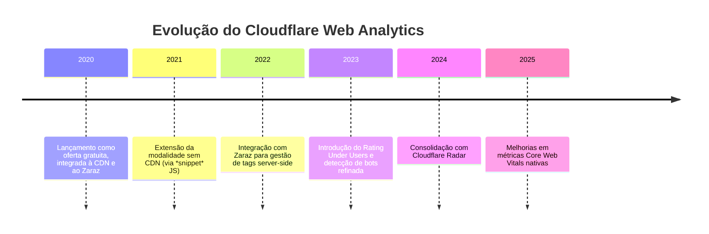

# Cloudflare Web Analytics

> **Ficha técnica de plataforma** · Pontuação na matriz: **345/600 (57,5 %)** — 12º lugar · 🔴 Não recomendada
> **Situação:** ❌ **Descartada** — cobertura funcional muito restrita; útil apenas como camada de infraestrutura já existente
> [← Voltar ao índice](../README.md) · [Matriz de decisão](../docs/07-matriz-decisao.md)

---

## Sumário

- [1. Visão geral](#1-visão-geral)
- [2. Licenciamento](#2-licenciamento)
- [3. Hospedagem](#3-hospedagem)
- [4. Funcionalidades](#4-funcionalidades)
- [5. APIs](#5-apis)
- [6. Exemplos de integração](#6-exemplos-de-integração)
- [7. Integrações](#7-integrações)
- [8. Infraestrutura](#8-infraestrutura)
- [9. Segurança](#9-segurança)
- [10. Governança](#10-governança)
- [11. Performance](#11-performance)
- [12. Custos](#12-custos)
- [13. Pontos fortes](#13-pontos-fortes)
- [14. Pontos fracos](#14-pontos-fracos)
- [15. Quando utilizar](#15-quando-utilizar)
- [16. Quando evitar](#16-quando-evitar)
- [17. Notas do avaliador](#17-notas-do-avaliador)

---

## 1. Visão geral

### 1.1 Identificação

| Campo | Valor |
|-------|-------|
| **Nome** | Cloudflare Web Analytics |
| **Mantenedor** | Cloudflare, Inc. |
| **Ano de lançamento** | 2020 |
| **Sede** | San Francisco, Califórnia — Estados Unidos |
| **Segmento** | Privacy-first analytics acoplado à CDN |
| **Documentação** | `https://developers.cloudflare.com/analytics/web-analytics/` |
| **Modelo** | SaaS gratuito |

### 1.2 História



### 1.3 Comunidade

| Indicador | Situação |
|-----------|----------|
| Idade do produto | 5+ anos |
| Governança | Empresa listada em bolsa, gestão corporativa |
| Base instalada | Muito ampla — enviesada por adoção passiva (ativado por *default* em alguns planos Cloudflare) |
| Adoção institucional pública | 🟠 Presente onde há Cloudflare como CDN |
| Profissionais no Brasil | 🟢 Boa (conhecimento genérico de Cloudflare) |
| **Nota C11 (Comunidade)** | **3/5** |

### 1.4 Modelo de negócio

**Classificação:** SaaS gratuito, ofertado como *value-add* da plataforma Cloudflare. Monetização indireta — atrair clientes para os produtos pagos (Workers, R2, Access, Argo, Zero Trust).

Não há tier pago do próprio Web Analytics — o produto **é o mesmo** para conta gratuita e para conta enterprise.

### 1.5 Casos de uso

| Caso de uso | Aderência |
|-------------|:---------:|
| Portal servido por trás de Cloudflare CDN | 🟢 Ativação trivial |
| Site pequeno sem métrica alguma | 🟢 Boa |
| Portal institucional simples | 🟠 Aceitável como complemento |
| Portal com análise de conversão | 🔴 Inadequada |
| Serviço digital transacional | 🔴 Inadequada |
| Fonte primária de analytics | 🔴 Inadequada |

---

## 2. Licenciamento

| Campo | Valor |
|-------|-------|
| **Modelo** | Proprietário — SaaS |
| **Termos** | `https://www.cloudflare.com/terms/` |
| **DPA** | Disponível para clientes Enterprise; termos padrão para conta gratuita |
| **Modalidade self-hosted** | ❌ Inexistente |
| **Código-fonte** | Fechado |

---

## 3. Hospedagem

| Modalidade | Disponibilidade | Observação |
|-----------|:--------------:|-----------|
| SaaS Cloudflare (global) | ✅ Única | Rede global Cloudflare |
| Self-hosted | ❌ | |
| Cloud privada | ❌ | |
| On-Premise | ❌ | |

Dados agregados residem na infraestrutura global Cloudflare, sem escolha de região. Cloudflare declara *data localization suite* para clientes Enterprise (recurso pago), mas o Web Analytics gratuito não expõe controle de região.

---

## 4. Funcionalidades

| Funcionalidade | Suporte | Observação |
|---------------|:-------:|-----------|
| Dashboards padrão | 🟢 | Uma tela por hostname |
| Eventos customizados | 🟠 | Limitado — via *snippet* JS (`sendCustomEvent`) |
| Metas (`goals`) | ❌ | Não suportado |
| Funil de conversão | ❌ | Não suportado |
| Heatmaps | ❌ | Não suportado |
| Session recording | ❌ | Não suportado |
| User journey | ❌ | Não suportado |
| A/B testing | ❌ | Não suportado |
| Form analytics | ❌ | Não suportado |
| Real time | 🟢 | Dashboard ao vivo |
| Cohort | ❌ | Não suportado |
| Retenção | ❌ | Não suportado |
| Dimensões customizadas | 🔴 | Não suportado |
| Core Web Vitals nativos | 🟢 | Recurso diferenciador — LCP, FID/INP, CLS medidos direto no navegador |
| Detecção de bots | 🟢 | Herdada da CDN Cloudflare |

> **📌 Observação — o diferencial real do produto**
> A vantagem competitiva do Cloudflare Web Analytics **não está na análise comportamental** — é praticamente inexistente ali. Está em **três coisas**:
>
> 1. Métricas Core Web Vitals coletadas do próprio navegador, com custo zero.
> 2. Filtragem de bots feita na camada de CDN, antes da amostragem.
> 3. Ativação sem instalação de JS quando o site já está atrás da CDN Cloudflare (modo *server-side*).

---

## 5. APIs

### 5.1 Superfície de API

| Recurso | Situação |
|---------|:--------:|
| REST API pública | 🟢 Cloudflare API v4 — `https://api.cloudflare.com/client/v4/` |
| GraphQL Analytics API | 🟢 `https://api.cloudflare.com/client/v4/graphql/` |
| Webhooks | ❌ |
| SDKs oficiais | Não específicos (via HTTP direto) |
| Rate limits | 1.200 requests/5 min por conta (padrão) |
| Autenticação | API token (Bearer) |
| Versionamento | v4 |

### 5.2 Exemplo — consulta GraphQL

```graphql
query GetSiteAnalytics($zoneTag: String!, $since: Time!, $until: Time!) {
  viewer {
    zones(filter: { zoneTag: $zoneTag }) {
      httpRequests1dGroups(
        limit: 30
        filter: { date_geq: $since, date_leq: $until }
      ) {
        dimensions { date }
        sum { requests pageViews bytes }
      }
    }
  }
}
```

### 5.3 Exportação

- API GraphQL retorna JSON — integrável a data pipeline.
- Sem exportação nativa em CSV a partir do dashboard (apenas via API).
- Retenção declarada: **6 meses** de dados analíticos (variável por plano).

---

## 6. Exemplos de integração

### 6.1 Instalação (modo *client-side*)

```html
<script defer src='https://static.cloudflareinsights.com/beacon.min.js'
        data-cf-beacon='{"token": "<TOKEN>"}'></script>
```

Se o site já roda atrás da CDN Cloudflare, o beacon pode ser injetado automaticamente sem alteração do código.

### 6.2 Python — GraphQL Analytics

```python
import os
import requests

CF_TOKEN = os.environ["CLOUDFLARE_API_TOKEN"]
ZONE_TAG = os.environ["CLOUDFLARE_ZONE_TAG"]

QUERY = """
query($zoneTag: String!, $since: Time!, $until: Time!) {
  viewer {
    zones(filter: {zoneTag: $zoneTag}) {
      httpRequests1dGroups(limit: 30, filter: {date_geq: $since, date_leq: $until}) {
        dimensions { date }
        sum { requests pageViews }
      }
    }
  }
}
"""

def daily_metrics(since: str, until: str) -> dict:
    response = requests.post(
        "https://api.cloudflare.com/client/v4/graphql/",
        headers={
            "Authorization": f"Bearer {CF_TOKEN}",
            "Content-Type": "application/json",
        },
        json={
            "query": QUERY,
            "variables": {"zoneTag": ZONE_TAG, "since": since, "until": until},
        },
        timeout=15,
    )
    response.raise_for_status()
    return response.json()
```

### 6.3 Node.js — evento customizado

```javascript
// No cliente (após carregamento do beacon):
window._cfBeacon = window._cfBeacon || [];
window._cfBeacon.push({ event: 'inscricao_boletim' });
```

### 6.4 Power BI

Sem conector nativo. Uso viável via:
- Web connector consumindo o endpoint GraphQL.
- Persistência intermediária recomendada (data lake / DW).

### 6.5 Grafana

- Datasource: JSON API (via `simpod-json-datasource` ou `yesoreyeram-infinity-datasource`).
- Coleta periódica via *scheduled query* apontando para a GraphQL Analytics.

### 6.6 Metabase / Superset / Looker Studio

Não há conector nativo. Padrão de uso: ETL para PostgreSQL/BigQuery, então conexão do BI ao banco intermediário.

---

## 7. Integrações

| Integração | Status |
|-----------|:------:|
| Google Tag Manager | 🟠 Coexistência simples; sem sinergia especial |
| Matomo Tag Manager | 🟠 Coexistência simples |
| Cloudflare Zaraz | 🟢 Integração nativa (Zaraz é o *tag manager* server-side da Cloudflare) |
| Consent Manager | 🟠 Manual — Cloudflare Web Analytics é *cookieless* por padrão, o que reduz a necessidade |
| IdP corporativo (Cloudflare Access) | 🟢 SSO via Access, incluindo SAML/OIDC |
| OAuth 2.0 / OIDC (para conta Cloudflare em si) | 🟢 SSO Enterprise |

---

## 8. Infraestrutura

Não aplicável — SaaS totalmente gerido. A infraestrutura de coleta e agregação roda na malha global Cloudflare (~300 PoPs), o que dá ao produto latência extremamente baixa em qualquer geografia.

**Backup, DR, HA:** integrais na oferta Cloudflare, sem controle do cliente.

---

## 9. Segurança

| Item | Situação |
|------|----------|
| Criptografia em trânsito | 🟢 TLS 1.3 |
| Criptografia em repouso | 🟢 Padrão Cloudflare |
| **Conformidade LGPD** | 🟠 Sem certificação específica; termos padrão contemplam controlador/operador |
| GDPR | 🟢 DPA disponível |
| ISO 27001 / SOC 2 | 🟢 Certificações Cloudflare |
| Controle de acesso | 🟢 RBAC Cloudflare + Access |
| Auditoria | 🟢 *Audit logs* Cloudflare (recurso Enterprise para exportação SIEM) |
| Retenção | 🟠 Fixa (~6 meses); não configurável no plano gratuito |
| Anonimização | 🟢 IP hasheado e descartado; sem cookies persistentes |

> **⚠️ Bloco de Risco — CLOUD Act e jurisdição EUA**
> Cloudflare é empresa constituída nos EUA, sujeita ao CLOUD Act. Mesmo com residência técnica em PoPs globais, a jurisdição da empresa e a possibilidade de requisições legais estrangeiras devem ser consideradas na DPIA para portais que tratem dado sensível.

---

## 10. Governança

| Dimensão | Avaliação |
|----------|-----------|
| Vendor lock-in | 🟠 Médio — API padronizada facilita saída, mas a dependência da CDN é o lock-in real |
| Controle dos dados | 🔴 Baixo — infraestrutura globalmente distribuída, sem residência garantida no gratuito |
| Portabilidade | 🟠 Média — exportação via GraphQL, mas sem migração de séries históricas para outro produto |
| Transparência | 🟠 Média — documentação boa; código-fonte fechado |
| Auditoria | 🟠 Boa para Enterprise (SIEM), limitada para conta gratuita |
| Soberania | 🔴 Baixa — jurisdição EUA |

**Nota C02 (Controle dos dados):** 2/5.
**Nota C04 (Independência tecnológica):** 2/5.

---

## 11. Performance

### 11.1 Impacto no site

| Métrica | Valor típico |
|---------|:-----------:|
| Tamanho do beacon | ~7 KB (gzip) |
| Carregamento | Assíncrono |
| Impacto médio em LCP | Desprezível (< 15 ms) |
| Impacto médio em CLS | Nulo |

No modo *server-side* (site atrás da CDN Cloudflare), a coleta acontece no *edge* sem beacon adicional, o que **elimina qualquer impacto no navegador**.

### 11.2 Escala do serviço

Sem limite declarado. Escala Cloudflare comporta qualquer volume de portal governamental estadual.

---

## 12. Custos

### 12.1 TCO em 5 anos

| Rubrica | Ano 1 | Ano 2 | Ano 3 | Ano 4 | Ano 5 | Total |
|---------|:-----:|:-----:|:-----:|:-----:|:-----:|:-----:|
| Licenciamento | R$ 0 | R$ 0 | R$ 0 | R$ 0 | R$ 0 | **R$ 0** |
| Infraestrutura | R$ 0 | R$ 0 | R$ 0 | R$ 0 | R$ 0 | **R$ 0** |
| Equipe | R$ 4.000 | R$ 2.000 | R$ 2.000 | R$ 2.000 | R$ 2.000 | **R$ 12.000** |
| Adequação LGPD (leve — cookieless) | R$ 5.000 | R$ 500 | R$ 500 | R$ 500 | R$ 500 | **R$ 7.000** |
| **Total** | **R$ 9.000** | **R$ 2.500** | **R$ 2.500** | **R$ 2.500** | **R$ 2.500** | **R$ 19.000** |

> **📌 Observação — custo aparente vs. custo real**
> O TCO mais baixo do estudo. Mas é preciso comparar com o **valor entregue**: métrica de audiência agregada e Core Web Vitals. Para requisitos governamentais, esse valor é insuficiente, o que empurra o Cloudflare para o papel de *complemento* — nunca de plataforma primária.

---

## 13. Pontos fortes

- Custo zero (licenciamento e infraestrutura).
- Zero impacto de performance no navegador quando o site já está atrás da CDN.
- Métricas Core Web Vitals nativas, coletadas do navegador real.
- Detecção de bots de alta qualidade herdada da CDN.
- Escala automática e disponibilidade globais.
- API GraphQL bem documentada para integração com pipeline de dados.

## 14. Pontos fracos

- Cobertura funcional muito estreita — sem funil, sem eventos ricos, sem heatmap, sem session recording.
- Jurisdição EUA (CLOUD Act) e ausência de residência de dados garantida.
- Retenção de 6 meses fixa (sem configuração no plano gratuito).
- Ausência de conectores nativos para BI corporativo.
- Dependência estrutural da CDN Cloudflare para tirar o máximo do produto.
- Governança e portabilidade limitadas.

## 15. Quando utilizar

- **Complemento** a uma plataforma primária, especialmente para portais **já atrás da CDN Cloudflare**.
- Monitoramento de Core Web Vitals em nível de infraestrutura.
- Sites institucionais **muito pequenos** onde a métrica agregada de audiência basta.
- Redução de tráfego malicioso reportado como visitante em outras plataformas (via filtragem de bots na borda).

## 16. Quando evitar

- Como **plataforma primária** de analytics do Estado.
- Portais que **não usem** Cloudflare como CDN (o produto perde metade do valor).
- Serviços digitais com requisito de funil, form analytics ou análise comportamental.
- Cenários com requisito de residência de dado no Brasil.

---

## 17. Notas do avaliador

O Cloudflare Web Analytics é um produto de **valor operacional específico**, não uma alternativa às plataformas de analytics. Sua nota (345/600) reflete isso: reprovado como plataforma primária, útil apenas como camada complementar de infraestrutura para portais que já contratam a CDN Cloudflare.

Ele não compete com Matomo, Plausible ou PostHog — compete, se muito, com Cloudflare Radar e com a aba "Analytics" nativa do painel da CDN.

Recomendação: **não substituir a plataforma primária**, mas manter ativado onde a CDN Cloudflare já esteja em uso, aproveitando os Core Web Vitals e a filtragem de bots.
