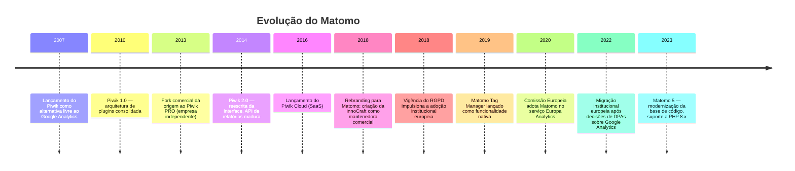
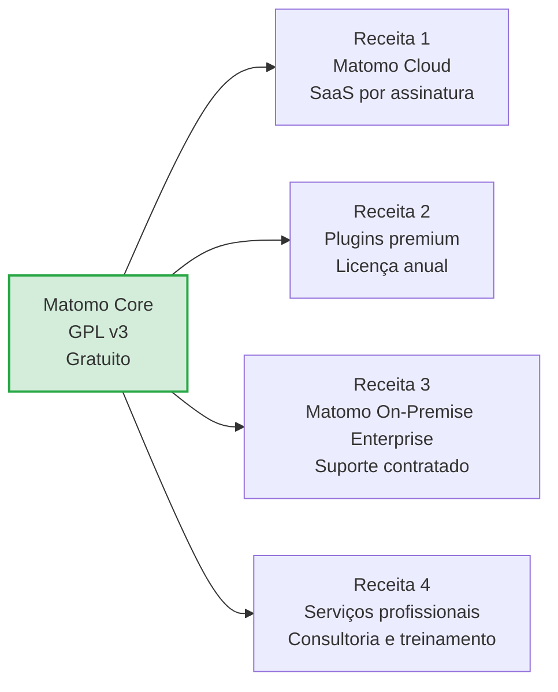
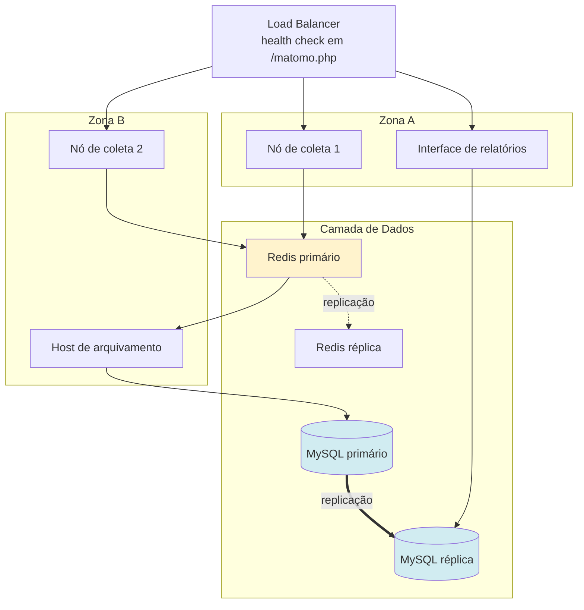
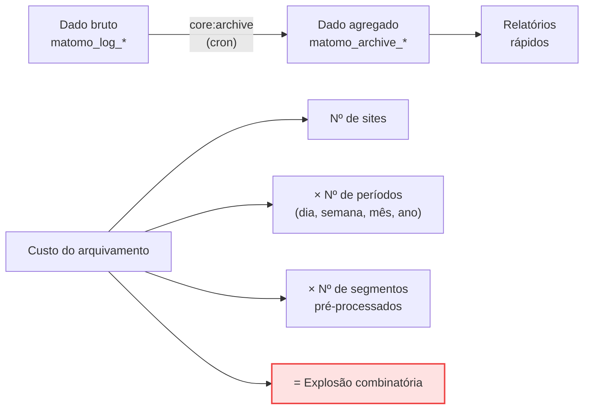

# Matomo

> **Ficha técnica de plataforma** · Pontuação na matriz: **505/600 (84,2 %)** — 🥇 1º lugar
> [← Voltar ao índice](../README.md) · [Comparativo detalhado](../docs/05-comparativo-detalhado.md) · [Matriz de decisão](../docs/07-matriz-decisao.md)

---

## Sumário

- [1. Visão geral](#1-visão-geral)
- [2. Licenciamento](#2-licenciamento)
- [3. Hospedagem](#3-hospedagem)
- [4. Funcionalidades](#4-funcionalidades)
- [5. APIs](#5-apis)
- [6. Exemplos de integração](#6-exemplos-de-integração)
- [7. Integrações](#7-integrações)
- [8. Infraestrutura](#8-infraestrutura)
- [9. Segurança](#9-segurança)
- [10. Governança](#10-governança)
- [11. Performance](#11-performance)
- [12. Custos](#12-custos)
- [13. Pontos fortes](#13-pontos-fortes)
- [14. Pontos fracos](#14-pontos-fracos)
- [15. Quando utilizar](#15-quando-utilizar)
- [16. Quando evitar](#16-quando-evitar)
- [17. Notas do avaliador](#17-notas-do-avaliador)

---

## 1. Visão geral

### 1.1 Identificação

| Campo | Valor |
|-------|-------|
| **Nome** | Matomo Analytics |
| **Nome anterior** | Piwik (2007–2018) |
| **Criador** | Matthieu Aubry |
| **Ano de lançamento** | 2007 |
| **Mantenedor** | InnoCraft Ltd. (Nova Zelândia) + comunidade |
| **Sede** | Wellington, Nova Zelândia; operações também na Alemanha |
| **Segmento** | Web Analytics tradicional |
| **Repositório** | `https://github.com/matomo-org/matomo` |
| **Site oficial** | `https://matomo.org/` |

### 1.2 História



### 1.3 Comunidade

| Indicador | Situação |
|-----------|----------|
| Idade do projeto | 18+ anos |
| Modelo de governança | Mantenedor comercial (InnoCraft) + contribuições da comunidade |
| Cadência de releases | Regular — versões menores mensais, versões maiores anuais |
| Marketplace de plugins | Extenso (gratuitos e pagos) |
| Fórum oficial | `https://forum.matomo.org/` — ativo |
| Idiomas da interface | 50+, incluindo **português do Brasil** |
| Adoção institucional | Comissão Europeia (Europa Analytics); administração pública francesa e alemã |
| Profissionais no Brasil | 🟡 Oferta limitada; competências de operação são genéricas |
| **Nota C11 (Comunidade)** | **4/5** |

### 1.4 Modelo de negócio



**Classificação:** *open core*. O produto principal é integralmente funcional sob GPL v3; a receita vem de conveniência (SaaS), de funcionalidades avançadas (plugins) e de serviços.

> **📌 Observação — Implicação do modelo open core**
> O Estado obtém a plataforma completa sem custo de licença, mas funcionalidades relevantes para análise de serviços digitais (funis, heatmaps, session recording, form analytics) são plugins comerciais. **Ignorar esse custo é o erro mais comum em comparativos de TCO.** Este estudo o contabiliza em ~R$ 12 k/ano.

### 1.5 Casos de uso

| Caso de uso | Aderência | Observação |
|-------------|:---------:|------------|
| Portal institucional público | 🟢 Excelente | Caso de uso central; precedente da Comissão Europeia |
| Serviço digital transacional | 🟢 Excelente | Funis e metas cobrem a análise de jornada |
| Site de conteúdo / notícias | 🟢 Excelente | Métricas de audiência maduras |
| E-commerce | 🟢 Boa | Módulo de e-commerce nativo |
| Intranet / aplicação interna | 🟢 Excelente | Auto-hospedado, sem exposição de dados |
| Analytics de produto SaaS | 🟡 Adequada | PostHog é mais especializado |
| Alto volume (> 100 M eventos/mês) | 🟠 Limitada | Exige engenharia significativa |
| Ambiente sem equipe de infraestrutura | 🔴 Inadequada | Usar Matomo Cloud |

---

## 2. Licenciamento

### 2.1 Núcleo

| Campo | Valor |
|-------|-------|
| **Tipo** | 🟢 Open Source |
| **Licença** | **GNU GPL v3 ou posterior** |
| **Texto** | `https://www.gnu.org/licenses/gpl-3.0.html` |
| **Copyleft** | Forte |
| **Uso comercial** | ✅ Permitido |
| **Modificação** | ✅ Permitida |
| **Redistribuição** | ✅ Permitida, sob a mesma licença |
| **Fork** | ✅ Permitido |
| **Direito perpétuo sobre a versão obtida** | ✅ Sim |
| **Custo de licença do núcleo** | **R$ 0** |

> **✅ Bloco de Decisão — Por que a GPL v3 importa para o Estado**
> A GPL v3 confere ao Estado três garantias que nenhuma licença proprietária oferece:
>
> 1. **Direito perpétuo:** a versão obtida pode ser operada indefinidamente, mesmo que o mantenedor encerre atividades — atende ao cenário QA-06.
> 2. **Auditabilidade:** o código pode ser inspecionado por auditor interno ou externo — fundamento da justificativa J3 do ADR.
> 3. **Proteção contra relicenciamento restritivo:** o copyleft forte, somado a uma base ampla de contribuidores, torna inviável fechar o produto — diferentemente do que ocorreu com projetos sob licença permissiva ou com contribuidor único.

### 2.2 Plugins premium

| Plugin | Função | Requisito atendido | Ordem de grandeza (licença anual) |
|--------|--------|--------------------|-----------------------------------|
| **Funnels** | Funis de conversão multi-etapa | RF-27 (*Must have*) | Centenas de EUR |
| **Heatmap & Session Recording** | Mapas de calor e gravação de sessão | RF-32, RF-33 | Centenas de EUR |
| **Form Analytics** | Análise de abandono de formulário | RF-34 | Centenas de EUR |
| **A/B Testing** | Testes A/B e multivariados | RF-35 | Centenas de EUR |
| **Media Analytics** | Rastreamento de vídeo e áudio | RF-11 | Centenas de EUR |
| **Custom Reports** | Relatórios customizados | RF-37 | Centenas de EUR |
| **Roll-Up Reporting** | Agregação multi-site | RF-42 | Centenas de EUR |
| **Users Flow** | Fluxo de usuários | RF-36 | Centenas de EUR |
| **LoginSaml** / **LoginOIDC** | Federação de identidade | RI-15, RI-16 | Centenas de EUR |
| **SearchEngineKeywordsPerformance** | Palavras-chave de busca orgânica | — | Centenas de EUR |

> **⚠️ Bloco de Risco — Verificação de preços obrigatória**
> Os valores dos plugins **não são reproduzidos numericamente** neste estudo porque variam por plugin, por faixa de tráfego e por período. A estimativa agregada de **~R$ 12 k/ano** para o conjunto necessário ao caso de uso é uma **premissa de planejamento**.
>
> **Antes de qualquer contratação, obter cotação formal em** `https://plugins.matomo.org/`. Registrado como pendência **V3** em [`../docs/12-referencias.md`](../docs/12-referencias.md#242-pendências-de-verificação-antes-da-homologação).

**Modelo de licenciamento dos plugins:** licença perpétua sobre a versão adquirida, com assinatura anual para receber atualizações. Interromper a assinatura **não desliga o plugin** — apenas cessa o direito a novas versões.

### 2.3 Matomo Cloud

| Campo | Valor |
|-------|-------|
| **Tipo** | Serviço proprietário sobre núcleo GPL |
| **Modelo de preço** | Assinatura mensal ou anual, escalonada por volume de ações |
| **Recursos premium** | ✅ Incluídos nos planos |
| **Região de dados** | Selecionável (União Europeia, entre outras) |
| **Preço** | Público em `https://matomo.org/pricing/` |

---

## 3. Hospedagem

| Modalidade | Suporte | Observações |
|-----------|:-------:|-------------|
| **Auto-hospedado (bare metal / VM)** | ✅ **Nativo** | Modalidade principal e mais madura |
| **Docker** | ✅ Imagem oficial | `docker.io/library/matomo` |
| **Docker Compose** | ✅ Documentado | Exemplos oficiais no repositório |
| **Kubernetes** | ⚠️ Comunidade | Sem Helm chart oficial mantido; manifests da comunidade disponíveis |
| **SaaS (Matomo Cloud)** | ✅ Oficial | Região selecionável |
| **Nuvem pública (IaaS)** | ✅ | Qualquer provedor com VM Linux |
| **On-premises com suporte** | ✅ | Oferta "Matomo On-Premise Enterprise" |
| **Nuvem privada do cliente (BYOC)** | ✅ | Instalação padrão em infraestrutura própria |

### 3.1 Requisitos mínimos

| Componente | Requisito |
|-----------|-----------|
| Sistema operacional | Linux (qualquer distribuição), Windows, macOS |
| PHP | 8.1 ou superior |
| Extensões PHP | `pdo`, `pdo_mysql`, `mysqli`, `curl`, `gd`, `mbstring`, `zlib`, `dom`, `json`, `openssl` |
| Banco de dados | MySQL 5.7+ ou MariaDB 10.3+ (recomendado MySQL 8.0 / MariaDB 10.6+) |
| Servidor web | Nginx, Apache, LiteSpeed, IIS |
| Memória PHP | ≥ 512 MB (recomendado 1 GB para arquivamento) |
| Cron | Obrigatório para arquivamento automático |

### 3.2 Exemplo de implantação com Docker Compose

```yaml
# docker-compose.yml — implantação de referência (ambiente de homologação)
services:
  db:
    image: mariadb:11
    command: >
      --max-allowed-packet=64MB
      --innodb-buffer-pool-size=2G
      --innodb-file-per-table=1
    environment:
      MARIADB_DATABASE: matomo
      MARIADB_USER: matomo
      MARIADB_PASSWORD_FILE: /run/secrets/db_password
      MARIADB_ROOT_PASSWORD_FILE: /run/secrets/db_root_password
    volumes:
      - db_data:/var/lib/mysql
    secrets:
      - db_password
      - db_root_password
    restart: unless-stopped

  redis:
    image: redis:7-alpine
    command: redis-server --appendonly yes --appendfsync everysec
    volumes:
      - redis_data:/data
    restart: unless-stopped

  matomo:
    image: matomo:5-fpm-alpine
    depends_on: [db, redis]
    environment:
      MATOMO_DATABASE_HOST: db
      MATOMO_DATABASE_USERNAME: matomo
      MATOMO_DATABASE_PASSWORD_FILE: /run/secrets/db_password
      MATOMO_DATABASE_DBNAME: matomo
      PHP_MEMORY_LIMIT: 1G
    volumes:
      - matomo_data:/var/www/html
    secrets:
      - db_password
    restart: unless-stopped

  web:
    image: nginx:alpine
    depends_on: [matomo]
    volumes:
      - matomo_data:/var/www/html:ro
      - ./nginx.conf:/etc/nginx/conf.d/default.conf:ro
    ports:
      - "127.0.0.1:8080:80"   # exposição apenas local; TLS terminado no proxy de borda
    restart: unless-stopped

  # Host de arquivamento dedicado (decisão arquitetural AA-3)
  archiver:
    image: matomo:5-fpm-alpine
    depends_on: [db, matomo]
    environment:
      MATOMO_DATABASE_HOST: db
      MATOMO_DATABASE_USERNAME: matomo
      MATOMO_DATABASE_PASSWORD_FILE: /run/secrets/db_password
      MATOMO_DATABASE_DBNAME: matomo
      PHP_MEMORY_LIMIT: 4G
    volumes:
      - matomo_data:/var/www/html
    secrets:
      - db_password
    entrypoint: >
      sh -c "while true; do
        php /var/www/html/console core:archive --concurrent-requests-per-website=3;
        sleep 900;
      done"
    restart: unless-stopped

volumes:
  db_data:
  redis_data:
  matomo_data:

secrets:
  db_password:
    file: ./secrets/db_password.txt
  db_root_password:
    file: ./secrets/db_root_password.txt
```

> **📌 Observação**
> O exemplo acima é de **referência para homologação**. Em produção, a arquitetura-alvo prevê componentes separados em hosts distintos, réplica de leitura, WAF e balanceador — ver [`../docs/09-recomendacao.md`, seção 5](../docs/09-recomendacao.md#5-arquitetura-alvo-de-referência). Senhas nunca devem ser passadas por variável de ambiente literal; o exemplo usa *secrets* em arquivo.

---

## 4. Funcionalidades

| Funcionalidade | Suporte | Detalhe |
|---------------|:-------:|---------|
| **Dashboards** | ✅ Nativo | Múltiplos dashboards por usuário, widgets arrastáveis, compartilháveis |
| **Eventos customizados** | ✅ Nativo | Categoria, ação, nome e valor |
| **Goals (metas)** | ✅ Nativo | Por URL, título, evento, download, link externo ou disparo manual; com valor monetário |
| **Conversion Funnel** | 💲 Plugin *Funnels* | Funis multi-etapa com identificação de ponto de abandono e taxa por etapa |
| **Heatmaps** | 💲 Plugin *Heatmap & Session Recording* | Clique, movimento e rolagem; por dispositivo |
| **Session Recording** | 💲 Plugin *Heatmap & Session Recording* | Gravação com mascaramento configurável de campos |
| **User Journey** | ✅ Nativo (Visitor Log) + 💲 Plugin *Users Flow* | Log de visitante detalhado nativo; visualização de fluxo agregado por plugin |
| **A/B Testing** | 💲 Plugin *A/B Testing* | Testes A/B e multivariados com significância estatística |
| **Form Analytics** | 💲 Plugin *Form Analytics* | Tempo por campo, taxa de abandono por campo, resubmissões |
| **Real Time** | ✅ Nativo | Visitantes ao vivo, mapa em tempo real, widget de últimas visitas |
| **Cohort** | ✅ Nativo | Relatório de coortes por período de aquisição |
| **Retention** | ⚠️ Parcial | Derivável de coortes; menos maduro que GA4/PostHog |
| **Custom Dimensions** | ✅ Nativo | Escopo de visita e de ação; até 5 de cada por padrão, ampliável |
| **Custom Reports** | 💲 Plugin *Custom Reports* | Combinação livre de métricas e dimensões |
| **Segmentação** | ✅ Nativo | Segmentos compostos com operadores lógicos, aplicáveis a todos os relatórios |
| **Comparação de períodos e segmentos** | ✅ Nativo | Até 3 períodos e 3 segmentos simultâneos |
| **E-commerce** | ✅ Nativo | Pedidos, produtos, categorias, carrinho abandonado |
| **Busca interna do site** | ✅ Nativo | Termos, resultados, buscas sem resultado |
| **Rastreamento de mídia** | 💲 Plugin *Media Analytics* | Vídeo e áudio: play, pausa, tempo assistido, taxa de conclusão |
| **Roll-up multi-site** | 💲 Plugin *Roll-Up Reporting* | Agregação de múltiplas propriedades em visão consolidada |
| **Relatórios agendados** | ✅ Nativo | Envio por e-mail em PDF, HTML ou CSV |
| **Alertas** | ✅ Nativo (plugin gratuito *CustomAlerts*) | Notificação por e-mail em condições configuráveis |
| **Anotações** | ✅ Nativo | Marcação de eventos institucionais na linha do tempo dos gráficos |
| **Tag Manager** | ✅ **Nativo** | Gerenciador de tags integrado, com versionamento e ambientes |
| **Importação de logs de servidor** | ✅ Nativo | Script Python oficial para processar logs de Apache/Nginx |
| **Detecção de bots** | ✅ Nativo | Lista de assinaturas atualizada continuamente |
| **Amostragem** | ❌ **Não aplica** | Todas as consultas percorrem o dado completo |

### 4.1 Cobertura dos requisitos funcionais

| Prioridade | Requisitos | Atendidos | Cobertura |
|-----------|:----------:|:---------:|----------:|
| *Must have* (M) | 17 | 17 | **100 %** |
| *Should have* (S) | 18 | 16 | 89 % |
| *Could have* (C) | 12 | 9 | 75 % |
| **Ponderada (M=3, S=2, C=1)** | **99** | **92** | **93 %** |

**Nota C05 (Recursos analíticos): 4/5** — a cobertura ponderada de 93 % situa-se na faixa de nota 5 (≥ 90 %), porém a nota é rebaixada para 4 porque **cinco funcionalidades relevantes exigem plugins pagos** na modalidade On-Premise e a análise de retenção é menos madura que a das plataformas líderes nesse aspecto.

---

## 5. APIs

### 5.1 Superfície de API

| API | Tipo | Finalidade |
|-----|------|-----------|
| **Reporting API** | HTTP/REST-like | Leitura de todos os relatórios |
| **Tracking HTTP API** | HTTP GET/POST | Ingestão de eventos server-side |
| **JavaScript Tracking API** | Cliente | Coleta no navegador |
| **Administration API** | HTTP (via Reporting API) | Gestão de sites, usuários, metas, segmentos |
| **GraphQL** | ❌ | Não disponível |
| **Webhooks** | 🔧 | Requer plugin ou desenvolvimento |

### 5.2 Reporting API

| Característica | Valor |
|---------------|-------|
| **Endpoint** | `https://<host>/index.php?module=API` |
| **Métodos** | GET e POST |
| **Autenticação** | Token (`token_auth`), preferencialmente em corpo POST ou header |
| **Formatos de saída** | `JSON`, `XML`, `CSV`, `TSV`, `HTML`, `RSS`, `Original` |
| **Versionamento** | ⚠️ Implícito — a compatibilidade é mantida entre versões maiores, sem prefixo `/v1` |
| **Rate limits** | Não impostos pelo produto; limitados pela capacidade da instância |
| **Bulk requests** | ✅ `API.getBulkRequest` — múltiplas consultas em uma requisição |
| **Paginação** | ✅ `filter_limit` e `filter_offset` |
| **Filtros** | ✅ `filter_pattern`, `filter_column`, `filter_sort_order` |
| **Segmentos** | ✅ Parâmetro `segment` com sintaxe própria |

#### Parâmetros essenciais

| Parâmetro | Descrição | Exemplo |
|-----------|-----------|---------|
| `module` | Sempre `API` | `API` |
| `method` | Método a invocar | `VisitsSummary.get` |
| `idSite` | ID da propriedade | `1` ou `1,2,3` ou `all` |
| `period` | Granularidade | `day`, `week`, `month`, `year`, `range` |
| `date` | Data ou intervalo | `2026-07-01`, `last30`, `2026-01-01,2026-06-30` |
| `format` | Formato de saída | `JSON`, `CSV`, `XML` |
| `token_auth` | Token de autenticação | `<token>` |
| `segment` | Segmento aplicado | `countryCode==br;deviceType==smartphone` |
| `flat` | Achatar hierarquias | `1` |
| `filter_limit` | Limite de linhas | `100` (use `-1` para todas) |

#### Métodos mais utilizados

| Método | Retorno |
|--------|---------|
| `VisitsSummary.get` | Métricas agregadas de visitas |
| `Actions.getPageUrls` | Páginas mais acessadas |
| `Actions.getPageTitles` | Títulos mais acessados |
| `Referrers.getAll` | Todas as fontes de tráfego |
| `Referrers.getCampaigns` | Campanhas (UTM) |
| `UserCountry.getCountry` / `getRegion` / `getCity` | Geolocalização |
| `DevicesDetection.getType` | Tipo de dispositivo |
| `Goals.get` | Conversões de metas |
| `Events.getCategory` / `getAction` / `getName` | Eventos customizados |
| `Live.getLastVisitsDetails` | Log detalhado de visitas |
| `CustomDimensions.getCustomDimension` | Dimensões customizadas |
| `Funnels.getFunnelFlow` | Fluxo do funil (plugin) |
| `SitesManager.getAllSites` | Cadastro de propriedades |
| `API.getBulkRequest` | Execução em lote |

### 5.3 Tracking HTTP API

| Característica | Valor |
|---------------|-------|
| **Endpoint** | `https://<host>/matomo.php` |
| **Métodos** | GET (query string) e POST (JSON, para lote) |
| **Autenticação** | `token_auth` obrigatório apenas para sobrescrever IP ou data |
| **Envio em lote** | ✅ POST com array `requests` (até centenas de eventos) |
| **Parâmetros principais** | `idsite`, `rec=1`, `action_name`, `url`, `urlref`, `_id`, `cid`, `e_c`, `e_a`, `e_n`, `e_v`, `cvar`, `dimension1..N`, `cip`, `cdt`, `uid` |

### 5.4 Administration API

Exposta através da própria Reporting API. Módulos principais:

| Módulo | Função |
|--------|--------|
| `SitesManager` | Criar, editar e listar propriedades |
| `UsersManager` | Gestão de usuários e permissões |
| `Goals` | Criar e editar metas |
| `SegmentEditor` | Gestão de segmentos salvos |
| `PrivacyManager` | Anonimização e retenção de dados |
| `CustomDimensions` | Configuração de dimensões |
| `Annotations` | Anotações na linha do tempo |

### 5.5 SDKs

| Linguagem | Situação | Referência |
|----------|:--------:|-----------|
| **PHP** | ✅ Oficial | `matomo/matomo-php-tracker` |
| **iOS (Swift)** | ✅ Oficial | `matomo-org/matomo-sdk-ios` |
| **Android (Java/Kotlin)** | ✅ Oficial | `matomo-org/matomo-sdk-android` |
| **JavaScript** | ✅ Oficial | `matomo.js` (tracker) |
| **Python** | ⚠️ Comunidade | Diversas bibliotecas; recomenda-se uso direto de `requests` |
| **Node.js** | ⚠️ Comunidade | Diversas bibliotecas; recomenda-se uso direto de `fetch` |
| **Java** | ⚠️ Comunidade | — |
| **.NET** | ⚠️ Comunidade | — |

> **📌 Observação**
> A ausência de SDK oficial em Python e Node.js **não é obstáculo prático**: a Reporting API é uma requisição HTTP GET com parâmetros e resposta JSON. Um cliente funcional cabe em 15 linhas, como demonstrado na seção 6. Isso reduz, mas não elimina, o impacto na nota C06 — SDK oficial oferece tratamento de erros, retentativa e tipagem que uma implementação própria precisa reconstruir.

### 5.6 Acesso direto ao banco

| Aspecto | Detalhe |
|---------|---------|
| **Disponibilidade** | ✅ Total na modalidade On-Premise |
| **Tabelas de dado bruto** | `matomo_log_visit`, `matomo_log_link_visit_action`, `matomo_log_action`, `matomo_log_conversion` |
| **Tabelas de agregado** | `matomo_archive_numeric_YYYY_MM`, `matomo_archive_blob_YYYY_MM` |
| **Documentação do schema** | `https://developer.matomo.org/guides/persistence-and-the-mysql-backend` |
| **Estabilidade** | ⚠️ Schema interno — pode mudar entre versões maiores (risco R-13) |

> **✅ Bloco de Decisão — O acesso SQL é a vantagem de integração decisiva**
> Nenhuma plataforma SaaS oferece acesso SQL direto ao dado bruto. Essa característica permite ao Estado:
> - construir *data marts* próprios, modelados conforme sua necessidade;
> - realizar *joins* entre dados de analytics e outras bases do Estado;
> - operar sem qualquer limite de requisição;
> - migrar para outra plataforma exportando tudo com um comando.
>
> É o fundamento técnico da nota 4 em C07 (Integrações), apesar da ausência de conectores nativos certificados.

---

## 6. Exemplos de integração

### 6.1 Python

```python
"""
Cliente mínimo da Reporting API do Matomo.
Requisitos: requests
"""
import os
from typing import Any
import requests


class MatomoClient:
    def __init__(self, base_url: str, token: str, timeout: int = 30) -> None:
        self.endpoint = f"{base_url.rstrip('/')}/index.php"
        self.token = token
        self.timeout = timeout
        self.session = requests.Session()

    def get(self, method: str, id_site: int | str, period: str, date: str,
            **extra: Any) -> Any:
        payload = {
            "module": "API",
            "method": method,
            "idSite": id_site,
            "period": period,
            "date": date,
            "format": "JSON",
            "token_auth": self.token,   # em POST, não vai na URL nem em log de acesso
            **extra,
        }
        # POST evita o token aparecer em logs de servidor e em histórico de proxy
        response = self.session.post(self.endpoint, data=payload, timeout=self.timeout)
        response.raise_for_status()
        data = response.json()
        if isinstance(data, dict) and data.get("result") == "error":
            raise RuntimeError(f"Matomo API error: {data.get('message')}")
        return data

    def bulk(self, requests_list: list[str]) -> Any:
        """Executa várias consultas em uma única chamada HTTP."""
        payload = {
            "module": "API",
            "method": "API.getBulkRequest",
            "format": "JSON",
            "token_auth": self.token,
        }
        for i, urls in enumerate(requests_list):
            payload[f"urls[{i}]"] = urls
        response = self.session.post(self.endpoint, data=payload, timeout=self.timeout)
        response.raise_for_status()
        return response.json()


if __name__ == "__main__":
    client = MatomoClient(
        base_url=os.environ["MATOMO_URL"],
        token=os.environ["MATOMO_TOKEN"],
    )

    # Resumo de visitas dos últimos 30 dias
    resumo = client.get("VisitsSummary.get", id_site=1, period="range", date="last30")
    print(f"Visitas: {resumo['nb_visits']:,}")
    print(f"Visitantes únicos: {resumo.get('nb_uniq_visitors', 'n/d')}")

    # Top 10 páginas, achatando a hierarquia de URLs
    paginas = client.get(
        "Actions.getPageUrls", id_site=1, period="month", date="today",
        flat=1, filter_limit=10, filter_sort_column="nb_hits",
    )
    for p in paginas:
        print(f"{p['nb_hits']:>8,}  {p['label']}")

    # Segmento: apenas acessos do Brasil por dispositivo móvel
    movel_br = client.get(
        "VisitsSummary.get", id_site=1, period="month", date="today",
        segment="countryCode==br;deviceType==smartphone",
    )
    print(f"Visitas móveis do Brasil: {movel_br['nb_visits']:,}")
```

#### Extração em massa para DataFrame (pipeline de BI)

```python
"""Extração diária de métricas de todas as propriedades para pandas."""
import pandas as pd


def extrair_metricas_diarias(client: MatomoClient, data_inicio: str,
                             data_fim: str) -> pd.DataFrame:
    sites = client.get("SitesManager.getAllSites", id_site="all",
                       period="day", date="today")

    linhas = []
    for site in sites:
        serie = client.get(
            "VisitsSummary.get",
            id_site=site["idsite"],
            period="day",
            date=f"{data_inicio},{data_fim}",
        )
        for dia, metricas in serie.items():
            if not metricas:          # dias sem tráfego retornam lista vazia
                continue
            linhas.append({
                "data": dia,
                "id_site": site["idsite"],
                "site": site["name"],
                "visitas": metricas.get("nb_visits", 0),
                "visitantes_unicos": metricas.get("nb_uniq_visitors", 0),
                "acoes": metricas.get("nb_actions", 0),
                "taxa_rejeicao": metricas.get("bounce_rate", "0%"),
                "duracao_media_s": metricas.get("avg_time_on_site", 0),
            })
    return pd.DataFrame(linhas)
```

### 6.2 Node.js

```javascript
/**
 * Cliente da Reporting API do Matomo — Node.js 18+ (fetch nativo).
 */
class MatomoClient {
  #endpoint;
  #token;

  constructor(baseUrl, token) {
    this.#endpoint = `${baseUrl.replace(/\/$/, '')}/index.php`;
    this.#token = token;
  }

  async get(method, { idSite, period, date, ...extra }) {
    const body = new URLSearchParams({
      module: 'API',
      method,
      idSite: String(idSite),
      period,
      date,
      format: 'JSON',
      token_auth: this.#token,
      ...Object.fromEntries(
        Object.entries(extra).map(([k, v]) => [k, String(v)])
      ),
    });

    const res = await fetch(this.#endpoint, {
      method: 'POST',
      headers: { 'Content-Type': 'application/x-www-form-urlencoded' },
      body,
    });

    if (!res.ok) throw new Error(`HTTP ${res.status}: ${res.statusText}`);

    const data = await res.json();
    if (data?.result === 'error') throw new Error(`Matomo: ${data.message}`);
    return data;
  }
}

// Uso
const matomo = new MatomoClient(process.env.MATOMO_URL, process.env.MATOMO_TOKEN);

const resumo = await matomo.get('VisitsSummary.get', {
  idSite: 1, period: 'range', date: 'last30',
});
console.log(`Visitas nos últimos 30 dias: ${resumo.nb_visits.toLocaleString('pt-BR')}`);

const funil = await matomo.get('Funnels.getFunnelFlow', {
  idSite: 1, period: 'month', date: 'today', idFunnel: 1,
});
console.table(funil.steps ?? []);
```

#### Tracking server-side em Node.js

```javascript
/**
 * Envio de evento server-side — útil para eventos críticos que não podem
 * ser bloqueados por ad blockers (ex.: conclusão de serviço digital).
 */
async function rastrearEventoServidor({ idSite, url, categoria, acao, nome, valor, ip }) {
  const params = new URLSearchParams({
    idsite: String(idSite),
    rec: '1',
    url,
    e_c: categoria,
    e_a: acao,
    ...(nome && { e_n: nome }),
    ...(valor != null && { e_v: String(valor) }),
    ...(ip && { cip: ip }),           // exige token_auth
    token_auth: process.env.MATOMO_TOKEN,
    send_image: '0',                  // resposta 204, sem imagem GIF
  });

  await fetch(`${process.env.MATOMO_URL}/matomo.php`, {
    method: 'POST',
    headers: { 'Content-Type': 'application/x-www-form-urlencoded' },
    body: params,
  });
}

// Exemplo: registrar conclusão de solicitação de serviço
await rastrearEventoServidor({
  idSite: 1,
  url: 'https://servicos.ms.gov.br/protocolo/concluido',
  categoria: 'Servico Digital',
  acao: 'Protocolo Concluido',
  nome: 'Certidao Negativa',
  valor: 1,
});
```

### 6.3 Power BI

**Caminho A — conexão direta à réplica MySQL (recomendado para volume alto)**

1. `Obter Dados` → `Banco de Dados MySQL`
2. Servidor: `replica-matomo.interno.ms.gov.br:3306` · Banco: `matomo`
3. Modo: **Importação** (o modo DirectQuery sobre tabelas de log é desaconselhado por volume)
4. Consulta SQL nativa sobre a camada de *views* estáveis:

```sql
-- View estável recomendada (criar no banco, não no Power BI)
CREATE OR REPLACE VIEW vw_bi_visitas_diarias AS
SELECT
    DATE(v.visit_last_action_time)          AS data,
    s.idsite                                AS id_site,
    s.name                                  AS site,
    COUNT(DISTINCT v.idvisit)               AS visitas,
    COUNT(DISTINCT v.idvisitor)             AS visitantes,
    SUM(v.visit_total_actions)              AS acoes,
    AVG(v.visit_total_time)                 AS duracao_media_s,
    SUM(CASE WHEN v.visit_total_actions = 1 THEN 1 ELSE 0 END) AS rejeicoes,
    v.location_country                      AS pais,
    v.config_device_type                    AS tipo_dispositivo
FROM matomo_log_visit v
JOIN matomo_site s ON s.idsite = v.idsite
WHERE v.visit_last_action_time >= DATE_SUB(CURDATE(), INTERVAL 24 MONTH)
GROUP BY 1, 2, 3, 9, 10;
```

**Caminho B — Reporting API via conector Web**

```powerquery
// Power Query M — consumo da Reporting API do Matomo
let
    BaseUrl  = "https://analytics.ms.gov.br/index.php",
    Token    = "<token_auth>",   // usar Parâmetro do Power BI, nunca literal

    Corpo = Text.ToBinary(Uri.BuildQueryString([
        module     = "API",
        method     = "VisitsSummary.get",
        idSite     = "1",
        period     = "day",
        date       = "last365",
        format     = "JSON",
        token_auth = Token
    ])),

    Resposta = Web.Contents(BaseUrl, [
        Content = Corpo,
        Headers = [#"Content-Type" = "application/x-www-form-urlencoded"]
    ]),

    Json     = Json.Document(Resposta),
    Tabela   = Record.ToTable(Json),
    Expandir = Table.ExpandRecordColumn(
        Table.TransformColumns(Tabela, {{"Value", each if _ is record then _ else null}}),
        "Value",
        {"nb_visits", "nb_uniq_visitors", "nb_actions", "bounce_rate"},
        {"visitas", "visitantes", "acoes", "taxa_rejeicao"}
    ),
    Renomear = Table.RenameColumns(Expandir, {{"Name", "data"}}),
    Tipar    = Table.TransformColumnTypes(Renomear, {
        {"data", type date}, {"visitas", Int64.Type},
        {"visitantes", Int64.Type}, {"acoes", Int64.Type}
    })
in
    Tipar
```

> **⚠️ Bloco de Risco — Token em Power BI**
> O `token_auth` **nunca** deve ser escrito literalmente no arquivo `.pbix`, que é distribuível e legível. Usar **Parâmetro** do Power BI, e no Power BI Service configurar credencial no gateway de dados. Criar um token com permissão de **somente leitura**, restrito às propriedades necessárias.

### 6.4 Grafana

**Opção A — datasource MySQL apontando para a réplica (recomendado)**

```sql
-- Painel: visitas por hora nas últimas 24 h
SELECT
    UNIX_TIMESTAMP(DATE_FORMAT(visit_last_action_time, '%Y-%m-%d %H:00:00')) AS time,
    s.name AS metric,
    COUNT(*) AS value
FROM matomo_log_visit v
JOIN matomo_site s ON s.idsite = v.idsite
WHERE $__timeFilter(v.visit_last_action_time)
GROUP BY 1, 2
ORDER BY 1;
```

```sql
-- Painel operacional: profundidade da fila de tracking
-- (consultar Redis via datasource Redis, não via MySQL)
-- Chave: matomo*trackingQueueV1*
```

**Opção B — plugin de datasource para Matomo (comunidade)**

Disponível no catálogo de plugins do Grafana. Consome a Reporting API diretamente. Adequado a painéis simples; para painéis com muitas séries, a opção A é substancialmente mais performática.

**Painel operacional recomendado (Onda 2 do roadmap):**

| Painel | Fonte | Alerta |
|--------|-------|--------|
| Profundidade da fila de tracking | Redis | > 50.000 eventos por mais de 15 min |
| Duração do cron de arquivamento | Log / textfile collector | > 70 % da janela |
| Latência p95 do endpoint de coleta | Nginx / APM | > 200 ms |
| Taxa de erro 5xx no `matomo.php` | Nginx | > 0,1 % |
| Replicação atrasada (segundos) | MySQL | > 300 s |
| Espaço em disco do banco | Node exporter | < 20 % livre |

### 6.5 Metabase

```
1. Configurações → Bancos de dados → Adicionar
2. Tipo: MySQL
3. Host: replica-matomo.interno.ms.gov.br  ·  Porta: 3306
4. Banco: matomo
5. Usuário: metabase_ro  (usuário com GRANT SELECT apenas nas views)
6. Ativar "Usar conexão segura (SSL)"
```

```sql
-- Modelo Metabase: funil de serviço digital
SELECT
    a.name                                   AS pagina,
    COUNT(DISTINCT lva.idvisit)              AS visitas,
    COUNT(*)                                 AS visualizacoes
FROM matomo_log_link_visit_action lva
JOIN matomo_log_action a ON a.idaction = lva.idaction_url
WHERE lva.idsite = {{id_site}}
  AND lva.server_time BETWEEN {{data_inicio}} AND {{data_fim}}
  AND a.name LIKE 'servicos.ms.gov.br/protocolo%'
GROUP BY 1
ORDER BY visitas DESC;
```

> **✅ Boa prática de segurança**
> Criar usuário de banco **exclusivo para BI**, com `GRANT SELECT` restrito às *views* estáveis — nunca às tabelas de log diretamente. Isso protege o schema interno, limita a exposição de dados e evita consultas mal formadas sobre tabelas de dezenas de milhões de linhas.

### 6.6 Apache Superset

```python
# superset_config.py — registro da conexão
# String de conexão (cadastrar pela interface, não no arquivo, para não versionar credencial):
# mysql+pymysql://superset_ro:<senha>@replica-matomo.interno.ms.gov.br:3306/matomo?charset=utf8mb4
```

```sql
-- Dataset virtual do Superset: métricas consolidadas por órgão
SELECT
    DATE(v.visit_last_action_time)                      AS data,
    s.name                                              AS portal,
    SUBSTRING_INDEX(s.main_url, '.', 1)                 AS orgao,
    COUNT(DISTINCT v.idvisit)                           AS visitas,
    COUNT(DISTINCT v.idvisitor)                         AS visitantes,
    SUM(v.visit_total_actions)                          AS acoes,
    ROUND(AVG(v.visit_total_time), 1)                   AS duracao_media_s,
    ROUND(100.0 * SUM(v.visit_total_actions = 1) / COUNT(*), 2) AS taxa_rejeicao_pct,
    SUM(v.config_device_type = 1)                       AS visitas_smartphone
FROM matomo_log_visit v
JOIN matomo_site s ON s.idsite = v.idsite
WHERE v.visit_last_action_time >= DATE_SUB(CURDATE(), INTERVAL 12 MONTH)
GROUP BY 1, 2, 3;
```

Charts recomendados: `Big Number with Trendline` (visitas), `Time-series Line Chart` (evolução por órgão), `Sunburst` (jornada), `Table` (top páginas), `World Map` (geolocalização).

### 6.7 Qlik Sense

**Opção A — conector ODBC para MySQL (recomendado)**

```qlik
// Script de carga do Qlik Sense — conexão ODBC à réplica
LIB CONNECT TO 'MatomoReplica';

Visitas:
LOAD
    Date(data)              AS Data,
    site                    AS Portal,
    orgao                   AS Orgao,
    visitas                 AS Visitas,
    visitantes              AS Visitantes,
    acoes                   AS Acoes,
    taxa_rejeicao_pct       AS TaxaRejeicao;
SQL SELECT * FROM vw_bi_visitas_diarias
WHERE data >= DATE_SUB(CURDATE(), INTERVAL 24 MONTH);

STORE Visitas INTO [lib://QVD/matomo_visitas.qvd] (qvd);
```

**Opção B — Qlik REST Connector sobre a Reporting API**

```qlik
LIB CONNECT TO 'MatomoRestAPI';

RestConnectorMasterTable:
SQL SELECT
    "nb_visits", "nb_uniq_visitors", "nb_actions", "bounce_rate", "__KEY_root"
FROM JSON (wrap on) "root"
WITH CONNECTION (
    URL "https://analytics.ms.gov.br/index.php",
    HTTPHEADER "Content-Type" "application/x-www-form-urlencoded",
    BODY "module=API&method=VisitsSummary.get&idSite=1&period=day&date=last365&format=JSON&token_auth=$(vToken)"
);
```

### 6.8 Google Looker Studio

| Caminho | Detalhe | Recomendação |
|---------|---------|--------------|
| **Conector oficial do Matomo** | Plugin `LookerStudio` disponível no marketplace do Matomo | ✅ Preferencial |
| **Conector da comunidade** | Diversos conectores de terceiros | ⚠️ Avaliar antes de usar |
| **Google Sheets como intermediário** | Script exporta da API para planilha; Looker Studio lê a planilha | 🔧 Alternativa simples |

> **⚠️ Bloco de Risco — Looker Studio e soberania**
> Usar o Looker Studio para visualizar dados do Matomo **transfere os dados agregados para a infraestrutura do Google**, reintroduzindo parte do problema que a escolha do Matomo resolve.
>
> **Recomendação:** para painéis internos e corporativos, preferir **Superset, Metabase ou Power BI** com o gateway de dados local. Reservar o Looker Studio para painéis **públicos com dados já agregados e não sensíveis** (ex.: estatísticas de audiência publicadas em portal de transparência), onde a exposição já é intencional.

---

## 7. Integrações

| Integração | Suporte | Detalhe |
|-----------|:-------:|---------|
| **Google Tag Manager** | ✅ | Template de tag disponível; o Matomo pode ser disparado via GTM |
| **Matomo Tag Manager** | ✅ **Nativo** | Gerenciador próprio, com versionamento, ambientes, *triggers* e variáveis |
| **Consent Manager** | ✅ | API `rememberConsentGiven()` / `forgetConsentGiven()`; integração com CMPs de mercado |
| **IAB TCF** | ⚠️ | Integração possível via CMP; sem suporte nativo certificado |
| **Identity Provider** | 💲 | Plugins `LoginSaml` (SAML 2.0) e `LoginOIDC` (OpenID Connect) |
| **OAuth 2.0** | 💲 | Via `LoginOIDC` |
| **OpenID Connect** | 💲 | Via `LoginOIDC` |
| **LDAP / Active Directory** | 💲 | Plugin `LoginLdap` |
| **WordPress** | ✅ | Plugin oficial `matomo-for-wordpress` (inclui o Matomo embarcado) |
| **Drupal** | ✅ | Módulo oficial da comunidade Drupal |
| **Joomla, TYPO3, Magento** | ✅ | Extensões da comunidade |
| **SMTP** | ✅ | Relatórios agendados e alertas |
| **Webhooks** | 🔧 | Requer plugin ou desenvolvimento |
| **Slack / Teams** | 🔧 | Via webhook customizado ou integração de alertas |

### 7.1 Configuração de consentimento (quando aplicável)

```javascript
// Integração com CMP — só rastreia após consentimento
var _paq = window._paq = window._paq || [];

// 1. Exige consentimento antes de qualquer coleta
_paq.push(['requireConsent']);

// 2. Configuração de privacidade (aplicada mesmo com consentimento)
_paq.push(['disableCookies']);          // operação cookieless
_paq.push(['setDoNotTrack', true]);     // respeita DNT do navegador

_paq.push(['trackPageView']);
_paq.push(['enableLinkTracking']);

(function () {
  var u = 'https://analytics.ms.gov.br/';
  _paq.push(['setTrackerUrl', u + 'matomo.php']);
  _paq.push(['setSiteId', '1']);
  var d = document, g = d.createElement('script'), s = d.getElementsByTagName('script')[0];
  g.async = true; g.src = u + 'matomo.js'; s.parentNode.insertBefore(g, s);
})();

// 3. Chamado pelo CMP quando o titular consente
function onConsentGiven() {
  _paq.push(['rememberConsentGiven']);  // persiste por 30 dias (configurável)
}

// 4. Chamado quando o titular revoga
function onConsentWithdrawn() {
  _paq.push(['forgetConsentGiven']);
}
```

> **📌 Observação**
> Na configuração recomendada para portais institucionais (cookieless + IP anonimizado + sem `userId`), **o consentimento é dispensável**, e o bloco `requireConsent` não deve ser usado — ele reduziria desnecessariamente a cobertura de coleta. O exemplo acima aplica-se apenas às hipóteses em que o consentimento é a base legal: gravação de sessão e heatmaps.

---

## 8. Infraestrutura

### 8.1 Banco de dados

| Aspecto | Detalhe |
|---------|---------|
| **SGBD** | MySQL 5.7+ ou MariaDB 10.3+ |
| **Tipo** | Relacional orientado a linha |
| **Engine** | InnoDB |
| **Charset recomendado** | `utf8mb4` |
| **Tabelas de dado bruto** | `matomo_log_*` — crescem linearmente com o tráfego |
| **Tabelas de agregado** | `matomo_archive_*` — particionadas por mês automaticamente |
| **Particionamento** | Manual, recomendado nas tabelas de log |

### 8.2 Escalabilidade

| Dimensão | Estratégia | Limite prático |
|----------|-----------|----------------|
| **Coleta (horizontal)** | Nós PHP-FPM stateless atrás de balanceador | Escala linearmente |
| **Coleta (vertical)** | Mais CPU e workers PHP-FPM | Limitado pelo banco |
| **Ingestão** | Fila com Redis (`QueuedTracking`) | Absorve picos de ordens de grandeza |
| **Processamento** | Cron paralelizável por site | Limitado por CPU e I/O do banco |
| **Banco (escrita)** | ⚠️ Vertical apenas | Gargalo estrutural |
| **Banco (leitura)** | ✅ Réplicas de leitura | Escala linearmente |
| **Limite prático em configuração padrão** | ~50 M ações/mês | Acima disso, exige engenharia dedicada |

### 8.3 Cache

| Camada | Tecnologia | Efeito |
|--------|-----------|--------|
| Cache de aplicação | Arquivo (padrão) ou Redis/Memcached | Metadados, configuração, tradução |
| Cache de sessão | Arquivo ou Redis | Obrigatório em Redis quando há múltiplos nós |
| Cache de consulta | Tabelas `matomo_archive_*` | O arquivamento **é** a estratégia de cache do produto |
| OPcache do PHP | Nativo | Redução relevante de CPU |

### 8.4 Alta disponibilidade



| Componente | Estratégia de HA | Maturidade |
|-----------|-----------------|:----------:|
| Nós de coleta | Ativo/ativo atrás de balanceador | 🟢 Simples |
| Interface de relatórios | Ativo/ativo com sessão em Redis | 🟢 Simples |
| Host de arquivamento | Ativo/passivo (apenas um deve executar) | 🟡 Requer coordenação |
| Redis | Primário/réplica com Sentinel | 🟡 Moderada |
| MySQL | Primário/réplica com failover | 🟡 Moderada |

### 8.5 Backup e Disaster Recovery

| Item | Recomendação |
|------|-------------|
| **Backup lógico** | `mysqldump --single-transaction --routines --triggers` diário |
| **Backup físico** | Snapshot de volume ou Percona XtraBackup para bases grandes |
| **Point-in-time recovery** | Binlog contínuo |
| **Arquivos** | `config/config.ini.php`, diretório `plugins/`, `misc/` (bases GeoIP) |
| **Retenção** | 30 dias diários + 12 meses mensais |
| **Regra 3-2-1** | 3 cópias, 2 mídias, 1 fora do sítio |
| **RPO alcançável** | ≤ 1 h com binlog; ≤ 24 h com dump diário |
| **RTO alcançável** | 2–8 h, conforme o volume da base |
| **Teste de restauração** | **Trimestral, obrigatório** (risco R-12) |

```bash
#!/usr/bin/env bash
# backup-matomo.sh — backup lógico com verificação de integridade
set -euo pipefail

DATA=$(date +%Y%m%d_%H%M%S)
DESTINO="/backup/matomo"
RETENCAO_DIAS=30

mkdir -p "$DESTINO"

# Dump consistente sem travar tabelas (InnoDB)
mysqldump \
  --defaults-file=/etc/mysql/backup.cnf \
  --single-transaction \
  --routines --triggers --events \
  --hex-blob \
  --databases matomo \
  | gzip -9 > "${DESTINO}/matomo_${DATA}.sql.gz"

# Verificação: o arquivo abre e termina com a marca de fim de dump
gzip -t "${DESTINO}/matomo_${DATA}.sql.gz"
zcat "${DESTINO}/matomo_${DATA}.sql.gz" | tail -5 | grep -q "Dump completed" \
  || { echo "ERRO: dump incompleto"; exit 1; }

# Arquivos de configuração e plugins
tar czf "${DESTINO}/matomo_config_${DATA}.tar.gz" \
  /var/www/matomo/config/config.ini.php \
  /var/www/matomo/plugins \
  /var/www/matomo/misc

# Expurgo da retenção
find "$DESTINO" -name 'matomo_*.gz' -mtime +${RETENCAO_DIAS} -delete

echo "Backup concluído: ${DESTINO}/matomo_${DATA}.sql.gz"
```

---

## 9. Segurança

| Aspecto | Situação |
|---------|----------|
| **LGPD** | ✅ Plenamente atendível — ver [`../comparativos/lgpd.md`](../comparativos/lgpd.md) |
| **GDPR** | ✅ Conformidade documentada; precedente favorável da CNIL |
| **ISO 27001** | ➖ Não aplicável ao produto auto-hospedado (aplica-se ao operador da infraestrutura) |
| **SOC 2** | ➖ Não aplicável ao produto auto-hospedado |
| **Controle de acesso** | ✅ RBAC granular: visualizar, escrever, administrar, superusuário — por propriedade |
| **MFA** | ✅ Nativo (TOTP) |
| **Auditoria** | ✅ Log de atividade administrativa nativo |
| **Logs** | ✅ Log de aplicação configurável; exportável para SIEM |
| **Criptografia em trânsito** | ✅ TLS (configurado no servidor web); `force_ssl = 1` |
| **Criptografia em repouso** | 🔧 Nível de infraestrutura (LUKS, criptografia de volume, TDE do MySQL) |
| **Retenção de dados** | ✅ Configurável por propriedade, com exclusão física automática |
| **Programa de divulgação de vulnerabilidades** | ✅ `https://matomo.org/security-policy/` |
| **Cadência de patches** | 🟢 Regular |
| **CVE crítica em aberto** | ❌ Nenhuma na data-base |
| **Nota C09 (Segurança)** | **4/5** |

### 9.1 Hardening recomendado

| # | Controle | Prioridade |
|---|----------|:----------:|
| 1 | Interface administrativa acessível **apenas** por rede interna ou VPN | 🔴 Crítica |
| 2 | Somente `matomo.php`, `matomo.js` e `piwik.php` expostos publicamente | 🔴 Crítica |
| 3 | WAF com OWASP CRS sobre o endpoint de coleta | 🔴 Crítica |
| 4 | `force_ssl = 1` e HSTS habilitado | 🔴 Crítica |
| 5 | MFA obrigatório para todos os usuários administrativos | 🔴 Crítica |
| 6 | Usuário do banco com privilégio mínimo (sem `SUPER`, sem `FILE`) | 🟠 Alta |
| 7 | `open_basedir` e `disable_functions` no PHP | 🟠 Alta |
| 8 | Diretório `tmp/` fora da raiz web ou com execução negada | 🟠 Alta |
| 9 | Plugins apenas do marketplace oficial, com revisão prévia | 🟠 Alta |
| 10 | Segmentação de rede — a instância não acessa outras redes internas | 🟠 Alta |
| 11 | Monitoramento de integridade de arquivos | 🟡 Média |
| 12 | Rate limiting no endpoint de coleta | 🟡 Média |
| 13 | Rotação e expiração de tokens de API | 🟡 Média |

```nginx
# nginx.conf — exposição mínima do Matomo
server {
    listen 443 ssl http2;
    server_name analytics.ms.gov.br;

    ssl_protocols TLSv1.2 TLSv1.3;
    add_header Strict-Transport-Security "max-age=63072000; includeSubDomains" always;
    add_header X-Content-Type-Options "nosniff" always;
    add_header X-Frame-Options "SAMEORIGIN" always;

    root /var/www/matomo;
    index index.php;

    # Endpoints públicos de coleta — únicos acessíveis pela internet
    location = /matomo.php { include fastcgi.conf; fastcgi_pass matomo:9000; }
    location = /matomo.js  { expires 1h; add_header Cache-Control "public"; }
    location = /piwik.php  { include fastcgi.conf; fastcgi_pass matomo:9000; }
    location = /piwik.js   { expires 1h; }

    # Interface administrativa — apenas rede interna
    location / {
        allow 10.0.0.0/8;
        allow 172.16.0.0/12;
        deny  all;
        try_files $uri $uri/ /index.php$is_args$args;
    }

    # Bloqueios explícitos
    location ~ ^/(config|core|lang|misc|plugins|tmp|vendor)/ { deny all; }
    location ~ \.(ini|log|sql|md|twig)$ { deny all; }
    location ~ /\. { deny all; }
}
```

---

## 10. Governança

| Aspecto | Avaliação | Detalhe |
|---------|:---------:|---------|
| **Vendor lock-in** | 🟢 Muito baixo | GPL v3; código auditável; schema inspecionável; fork viável |
| **Controle dos dados** | 🟢 Total | Dado bruto em banco sob custódia do Estado |
| **Portabilidade** | 🟢 Total | Exportação por SQL, API ou dump de banco |
| **Transparência** | 🟢 Total | Código-fonte público; changelog público; roadmap em milestones |
| **Auditoria** | 🟢 Verificável | Código, banco, rede e log — todos inspecionáveis |
| **Soberania dos dados** | 🟢 Total | Nenhuma transferência internacional |
| **Continuidade sem o fornecedor** | 🟢 Indefinida | Direito perpétuo pela GPL v3 |
| **Custo de saída** | 🟢 ~R$ 20 k | Essencialmente esforço de ETL |
| **Nota C02 (Controle)** | **5/5** | |
| **Nota C04 (Independência)** | **5/5** | |

---

## 11. Performance

| Métrica | Valor de referência | Condição |
|---------|--------------------|-----------|
| **Volume suportado (configuração padrão)** | ~50 M ações/mês | Com tuning e fila |
| **Volume com engenharia dedicada** | 100 M+ ações/mês | Réplicas, particionamento, arquivamento distribuído |
| **Escalabilidade horizontal (coleta)** | ✅ Linear | Nós stateless |
| **Escalabilidade horizontal (banco)** | ⚠️ Apenas leitura | Escrita é vertical |
| **Escalabilidade vertical** | ✅ Efetiva | Ganho relevante com RAM para o buffer pool |
| **Latência do endpoint de coleta** | < 100 ms (p95) | Com fila; a gravação é assíncrona |
| **Latência sem fila, sob carga** | ⚠️ Degrada rapidamente | Motivo do risco R-02 |
| **Tempo de relatório padrão (30 dias)** | 1–3 s | Com arquivamento em dia |
| **Tempo de relatório com segmento não pré-processado** | 10–60 s | Cálculo sob demanda |
| **Tamanho do tracker (gzip)** | ~22 KB | Carregamento assíncrono |
| **Impacto no LCP** | Baixo | Script assíncrono, não bloqueante |
| **Amostragem** | ❌ Nenhuma | Sempre dado completo |
| **Nota C08 (Escalabilidade)** | **3/5** | |

### 11.1 O gargalo do arquivamento



| Mitigação | Efeito | Custo |
|-----------|--------|-------|
| `browser_archiving_disabled_enforce = 1` | Elimina arquivamento sob demanda no navegador | Configuração |
| Host dedicado para o cron | Isola a carga de agregação | 1 VM |
| `--concurrent-requests-per-website=N` | Reduz a janela de conclusão | Configuração |
| Restringir segmentos pré-processados | Reduz o multiplicador D3 | Governança |
| Réplica de leitura para relatórios | Elimina competição pela CPU do banco | 1 instância |
| Retenção rígida de dado bruto | Reduz o volume percorrido a cada execução | Configuração |

---

## 12. Custos

Cenário de referência: 12 M page views/mês, 80 propriedades, horizonte de 5 anos.

| Componente | Ano 1 | Anos 2–5 (total) | 5 anos |
|-----------|------:|-----------------:|-------:|
| **Licenciamento (núcleo)** | R$ 0 | R$ 0 | **R$ 0** |
| **Plugins premium** | R$ 25.000 | R$ 48.000 | **R$ 73.000** |
| **Infraestrutura** | R$ 60.000 | R$ 176.000 | **R$ 236.000** |
| **Implantação (único)** | R$ 60.000 | — | **R$ 60.000** |
| **Equipe / operação (0,3 FTE)** | R$ 60.000 | R$ 240.000 | **R$ 300.000** |
| **Atualizações** | R$ 8.000 | R$ 32.000 | **R$ 40.000** |
| **Manutenção corretiva** | R$ 6.000 | R$ 24.000 | **R$ 30.000** |
| **Custo estimado de saída** | — | — | **R$ 20.000** |
| **TCO 5 anos** | | | **≈ R$ 759.000** |
| **Nota C03 (TCO)** | | | **4/5** |

### 12.1 Detalhamento da infraestrutura

| Recurso | Quantidade | Custo mensal estimado |
|---------|:----------:|---------------------:|
| Nó de coleta (4 vCPU, 8 GB) | 2 | R$ 800 |
| Interface de relatórios (4 vCPU, 16 GB) | 1 | R$ 600 |
| Host de arquivamento (8 vCPU, 16 GB) | 1 | R$ 800 |
| Redis (2 vCPU, 8 GB) | 1 | R$ 300 |
| MySQL primário (8 vCPU, 32 GB, 1 TB NVMe) | 1 | R$ 1.100 |
| MySQL réplica (8 vCPU, 32 GB, 1 TB NVMe) | 1 | R$ 1.100 |
| Armazenamento de backup (3 TB) | 1 | R$ 250 |
| **Total mensal** | | **~R$ 4.950** |

> **📌 Observação**
> Valores estimados sobre infraestrutura própria do Estado ou nuvem contratada, em bandas de referência de mercado. Detalhamento e premissas em [`../comparativos/custo.md`](../comparativos/custo.md).

---

## 13. Pontos fortes

| # | Ponto forte | Impacto na decisão |
|---|------------|-------------------|
| 1 | **Soberania integral e verificável sobre os dados** | 🔴 Decisivo |
| 2 | **Precedente favorável de autoridade de proteção de dados (CNIL)** | 🔴 Decisivo |
| 3 | **Licença GPL v3** — direito perpétuo, auditabilidade, fork viável | 🔴 Decisivo |
| 4 | **Cobertura funcional ampla** — única auto-hospedado com funil, heatmap, replay, form analytics e A/B testing | 🔴 Decisivo |
| 5 | **Acesso SQL direto ao dado bruto** — integração com BI sem intermediação | 🟠 Alto |
| 6 | **Tag Manager nativo** — elimina dependência do Google Tag Manager | 🟠 Alto |
| 7 | **Ausência de amostragem** — relevante para prestação de contas | 🟠 Alto |
| 8 | **Custo insensível a volume** — pico de 30× não altera o custo | 🟠 Alto |
| 9 | **Precedente institucional** — Comissão Europeia (Europa Analytics) | 🟠 Alto |
| 10 | **Interface e documentação parcialmente em pt-BR** | 🟡 Médio |
| 11 | **Comunidade madura, 18+ anos de projeto** | 🟡 Médio |
| 12 | **Múltiplas modalidades de hospedagem** — caminho de contingência sem trocar de produto | 🟡 Médio |

---

## 14. Pontos fracos

| # | Ponto fraco | Mitigável? | Como |
|---|------------|:----------:|------|
| 1 | **Gargalo de arquivamento** em alto volume | ✅ Sim | Host dedicado, paralelização, governança de segmentos |
| 2 | **MySQL não é banco colunar** — desempenho analítico inferior | ⚠️ Parcial | Réplica de leitura, particionamento; gatilho de reavaliação em 5× |
| 3 | **Ingestão síncrona por padrão** — risco de perda em pico | ✅ Sim | `QueuedTracking` + Redis (obrigatório) |
| 4 | **Funcionalidades relevantes são plugins pagos** | ❌ Não | Custo contabilizado no TCO |
| 5 | **SSO exige plugin pago** | ❌ Não | Custo contabilizado |
| 6 | **HA não vem pronta** — exige construção | ✅ Sim | Arquitetura-alvo AA-1 a AA-4 |
| 7 | **Esforço operacional de ~0,3 FTE** | ⚠️ Parcial | IaC, runbook, automação |
| 8 | **Sem certificação ISO 27001/SOC 2 do produto** | ⚠️ Parcial | Controles próprios; auditoria verificável |
| 9 | **Sem GraphQL nem webhooks nativos** | ⚠️ Parcial | Reporting API cobre os casos de uso; webhook via plugin |
| 10 | **SDKs Python e Node.js apenas comunitários** | ✅ Sim | API HTTP simples; cliente próprio em 15 linhas |
| 11 | **Escassez de profissionais especializados no Brasil** | ✅ Sim | Competências de operação são genéricas |
| 12 | **Session recording no mesmo banco** — pesa em alto volume | ✅ Sim | Retenção curta; uso restrito |

---

## 15. Quando utilizar

> **✅ Use o Matomo quando:**
>
> - A **soberania sobre os dados** for requisito, não preferência — órgão público, saúde, educação, financeiro regulado;
> - For necessário **evitar consentimento** para operar analytics com base legal simples;
> - A organização dispuser de **equipe de infraestrutura** capaz de operar Linux, MySQL e cron;
> - For preciso **cobrir funil, jornada e comportamento** sem enviar dados a terceiros;
> - O **ciclo de vida do sistema for longo** e a independência de fornecedor tiver valor;
> - For necessária **auditoria verificável**, não documental;
> - O volume estiver **abaixo de ~50 M ações/mês**, ou houver capacidade de engenharia acima disso;
> - A **integração com BI corporativo** exigir acesso ao dado bruto;
> - O perfil de tráfego for **bursty** e a previsibilidade orçamentária importar;
> - For necessária **interface em português** para usuários de negócio.

---

## 16. Quando evitar

> **🚨 Evite o Matomo quando:**
>
> - **Não houver equipe de infraestrutura** e não for possível contratar suporte — usar Matomo Cloud;
> - O volume superar **100 M ações/mês** sem capacidade de engenharia dedicada — avaliar arquitetura colunar;
> - A necessidade central for **product analytics avançado** (coortes complexas, feature flags, experimentos) — avaliar PostHog;
> - For exigida **certificação ISO 27001 do fornecedor da plataforma** por norma — avaliar Piwik PRO ou Matomo Cloud;
> - A organização já operar profundamente no **ecossistema Adobe ou Google** e a integração for o requisito dominante;
> - O requisito for **exclusivamente métrica agregada simples** e o custo operacional for a restrição principal — avaliar Plausible ou Umami;
> - Não houver **orçamento para os plugins premium** e funil for requisito obrigatório — a lacuna funcional é real.

---

## 17. Notas do avaliador

### 17.1 Notas atribuídas

| Critério | Peso | Nota | Pontos |
|----------|-----:|:----:|-------:|
| C01 — LGPD | 15 | **5** | 75 |
| C02 — Controle dos dados | 15 | **5** | 75 |
| C03 — TCO | 15 | 4 | 60 |
| C04 — Independência tecnológica | 10 | **5** | 50 |
| C05 — Recursos analíticos | 10 | 4 | 40 |
| C06 — APIs | 10 | 4 | 40 |
| C07 — Integrações | 10 | 4 | 40 |
| C08 — Escalabilidade | 10 | 3 | 30 |
| C09 — Segurança | 10 | 4 | 40 |
| C10 — Operação | 5 | 3 | 15 |
| C11 — Comunidade | 5 | 4 | 20 |
| C12 — Documentação | 5 | 4 | 20 |
| **Total** | **120** | | **505 / 600 (84,2 %)** |

Justificativa detalhada de cada nota: [`../docs/07-matriz-decisao.md`, seção 4.1](../docs/07-matriz-decisao.md#41-matomo-on-premise--505-pontos).

### 17.2 Observação final

> **📌 Observação — O que a nota 505 significa e o que não significa**
>
> **Significa:** o Matomo On-Premise é a plataforma que melhor equilibra os direcionadores declarados pelo Estado, sem apresentar deficiência crítica não mitigável.
>
> **Não significa:** que o Matomo seja tecnicamente superior a todas as alternativas. Adobe Analytics e PostHog o superam em capacidade analítica; GA4 o supera em ecossistema; Plausible e PostHog o superam em desempenho analítico; Umami o supera em TCO.
>
> A vantagem do Matomo é **ausência de ponto fraco fatal** combinada com liderança nos critérios de maior peso. Em decisão multicritério de setor público, isso vence a especialização.

---

## Referências

- Documentação oficial: `https://matomo.org/docs/`
- Documentação de desenvolvedor: `https://developer.matomo.org/`
- Repositório: `https://github.com/matomo-org/matomo`
- Marketplace: `https://plugins.matomo.org/`
- Licença GPL v3: `https://www.gnu.org/licenses/gpl-3.0.html`
- Política de segurança: `https://matomo.org/security-policy/`
- Lista completa: [`../docs/12-referencias.md`, seção 7](../docs/12-referencias.md#7-documentação-oficial--matomo)

---

| ← Anterior | Índice | Próxima → |
|-----------|--------|-----------|
| [README](../README.md) | [Plataformas](../README.md#-plataformas--fichas-técnicas-individuais) | [Google Analytics 4](google-analytics.md) |
