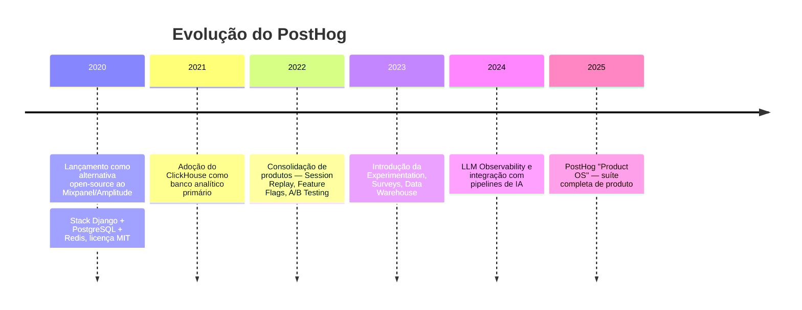

# PostHog

> **Ficha técnica de plataforma** · Pontuação na matriz: **440/600 (73,3 %)** — 6º lugar (Auto-hospedado OSS) · **425/600 (70,8 %)** — 7º lugar (Cloud EU) · 🟡 Viável
> **Situação:** ❌ **Não selecionada** — sobreposição funcional com Matomo, licenciamento MIT + EE proprietária introduz risco de lock-in em recursos avançados
> [← Voltar ao índice](../README.md) · [Matriz de decisão](../docs/07-matriz-decisao.md)

---

## Sumário

- [1. Visão geral](#1-visão-geral)
- [2. Licenciamento](#2-licenciamento)
- [3. Hospedagem](#3-hospedagem)
- [4. Funcionalidades](#4-funcionalidades)
- [5. APIs](#5-apis)
- [6. Exemplos de integração](#6-exemplos-de-integração)
- [7. Integrações](#7-integrações)
- [8. Infraestrutura](#8-infraestrutura)
- [9. Segurança](#9-segurança)
- [10. Governança](#10-governança)
- [11. Performance](#11-performance)
- [12. Custos](#12-custos)
- [13. Pontos fortes](#13-pontos-fortes)
- [14. Pontos fracos](#14-pontos-fracos)
- [15. Quando utilizar](#15-quando-utilizar)
- [16. Quando evitar](#16-quando-evitar)
- [17. Notas do avaliador](#17-notas-do-avaliador)

---

## 1. Visão geral

### 1.1 Identificação

| Campo | Valor |
|-------|-------|
| **Nome** | PostHog |
| **Fundadores** | James Hawkins e Tim Glaser |
| **Ano de lançamento** | 2020 |
| **Mantenedor** | PostHog, Inc. |
| **Sede** | San Francisco / Londres |
| **Segmento** | *Product analytics* — analytics de produto para SaaS/software |
| **Repositório** | `https://github.com/PostHog/posthog` |
| **Site oficial** | `https://posthog.com/` |

### 1.2 História



### 1.3 Comunidade

| Indicador | Situação |
|-----------|----------|
| Idade do projeto | 6 anos |
| Governança | Mantenedor comercial único (PostHog, Inc.) |
| Cadência de releases | Alta — várias releases por mês |
| Base instalada | Ampla no mercado SaaS/startup |
| Adoção institucional pública | ⚠️ Muito escassa — produto voltado a SaaS, não a portal governamental |
| Profissionais no Brasil | 🟠 Média — presença crescente em startups |
| **Nota C11 (Comunidade)** | **4/5** |

### 1.4 Modelo de negócio

**Classificação:** *open core*. O núcleo é MIT — funcional e sem restrição de uso. Recursos "enterprise" (SSO SAML, RBAC avançado, auditoria refinada) estão sob **PostHog Enterprise Edition (EE)**, com licenciamento proprietário.

| Componente | Licença |
|-----------|:-------:|
| Core (`posthog/posthog`) | MIT |
| `ee/` (Enterprise Edition) | Proprietária, uso requer licença comercial |

**Cloud comercial:** PostHog Cloud EU (Frankfurt) e PostHog Cloud US.

### 1.5 Casos de uso

| Caso de uso | Aderência |
|-------------|:---------:|
| Produto SaaS / aplicação web transacional | 🟢 Excelente |
| Portal de serviço digital com forte componente de UX/analytics | 🟢 Boa |
| Portal institucional de conteúdo | 🟠 Sobredimensionado |
| Site pequeno / blog | 🔴 Inadequado (excesso de complexidade) |
| Experimentação (A/B testing) | 🟢 Excelente |
| Analytics de conteúdo/audiência (marketing) | 🟠 Aceitável, mas não é a proposta |

---

## 2. Licenciamento

| Componente | Licença | Observação |
|-----------|:-------:|-----------|
| Core PostHog | MIT | Uso livre, incluindo comercial e fork |
| PostHog EE (recursos enterprise) | Proprietária | Requer aquisição de licença |
| Ícones e logotipos | Marcas registradas PostHog | Não redistribuir sem permissão |

> **⚠️ Bloco de Risco — MIT + EE dividida**
> A dualidade MIT + EE é o padrão do modelo *open core*. Na prática:
>
> - Recursos de **produto** (analytics, funis, session replay, feature flags básicos) são MIT.
> - Recursos de **operação empresarial** (SSO SAML, RBAC granular, políticas de retenção configuráveis) são EE.
>
> Para o Estado, os recursos EE são normalmente **obrigatórios** por norma interna (SSO corporativo, RBAC). Isso reintroduz o custo de licenciamento na modalidade auto-hospedada, contradizendo a expectativa de "open-source gratuito".

---

## 3. Hospedagem

| Modalidade | Disponibilidade | Observação |
|-----------|:--------------:|-----------|
| Auto-hospedado (Docker Compose) | 🟠 | Disponível, mas oficialmente **desencorajado** pela PostHog para produção em alta escala |
| Auto-hospedado (Kubernetes / Helm) | 🟢 | Recomendação oficial para produção; complexidade significativa |
| PostHog Cloud EU | 🟢 | Frankfurt (Alemanha) — GDPR-friendly |
| PostHog Cloud US | 🟢 | Estados Unidos |
| On-Premise em datacenter próprio | 🟢 | Mesmo stack do Cloud, gerido internamente |

> **🚨 Alerta — auto-hospedagem oficialmente desencorajada em Docker Compose**
> A própria PostHog recomenda **Kubernetes com Helm** para deployments produtivos. A modalidade Docker Compose é declarada como "para avaliação e desenvolvimento". Isso muda o custo operacional real do auto-hospedado — não basta um `docker compose up`; é preciso cluster Kubernetes, gestão de ClickHouse, Kafka e Redis.

---

## 4. Funcionalidades

| Funcionalidade | Suporte | Observação |
|---------------|:-------:|-----------|
| Dashboards padrão | 🟢 | Customização rica, múltiplos dashboards por projeto |
| Eventos customizados | 🟢 | Modelo de dados baseado em eventos, primeira classe |
| Metas (`goals`) | 🟢 | Via `insights` |
| Funil de conversão | 🟢 | Funis multi-etapa, com *breakdown* por propriedade |
| Heatmaps | 🟢 | Extensão do session replay |
| **Session recording** | 🟢 | Recurso de destaque — reprodução completa da sessão |
| User journey (paths) | 🟢 | Visualização de fluxos entre eventos |
| **A/B testing / Experimentation** | 🟢 | Recurso de destaque — testes com significância estatística |
| Form analytics | 🟠 | Via eventos customizados |
| Real time | 🟢 | Dashboards em tempo real |
| Cohort | 🟢 | Cohorts dinâmicos e estáticos |
| Retenção | 🟢 | Análise de retenção completa |
| Dimensões customizadas | 🟢 | Propriedades ilimitadas em eventos e pessoas |
| **Feature flags** | 🟢 | Recurso de destaque — flags booleanas e multivariadas |
| **Surveys** | 🟢 | Pesquisas in-app |
| Data warehouse | 🟢 | Sincronização com S3, BigQuery, Snowflake, Postgres |
| LLM Observability | 🟢 | Rastreamento de chamadas a LLMs |

> **📌 Observação — sobreposição funcional com Matomo**
> PostHog tem cobertura funcional **maior** que o Matomo em vários recursos (feature flags, experimentação, surveys, LLM observability). Isso é uma **vantagem no papel**, mas gera sobreposição desnecessária no caso governamental — recursos de *product analytics* de SaaS não são requisitos primários de portal público.

---

## 5. APIs

### 5.1 Superfície de API

| Recurso | Situação |
|---------|:--------:|
| REST API pública | 🟢 v1 estável — `https://<host>/api/` |
| Batch ingestion API | 🟢 `/batch/` |
| SDKs oficiais | JavaScript, Python, Node.js, Ruby, Go, PHP, iOS, Android, Flutter, React Native, .NET |
| Webhooks | 🟢 |
| Rate limits | Configuráveis por instância; no Cloud, 240 req/min por token |
| Autenticação | *Project API key* (client) + *Personal API key* (server) |
| Versionamento | v1 |

### 5.2 Exemplo — captura de evento

```http
POST /capture/ HTTP/1.1
Host: app.posthog.com
Content-Type: application/json

{
  "api_key": "<PROJECT_API_KEY>",
  "event": "servico_solicitado",
  "distinct_id": "cidadao-12345",
  "properties": {
    "servico": "iptu_2a_via",
    "orgao": "sefaz"
  },
  "timestamp": "2026-07-29T10:00:00Z"
}
```

### 5.3 Exportação

- Data warehouse sink nativo (S3, BigQuery, Snowflake, PostgreSQL, Redshift).
- Batch export para dumps periódicos.
- Query engine SQL sobre ClickHouse (HogQL) — permite consultas ad-hoc no dado bruto.

---

## 6. Exemplos de integração

### 6.1 Instalação (JavaScript)

```html
<script>
  !function(t,e){var o,n,p,r;e.__SV||(window.posthog=e,e._i=[],e.init=function(i,s,a){function g(t,e){var o=e.split(".");2==o.length&&(t=t[o[0]],e=o[1]),t[e]=function(){t.push([e].concat(Array.prototype.slice.call(arguments,0)))}}(p=t.createElement("script")).type="text/javascript",p.async=!0,p.src=s.api_host+"/static/array.js",(r=t.getElementsByTagName("script")[0]).parentNode.insertBefore(p,r);var u=e;for(void 0!==a?u=e[a]=[]:a="posthog",u.people=u.people||[],u.toString=function(t){var e="posthog";return"posthog"!==a&&(e+="."+a),t||(e+=" (stub)"),e},u.people.toString=function(){return u.toString(1)+".people (stub)"},o="init capture register register_once register_for_session unregister unregister_for_session getFeatureFlag getFeatureFlagPayload isFeatureEnabled reloadFeatureFlags updateEarlyAccessFeatureEnrollment getEarlyAccessFeatures on onFeatureFlags onSessionId getSurveys getActiveMatchingSurveys renderSurvey canRenderSurvey identify setPersonProperties group resetGroups setPersonPropertiesForFlags resetPersonPropertiesForFlags setGroupPropertiesForFlags resetGroupPropertiesForFlags reset get_distinct_id getGroups get_session_id get_session_replay_url alias set_config startSessionRecording stopSessionRecording sessionRecordingStarted captureException loaded".split(" "),n=0;n<o.length;n++)g(u,o[n]);e._i.push([i,s,a])},e.__SV=1)}(document,window.posthog||[]);
  posthog.init('<PROJECT_API_KEY>', {api_host: 'https://<host>'});
</script>
```

### 6.2 Python (backend)

```python
import posthog

posthog.project_api_key = os.environ["POSTHOG_KEY"]
posthog.host = "https://analytics.exemplo.gov.br"

def registrar_evento(cidadao_id: str, servico: str) -> None:
    posthog.capture(
        distinct_id=cidadao_id,
        event="servico_solicitado",
        properties={"servico": servico},
    )
```

### 6.3 Node.js (backend)

```javascript
import { PostHog } from 'posthog-node';

const posthog = new PostHog(process.env.POSTHOG_KEY, {
  host: 'https://analytics.exemplo.gov.br',
});

export function registrarEvento(cidadaoId, servico) {
  posthog.capture({
    distinctId: cidadaoId,
    event: 'servico_solicitado',
    properties: { servico },
  });
}
```

### 6.4 Consulta HogQL (SQL sobre ClickHouse)

```sql
SELECT
  properties.servico AS servico,
  count() AS total,
  uniq(distinct_id) AS cidadaos
FROM events
WHERE event = 'servico_solicitado'
  AND timestamp >= now() - INTERVAL 30 DAY
GROUP BY servico
ORDER BY total DESC
```

### 6.5 Power BI

- Conector via Web (JSON) apontando para `/api/projects/<id>/insights/`.
- Alternativa: sink para PostgreSQL/BigQuery + conector nativo do Power BI.

### 6.6 Grafana

- Datasource ClickHouse (plugin oficial) apontando diretamente para o ClickHouse do PostHog.
- HogQL como linguagem de consulta.

### 6.7 Metabase / Superset

Suportam ClickHouse nativamente — conexão direta ao banco do PostHog é o padrão recomendado para BI corporativo.

### 6.8 Looker Studio

Via BigQuery sink (recomendado) ou via conector Web para a API.

---

## 7. Integrações

| Integração | Status |
|-----------|:------:|
| Google Tag Manager | 🟢 Template oficial disponível |
| Matomo Tag Manager | 🟠 Via HTML customizado |
| Segment | 🟢 Fonte e destino nativos |
| RudderStack | 🟢 |
| Consent Manager | 🟢 API para *opt-in/opt-out*: `posthog.opt_in_capturing()` / `opt_out_capturing()` |
| IdP corporativo (SAML) | 🟠 **Apenas na EE** — não disponível na modalidade OSS |
| OAuth 2.0 / OIDC | 🟠 **Apenas na EE** |
| Slack / MS Teams | 🟢 Notificações de eventos |
| Zapier | 🟢 |

> **⚠️ Bloco de Risco — SSO corporativo requer EE**
> Norma padrão de segurança da SETDIG exige SSO federado com o IdP corporativo. Isso implica adquirir a licença PostHog EE, o que muda o custo total do "auto-hospedado gratuito".

---

## 8. Infraestrutura

### 8.1 Stack de dependências

| Componente | Papel | Complexidade operacional |
|-----------|-------|-------------------------|
| **ClickHouse** | Banco analítico principal (eventos) | 🔴 Alta — requer expertise |
| **PostgreSQL** | Banco relacional (usuários, dashboards, configs) | 🟢 Baixa |
| **Redis** | Cache e filas | 🟢 Baixa |
| **Kafka** | Ingestão de eventos em alta escala | 🔴 Alta |
| **MinIO / S3** | Armazenamento de session replay | 🟠 Média |
| **Zookeeper** | Coordenação Kafka + ClickHouse | 🟠 Média |

### 8.2 Modelo de implantação

- **Docker Compose:** viável para POC — não recomendado para produção pelo próprio fornecedor.
- **Kubernetes + Helm chart oficial:** recomendação para produção. Complexidade equivalente a operar um pequeno cluster de dados.

### 8.3 Backup e DR

- Backup do PostgreSQL: padrão.
- Backup do ClickHouse: exige estratégia dedicada — snapshot de disco + `BACKUP TO` (recurso ClickHouse) ou export via `clickhouse-backup`.
- DR: exige replicação cross-região do ClickHouse — complexidade alta.

---

## 9. Segurança

| Item | Situação (OSS) | Situação (EE / Cloud) |
|------|:--------------:|:---------------------:|
| Criptografia em trânsito | 🟢 TLS | 🟢 TLS |
| Criptografia em repouso | 🟠 Dependente do storage | 🟢 Gerenciada |
| **Conformidade LGPD** | 🟢 Sob custódia própria | 🟠 Cloud EU: adequação GDPR estendida |
| GDPR | 🟢 | 🟢 |
| ISO 27001 | ❌ (aplica-se ao Cloud) | 🟢 |
| SOC 2 Type II | ❌ (aplica-se ao Cloud) | 🟢 |
| RBAC granular | ❌ | 🟢 (EE) |
| SSO SAML | ❌ | 🟢 (EE) |
| Auditoria completa | 🟠 Básica | 🟢 (EE) |
| Anonimização | 🟢 API para *reset*, *opt-out*, apagamento de pessoa |

---

## 10. Governança

| Dimensão | Avaliação (OSS auto-hospedado) |
|----------|-------------------------------|
| Vendor lock-in | 🟠 Baixo no core (MIT), médio-alto se dependente de recursos EE |
| Controle dos dados | 🟢 Alto (auto-hospedado) — dado bruto em ClickHouse próprio |
| Portabilidade | 🟠 Média — modelo de dados de eventos é padrão do mercado, mas a migração de dashboards é custosa |
| Transparência | 🟢 Alta (core aberto) |
| Auditoria | 🟢 (código); 🟠 (trilha operacional) |
| Soberania | 🟢 Alta se auto-hospedado no Estado |

**Nota C02 (Controle dos dados):** 4/5 (OSS) / 3/5 (Cloud EU).
**Nota C04 (Independência tecnológica):** 3/5 — MIT no core, EE separada.

---

## 11. Performance

### 11.1 Impacto no site

| Métrica | Valor típico |
|---------|:-----------:|
| Tamanho do script `posthog.js` | ~55 KB (gzip) |
| Impacto médio em LCP | +50 ms a +200 ms (dependente de session replay) |
| Impacto médio em CLS | Nulo |

Session replay ativo aumenta significativamente o tráfego do beacon e o consumo de armazenamento no servidor.

### 11.2 Escala do serviço

ClickHouse é o padrão do mercado para analytics de alta escala. Instalações PostHog produtivas comprovadamente processam bilhões de eventos/mês (referência: casos do próprio fornecedor).

**Gargalo operacional para o Estado:** não é escala — é a **complexidade** de operar ClickHouse + Kafka + PostgreSQL simultaneamente.

---

## 12. Custos

### 12.1 Modelo tarifário (PostHog Cloud, referência 2026)

| Recurso | Cota gratuita | Preço marginal |
|---------|:-------------:|:--------------:|
| Product analytics | 1 M eventos/mês | US$ 0,00031/evento |
| Session replay | 5 k sessões/mês | US$ 0,005/sessão |
| Feature flags | 1 M requests/mês | US$ 0,0001/request |
| Surveys | 250 respostas/mês | US$ 0,20/resposta |
| Data warehouse | 1 M linhas/mês | US$ 0,000015/linha |
| LLM observability | 5 k eventos/mês | US$ 0,00005/evento |

### 12.2 TCO em 5 anos (auto-hospedado OSS + EE mínima)

| Rubrica | Ano 1 | Ano 2 | Ano 3 | Ano 4 | Ano 5 | Total |
|---------|:-----:|:-----:|:-----:|:-----:|:-----:|:-----:|
| Licenciamento EE (SSO + RBAC) | R$ 60.000 | R$ 60.000 | R$ 60.000 | R$ 60.000 | R$ 60.000 | **R$ 300.000** |
| Infraestrutura (K8s + ClickHouse + Kafka) | R$ 90.000 | R$ 90.000 | R$ 95.000 | R$ 100.000 | R$ 105.000 | **R$ 480.000** |
| Equipe (implantação + operação) | R$ 180.000 | R$ 120.000 | R$ 120.000 | R$ 120.000 | R$ 120.000 | **R$ 660.000** |
| Adequação LGPD | R$ 20.000 | R$ 5.000 | R$ 5.000 | R$ 5.000 | R$ 5.000 | **R$ 40.000** |
| **Total** | **R$ 350.000** | **R$ 275.000** | **R$ 280.000** | **R$ 285.000** | **R$ 290.000** | **R$ 1.480.000** |

Comparação completa: [`comparativos/custo.md`](../comparativos/custo.md).

> **📌 Observação**
> Valor comparável ao TCO enterprise do Matomo, mas com **cobertura funcional que excede** as necessidades governamentais. O ganho marginal (feature flags, experimentation, LLM obs) não se converte em valor operacional para portais públicos.

---

## 13. Pontos fortes

- Suíte funcional mais ampla do mercado open-source — cobre analytics + session replay + feature flags + experimentation + surveys.
- Modelo de dados baseado em eventos, primeira classe — flexibilidade máxima para análise.
- ClickHouse como banco — desempenho analítico superior aos concorrentes.
- HogQL (SQL sobre ClickHouse) — analistas podem consultar direto os dados brutos.
- SDKs em todas as principais linguagens e frameworks.
- Data warehouse sink nativo (S3, BigQuery, Snowflake, PostgreSQL).
- Cadência de releases alta e comunidade ativa.

## 14. Pontos fracos

- Complexidade operacional do stack ClickHouse + Kafka + PostgreSQL + Redis + MinIO.
- Docker Compose desencorajado — requer Kubernetes para produção.
- Recursos empresariais críticos (SSO SAML, RBAC granular) sob licença EE separada.
- Curva de aprendizado significativa — produto pensado para times de produto de SaaS.
- Modelo de negócio focado em SaaS/startup — adoção institucional pública ainda muito escassa.
- Session replay eleva substancialmente o custo de armazenamento e o impacto de rede no navegador.

## 15. Quando utilizar

- **Serviços digitais** transacionais complexos com forte necessidade de *product analytics* (não *audience analytics*).
- Ecossistema de aplicações internas onde o Estado desenvolve produto (não apenas portal).
- Experimentação (A/B testing) formal com significância estatística.
- Feature flags corporativos para *release management*.
- Análise de LLMs em fluxos com IA generativa.

## 16. Quando evitar

- Portais institucionais primariamente de conteúdo.
- Casos em que Matomo (com plugins) já cobre o requisito.
- Órgãos sem equipe de plataforma dedicada — a operação exige competência em ClickHouse e Kafka.
- Cenários em que a expectativa é "open-source gratuito" — o SSO corporativo puxa a EE, que é paga.

---

## 17. Notas do avaliador

PostHog é tecnicamente excelente para o problema que se propõe a resolver — *product analytics* de SaaS moderno. **Não** é o problema central da SETDIG. A pontuação de 440/600 (OSS) é a mais alta entre plataformas que **não foram selecionadas**, e reflete o fato de que a plataforma **compete tecnicamente** com o Matomo em cobertura funcional.

A decisão de **não recomendar** o PostHog está apoiada em três razões objetivas:

1. **Sobreposição funcional com Matomo** — os recursos que o PostHog adiciona (feature flags, experimentation) não são requisitos primários dos portais estaduais.
2. **Complexidade operacional** — Kubernetes + ClickHouse + Kafka é um custo real de plataforma, sem contrapartida em valor entregue para o caso governamental típico.
3. **Licenciamento EE necessário** — os recursos obrigatórios de segurança corporativa (SSO SAML, RBAC granular) exigem EE, que reintroduz custo de licenciamento.

Como **candidato futuro**, PostHog ficaria natural em um segundo estudo específico para plataformas de *product analytics* voltadas a **serviços digitais transacionais complexos** (por exemplo, superapp cidadão).

Análise cruzada: [`docs/06-tradeoffs.md`](../docs/06-tradeoffs.md) e [`comparativos/api.md`](../comparativos/api.md).
