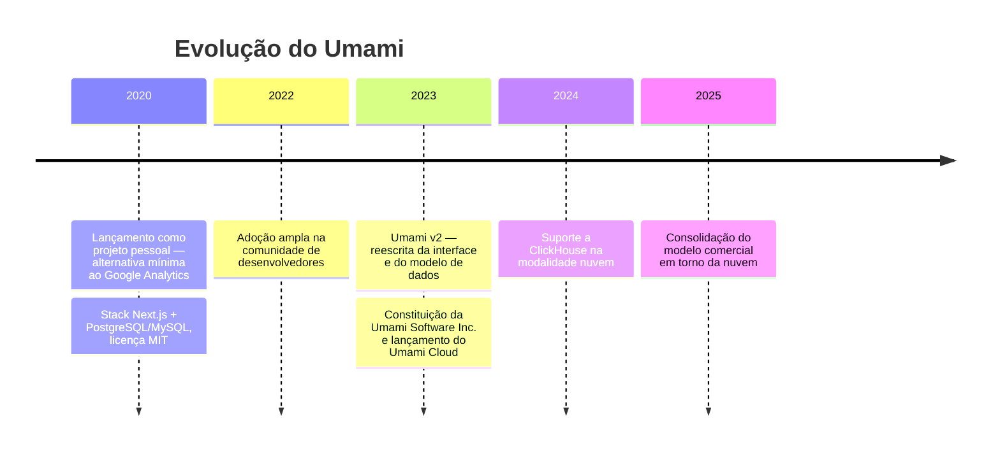

# Umami

> **Ficha técnica de plataforma** · Pontuação na matriz: **445/600 (74,2 %)** — 5º lugar · 🟡 Viável
> **Situação:** ❌ **Não selecionada** — falha no requisito *Must have* RF-27 (funil de conversão)
> [← Voltar ao índice](../README.md) · [Matriz de decisão](../docs/07-matriz-decisao.md)

---

## Sumário

- [1. Visão geral](#1-visão-geral)
- [2. Licenciamento](#2-licenciamento)
- [3. Hospedagem](#3-hospedagem)
- [4. Funcionalidades](#4-funcionalidades)
- [5. APIs](#5-apis)
- [6. Exemplos de integração](#6-exemplos-de-integração)
- [7. Integrações](#7-integrações)
- [8. Infraestrutura](#8-infraestrutura)
- [9. Segurança](#9-segurança)
- [10. Governança](#10-governança)
- [11. Performance](#11-performance)
- [12. Custos](#12-custos)
- [13. Pontos fortes](#13-pontos-fortes)
- [14. Pontos fracos](#14-pontos-fracos)
- [15. Quando utilizar](#15-quando-utilizar)
- [16. Quando evitar](#16-quando-evitar)
- [17. Notas do avaliador](#17-notas-do-avaliador)

---

## 1. Visão geral

### 1.1 Identificação

| Campo | Valor |
|-------|-------|
| **Nome** | Umami |
| **Criador** | Mike Cao |
| **Ano de lançamento** | 2020 |
| **Mantenedor** | Umami Software, Inc. |
| **Sede** | Estados Unidos |
| **Segmento** | Privacy-first analytics |
| **Repositório** | `https://github.com/umami-software/umami` |
| **Site oficial** | `https://umami.is/` |

### 1.2 História



### 1.3 Comunidade

| Indicador | Situação |
|-----------|----------|
| Idade do projeto | 5+ anos |
| Governança | Mantenedor comercial único |
| Cadência de releases | Regular |
| Base instalada | Ampla entre desenvolvedores individuais e projetos pequenos |
| Adoção institucional pública | ❌ Sem casos documentados relevantes |
| Profissionais no Brasil | 🔴 Escassa |
| **Nota C11 (Comunidade)** | **3/5** |

### 1.4 Modelo de negócio

**Classificação:** *open core* com licença MIT. O produto auto-hospedado é integralmente funcional; a receita vem do Umami Cloud.

> **⚠️ Bloco de Risco — MIT e o risco de fechamento**
> Diferentemente da GPL (Matomo) e da AGPL (Plausible), a licença **MIT é permissiva** — não obriga que versões derivadas permaneçam livres. O mantenedor pode, legalmente, tornar versões futuras proprietárias.
>
> **O que a MIT garante:** direito perpétuo e irrevogável sobre a versão já obtida, incluindo o direito de fork.
> **O que a MIT não garante:** que a evolução futura permaneça livre.
>
> Este é o fundamento da nota **4** (e não 5) em C04 — Independência tecnológica.

### 1.5 Casos de uso

| Caso de uso | Aderência |
|-------------|:---------:|
| Site pessoal, blog, documentação | 🟢 Excelente |
| Painel interno de uso de aplicação | 🟢 Excelente |
| Portal institucional simples | 🟢 Boa |
| Hotsite de campanha | 🟢 Boa |
| Portal com análise de conversão | 🟠 Limitada |
| Serviço digital transacional | 🔴 Inadequada |
| Análise comportamental | 🔴 Inadequada |

---

## 2. Licenciamento

| Campo | Valor |
|-------|-------|
| **Tipo** | 🟢 Open Source |
| **Licença** | **MIT** |
| **Texto** | `https://opensource.org/license/mit` |
| **Copyleft** | ❌ Permissiva |
| **Uso comercial / modificação / redistribuição** | ✅ Sem restrição |
| **Obrigação de manter derivadas livres** | ❌ Não |
| **Direito perpétuo sobre a versão obtida** | ✅ Sim |
| **Custo — auto-hospedado** | **R$ 0** |
| **Custo — Umami Cloud** | Tier gratuito com limite de eventos; planos pagos por volume |

---

## 3. Hospedagem

| Modalidade | Suporte |
|-----------|:-------:|
| Auto-hospedado | ✅ Nativo |
| Docker | ✅ Imagem oficial |
| Docker Compose | ✅ Documentado |
| Kubernetes | ⚠️ Comunidade |
| Plataformas serverless (Vercel, Netlify, Railway) | ✅ Documentado |
| SaaS (Umami Cloud) | ✅ |
| On-premises com suporte | ❌ |

### 3.1 Requisitos

| Componente | Requisito |
|-----------|-----------|
| Runtime | Node.js 18+ (abstraído pelo container) |
| Banco de dados | PostgreSQL 12+ **ou** MySQL 8+ (escolher um) |
| Memória | ≥ 2 GB (aplicação) |
| Componentes mínimos | **2** — o menor do conjunto avaliado |

### 3.2 Implantação

```yaml
# docker-compose.yml — Umami auto-hospedado
services:
  db:
    image: postgres:16-alpine
    environment:
      POSTGRES_DB: umami
      POSTGRES_USER: umami
      POSTGRES_PASSWORD_FILE: /run/secrets/db_password
    volumes:
      - pg_data:/var/lib/postgresql/data
    secrets: [db_password]
    healthcheck:
      test: ["CMD-SHELL", "pg_isready -U umami"]
      interval: 10s
    restart: unless-stopped

  umami:
    image: ghcr.io/umami-software/umami:postgresql-latest
    depends_on:
      db: { condition: service_healthy }
    environment:
      DATABASE_URL: postgresql://umami:${DB_PASSWORD}@db:5432/umami
      DATABASE_TYPE: postgresql
      APP_SECRET: ${APP_SECRET}
      DISABLE_TELEMETRY: "1"        # desativa telemetria para o fornecedor
      TRACKER_SCRIPT_NAME: "estatisticas"   # evita bloqueio por ad blockers
    ports:
      - "127.0.0.1:3000:3000"
    restart: unless-stopped

volumes:
  pg_data:

secrets:
  db_password:
    file: ./secrets/db_password.txt
```

> **📌 Observação — `DISABLE_TELEMETRY`**
> Por padrão, o Umami envia telemetria anônima de uso ao mantenedor. Em instalação de órgão público, essa variável **deve ser definida como `1`**, eliminando qualquer comunicação de saída não essencial. Isso é verificável por inspeção do tráfego de rede.

---

## 4. Funcionalidades

| Funcionalidade | Suporte | Detalhe |
|---------------|:-------:|---------|
| **Dashboards** | ⚠️ Fixo | Painel único por site, não configurável |
| **Eventos customizados** | ✅ | Eventos nomeados com propriedades (`data-umami-event`) |
| **Goals (metas)** | ⚠️ | Não há objeto "meta"; aproximável por evento |
| **Conversion Funnel** | ❌ | **Não disponível** — falha no requisito *Must have* RF-27 |
| **Heatmaps** | ❌ | |
| **Session Recording** | ❌ | |
| **User Journey** | ❌ | |
| **A/B Testing** | ❌ | |
| **Form Analytics** | ❌ | |
| **Real Time** | ✅ | Visitantes ativos |
| **Cohort** | ❌ | |
| **Retention** | ❌ | |
| **Custom Dimensions** | ⚠️ | Propriedades de evento e de sessão |
| **Segmentação** | ⚠️ | Filtros no painel |
| **Comparação de períodos** | ✅ | |
| **Campanhas / UTM** | ✅ | |
| **Geolocalização** | ✅ | País, região, cidade |
| **Tecnologia** | ✅ | |
| **Relatórios (v2)** | ⚠️ | Relatórios de insights, jornada simplificada, retenção — em evolução |
| **Painel público** | ✅ | Compartilhamento por URL |
| **Multi-site** | ✅ | Ilimitado |
| **Times / equipes** | ✅ | Agrupamento de usuários |
| **Amostragem** | ❌ | Dado sempre completo |

### 4.1 Cobertura dos requisitos funcionais

| Prioridade | Atendidos | Cobertura |
|-----------|:---------:|----------:|
| *Must have* | 10 / 17 | 59 % |
| *Should have* | 7 / 18 | 39 % |
| *Could have* | 2 / 12 | 17 % |
| **Ponderada** | **46 / 99** | **46 %** |

**Nota C05 (Recursos analíticos): 2/5** — faixa 35–54 %.

> **🚨 Alerta — Motivo objetivo do descarte**
> O Umami **não oferece funil de conversão** (RF-27), requisito classificado como *Must have* e diretamente vinculado ao requisito de negócio **RN-02** (identificação de gargalos em jornadas de serviço digital).
>
> Trata-se de falha em requisito obrigatório, e não de inferioridade relativa. Nenhuma ponderação de critérios corrige isso — o descarte é determinado pela triagem, não pela matriz.

---

## 5. APIs

| API | Tipo | Finalidade |
|-----|------|-----------|
| **REST API** | REST | Leitura de métricas e administração |
| **Send API** | HTTP POST | Ingestão de eventos |
| **GraphQL** | ❌ | |
| **Webhooks** | ❌ | |
| **Acesso SQL** | ✅ | Direto no PostgreSQL/MySQL |

### 5.1 REST API

| Característica | Valor |
|---------------|-------|
| **Base** | `https://<host>/api` |
| **Autenticação** | `Authorization: Bearer <token>` (obtido em `POST /api/auth/login`) ou API key |
| **Formato** | JSON |
| **Versionamento** | ⚠️ Implícito |
| **Rate limits** | ✅ No Cloud; sem limite no auto-hospedado |

#### Endpoints principais

| Endpoint | Retorno |
|----------|---------|
| `GET /api/websites` | Lista de propriedades |
| `GET /api/websites/{id}/stats` | Métricas agregadas |
| `GET /api/websites/{id}/pageviews` | Série temporal de page views |
| `GET /api/websites/{id}/metrics?type=url` | Detalhamento por dimensão |
| `GET /api/websites/{id}/events` | Eventos customizados |
| `GET /api/websites/{id}/active` | Visitantes ativos |
| `POST /api/send` | Ingestão de evento |

### 5.2 Schema do banco

| Tabela | Conteúdo |
|--------|----------|
| `website` | Propriedades cadastradas |
| `session` | Sessões (identificador derivado por hash) |
| `website_event` | Eventos e page views |
| `event_data` | Propriedades de evento |
| `session_data` | Propriedades de sessão |
| `user`, `team`, `team_user` | Usuários e equipes |

> **✅ Bloco de Decisão — O schema mais simples do estudo**
> O modelo de dados do Umami tem **6 tabelas principais**, contra dezenas no Matomo. Isso torna a construção de ETL e a auditoria do que é efetivamente armazenado triviais — um analista lê o schema completo em minutos.
>
> É a razão da nota **4** em C10 (Operação) e da avaliação "muito alta" em facilidade de auditoria.

**Nota C06 (APIs): 3/5**

---

## 6. Exemplos de integração

### 6.1 Python

```python
"""Cliente da API do Umami."""
import os
import requests


class UmamiClient:
    def __init__(self, base_url: str, api_key: str) -> None:
        self.base = base_url.rstrip("/")
        self.s = requests.Session()
        self.s.headers["x-umami-api-key"] = api_key

    def websites(self) -> list[dict]:
        r = self.s.get(f"{self.base}/api/websites", timeout=30)
        r.raise_for_status()
        return r.json().get("data", [])

    def stats(self, website_id: str, start_at: int, end_at: int) -> dict:
        """start_at/end_at em milissegundos desde a época Unix."""
        r = self.s.get(
            f"{self.base}/api/websites/{website_id}/stats",
            params={"startAt": start_at, "endAt": end_at},
            timeout=30,
        )
        r.raise_for_status()
        return r.json()

    def metrics(self, website_id: str, start_at: int, end_at: int,
                type_: str = "url", limit: int = 100) -> list[dict]:
        r = self.s.get(
            f"{self.base}/api/websites/{website_id}/metrics",
            params={"startAt": start_at, "endAt": end_at,
                    "type": type_, "limit": limit},
            timeout=30,
        )
        r.raise_for_status()
        return r.json()


if __name__ == "__main__":
    import time
    cli = UmamiClient(os.environ["UMAMI_URL"], os.environ["UMAMI_KEY"])

    fim = int(time.time() * 1000)
    inicio = fim - 30 * 24 * 3600 * 1000

    for site in cli.websites():
        s = cli.stats(site["id"], inicio, fim)
        print(f"{site['name']}: {s['pageviews']['value']:,} pageviews, "
              f"{s['visitors']['value']:,} visitantes")
```

### 6.2 Node.js

```javascript
/** Cliente da API do Umami — Node.js 18+ */
class UmamiClient {
  constructor(baseUrl, apiKey) {
    this.base = baseUrl.replace(/\/$/, '');
    this.headers = { 'x-umami-api-key': apiKey };
  }

  async #get(path, params = {}) {
    const url = new URL(`${this.base}${path}`);
    Object.entries(params).forEach(([k, v]) => url.searchParams.set(k, String(v)));
    const res = await fetch(url, { headers: this.headers });
    if (!res.ok) throw new Error(`Umami ${res.status}`);
    return res.json();
  }

  websites() { return this.#get('/api/websites'); }

  stats(websiteId, startAt, endAt) {
    return this.#get(`/api/websites/${websiteId}/stats`, { startAt, endAt });
  }
}
```

#### Envio server-side

```javascript
async function enviarEventoUmami({ websiteId, url, nome, dados = {} }) {
  await fetch(`${process.env.UMAMI_URL}/api/send`, {
    method: 'POST',
    headers: {
      'Content-Type': 'application/json',
      'User-Agent': 'servidor-ms-gov/1.0',   // obrigatório
    },
    body: JSON.stringify({
      type: 'event',
      payload: { website: websiteId, url, name: nome, data: dados },
    }),
  });
}
```

### 6.3 Power BI

```
Obter Dados → Banco de Dados PostgreSQL
Servidor: umami-db.interno.ms.gov.br:5432
Banco: umami
Modo: Importação
```

```sql
-- View estável para BI
CREATE OR REPLACE VIEW vw_bi_umami_diario AS
SELECT
    DATE(we.created_at)                              AS data,
    w.name                                           AS portal,
    w.domain                                         AS dominio,
    COUNT(*) FILTER (WHERE we.event_type = 1)        AS pageviews,
    COUNT(*) FILTER (WHERE we.event_type = 2)        AS eventos,
    COUNT(DISTINCT we.session_id)                    AS sessoes,
    COUNT(DISTINCT s.id)                             AS visitantes
FROM website_event we
JOIN website w ON w.website_id = we.website_id
LEFT JOIN session s ON s.session_id = we.session_id
WHERE we.created_at >= CURRENT_DATE - INTERVAL '24 months'
GROUP BY 1, 2, 3;
```

### 6.4 Grafana

```
Connections → Add data source → PostgreSQL
Host: umami-db.interno.ms.gov.br:5432 · Database: umami
```

```sql
-- Painel: pageviews por hora
SELECT
    date_trunc('hour', we.created_at)  AS time,
    w.name                             AS metric,
    COUNT(*)                           AS value
FROM website_event we
JOIN website w ON w.website_id = we.website_id
WHERE $__timeFilter(we.created_at) AND we.event_type = 1
GROUP BY 1, 2
ORDER BY 1;
```

### 6.5 Metabase

```
Admin → Databases → Add → PostgreSQL
Host: umami-db.interno.ms.gov.br · Database: umami
Usuário: metabase_ro (GRANT SELECT nas views)
```

### 6.6 Apache Superset

```python
# String de conexão (cadastrar pela interface)
# postgresql+psycopg2://superset_ro:<senha>@umami-db.interno.ms.gov.br:5432/umami
```

### 6.7 Qlik Sense

```qlik
LIB CONNECT TO 'UmamiPostgres';

Metricas:
LOAD Data, Portal, Pageviews, Visitantes;
SQL SELECT data, portal, pageviews, visitantes FROM vw_bi_umami_diario;
```

### 6.8 Google Looker Studio

| Caminho | Avaliação |
|---------|-----------|
| Conector PostgreSQL nativo do Looker Studio | ⚠️ Exige expor o banco à internet — **não recomendado** |
| Painel público nativo do Umami | ✅ Preferencial para publicação |
| Google Sheets como intermediário | 🔧 Alternativa |

> **🚨 Alerta**
> O conector PostgreSQL do Looker Studio requer que o banco seja acessível pela internet a partir dos endereços do Google. Para um banco de analytics de órgão público, **isso é inaceitável do ponto de vista de segurança**. Usar o painel público nativo ou um ETL intermediário.

---

## 7. Integrações

| Integração | Suporte |
|-----------|:-------:|
| Google Tag Manager | ✅ Tag customizada |
| Matomo Tag Manager | ✅ Tag customizada |
| Consent Manager | ➖ Dispensável |
| Identity Provider / SSO | ❌ |
| OAuth 2.0 / OIDC / SAML | ❌ |
| MFA | ❌ |
| WordPress | ✅ Plugin da comunidade |
| Next.js, Astro, Docusaurus, Hugo | ✅ Documentado |
| Webhooks | ❌ |

**Nota C07 (Integrações): 2/5** — integração exige desenvolvimento; sem SSO, sem Tag Manager, sem conectores prontos. O acesso SQL direto é a única via prática.

---

## 8. Infraestrutura

| Aspecto | Detalhe |
|---------|---------|
| **Banco utilizado** | PostgreSQL 12+ ou MySQL 8+ (ClickHouse apenas na nuvem) |
| **Tipo** | Relacional orientado a linha |
| **Componentes mínimos** | **2** — o menor do estudo |
| **Fila / streaming** | ❌ |
| **Cache** | ⚠️ Básico (Redis opcional) |
| **Escalabilidade horizontal** | ✅ Aplicação stateless |
| **Alta disponibilidade** | ⚠️ Parcial — depende do banco |
| **Backup** | ✅ Padrão do SGBD, simples |
| **Disaster Recovery** | 🔧 Construir |

---

## 9. Segurança

| Aspecto | Situação |
|---------|----------|
| **LGPD** | ✅ Excelente — sem cookies, IP não armazenado em claro |
| **GDPR** | ✅ Conformidade por design |
| **ISO 27001 / SOC 2** | ➖ Não aplicável ao auto-hospedado |
| **Controle de acesso** | ⚠️ Básico — administrador, usuário, times |
| **MFA** | ❌ **Não disponível** |
| **Auditoria** | ❌ Sem log de auditoria |
| **Logs** | ⚠️ Apenas log de aplicação |
| **Criptografia em trânsito** | ✅ TLS no proxy |
| **Criptografia em repouso** | 🔧 Nível de infraestrutura |
| **Retenção de dados** | ✅ Controle total (via SQL ou configuração) |
| **Superfície de ataque** | 🟢 Muito reduzida |
| **Nota C09 (Segurança)** | **3/5** |

### 9.1 O que o Umami coleta

| Dado | Coletado? |
|------|:---------:|
| Endereço IP | ⚠️ Processado, transformado em hash; não armazenado em claro |
| Cookies | ❌ Nenhum |
| Identificador persistente | ❌ Nenhum |
| URL, referenciador, título | ✅ |
| País, região, cidade | ✅ |
| Navegador, SO, dispositivo, resolução | ✅ |
| Propriedades de evento | ✅ |

> **⚠️ Bloco de Risco — Ausência de MFA**
> O Umami não oferece autenticação multifator, falhando no requisito *Must have* **RNF-31**. Para uso institucional, isso exige compensação por infraestrutura:
>
> 1. Colocar a aplicação atrás de proxy autenticador (`oauth2-proxy`) integrado ao IdP do Estado; **ou**
> 2. Restringir o acesso administrativo exclusivamente à rede interna ou VPN com MFA.
>
> Ambas as soluções funcionam, mas adicionam componentes e não integram com o modelo de permissões interno. É uma limitação real para uso multi-órgão.

---

## 10. Governança

| Aspecto | Avaliação |
|---------|:---------:|
| **Vendor lock-in** | 🟢 Muito baixo |
| **Controle dos dados** | 🟢 Total |
| **Portabilidade** | 🟢 Total — schema simples, SQL direto |
| **Transparência** | 🟢 Código aberto e legível |
| **Auditoria** | 🟢 **Muito alta** — base de código pequena |
| **Soberania** | 🟢 Total |
| **Continuidade sem o fornecedor** | 🟢 Indefinida (MIT) |
| **Risco de relicenciamento futuro** | 🟡 Médio (MIT permite) |
| **Custo de saída** | 🟢 ~R$ 20 k |
| **Nota C02 (Controle)** | **5/5** |
| **Nota C04 (Independência)** | **4/5** |

---

## 11. Performance

| Métrica | Valor |
|---------|-------|
| **Volume suportado** | ~100 M eventos/mês com PostgreSQL bem dimensionado |
| **Escalabilidade horizontal (aplicação)** | ✅ |
| **Escalabilidade horizontal (banco)** | ⚠️ Réplicas de leitura |
| **Escalabilidade vertical** | ✅ |
| **Ingestão com fila** | ❌ |
| **Latência do endpoint** | 🟢 < 50 ms |
| **Latência de relatório** | 🟡 Boa até volumes médios; degrada acima |
| **Tamanho do script (gzip)** | 🟢 ~2 KB |
| **Impacto no LCP** | 🟢 Mínimo |
| **Amostragem** | ❌ Nenhuma |
| **Nota C08 (Escalabilidade)** | **3/5** |

---

## 12. Custos

| Componente | 5 anos |
|-----------|-------:|
| Licenciamento | R$ 0 |
| Infraestrutura (2 componentes) | R$ 120.000 |
| Implantação | R$ 30.000 |
| Equipe / operação (0,1 FTE) | R$ 100.000 |
| Atualizações | R$ 30.000 |
| Manutenção | R$ 20.000 |
| Custo estimado de saída | R$ 20.000 |
| **TCO 5 anos** | **≈ R$ 320.000** |
| **Nota C03 (TCO)** | **5/5** |

> **📌 Observação**
> **O Umami tem o menor TCO entre todas as opções soberanas do estudo** — R$ 320 k contra R$ 450 k (Plausible) e R$ 759 k (Matomo On-Premise). Essa vantagem econômica é real e substancial.
>
> Ela não é suficiente porque a plataforma falha em requisito obrigatório. Economicidade não compensa não atendimento de requisito *Must have* — é exatamente por isso que a triagem eliminatória precede a matriz.

---

## 13. Pontos fortes

| # | Ponto forte |
|---|------------|
| 1 | **Menor TCO entre as opções soberanas** |
| 2 | **Operação mais simples do conjunto auto-hospedado** — apenas 2 componentes |
| 3 | **Licença MIT** — máxima permissividade de uso |
| 4 | **Script de ~2 KB** |
| 5 | **Conformidade por design** — sem cookies, IP com hash |
| 6 | **Schema de banco muito simples** — auditoria e ETL triviais |
| 7 | **Implantação em minutos** |
| 8 | **Flexibilidade de banco** — PostgreSQL ou MySQL |
| 9 | **Multi-site ilimitado e agrupamento por times** |
| 10 | **Painel público** para transparência |

---

## 14. Pontos fracos

| # | Ponto fraco | Mitigável? |
|---|------------|:----------:|
| 1 | **Sem funil de conversão (RF-27, *Must have*)** | ❌ **Não** |
| 2 | **Sem MFA (RNF-31, *Must have*)** | ⚠️ Proxy autenticador ou VPN |
| 3 | **Sem SSO** | ⚠️ Proxy autenticador |
| 4 | **Sem log de auditoria** | ❌ Não |
| 5 | **Sem heatmap, replay, coorte, retenção, jornada** | ❌ Não |
| 6 | **Sem Tag Manager** | ⚠️ GTM ou Matomo Tag Manager |
| 7 | **Metas não são objeto de primeira classe** | ⚠️ Aproximação por evento |
| 8 | **Sem conectores de BI** | ⚠️ SQL direto |
| 9 | **Banco relacional limita escala analítica** | ⚠️ ClickHouse apenas na nuvem |
| 10 | **Detecção de bots menos robusta** | ⚠️ Filtros no WAF |
| 11 | **Documentação enxuta em tópicos avançados** | ⚠️ Código legível compensa |
| 12 | **Risco de relicenciamento (MIT)** | ⚠️ Direito perpétuo sobre a versão obtida |
| 13 | **Telemetria ativa por padrão** | ✅ `DISABLE_TELEMETRY=1` |

---

## 15. Quando utilizar

> **✅ Use o Umami quando:**
>
> - A necessidade for **estritamente métrica básica** — visitantes, páginas, origem, dispositivo;
> - O **custo operacional** for a restrição dominante;
> - A equipe for pequena e a simplicidade tiver alto valor;
> - Houver muitos **sites pequenos** a instrumentar com baixo esforço;
> - For necessário **painel interno** de uso de aplicação;
> - A **auditoria do que é coletado** precisar ser trivial de demonstrar;
> - Como plataforma para **hotsites e sites temporários** de campanha.

---

## 16. Quando evitar

> **🚨 Evite o Umami quando:**
>
> - **Funil de conversão** for requisito — não existe;
> - **MFA ou SSO** forem exigência de segurança sem componente adicional;
> - **Log de auditoria administrativo** for exigência de conformidade;
> - For necessária qualquer **análise comportamental**;
> - **Coortes, retenção ou jornada** forem requisitos;
> - For necessária **integração pronta com BI**;
> - O volume superar ~100 M eventos/mês no auto-hospedado;
> - Como **plataforma padrão de um Estado** que precisa analisar serviços digitais.

---

## 17. Notas do avaliador

| Critério | Peso | Nota | Pontos |
|----------|-----:|:----:|-------:|
| C01 — LGPD | 15 | **5** | 75 |
| C02 — Controle dos dados | 15 | **5** | 75 |
| C03 — TCO | 15 | **5** | 75 |
| C04 — Independência tecnológica | 10 | 4 | 40 |
| C05 — Recursos analíticos | 10 | **2** | 20 |
| C06 — APIs | 10 | 3 | 30 |
| C07 — Integrações | 10 | **2** | 20 |
| C08 — Escalabilidade | 10 | 3 | 30 |
| C09 — Segurança | 10 | 3 | 30 |
| C10 — Operação | 5 | 4 | 20 |
| C11 — Comunidade | 5 | 3 | 15 |
| C12 — Documentação | 5 | 3 | 15 |
| **Total** | **120** | | **445 / 600 (74,2 %)** |

> **📌 Observação final — O único com três notas 5**
> O Umami é a **única plataforma do estudo com nota 5 simultânea em LGPD, Controle dos dados e TCO**. Nos três critérios de maior peso, é imbatível.
>
> Perde por cobertura funcional: nota 2 em C05 e 2 em C07. Em termos práticos, o Umami responde muito bem à pergunta "quantas pessoas acessaram" e não responde à pergunta "onde o cidadão desistiu de solicitar o serviço" — que é justamente a pergunta que o requisito RN-02 exige responder.
>
> É a demonstração mais clara de que **economicidade não substitui adequação funcional**.

---

## Referências

- Site oficial: `https://umami.is/`
- Documentação: `https://umami.is/docs`
- API: `https://umami.is/docs/api`
- Repositório: `https://github.com/umami-software/umami`
- Licença MIT: `https://opensource.org/license/mit`
- Lista completa: [`../docs/12-referencias.md`, seção 10](../docs/12-referencias.md#10-documentação-oficial--umami)

---

| ← Anterior | Índice | Próxima → |
|-----------|--------|-----------|
| [Plausible](plausible.md) | [Plataformas](../README.md) | [Open Web Analytics](open-web-analytics.md) |
